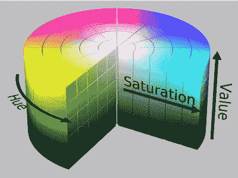
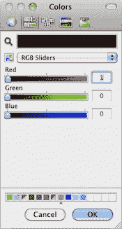
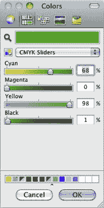
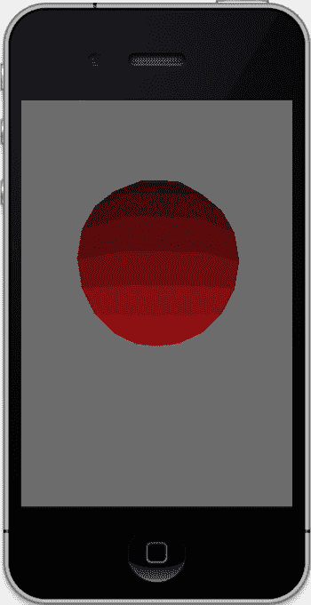
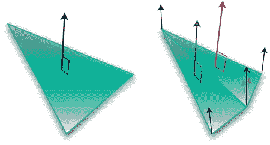

# 第 4 章：开启光照

你现在必须坚强。你绝不能放弃。当别人（或代码）让你哭泣，当你害怕黑暗时，别忘了光始终都在。

——佚名

光是第一位画家。再丑陋的物体在强光下也会变得美丽。

——拉尔夫·沃尔多·爱默生

船长，一切闪闪发光，不必担心。

——凯莉·弗莱，《萤火虫》

本章将涵盖 OpenGL ES 或许最重要的主题：照亮、着色和渲染虚拟场景的过程。我们在前一章中简单提到了颜色，但由于它对于光照和着色都至关重要，我们将在本章更深入地探讨。对于那些阅读本书平装版的人，是的，我知道，在一本黑白书中讨论颜色有些奇怪，但电子版是彩色的。

## 光与色的故事

没有光，世界将一片黑暗（废话）。没有颜色，我们将很难区分红绿灯。

我们都习以为常的光的奇妙特性——从晨雾中柔和的光线，到航天飞机主发动机的点火，再到隆冬雪地上满月害羞的苍白光芒。关于光的物理特性、本质和感知，已有大量著述。艺术家可能要花一辈子

[www.it-ebooks.info](http://www.it-ebooks.info)

**第 4 章：开启光照**

**92**

才能完全理解如何将悬浮在油中的彩色颜料涂抹在画布上，在瀑布底部创造出可信的彩虹。而这正是 OpenGL ES 在我们场景中开启光照时所面临的任务。

抛开诗意不谈，光仅仅是我们眼睛敏感的全电磁频谱的一部分。同一频谱还包括 iPhone 使用的无线电信号、帮助医生的 X 射线、数十亿年前垂死恒星发出的伽马射线，以及可以用来加热上周四 Wii 保龄球之夜剩下的披萨的微波。

光被认为有四个主要属性：波长、强度、偏振和方向。波长决定了我们感知的颜色，或者我们是否首先能看到任何东西。可见光谱从波长约 380 纳米的紫色开始，一直到波长约 780 纳米的红色。紧邻之下是紫外线，而可见光谱之上则是红外线，我们无法直接看到，但可以通过热量间接探测到。

我们感知物体颜色的方式与物体或其材料吸收或以其他方式干扰迎面而来的光线的波长有关。除了吸收，光还可能被散射（形成蓝天或日落红霞）、反射和折射。

如果有人说他们最喜欢的颜色是白色，那一定意味着所有颜色都是他们的最爱，因为白色是可见光谱中所有颜色的总和。如果是黑色，那他们不喜欢任何颜色，因为黑色是颜色的缺失。事实上，这就是为什么你不应该在温暖晴朗的日子里穿黑色衣服。你的衣服吸收了如此多的能量（以光和红外线的形式），其中一部分最终转化为热量。

**注意** 当太阳直射头顶时，每平方米的辐照度可达约 1 千瓦。其中，略多于一半是红外线，让我们感到温暖，略少于一半是可见光，而可怜的 32 瓦则是紫外线。

据说亚里士多德提出了第一个已知的颜色理论。他考虑了四种颜色，每种对应四种元素之一：气、土、水、火。

然而，当我们审视可见光谱时，你会注意到从紫色到红色有一个连续的渐变，其中既没有水也没有火。你也不会看到如今通常用于定义各个色调的离散的红、绿、蓝值。19 世纪初，英国博学家托马斯·杨提出了三色模型，使用三种颜色来模拟所有可见色调。杨提出视网膜由神经纤维束组成，这些纤维束会对不同强度的红光、绿光或紫光做出反应。德国科学家赫尔曼·冯·亥姆霍兹后来在 19 世纪中期扩展了这一理论。

[www.it-ebooks.info](http://www.it-ebooks.info)



**第 4 章：开启光照**

**93**

**注意** 杨是一位特别生动的家伙。（总得有人这么说。）他不仅是*生理光学*领域的奠基人，还在业余时间发展了光的波动理论，包括发明了经典的双缝实验，这是大学物理的基石。但等等！还有更多！他还提出了毛细现象理论，第一个以现代意义使用*能量*一词，部分破译了罗塞塔石碑的埃及部分，并设计了一种改进的乐器调音方法。

这家伙肯定严重睡眠不足。

如今，颜色最常通过红绿蓝（RGB）三元组及其相对强度来描述。每种颜色在零强度下变为黑色，随着强度增加呈现不同的色调，最终被感知为白色。由于这三种颜色需要叠加才能产生整个光谱，因此该系统是一种加法模型。


除了 RGB 模型，打印机还使用一种称为 CMYK 的减色模式，代表青色-品红-黄色-黑色（K）。由于三种原色无法产生真正的深黑色，因此添加黑色作为阴影或图形细节的强调色。

另一种常见模型是 HSV，代表色调-饱和度-明度，在许多图形软件或颜色选择器中，你会经常发现它作为 RGB 的替代方案。HSV 于 20 世纪 70 年代专门为计算机图形学开发，它将颜色描绘为一个 3D 圆柱体（图 4-1）。饱和度从内向外变化，明度从下到上变化，而色调则围绕边缘分布。其变体 HSL 用亮度替代了明度。图 4-2 展示了 macOS 颜色选择器的多个版本。





## 第 4 章：点亮灯光

## 要有光

在现实世界中，光线从四面八方涌来，携带各种颜色，当它们组合时，能创造出日常生活中的细节和丰富场景。OpenGL 并不试图复制现实世界的照明模型，因为这些模型非常复杂且耗时，通常仅供迪士尼的渲染农场使用。但它能以足够满足实时游戏需求的方式，对此进行近似模拟。

OpenGL ES 1 使用的光照模型允许我们在场景中放置多个不同类型的光源。我们可以随意开启或关闭它们，并指定方向、强度、颜色等。但这还不是全部，因为还需要描述模型的多种属性以及它如何与入射光线交互。光照定义了光源与物体以及构成物体的材质之间的相互作用方式。

着色（Shading）则进一步根据光照和材质来决定像素的颜色。请注意，一张白纸对光线的反射方式与一个粉色的、带镜面效果的圣诞装饰球完全不同。综合起来，这些属性被封装成一个称为材质（Material）的对象。将材质的属性与光的属性融合在一起，就生成了最终场景。

**注意：** OpenGL ES 2 完全没有内置光源，这完全留待程序员通过着色器自行实现。iOS 5 中新增的 GLKit 框架，通过`GLKBaseEffect`对象添加了几个光源，但这并不能作为替代版本 1 通用目的的解决方案。

OpenGL 光源的颜色最多可由三种不同的分量组成：

-   **漫反射（Diffuse）**
-   **环境光（Ambient）**
-   **镜面反射（Specular）**

漫反射光可以说来自单一方向，如太阳或手电筒。它照射到物体上，然后向四面八方散射，产生一种舒适的柔和质感。当漫反射光照射到表面时，反射量主要由入射角决定。当表面正对光源时最亮，随着表面逐渐倾斜远离光源，亮度会下降。

环境光是指不来自特定方向的光，它由环境中所有表面反射而来。环顾你所在的房间，从天花板、墙壁和家具上反弹回来的光线共同构成了环境光。如果你是一名摄影师，你会知道环境光对于让场景比单一光源更逼真有多么重要，尤其是在人像摄影中，你会使用柔和的“补光”来冲淡更亮的主光。

镜面反射光是从光泽表面反射回来的光。它来自特定方向，但以更具方向性的方式从表面反弹。它产生了我们在迪斯科球或刚清洗打蜡的汽车上看到的高光亮点。当视线与光源方向直接对齐时，它最亮，并随着我们围绕物体移动而迅速减弱。

就漫反射光和镜面反射光而言，它们通常是相同的颜色。但即使我们被限制在八个光源对象内，为每个分量设置不同的颜色实际上意味着一个 OpenGL“光源”可以同时扮演三个不同光源的角色。在这三者中，你可以考虑让环境光使用不同的颜色，通常是与主色调相对的颜色，以增强场景的视觉趣味性。在太阳系模型中，一个暗淡的蓝色环境光有助于照亮行星的暗面，并赋予其更强的 3D 质感。

**注意：** 你不必为给定光源指定所有三种类型。在简单场景中，通常只需使用漫反射光即可。

## 回归趣事（稍作停留）

我们的理论部分还没结束，不过先回到编码一会儿。之后，我会再介绍更多关于光照和着色理论的内容。

你在之前的示例中看到了，如何使用标准 RGB 版本在每个顶点上定义颜色，这样我们就能在没有光照的情况下看到我们的世界。现在，我们将创建各种类型的光源，并将它们放置在我们所谓的行星周围。OpenGL ES 必须至少支持八个光源，iOS 也是如此。当然，你可以创建更多光源，并根据需要添加或移除它们。如果你非常讲究，可以在运行时通过使用`glGet*`的多个变体之一来查询特定 OpenGL 实现支持的光源数量，从而获取此值：

```c
int numLights;
glGetIntegerv(GL_MAX_LIGHTS, &numLights);
```

**注意：** OpenGL ES 有许多实用函数，其中`glGet*()`是最常用的之一。`glGet*`调用让你能够查询各种参数的状态，比如从当前模型视图矩阵到当前的线宽。具体调用取决于所请求的数据类型。要小心不要过于频繁地使用这些调用，尤其是在生产代码中，因为它们的效率非常低。

让我们回到第 3 章的示例代码，那里有一个压扁的红蓝星球，并做以下修改：

1.  确保压扁值为 1.0，并且行星由 10 个经线段和 10 个纬线段构成。
2.  在`Planet.m`文件中，注释掉`init()`方法末尾的`blue+=colorIncrment`这一行。

你应该会看到什么？来吧，别偷看。遮住图 4-3，猜一猜。猜到了吗？现在你可以编译并运行了。图 4-3（左）就是你应该看到的结果。现在回到`initGeometry`方法，将经线段和纬线段的数量都增加到 100。这应该会得到图 4-3（右）的结果。所以，仅仅通过改变几个数字，我们就得到了一个粗略的光照和着色方案。但这只是一个固定的光照方案，一旦你想开始移动物体，它就会失效。这时，就该让 OpenGL 来承担繁重的工作了。

不幸的是，添加光源的过程并不像调用`glMakeAwesomeLightsDude()`那么简单，我们接下来就会看到。



1.  创建一个新的头文件来存放一些系统级的值，命名为`OpenGLSolarSystem.h`。目前，它应该只包含以下两行代码：

```c
#import <OpenGLES/ES1/gl.h>
#define SS_SUNLIGHT GL_LIGHT0 //GL 使用 GL_LIGHTx
```


2. 在 `solar-system` 视图控制器顶部添加 `#import "OpenGLSolarSystem.h"`。

3. 添加清单 4-1 中的代码，并在你的 `viewDidLoad()` 方法中调用它（该方法位于包含所有其他初始化器的视图控制器中）。同时确保设置当前上下文；否则你将看不到任何内容。

[www.it-ebooks.info](http://www.it-ebooks.info)

**第 4 章：开启光照**

**98**

清单 4-1. 初始化光照

```
-(void)initLighting
{
    GLfloat diffuse[]={0.0,1.0,0.0,1.0}; //1
    GLfloat pos[]={0.0,10.0,0.0,1.0};   //2
    glLightfv(SS_SUNLIGHT,GL_POSITION,pos); //3
    glLightfv(SS_SUNLIGHT,GL_DIFFUSE,diffuse); //4
    glShadeModel(GL_FLAT); //5
    glEnable(GL_LIGHTING); //6
    glEnable(SS_SUNLIGHT); //7
}
```

以下是具体说明：

光照组件采用标准的 RGBA 归一化格式。

在本例中，没有红色分量，最大绿色分量，没有蓝色分量。`alpha` 的最终值目前应保持为 `1.0`，因为后续章节将详细说明。

第 2 行指定了光源的位置。它的 `y` 坐标为 `+10`，因此它将悬浮在球体上方。

在第 3 行和第 4 行中，我们设置了光源的位置以及漫反射分量（设置为漫反射颜色）。`glLightfv()` 是一个新的调用，用于设置各种与光照相关的参数。稍后你可以使用 `glGetLightfv()` 检索这些数据，该函数从特定光源中检索任何参数。

第 5 行指定了着色模型。`GL_FLAT`（平面着色）意味着一个面是单一纯色，而将其设置为 `GL_SMOOTH`（平滑着色）则会使颜色在面内部以及面与面之间平滑混合。

最后，第 6 行告诉系统我们要使用光照，而第 7 行则启用了我们创建的一个光源。

**注意** `glLightfv()` 的最后一个参数接受一个包含四个 `GLfloat` 值的数组；`fv` 后缀代表 “float-vector”。还有 `glLightf()` 调用用于设置单值参数。

现在编译并运行。嗯？你说什么？你只看到一个像 M31 星系中心的超大质量黑洞一样大小的黑色物体？哦，我们忘了点什么，抱歉。如前所述，所有变体的 OpenGL 仍然是一个相对底层的库，因此需要程序员处理各种你期望由更高级系统管理的维护任务（在 OpenGL ES 2.0 上情况会更糟）。一旦灯光开启，预定义的顶点颜色就会被忽略，所以我们得到了黑色。考虑到这一点，我们的球体模型需要额外一层数据来告诉系统如何照亮其表面，这通过为每个顶点提供一个法线数组来实现。

[www.it-ebooks.info](http://www.it-ebooks.info)



**第 4 章：开启光照**

**99**

什么是顶点法线？面法线是垂直于平面或面的归一化向量。但在 OpenGL 中，使用的是顶点法线，因为它们能提供更好的着色效果。听起来很奇怪，一个顶点居然能有自己的“法线”。毕竟，顶点的“方向”是什么？实际上这在概念上很简单，因为顶点法线仅仅是与该顶点相邻的所有面的法线之和的归一化结果。参见图 4-4。

图 4-4. 右侧显示了一个面法线，而左侧显示了三角形扇的顶点法线。

OpenGL 需要所有这些信息来判断顶点朝向哪个“方向”，以便计算落在其上的光照量（如果有的话）。当顶点直接朝向光源时最亮，随着它开始倾斜而变暗。这意味着我们需要修改行星生成器，使其在创建顶点和颜色数组的同时创建一个法线数组，如清单 4-2 所示。

清单 4-2. 向 `planet.m` 添加法线生成器

```
- (id) init:(GLint)stacks slices:(GLint)slices radius:(GLfloat)radius squash:(GLfloat)squash
{
    unsigned int colorIncrment=0;
    unsigned int blue=0;
```


`unsigned int red=255;`

`int numVertices=0;`

`m_Scale=radius;`

`m_Squash=squash;`

`colorIncrment=255/stacks;`

```
if ((self = [super init]))
{
    m_Stacks = stacks;
    m_Slices = slices;
    m_VertexData = nil;

    // 顶点
    GLfloat *vPtr = m_VertexData =
        (GLfloat*)malloc(sizeof(GLfloat) * 3 * ((m_Slices*2+2) * (m_Stacks)));
```

[www.it-ebooks.info](http://www.it-ebooks.info)

**第 4 章：点亮灯光**

**100**

```
    // 颜色数据
    GLubyte *cPtr = m_ColorData =
        (GLubyte*)malloc(sizeof(GLubyte) * 4 * ((m_Slices*2+2) * (m_Stacks)));

    // 用于照明的法线指针。
    GLfloat *nPtr = m_NormalData =   //1
        (GLfloat*)malloc(sizeof(GLfloat) * 3 * ((m_Slices*2+2) *
                                                 (m_Stacks)));
    unsigned int phiIdx, thetaIdx;

    // 纬度
    for(phiIdx=0; phiIdx < m_Stacks; phiIdx++)
    {
        // 起始于 -1.57 弧度，上升至 +1.57 弧度。
        // 第一个圆。
        float phi0 = M_PI * ((float)(phiIdx+0) * (1.0/(float)(m_Stacks)) - 0.5);
        // 下一个，或第二个。
        float phi1 = M_PI * ((float)(phiIdx+1) * (1.0/(float)(m_Stacks)) - 0.5);
        float cosPhi0 = cos(phi0);
        float sinPhi0 = sin(phi0);
        float cosPhi1 = cos(phi1);
        float sinPhi1 = sin(phi1);

        float cosTheta, sinTheta;

        // 经度
        for(thetaIdx=0; thetaIdx < m_Slices; thetaIdx++)
        {
            // 沿着经度圆每个“切片”递增。
            float theta = 2.0*M_PI * ((float)thetaIdx) * (1.0/(float)(m_Slices-1));
            cosTheta = cos(theta);
            sinTheta = sin(theta);

            // 我们生成一对垂直的点，例如
            // 堆栈 0 的第一个点和在其上方的堆栈 1 的第一个点。
            // 这就是 TRIANGLE_STRIPS 的工作方式，
            // 取一组 4 个顶点，本质上每次绘制两个三角形。
            // 第一个是 v0-v1-v2，下一个是 v2-v1-v3，以此类推。
```

[www.it-ebooks.info](http://www.it-ebooks.info)

**第 4 章：点亮灯光**

**101**

```
            // 获取堆栈第一个顶点的 x-y-z 坐标。
            vPtr[0] = m_Scale*cosPhi0 * cosTheta;
            vPtr[1] = m_Scale*sinPhi0*m_Squash;
            vPtr[2] = m_Scale*cosPhi0 * sinTheta;

            // 相同，但对于紧邻前一个顶点上方的顶点
            vPtr[3] = m_Scale*cosPhi1 * cosTheta;
            vPtr[4] = m_Scale*sinPhi1*m_Squash;
            vPtr[5] = m_Scale* cosPhi1 * sinTheta;

            // 用于照明的法线指针。
            nPtr[0] = cosPhi0 * cosTheta;   //2
            nPtr[1] = sinPhi0;
            nPtr[2] = cosPhi0 * sinTheta;

            nPtr[3] = cosPhi1 * cosTheta;   //3
            nPtr[4] = sinPhi1;
            nPtr[5] = cosPhi1 * sinTheta;

            cPtr[0] = red;
            cPtr[1] = 0;
            cPtr[2] = blue;
            cPtr[4] = red;
            cPtr[5] = 0;
            cPtr[6] = blue;
            cPtr[3] = cPtr[7] = 255;

            cPtr += 2*4;
            vPtr += 2*3;
            nPtr +=2*3;                    //4
        }

        blue+=colorIncrment;
        red-=colorIncrment;
    }

    numVertices=(vPtr-m_VertexData)/6;
}

return self;
```

[www.it-ebooks.info](http://www.it-ebooks.info)

**第 4 章：点亮灯光**

**102**

**这里发生了什么：**

在第 1 行，法线数组被分配，每个顶点对应一个三分量法线。（同时，别忘了在`Planet.h`中添加实例变量`GLfloat *m_NormalData;`。）

第 2 行及后续行和第 3 行及后续行生成了法线数据。这看起来不像之前介绍的任何花哨的法线平均方案，那么是怎么回事呢？由于我们处理的是一个非常简单的球体对称形式，法线与未经过任何缩放值的顶点相同（以确保它们是单位向量——即长度为 1.0）。注意，其结果是`vPtr`值的计算与`nPtr`的计算几乎相同。

与另外两个指针一样，`nPtr`也会递增。

**注意** 你几乎不需要实际生成自己的法线。如果你在 OpenGL ES 中进行任何实际工作，你很可能从第三方应用程序（如 3D-Studio 或 Strata）导入模型。它们会为你生成法线数组以及其他数据。更多内容将在后续介绍。

在`Planet.h`中，将以下内容添加到行星接口中：


`GLfloat *m_NormalData;`

最后一步是修改`Planet.m`中的`execute()`方法，使其与代码清单 4-3 一致。

**代码清单 4-3. 在星球执行例程中支持光照**

```
- (bool)execute

{

glMatrixMode(GL_MODELVIEW);

glEnable(GL_CULL_FACE);

glCullFace(GL_BACK);

glEnableClientState(GL_NORMAL_ARRAY); //1

glEnableClientState(GL_VERTEX_ARRAY);

glEnableClientState(GL_COLOR_ARRAY);

glVertexPointer(3, GL_FLOAT, 0, m_VertexData);

glNormalPointer(GL_FLOAT, 0, m_NormalData); //2

glColorPointer(4, GL_UNSIGNED_BYTE, 0, m_ColorData);

glDrawArrays(GL_TRIANGLE_STRIP, 0, (m_Slices+1)*2*(m_Stacks-1)+2);

return true;

}
```

除了添加第 1 行和第 2 行以将法线数据与颜色和顶点信息一同发送到 OpenGL 管线之外，这与原始代码差别不大。如果你的模型非常简单，许多顶点共享相同的法线，则可以省略法线数组，改用`glNormal3f()`，从而节省一些内存和 CPU 开销。

让我们再做最后一次调整。在此示例中，请确保星球分配时堆栈和切片值均设回 10。这有助于更容易看清光照的部分效果。现在你可以真正编译并运行，如果得到类似图 4-5 的结果，不妨放松一下，喝杯清凉提神的饮料。

**图 4-5. 平直着色**

既然你回来了，我相信你一定注意到了有些奇怪的地方。理论上几何体是基于三角形带的，那么为什么这些面看起来是奇怪的四边三角形？

当设置为平直着色时，OpenGL 仅从单个顶点（即各个三角形的最后一个顶点）获取光照信息。现在，不要认为这些三角形带是按水平成对绘制的，而是按垂直成对松散耦合的，如图 4-6 所示。

**图 4-6. “堆叠”的三角形对**

在条带 0 中，三角形 1 将使用顶点 0、1 和 2 绘制，其中顶点 2 用于着色。三角形 2 将使用 2、1 和 3。以此类推，重复上述过程处理条带的其余部分。

接下来在条带 1 中，三角形 41 将使用顶点 4、0 和 5 绘制。但三角形 42 将使用顶点 5、0 和 2，其着色与三角形 1 使用相同的顶点。这就是垂直对组合形成“弯曲”四边形的原因。

如今很少有理由使用平直着色，因此在`initLighting()`中，将`GL_FLAT`替换为`GL_SMOOTH`。

现在你可能已经轻车熟路了：编译、运行并比较。然后为了有趣，将球体的分辨率从 10 个切片和分段减少到 5 个。在此设置下恢复为平直着色，再与平滑着色进行比较。参见图 4-7a、b 和 c。图 4-7c 尤其有趣，因为着色模型开始失效，沿面边缘出现了一些伪影。现在将球体的分辨率重新调高到 20 或 30，使其在下一节中看起来美观平滑。

**图 4-7. 从左到右：包含 20 个堆栈和 20 个切片的球体进行平滑着色，仅 5 个堆栈和切片的球体进行平直着色，以及平滑着色**

## 光与材质的趣味探索

现在，既然我们有了一个漂亮平滑的球体可以摆弄，就可以开始尝试其他光照模型和材质了。但首先做一个思想实验：假设你有一个前面提到的绿色球体，但你的漫射光却是红色的。球体会是什么颜色？（暂停，播放《危险边缘》的主题曲。）准备好了吗？嗯，在现实世界中它会是什么颜色呢？

红绿色？绿红色？紫褐色的粉红锈色？让我们试一下便知。

再次修改`initLighting()`，如代码清单 4-4 所示。注意，光照向量已重命名为其特定颜色，以使其更具可读性。

**代码清单 4-4. 添加更多光照类型和材质**

```
-(void)initLighting

{

GLfloat pos[]={0.0,3.0,0.0,1.0};

GLfloat white[]={1.0,1.0,1.0,1.0};

GLfloat red[]={1.0,0.0,0.0,1.0};

GLfloat green[]={0.0,1.0,0.0,1.0};

GLfloat blue[]={0.0,0.0,1.0,1.0};

GLfloat cyan[]={0.0,1.0,1.0,1.0};

GLfloat yellow[]={1.0,1.0,0.0,1.0};

GLfloat magenta[]={1.0,0.0,1.0,1.0};

GLfloat halfcyan[]={0.0,.5,.5,1.0};

//光照设置在此处

glLightfv(SS_SUNLIGHT,GL_POSITION,pos);

glLightfv(SS_SUNLIGHT,GL_DIFFUSE,green);

//材质设置在此处

glMaterialfv(GL_FRONT_AND_BACK, GL_DIFFUSE, red); // 1

glShadeModel(GL_SMOOTH);

glEnable(GL_LIGHTING);

glEnable(SS_SUNLIGHT);

glLoadIdentity();

}
```

如果你看到了我们的老朋友——M31 的超大质量黑洞，那么你做得很好。那么，为什么它是黑色的？这很简单；还记得本章开头关于颜色和反射的讨论吗？红色物体只有在照射到它的光包含红色成分时才呈现红色，而我们的绿光恰好不包含红色。如果你在暗室里拿着一个红色气球，并用绿光照射它，它会看起来是黑色的，因为没有绿色光反射回来。如果有人问你在暗室里拿着红气球做什么，你只需低吼一声“物理学！”，然后用一种不屑的语气告诉他们，他们不会懂的。

有了这个理解，将第 1 行中的红色漫射材质替换为绿色。你应该得到什么？对，绿色球体再次被照亮了。但你可能会注意到一件非常有趣的事情。现在的绿色看起来比添加材质之前要亮一些。图 4-8（左）显示了未指定任何材质的情况，图 4-8（右）显示了添加绿色漫射材质后的情况。

**图 4-8. 未定义绿色材质（左）与定义绿色材质后（右）**

我们再做一个实验。让我们将漫射光改为更传统的白色。那么绿色现在会怎样？红色呢？蓝色呢？由于白光包含所有颜色分量，彩色材质应该都能同样很好地显示出来。但如果你再次看到黑球，那说明你改变的是材质的颜色，而不是光照。

## 镜面光照

那么，镜面反射部分呢？在光照部分添加以下行：`glLightfv(SS_SUNLIGHT,GL_SPECULAR,red);`

在材质部分添加以下行：`glMaterialfv(GL_FRONT_AND_BACK, GL_SPECULAR, red);`

并将光源位置改为以下内容：`GLfloat pos[]={10.0,3.0,0.0,1.0};`

> **注意** `glMaterial*`的第一个参数必须始终是`GL_FRONT_AND_BACK`。在常规 OpenGL 中，允许在面的两侧使用不同的材质，但在 OpenGL ES 中不允许。然而，在 OpenGL ES 中你仍必须使用正面和背面的值，否则材质将无法正常工作。


