# 排版后的内容

将漫反射材质重置为绿色。你应该会看到一些看起来像是一大堆黄红色混杂的东西。简而言之，其原理是，还有一个我们可以用来调整光照的值。它叫做光泽度（`shininess`），用于指定物体表面的光泽程度，取值范围为 0 到 128。值越高，反射越集中，因此表面看起来越有光泽。但由于其默认值为 0，它会将镜面高光（specular wealth）均匀分布在整个星球表面。这极大地压制了绿色，以至于当与红色混合时，显示为黄色。所以，为了控制这种混乱局面，请添加以下这行代码：

`glMaterialf(GL_FRONT_AND_BACK, GL_SHININESS, 5);`

我稍后会解释这背后的真实数学原理，但现在先看看当值为 5 时会发生什么。接下来尝试 25，并与图 4-9 进行比较。光泽度值在 5 到 10 之间大致对应塑料材质；大于这个范围，则进入严肃的金属材质领域。

**图 4-9.** 光泽度分别设置为 0、5.0 和 25.0（从左到右）

[www.it-ebooks.info](http://www.it-ebooks.info)

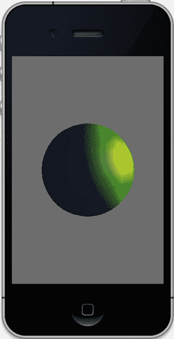
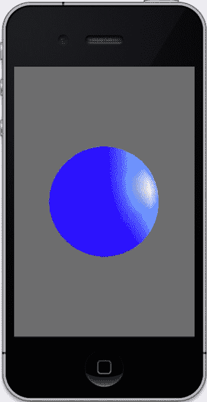

## 环境光

是时候玩一下环境光了。将以下这行代码添加到`initLighting()`中，然后编译并运行：

`glLightfv(SS_SUNLIGHT, GL_AMBIENT, blue);`

看起来像图 4-10（左）吗？如何才能得到图 4-10（右）中的图像呢？你需要添加以下这行代码：

`glMaterialfv(GL_FRONT_AND_BACK, GL_AMBIENT, blue);`

**图 4-10.** 仅有蓝色环境光（左），同时具有环境光和环境材质（右）

除了每个光源的环境光属性外，你还可以设置一个世界环境光值。基于光源的值是变量，就像所有光照参数一样，因此它们会随着距离、衰减等因素而变化。而世界环境光值在你整个 OpenGL ES 世界中是一个常量，可以按如下方式设置：

`GLfloat colorVector[4] = {r, g, b, a};`

`glLightModelfv(GL_LIGHT_MODEL_AMBIENT, colorVector);`

[www.it-ebooks.info](http://www.it-ebooks.info)

默认值是一种由红色为 0.2、绿色为 0.2、蓝色为 0.2 构成的暗灰色。这有助于确保你的物体无论如何都始终可见。同时，对于`glLightModelfv()`还有一个值，它由参数`GL_LIGHT_MODEL_TWO_SIDE`定义。该参数实际上是一个布尔型浮点数。如果它为`0.0`，则仅照亮一面；否则两面都将被照亮。默认值为`0.0`。如果你出于任何原因想要改变哪一面是正面，可以使用`glFrontFace()`并指定按顺时针或逆时针顺序排列的三角形代表正面。默认顺序是逆时针（CCW）。

## 退一步思考

那么，这里到底发生了什么？事实上，相当多。在实时计算机图形学中，有三种通用的着色模型。OpenGL ES 1 使用了其中的两种，这两种我们都见过了。第一种是扁平着色模型，它简单地用一个恒定值来为每个三角形着色。你在图 4-5 中已经看到过它的效果。在过去的好日子里，这是一个可行的选择，因为它比其他任何模型都快得多。

然而，当你口袋里的 iPhone 大致相当于一台手持的 Cray-1 超级计算机（减去大约 3 吨的重量和液体冷却系统）时，那些速度技巧真的已经成为过去式了。平滑着色模型使用插值着色，计算每个顶点的颜色，然后在整个面上进行插值。OpenGL 使用的实际着色类型是这种模型的一种特殊形式，称为 Gouraud 着色。这就是为什么顶点法线是基于所有相邻面的法线生成的。

第三种着色模型被称为 Phong 着色，由于 CPU 开销过高，OpenGL 中并未使用。它不是在整个面上插值颜色值，而是插值法线，为每个片段（即像素）生成一个法线。这有助于消除由高曲率产生的非常尖锐角度所导致的边缘伪影。Phong 着色可以减轻这种效果，但使用更多三角形来定义物体同样可以做到。

还有其他许多模型。20 世纪 70 年代，来自 JPL-Voyager 动画项目的 Jim Blinn 创建了一种 Phong 着色的修改形式，现在被称为 Blinn-Phong 模型。如果光源和观察者可以被视为处于无限远处，那么它的计算密集度会更低。

Minnaert 模型倾向于为漫反射材质增加一点对比度。Oren-Nayer 模型则为漫反射模型添加了一个“粗糙度”成分，以便更好地匹配现实。

## 自发光材质

这里还需要介绍的另一个重要的参数是`GL_EMISSION`，它会影响最终颜色。与漫反射、环境光和镜面高光不同，`GL_EMISSION`仅适用于材质，并指定材质具有自发光特性。一个自发光物体拥有自己的内部光源，例如太阳，这在太阳系模型中会很有用。要查看其效果，请将以下代码行添加到`initLighting()`中的其他材质代码中，并移除环境材质：

[www.it-ebooks.info](http://www.it-ebooks.info)

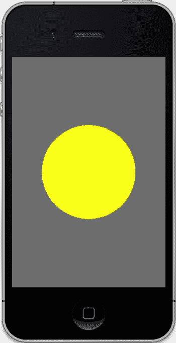
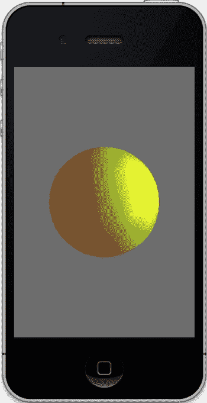

`glMaterialfv(GL_FRONT_AND_BACK, GL_EMISSION, yellow);`

因为黄色是全强度的，你预计会看到什么？大概是图 4-11a。接下来将值减半，得到如下代码：

`GLfloat yellow[] = {.5, .5, 0.0, 1.0};`

现在你看到了什么？我敢打赌它看起来像图 4-11（右）。

**图 4-11.** 一个物体，其自发光材质设置为黄色的全强度（左）；同一个场景，但强度仅为 50%（右）

表面上，自发光材质可能看起来和使用环境光的结果相似。但与环境光不同，只有场景中的单个物体会受到影响。而且，作为一个附带好处，它们不会消耗额外的光源对象。然而，如果你的自发光物体确实代表了某种真实光源（例如太阳），那么在它内部放置一个光源对象确实会为场景增加另一层真实感。

关于材质的进一步说明：如果你的物体已经指定了颜色顶点（就像我们的立方体和球体那样），那么这些值可以用来替代设置材质。你必须调用`glEnable(GL_COLOR_MATERIAL)`。这会将顶点颜色应用于着色系统，而不是使用由`glMaterial`调用指定的颜色。

[www.it-ebooks.info](http://www.it-ebooks.info)

## 衰减

在现实世界中，当然，光线会随着物体距离光源越远而减弱。OpenGL ES 也可以使用以下三个衰减因子中的一个或多个来模拟这个因素：

- `GL_CONSTANT_ATTENUATION`
- `GL_LINEAR_ATTENUATION`
- `GL_QUADRATIC_ATTENUATION`

这三个因子被组合成一个值，然后计入你模型每个顶点的总光照量中。它们通过`glLightf(GLenum light, GLenum pname, GLfloat param)`进行设置，其中`light`是你的光源 ID，例如`GL_LIGHT0`，`pname`是上述列出的三个衰减参数之一，实际值通过`param`传递。

线性衰减可用于模拟由雾气等因素引起的衰减。二次衰减则模拟了光强随距离增加而自然衰减的规律，这种衰减是指数级的。当光源距离加倍时，光照强度会减少到之前数值的四分之一。


我们先来看一个参数，`GL_LINEAR_ATTENUATION`。这三个参数背后的数学原理稍后揭晓。请在 `initLighting()` 中添加如下这一行代码：`glLightf(SS_SUNLIGHT,GL_LINEAR_ATTENUATION,.025);`

为了让视觉效果更清晰，请确保关闭自发光材质。你看到了什么？现在将 `pos` 向量中沿 X 轴的距离从 10 增加到 50。图 4-12 展示了结果。

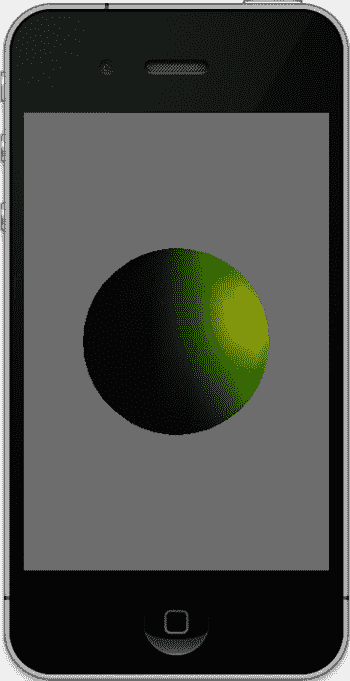

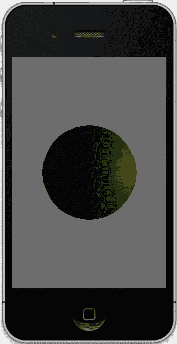

**第 4 章：点亮灯光**

**113**

**图 4-12.** 光的 x 方向距离为 10（左）和 50（右），恒定衰减系数为 0.025。

### 聚光灯

标准灯光的默认模型是各向同性的；也就是说，它们就像一个没有灯罩的台灯，向各个方向均匀（且刺眼地）发光。OpenGL 提供了三个额外的光照参数，可以将普通灯光转换为定向光：`GL_SPOT_DIRECTION`、`GL_SPOT_EXPONENT` 和 `GL_SPOT_CUTOFF`。

由于它是定向光，你需要使用 `GL_SPOT_DIRECTION` 向量来指定其方向。其默认值为 0,0,-1，指向 -Z 轴方向，如图 4-13 所示。如果你想要改变方向，可以使用类似下面的调用，使其指向 +X 轴方向：

```
GLfloat direction[]={1.0,0.0,0.0};
glLightfv(GL_LIGHT0, GL_SPOT_DIRECTION, direction);
```

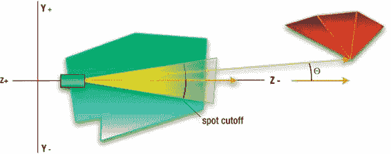

**第 4 章：点亮灯光**

**114**

**图 4-13.** 指向默认方向的聚光灯

`GL_SPOT_CUTOFF` 指定了聚光灯的光束从锥体中心开始，强度衰减到 0 时的角度，它天然就是整个光束角直径的一半。默认值为 45 度，对应 90 度的光束宽度。该值越小，光束越窄。

第三个也是最后一个聚光灯参数 `GL_SPOT_EXPONENT` 决定了光束强度的衰减速率，这是另一种形式的衰减。OpenGL ES 会计算光束中心轴与任意顶点所形成的夹角 Θ 的余弦值，并将该余弦值提升到 `GL_SPOT_EXPONENT` 次幂。由于其默认值为 0，因此在达到截止角度之前，光照区域内各处的光强度都相同，此后强度降为 0。

### 光照参数实际应用

表 4-1 总结了本节介绍的各种光照参数。

**表 4-1.** OpenGL ES 1.1 中 `glLight()` 调用所有可能的光照参数

| 名称 | 用途 |
| :--- | :--- |
| `GL_AMBIENT` | 设置灯光的**环境**分量 |
| `GL_DIFFUSE` | 设置灯光的**漫反射**分量 |
| `GL_SPECULAR` | 设置灯光的**镜面反射**分量 |
| `GL_POSITION` | 设置灯光的 x、y、z **坐标** |
| `GL_SPOT_DIRECTION` | 指定聚光灯的**方向** |
| `GL_SPOT_EXPONENT` | 指定从聚光灯束中心向外的**衰减速率** |
| `GL_SPOT_CUTOFF` | 指定从聚光灯束中心向外的**角度**，强度降为 0 |
| `GL_CONSTANT_ATTENUATION` | 指定衰减因子的**常数**部分 |
| `GL_LINEAR_ATTENUATION` | 指定衰减因子的**线性**分量；模拟雾或其他自然现象 |
| `GL_QUADRATIC_ATTENUATION` | 指定衰减因子的**二次**部分，模拟强度随距离正常减小的效果 |

### 着色背后的数学原理

如你所见，漫反射着色模型使物体看起来非常平滑。它使用了所谓的朗伯光照模型。朗伯光照模型简单地说就是：一个面越直接对准光源，它就会越亮。太阳在天空中的位置越高，你脚下的地面就会越亮。或者用更晦涩但精确的技术版本来描述：反射光的强度从 0 增加到 1，其依据是入射光线 I 与面法线 N 之间的夹角 Θ 从 90 度减小到 0 度时的余弦值 cos(Θ)。见图 4-14。这里有个快速的思维实验：当 Θ 为 90 度时，光线从侧面射入；cos(90) 为 0，因此沿 N 方向反射的光自然为 0。当光线垂直向下，与 N 平行时，cos(0) 为 1，因此最大量的光被反射回去。这可以更正式地表达如下：

\[
 I_d = k_d I_i \cos(\Theta)
\]

`Id` 是漫反射的强度，`Ii` 是入射光线的强度，`k d` 代表与物体材质粗糙度松散相关的漫反射率。“松散相关” 是指，在许多真实世界的材质中，实际表面可能有些光滑但半透明，而紧挨着表面下的层则执行散射。像这样的材质可能同时具有很强的漫反射和镜面反射分量。另外，在现实中，每个颜色波段可能有自己的 k 值，因此会有分别对应红、绿、蓝的三个值。

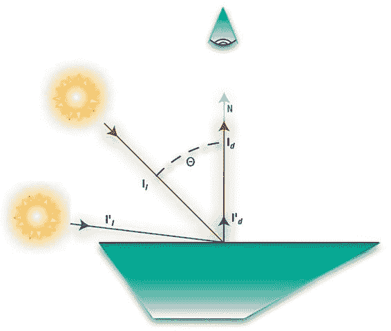

**第 4 章：点亮灯光**

**116**

**图 4-14.** 对于完美漫反射表面，入射光束的反射强度是该光束的垂直分量，即入射光束与表面法线之间夹角的余弦值。

### 镜面反射

如前所述，镜面反射除了更通用的漫反射表面之外，还能使你的模型具有光泽的外观。很少有东西是完全平整或完全闪亮的，大多数介于两者之间。事实上，地球的海洋是很好的镜面反射体，在从远处拍摄的地球图像上，可以清晰地看到海洋中反射的太阳光。

与各个方向强度相等的漫反射“反射”不同，镜面反射高度依赖于观察者的角度。我们学过，入射角等于反射角。这对于完美反射体来说确实是成立的。但除了镜子、51 年款斯图贝克汽车的车头、或者那个在你被炸飞 15 万年回到过去之前屏幕上闪过的赛隆百夫长锃亮的前额之外，很少有东西是完美的反射体。因此，入射光线会发生轻微散射；见图 4-15。

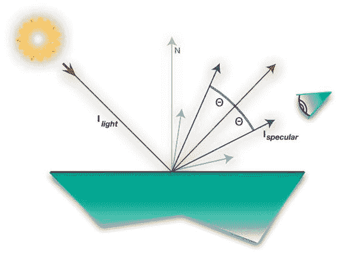

**第 4 章：点亮灯光**

**117**

**图 4-15.** 对于镜面反射，入射光线被散射，但仅围绕其反射对应光线的中心。

镜面反射分量的方程可以表示如下：

\[
 I_{specular} = W(q) I_{light} \cos^n \Theta
\]

其中：

- `Ilight` 是入射光线的强度。
- `W(q)` 是表面基于 `Ilight` 角度的反射率。
- `n` 是高光度因子（听起来耳熟吗？）。
- `Θ` 是反射光线与射入眼睛的光线之间的夹角。

这实际上是基于所谓的菲涅耳反射定律，`W(q)` 值就来源于此。虽然 `W(q)` 没有直接用于 OpenGL ES 1（因为它随入射角变化，比镜面反射光照模型稍微复杂一些），但它可以在 OpenGL ES 2 版本的着色器中使用。在这种情况下，例如，它在模拟水面反射时特别有用。在 OpenGL ES 1 中，替代它的是一个基于材质设定的镜面反射值的常量。

高光度因子，也称为镜面反射指数，就是我们之前操作过的那个。然而，在现实生活中，n 可以远高于 128 这个最大值。

## 衰减

现在回到前面列出的三种衰减：常数衰减、线性衰减和二次衰减。


总衰减计算如下，其中`kc`是常数，`kl`是线性值，`kq`是二次分量，`d`表示光源到任意顶点的距离：

`k = 1`

`t`

`k + k d + k d²`

`( )`

`c`

`l`

`q`

**总结**

现在你可以看到，在场景中任何模型的顶点颜色和强度生成过程中，存在许多影响因素，包括：

- 距离衰减
- 漫反射光和材质
- 镜面反射光和材质
- 聚光灯参数
- 环境光和材质
- 光泽度
- 材质的自发光

你可以将这些因素视为作用于整个颜色向量，或作用于颜色的每个独立`R`、`G`、`B`分量。

因此，明确定义后，最终顶点颜色如下：

`color = ambient`

`+`

`+ emissive`

`+ intensity`

`world model`

`ambientmaterial`

`material`

`light`

其中：

`n − 1`

`intensity`

`∑ ( spot light factor)`

`light =`

`( attenuation factor) i`

`i`

`i = 0`

`ambient`

`ambient`

`[ +cos(Θ) ^shininess specular specular ]`

`light`

`material`

`light`

`material`

换句话说，颜色等于不受光源控制的部分加上所有光源的强度，同时考虑了衰减、漫反射、镜面反射和聚光灯元素。

[www.it-ebooks.info](http://www.it-ebooks.info)

**第 4 章：点亮灯光**

**119**

当计算时，这些值分别作用于所讨论颜色的每个`R`、`G`、`B`分量。

**这一切有什么意义？**

了解底层原理的一个好处是，它有助于让`OpenGL`及相关工具不再那么神秘。就像学习一门外语，比如克林贡语（如果你，亲爱的读者，是克林贡人，`majQa’ nuqDaq ‘oH puchpa’ ‘e’`！），它就不再是以前的神秘事物了；曾经咆哮是咆哮，怒吼是怒吼，现在你可能认出它是一首关于好茶的优美诗歌。

另一个原因是，如前所述，所有这些高级工具在`OpenGL ES 2.0`中都不存在。大多数早期的着色算法都必须由你在称为着色器的小段代码中实现。幸运的是，关于最常见着色器的信息可以在互联网上找到，并且复制上述信息是相对直接的。

**更多有趣的内容**

现在，掌握了所有这些光子学知识，是时候回到编码并引入多个光源了。辅助光源可以以很小的努力为场景的真实感带来令人惊讶的巨大提升。

回到`initLighting()`方法，使其看起来像代码清单 4-5。这里我们添加了两个额外的光源，分别命名为`SS_FILLLIGHT1`和`SS_FILLLIGHT2`。将它们的定义添加到头文件中：

```
#define SS_FILLLIGHT1 GL_LIGHT1
#define SS_FILLLIGHT2 GL_LIGHT2
```

现在编译并运行。你是否看到了图 4-16（左）？这就是前面提到的`Gouraud`着色模型失效的地方，暴露了三角形的边缘。解决方案是什么？此时，只需将切片和堆叠的数量从 20 增加到 50，你将得到更令人满意的图像，如图 4-16（右）所示。

代码清单 4-5 添加两个填充光源

```
-(void)initLighting
{
    GLfloat posMain[]={5.0,4.0,6.0,1.0};
    GLfloat posFill1[]={-15.0,15.0,0.0,1.0};
    GLfloat posFill2[]={-10.0,-4.0,1.0,1.0};
    GLfloat white[]={1.0,1.0,1.0,1.0};
    GLfloat red[]={1.0,0.0,0.0,1.0};
    GLfloat dimred[]={.5,0.0,0.0,1.0};
    [www.it-ebooks.info](http://www.it-ebooks.info)

**第 4 章：点亮灯光**

**120**

    GLfloat green[]={0.0,1.0,0.0,0.0};
    GLfloat dimgreen[]={0.0,.5,0.0,0.0};
    GLfloat blue[]={0.0,0.0,1.0,1.0};
    GLfloat dimblue[]={0.0,0.0,.2,1.0};
    GLfloat cyan[]={0.0,1.0,1.0,1.0};
    GLfloat yellow[]={1.0,1.0,0.0,1.0};
    GLfloat magenta[]={1.0,0.0,1.0,1.0};
    GLfloat dimmagenta[]={.75,0.0,.25,1.0};
    GLfloat dimcyan[]={0.0,.5,.5,1.0};
    // Lights go here.
}
```


`glLightfv(SS_SUNLIGHT,GL_POSITION,posMain);`

`glLightfv(SS_SUNLIGHT,GL_DIFFUSE,white);`

`glLightfv(SS_SUNLIGHT,GL_SPECULAR,yellow);`

`glLightfv(SS_FILLLIGHT1,GL_POSITION,posFill1);`

`glLightfv(SS_FILLLIGHT1,GL_DIFFUSE,dimblue);`

`glLightfv(SS_FILLLIGHT1,GL_SPECULAR,dimcyan);`

`glLightfv(SS_FILLLIGHT2,GL_POSITION,posFill2);`

`glLightfv(SS_FILLLIGHT2,GL_SPECULAR,dimmagenta);`

`glLightfv(SS_FILLLIGHT2,GL_DIFFUSE,dimblue);`

`glLightf(SS_SUNLIGHT,GL_QUADRATIC_ATTENUATION,.005);`

`//Materials go here.`

`glMaterialfv(GL_FRONT_AND_BACK, GL_DIFFUSE, cyan);`

`glMaterialfv(GL_FRONT_AND_BACK, GL_SPECULAR, white);`

`glMaterialf(GL_FRONT_AND_BACK,GL_SHININESS,25);`

`glShadeModel(GL_SMOOTH);`

`glLightModelf(GL_LIGHT_MODEL_TWO_SIDE,0.0);`

`glEnable(GL_LIGHTING);`

`glEnable(SS_SUNLIGHT);`

`glEnable(SS_FILLLIGHT1);`

`glEnable(SS_FILLLIGHT2);`

`glLoadIdentity();`

`}`

[www.it-ebooks.info](http://www.it-ebooks.info)

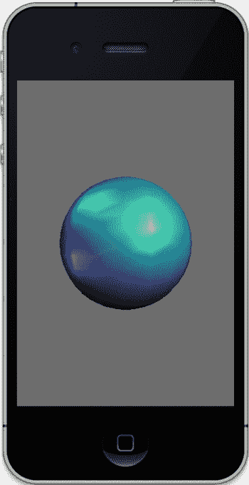

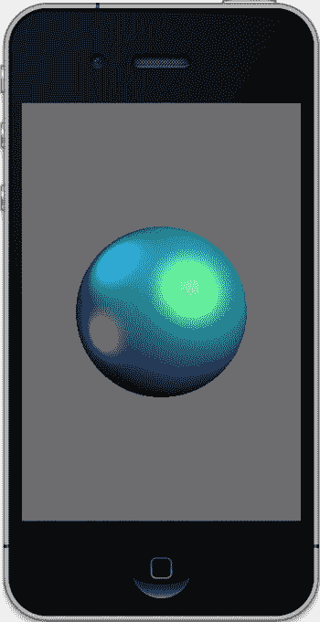

## 第 4 章：开启灯光

**121**

图 4-16：三盏灯光，一盏主灯和两盏补光灯。左侧图像为低分辨率球体，右侧为高分辨率球体。

在前面的示例中，涵盖了一些新的 API 调用，这些调用总结在表 4-2 中。请熟悉它们——它们是你的得力助手，今后你会频繁使用它们。

**表 4-2：涵盖的新 API 调用**

| 名称 | 用途 |
|------|---------|
| `glGetLight` | 从特定光源中检索任何参数 |
| `glLight*` | 设置光源的参数 |
| `glLightModel` | 指定光照模型，可以是 `GL_LIGHT_MODEL_AMBIENT` 或 `GL_LIGHT_MODEL_TWO_SIDE` |
| `glMaterialfv` | 定义当前材质的属性 |

[www.it-ebooks.info](http://www.it-ebooks.info)

## 第 4 章：开启灯光

**122**

续表

| 名称 | 用途 |
|------|---------|
| `glNormal` | 为面数组分配单个法线 |
| `glNormalPointer` | 在执行方法中指定对象的当前法线数组 |
| `glShadeModel` | 可以是 `GL_FLAT` 或 `GL_SMOOTH` |
| `glPopMatrix` | 从当前栈中弹出一个矩阵 |
| `glPushMatrix` | 将矩阵推入当前栈中 |

## 回到太阳系

现在我们有了足够的工具可以回到太阳系项目了。稍安勿躁，这里有很多内容需要讲解。特别是一些与光照或材质无关，但需要在太阳系模型变得更复杂之前处理的 OpenGL 其他方面。

首先，我们需要在 `OpenGLSolarSystemController.h` 中添加一些新的方法声明和实例变量。详见代码清单 4-6。

**代码清单 4-6：为支持太阳系而添加的头文件内容**

```
#import <Foundation/Foundation.h>
#import <GLKit/GLKit.h>
#import "OpenGLSolarSystem.h"
#import "Planet.h"

#define X_VALUE 0
#define Y_VALUE 1
#define Z_VALUE 2

@interface OpenGLSolarSystemController : NSObject
{
    Planet *m_Earth;
    Planet *m_Sun;
    GLfloat m_Eyeposition[3];
}

-(void)execute;
-(void)executePlanet:(Planet *)planet;
-(id)init;
-(void)initGeometry;

@end
```

[www.it-ebooks.info](http://www.it-ebooks.info)

## 第 4 章：开启灯光

**123**

接下来，需要生成第二个对象（本例中为我们的太阳），并设置其大小和位置。

同时，我们还需要调整地球的大小，使其比太阳更小。因此，将 `OpenGLSolarSystemController` 中的 `initGeometry()` 方法替换为代码清单 4-7 的内容。

**代码清单 4-7：添加第二个对象并初始化观察者位置**

```
-(void)initGeometry
{
    m_Eyeposition[X_VALUE]=0.0; //1
    m_Eyeposition[Y_VALUE]=0.0;
    m_Eyeposition[Z_VALUE]=5.0;

    m_Earth=[[Planet alloc] init:50 slices:50 radius:.3 squash:1.0]; //2
    [m_Earth setPositionX:0.0 Y:0.0 Z:-2.0]; //3

    m_Sun=[[Planet alloc] init:50 slices:50 radius:1.0 squash:1.0]; //4
    [m_Sun setPositionX:0.0 Y:0.0 Z:0.0];
}
```

以下是具体说明：

现在，我们的视点已在 Z 轴上精确定位到了 +5 的位置，如第 1 行 ff 所定义。


在第 2 行中，地球的直径被缩小为 `.3`。

在第 3 行中，我们将地球的位置初始化为从我们的视角看位于太阳后方，即 `z=-2`。

现在，我们可以创建太阳，并将其放置在我们这个模拟太阳系的精确中心位置。

`InitLighting()` 函数需要看起来像清单 4-8 所示，它已经清除了前面示例中的所有杂乱代码。

**清单 4-8. 太阳系模型的扩展光照设置**

```
-(void)initLighting
{
    GLfloat sunPos[]={0.0,0.0,0.0,1.0};
    GLfloat posFill1[]={-15.0,15.0,0.0,1.0};
    GLfloat posFill2[]={-10.0,-4.0,1.0,1.0};
    GLfloat white[]={1.0,1.0,1.0,1.0};
    GLfloat dimblue[]={0.0,0.0,.2,1.0};
    GLfloat cyan[]={0.0,1.0,1.0,1.0};
    GLfloat yellow[]={1.0,1.0,0.0,1.0};
    GLfloat magenta[]={1.0,0.0,1.0,1.0};
    GLfloat dimmagenta[]={.75,0.0,.25,1.0};
    GLfloat dimcyan[]={0.0,.5,.5,1.0};

    //此处放置灯光设置。
    glLightfv(SS_SUNLIGHT,GL_POSITION,sunPos);
    glLightfv(SS_SUNLIGHT,GL_DIFFUSE,white);
    glLightfv(SS_SUNLIGHT,GL_SPECULAR,yellow);

    glLightfv(SS_FILLLIGHT1,GL_POSITION,posFill1);
    glLightfv(SS_FILLLIGHT1,GL_DIFFUSE,dimblue);
    glLightfv(SS_FILLLIGHT1,GL_SPECULAR,dimcyan);

    glLightfv(SS_FILLLIGHT2,GL_POSITION,posFill2);
    glLightfv(SS_FILLLIGHT2,GL_SPECULAR,dimmagenta);
    glLightfv(SS_FILLLIGHT2,GL_DIFFUSE,dimblue);

    //此处放置材质设置。
    glMaterialfv(GL_FRONT_AND_BACK, GL_DIFFUSE, cyan);
    glMaterialfv(GL_FRONT_AND_BACK, GL_SPECULAR, white);

    glLightf(SS_SUNLIGHT,GL_QUADRATIC_ATTENUATION,.001);

    glMaterialf(GL_FRONT_AND_BACK,GL_SHININESS,25);

    glShadeModel(GL_SMOOTH);
    glLightModelf(GL_LIGHT_MODEL_TWO_SIDE,0.0);

    glEnable(GL_LIGHTING);
    glEnable(SS_SUNLIGHT);
    glEnable(SS_FILLLIGHT1);
    glEnable(SS_FILLLIGHT2);
}
```

自然，太阳系控制器的顶级 `execute` 方法必须彻底修改，同时还要添加一个小的实用函数，如清单 4-9 所示。

**清单 4-9. 太阳系的 `execute` 方法**

```
-(void)execute
{
    GLfloat paleYellow[]={1.0,1.0,0.3,1.0}; //1
    GLfloat white[]={1.0,1.0,1.0,1.0};
    GLfloat cyan[]={0.0,1.0,1.0,1.0};
    GLfloat black[]={0.0,0.0,0.0,0.0}; //2
    static GLfloat angle=0.0;
    GLfloat orbitalIncrement=1.25; //3
    GLfloat sunPos[3]={0.0,0.0,0.0,1.0};

    glPushMatrix(); //4

    glTranslatef(-m_Eyeposition[X_VALUE],-m_Eyeposition[Y_VALUE], //5
                 -m_Eyeposition[Z_VALUE]);

    glLightfv(SS_SUNLIGHT,GL_POSITION,sunPos); //6
    glMaterialfv(GL_FRONT_AND_BACK, GL_DIFFUSE, cyan);
    glMaterialfv(GL_FRONT_AND_BACK, GL_SPECULAR, white);

    glPushMatrix(); //7

    angle+=orbitalIncrement; //8

    glRotatef(angle,0.0,1.0,0.0); //9

    [self executePlanet:m_Earth]; //10

    glPopMatrix(); //11

    glMaterialfv(GL_FRONT_AND_BACK, GL_EMISSION, paleYellow); //12
    glMaterialfv(GL_FRONT_AND_BACK, GL_SPECULAR, black); //13

    [self executePlanet:m_Sun]; //14

    glMaterialfv(GL_FRONT_AND_BACK, GL_EMISSION, black); //15

    glPopMatrix(); //16
}

-(void)executePlanet:(Planet *)planet
{
    GLfloat posX, posY, posZ;

    GLfloat angle=0;

    glPushMatrix();

    [planet getPositionX:&posX Y:&posY Z:&posZ]; //17

    glTranslatef(posX,posY,posZ); //18

    [planet execute]; //19

    glPopMatrix();
}
```

以下是具体说明：

第 1 行创建了一种更浅的黄色。这只是为了让太阳的颜色略微更准确一些。

我们需要一种黑色，以便在需要时“关闭”某些材质特性，如第 2 行所示。

在第 3 行中，需要轨道增量来让地球绕太阳公转。


```markdown
第 4 行的 `glPushMatrix()` 是一个新的 API 调用。当它与 `glPopMatrix()` 配合使用时，有助于将世界某一部分的变换与另一部分隔离开来。在这种情况下，第一个 `glPushMatrix()` 实际上防止了后续对 `glTranslate()` 的调用在自身基础上累加新的平移。你可以移除这对 `glPush`/`PopMatrix` 调用，并将 `glTranslate()` 移出 `execute()`，放入初始化代码中，只要它只被调用一次即可。

第 5 行的平移确保了物体从我们的视点处“移开”。记住，在 OpenGL ES 世界中，一切实际上都是围绕视点旋转的。我更倾向于拥有一个不依赖于观察者位置的世界原点，在这个例子中，原点就是太阳的位置，用相对于视点的偏移量来表示。

第 6 行只是强制执行太阳位于原点。哦！第 7 行又有一个 `glPushMatrix()`。这确保了地球上的任何变换都不会影响太阳。

第 8 行和第 9 行让地球围绕太阳公转。怎么做到的？第 10 行调用了一个小的实用函数。该函数执行必要的平移，并在地球需要时将其移离原点。回想一下，变换可以被理解为“最后调用，最先使用”。因此，`executePlanets()` 中的平移实际上先执行，然后才是 `glRotation()`。请注意，这种方法会让地球以完美的圆形轨道运行，而实际上，没有行星拥有完美的圆形轨道，因此之后会使用 `glTranslation()`。

第 11 行的 `glPopMatrix()` 丢弃了所有仅适用于地球的变换。

第 12 行将太阳的材质设置为自发光。请注意，对 `glMaterialfv()` 的调用并不绑定到任何特定对象。它们仅设置当前材质，该材质会被所有后续对象使用，直到下一次调用发生。第 13 行关闭了用于地球的高光设置。

第 14 行再次调用了我们的实用函数，这次是为太阳调用。

[www.it-ebooks.info](http://www.it-ebooks.info)

# 第 4 章：开启光照

**127**

自发光材质属性在第 15 行被关闭，随后是另一个 `glPopMatrix()`。请注意，每次使用压栈矩阵时，都必须与一个出栈配对。OpenGL ES 可以处理最多 16 层的栈。此外，由于 OpenGL 使用了三种矩阵（模型视图矩阵、投影矩阵和纹理矩阵），请确保你是在正确的栈上进行压栈/出栈操作。你可以通过记住使用 `glMatrixMode()` 来确保这一点。

现在，在 `executePlanet()` 中，第 17 行获取了行星的当前位置，以便第 18 行可以将行星平移到正确位置。在本例中，它实际上从未改变，因为我们让 `glRotatef()` 来处理轨道职责。否则，xyz 坐标会作为时间的函数不断变化。

最后，在第 19 行调用行星自身的 `execute` 例程。

我们快完成了。`Planet.h`（清单 4-10）和 `Planet.m`（清单 4-11）需要修改以保存一些状态信息。请注意，我非常老派，倾向于自己编写 setter/getter 方法。

清单 4-10. 对 Planet.h 的修改以支持太阳系模型

```
#import <Foundation/Foundation.h>
#import <OpenGLES/ES1/gl.h>

@interface Planet : NSObject
{
    @private
    GLfloat *m_VertexData;
    GLubyte *m_ColorData;
    GLfloat *m_NormalData;
    GLint m_Stacks, m_Slices;
    GLfloat m_Scale;
    GLfloat m_Squash;
    GLfloat m_Angle;
    GLfloat m_Pos[3];
    GLfloat m_RotationalIncrement;
}

-(bool)execute;
-(id) init:(GLint)stacks slices:(GLint)slices radius:(GLfloat)radius squash:(GLfloat)squash;
-(void)getPositionX:(GLfloat *)x Y:(GLfloat *)y Z:(GLfloat *)z;
-(void)setPositionX:(GLfloat)x Y:(GLfloat)y Z:(GLfloat)z;
-(GLfloat)getRotation;
-(void)setRotation:(GLfloat)angle;
-(GLfloat)getRotationalIncrement;
-(void)setRotationalIncrement:(GLfloat)inc;
-(void)incrementRotation;

@end
```

[www.it-ebooks.info](http://www.it-ebooks.info)

# 第 4 章：开启光照

**128**

在 `Planet.m` 中，将以下初始化代码添加到 `init()` 方法的最末尾：

```
m_Angle=0.0;
m_RotationalIncrement=0.0;
m_Pos[0]=0.0;
m_Pos[1]=0.0;
m_Pos[2]=0.0;
```

并在 `execute` 方法之后，添加清单 4-11 中的代码，定义这些新方法。

清单 4-11. 对 Planet.m 的修改

```
-(void)getPositionX:(GLfloat *)x Y:(GLfloat *)y Z:(GLfloat *)z
{
    *x=m_Pos[0];
    *y=m_Pos[1];
    *z=m_Pos[2];
}

-(void)setPositionX:(GLfloat)x Y:(GLfloat)y Z:(GLfloat)z
{
    m_Pos[0]=x;
    m_Pos[1]=y;
    m_Pos[2]=z;
}

-(GLfloat)getRotation
{
    return m_Angle;
}

-(void)setRotation:(GLfloat)angle
{
    m_Angle=angle;
}

-(void)incrementRotation
{
    m_Angle+=m_RotationalIncrement;
}

-(GLfloat)getRotationalIncrement
{
    return m_RotationalIncrement;
}

-(void)setRotationalIncrement:(GLfloat)inc
{
    m_RotationalIncrement=inc;
}
```

[www.it-ebooks.info](http://www.it-ebooks.info)

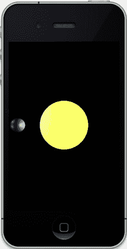

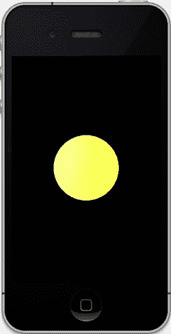

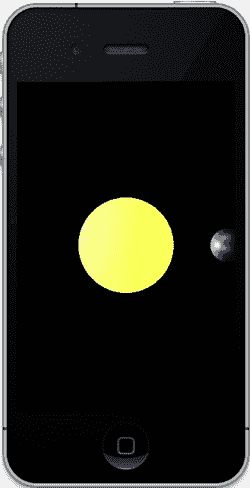

# 第 4 章：开启光照

**129**

趁此机会，我们把背景中的灰色调暗一点。这应该是太空，而太空不是灰色的。转到 `OpenGLSolarSystemViewController` 和主 `drawInRect()` 例程，将对 `glClearColor` 的调用修改如下：`glClearColor(0.0,0.0, 0.0, 1.0);`

现在编译并运行。你应该会看到类似于图 4-17 的内容。

图 4-17. 中间发生了什么？

这里有些奇怪。运行时，你应该看到地球从太阳左侧的后方出现，绕向我们并穿过太阳前方，然后远离而去，重复这个轨道。但是，在图 4-17（中间）中，当地球应该在太阳前方时，发生了什么？

在所有图形（无论是计算机图形还是其他）中，绘制顺序都起着重要作用。如果你在画一幅肖像，你会先画背景。如果你在生成一个小型太阳系，应该先画太阳（呃，也许不一定……或者说不总是这样）。

渲染顺序，或者说深度排序，以及如何确定哪些物体遮挡了其他物体，一直是计算机图形学的重要部分。在太阳被添加之前，渲染顺序无关紧要，因为只有一个物体。但随着世界变得复杂得多，你会发现有两种通用的方法可以解决这个问题。

[www.it-ebooks.info](http://www.it-ebooks.info)

# 第 4 章：开启光照

**130**

第一种方法称为画家算法。这意味着简单地先绘制最远的物体。在像一颗球体绕着另一颗球体旋转这样简单的事情中，这非常容易。但是，当你拥有像《魔兽世界》或《第二人生》这样非常复杂的三维沉浸式世界时，会发生什么？这些游戏实际上会使用画家算法的一种变体，但会预先计算一些信息，以确定所有可能的遮挡顺序。
```


该信息随后被用于构建一颗二叉空间分割（BSP）树。3D 世界中的任何位置都可以映射到该树中的一个元素，通过遍历该树，可以根据观察者的位置获取最佳绘制顺序。这种方法执行速度非常快，但设置起来很复杂。幸运的是，对于我们简单的宇宙来说，这完全是杀鸡用牛刀。第二种深度排序方法并非真正的排序，而是利用了每个像素的`z`分量。屏幕上的像素有`x`和`y`值，尽管我面前的`Viewsonic`显示器是平面的 2D 表面，但它也可以有一个`z`值。当一个像素准备绘制在另一个像素之上时，会比较它们的`z`值，距离更近的那个像素胜出。这种方法称为`z-buffering`（深度缓冲），它非常简单直观，但对于非常复杂的场景，可能会消耗额外的 CPU 时间和显存。我更喜欢后者，并且`OpenGL`使得实现`z-buffering`非常容易，但`GLKit`让它变得更简单。在撰写本书时，`iOS5`发布了，我欣喜地发现，我可以愉快地删除大约 1.5 页的代码和注释，只需在视图控制器的初始化代码中添加一行即可：

```
glEnable(GL_DEPTH_TEST);
```

现在，`GLKViewController`管理所有设置代码，而`Apple`的向导生成的代码默认使用深度缓冲区，格式为：

```
view.drawableDepthFormat = GLKViewDrawableDepthFormat24;
```

你可以选择不使用缓冲区，或使用 16 位或 24 位分辨率的缓冲区。额外的 8 位保留给模板缓冲区（`stencils`）使用，这将在后面介绍。

如果一切正常，你现在应该能看到地球在太阳前方时会遮挡太阳，而在太阳后方时则被遮挡。见图 4-18。

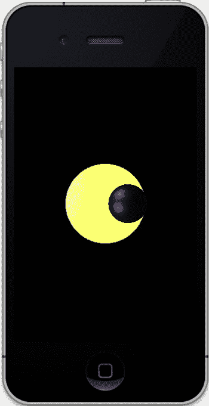

**图 4-18.** 使用 z-buffer

**总结**

本章涵盖了场景光照和着色的各种方法，以及用于确定每个顶点颜色的数学算法。你还学习了漫反射、镜面反射、自发光和环境光照，以及将普通灯光变为聚光灯的相关参数。太阳系模型进行了更新，以支持多个对象，并使用`z-buffering`来正确处理对象遮挡。

[www.it-ebooks.info](http://www.it-ebooks.info)

## 第 5 章 纹理

人的真正价值不在于其本身，而在于他人生命中焕发出的色彩与质感。
——阿尔伯特·施韦泽

如果生活中没有了纹理，人们将变得相当乏味。去除那些有趣的小怪癖和古怪之处，将会带走我们日常生活中的一点光彩，无论它们是奇特却迷人的小习惯，还是意想不到的才能。想象一下那位恰好是出色舞者的高中看门人，那位只穿全新白袜子的著名喜剧演员，那位害怕手写信件的成功游戏工程师——他们都能让我们会心一笑，并为每一天增添一点惊奇。在创建人工世界时也是如此。计算机能够生成的视觉完美或许很漂亮，但如果你想为你的场景营造一种真实感，它总感觉不太对劲。这就是纹理的用武之地。

纹理使完美之物变为真实之物。《美国传统词典》这样描述它：“某物独特的物理组成或结构，特别是关于其各部分的尺寸、形状和排列。”

相当富有诗意，是吧？

在 3D 图形世界中，纹理与光照一样，对于创建引人入胜的图像至关重要，并且如今可以以令人惊讶的少量工作量将其整合进来。图形芯片行业的大部分工作都根植于以比前一代硬件更高的速率渲染越来越精细的纹理。

由于`OpenGL ES`中的纹理是一个如此庞大的主题，本章将局限于基础知识，更高级的主题和技术将留到下一章。考虑到这一点，让我们开始吧。

[www.it-ebooks.info](http://www.it-ebooks.info)

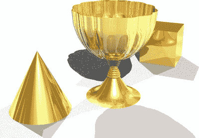

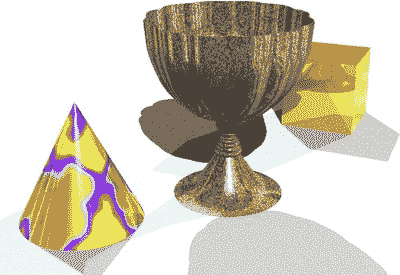

**纹理的语言**

假设你想在你正在开发的游戏中创建一个飞机跑道。你会怎么做？简单，拿几个黑色三角形，把它们拉得很长。砰！你的跑道就有了！别急，伙计。跑道中央的划线怎么办？用一堆小的白色面怎么样？这可行。但别忘了跑道尽头的黄色`V`形标志。嗯，再加一堆面并把它们涂成黄色。还有数字呢？通往停机坪的曲线呢？很快你可能就要用到数百个三角形，但这仍然无法解决油污、修补痕迹、刹车痕和路面动物尸体的问题。现在事情开始变得复杂了。要想获得所有精细细节，可能需要数千甚至数万个面。与此同时，你的朋友`Arthur`也在创建一条跑道。你正在和他比较心得，告诉他你的多边形数量，而你甚至还没谈到路面动物尸体。`Arthur`说他只需要几个三角形和一张图片。你看，他使用了纹理贴图，而使用纹理贴图可以创建出高度细节化的表面，例如跑道、砖墙、盔甲、云彩、吱吱作响的破旧木门、遥远星球上布满陨石坑的地形，或者一辆生锈的 56 年款别克轿车的外观。

在计算机图形学的早期，纹理（或纹理映射）消耗了两种最宝贵的资源：CPU 周期和内存。纹理映射被谨慎使用，并且人们采用了各种小技巧来节省这两种资源。如今，内存几乎是免费的（与 20 年前相比），而现代芯片拥有看似无限的速度，使用纹理不再是一个需要你熬夜纠结的决定。

**关于纹理的一切（大部分）**

纹理有两大类型：程序化纹理和图像纹理。程序化纹理是基于某种算法即时生成的。有用于木材、大理石、沥青、石头等的“方程”。几乎任何种类的材料都可以简化为一种算法，从而绘制到物体上，如图 5-1 所示。

**图 5-1.** 一个金色圣杯（左图）。通过使用程序化纹理映射（右图），圣杯可以由金矿石构成，而圆锥体则使用了大理石贴图。

[www.it-ebooks.info](http://www.it-ebooks.info)

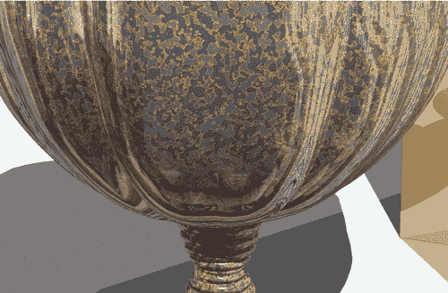

程序化纹理非常强大，因为它们可以产生无限多种可缩放图案，这些图案可以放大以显示越来越多的细节，如图 5-2 所示。否则，这将需要一张巨大的静态图像。

**图 5-2.** 图 5-1（右图）中高脚杯的特写。注意那些精细的细节，这需要一张非常大的图像才能实现。

用于生成图 5-2 中图像的 3D 渲染应用程序`Strata Design 3D-SE`同时支持程序化纹理和基于图像的纹理。图 5-3 显示了用于指定图 5-2 中金矿石纹理参数的对话框。

[www.it-ebooks.info](http://www.it-ebooks.info)

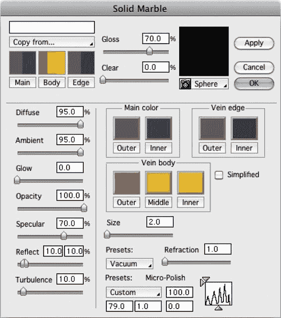

**图 5-3.** 用于生成图 5-2 中金矿石纹理的所有可能设置。


## 程序化纹理与图像纹理

程序化纹理，以及程度稍逊的图像纹理，可按照从随机到结构化的复杂度谱系进行分类。随机纹理（或称随机噪声纹理）可理解为"看起来像噪点"，例如沙子、灰尘、碎石、纸张纹路等细粒材质。接近随机纹理的包括火焰、草地或湖面。而结构化纹理具有清晰可辨的广泛特征与图案，砖墙、柳编筐、格子布或一群壁虎都属于此类。

## 图像纹理

如前所述，图像纹理即其字面意思。它们可用作表面或材质纹理，例如桃花心木、钢板或散落地面的树叶。处理得当的话，这些纹理可以无缝平铺，覆盖远超原始图片面积的大范围表面。由于源自真实世界，它们无需使用生成程序化纹理所需的专业软件。图 5-4 展示了圣杯场景，这次圣杯使用桃花心木纹理，圆锥体使用赤杨木纹理，而立方体保持金色。

图 5-4. 使用真实世界的图像纹理

除了作为材质使用，图像纹理还能以图片形式直接存在于你的三维世界中。渲染出的 iPad 图像可以将纹理"嵌入"屏幕位置。三维城市建筑可使用真实照片作为窗户、广告牌，或客厅里的家庭照片。

## OpenGL ES 与纹理

当 OpenGL ES 渲染物体时（如第 4 章的迷你太阳系），它会绘制每个三角形，并根据构成每个面的三个顶点进行光照和着色，然后欢快地转向下一个三角形（想必还会哼着轻快小调）。纹理不过是一张图像。如本章前面所学，它可以实时生成以处理上下文相关的细节（如云层图案），也可以是 JPEG、PNG 或其他格式。纹理由像素组成，但作为纹理使用时，这些像素被称为**纹素 (texels)**。你可以把 OpenGL ES 纹理想象成由大量彩色小"面片"（即纹素）组成，每个面片尺寸相同，拼接成一张例如每边 256 个面片的"大布"。每个面片大小相等，可拉伸或压缩，以适应任意尺寸或形状的表面。它们没有需要存储 `xyz` 值的角点几何数据，能呈现多种绚丽色彩，性价比极高，而且用途极其广泛。

与几何体一样，纹理拥有自己的坐标空间。几何体使用经典的笛卡尔坐标 `x`、`y`、`z` 标记各个部件的坐标，而纹理使用 `s` 和 `t`。将纹理应用于几何物体的过程称为 UV 映射（`s` 和 `t` 仅用于 OpenGL 环境，其他环境使用 `u` 和 `v`——真是令人费解）。

那么，这是如何应用的呢？假设你有一块方形桌布，必须让它适配一张矩形桌子。你需要沿桌布一侧将其牢固贴合，然后沿另一侧拉扯拉伸，直到刚好覆盖桌面。你可以只固定四个角，但若想让它真正"贴合"，还可以沿边缘甚至中间部位进行固定——纹理适配表面的原理与此类似。

纹理坐标空间是归一化的：即 `s` 和 `t` 的取值范围均为 0 到 1。它们是无量纲的抽象实体，不依赖于源或目标的尺寸。因此，待纹理化的面将在其顶点上携带介于 0.0 到 1.0 之间的 `s` 和 `t` 值，如图 5-5 所示。

图 5-5. 无论纹理内容如何，纹理坐标范围都是 0 到 1.0

在最基础的示例中，我们可以将矩形纹理直接应用于矩形面，如图 5-5 所示。但如果你只需要纹理的一部分呢？你可以提供一个仅包含所需部分的 PNG 图像，但如果需要多种变体，这就不太方便了。不过，还有另一种方法：只需改变目标面的 `s` 和 `t` 坐标。假设你只想要被我称为"海德利"的复活节岛雕像的左上四分之一部分。你需要做的就是更改目标面的坐标，这些坐标基于所需图像部分的比例，如图 5-6 所示。也就是说，因为你希望图像在 `s` 轴方向裁剪一半，所以 `s` 坐标将不再从 0 到 1，而是从 0 到 0.5。而 `t` 坐标则从 0.5 到 1.0。如果你想要左下角，只需将 `s` 坐标设为 0 到 0.5 即可。

另请注意，纹理坐标系统与分辨率无关。也就是说，边长为 512 像素的图像中心坐标为 (0.5, 0.5)，边长为 128 像素的图像中心坐标同样如此。

图 5-6. 通过改变纹理坐标裁剪纹理的一部分

纹理并非仅限于矩形物体。通过在目标面上精心选择 `st` 坐标，你可以实现图 5-7 中一些更复杂的形状。

图 5-7. 将图像映射到异形表面

如果你在目标面顶点上保持图像坐标不变，图像的角点将跟随目标面的角点，如图 5-8 所示。

图 5-8. 扭曲图像可在二维表面呈现三维效果

纹理也可以平铺，以复制壁纸、砖墙、沙滩等重复图案，如图 5-9 所示。注意坐标如何超出上限 1.0——这会使纹理开始重复，例如，`s` 值为 0.6 相当于 1.6、2.6 等。

图 5-9. 平铺图像适用于壁纸或砖墙等重复图案

除了图 5-9 所示的平铺模式，纹理平铺还可以采用"镜像"或"钳制"模式，这是处理 `s` 和 `t` 超出 0 到 1.0 范围时的机制。

镜像平铺如上所述重复纹理，同时还会翻转交替图像的行/列，如图 5-10（左）所示。钳制图像意味着重复最后一列或最后一行的纹素，如图 5-10（右）所示。用我的示例图像来看，钳制显得杂乱无章，但当图像具有中性边框时则非常有用。此时，如果 `s` 或 `t` 超出正常范围，你可以防止图像在任一或两个轴向上重复。

图 5-10. 仅 `s` 轴的镜像重复（左），纹理钳制（右）

> **注意：** 图 5-10 中右侧边缘的问题表明，设计为钳制的纹理应具有 1 像素宽的边框，以匹配其绑定物体的颜色。当然，如果你觉得这样很酷，那它几乎可以超越一切。


`OpenGL ES`，正如你现在所知，不支持四边形——即四个面的图形（与它的桌面大兄弟不同）。因此，我们必须用两个三角形来构造它们，从而得到我们在第 3 章中实验过的诸如三角带和三角扇这样的结构。将纹理应用到这种“伪”四边形上是一件简单的事情。一个三角形的纹理坐标为`(0,0)`、`(1,0)`和`(0,1)`，而另一个三角形的坐标为`(1,0)`、`(1,1)`和`(0,1)`。如果你仔细研究图 5-11，就会更清楚了。

**图 5-11\. 跨两个面放置纹理**

最后，让我们看看单个纹理如何被拉伸到多个面上，如图 5-12 所示，然后我们就可以回到有趣的部分了。

[www.it-ebooks.info](http://www.it-ebooks.info)

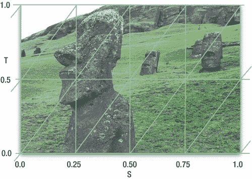

**第 5 章：纹理**

**142**

**图 5-12\. 将纹理拉伸到多个面上**

**图像格式**

`OpenGL ES`支持许多不同的图像格式，我指的不是`PNG` vs. `JPEG`，而是内存中的形式和布局。标准是 32 位，为红色、绿色、蓝色和 alpha 各分配 8 位内存。这被称为`RGBA`，是大多数练习中使用的标准。它也是最“漂亮”的，因为它提供了超过 1600 万种颜色和半透明效果。然而，你通常可以使用 16 位甚至 8 位的图像。通过仔细选择图像，你可以节省大量内存并显著提升速度。请参见表 5-1 中的一些更流行的格式。

**表 5-1\. 一些更流行的图像格式**

**格式 详情**
`RGBA` 每个通道 8 位，包括 alpha。
`RGB` 每个通道 8 位，无 alpha。
`ALPHA` 单个 8 位通道，用于模板。
`LUMINANCE` 单个 8 位通道，用于灰度图像。
`RGB565` 总共 16 位：红色 5 位，绿色 6 位，蓝色 5 位。绿色被赋予了更多的色彩保真度，因为人眼对绿色比对红色或蓝色更敏感。
`RGBA4444` 16 位，每个通道 4 位。
`RGBA5551` 每个颜色通道 5 位，alpha 通道 1 位。

[www.it-ebooks.info](http://www.it-ebooks.info)

**第 5 章：纹理**

**143**

另外，有一个通用的格式要求：通常，`OpenGL`只能使用边长是 2 的幂的纹理图像。一些系统可以绕过这一点，例如带有某些限制的`iOS`，但暂时先坚持标准。

好了，讲完这些，是时候开始编码了。

**回到弹跳方块**

让我们退一步，再次取出我们在第 3 章中首次使用的通用弹跳方块示例。我们将对其应用纹理，然后对其进行操作，以展示本章详细介绍的一些技巧，例如重复、动画和扭曲。

在`iOS 5`之前，程序员需要自己编写纹理转换代码，或者使用苹果提供的代码，这需要将近 40 行的`Core Graphics`代码才能将`.png`转换为`OpenGL`兼容格式。现在我们有了两个漂亮的新玩具可以玩，叫做`GLKTexture`和`GLKTextureInfo`。

在你的视图控制器中添加清单 5-1。

**清单 5-1\. 加载纹理并将其转换为 OpenGL 格式**

```
-(GLKTextureInfo *)loadTexture:(NSString *)filename
{
    NSError *error;
    GLKTextureInfo *info;
    NSString *path=[[NSBundle mainBundle]pathForResource:filename ofType:NULL];
    info=[GLKTextureLoader textureWithContentsOfFile:path options:NULL error:&error];
    glTexParameteri(GL_TEXTURE_2D,GL_TEXTURE_WRAP_S,GL_REPEAT);
    glTexParameteri(GL_TEXTURE_2D,GL_TEXTURE_WRAP_T,GL_REPEAT);
    return info;
}
```

**表 5-2\. OpenGL ES 1.1 中所有调用 `glTexParameter*` 的 `GL_TEXTURE_*` 参数**

**名称 用途**
`GL_TEXTURE_MIN_FILTER` 设置缩小类型（参见表 5-3）
`GL_TEXTURE_MAG_FILTER` 设置放大类型（参见表 5-4）
`GL_TEXTURE_WRAP_S` 指定纹理在 S 方向上的*包裹*方式，`GL_CLAMP` 或 `GL_REPEAT`
`GL_TEXTURE_WRAP_T`


指定纹理在 T 方向上的*环绕*方式：  

`GL_CLAMP` 或 `GL_REPEAT`  

---

### 第 5 章：纹理  

**144**  

现在，可以在 `viewDidLoad()` 中使用以下代码进行初始化：  

```  
[EAGLContext setCurrentContext:self.context];  
m_Texture=[self loadTexture:@"hedly.png"];  
```  

这两个纹理参数指定了如何处理重复纹理，下文将进行介绍。  

我的图片 `hedly.png` 是太平洋复活节岛上神秘巨石人头之一的照片。为便于测试，请使用 32 位 RGBA 格式、尺寸为 2 的幂（POT）的图像。  

**注意：** 默认情况下，OpenGL 要求图像数据中每一行纹素按 4 字节边界对齐。我们的 RGBA 纹理符合此要求；对于其他格式，可考虑调用 `glPixelStorei(GL_PACK_ALIGNMENT,x)`，其中 `x` 的对齐值可以是 1、2、4 或 8 字节。使用 1 可涵盖所有情况。  

请注意，纹理通常有尺寸限制，这取决于实际使用的图形硬件。在第一代和第二代 iPhone（原始版和 3G）以及 iPod/Touch 设备上，由于采用 Power VR MBX 平台，纹理尺寸限制为不超过 1024 × 1024。在其他设备上，则使用更新的 PowerVR SGX，其最大纹理尺寸翻倍至 2048 × 2048。通过以下调用可以了解特定平台支持的纹理最大尺寸（其中 `maxSize` 为整数），并在运行时进行相应处理：  

```  
glGetIntegerv(GL_MAX_TEXTURE_SIZE,&maxSize);  
```  

现在，修改 `drawInRect()` 例行程序，如代码清单 5-2 所示。其中大部分代码已在前面见过，新内容将在下文详述。同时，请在头文件中添加 `GLKTextureInfo *m_Texture`。  

**代码清单 5-2.** 使用纹理渲染几何体  

```  
- (void)glkView:(GLKView *)view drawInRect:(CGRect)rect  
{  
    static const GLfloat squareVertices[] =  
    {  
        -0.5f, -0.33f,  
        0.5f, -0.33f,  
        -0.5f, 0.33f,  
        0.5f, 0.33f,  
    };  

    static const GLubyte squareColors[] = {  
        255, 255, 0, 255,  
        0, 255, 255, 255,  
        0, 0, 0, 0,  
        255, 0, 255, 255,  
    };  

    static const GLfloat textureCoords[] = //1  
    {  
        0.0, 0.0,  
        1.0, 0.0,  
        0.0, 1.0,  
        1.0, 1.0  
    };  

    static float transY = 0.0f;  

    glClearColor(0.5f, 0.5f, 0.5f, 1.0f);  
    glClear(GL_COLOR_BUFFER_BIT);  

    glMatrixMode(GL_MODELVIEW);  
    glLoadIdentity();  
    glTranslatef(0.0f, (GLfloat)(sinf(transY)/2.0f), 0.0f);  

    transY += 0.075f;  

    glVertexPointer(2, GL_FLOAT, 0, squareVertices);  
    glEnableClientState(GL_VERTEX_ARRAY);  
    glColorPointer(4, GL_UNSIGNED_BYTE, 0, squareColors);  
    glEnableClientState(GL_COLOR_ARRAY);  

    glEnable(GL_TEXTURE_2D); //2  
    glEnable(GL_BLEND); //3  
    glBlendFunc(GL_ONE, GL_SRC_COLOR); //4  
    glBindTexture(GL_TEXTURE_2D,m_Texture.name); //5  
    glTexCoordPointer(2, GL_FLOAT,0,textureCoords); //6  
    glEnableClientState(GL_TEXTURE_COORD_ARRAY); //7  

    glDrawArrays(GL_TRIANGLE_STRIP, 0, 4); //8  

    glDisableClientState(GL_COLOR_ARRAY);  
    glDisableClientState(GL_VERTEX_ARRAY);  
    glDisableClientState(GL_TEXTURE_COORD_ARRAY); //9  
}  
```  

那么，这里发生了什么？  

纹理坐标在第 1 行及之后定义。请注意，如前所述，这些坐标值均在 0 到 1 之间。稍后我们将对这些值进行调整。  

在第 2 行，启用了 `GL_TEXTURE_2D` 目标。桌面版 OpenGL 支持 1D 和 3D 纹理，但 ES 版本不支持。  

这里可以启用混合。混合是指根据某种方程将图像的源颜色与背景的目标颜色混合（叠加），该方程在第 4 行被启用。  

混合函数决定了源像素/片段与目标像素/片段如何混合在一起。最常见的形式是源像素覆盖目标像素，但其他形式也能创造出一些


有趣的效果。由于这个话题内容庞大，值得用单独一章来讲解，而这一章便是第 6 章。

`第 5 行`确保我们想要的纹理是当前激活的纹理。与其他 OpenGL 对象一样，纹理被赋予一个“名称”（一个唯一的整数 ID 号），在它被删除之前都会通过这个 ID 号来引用。

`第 6 行`是将纹理坐标交给硬件处理的地方。

正如你之前需要告知客户端处理颜色和顶点一样，你需要在`第 7 行`中对纹理坐标做同样的事情。

`第 8 行`你应该很熟悉，但这一次除了绘制颜色和几何体之外，它还会从当前纹理中获取信息，将四个纹理坐标与`squareVertices[]`数组指定的四个角点一一对应（纹理对象的每个顶点都需要分配一个纹理坐标），并使用`第 4 行`指定的数值进行混合。

最后，像禁用颜色和顶点的客户端状态一样，在`第 9 行`禁用纹理的客户端状态。

如果一切正常，你应该会看到类似图 5-13a 的效果。你说没看到？图像是倒置的？根据所使用的格式，你的纹理很可能被反转了，其内部原点在左上角而不是左下角。修复方法很简单。将`loadTexture`修改为以下代码：

```
-(GLKTextureInfo *)loadTexture:(NSString *)filename
{
    NSError *error;
    GLKTextureInfo *info;
    NSDictionary *options=[NSDictionary dictionaryWithObjectsAndKeys:
                           [NSNumber numberWithBool:YES],
                           GLKTextureLoaderOriginBottomLeft,nil];
    NSString *path=[[NSBundle mainBundle]pathForResource:filename ofType:NULL];
    info=[GLKTextureLoader textureWithContentsOfFile:path options:options error:&error];
    glBindTexture(GL_TEXTURE_2D, info.name);
    glTexParameteri(GL_TEXTURE_2D,GL_TEXTURE_WRAP_S,GL_REPEAT);
    glTexParameteri(GL_TEXTURE_2D,GL_TEXTURE_WRAP_T,GL_REPEAT);
    return info;
}
```

你是在告诉加载器翻转纹理的原点，使其锚定在屏幕的左下角。现在看起来像图 5-13（左图）吗？

注意到纹理也在拾取顶点的颜色了吗？请注释掉`drawInRect()`中的`glEnableClientState(GL_COLOR_ARRAY)`这行代码，现在你应该会看到图 5-13（右图）。如果看不到任何图像，请仔细检查你的文件，确保其尺寸是 2 的幂，例如 128x128 或 256x256。

**图 5-13.** 为弹跳方块应用纹理。使用顶点颜色（左图）与不使用顶点颜色（右图）。

现在，我们可以复现本章第一部分的一些示例。第一个示例是从纹理中只选取一部分进行显示。将`drawInRect`中的`textureCoords`修改为以下代码：

```
static GLfloat textureCoords[] =
{
    0.0, 0.5,
    0.5, 0.5,
    0.0, 1.0,
    0.5, 1.0
};
```

你是否得到了图 5-14？

**图 5-14.** 使用 s 和 t 坐标裁剪图像

纹理坐标到实际几何坐标的映射如图 5-15 所示。如果你还不清楚，不妨花几分钟时间理解一下这里发生的事情。简单来说，纹理坐标数组中的坐标与几何坐标数组中的坐标是一一对应的。

**图 5-15.** 纹理坐标与几何坐标之间存在一一对应关系。

现在将纹理坐标修改为以下代码。你能猜到会发生什么吗（图 5-16）？

```
static GLfloat textureCoords[] =
{
    0.0, 0.0,
    2.0, 0.0,
    0.0, 2.0,
    2.0, 2.0
};
```


### 图 5-16
当需要制作重复图案（如壁纸）时，重复图像是很方便的。

现在，通过修改顶点几何体来扭曲纹理，为了让视觉效果更清晰，恢复原始纹理坐标以关闭重复模式：

```
static const GLfloat squareVertices[] =
{
    -0.5f, -0.33f,
     0.5f, -0.15f,
    -0.5f,  0.33f,
     0.5f,  0.15f,
};
```

这将会挤压正方形的右侧，并带动纹理一起变形，如图 5-17 所示。

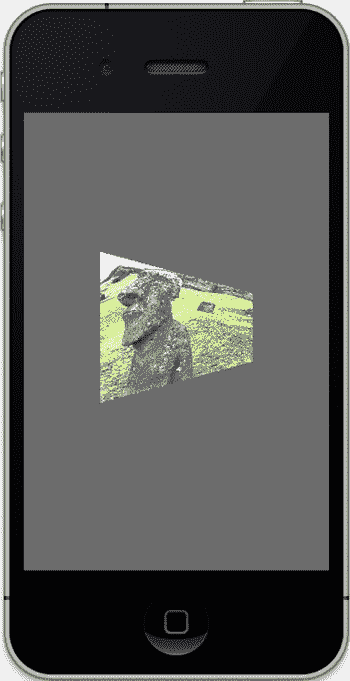

### 图 5-17
挤压多边形的右侧。

掌握了这些知识，如果你动态修改纹理坐标会发生什么？在 `drawInRect` 中添加以下代码——任意位置都可以：

```
static float texIncrease = 0.01;

textureCoords[0] += texIncrease;
textureCoords[2] += texIncrease;
textureCoords[4] += texIncrease;
textureCoords[6] += texIncrease;
textureCoords[1] += texIncrease;
textureCoords[3] += texIncrease;
textureCoords[5] += texIncrease;
textureCoords[7] += texIncrease;
```

这将使纹理坐标在每一帧中略微增加。运行它，你会惊叹不已。这是一个实现纹理动画的非常简单的小技巧。在 3D 世界中，跑马灯效果可能会用到它。你可以创建一个类似电影胶片的纹理，其中包含一个卡通角色在做某个动作，然后通过修改`s`和`t`值，像翻页动画书一样在不同帧之间跳转。另一种用途是创建基于纹理的字体。由于 OpenGL 原生不支持字体，我们这些长期受苦的工程师们只能自己动手添加。唉。这可以通过将所需字体的字符排列到一个单一的拼图纹理上（称为“字体图集”），然后通过精心使用纹理坐标来选择它们来实现。

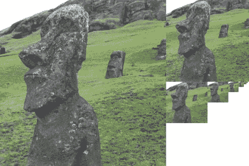

### Mipmaps（多级纹理映射）

Mipmaps 是一种为给定纹理指定多个细节层级的方法。这可以带来两方面的好处：一方面可以平滑纹理对象在距离视点变化时的外观，另一方面可以在纹理对象距离较远时节省资源消耗。

例如，在《遥远的太阳》中，我可能为木星使用一个 1024×512 的纹理。但如果木星距离非常远，在屏幕上只有几个像素大，那么使用这么大的纹理既浪费内存也浪费 CPU 资源。这时 Mipmap 就能派上用场了。那么，什么是 Mipmap 呢？

Mipmap 一词源于拉丁短语“multum in parvo”（字面意思：“小中见大”），它是一族具有不同细节级别的纹理。你的原始图像可能边长为 128，但作为 Mipmap 的一部分，它还会包含边长为 64、32、16、8、4、2 和 1 像素的纹理，如图 5-18 所示。

### 图 5-18
头部模型 Hedly 的 Mipmap 版本。

在 iOS5 中，开启 Mipmap 只需要在调用 `GLKTextureLoader:textureWithContentsOfFile()` 时增加一个参数即可。因此，将选项字典替换为以下内容：

```
NSDictionary *options = [NSDictionary dictionaryWithObjectsAndKeys:
    [NSNumber numberWithBool:YES], GLKTextureLoaderOriginBottomLeft,
    [NSNumber numberWithBool:TRUE], GLKTextureLoaderGenerateMipmaps,
    nil];
```

当然，`drawInRect()` 也需要做一些修改。将旧的 `drawInRect()` 替换为 **代码清单 5-5** 中新的改进版本。这将使 `z` 值来回振荡。

### 代码清单 5-5
用这个替换你的 `drawInRect`。

```
- (void)glkView:(GLKView *)view drawInRect:(CGRect)rect
{
    static int counter = 1;
    static float direction = -1.0;
    static float transZ = -1.0;
    static GLfloat rotation = 0;
    static bool initialized = NO;

    static const GLfloat squareVertices[] =
    {
        -0.5f, -0.5f, -0.5f,
         0.5f, -0.5f, -0.5f,
        -0.5f,  0.5f, -0.5f,
         0.5f,  0.5f, -0.5f
    };

    static GLfloat textureCoords[] =
    {
        // ... (纹理坐标继续)
    };
}
```


```c
{
    0.0, 0.0,
    1.0, 0.0,
    0.0, 1.0,
    1.0, 1.0
};
```

```c
glClearColor(0.5f, 0.5f, 0.5f, 1.0f);
glClear(GL_COLOR_BUFFER_BIT);
```

```c
glMatrixMode(GL_MODELVIEW);
glLoadIdentity();
glTranslatef(0.0f,0.0f,transZ);
glRotatef(rotation,0.0,0.0,1.0);
```

```c
glVertexPointer(3, GL_FLOAT, 0, squareVertices);
glEnableClientState(GL_VERTEX_ARRAY);
```

```c
glEnable(GL_TEXTURE_2D);
glEnable(GL_BLEND);
```

```c
glTexCoordPointer(2, GL_FLOAT,0,textureCoords);
glEnableClientState(GL_TEXTURE_COORD_ARRAY);
```

```c
glTexParameteri(GL_TEXTURE_2D,GL_TEXTURE_MIN_FILTER,GL_NEAREST);
glTexParameteri(GL_TEXTURE_2D,GL_TEXTURE_MAG_FILTER,GL_LINEAR);
```

[www.it-ebooks.info](http://www.it-ebooks.info)

