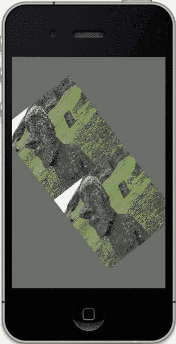

# 第 5 章：纹理

154

```c
glTranslatef(0.0f,0.5f,0.0f);
```

```c
glDrawArrays(GL_TRIANGLE_STRIP, 0, 4);
```

```c
glTranslatef(0.0f,-1.0f,0.0f);
```

```c
glTexParameteri(GL_TEXTURE_2D,GL_TEXTURE_MIN_FILTER,GL_LINEAR_MIPMAP_NEAREST);
glTexParameteri(GL_TEXTURE_2D,GL_TEXTURE_MAG_FILTER,GL_LINEAR_MIPMAP_NEAREST);
```

```c
glDrawArrays(GL_TRIANGLE_STRIP, 0, 4);
```

```c
glDisableClientState(GL_VERTEX_ARRAY);
glDisableClientState(GL_TEXTURE_COORD_ARRAY);
```

```c
if(!(counter%100))
{
    if(direction==1.0)
        direction=-1.0;
    else
        direction=1.0;
}
```

```c
transZ+=(.10*direction);
rotation += 1.0;
counter++;
}
```

复制一份`setClipping()`方法并挪到这里，然后从你的`viewDidLoad()`初始化代码中调用它。

如果编译和运行正常，你应该会看到类似图 5-19 的效果。

[www.it-ebooks.info](http://www.it-ebooks.info)



