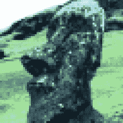
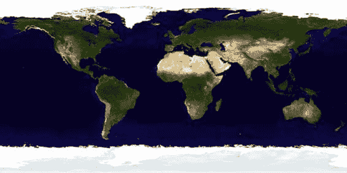

# 第 5 章：纹理

155

图 5-19. 两个图像均为 mipmap 纹理，但其中一个视觉效果更佳。这是为什么？

你可能已经注意到这两个图像看起来略有不同。上方的图像有闪烁感，而下方的图像明显更平滑，看起来更舒适。这就引出了**过滤**这个主题。

### 过滤

图像作为纹理使用时，根据其内容以及投影到屏幕上的最终尺寸，可能会表现出各种伪影。细节丰富的图像可能会出现恼人的闪烁效果。不过，可以通过一种称为**过滤**的过程来动态修改图像，以最大限度地减少这些影响。过滤通常与 mipmapping 结合使用，因为前者可以利用后者提供的多级图像。

假设你有一个 128×128 的纹理，但纹理面的边长是 500 像素。你应该看到什么？显然，图像的原始像素（现称为纹素）会比任何屏幕像素大得多。这个过程称为**放大**。相反，也可能出现纹素远小于像素的情况，这称为**缩小**。过滤就是用于确定如何将一个像素的颜色与其底层的纹素（或多个纹素）关联起来的过程。表 5-3 和表 5-4 分别展示了这一过程的可能变体。

**表 5-3. OpenGL ES 中用于缩小的纹理过滤类型**

| 名称 | 用途 |
|------|------|
| `GL_LINEAR` | 使用被纹理化像素中心最近的四个邻近纹素来平滑纹理 |
| `GL_LINEAR_MIPMAP_LINEAR` | 类似于`GL_LINEAR`，但使用距离渲染像素最近的两个邻近 mipmap 级别 |
| `GL_LINEAR_MIPMAP_NEAREST` | 类似于`GL_LINEAR`，但使用距离渲染像素最近的一个 mipmap 级别 |
| `GL_NEAREST` | 返回距离被渲染像素最近的纹素值 |
| `GL_NEAREST_MIPMAP_NEAREST` | 类似于`GL_NEAREST`，但使用最近 mipmap 中的纹素 |

**表 5-4. OpenGL ES 中用于放大的纹理过滤类型**

| 名称 | 用途 |
|------|------|
| `GL_LINEAR` | 使用被纹理化像素中心最近的四个邻近纹素来平滑纹理 |
| `GL_NEAREST` | 返回距离被渲染像素最近的纹素值 |

过滤主要有三种方法：


## 纹理采样与过滤

**点采样**（在 OpenGL 术语中称为 `GL_NEAREST`）：像素的颜色基于离像素中心最近的纹素。这是最简单、最快的方式，自然产生的图像效果最差。

**双线性采样**（通常简称为线性）：像素的颜色基于离像素中心最近的 2x2 纹素阵列的加权平均值。这可以显著平滑图像。

**三线性采样**：需要 `mipmap`，并取最接近屏幕最终渲染的两个 `mipmap` 层级，对每个层级执行双线性采样，然后对这两个值进行加权平均。

你在前面的练习中看到的就是三线性采样，它显著提升了感知到的图像质量。

图 5-20a 展示了关闭过滤时 Hedly 的近距离特写，而图 5-20b 则展示了开启过滤后的效果。如果你回头查看 `mipmap` 代码，会发现两张图像实际上都使用了过滤。顶部有闪烁效果的那张使用了 `GL_LINEAR` 和 `GL_NEAREST` 过滤。底部的那张做了同样的事情，但额外使用了 `mipmap` 提供的信息。纯粹为了好玩，你可能想对比一下其他设置。例如，哪个更好：`GL_NEAREST` 还是 `GL_LINEAR`？

随着视网膜级别显示屏的普及，过滤可能最终会像 8 位着色一样成为历史。

还有一点：如果你非常仔细地观察底部图像，可能会看到它切换到另一种纹理尺寸。这很微妙，但确实存在。



## OpenGL 扩展与 PVRTC 压缩

尽管 OpenGL 是一个标准，但它在设计时就考虑到了可扩展性，允许各种硬件制造商通过扩展字符串为 3D 领域添加自己的独门绝技。在 OpenGL 中，开发者可以查询可用的扩展，并在它们存在时使用。要查看这一点，请使用以下代码行：

```
char *extensionList = glGetString(GL_EXTENSIONS);
```

这将返回一个以空格分隔的列表，列出 iOS 中 OpenGL ES 的各种额外选项，看起来类似这样（来自 iOS 4.3）：

```
GL_OES_blend_equation_separate GL_OES_blend_func_separate GL_OES_blend_subtract GL_OES_compressed_paletted_texture GL_OES_depth24 GL_OES_draw_texture GL_OES_fbo_render_mipmap GL_OES_framebuffer_object GL_OES_mapbuffer GL_OES_matrix_palette GL_OES_packed_depth_stencil GL_OES_point_size_array GL_OES_point_sprite GL_OES_read_format GL_OES_rgb8_rgba8 GL_OES_stencil_wrap GL_OES_stencil8 GL_OES_texture_mirrored_repeat GL_OES_vertex_array_object GL_EXT_blend_minmax GL_EXT_discard_framebuffer GL_EXT_read_format_bgra GL_EXT_texture_filter_anisotropic GL_EXT_texture_lod_bias GL_APPLE_framebuffer_multisample GL_APPLE_texture_2D_limited_npot GL_APPLE_texture_format_BGRA8888 GL_APPLE_texture_max_level GL_IMG_read_format GL_IMG_texture_compression_pvrtc
```

最后一行加粗的部分指出，iOS 可以处理一种名为 PVRTC 的特殊压缩纹理格式，该格式由 iOS 设备中的图形处理单元（GPU）品牌使用。前两代 iPhone 和 iPod/Touch 使用的是 PowerVR MBX 芯片，而较新的型号则使用更强大的 PowerVR SGX GPU。后者的优势在于，它可以接受以其自身格式高度压缩的纹理，并在飞行中进行显示。这可以将纹理压缩到未压缩大小的 1/16，从而在节省大量内存的同时提高帧率。

当然，这有一个主要限制：图像必须是正方形且为 2 的幂次（POT）形式。这种压缩在照片类图像上效果最佳，而在对比度强的图形上效果较差。


**注意** 字符串 `GL_APPLE_texture_` `2D_limited_npot GL` 中还有一个有趣的附加功能。NPOT 代表“非二次幂”。还记得较新版本的 iOS 可以使用 NPOT 图像吗？所以，如果你有理由使用 NPOT 图像，请事先检查扩展并相应地处理结果。

接下来，我们将生成并导入一个 PVRTC 格式。首先，你需要使用一款小巧的工具将现有文件压缩成 PVR 格式，这款工具由 Imagination Technologies（PowerVR 图形芯片制造商，该芯片用于所有 iOS 设备）提供。你可以从 `www.imgtec.com` 获取它。在开发者专区中查找 PowerVR Insider Utilities，具体工具名为 `PVRTexTool`。

**注意** Apple 还提供了一个名为 `texturetool` 的纹理转换器。虽然它只是一个基于命令行的工具，但其本身的功能非常强大，如果你有大量文件需要一次性压缩，它可以用来处理大型批处理任务。

启动它时不要惊慌！它可能看起来像 Windows NT，但你的图片没有问题。它实际上使用了 X11 窗口平台，这使得它可以在许多不同的操作系统上使用。

要将纹理转换为 PVRTC，只需将其加载到编辑器中，然后选择“Encode Current Texture”（编码当前纹理）按钮。这将打开一个新对话框，让你选择要编码的目标 3D 平台；在此情况下，选择 OpenGL ES 1.x 选项卡。在“压缩格式”部分，选择 `PVRTC 2BPP` 或 `PVRTC 4BPP` 按钮，然后点击底部的编码按钮。就这些！

表 5-5 显示了该工具生成的格式。尽管你只有两种选择，但实际上可能有四种，具体取决于源位图是否包含 Alpha 通道。`2BPP` 格式表示每像素 2 比特，而 `4BPP` 格式，你猜对了，是每像素 4 比特。还支持许多其他图像格式，这些将在第 9 章关于性能问题的讨论中介绍。

[www.it-ebooks.info](http://www.it-ebooks.info)

**第 5 章：纹理**

**159**

表 5-5。`PVRTexTool` 生成的四种 PVR 格式

| 格式 | 压缩比 | 详细信息 |
|--------|-------------|---------|
| `GL_COMPRESSED_RGBA_PVRTC_4BPPV1_IMG` | 8:1 | 4 比特/像素，含 Alpha |
| `GL_COMPRESSED_RGB_PVRTC_4BPPV1_IMG` | 6:1 | 4 比特/像素，不含 Alpha |
| `GL_COMPRESSED_RGBA_PVRTC_2BPPV1_IMG` | 16:1 | 2 比特/像素，含 Alpha |
| `GL_COMPRESSED_RGB_PVRTC_2BPPV1_IMG` | 12:1 | 2 比特/像素，不含 Alpha |

假设你有一个 512×512 的 PNG 纹理，它将消耗 1 MB 内存。使用 `PVRTexTool` 进行最低程度的压缩，将占用不到 200 KB。最高压缩比的格式，即每像素 2 比特并含 Alpha，则仅有区区 64 KB。

PVRTC 纹理也可以被 `GLKTextureLoader()` 读取，但如果你在选项字典中指定了 `GLKTextureLoaderGenerateMipmaps`，则加载会失败。不过，你可以使用 `PVRTexTool` 为主文件嵌入一个 mipmap 链。由于这种压缩是有损的，在使用前述代码时，你会比使用更清晰的图像时更容易看到不同分辨率文件的切换。

**注意** 由于 PVRTC 是硬件相关的，Apple 已发出预防性说明，指出未来设备不一定会支持 PVRTC。这仅仅意味着 Apple 未来可能会使用不同的 GPU 制造商，从而不太可能支持其他公司的格式。

## 更多太阳系内容

现在，我们可以回到上一章的太阳系模型，为地球添加一个纹理，使其看起来真正像地球。查看 `Planet.m`，并将 `init()` 替换为代码清单 5-6。

### 代码清单 5-6。修改后的球体生成器，增加了纹理支持

```
-(id) init:(GLint)stacks slices:(GLint)slices radius:(GLfloat)radius //1
squash:(GLfloat) squash textureFile:(NSString *)textureFile
{
  unsigned int colorIncrment=0;
  unsigned int blue=0;
  unsigned int red=255;
  int numVertices=0;
  if(textureFile!=nil)
    m_TextureInfo=[self loadTexture:textureFile]; //2
```

[www.it-ebooks.info](http://www.it-ebooks.info)

**第 5 章：纹理**

**160**

```
  m_Scale=radius;
  m_Squash=squash;
```


```objectivec
colorIncrment = 255 / stacks;

if ((self = [super init]))
{
    m_Stacks = stacks;
    m_Slices = slices;
    m_VertexData = nil;
    m_TexCoordsData = nil;

    //顶点数据
    GLfloat *vPtr = m_VertexData =
        (GLfloat*)malloc(sizeof(GLfloat) * 3 * ((m_Slices*2+2) * (m_Stacks)));

    //颜色数据
    GLubyte *cPtr = m_ColorData =
        (GLubyte*)malloc(sizeof(GLubyte) * 4 * ((m_Slices*2+2) * (m_Stacks)));

    //用于光照的法线指针
    GLfloat *nPtr = m_NormalData = (GLfloat*)malloc(sizeof(GLfloat) * 3 * ((m_Slices*2+2) * (m_Stacks)));
    GLfloat *tPtr = nil; //3

    if (textureFile != nil)
    {
        tPtr = m_TexCoordsData =
            (GLfloat *)malloc(sizeof(GLfloat) * 2 * ((m_Slices*2+2) * (m_Stacks)));
    }

    unsigned int phiIdx, thetaIdx;
    //纬度
    for (phiIdx = 0; phiIdx < m_Stacks; phiIdx++)
    {
        //从-1.57 弧度到+1.57 弧度
        //第一个圆
        float phi0 = M_PI * ((float)(phiIdx+0) * (1.0/(float)(m_Stacks)) - 0.5);

        //第二个圆
        float phi1 = M_PI * ((float)(phiIdx+1) * (1.0/(float)(m_Stacks)) - 0.5);
        float cosPhi0 = cos(phi0);
        float sinPhi0 = sin(phi0);
        float cosPhi1 = cos(phi1);
        float sinPhi1 = sin(phi1);
        float cosTheta, sinTheta;

        //经度
        for (thetaIdx = 0; thetaIdx < m_Slices; thetaIdx++)
        {
            //沿经度圆每"片"递增
            float theta = -2.0 * M_PI * ((float)thetaIdx) * (1.0/(float)(m_Slices-1));
            cosTheta = cos(theta);
            sinTheta = sin(theta);

            //生成垂直方向的一对顶点，例如堆栈 0 的第一个点和其上方堆栈 1 的第一个点。
            //这就是 TRIANGLE_STRIPS 的工作方式，它采用一组 4 个顶点，每次绘制两个三角形。
            //第一个三角形是 v0-v1-v2，下一个是 v2-v1-v3 等。获取堆栈第一个顶点的 x-y-z 坐标。
            vPtr[0] = m_Scale * cosPhi0 * cosTheta;
            vPtr[1] = m_Scale * sinPhi0 * m_Squash;
            vPtr[2] = m_Scale * (cosPhi0 * sinTheta);

            //与前一个顶点正上方的顶点相同
            vPtr[3] = m_Scale * cosPhi1 * cosTheta;
            vPtr[4] = m_Scale * sinPhi1 * m_Squash;
            vPtr[5] = m_Scale * (cosPhi1 * sinTheta);

            //用于光照的法线指针
            nPtr[0] = cosPhi0 * cosTheta;
            nPtr[2] = cosPhi0 * sinTheta;
            nPtr[1] = sinPhi0;
            nPtr[3] = cosPhi1 * cosTheta;
            nPtr[5] = cosPhi1 * sinTheta;
            nPtr[4] = sinPhi1;

            if (tPtr != nil) //4
            {
                GLfloat texX = (float)thetaIdx * (1.0f/(float)(m_Slices-1));
                tPtr[0] = texX;
                tPtr[1] = (float)(phiIdx+0) * (1.0f/(float)(m_Stacks));
                tPtr[2] = texX;
                tPtr[3] = (float)(phiIdx+1) * (1.0f/(float)(m_Stacks));
            }

            cPtr[0] = red;
            cPtr[1] = 0;
            cPtr[2] = blue;
            cPtr[4] = red;
            cPtr[5] = 0;
            cPtr[6] = blue;
            cPtr[3] = cPtr[7] = 255;

            cPtr += 2*4;
            vPtr += 2*3;
            nPtr += 2*3;

            if (tPtr != nil) //5
                tPtr += 2*2;
        }

        blue += colorIncrment;
        red -= colorIncrment;

        //退化三角形用于连接堆栈并保持环绕顺序
        vPtr[0] = vPtr[3] = vPtr[-3];
        vPtr[1] = vPtr[4] = vPtr[-2];
        vPtr[2] = vPtr[5] = vPtr[-1];

        nPtr[0] = nPtr[3] = nPtr[-3];
        nPtr[1] = nPtr[4] = nPtr[-2];
        nPtr[2] = nPtr[5] = nPtr[-1];

        if (tPtr != nil)
        {
            tPtr[0] = tPtr[2] = tPtr[-2]; //6
            tPtr[1] = tPtr[3] = tPtr[-1];
        }
    }

    numVertices = (vPtr - m_VertexData) / 6;
}

m_Angle = 0.0;
m_RotationalIncrement = 0.0;
m_Pos[0] = 0.0;
m_Pos[1] = 0.0;
m_Pos[2] = 0.0;

return self;
```

以下是具体的解释：

在第 1 行的参数列表末尾添加了图像文件名。记得也要将其添加到`Planet.h`中`init`的声明里。

在第 2 行，创建纹理并返回`GLKTextureInfo`。

从第 3 行开始，为纹理坐标分配内存。

从第 4 行开始，计算纹理坐标。由于球体有`x`个切片和`y`个堆栈，且坐标空间范围仅为 0 到 1，因此我们需要以`1/m_slices`（用于`s`）和`1/m_stacks`（用于`t`）的增量推进每个值。请注意，这覆盖了两对坐标，一上一下，与三角形带的布局相匹配，该布局也生成成对的堆叠坐标。

在第 5 行，将坐标数组的指针向前移动，以容纳下一组值。

最后，第 6 行收尾了一些未完成的工作，为循环中进入下一个堆栈做准备。

接下来，更新`Planet.h`，在接口中添加以下内容：

```objectivec
#import <GLKit/GLKit.h>
```

同时添加以下内容：

```objectivec
GLKTextureInfo *m_TextureInfo;
GLfloat *m_TexCoordsData;
```

将第一个示例中的`loadTexture()`方法复制到行星对象中，并根据需要修改头文件。如果你愿意，可以移除 mipmap 支持，但保留它也无害；只是对于这个练习来说并非必需。

对于地球纹理，需要注意的是，该纹理将包裹整个球体模型，因此并非任何图像都适用；为此，它应该类似于图 5-21。你可以从 Apress 网站下载我在本练习中使用的图像。或者，你可能想先查看 NASA 网站：`http://maps.jpl.nasa.gov/`。



**图 5-21.** 纹理通常填满整个帧，边缘到边缘。行星使用墨卡托投影（一种圆柱形地图）。

当你找到合适的图像后，将其添加到项目中，并在太阳系控制器中分配行星对象时将其传递给行星对象。由于太阳不需要纹理，你可以直接传递`nil`指针。当然，我们还需要更新`execute()`方法，如列表 5-7 所示。

**列表 5-7.** 准备处理新纹理

```objectivec
-(bool)execute
{
    glMatrixMode(GL_MODELVIEW);
    glEnable(GL_CULL_FACE);
    glCullFace(GL_BACK);
    glFrontFace(GL_CW);

    glEnableClientState(GL_NORMAL_ARRAY);
    glEnableClientState(GL_VERTEX_ARRAY);
    glEnableClientState(GL_COLOR_ARRAY);

    if (m_TexCoordsData != nil)
    {
        glEnable(GL_TEXTURE_2D);
        glEnableClientState(GL_TEXTURE_COORD_ARRAY);

        if (m_TextureInfo != 0)
            glBindTexture(GL_TEXTURE_2D, m_TextureInfo.name);

        glTexCoordPointer(2, GL_FLOAT, 0, m_TexCoordsData);
    }

    glMatrixMode(GL_MODELVIEW);

    glVertexPointer(3, GL_FLOAT, 0, m_VertexData);
    glNormalPointer(GL_FLOAT, 0, m_NormalData);
    glColorPointer(4, GL_UNSIGNED_BYTE, 0, m_ColorData);
    glDrawArrays(GL_TRIANGLE_STRIP, 0, (m_Slices+1)*2*(m_Stacks-1)+2);

    glDisable(GL_BLEND);
    glDisable(GL_TEXTURE_2D);
    glDisableClientState(GL_TEXTURE_COORD_ARRAY);

    return true;
}
```

此处的主要区别在于添加了启用纹理、设置当前纹理以及将指针传递给 OpenGL 的代码。

编译并运行，理想情况下，你会看到类似图 5-22 的效果。

**图 5-22.** 太阳和地球

如果你检查本练习中使用的实际素材，你会发现它相当明亮但对比度较低。主要原因是真实海洋实际上非常暗，在光照条件下看起来不合适。

## 总结


