# 章节 6：混合效果

红色部分的百分之五十会被写入目标区域。黑色区域将呈现暗红色，但只有`glColor4f()`中指定的`1.0`值的百分之五十。到目前为止，一切正常。现在，在蓝色之上，红色值的百分之五十与蓝色值的百分之五十混合：混合颜色 = 源颜色 * 源颜色的 Alpha + (1.0 - 源颜色的 Alpha) * 目标颜色

或者，基于前面红色方块示例中的每个分量值，以下是计算过程：

`红色 = 1.0 * 0.5 + (1.0 - 0.5) * 0.0`

`绿色 = 0.0 * 0.5 + (1.0 - 0.5) * 0.0`

`蓝色 = 0.0 * 0.5 + (1.0 - 0.5) * 1.0`

因此，片段像素的最终颜色应为`0.5, 0.0, 0.5`，即洋红色。现在，红色和由此产生的洋红色都略偏暗。如果你希望让它们更亮一些，该怎么办呢？如果能有一种方法混合颜色的全部强度就好了。你会使用`1.0`的 Alpha 值吗？不会。为什么呢？以蓝色为目标颜色，源 Alpha 为`1.0`，前文的蓝色通道等式将是`0.0 * 1.0 + (1.0 - 1.0) * 1.0`。结果等于`0`，而红色将是`1.0`，即纯色。你实际想要的是，在写入黑色背景时，红色最亮，蓝色也同样最亮。为此，你需要使用一个能同时以全强度写入两种颜色的混合函数，例如`GL_ONE`。这意味着如下操作：

`glBlendFunc(GL_ONE, GL_ONE);`

回到等式，使用源三元组红色=1、绿色=0、蓝色=0 和目标颜色红色=0、绿色=0、蓝色=1（Alpha 默认为 1.0），计算结果如下：

`红色 = 1 * 1 + 0 * 1`

`绿色 = 0 * 1 + (0 - 0) * 1`

`蓝色 = 0 * 1 + (1 - 0) * 1`

这样得出的颜色中，红色=1、绿色=0、蓝色=1。这就是洋红色，各位，如图 6-3 所示。

[www.it-ebooks.info](http://www.it-ebooks.info)

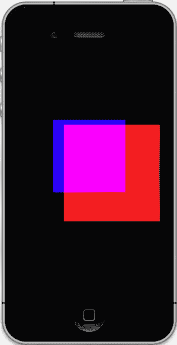

**第 6 章：它会混合吗？**

**174**

图 6-3. 混合红色和蓝色的全强度

现在，是时候进行另一个实验了。采用上一个示例的代码，将两个 Alpha 值都设为`0.5`，并将混合函数重置为传统的透明度值：

`glBlendFunc(GL_SRC_ALPHA, GL_ONE_MINUS_SRC_ALPHA);`

运行此修改后的代码后，注意混合后的颜色，并注意远方的方块在`-4.0`距离处是蓝色的，并且它是最先被渲染的，红色方块是第二个。现在，颠倒绘制的颜色顺序，然后运行。哪里出了问题？你应该得到类似图 6-4 的结果。

[www.it-ebooks.info](http://www.it-ebooks.info)

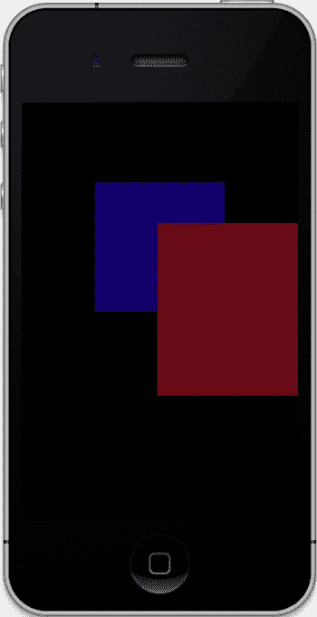

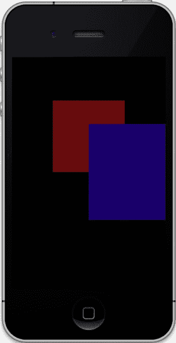

**第 6 章：它会混合吗？**

**175**

图 6-4. 左侧是先绘制蓝色（左），而右侧是先绘制红色（右）。

交叉部分的颜色略有不同。这揭示了 OpenGL 中一个令人费解的问题：与大多数 3D 框架一样，混合效果会因渲染时面和颜色的顺序而略有不同。在这种情况下，要弄清楚发生了什么其实很简单。在图 6-4（左）中，蓝色方块首先被绘制，其 Alpha 值为`0.5`。因此，即使蓝色颜色三元组被定义为`0,0,1`，Alpha 值也会在写入帧缓冲区时将其降低到`0,0,0.5`。现在，添加具有类似属性的红色方块。自然，红色会以与蓝色相同的方式写入帧缓冲区的黑色部分，因此最终值将是`0.5,0,0`。但请注意，当红色绘制在蓝色之上时会发生什么。由于蓝色已经处于其强度的一半，混合函数会将其进一步削减至`0.25`，这是混合函数的目标部分`(1.0 - 源 Alpha) * 蓝色 + 目标颜色`的结果，即`(1.0 - 0.5) * 0.5 + 0`，也就是`0.25`。最终颜色为`0.5, 0, 0.25`。由于蓝色强度较低，它对合成颜色的贡献较小，从而让红色占据主导地位。现在，在图 6-4（右）中，顺序是相反的，因此蓝色占据主导地位，最终颜色为`0.25, 0, 0.5`。

[www.it-ebooks.info](http://www.it-ebooks.info)

**第 6 章：它会混合吗？**

**176**

表 6-1 列出了所有允许的 OpenGL ES 混合因子，尽管并非所有因子都同时支持源和目标。如您所见，这里有充足的调整空间，并且没有关于哪种组合能产生最佳效果的固定规则。不过，尝试不同的值会非常有趣。请确保将背景填充为暗灰色，因为某些组合在写入黑色背景时只会产生黑色。

表 6-1. 源和目标混合值；请注意，并非所有值都适用于两个通道

| 混合因子 | 描述 |
| :--- | :--- |
| `GL_ZERO` | 将操作数乘以 0。 |
| `GL_ONE` | 将操作数乘以 1。 |
| `GL_SRC_COLOR` | 将操作数乘以源颜色的四个分量（仅限目标）。 |
| `GL_ONE_MINUS_SRC_COLOR` | 将操作数乘以 (1.0 – 源颜色)（仅限目标）。 |
| `GL_DST_COLOR` | 将操作数乘以目标颜色的四个分量（仅限源）。 |
| `GL_ONE_MINUS_DST_COLOR` | 将操作数乘以 (1.0 – 目标颜色)（仅限源）。 |
| `GL_SRC_ALPHA` | 将操作数乘以源 Alpha。 |
| `GL_ONE_MINUS_SRC_ALPHA` | 将操作数乘以 (1.0 – 源 Alpha)。 |
| `GL_DST_ALPHA` | 将操作数乘以目标 Alpha。 |
| `GL_ONE_MINUS_DST_ALPHA` | 将操作数乘以 (1.0 – 目标 Alpha)。 |
| `GL_SRC_ALPHA_SATURATE` | 用于较旧图形实现的特殊模式，以辅助抗锯齿。你可能永远不会用到它。（仅限源。） |

在第 5 章中，我们研究了 iOS 设备上 OpenGL ES 支持的 GL 扩展。其中几个用于更复杂的混合方案，例如`GL_OES_blend_equation_separate`、`GL_OES_blend_func_separate`、`GL_OES_blend_subtract`和`GL_EXT_blend_minmax`。这些值与`glBlendEquation()`和`glBlendEquationSeparate()`方法一起使用。

回顾一下默认的混合等式，其中最终颜色由源值 + 目标值决定。但是，如果你想用源颜色减去目标颜色而不是相加呢？调用`glBlendEquation(GL_FUNC_SUBTRACT)`即可实现。将该行代码放在`glBlendFunc()`正下方，确保两个方块的 Alpha 值都为`0.5`，并将颜色重置回初始状态（红色在前），编译并运行。结果可能有点不明显，如图 6-5（左）所示。实际情况是，这个操作确实是“从红色源中减去蓝色”，但红色方块的颜色中没有任何蓝色分量。数学计算得出的最终颜色为红色=0.5、绿色=0、蓝色=-0.25。但是，由于负颜色在这个平面上（或者至少在加利福尼亚州圣何塞）不存在，系统会将蓝色分量钳位为`0`。结果是交叉部分呈现纯红色。因此，为了在这里看到一些效果，前面的方块需要预先包含一些蓝色。所以，将红色的颜色改为`1,0,1`，即洋红色。现在运行时，就得到了图 6-5（右）的结果，因为目标蓝色可以从源蓝色中减去，留下一个系统能够理解的正值。在这种情况下，交叉部分的值是`0.5, 0, 0.25`，这就是为什么我们得到的是偏洋红的红色而不是纯红色。尝试将其导入绘图程序，并使用拾色器功能验证实际颜色。

图 6-5a, b. 左侧，使用减法操作时没有发生混合，而右侧则成功混合。


扩展集中还有另外两个函数调用，它们是 `glBlendEquationSeparateOES()` 和 `glBlendFuncSeparateOES()`。这些函数允许你分别修改 RGB 通道和 Alpha 通道。后缀 `OES` 指定了这些是 OpenGL ES 的扩展（但仅针对 OpenGL 1.1——它们在 OpenGL 2.0 中是标准函数，因此末尾不需要 `OES`），并且定义在 `glext.h` 中。此功能的一个用途是抵消图 6-4 所示的渲染顺序带来的影响。

[www.it-ebooks.info](http://www.it-ebooks.info)

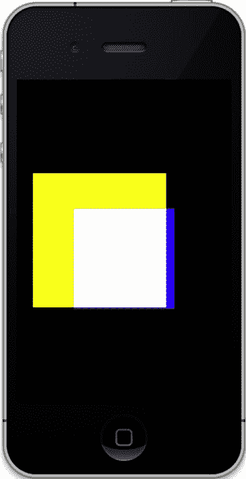

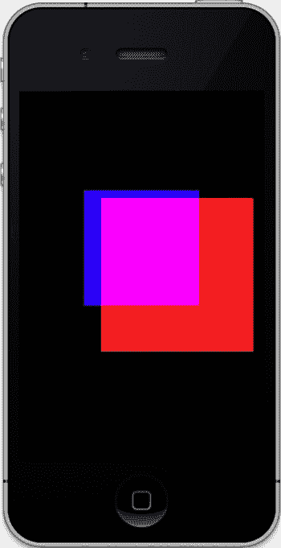

## 第 6 章：它会混合吗？

**178**

最后，这里还有一个在某些混合操作中可能非常方便的方法，那就是 `glColorMask()`。此函数允许你阻止一个或多个颜色通道写入目标。要查看实际效果，请将红色方块的颜色修改为 `1,1,0,1`；将两个混合函数设置回 `GL_ONE`；并注释掉 `glBlendEquation(GL_FUNC_SUBTRACT);` 这一行。运行时，你应该会看到类似图 6-6（左）的结果。红色方块现在变成了黄色，并且与蓝色混合时，在交叉处产生白色。现在，添加以下行：

```
glColorMask(GL_TRUE, GL_FALSE, GL_TRUE, GL_TRUE);
```

上述代码行在绘制到帧缓冲区时，掩码（即关闭）了绿色通道。运行时，你应该会看到图 6-6（右），它看起来与图 6-3 非常相似。事实上，从逻辑上讲，它们是相同的。

图 6-6. 左侧未使用 `glColorMask`，因此所有颜色都参与混合，而右侧则掩码了绿色通道。

[www.it-ebooks.info](http://www.it-ebooks.info)

## 第 6 章：它会混合吗？

**179**

## 多色混合

现在，我们可以花几分钟时间，研究当方块每个顶点都定义了独立颜色时，混合函数的效果。将清单 6-2 添加到久经考验的 `drawInRect()` 方法中。第一组颜色定义了黄色、品红色和青色（这是第二组中标准红绿蓝的三种互补色）。

#### 清单 6-2. 两个方块的顶点颜色

```
static const GLfloat squareColorsYMCA[] =
{
    1.0, 1.0, 0, 1.0,
    0, 1.0, 1.0, 1.0,
    0, 0, 0, 1.0,
    1.0, 0, 1.0, 1.0,
};

static const GLfloat squareColorsRGBA[] =
{
    1.0, 0, 0, 1.0,
    0, 1.0, 0, 1.0,
    0, 0, 1.0, 1.0,
    1.0, 1.0, 1.0, 1.0,
};
```

将第一个颜色数组分配给第一个方块（直到现在它一直是蓝色的方块），并将第二个颜色数组分配给之前的红色方块。并且不要忘记启用颜色数组的使用。你现在应该足够熟悉，知道该怎么做。另外，注意这些数组现在被规范化为一系列 `GLfloat` 类型，而不是之前使用的无符号字节，因此你需要调整对 `glColorPointer()` 的调用。解决方案留给读者自己完成（我一直想这么说）。在禁用混合的情况下，你应该会看到图 6-7（左）；而使用传统的透明度函数启用混合时，结果应该是图 6-7（中）。什么？不是这样？你说它看起来仍然像第一幅图？为什么会这样？

回头看看颜色数组。注意每行中的最后一个值，即 alpha，是其最大值 `1.0`。请记住，在这种混合模式下，任何目标值都要乘以：`(1.0 - 源 alpha)`，或者说乘以 `0.0`，因此源颜色占据主导地位，就像你在前面的例子中看到的那样。要看到真正的透明效果，一种解决方案是使用以下代码：

```
glBlendFunc(GL_ONE, GL_ONE);
```

这样之所以有效，是因为它完全舍弃了 alpha 通道。如果你希望使用“标准”函数的 alpha 效果，只需将 `1.0` 值改为其他值，比如 `.5`。结果就是图 6-7（右）。

[www.it-ebooks.info](http://www.it-ebooks.info)

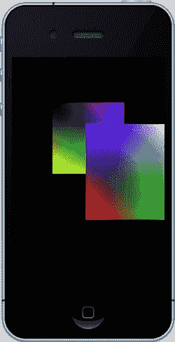

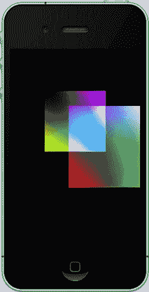

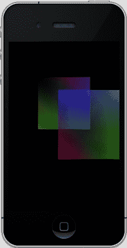

## 第 6 章：它会混合吗？

**180**

图 6-7. 分别是无混合（左）、`GL_ONE` 混合（中）、Alpha 混合（右）

## 纹理混合

现在，我们可以怀着敬畏之心来探讨纹理的混合了。起初这看起来很像之前的 alpha 混合，但通过使用多重纹理可以实现各种有趣的事情。

首先，让我们重新编写之前的代码，使其同时支持两个纹理并执行顶点混合。清单 6-3 将第 5 章的一些代码与本季示例的框架合并在一起。

#### 清单 6-3. 重新调整的 `drawInRect()` 方法以支持两个纹理方块

```
- (void)glkView:(GLKView *)view drawInRect:(CGRect)rect
{

static const GLfloat squareVertices[] =
{
    -0.5, -0.5, 0.0,
    0.5, -0.5, 0.0,
    -0.5, 0.5, 0.0,
    0.5, 0.5, 0.0
};
```

[www.it-ebooks.info](http://www.it-ebooks.info)

## 第 6 章：它会混合吗？

**181**

```
static const GLfloat squareColorsYMCA[] =
{
    1.0, 1.0, 0, 1.0,
    0, 1.0, 1.0, 1.0,
    0, 0, 0, 1.0,
    1.0, 0, 1.0, 1.0,
};

static const GLfloat squareColorsRGBA[] =
{
    1.0, 0, 0, 1.0,
    0, 1.0, 0, 1.0,
    0, 0, 1.0, 1.0,
    1.0, 1.0, 1.0, 1.0,
};

static GLfloat textureCoords[] =
{
    0.0, 0.0,
    1.0, 0.0,
    0.0, 1.0,
    1.0, 1.0
};

static float transY = 0.0;

glMatrixMode(GL_PROJECTION);
glLoadIdentity();

[self setClipping];

glClearColor(0.0, 0.0,0.0, 1.0);

glClear(GL_COLOR_BUFFER_BIT);

glMatrixMode(GL_MODELVIEW);
glLoadIdentity();

//设置以使用纹理。
glEnable(GL_TEXTURE_2D);
glBindTexture(GL_TEXTURE_2D,m_Texture0.name);
glTexCoordPointer(2, GL_FLOAT,0,textureCoords);
glEnableClientState(GL_TEXTURE_COORD_ARRAY);

//做第一个方块上下弹跳。

glTranslatef(0.0, (GLfloat)(sinf(transY)/2.0), -4.0);

glVertexPointer(3, GL_FLOAT, 0, squareVertices);
glEnableClientState(GL_VERTEX_ARRAY);
```

[www.it-ebooks.info](http://www.it-ebooks.info)

## 第 6 章：它会混合吗？

**182**

```
//glEnable(GL_BLEND);

glBlendFunc(GL_SRC_ALPHA, GL_ONE_MINUS_SRC_ALPHA);

//方块 1
//glEnableClientState(GL_COLOR_ARRAY);

glColorPointer(4, GL_FLOAT, 0, squareColorsYMCA);

glDrawArrays(GL_TRIANGLE_STRIP, 0, 4);

//方块 2

glLoadIdentity();
glTranslatef( (GLfloat)(sinf(transY)/2.0),0.0, -3.0);

glColorPointer(4, GL_FLOAT, 0, squareColorsRGBA);
glBindTexture(GL_TEXTURE_2D,m_Texture1.name);

glDrawArrays(GL_TRIANGLE_STRIP, 0, 4);

transY += 0.075f;

}
```

除此之外，请确保从第 5 章的例子中添加 `loadTexture()`，并在**惯常位置**对其进行初始化。因为我们需要两个不同的纹理，所以将第一个纹理初始化为 `m_Texture0`，第二个初始化为 `m_Texture1`。你可能已经注意到，虽然我同时包含了混合和颜色的相关内容，但在首次运行过程中，为了确保基本功能正常工作，我注释掉了一些行。如果一切正常，你应该会看到类似图 6-8（左）的结果。如果这也正常工作，通过取消注释 `glEnableClientState(GL_COLOR_ARRAY)` 和 `glEnable(GL_BLEND)` 来释放顶点颜色，应该会得到图 6-8（中）。对于图 6-8（右），金门大桥被着色为纯红色。亲爱的读者，我将把如何实现这一点的任务留给你们自己去探索。


使用单一位图并为其着色是一种常见的节省内存的做法。如果您正在 OpenGL 层中构建一些 UI 组件，请考虑使用单张图像，并通过这些技术为其着色。您可能会问，为什么它会呈现纯红色，而不仅仅是带有红色色调，从而允许颜色有一些变化？这里发生的情况是，顶点的颜色与每个片段的颜色相乘。对于红色，我使用了 RGB 三元组`1.0,0.0,0.0`。因此，当每个片段在逐通道乘法中计算时，绿色和蓝色通道将被乘以 0，它们被完全过滤掉，只留下红色。如果您希望让其他一些颜色透出，您可以将顶点指定为偏向更中性的色调，使所需的色调颜色略高于其他颜色，例如`1.0,0.7,0.7`。

[www.it-ebooks.info](http://www.it-ebooks.info)

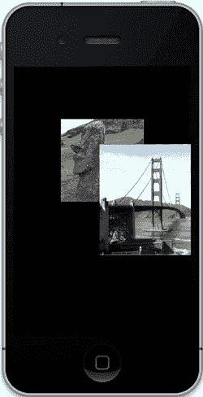

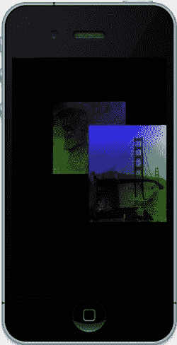

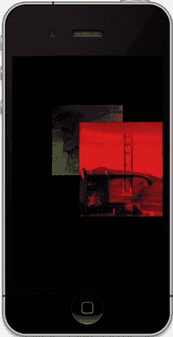

**第 6 章：它会混合吗？**

**183**

图 6-8. 左侧仅显示纹理。中间部分与颜色混合，右侧部分则为纯红色。

您还可以非常轻松地为纹理添加半透明效果。为了实现这一点，我将在此引入一个简化因素。您可以通过简单地使用`glColor4f()`来使用单一颜色为纹理面着色，从而无需创建顶点颜色数组。

将 alpha 设置为小于`1.0`会产生透视纹理的效果，如图 6-9 所示。

[www.it-ebooks.info](http://www.it-ebooks.info)

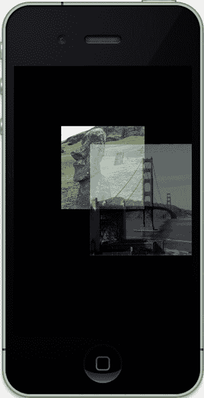

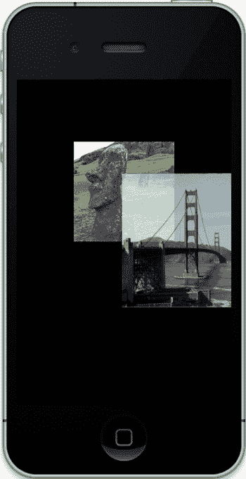

**第 6 章：它会混合吗？**

**184**

图 6-9. 左侧图像的 alpha 值为 0.5，右侧图像的 alpha 值为 0.75。

## 多重纹理

到目前为止，我们已经介绍了颜色混合以及纹理与颜色的混合模式，但是如何将两个纹理组合以创建第三个纹理呢？这种技术称为多重纹理。多重纹理可用于将一个纹理层叠在另一个纹理之上，同时执行某些数学运算。更复杂的应用包括简单的图像处理。但我们还是先处理简单的情况。

多重纹理需要使用纹理组合器（texture combiners）和纹理单元（texture units）。纹理组合器允许您组合和处理绑定到硬件纹理单元的纹理，纹理单元是图形芯片中用于将图像包裹到对象周围的特定部分。在 iPhone 3GS 之前，您只有两个纹理单元可用，这是 Imagination Technologies 公司 PowerVR MBX 图形芯片的限制。当 3GS 推出时，Apple 改用更强大的 SGX 芯片，该芯片将纹理单元总数增加到八个。如果您预计会大量使用组合器，您可能需要通过以下方式验证支持的总数：

`glGetIntegerv(GL_MAX_COMBINED_TEXTURE_IMAGE_UNITS, &numberTextureUnits)`，其中`numberTextureUnits`被定义为`GLint`。

[www.it-ebooks.info](http://www.it-ebooks.info)

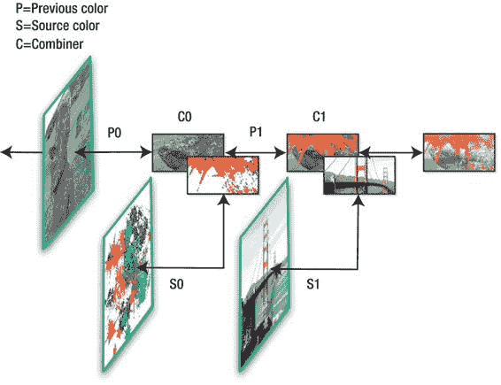

**第 6 章：它会混合吗？**

**185**

为了建立处理多重纹理的管线，我们需要告诉 OpenGL 使用哪些纹理以及如何将它们混合在一起。这个过程（至少在理论上）与之前处理 alpha 和颜色混合操作时定义混合函数并没有太大区别。它确实大量使用了`glTexEnvf()`调用，这是 OpenGL 另一个极度重载的方法。（如果您不相信我，可以在 OpenGL 官网上查看其参考页面。）这会设置纹理环境，定义多重纹理处理过程的每个阶段。

图 6-10 展示了组合器链。每个组合器引用前一个纹理片段（`P0`或`Pn`），或者对于第一个组合器，引用输入的片段。然后，它从一个“源”纹理（称为`S0`）中获取一个片段，将其与`P0`组合，并在需要时（称为`C1`）传递给下一个组合器；然后循环重复。

图 6-10. 纹理组合器链

处理这个主题的最佳方法与其他主题一样：直接看代码。在以下示例中，两个纹理被一起加载，绑定到它们各自的纹理单元，并合并成一个单一的输出纹理。我们尝试了几种用于组合两个图像的方法，并深入展示了每种方法的结果。

[www.it-ebooks.info](http://www.it-ebooks.info)

**第 6 章：它会混合吗？**

**186**

首先，我们重新审视一下老朋友`drawInRect()`。我们回到了仅使用单一纹理的情况，上下移动。颜色支持也被移除了。因此，您应该得到类似清单 6-4 的内容。并确保您仍在加载第二个纹理。

清单 6-4. 为多重纹理支持修改后的`drawInRect()`回顾

```
- (void)glkView:(GLKView *)view drawInRect:(CGRect)rect

{

static const GLfloat squareVertices[] =

{

-0.5, -0.5, 0.0,

0.5, -0.5, 0.0,

-0.5, 0.5, 0.0,

0.5, 0.5, 0.0

};

static GLfloat textureCoords[] =

{

0.0, 0.0,

1.0, 0.0,

0.0, 1.0,

1.0, 1.0

};

static float transY = 0.0;

glMatrixMode(GL_PROJECTION);

glLoadIdentity();

[self setClipping];

glClearColor(0.0, 0.0,0.0, 1.0);

glClear(GL_COLOR_BUFFER_BIT);

glMatrixMode(GL_MODELVIEW);

glLoadIdentity();

//Set up for using textures.

glEnable(GL_TEXTURE_2D);

glEnableClientState(GL_VERTEX_ARRAY);

glVertexPointer(3, GL_FLOAT, 0, squareVertices);

glEnableClientState(GL_TEXTURE_COORD_ARRAY);

glClientActiveTexture(GL_TEXTURE0); //1

glTexCoordPointer(2, GL_FLOAT,0,textureCoords);

glClientActiveTexture(GL_TEXTURE1); //2

glTexCoordPointer(2, GL_FLOAT,0,textureCoords);

glLoadIdentity();

glTranslatef(0.0, (GLfloat)(sinf(transY)/2.0), -2.5);

[self multiTexture:m_Texture0.name tex1:m_Texture1.name];

glDrawArrays(GL_TRIANGLE_STRIP, 0, 4);

transY += 0.075f;

}
```

[www.it-ebooks.info](http://www.it-ebooks.info)

**第 6 章：它会混合吗？**

**187**

这里有一个新的调用，在第 1 行和第 2 行中显示，`glClientActiveTexture()`，它设置要操作的纹理单元。这是在客户端，而不是硬件端，并指示哪个纹理单元将接收纹理坐标数组。不要将其与下面清单 6-5 中使用的`glActiveTexture()`混淆，后者实际上是打开特定的纹理单元。

我们需要的另一个额外方法是`multiTexture`，如清单 6-5 所示。这是一个非常简单的默认情况。复杂的内容稍后介绍。

清单 6-5. 设置纹理组合器

```
-(void)multiTexture:(GLuint)tex0 tex1:(GLuint)tex1

{

GLfloat combineParameter=GL_MODULATE; //1

// Set up the first texture.

glActiveTexture(GL_TEXTURE0); //2

glBindTexture(GL_TEXTURE_2D, tex0); //3

// Set up the second texture.

glActiveTexture(GL_TEXTURE1);

glBindTexture(GL_TEXTURE_2D, tex1);

// Set the texture environment mode for this texture to combine.

glTexEnvf(GL_TEXTURE_ENV, GL_TEXTURE_ENV_MODE, combineParameter); //4

}
```

以下是代码说明：

第 1 行指定了组合器应执行的操作。表 6-2 列出了所有可能的值。

第 2 行的`glActiveTexture()`用于激活特定的硬件纹理单元。

第 3 行不应是谜题，因为您之前已经见过它。在此示例中，第一个纹理被绑定到一个特定的硬件纹理单元。接下来的两行对第二个纹理执行相同的操作。

现在在第 4 行告诉系统如何处理这些纹理。表 6-2 列出了所有可能的参数。（在表中，`P`代表 previous，`S`代表 source。）


