# 第 6 章：能融合吗？

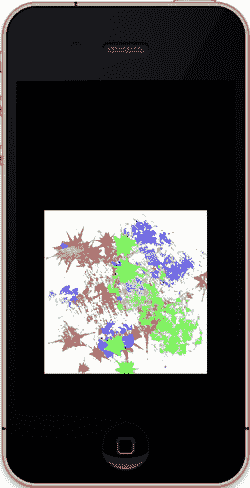

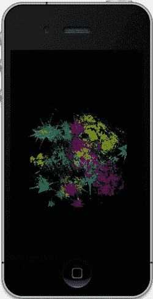

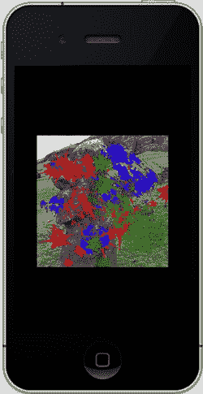

**190**

图 6-12：左侧使用了`GL_ADD`，中间添加了`GL_BLEND`，右侧添加了`GL_DECAL`。

另一项任务是让第二个纹理动起来。在`drawInRect()`中添加以下代码：

```
for(i=0;i<8;i++)
{
textureCoords2[i]+=.01;
}
```

然后复制一份原始`textureCoords`数组，并命名为`textureCoords2`。后者是专用于第二个纹理的坐标，因此修改对`glTexCoordPointer()`的第二次调用，使其使用新数据。最后，在某处声明索引变量`i`。你应该会看到纹理 2 在纹理 1 上方剧烈滚动。

这种效果可用于制作卡通场景中的雨或雪动画，或是行星周围的云层。如果额外添加两个纹理，一个用于上层云团，一个用于下层云团，并以不同速度移动，效果会更加酷炫。

如前所述，环境参数`GL_COMBINE`需要一系列额外的设置才能正常工作，因为它允许你通过组合器方程在更精细的层面上进行操作。如果你仅仅使用`GL_COMBINE`，它会默认采用`GL_MODULATE`模式，因此你无法看到两者之间的区别。使用`Arg0`和`Arg1`意味着通过类似下面这行代码来设置输入源，其中`GL_SOURCE0_RGB`对应表 6-3 中引用的参数`0`或`Arg0`：

```
glTexEnvf(GL_TEXTURE_ENV, GL_SOURCE0_RGB, GL_TEXTURE);
```

**191**

同理，对于`Arg1`，你需要使用`GL_SOURCE1_RGB`。

表 6-3：`GL_COMBINE_RGB`和`GL_COMBINE_ALPHA`参数的取值

| `GL_COMBINE_*` | 函数 |
|---|---|
| `GL_REPLACE` | `Arg0` |
| `GL_MODULATE` | `Arg0 * Arg1` (默认值) |
| `GL_ADD` | `Arg0 + Arg1` |
| `GL_ADD_SIGNED` | `Arg0 + Arg1 - 0.5` |
| `GL_INTERPOLATE` | `Arg0 * Arg2 + Arg1 * (1 - Arg2)` |
| `GL_SUBTRACT` | `Arg0 - Arg1` |
| `GL_DOT3_RGB` | `4 * (((Arg0_red - .5) * (Arg1_red - .5)) + ((Arg0_green - .5) * (Arg1_green - .5)) + ((Arg0_blue - .5) * (Arg1_blue - .5)))` (仅限`GL_COMBINE_RGB`) |
| `GL_DOT3_RGBA` | 同上，但增加了 Alpha 通道 (仅限`GL_COMBINE_RGBA`) |

## 凹凸映射

你可以用纹理实现许多极其复杂的效果；凹凸映射只是其中之一。接下来，我们将讨论“凹凸”究竟是什么，以及为什么需要关注它的映射。

如前所述，计算机图形学中的一大挑战，就是通过巧妙的幕后技巧来制作出视觉上复杂的图像。凹凸映射正是这些技巧之一，在 OpenGL ES 1 中，可以通过纹理组合器来实现。

正如纹理是给简单表面增加复杂层次的“技巧”一样，凹凸映射是一种为纹理添加第三维度的技术。它用于生成物体表面的粗糙感，在光照下产生令人惊讶的真实高光效果。它可以用来模拟湖面的波纹、网球的表面，或是行星的表面。

物体表面的粗糙程度是通过光影变化被感知的。例如，考虑图 6-13 中显示的满月与凸月。当太阳正对月球时，我们看到的是满月，此时月表仅呈现不同深浅的灰色，几乎看不到任何阴影。这与你背对太阳看地面时的情形相差无几——在头的阴影周围，地面看起来是平坦的。然而，当光源移到侧面时，各种细节就会突然显现出来。图 6-13（右）展示了一个凸月，太阳位于其左侧（即月球的东边缘）。这完全是另一番景象，不是吗？

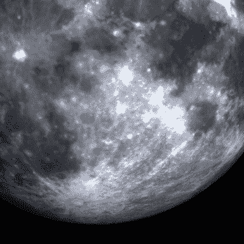

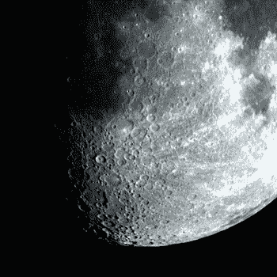

**192**

图 6-13：左侧细节相对较少，而在斜射光照下，右侧显示出了更多细节。

理解高光和阴影如何协同作用，对于美术家和插画家的训练至关重要。

如果通过增加真实的表面位移来复制整个月球表面，可能需要数千兆字节的数据，无论从内存还是 CPU 角度来看，对于当前一代小型手持设备都是不可能的。因此，相当优雅的凹凸映射技巧便登上了舞台中心。

如果你还记得第 4 章关于光照的内容，需要向球体模型添加一个“面法线”数组。法线是垂直于表面的向量，它指示了面的朝向。法线与任何光源之间的夹角，在很大程度上决定了该面的亮度或暗度。面朝向光线越直接，它就越亮。那么，如果我们有一种紧凑的方法来编码法线——不是基于每个面（因为一个模型可能只有相对较少的面），而是基于每个像素——会怎样？进一步，如果我们能将这个编码后的法线数组与真实的图像纹理结合，并根据入射光的方向来提亮或变暗纹理中的像素，又会怎样？

这就把我们带回了纹理组合器。在表 6-3 中，请注意最后两种组合器类型：`GL_DOT3_RGB`和`GL_DOT3_RGBA`。现在，让我们回溯到高中几何课堂。还记得两个向量的点积吗？点积和叉积都是你曾经抱怨过的东西：“老——师？？我为什么要学这个？”好吧，现在你就要得到答案了。

点积是根据另外两个向量的夹角计算出的一个向量的长度。还是不太明白？请看图 6-14（左）。点积就是法向量指向光源的“程度”，这个值被直接用于照亮该面。在图 6-14（右）中，面与阳光方向成直角，因此它没有被照亮。

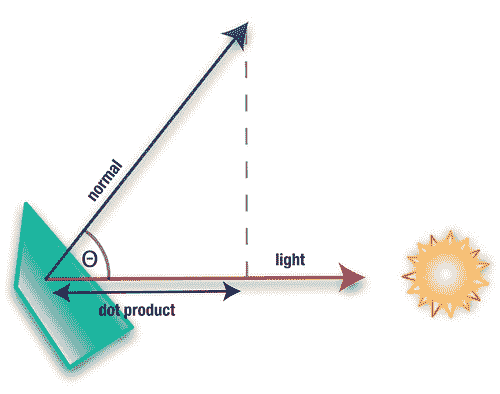

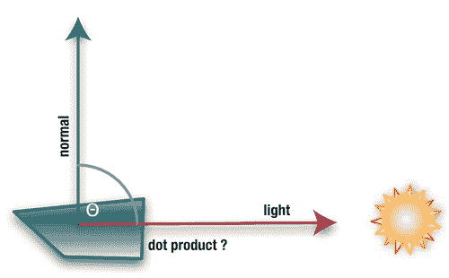

**193**

图 6-14：左侧的面被照亮，而右侧的面则没有被照亮。

基于此，凹凸映射所采用的“取巧”方法如下。获取你想要使用的实际纹理，并为其添加一个特殊的第二个伴生纹理。这个第二纹理使用 RGB 颜色来编码法线信息。因此，不再使用每个分量 4 字节的浮点数，而是使用每个分量 1 字节的值来表示法线向量的 xyz 分量，这些值恰好可以嵌入一个 4 字节的像素中。由于向量通常不需要极高的精度，8 位分辨率已经足够，而且内存效率非常高。这些法线的生成方式，使其能够直接映射到你希望突出显示的各种高度特征上。

由于法线既可能取负值也可能取正值（背向太阳时为负值），xyz 值被居中映射到 0 到 1 的范围内。也就是说，-127 到+127 的范围需要映射到 0 到 1 之间。因此，“红色”分量（通常是向量的 x 部分）的计算方式如下：`red = (x + 1) / 2`。当然，绿色和蓝色分量的处理方式与此类似。

现在来看表 6-3 中`GL_DOT3_RGB`条目所表达的公式。它将 RGB 三元组视为向量，并返回其长度。N 是法向量，L 是光向量，因此长度计算如下：

`length = 4 × ((Rn - 0.5) × (Rl - 0.5) + (Gn - 0.5) × (Gl - 0.5) + (Bn - 0.5) × (Bl - 0.5))`。

[www.it-ebooks.info](http://www.it-ebooks.info)


因此，如果面朝向沿 x 轴方向直射的光源，法线的红色分量将为 `1.0`，光源的红色或 x 值也将是 `1.0`。绿色和蓝色分量则为 `.5`，这是 `0` 的编码形式。将其代入之前的方程，结果如下：

```
*长度* = 4 × 1

(( *n* − )

. × 1

( *l* − )

. + 5

(. *n* − )

. × 5

(. *l* − )

. + 5

(. *n* − )

. × 5

(. *l* − ))

.

*长度* = 4× 25

(.

+ 0 + )

0 = 0

.
```

这完全符合预期。如果法线在 z 方向（即向上且远离表面）上，编码在蓝色字节中，那么结果应为 `0`，因为法线主要指向远离纹理 X 和 Y 平面的上方。

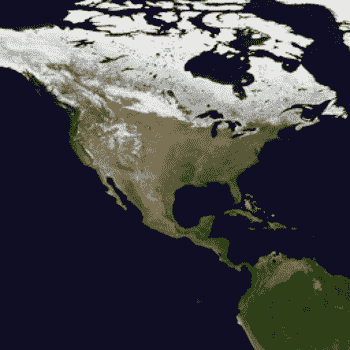
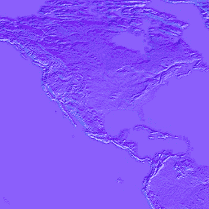

**第 6 章：它会混合吗？** **194** 展示了部分地球地图，而图 6-15（右侧）显示了其对应的法线贴图。

图 6-15. 左侧是我们的图像；右侧是对应的法线贴图。

为什么法线贴图主要是紫色的？指向远离地球表面的向上向量被编码为 `red=.5`、`green=.5`、`blue=1`。（请记住，`.5` 实际上就是 `0`。）

当纹理混合器设置为 `DOT3` 模式时，它会使用法线和光照向量来确定每个纹素的强度。然后，该值被用于调制实际图像纹理的颜色。

现在是时候重新利用之前的多重纹理项目了。我们需要添加第二个纹理，即从 Apress 网站获取的凹凸贴图，并更改混合器的设置方式。

在 `viewDidLoad()` 方法中，为此示例加载法线贴图到 `m_Texture0`，然后将配套的地球纹理作为 `m_Texture1` 加载。接着添加新例程 `MultiTextureBumpMap()`，如列表 6-6 所示。

**列表 6-6.** *设置用于凹凸贴图的混合器*

```
-(void)multiTextureBumpMap:(GLuint)tex0 tex1:(GLuint)tex1

{

GLfloat x,y,z;

static float lightAngle=0.0;

lightAngle+=1.0; //1

if(lightAngle>180)

lightAngle=0;

// 设置光照向量。

x = sin(lightAngle * (3.14159 / 180.0)); //2

y = 0.0;

z = cos(lightAngle * (3.14159 / 180.0));

// 将值进行半偏移，使其介于 0.0 和 1.0 之间。

x = x * 0.5 + 0.5; //3

y = y * 0.5 + 0.5;

z = z * 0.5 + 0.5;

glColor4f(x, y, z, 1.0); //4

// 颜色贴图和法线贴图被组合。

glActiveTexture(GL_TEXTURE0); //5

glBindTexture(GL_TEXTURE_2D, tex0);

glTexEnvf(GL_TEXTURE_ENV, GL_TEXTURE_ENV_MODE, GL_COMBINE); //6

glTexEnvf(GL_TEXTURE_ENV, GL_COMBINE_RGB, GL_DOT3_RGB); //7

glTexEnvf(GL_TEXTURE_ENV, GL_SRC0_RGB, GL_TEXTURE); //8

glTexEnvf(GL_TEXTURE_ENV, GL_SRC1_RGB, GL_PREVIOUS); //9

// 设置第二个纹理，并将其与 Dot3 组合的结果进行混合。

glActiveTexture(GL_TEXTURE1); //10

glBindTexture(GL_TEXTURE_2D, tex1);

glTexEnvf(GL_TEXTURE_ENV, GL_TEXTURE_ENV_MODE, GL_MODULATE); //11

}
```

上述操作分为两个阶段进行。第一阶段将凹凸贴图与主颜色（通过 `glColor4f` 调用设置）混合。第二阶段则将混合结果与彩色图像使用我们的老朋友 `GL_MODULATE` 进行组合。

那么，让我们逐一分析：

- 在第 1 行，我们定义了 `lightAngle`，它将在 0 到 180 度之间循环，以展示在不同光照条件下高光的表现。
- 在第 2 行及之后，计算光照向量的 `xyz` 值。
- 在第 3 行，`xyz` 分量需要缩放以匹配凹凸贴图的值。
- 第 4 行使用光照向量分量对片段进行着色。
- 第 5 行及之后，首先设置并绑定凹凸贴图，即 `tex0`。
- 第 6 行的 `GL_COMBINE` 告知系统将采用组合模式。


在第 7 行，我们指定将使用 `GL_DOT3_RGB` 操作（`GL_DOT3_RGBA` 包含 Alpha 通道，但此处不需要）仅合并 RGB 值。

[www.it-ebooks.info](http://www.it-ebooks.info)

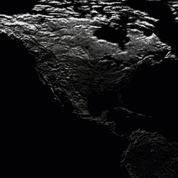
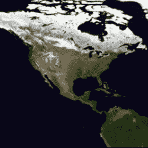
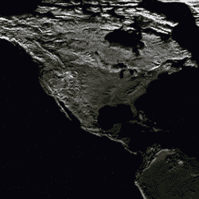

