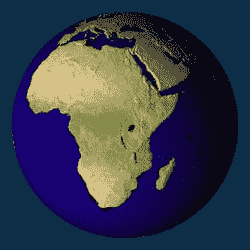
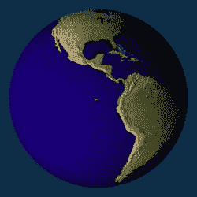
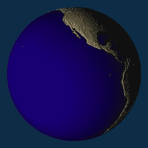
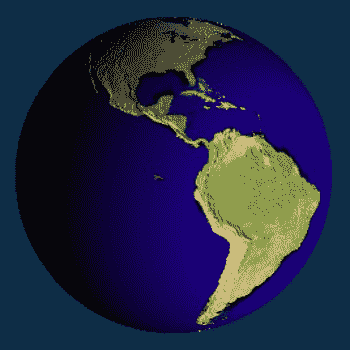

# 排版后的文本

`[self multiTextureBumpMap:m_BumpMapInfo.name tex1:m_TextureInfo.name];`

`glDrawArrays(GL_TRIANGLE_STRIP, 0, (m_Slices+1)*2*(m_Stacks-1)+2);`

`return true;`

`}`

确保将上一练习中的 `multiTextureBumpMap()` 复制到 `Planet.m` 文件中。

现在，前往太阳系控制器中初始化光源的位置，并注释掉创建镜面材质（specular material）的调用。凹凸贴图与镜面反射的兼容性并不太好。

接着，将太阳系控制器中当前的 `execute()` 和 `executePlanet()` 方法替换为代码清单 6-9 中的内容。这段代码会移除太阳，将地球移至场景中心，并将主光源放置在左侧。

## 代码清单 6-9 将地球置于中心的新执行程序

```
-(void)execute
{
    GLfloat posFill1[]={-8.0,0.0,5.0,1.0};
    GLfloat cyan[]={0.0,1.0,1.0,1.0};
    static GLfloat angle=0.0;
    GLfloat orbitalIncrement=.5;
    GLfloat sunPos[4]={0.0,0.0,0.0,1.0};
    glLightfv(SS_FILLLIGHT1,GL_POSITION,posFill1);
    glEnable(GL_DEPTH_TEST);
    glClearColor(0.0, 0.25f, 0.35f, 1.0);
    glClear(GL_COLOR_BUFFER_BIT);
    glPushMatrix();
    glTranslatef(-m_Eyeposition[X_VALUE],-m_Eyeposition[Y_VALUE],-m_Eyeposition[Z_VALUE]);
    glLightfv(SS_SUNLIGHT,GL_POSITION,sunPos);
    glEnable(SS_FILLLIGHT1);
    glDisable(SS_FILLLIGHT2);
    glPushMatrix();
    angle+=orbitalIncrement;
    [self executePlanet:m_Earth];
    glPopMatrix();
    glPopMatrix();
}
```

[www.it-ebooks.info](http://www.it-ebooks.info)







### 第 6 章：它会混合吗？——199

```
-(void)executePlanet:(Planet *)planet
{
    GLfloat posX, posY, posZ;
    static GLfloat angle=0.0;
    glPushMatrix();
    [planet getPositionX:&posX Y:&posY Z:&posZ];
    glTranslatef(posX,posY,posZ);
    glRotatef(angle,0.0,1.0,0.0);
    [planet execute];
    glPopMatrix();
    angle+=.4;
}
```

如果你现在看到类似图 6-17 的景象，那么你可以正式拍拍自己表示赞许。

**图 6-17.** 凹凸不平的地球

好，现在做个实验：移动光源位置，使其从右侧而不是左侧照射进来。图 6-18 显示了出乎意料的结果。这是怎么回事？现在，山脉看起来像山谷了。

[www.it-ebooks.info](http://www.it-ebooks.info)



### 第 6 章：它会混合吗？——200

**图 6-18.** 咦？

这里发生的情况是，我们正在探索组合器未曾涉足的领域。通过加入我们自己的光照，由光矢量提供的模拟光照效果被抵消了。当光源在左侧时，效果看起来不错，这主要归功于运气。如果你的场景光照相对静止，凹凸贴图在此处效果尚可。但它不兼容多光源。实际上，通过光矢量指定的伪光照效果会被“真实”光源所忽略。此外，如果关闭这些真实光源，光矢量会完全忽略物体上的任何着色。在这种情况下，你会看到整个地球变亮又变暗，因为这是纹理本身所呈现的效果——纹理仅仅是一个二维表面。如果它的一部分被照亮，那么全部都会被照亮。那么，一个 OpenGL 爱好者该如何应对呢？我的朋友，答案是着色器。着色器。这正是 OpenGL ES 2 和 iOS 5 扩展发挥作用的地方；这些内容将在第 10 章中介绍。

## 本章小结

在本章中，你学习了 OpenGL ES 1 提供的混合功能。混合通过混合函数和组合器表达其独特的语言。你了解了半透明效果，以及如何及何时应用它。此外，还介绍了通过混合和纹理实现动画与凹凸贴图的一些巧妙技巧。在下一章中，我将开始应用这些技巧，并展示其他能让 3D 宇宙更加有趣的技巧。

[www.it-ebooks.info](http://www.it-ebooks.info)

