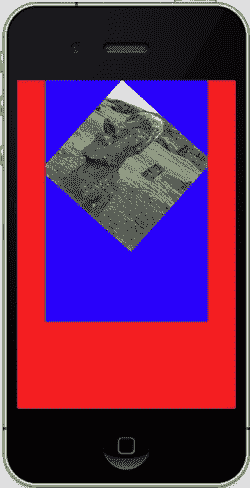

# 第 7 章：渲染精美的杂项


  
如果我们确切知道自己在做什么，那它就不叫研究了，不是吗？  

——阿尔伯特·爱因斯坦  

在开始本章时，我试图找一句与杂项主题相称的引言。遗憾的是，能找到的只有一堆杂七杂八的语录。但阿尔伯特·爱因斯坦的这句话确实是个珍宝，几乎可以适用——因为亲爱的读者，你正在开展研究：研究如何制作更丰富、更引人入胜且更有趣的软件。  

苹果发布的产品和工具用起来很有趣——几乎到了好玩、迷人且令人惊叹的地步。如果打扫房间能像用 iPad 一样有趣，我们都能从 *《好管家》* 杂志获得奖项。  

在像这样的书中，有时很难对某个特定主题进行清晰分类。因此，当某些内容不足以单独成章时，我们只能把它们一股脑儿塞进一个章节里。所以，这里我将介绍一些经典的呈现与渲染技巧——无论它们是否能应用到太阳系项目中——这些技巧将 UIKit 元素与 OpenGL 窗口以及场景中组件的用户交互整合在一起。  

## **帧缓冲对象**  

通常简称为 FBO，你可以把帧缓冲对象简单理解为渲染表面。到目前为止，你一直在使用一个 FBO，可能自己都没意识到：你的场景渲染到的 `EAGL` 上下文本身就是一个 FBO。而你可能不知道的是，你可以同时拥有多个屏幕。和之前一样，我们先从老标准入手，再看看它可以如何延伸发展。  

[www.it-ebooks.info](http://www.it-ebooks.info)  

**第 7 章：精心渲染的杂项**  

**202**  

## **海德利缓冲对象**  

到了这时候，你应该轻车熟路了：找到第 5 章练习中那个原始 2D 纹理填充的方形。这将像往常一样作为我们的基础框架。你需要创建一个单独的对象来封装新的 FBO。把它命名为 `FBOController`，并用清单 7-1 和清单 7-2 填充它。  

**清单 7-1.** `FBOController.h` 的头文件  

```  
#import <Foundation/Foundation.h>  
#import <UIKit/UIKit.h>  
#import <GLKit/GLKit.h>  

@interface FBOController : NSObject  
{  
    GLuint m_Texture;  
    GLuint m_FBO1;  
}  

-(GLint)getFBOName;  
-(GLuint)getTextureName;  
-(id)initWidth:(float)width height:(float)height;  

@end  
```  

**清单 7-2.** `FBController.m` 的主体部分  

```  
#import <OpenGLES/ES1/gl.h>  
#import <OpenGLES/ES1/glext.h>  
#import "FBOController.h"  

@implementation FBOController  

-(id)initWidth:(float)width height:(float)height  
{  
    GLint originalFBO;  
    GLuint depthBuffer;  
    
    // 缓存原始 FBO，稍后恢复  
    glGetIntegerv(GL_FRAMEBUFFER_BINDING_OES, &originalFBO); //1  
    
    glGenRenderbuffersOES(1, &depthBuffer); //2  
    glBindRenderbufferOES(GL_RENDERBUFFER_OES, depthBuffer);  
    
    glRenderbufferStorageOES(GL_RENDERBUFFER_OES, //3  
                             GL_DEPTH_COMPONENT16_OES, width, height);  
    
    // 创建用于渲染的纹理  
    glGenTextures(1, &m_Texture); //4  
    glBindTexture(GL_TEXTURE_2D, m_Texture);  
```  

[www.it-ebooks.info](http://www.it-ebooks.info)  

**第 7 章：精心渲染的杂项**  

**203**  

```  
    glTexImage2D(GL_TEXTURE_2D, 0, GL_RGB, width, height, 0,  
                 GL_RGB, GL_UNSIGNED_SHORT_5_6_5, 0);  
    
    glTexParameterf(GL_TEXTURE_2D, GL_TEXTURE_MIN_FILTER, GL_LINEAR);  
    glTexParameterf(GL_TEXTURE_2D, GL_TEXTURE_MAG_FILTER, GL_LINEAR);  
    glTexParameterf(GL_TEXTURE_2D, GL_TEXTURE_WRAP_S, GL_CLAMP_TO_EDGE);  
    glTexParameterf(GL_TEXTURE_2D, GL_TEXTURE_WRAP_T, GL_CLAMP_TO_EDGE);  
    
    // 现在创建实际的 FBO  
    glGenFramebuffersOES(1, &m_FBO1); //5  
    glBindFramebufferOES(GL_FRAMEBUFFER_OES, m_FBO1);  
    
    // 将纹理附加到 FBO  
    glFramebufferTexture2DOES(GL_FRAMEBUFFER_OES, //6  
                              GL_COLOR_ATTACHMENT0_OES, GL_TEXTURE_2D, m_Texture, 0);  
    
    // 将之前创建的深度缓冲区附加到 FBO  
    glFramebufferRenderbufferOES(GL_FRAMEBUFFER_OES, //7  
                                 GL_DEPTH_ATTACHMENT_OES, GL_RENDERBUFFER_OES, depthBuffer);  
```  


```objectivec
// 检查我们创建 FBO 是否成功。
glCheckFramebufferStatusOES(GL_FRAMEBUFFER_OES); //8
GLuint uStatus = glCheckFramebufferStatusOES(GL_FRAMEBUFFER_OES);
if(uStatus != GL_FRAMEBUFFER_COMPLETE_OES)
{
    NSLog(@"错误：初始化 FBO 失败");
    return 0;
}
glClear(GL_COLOR_BUFFER_BIT | GL_DEPTH_BUFFER_BIT);
glBindFramebufferOES(GL_FRAMEBUFFER_OES, originalFBO); //9
return self;
}
-(GLint)getFBOName //10
{
    return m_FBO1;
}
-(GLuint)getTextureName //11
{
    return m_Texture;
}
@end
```

你应该能识别出这里的模式，因为创建 FBO 与许多其他 OpenGL 对象非常相似。那么，我们来逐一分解：

与许多 OpenGL 对象一样，FBO 使用“名称”作为句柄来唯一标识它们。在第 1 行，我们获取了用作主屏幕的原始帧缓冲区对象。这样做是为了做个好邻居，在最后恢复它。否则，可能会错误地使用其他对象。

第 2 行，我们为深度缓冲区生成了一个名称。然后，它被绑定到系统作为当前的渲染缓冲区。如果这是该对象第一次绑定，OpenGL 将为其分配内存（不包括图像内存），并在之后的所有绑定中使用该已分配的内存。

在第 3 行，我们实际为缓冲区的图像数据分配了内存。由于图像需要大块的内存，因此它们永远不应当被提前分配，直到真正需要时。这就是为什么绑定和分配操作通常分开进行。

在第 4 行及之后，我们需要分配一个纹理图像并将其链接到帧缓冲区。这是将我们的 FBO 伪装成 OpenGL 眼中与其他纹理无异的接口。在这里，我们还可以设置一些常规纹理属性，例如边缘条件和双线性过滤。

到目前为止，我们只是创建了深度缓冲区和图像接口。在第 5 行，我们实际创建了帧缓冲区对象，并将之前的各部分挂载到它上面。

第 6 行首先挂载了纹理。注意使用了`GL_COLOR_ATTACHMENT0_OES`。纹理部分实际上存储了颜色信息，因此它被称为颜色附着点。

在第 7 行，我们对深度缓冲区执行相同操作，使用`GL_DEPTH_ATTACHMENT_OES`。并且记住，在 OpenGL ES 中，我们只有三种类型的缓冲区附着点：深度、颜色和模板。后者用于实现诸如在屏幕特定区域遮挡渲染等功能。而完整版的 OpenGL 则添加了第四种类型：`GL_DEPTH_STENCIL_ATTACHMENT`。

第 8 行进行快速错误检查。

如前所述，我们需要在第 9 行恢复用于主屏幕的原始 FBO。

最后，第 10 和 11 行提供了获取方法，以便我们可以使用新创建的 FBO。

那么，这仅仅是创建 FBO 的过程。你会看到，这是一段相当简洁的代码，使用了 OpenGL ES 1 和 2 中都可用的内置函数。是的，它看起来确实有点过于复杂，但通过一个辅助函数很容易封装起来。

不过，我们还没有完全完成，因为现在我们必须要重新调整`drawInRect()`，使其使用两个 FBO。

在`viewDidLoad()`方法的末尾，添加以下几行：

```objectivec
m_FBOHeight=480;
m_FBOWidth=320;
m_FBOController=[[FBOController alloc]initWidth:m_FBOWidth height:m_FBOHeight];
```

然后根据需要修改头文件。第一行缓存了原始 FBO，以便能够在需要时正确恢复它。

现在，添加清单 7-3 中所示的新`drawInRect()`方法。

**清单 7-3.** 新的`drawInRect()`，渲染到两个 FBO

```objectivec
- (void)glkView:(GLKView *)view drawInRect:(CGRect)rect
{
    static const GLfloat squareVertices[] =
    {
        -0.5, -0.5, 0.0,
        0.5, -0.5, 0.0,
        -0.5, 0.5, 0.0,
        0.5, 0.5, 0.0
    };
    static const GLfloat fboVertices[] =
    //1
    {
        -0.5, -0.75, 0.0,
        0.5, -0.75, 0.0,
        -0.5, 0.75, 0.0,
```


`0.5, 0.75, 0.0`

`};`

```
static GLfloat textureCoords1[] =
{
    0.0, 0.0,
    1.0, 0.0,
    0.0, 1.0,
    1.0, 1.0
};
```

```
static float transY = 0.0;
static float rotZ = 0.0;
static float z = -1.5;
```

```
if(m_DefaultFBO==0)
    glGetIntegerv(GL_FRAMEBUFFER_BINDING_OES, &m_DefaultFBO); //2
```

```
glDisableClientState(GL_COLOR_ARRAY|GL_DEPTH_BUFFER_BIT);
```

```
//首先，绘制到离屏 FBO。
glBindFramebufferOES(GL_FRAMEBUFFER_OES, [m_FBOController getFBOName]); //3
```

```
glClearColor(0.0, 0.0, 1.0, 1.0);
glClear(GL_COLOR_BUFFER_BIT);
```

```
glMatrixMode(GL_MODELVIEW);
glLoadIdentity();
```

```
glTranslatef(0.0, (GLfloat)(sinf(transY)/2.0), z);
glRotatef(rotZ, 0, 0, 1.0); //4
```

```
glEnable(GL_TEXTURE_2D);
glBindTexture(GL_TEXTURE_2D, m_Texture.name);
glTexCoordPointer(2, GL_FLOAT,0,textureCoords1);
glEnableClientState(GL_TEXTURE_COORD_ARRAY);
```

```
glVertexPointer(3, GL_FLOAT, 0, squareVertices);
glEnableClientState(GL_VERTEX_ARRAY);
```

```
glDrawArrays(GL_TRIANGLE_STRIP, 0, 4); //5
```

```
glBindFramebufferOES(GL_FRAMEBUFFER_OES, m_DefaultFBO); //6
glLoadIdentity();
```

```
glTranslatef(0.0, (GLfloat)(sinf(transY)/2.0),z);
```

```
glBindTexture(GL_TEXTURE_2D, [m_FBOController getTextureName]);
```

```
//7
glClearColor(1.0, 0.0, 0.0, 1.0); //8
glClear(GL_COLOR_BUFFER_BIT);
```

```
glTexCoordPointer(2, GL_FLOAT,0,textureCoords1);
glEnableClientState(GL_TEXTURE_COORD_ARRAY);
```

```
glVertexPointer(3, GL_FLOAT, 0, fboVertices); //9
glEnableClientState(GL_VERTEX_ARRAY);
```

```
glDrawArrays(GL_TRIANGLE_STRIP, 0, 4);
```

```
transY += 0.075;
rotZ+=1.0;
}
```

在第 1 行中，指定了 FBO 的顶点，这与弹跳图像的顶点没有太大区别。

在第 2 行中，我们获取并保存了用于主显示的默认 FBO。如果你还没有这样做，那么它应该被声明为 `GLint m_Default_FBO`。

第 3 行是我们实际告知 OpenGL 使用新 FBO 的地方，采用与基本纹理映射类似的绑定方法。

接下来的代码是用于管理变换等的标准设置代码。

第 4 行添加了一个小旋转，以增加一些额外的动态效果。

第 5 行的 `glDrawArray()` 功能一如既往，但由于新 FBO 已绑定到系统，其写入操作会被重定向到该 FBO，而不是主屏幕。

第 6 行及后续代码将我们切换到之前一直使用的主 FBO。

`glLoadIdentity()` 会清除子视图累积的所有变换。

第 7 行的 `glBindTexture()` 是整个魔法的核心。与第 3 行之后立即将“普通”纹理绑定到辅助 FBO 不同，我们现在通过其访问纹理来绑定 FBO 本身。任何可以使用纹理的地方，我们特殊的 FBO 纹理也同样可以使用。

请注意，第 8 行的 `glClearColor` 将背景清除为红色，而之前展示的辅助 FBO 使用蓝色。这种更加刺眼的效果，能让不同的物体更加突出。

第 9 行使用了一组新的顶点。原始顶点集为纹理块绘制了一个正方形，而新的顶点集则按照正常屏幕的比例绘制了一个矩形，使其看起来像是前者的一个微小且活跃的版本。随后是第二个 `glDrawArrays()`，并对旋转和位移值进行递增。

你应该能够运行它，并见证其俗艳夺目的效果。如果你打算长时间盯着它看，则需要征得医生的许可。图 7-1（左）即为其结果。

现在，是时候进行微调了。这次在主 FBO 上添加第二个旋转。将其添加到第二个 `glTranslation()` 调用之前，按相同方向旋转，你应该会看到图 7-1（中）。那么，要看到图 7-1（右）该怎么做呢？




