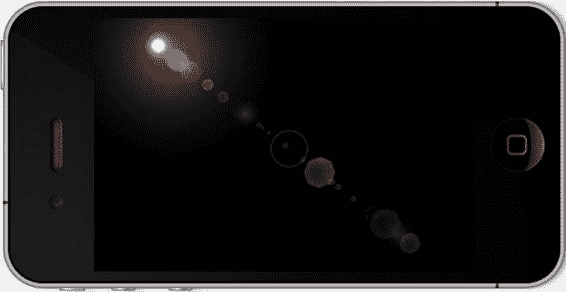

# 排版后内容

这些值最终会传递给`glTranslatef()`。

接下来，为了安全起见，关闭任何深度测试以及光照，因为光晕必须独立于场景中的实际光照进行计算。

由于我们将使用正交投影，在第 4 行中将`GL_PROJECTION`重置为单位矩阵。请记住，任何时候想要操作特定的矩阵，都需要提前指定是哪一个。`glPushMatrix()`方法让我们可以在不破坏之前任何操作的情况下调整投影矩阵。

第 5 行是这个例程的核心。`glOrthof()`是一个新调用，用于设置正交矩阵。实际上，它指定了一个盒子。在这个例子中，盒子的宽度和深度范围都是从-1 到 1，而高度则使用宽高比进行额外缩放，以补偿非正方形显示。这就是为什么之前的`scaledX`和`scaledY`值要乘以 2 的原因。

接下来，在第 6 行设置模型视图的单位矩阵，然后在第 7 行调用`glTranslatef()`。

第 8 行根据场景的视野确定如何缩放光晕集合，接着第 9 行执行实际的缩放。这是相对的，取决于你想要处理的放大范围。目前尚未实现捏合缩放，因此这个值保持不变。`zoomBias`影响所有元素，这使得一次性缩放所有内容变得容易。

第 10 行及之后的内容使用最常见的选项设置混合函数。这使得每个反射都以非常可信的方式混合，尤其是当它们开始在中心堆积时。

现在设置颜色并绘制对象。

再次，做好“邻居”，弹出矩阵，以免影响其他任何内容。

我为单个光晕创建了一个光晕对象，并创建了一个`LensFlare`父对象来处理向量的设置、包含每个单独的图像，并在准备就绪时放置它们。来自清单 7-7 中`LensFlare.mm`的主循环此时应该几乎不需要解释。它只是计算光晕向量的起点，然后遍历数组以执行每个实体。

[www.it-ebooks.info](http://www.it-ebooks.info)

## 第 7 章：精心渲染的杂项

**217**

### 清单 7-7：整个镜头光晕效果的执行循环

```
-(void)execute:(CGRect)frame source:(CGPoint)source
{
    CGPoint position;
    NSEnumerator *e;
    Flare *object;

    static GLfloat deltaX=40,deltaY=40;
    static GLfloat offsetFromCenterX,offsetFromCenterY;
    static GLfloat startingOffsetFromCenterX,startingOffsetFromCenterY;

    int numElements;
    GLfloat cx,cy;

    static int counter=0;

    e=[m_Flares objectEnumerator];

    cx=(frame.size.width/2.0);
    cy=(frame.size.height/2.0);

    startingOffsetFromCenterX=cx-source.x;
    startingOffsetFromCenterY=source.y-cy;

    offsetFromCenterX=startingOffsetFromCenterX;
    offsetFromCenterY=startingOffsetFromCenterY;

    numElements=[m_Flares count];

    deltaX=2.0*startingOffsetFromCenterX;
    deltaY=2.0*startingOffsetFromCenterY;

    while (object = [e nextObject])
    {
        position=CGPointMake(offsetFromCenterX,offsetFromCenterY);

        [object renderFlareAt:position];

        offsetFromCenterX-=deltaX*[object getVectorPosition];
        offsetFromCenterY-=deltaY*[object getVectorPosition];
    }

    counter++;
}
```

最后，每个单独的光晕图像必须在初始化时加载并添加到`NSArray`中。代码如下：

```
[m_Flares addObject:[[Flare alloc]init:@"hexagon_blur.png"
    size:1.0 vectorPosition:(.05-ff) r:1.0 g:0.73 b:0.30 a:.4]];
[m_Flares addObject:[[Flare alloc]init:@"glow.png"
    size:1.5 vectorPosition:(.055-ff) r:1.0 g:0.73 b:0.50 a:.4]];
```

[www.it-ebooks.info](http://www.it-ebooks.info)



## 第 7 章：精心渲染的杂项

**218**

这个演示有 24 个这样的对象。图 7-6 显示了结果。

### 图 7-6：简单的镜头光晕


