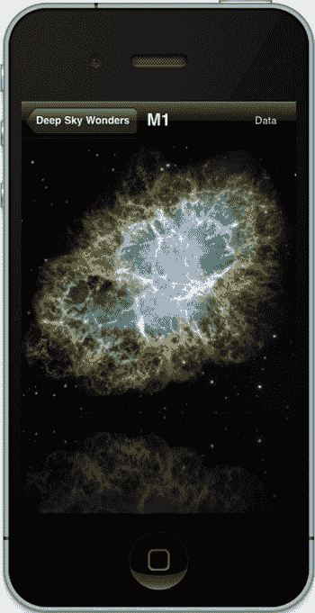
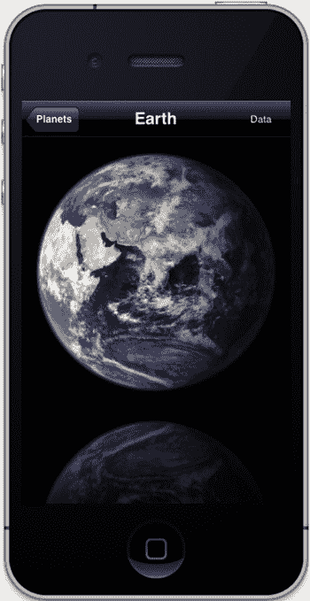
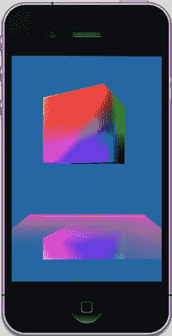
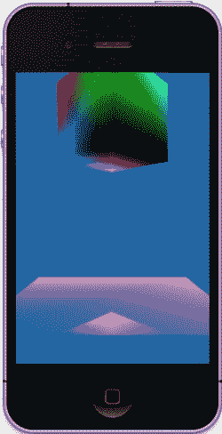
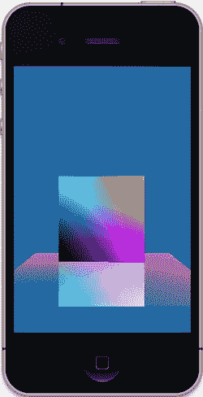
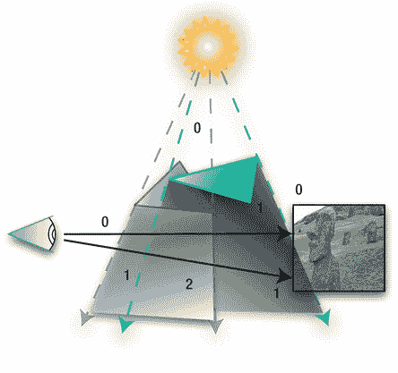

# 文档排版

遗憾的是，镜头光晕特效中存在一个重大难题。如果光源被其他物体遮挡会怎样？如果遮挡物是场景中央的一个规则球体等常见且已知的物体，处理起来相当简单。但若是随机位置上的随机物体，难度就会大大增加。那么，当光源仅被部分遮蔽时又该如何处理？只有在整个物体被完全隐藏时，反射效果才会变暗并逐渐消失。这个解决方案暂且留给你自行思考。

## 模板反射表面

另一种正快速沦为视觉套路的特效（尽管仍然很酷），是在场景的部分或全部区域下方设置镜面反射表面。我们 Mac 用户每次看到 Dock 栏时都会见到这种效果——那些快乐的小图标欢快地上下舞动，仿佛用尖细的声音喊着"看这里！看这里！"

下方你会看到淡淡的倒影。当然，苹果的设计范例引领下，许多第三方应用也采用了相同效果。参见图 7-7。

[www.it-ebooks.info](http://www.it-ebooks.info)





**第 7 章：精心渲染的杂项**

**219**

图 7-7. 遥远太阳中的倒影（没错，这是个免费的广告）。当然，苹果的示例是用 Core Graphics 实现的，但原理相同：这就是个投机取巧的方法！不过电脑图形学中大部分技术也是如此——我们试图通过一切必要手段模拟真实世界，制作这种反射表面也不例外。

这将引出下一个主题，涉及模板和反射两方面。除了"颜色"缓冲区（即图像缓冲区）和深度缓冲区外，OpenGL 还有一种称为模板缓冲区的机制。

在 iOS5 之前的时代，创建模板缓冲区需要额外十几行代码。此后已简化为仅需一行代码，微不足道。在`viewDidLoad()`中创建上下文时，添加：

```
view.drawableStencilFormat = GLKViewDrawableStencilFormat8;
```

模板格式可以是 8 位，也可以不使用。

接下来创建生成实际模板的例程。将清单 7-8 添加到视图控制器中，并在主绘制循环中调用`renderToStencil()`。

[www.it-ebooks.info](http://www.it-ebooks.info)

**第 7 章：精心渲染的杂项**

**220**

本质上，渲染模板缓冲区与其他缓冲区类似，但在此情况下，每个像素及其数值将用于决定后续图像如何渲染到屏幕上。最常见的情况是：后续绘制在模板区域内的图像会正常渲染，而模板区域外的则不会渲染。当然，这些行为可以修改，这符合 OpenGL"让一切比绝大多数工程师会用（更别说理解）的配置更灵活"的理念。尽管如此，它有时确实非常实用。目前我们仍使用简单功能。

清单 7-8. 模板像普通屏幕对象一样生成

```
- (void)renderToStencil
{
    glEnable(GL_STENCIL_TEST);                              //1
    glStencilFunc(GL_ALWAYS, 1, 0xffffffff);                //2
    glStencilOp(GL_REPLACE, GL_REPLACE, GL_REPLACE);        //3
    [self renderStage];                                      //4
    glStencilFunc(GL_EQUAL, 1, 0xffffffff);                 //5
    glStencilOp(GL_KEEP, GL_KEEP, GL_KEEP);                 //6
}
```

因此，按以下方式建立模板：

如第 1 行所示启用模板。

第 2 行指定了向模板缓冲区写入时的比较函数。由于每次都会清除缓冲区，初始值全为零。函数`GL_ALWAYS`表示每次写入都会通过模板测试，这正是构建模板时所需的行为。值 1 称为参考值。

由于参考值取值范围为 0 到 255，可以根据提供的参考值让模板产生不同行为。


## 模板操作的设置方式

最终值是一个用于访问位平面的掩码。由于我们并不关心这一点，直接全部启用即可。

第 3 行指定了模板测试成功或失败时的处理方式。第一个参数对应模板测试失败的情况；第二个参数对应模板测试通过但深度测试失败的情况；第三个参数则对应两者都通过的情况。由于我们身处三维空间，模板测试与深度测试的联动机制表明，在某些情况下两者可能相互制约。模板缓冲区的使用中有些微妙的细节处理起来相当复杂。在此例中，将三个参数均设置为 `GL_REPLACE`。表 7-1 列出了所有其他允许的取值。

[www.it-ebooks.info](http://www.it-ebooks.info)

## 第 7 章：渲染精粹

**221**

第 4 行调用渲染函数，几乎与你平时调用它的方式相同。在此情况下，它同时向模板缓冲区和某个颜色通道写入数据，因此我们可以在全新的闪亮舞台或平台上获得某种闪光效果。与此同时，模板缓冲区中的背景像素将保持为 0，而图像则会生成大于 0 的模板像素值，这使得后续的图像数据可以向其上写入。

第 5 行和第 6 行现在将缓冲区调整为正常使用状态。第 5 行规定：如果当前寻址的模板像素值为 1，则按第 6 行所述保持其不变。否则，允许该片段通过并继续处理，如同模板缓冲区不存在一样（不过如果它未能通过深度测试，仍可能被忽略）。因此，任何值为 0 的模板像素都会导致测试失败，传入的片段将被阻挡在外。

## 表 7-1. `glStencilOp()` 的可用取值

| 操作类型 | 说明 |
|---------|--------|
| `GL_KEEP` | 保持当前值。 |
| `GL_ZERO` | 将模板缓冲区值设为 0。 |
| `GL_REPLACE` | 将模板缓冲区值设为 `glStencilFunc` 指定的 `ref` 值。 |
| `GL_INCR` | 将当前模板缓冲区值递增。递增到最大可表示无符号值时将钳制在该最大值。 |
| `GL_INCR_WRAP` | 将当前模板缓冲区值递增。当递增到最大可表示无符号值时，模板缓冲区值将回绕至零。 |
| `GL_DECR` | 将当前模板缓冲区值递减。递减到 0 时将钳制在 0。 |
| `GL_DECR_WRAP` | 将当前模板缓冲区值递减。当递减 0 值时，模板缓冲区值将回绕至最大可表示无符号值。 |
| `GL_INVERT` | 对当前模板缓冲区值进行按位取反。 |

如您所见，模板缓冲区是一个非常强大的工具，拥有许多精妙之处。但更高级的用法将留待后续未命名的书籍中探讨。

现在来看看 `renderStage()` 方法，如清单 7-9 所示。

## 清单 7-9. 仅将反射区域渲染到模板缓冲区

```objc
-(void)renderStage
{
    static const GLfloat flatSquareVertices[] =
    {
        -0.5, 0.0, -.5f,
        0.5, 0.0, -.5f,
        -0.5, 0.0, 0.5,
        0.5, 0.0, 0.5
    };

    static const GLubyte colors[] =
    {
        255, 0, 0, 128,
        255, 0, 0, 255,
        0, 0, 0, 0,
        128, 0, 0, 128
    };

    glFrontFace(GL_CW);
    glPushMatrix();
    glTranslatef(0.0,-1.0,-3.0);
    glScalef(2.5,1.5,2.0);

    glVertexPointer(3, GL_FLOAT, 0, flatSquareVertices);
    glEnableClientState(GL_VERTEX_ARRAY);

    glColorPointer(4, GL_UNSIGNED_BYTE, 0, colors);

    glDepthMask(GL_FALSE); //1
    glColorMask(GL_TRUE, GL_FALSE, GL_FALSE, GL_TRUE); //2
    glDrawArrays( GL_TRIANGLE_STRIP,0, 4); //3
    glColorMask(GL_TRUE, GL_TRUE, GL_TRUE, GL_TRUE); //4
    glDepthMask(GL_TRUE); //5

    glPopMatrix();
}
```

在第 1 行中，深度缓冲区的写入被禁用；第 2 行则禁用了绿色和蓝色通道，因此只使用红色通道。这就是反射区域获得微小红光高亮的方式。

现在，我们可以在第 3 行将图像绘制到模板缓冲区中。

第 4 行和第 5 行重置了掩码。


此刻，`drawInRect()` 例程又需要修改了。哈欠连天……不过如果你还能打起精神，请查看代码清单 7-10，它揭示了残酷且不加修饰的真相。

抱歉重复了这么多之前的代码，但这比说“……在投石机那行代码后面，添加某行某某代码……”要容易得多。

### 代码清单 7-10. 反射效果的 `drawInRect()` 方法

```
- (void)glkView:(GLKView *)view drawInRect:(CGRect)rect

{

static GLfloat z=-3.0;

static GLfloat spinX=0;

static GLfloat spinY=0;

[www.it-ebooks.info](http://www.it-ebooks.info)

CHAPTER 7: Well-Rendered Miscellany

223

static const GLfloat cubeVertices[] =

{

-0.5, 0.5, 0.5,

0.5, 0.5, 0.5,

0.5,-0.5, 0.5,

-0.5,-0.5, 0.5,

-0.5, 0.5,-0.5,

0.5, 0.5,-0.5,

0.5,-0.5,-0.5,

0.5,-0.5,-0.5,

};

static const GLubyte cubeColors[] =

{

255, 0, 0, 255,

0, 255, 0, 255,

0, 0, 0, 0,

0, 0, 255, 255,

255, 255, 0, 255,

0, 255, 255, 255,

0, 0, 0, 0,

255, 0, 255, 255,

};

static const GLubyte tfan1[6 * 3] =

{

1,0,3,

1,3,2,

1,2,6,

1,6,5,

1,5,4,

1,4,0

};

static const GLubyte tfan2[6 * 3] =

{

7,4,5,

7,5,6,

7,6,2,

7,2,3,

7,3,0,

7,0,4

};

static float transY = 0.0;

glClearColor(0.0, 0.5, 0.7f, 1.0);

glClear(GL_COLOR_BUFFER_BIT | GL_DEPTH_BUFFER_BIT | GL_STENCIL_BUFFER_BIT); //1

//首先渲染到模板缓冲区

[self renderToStencil]; //2

[www.it-ebooks.info](http://www.it-ebooks.info)

CHAPTER 7: Well-Rendered Miscellany

224

glEnable(GL_CULL_FACE);

glCullFace(GL_BACK);

glMatrixMode(GL_MODELVIEW);

glLoadIdentity();

glPushMatrix();

glEnable(GL_STENCIL_TEST); //3

glDisable(GL_DEPTH_TEST);

glVertexPointer(3, GL_FLOAT, 0, cubeVertices);

glEnableClientState(GL_VERTEX_ARRAY);

glColorPointer(4, GL_UNSIGNED_BYTE, 0, cubeColors);

glEnableClientState(GL_COLOR_ARRAY);

glEnableClientState(GL_NORMAL_ARRAY);

//翻转图像

glTranslatef(0.0,((GLfloat)(sinf(-transY)/2.0)-1.5),z); //4

glRotatef(spinY, 0.0, 1.0, 0.0);

glScalef(1.0, -1.0, 1.0); //5

glFrontFace(GL_CW);

glEnable(GL_BLEND); //6

glBlendFunc(GL_ONE, GL_ONE_MINUS_SRC_COLOR);

glDrawElements( GL_TRIANGLE_FAN, 6 * 3, GL_UNSIGNED_BYTE, tfan1); //7

glDrawElements( GL_TRIANGLE_FAN, 6 * 3, GL_UNSIGNED_BYTE, tfan2);

glPopMatrix();

glDisable(GL_BLEND); //8

glEnable(GL_DEPTH_TEST);

glDisable(GL_STENCIL_TEST);

//绘制主图像

glPushMatrix();

glScalef(1.0, 1.0, 1.0); //9

glFrontFace(GL_CCW);

glTranslatef(0.0, (GLfloat)1.5*(sinf(transY)/2.0)+0.5,z);

glRotatef(spinY, 0.0, 1.0, 0.0);

glDrawElements( GL_TRIANGLE_FAN, 6 * 3, GL_UNSIGNED_BYTE, tfan1); glDrawElements( GL_TRIANGLE_FAN, 6 * 3, GL_UNSIGNED_BYTE, tfan2);

[www.it-ebooks.info](http://www.it-ebooks.info)

CHAPTER 7: Well-Rendered Miscellany

225

glPopMatrix();

spinY+=.25;

transY += 0.075;

}
```

下面是详细解析：

第 1 行，在 `glClear()` 中增加了 `GL_STENCIL_BUFFER_BIT`。

第 2 行调用了新方法 `renderToStencil()`，该方法已在代码清单 7-9 中定义。它将实际创建模板区域，也就是我们接下来要“开孔”并进行绘制的区域。

第 3 行启用了模板测试。

在第 4 行和第 5 行，绘制了倒影。首先将其向下平移 1.5 个单位，以确保它位于真实立方体的下方。然后通过简单地将 y 轴“缩放”为 -1.0，使其上下颠倒。此时还需将正面设置为顺时针方向；否则，你只会看到背面。

我们希望下方图像的亮度低于全强度，这是符合预期的。在第 6 行，启用了混合，并使用第 6 章介绍的最常见的混合函数 `GL_ONE` 和 `GL_ONE_MINUS_SRC_COLOR`。

在第 7 行及后续行，我们看到翻转后的物体以与原始物体完全相同的方式绘制。绘制完成后，在第 8 行关闭混合，以免影响主立方体的渲染。同时，关闭模板测试，并重新开启深度测试。

由于之前为了翻转图像而改变了缩放，因此在第 9 行将缩放重置为默认值。平移量也做了一些微小调整。这使得翻转后的立方体略微上移，以获得额外的空间。

现在进行测试。你应该会看到结果如图 7-8 所示。

[www.it-ebooks.info](http://www.it-ebooks.info)







**第 7 章：精心渲染的杂项**
**226**

**图 7-8. 使用模板创建反射效果**

## 阴影的来临

在 OpenGL 中，阴影投射一直是一门偏玄学的技艺，在某种程度上现在依然如此。然而，随着更快的 CPU 和 GPU 的出现，许多过去更像研究生论文主题的行业技巧，终于可以走出理论，沐浴在实际应用的温暖光辉中。严格的阴影投射解决方案仍然是好莱坞使用的那种非实时渲染的领域，但在有限条件下，基本的阴影已经可用于全动态渲染。感谢各家硬件制造商为 GPU 增加了阴影和光照支持，我们的 3D 宇宙看起来比以往任何时候都更加丰富，因为计算机图形学中很少有元素能比精心处理的阴影带来更强的真实感。（去问问任何一部好莱坞电影的灯光总监就知道了。）别忘了还有通过 OpenGL ES 2 中的着色器实现的逐像素支持，它能让程序员在《毁灭一切 3》的每座阴森城堡的每个角落，都精细地渲染出阴影。

有许多方法可以投射阴影，或者至少是看起来像阴影的东西。最简单的方法可能是使用预渲染的阴影纹理：一张看起来像是物体投射在地面上的阴影的位图，然后跟随物体的移动而移动。这种方法成本低、速度快，但极其有限。另一个极端是彻底的“渲染你所能看到的一切”软件，它能够轻松吞噬成堆的 GPU。介于两者之间，有阴影映射、阴影体积和投影阴影等方法。

[www.it-ebooks.info](http://www.it-ebooks.info)



**第 7 章：精心渲染的杂项**
**227**

## 阴影映射

曾几何时，最流行的阴影投射形式之一是通过阴影映射来实现的，这在游戏中经常使用。虽然设置起来有点麻烦，更不用说描述了，但其理论却相当简单…...

深度阴影映射需要场景的两个快照。一个从光源的视角拍摄，另一个从相机的视角拍摄。从光源视角渲染时，图像自然会显示出光源所照射的一切。颜色信息会被忽略，但深度信息会被保留，因此我们最终会得到一个可见片元及其相对距离的映射图。然后从相机视角拍摄一张。通过比较这两张图像，我们可以找出相机能看到但光源照射不到的区域。这些区域就处于阴影中。

当然，在实践中，这要稍微复杂一些。

## 阴影体积

阴影体积通过非常巧妙地利用模板缓冲区的某些特性，来确定场景中哪些部分被照亮，哪些部分没有被照亮。这项技术之所以如此强大，是因为它允许阴影投射到任意几何形状上，这与投影阴影（稍后讨论）不同，后者实际上只适用于阴影投射到平面上的简化情况。


当使用阴影体积技术渲染场景时，模板缓冲区会处于这样一种状态：最终图像中被遮蔽的任何部分，其对应的模板像素值都将大于零，而被照亮的任何部分，其对应的模板像素值则为零。见图 7-9。

图 7-9. 阴影体积展示了模板缓冲区中对应的数值：被照亮的部分为 0，阴影区域 >0

[www.it-ebooks.info](http://www.it-ebooks.info)

**第 7 章：精心渲染的杂项**

**228**

这一过程分三个阶段完成。第一遍渲染仅使用环境光，这样场景中的阴影部分依然可见。接下来是仅写入模板缓冲区的通道，最后阶段则是以完全光照渲染正常图像。然而，只有未被模板标记的像素可以被写入被照亮区域，同时它们被阻止写入阴影部分，从而只保留原始的环境光像素可见。在实践中，这要稍微复杂一些。

回到之前反射练习中用到的神秘的 `glStencilOp()` 函数，我们现在可以利用那些奇怪的 `GL_INCR` 和 `GL_DECR` 操作了。`GL_INCR` 可以将模板像素的计数增加一，而 `GL_DECR` 则会将计数减少一，这两种操作都在特定条件下触发。

“阴影体积”这个术语源自以下例子：想象一个雾夜。你拿着一个明亮的灯，比如汽车的一个前大灯，照向雾气中。现在在光束里玩手影戏。你仍然会看到部分光束绕过你那只拙劣模仿的爱荷华州形状的手影，然后飘向远方。我们对那部分不感兴趣。我们想要的是光束中变暗的部分，也就是你的手投下的阴影。那就是阴影体积。

在你的 OpenGL 场景中，假设有一个光源和几个遮挡物。这些遮挡物会在它们后面的任何物体上投下阴影，无论那是球体、圆锥体还是伍德罗·威尔逊的半身像。当你从侧面观察时，你会看到被遮蔽的物体和被照亮的物体。现在，从任意片段（无论是否被照亮）画一条指向摄像机的向量。如果该片段被照亮，根据定义，这条向量必须穿过阴影体积的偶数个面：一个面进入阴影体积，一个面出来（当然，忽略场景边缘的向量这一特殊情况，它可能不必穿过任何阴影区域）。对于在某个阴影体积内部的片段，该向量必须穿过奇数个面；使其数量变为奇数的那个额外的面，正是来源于该片段自身所在的体积。

明白了吗？等等，还有更妙的。

现在回到模板缓冲区。阴影体积被生成得看起来像其他几何体，但只绘制到模板缓冲区中，由于所有颜色缓冲区都被关闭，它们将不可见。利用深度缓冲区，当阴影体积的壁比真实几何体更近时，它们才会被渲染到模板中。这一技巧使得阴影能够勾勒出任意物体的轮廓，而无需进行复杂繁琐的平面与球体或复活节岛雕像相交的计算。它仅仅利用深度缓冲区进行逐像素测试，来决定阴影的边界。因此，当阴影体积被渲染到模板缓冲区时，每个阴影锥体的每一侧都会以不同方式影响模板。朝向我们的那一侧会使模板缓冲区的值加一，而另一侧则会使值减一。因此，在阴影体积另一侧的被照亮区域，会与模板遮罩中所有像素都设为零的部分相匹配，因为向量在进入和离开时需要穿过的面数量相同。而处于阴影中的任何部分，其对应的模板值则为 1。

懂了吗？这就是为什么阴影体积从未被选用于该练习的原因。


