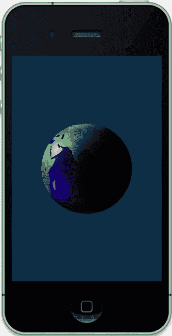
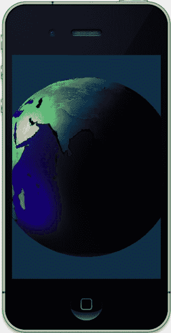
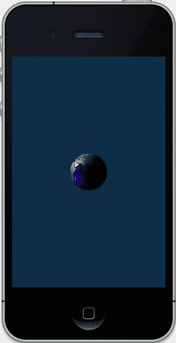
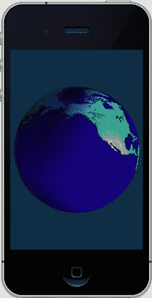
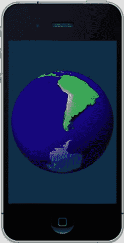
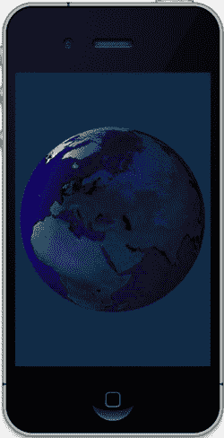
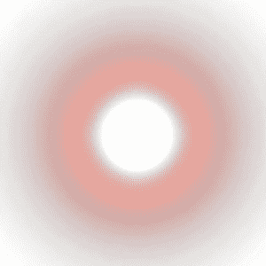
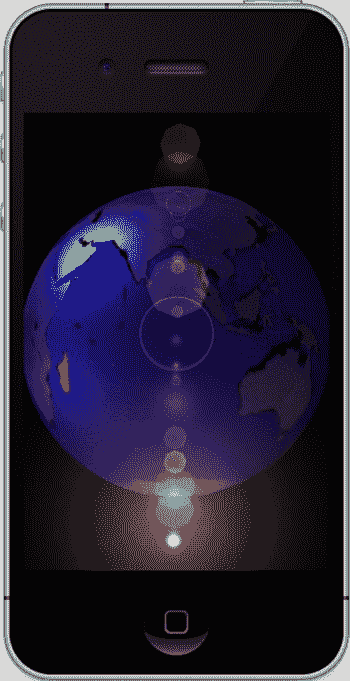
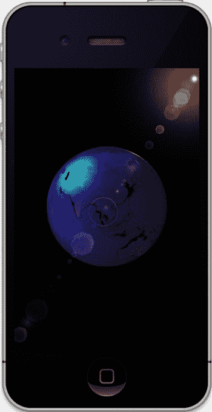
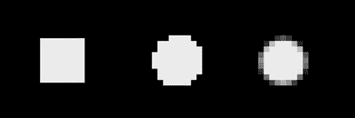

# 第 7 章：完美渲染杂项

好了，深吸一口气——我们还有更多内容要讲。列表 7-13 展示了新的 `drawLight()` 函数，而列表 7-14 展示了 `drawPlatform()`。本次练习的核心是列表 7-15（计算阴影矩阵）和列表 7-16（绘制阴影）。你是否已经兴奋起来了？反正我知道我是。

**列表 7-13.** 修改后的 `drawLight()` 函数

```
-(void)drawLight:(int)lightNumber
{
   static GLbyte lampVertices[]={0,0,0}; //1
   glDisableClientState(GL_COLOR_ARRAY);
   glEnable(GL_POINT_SMOOTH); //2
   glPointSize(5.0); //3
   glLightfv(lightNumber, GL_POSITION, iLightPos ); //4
   glPushMatrix();
   glRotatef(m_WorldRotationX, 1.0, 0.0, 0.0); //5
```


`glRotatef(m_WorldRotationY, 0.0, 1.0, 0.0);`

`glTranslatef( iLightPosX, iLightPosY, iLightPosZ );` //6

`glColor4f( 1.0, 1.0, 0, 1.0);` //7

`glVertexPointer( 3, GL_BYTE, 0, lampVertices );` //8

`glDrawArrays(GL_POINTS, 0,1);`

`glPopMatrix();`

`glEnableClientState(GL_COLOR_ARRAY);`

`}`

上述代码将在屏幕上绘制一个圆点，显示光源在任何时刻的所在位置。

由于我们只需要绘制一个点，因此可以在第 1 行中在原点上指定一个单独的顶点。

`GL_POINT_SMOOTH`是一个新函数。它告诉 OpenGL 绘制的所有点都应为圆形。没有这一设置，光源将被渲染为一个方形。

第 3 行是另一个新调用，它告诉系统该点的直径将为 5 个像素。最大尺寸在不同设备上可能有所差异，但通常直径可达 64 或 128 像素。

现在，我们可以在第 4 行设置实际光源的绝对位置。第 5 行及之后的行在世界空间中旋转灯具，而第 6 行对其位置进行平移。通过第 7 行将颜色设置为黄色，第 8 行及之后的行提供顶点，然后通过`glDrawArrays()`绘制点。

但等等，还有更多内容！

[www.it-ebooks.info](http://www.it-ebooks.info)

## 第 7 章：渲染完备的杂项

**235**

我们需要在立方体下方添加一个平面或平台，以便阴影能够投射其上，如清单 7-14 所示。

**清单 7-14.** 用于在立方体下方渲染平面的 `drawPlatform()` 例程

```
-(void)drawPlatform:(float)x y:(float)y z:(float)z
{
static const GLfloat platformVertices[] = //1
{
-1.0,-0.01,-1.0,
1.0,-0.01,-1.0,
-1.0,-0.01, 1.0,
1.0,-0.01, 1.0
};
static const GLubyte platformColors[] =
{
128, 128, 128, 255,
128, 0, 255, 255,
64, 64, 64, 0,
255, 64, 128, 255
};
GLfloat scale=1.5; //2
glEnable( GL_DEPTH_TEST );
glShadeModel( GL_SMOOTH );
glDisable(GL_CULL_FACE); //3
glVertexPointer(3, GL_FLOAT, 0, platformVertices);
glEnableClientState(GL_VERTEX_ARRAY);
glColorPointer(4, GL_UNSIGNED_BYTE, 0, platformColors);
glEnableClientState(GL_COLOR_ARRAY);
glPushMatrix();
glRotatef(m_WorldRotationX, 1.0, 0.0, 0.0); //4
glRotatef(m_WorldRotationY, 0.0, 1.0, 0.0);
glTranslatef(x,y,z);
glScalef(scale,scale,scale); //5
glDrawArrays(GL_TRIANGLE_STRIP, 0, 4);
glEnable(GL_CULL_FACE);
glPopMatrix();
}
```

这仅仅用于绘制阴影投映所依赖的方形基础对象。

[www.it-ebooks.info](http://www.it-ebooks.info)

## 第 7 章：渲染完备的杂项

**236**

第 1 行中没有特殊内容，不过与之前我们在 x-y 平面上描述正方形不同的是，这里是在 x-z 平面上且 y=0。哦，等等！其实有特殊之处。注意 y 坐标，它们并非像 0.0 这样合理的数值，而是略微负值-0.01。这是一个快速修复“深度冲突”问题的技巧。所谓深度冲突，是指共面物体的像素可能共享或不共享相同的深度值。结果会导致两个面交替闪烁：某一刻 A 面在最前面，下一刻 B 面的像素又认为自己处于最前面。（注意，这仅在硬件上会出现问题，在模拟器中看起来会是正常的。）如果你足够仔细地观察几乎任何实时 3D 软件，都可能在背景中看到一些深度冲突现象。

图 7-12。

在本例中，修复方法是把平台的 y 坐标稍微降低，使其位于阴影下方。这个修复方法并非总是有效，因为它取决于环境、所处理对象的缩放比例等因素。另一种解决方法是使用`glPolygonOffset()`调用。但同样不能保证一定成功。有时你只能尝试不同的方法，看看哪个能解决问题。

由于平台的坐标是归一化的，我们需要像第 2 行那样将它们放大一些，以便使其可用。

第 3 行关闭了面剔除。原因在于，平台只是一个单一的正方形，而我们很容易走到其下方，因此需要看到同一面的两侧。


第 4 行在此处与其他地方相同；它只是将平台旋转到世界空间。

第 5 行执行实际的缩放操作；请将其作为第一个要执行的变换。（记住，变换栈可以被视为一个 FIFO：第一个入栈的变换最先被执行。如果缩放位于其他变换之后，它会将物体绕偏离预期结果的中心进行缩放。）

图 7-12：平台与阴影之间的 Z 缓冲区冲突

现在我们来处理真正有趣的部分——实际计算和绘制阴影。清单 7-15 展示了矩阵的生成方式，而清单 7-16 则绘制了被压扁的阴影。

清单 7-15：计算阴影矩阵

```
-(void)calculateShadowMatrix
{
    GLfloat shadowMat_local[16] =
    {
        iLightPosY, 0.0, 0.0, 0.0,
        -iLightPosX, 0.0, -iLightPosZ, -1.0,
        0.0, 0.0, iLightPosY, 0.0,
        0.0, 0.0, 0.0, iLightPosY
    };

    for ( int i=0;i<16;i++ )
    {
        iShadowMat[i] = shadowMat_local[i];
    }
}
```

这实际上是以下更通用矩阵的简化版本：

```
[ dotp-l[0]*p[0], -l[1]*p[0], -l[2]*p[0], -l[3]*p[0],
  -l[0]*p[1], dotp-l[1]*p[1], -l[2]*p[1], -l[3]*p[1],
  -l[0]*p[2], -l[1]*p[2], dotp-l[2]*p[2], -l[3]*p[2],
  -l[0]*p[3], -l[1]*p[3], -l[2]*p[3], dotp-l[3]*p[3] ]
```

其中 `dotp` 是光线向量与平面法线的点积，`l` 是光的位置，`p` 是平面（在我的代码中即“平台”）。由于我们的平台位于`x/z`平面，平面方程表示为 `p=[0,1,0,0]`，即 `p[0]=p[2]=p[3]=0`。这意味着矩阵中的大多数项都会被清零。一旦矩阵生成，将其乘以当前的模型视图矩阵，就可以将点映射到您的局部空间以及其他所有内容。

清单 7-16：调整后的 `drawShadow()` 例程

```
- (void)drawShadow
{
    glPushMatrix();

    glRotatef(m_WorldRotationX, 1.0, 0.0, 0.0); //1
    glRotatef(m_WorldRotationY, 0.0, 1.0, 0.0);

    glMultMatrixf( iShadowMat ); //2

    //Place the shadows.
    glTranslatef(0.0,m_TransY, 0.0); //3
    glRotatef( m_SpinZ, 0.0, 0.0, 1.0 ); //4
    glRotatef( m_SpinY, 0.0, 1.0, 0.0 );
    glRotatef( m_SpinX, 1.0, 0.0, 0.0 );

    //Draw them.
    glDisableClientState(GL_COLOR_ARRAY);
    glEnable(GL_BLEND); //5
    glBlendFunc(GL_ZERO,GL_ONE_MINUS_SRC_ALPHA);

    glColor4f( 0.0, 0.0, 0.0, .3 ); //6
    glEnableClientState(GL_VERTEX_ARRAY);
    glVertexPointer( 3, GL_FLOAT, 0, m_CubeVertices ); //7

    glDrawElements( GL_TRIANGLE_FAN, 6 * 3, GL_UNSIGNED_BYTE, m_Tfan1);
    glDrawElements( GL_TRIANGLE_FAN, 6 * 3, GL_UNSIGNED_BYTE, m_Tfan2);

    // glLineWidth(3.0); //8
    // glDrawElements( GL_LINES, 6 * 3, GL_UNSIGNED_BYTE, m_Tfan1);
    // glDrawElements( GL_LINES, 6 * 3, GL_UNSIGNED_BYTE, m_Tfan2);
    glDisable(GL_BLEND);

    glPopMatrix();
}
```

首先，像之前在第 1 行中一样，将所有内容旋转到世界空间。

第 2 行将阴影矩阵与当前的模型视图矩阵相乘。

第 3 行和第 4 行及之后的内容对阴影执行与实际立方体相同的变换和旋转。

接着，在第 5 行及之后和第 6 行中，我们可以为阴影添加一点混合效果。alpha 值设置为`.3`。该值越高，阴影越暗；当 alpha 为`1.0`时，阴影自然是纯黑色。

在第 7 行及之后的内容中，我们像渲染实际立方体一样渲染几何体，唯一的区别是现在它被扭曲成看起来像是沿着表面拉伸的效果。

现在是时候更新光源的位置了，如清单 7-17 所示。

清单 7-17：更新光源位置

```
- (void)updateLightPosition
{
    iLightAngle += (GLfloat)1.0; //in degrees
    iLightPosX = m_LightRadius * cos( iLightAngle/57.29 );
}
```


`iLightPosY = 4.0;`

`iLightPosZ = m_LightRadius * sin( iLightAngle/57.29 );`

`iLightPos[0] = iLightPosX;`

`iLightPos[1] = iLightPosY;`

`iLightPos[2] = iLightPosZ;`

`}`

每次刷新时，这段代码将灯光位置更新一度。Y 值固定，因此灯光在 X/Z 平面上沿其小轨道移动。除上述内容外，请确保添加我们之前使用过的标准 `setClipping()` 例程，并在 `viewDidLoad()` 中调用它。

最后，清单 7-18 展示了这个项目的头文件。

清单 7-18.  阴影投射练习的头文件

```
#import <UIKit/UIKit.h>
#import <GLKit/GLKit.h>
#import <OpenGLES/EAGL.h>

#import <OpenGLES/ES1/gl.h>
#import <OpenGLES/ES1/glext.h>
#import <OpenGLES/ES2/gl.h>
#import <OpenGLES/ES2/glext.h>

@interface ShadowCastingViewController : GLKViewController
{
    EAGLContext *context;
    GLuint program;

    GLfloat m_WorldRotationX;
    GLfloat m_WorldRotationY;

    GLfloat m_LightRadius;
    /** 灯光角度。 */
    GLfloat iLightAngle;
    /** 灯光的 X 坐标 */
    GLfloat iLightPosX;
    /** 灯光的 Y 坐标 */
    GLfloat iLightPosY;
    GLfloat iLightPosZ;
    GLfloat iLightPos[4];

    GLfloat m_WorldZ;
    GLfloat m_WorldY;

    GLfloat m_TransY;
    GLfloat m_SpinX;
    GLfloat m_SpinY;
    GLfloat m_SpinZ;

    GLfloat iShadowMat[16];
}

@property (readonly, nonatomic, getter=isAnimating) BOOL animating;
@property (nonatomic) NSInteger animationFrameInterval;

-(void)drawPlatform:(float)x y:(float)y z:(float)z;
-(void)drawLight:(int)lightNumber;
-(void)updateLightPosition;
-(void)drawShadow;
-(void)calculateShadowMatrix;
-(void)setClipping;
-(void)startAnimation;
-(void)stopAnimation;
-(void)viewDidLoad;
-(void)viewDidUnload;
-(void)applicationWillResignActive:(NSNotification *)notification;
-(void)applicationDidBecomeActive:(NSNotification *)notification;
-(void)applicationWillTerminate:(NSNotification *)notification;
-(void)dealloc;
-(void)didReceiveMemoryWarning;
-(void)viewWillAppear:(BOOL)animated;
-(void)viewWillDisappear:(BOOL)animated;

@end
```

编译后，你是否看到类似图 7-13 的效果（最终图像留给亲爱的读者您来生成）。

图 7-13.  左侧和中间的图像是侧视图；最右侧的图像是从上方俯视的效果。

与其他练习一样，微调是必须的。

看到漂亮的深色阴影是一回事，真正理解阴影是如何构成的则是另一回事。进入 `drawShadow()` 函数，将调用 `glDrawElements()` 的代码替换为以下内容：

```
glLineWidth(3.0);
glDrawElements( GL_LINES, 6 * 3, GL_UNSIGNED_BYTE, m_Tfan1);
glDrawElements( GL_LINES, 6 * 3, GL_UNSIGNED_BYTE, m_Tfan2);
```

`glLineWidth(3.0)` 是一个新调用，它指定了绘制线条时的宽度，默认值为 1.0。现在，图 7-14 以线框模式展示了扁平化的图像。

图 7-14.  以线框模式显示阴影。最右侧的图像中移除了立方体，以便更清晰地显示线框。

你也可以使用多个光源。图 7-15 显示了两个并排的光源。

图 7-15.  带有多光源的立方体


在所有这些图像中，背景是黑色的。更改背景的颜色并运行。图 7-16 中发生了什么？

图 7-16\. 惊喜！阴影并未被裁剪到平台上。

这里发生的是，我们在将阴影裁剪到平台时作弊了。当背景为黑色时，渲染到平台之外的阴影部分是看不见的。但现在，随着背景变亮，你可以看到完整的阴影。如果你一开始就需要浅色背景怎么办？使用模板（`stencils`）围绕平台进行裁剪，遮掉我们不需要的任何多余阴影部分，类似于之前的反射练习。

[www.it-ebooks.info](http://www.it-ebooks.info)

**第 7 章：渲染精妙的杂项**

**244**

**总结**

在本章中，我们介绍了一些额外技巧，为 OpenGL ES 场景增加更多真实感。首先是帧缓冲对象（`frame buffer objects`），它允许你绘制到多个 OpenGL 帧并将它们合并。接下来是镜头光晕（`lens flares`），可以为户外场景增加视觉戏剧效果，随后是苹果在其许多 UI 设计中大量使用的反射（`reflections`）和模板（`stencils`）。最后，我们介绍了使用阴影投影（`shadow projection`）将阴影投射到背景上的多种方法之一。接下来，其中一些技巧将应用于我们的小型太阳系项目。

[www.it-ebooks.info](http://www.it-ebooks.info)

**第 8 章**

**整合所有内容**

即使穷尽一生专注于天空，也不足以研究如此广阔的领域。

——塞内卡，罗马哲学家

好了，现在我们一路走到了第 8 章。这时，我们可以将从到目前为止的练习中学到的内容整合起来，构建成一个更完整的太阳系模型。之后，我希望你会说：“哇！这有点酷！”

本章将包含大量代码，因为该模型既需要许多新例程，也需要对现有项目进行修改。因此，与第 7 章一样，我将打破前几章的风格，不会呈现完整的代码文件，原因是它们过长或为了避免重复；因此，鼓励你从 Apress 网站获取完整的项目以及一些数据文件，以确保你拥有功能完整的示例。此外，还会加入一些新技巧，例如如何集成标准 iPhone UIKit 以及使用四元数（`quaternions`）。请注意，尽管以下很多代码基于之前的练习，但可能需要一些小的调整才能将其集成到更大的包中，所以不幸的是，这不仅仅是简单的剪切和粘贴。

**但视网膜显示屏怎么办？**

是的，我知道，一切在视网膜显示屏上都看起来更好，所以在做其他事情之前，让我们告诉 OpenGL 如何处理更高分辨率。哦，等等。我们不再需要那样做了。在 iOS 5 之前，有必要使用`setContentScaleFactor`实例变量告诉 OpenGL 视图对象如何调整自身大小。对于旧式显示器，该值为`1.0`；对于视网膜显示屏，该值为`2.0`。在 `GLKit` 下，这种内务管理不再需要。然而，在设置视景体（`viewing frustum`）时调用`glViewPort()`时，你仍然需要获取视图的实际尺寸，如下所示，记住这里的视图实际上是继承自`UIView`的`GLKView`。

```
glViewport(0, 0, view.drawableWidth, view.drawableHeight);
```

[www.it-ebooks.info](http://www.it-ebooks.info)

**第 8 章：整合所有内容**

**246**

苹果推荐使用“drawable”字段，尽管如果你正在创建一个与屏幕尺寸相同的显示，使用`mainScreen`的`frame`的传统方式仍然有效。

**重新审视太阳系**

回到第 5 章，获取用作最终项目的太阳系模型。第 7 章的模型被用作在 3D 对象上显示动态纹理的表面，但这里不会以那种方式使用它。

那么，首先要处理的是调整模型的大小，以呈现稍微更真实的展示。目前来看，地球看起来大约是太阳的三分之一大小，并且只有几千英里（如果你在意的话，也可以是几弗隆）远。考虑到北加州现在是宜人的秋日，而地球绝不是烧焦的余烬，我敢打赌这个模型是错的。好吧，让我们把它修正。这将在太阳系控制器的`initGeometry()`方法中完成。同时，`m_Eyeposition`的类型将被更改，升级为一个更面向对象的、为 3D 操作定制的对象。新例程见清单 8-1。同时确保为太阳表面添加纹理；否则，可能会发生糟糕的事情。

清单 8-1\. 重新调整太阳系中对象的大小

```
-(void)initGeometry
{
    //设 1.0 = 100 万英里。
    // 太阳半径 = .4。
    // 地球半径 = .04（放大 10 倍以使其更容易看到）。

    m_Eyeposition.x=0;
    m_Eyeposition.y=0;
    m_Eyeposition.z=93.25;

    m_Earth=[[Planet alloc] init:48 slices:48 radius:0.04
              squash:1.0 textureFile:@"earth_light.png"];

    [m_Earth setPositionX:0.0 Y:0.0 Z:93.0];

    m_Sun=[[Planet alloc] init:48 slices:48 radius:0.4
            squash:1.0 textureFile:@"sun_surface.png"];

}
```

`m_Eyeposition`现在被定义为一个新的`GLKVector3`对象。

**注意** 新的 iOS5 向量类设计得非常周到，因为它们使用联合（`unions`）来支持`xyz`值、`rgb`、`stp`（用于纹理坐标）以及非常流行的数组格式`float v[3]`。其他容器类也使用了类似的约定。

[www.it-ebooks.info](http://www.it-ebooks.info)



**第 8 章：整合所有内容**

**247**

我们模型的比例设置为 1 单位 = 100 万英里（170 万公里或 830 万弗隆）。太阳半径为 40 万英里，即这些单位下的 0.4。这意味着地球的半径将是 0.004，但我已将其增加 10 倍，至 0.04，以使其更容易处理。因为地球的默认位置是沿 +Z 轴，让我们把眼睛位置放在地球正后方，仅 25 万英里远，位于“93.25”。并且，在太阳系对象的`execute`方法中，移除`glRotatef()`，这样地球现在将保持固定。这暂时使事情变得简单得多。确保根据需要修改头文件。去找你的朋友`setClipping()`，将视野从 50 度改为 30 度；同时，将`zFar`设置为 2000（以处理未来的对象）。最终你应该得到类似图 8-1 的结果。因为从我们的视角看，太阳实际上在地球后面，我提高了`SS_FILLLIGHT1`的高光照明。

图 8-1\. 我们在小屏幕上的家

“说得很好，代码小子！”你一定在低声嘀咕。“但现在我们被困在太空中了！”确实如此，所以下一步是添加一个导航元素。这意味着（请播放戏剧性音乐）我们将要添加四元数（`quaternions`）。

[www.it-ebooks.info](http://www.it-ebooks.info)

**第 8 章：整合所有内容**

**248**

**这些四元数到底是什么？**

1843 年 10 月 16 日，在都柏林，爱尔兰数学家威廉·哈密顿爵士在皇家运河旁散步时，突然灵光一现。他一直在寻找将空间中的两点进行有意义的乘法和除法的方法，突然间脑海中闪过了四元数的公式：*i*² = *j*² = *k*² = *ijk* = −1。

很厉害吧？


他激动得无法抗拒诱惑，将这一发现刻在了刚走过的布鲁厄姆桥的石头上（无疑夹在那些较浅的涂鸦之间，比如“埃蒙爱菲奥娜，1839”或“帕特里克·奥卡拉汉最棒！”）。全新的物理和几何视角直接源于这一洞见。例如，电磁理论中的经典麦克斯韦方程组完全通过四元数来描述。随着处理类似问题的新方法出现，四元数一度被冷落，直到 20 世纪末，它们才在三维计算机图形学、阿波罗宇宙飞船的月球导航以及其他严重依赖空间旋转的领域找到了重要角色。由于其紧凑的特性，它们比标准的`3x3`矩阵更高效地描述方向向量，进而实现三维旋转。不仅如此，它们还提供了将一系列旋转叠加在一起的远为优越的方式。那么，这意味着什么呢？

在第 2 章中，我们介绍了使用矩阵的传统三维变换数学。如果你想将物体绕`z 轴`旋转 32°，你会指示 OpenGL ES 通过命令`glRotation(32,0,0,1)`执行旋转。类似命令也会用于`x 轴`和`y 轴`。但如果你想实现飞机向左倾斜时的那种奇特旋转，该如何用`glRotatef()`格式描述呢？使用更传统的方法，你需要为三个旋转分别生成矩阵，然后按偏航（绕`Y 轴`旋转）、俯仰（绕`X 轴`旋转）和滚转（绕`Z 轴`旋转）的顺序将它们相乘。这种计算量很大，却只为对准一个方向。但如果这是用于飞行模拟器，你的倾斜动作会不断更新为新的滚转和航向，每次都是增量变化。这意味着每次都需要为上一帧以来的轨迹增量计算三个矩阵，而不是从某个起点开始的绝对值。

在计算机早期，浮点运算成本高昂，且出于性能考虑经常采用捷径，舍入误差很常见，并可能随时间累积，导致当前矩阵“失准”。然而，四元数因其几个极具吸引力的特性而救场。首先，四元数可以表示空间中物体的旋转，大致相当于`glRotatef()`的工作方式，但使用分轴值。这并不是一一对应的关系，因为你仍然需要做一些数学转换，将姿态与四元数相互转换。第二个也是更重要的特性源于这样一个事实：球面上的弧可以由两个四元数描述，每个端点一个。而弧上任意点之间的位置，也只需通过球面几何在端点之间插值距离即可得到四元数，如图 8-2 所示。也就是说，如果你要经过一个 60°的弧，你可以沿着弧走三分之一的路程，找到距离起点 20°的中间四元数。在下一帧中，如果你要跳到 20.1°，只需在当前四元数上增加极小的一段弧，而无需每次都重复生成三个矩阵并相乘的繁琐过程。这个过程称为 slerping（球面线性插值，slerp 是其缩写）。由于轴/角度对不像使用矩阵时那样依赖于所有先前值的累积求和，而是基于瞬时值，因此不会因前者产生误差累积。

图 8-2. 球面上的中间四元数；`Q1.5`可以从另外两个四元数`Q1`和`Q2`插值得到。

Slerp 用于在视点的“相机”从一个点到另一个点时提供平滑动画。它可用于飞行模拟器、太空模拟器，或赛车游戏中追逐车辆的视角。当然，它们也用于真实的飞行导航系统。

现在，有了这些背景知识，我们将使用四元数来帮助移动地球。

## 在三维空间中移动物体

由于我们目前没有为地球制作动画，因此需要一种方法移动它，以便从各个角度观察它。考虑到地球是我们的兴趣目标，我们将设置一个场景，使视点有效悬浮在地球上方，并通过捏合和拖拽手势控制。

第一步是添加手势识别器，这些功能在 iPad 上从第一代就可用，但在其他设备上直到 iOS 4 才可用。

**注意** 对于“真实”应用，你可能需要考虑手势识别器的便利性是否值得放弃那些仅支持 iOS 3.x 的第一代 iOS 用户。

如果你是 iOS 编程新手，可能还没接触过手势识别器。简而言之，它们处理了确定用户进行了哪种触摸手势的繁琐工作，而这在早期是开发者必须自己做的。这可能会变得非常混乱，尤其是在处理旋转手势时。滑动、轻点、捏合和平移手势也同样被处理。然而，它们确实忽略了惯性滑动，即手指抬起后能让列表继续滚动一段时间的动作。

这里我们只需要捏合和平移手势。在你的视图控制器的`viewDidLoad()`方法中，添加清单 8-2。

**清单 8-2.** 分配手势识别器

```
UIPinchGestureRecognizer *pinchGesture =
[[UIPinchGestureRecognizer alloc]initWithTarget:self
action:@selector(handlePinchGesture:)];
[self.view addGestureRecognizer:pinchGesture];
UIPanGestureRecognizer *panGesture =
[[UIPanGestureRecognizer alloc]initWithTarget:self
action:@selector(handlePanGesture:)];
[self.view addGestureRecognizer:panGesture];
```

接下来，我们需要添加两个处理程序，`handlePanGesture()`和`handlePinchGesture()`，如清单 8-3 所示。

**清单 8-3.** 两个手势识别器的处理程序

```
- (IBAction)handlePanGesture:(UIPanGestureRecognizer *)sender
{
    static CGPoint prevLocation;
    CGPoint translate = [sender translationInView:self.view];
    UIGestureRecognizerState state;
    state = sender.state;
    if(state == UIGestureRecognizerStateBegan)
    {
        prevLocation = translate;
        [m_SolarSystem lookAtTarget];
    }
    else if(state == UIGestureRecognizerStateChanged)
    {
        CGPoint currlocation = translate;
        m_PointerLocation = CGPointMake(currlocation.x, currlocation.y);
        [self setHoverPosition:0 location:currlocation prevLocation:prevLocation];
        prevLocation = currlocation;
    }
}

- (IBAction)handlePinchGesture:(UIGestureRecognizer *)sender
{
    static float startFOV = 0.0;
    CGFloat factor = [(UIPinchGestureRecognizer *)sender scale];
    UIGestureRecognizerState state;
    state = sender.state;
    if(state == UIGestureRecognizerStateBegan)
    {
        startFOV = [m_SolarSystem getFieldOfView];
    }
    else if(state == UIGestureRecognizerStateChanged)
    {
        float minFOV = 5.0;
        float maxFOV = 75.0;
        float currentFOV;
        currentFOV = startFOV * factor;
        if((currentFOV >= minFOV) && (currentFOV <= maxFOV))
            [m_SolarSystem setFieldOfView:currentFOV];
    }
}
```


`handlePanGesture()` 计算手指在屏幕上拖动时触摸位置与上次调用之间的差异。它将这些差异传递给 `setHoverPosition()`，后者将把视点移动到地球上的新位置。在头文件中添加 `CGPoint m_PointerLocation`。

另一个处理程序 `handlePinchGesture()` 处理捏合操作。`UIPinchGestureRecognizer()` 返回一个简单的缩放值，手势开始时该值为 1.0。随着手势继续，状态变为 `UIGestureRecognizerStateChanged`，缩放值对于展开捏合（放大）而增加，对于收缩捏合（缩小）而减小。

这里需要缓存显示的初始视场角，因为每个缩放值是累积的，而非相对于前一个事件的增量。这样，我们每次都是基于原始值进行缩放，而不是重新缩放视场角——如果只处理增量则会出现后一种情况。否则，视场角会以越来越大的跳跃方式变化。此外，请注意我限制了视场角的取值范围，从 5° 到 75°。

现在，需要在太阳系处理程序（solar-system handler）中添加实例变量 `float m_FieldOfView`，以及清单 8-4 中的存取方法，并将其初始化为 30°。

清单 8-4：太阳系控制器中 `m_FieldOfView` 的存取方法

```
-(float)getFieldOfView
{
    return m_FieldOfView;
}
```

```
-(void)setFieldOfView:(float)fov
{
    m_FieldOfView=fov;
    [self setClipping];
}
```

然后将 `setClipping()` 从视图控制器移至太阳系控制器，并用 `m_FieldOfView` 替换自动变量 `fieldOfView`，确保在程序启动时将其初始化为类似 30° 的值，并在对象创建时调用 `setClipping()`（就像之前在视图控制器中所做的那样）。现在必须重新初始化投影矩阵，因为在捏合缩放操作期间会重复调用 `setClipping()`，我们不希望它们相互叠加。否则，视图很快就会变得混乱。

最后，需要添加两个存根方法，以防止意外执行拖拽操作时崩溃。这些将在下一个任务中完善。在视图控制器中添加：

```
-(void)setHoverPosition:(unsigned)nFlags location:(CGPoint)location prevLocation:(CGPoint)prevLocation
{
}
```

在太阳系控制器中添加：

```
-(void)lookAtTarget
{
}
```

如果一切按设计工作，您应该能够对地球模型进行缩放，如图 8-3 所示。




**图 8-3：** 使用捏合手势进行**放大和缩小**

现在我们将实现旋转支持，其中包含那些四元数相关的内容。

向太阳系控制器添加清单 8-5（同时可以移除 `lookAtTarget()` 存根）。`m_Earth` 的辅助函数 `getPosition()` 会在清单 8-7 中添加，所以如果清单 8-5 导致出现红色错误标记，不必担心。

清单 8-5：太阳系控制器的新辅助例程

```
-(GLKVector3)getTargetLocation
{
    return [m_Earth getPosition];
}
```

```
-(void)lookAtTarget
{
    GLKVector3 targetLocation=[m_Earth getPosition];
    gluLookAt(m_Eyeposition.x,m_Eyeposition.y,m_Eyeposition.z,
              targetLocation.x,targetLocation.y,targetLocation.z,
              0.0,1.0,0.0);
}
```

```
-(GLKVector3)getEyeposition
{
    return m_Eyeposition;
}
```

```
-(void)setEyeposition:(GLKVector3)loc
{
    m_Eyeposition=loc;
}
```

在标准 OpenGL 中，我提到过一个名为 GLUT 的工具库。


遗憾的是，截至撰写本文时，iOS 尚没有完整的 GLUT 库，因此我不得不自行创建了一个，将大多数基础 3D 工具方法都塞了进去。考虑到这一点，请创建一个名为 `miniglu.mm` 的新对象（`mm` 后缀能让 Objective C 编译器理解混合了 ObjC 的纯 C 代码），添加代码清单 8-6 的内容，并在文件顶部添加静态变量 `GLKQuaternion m_Quaternion`。同时，请确保在需要的文件中引入 `miniglu.h`。

这段代码保持为通用 C 语言，因为 GLUT 的设计初衷就是尽可能可移植。

**代码清单 8-6：** `miniGLU.mm` 的两个例程

```
void gluLookAt(GLfloat eyex, GLfloat eyey, GLfloat eyez,
GLfloat centerx, GLfloat centery, GLfloat centerz,
GLfloat upx, GLfloat upy, GLfloat upz)
{
GLKVector3 up; //1
GLKVector3 from,to;
GLKVector3 lookat;
GLKVector3 axis;
float angle;

lookat.x=centerx;
//2
lookat.y=centery;
lookat.z=centerz;

from.x=eyex;
from.y=eyey;
from.z=eyez;

to.x=lookat.x;
to.y=lookat.y;
to.z=lookat.z;

up.x=upx;
up.y=upy;
up.z=upz;

[www.it-ebooks.info](http://www.it-ebooks.info)

第 8 章：整合所有内容

255

GLKVector3 temp = GLKVector3Subtract(to,from);
//3
GLKVector3 n=GLKVector3Normalize(temp);

temp = GLKVector3CrossProduct(n,up);
GLKVector3 v=GLKVector3Normalize(temp);

GLKVector3 u = GLKVector3CrossProduct(v,n);

m_Quaternion= //4
GLKQuaternionMakeWithMatrix3(GLKMatrix3MakeWithRows(v,u,GLKVector3Negate(n)));

axis=GLKQuaternionAxis(m_Quaternion);
angle=GLKQuaternionAngle(m_Quaternion);

glRotatef(angle*57.29, axis.x, axis.y, axis.z); //5
}

GLKQuaternion gluGetOrientation()
{
return m_Quaternion;
}
```

在我们继续之前，`gluLookAt()` 需要——呃，大量的解释。`gluLookAt()` 的作用正如其名。你向它传递视点的位置、要观察的目标，以及一个用于指定滚转角的上向量。通常，指向上方就意味着没有滚转。但你还是需要提供这个参数。

让我们更仔细地看看：

如上所述，我们需要获取点或向量来完全描述我们在空间中的位置以及目标的位置，如第 1 行及后续行所示。上向量是相对于视点的，通常只是一个指向 y 轴正方向的单位向量。如果你想实现倾斜滚转，可以修改这个向量。

在第 2 行及后续行，以离散值传入的参数被映射到了 `GLKVector3` 对象。为什么不直接使用向量对象呢？官方的 GLUT 库不使用向量对象，这样更符合现有的标准。

第 3 行及后续行生成了三个新的向量，其中两个是通过叉积计算得到的。这确保了所有向量都归一化并且轴是正交的。

一些使用 `gluLookAt()` 的例子会生成一个矩阵。但这里我们使用的是四元数。在第 4 行，四元数由我们的新向量创建，并用于获取 `glRotatef()` 所喜欢的轴/角度参数，如第 5 行所示。请注意，生成的四元数会通过一个全局变量缓存起来，这样如果后续需要通过 `gluGetOrientation()` 获取即时姿态，就可以直接使用。这虽然有些笨拙，但确实能用。在实际应用中，你可能不会想这样做，因为它假设你的整个世界中只有一个视点。现实中，你可能希望有多个视点——例如，如果你想同时用两个显示器从不同的角度展示你的对象。

[www.it-ebooks.info](http://www.it-ebooks.info)

第 8 章：整合所有内容

256

现在，你可以对 `Planet.mm` 做一些调整。由于我们使用了新的向量/点对象，实例变量 `m_Pos` 将从简单的数组转换为 `GLKVector3` 类型。代码清单 8-7 展示了这些修改，并且记得也要修改头文件中的定义以及初始化例程中的初始化行。

**代码清单 8-7：** `Planet.mm` 的一些小型辅助函数

```
-(GLKVector3)getPosition
{
```


`return m_Pos;`

`}`

`-(void)setPosition:(GLKVector3)position`
`{`
    `m_Pos = position;`
`}`

`-(void)getPositionX:(GLfloat *)x Y:(GLfloat *)y Z:(GLfloat *)z`
`{`
    `*x = m_Pos.x;`
    `*y = m_Pos.y;`
    `*z = m_Pos.z;`
`}`

`-(void)setPositionX:(GLfloat)x Y:(GLfloat)y Z:(GLfloat)z`
`{`
    `m_Pos.x = x;`
    `m_Pos.y = y;`
    `m_Pos.z = z;`
`}`

接下来是这个悬停功能的核心部分。将视图控制器中`setHoverPostion()`的存根替换为清单 8-8 中的代码，并添加`miniglu.h`。

清单 8-8. 添加视图的旋转代码

```
-(void)setHoverPosition:(unsigned)nFlags location:(CGPoint)location prevLocation:(CGPoint)prevLocation
{
    int dx;
    int dy;
    GLKQuaternion orientation,tempQ;
    GLKVector3 offset,objectLoc,vpLoc;
    GLKVector3 offsetv=GLKVector3Make(0.0,0.0,0.0);
    float reference=300;
    float scale=4.0;
    GLKMatrix3 matrix3;
    CGRect frame = [[UIScreen mainScreen] bounds];
    glMatrixMode(GL_MODELVIEW);
    glLoadIdentity();

    orientation=gluGetOrientation(); //1
    vpLoc=[m_SolarSystem getEyeposition]; //2
    objectLoc=[m_SolarSystem getTargetLocation]; //3
    offset.x=(objectLoc.x-vpLoc.x);
    offset.y=(objectLoc.y-vpLoc.y);
    offset.z=(objectLoc.z-vpLoc.z);
    offsetv.z=GLKVector3Distance(objectLoc,vpLoc); //4
    dx=location.x-prevLocation.x; //5
    dy=location.y-prevLocation.y;
    float multiplier;
    multiplier=frame.size.width/reference;
    glMatrixMode(GL_MODELVIEW);
    float c,s;
    float rad=scale*multiplier*dy/reference;
    s=sinf(rad*.5); //6
    c=cosf(rad*.5);
    tempQ=GLKQuaternionMake(s,0.0,0.0,c); //绕 X 轴旋转。
    orientation=GLKQuaternionMultiply(tempQ,orientation);
    rad=scale*multiplier*dx/reference;
    s=sinf(rad*.5);
    c=cosf(rad*.5);
    tempQ=GLKQuaternionMake(0.0,s,0.0,c); //绕 Y 轴旋转。
    orientation=GLKQuaternionMultiply(tempQ,orientation);
    matrix3=GLKMatrix3MakeWithQuaternion(orientation);
    matrix3=GLKMatrix3Transpose(matrix3); //7
    offsetv=GLKMatrix3MultiplyVector3(matrix3, offsetv);
    vpLoc.x=objectLoc.x+offsetv.x; //8
    vpLoc.y=objectLoc.y+offsetv.y;
    vpLoc.z=objectLoc.z+offsetv.z;
    [m_SolarSystem setEyeposition:vpLoc];
    [m_SolarSystem lookAtTarget]; //9
}
```

那么，这里到底发生了什么？

首先，在第 1 行我们从`miniGLU`获取缓存的四元数，并在第 2 行从太阳系对象中获取视点的`xyz`位置。

由于这个功能尚未添加，你现在可以随时将其添加进去。它只是一个针对太阳系控制器中已有的`m_Eyeposition`对象的取值方法。

第 3 行获取目标的位置。在本例中，目标就是地球。

有了这些信息后，我们需要计算视点相对于地球中心的偏移量，然后像第 4 行那样计算该距离。

第 5 行获取了上一个和当前触摸点的屏幕坐标，这样我们就知道自上次以来移动了多少距离。

第 6 行及之后的部分为触摸的每个新位置创建了一个分数旋转量。

使用实际的旋转四元数（在第 1 行中获取）可以确保保留来自每个触摸位置的新旋转量，从而表示视点的累积旋转。`scale`、`multiplier`和`reference`这三个值都是任意设定的。`Scale`是固定值，用于进行一些微调，以确保物体移动的速度恰到好处，理想情况下能与手指的移动速度相匹配。`multiplier`在方向变化时很方便，因为它是一个缩放因子，基于屏幕的当前宽度和一个同样是任意设定的参考值。

然后，将这些值与`x`和`y`的差值相乘，并传入用于生成最终矩阵的四元数中，如第 7 行所示。


第 7 行将新矩阵与偏移向量相乘，将其变换到新位置，而第 8 行及后续行实际执行到新位置的平移并更新太阳系控制器。

最后，`earth`在第 9 行被重新插入。

准备好了吗？哈哈，还没完全好。在`initLighting()`中，确保`glShadeModel()`被设置为`GL_SMOOTH`，检查填充光 2 已被禁用，并且最重要的是，删除衰减太阳光的那一行。

当然，确保根据需要修改头文件，但你可能已经知道这一点。我们希望现在你能够随意移动地球。你应该会看到类似图 8-4 的效果。并且注意，你应该能看到太阳（尽管现在小得多）时隐时现。

[www.it-ebooks.info](http://www.it-ebooks.info)







**第 8 章：整合所有内容**

**259**

图 8-4：悬停模式让你可以随意旋转地球。

那么，这就是今天练习的第一部分。还记得第 7 章中的那些镜头光晕效果吗？现在我们可以将它们付诸应用了。

**添加一些光晕效果**

从第 7 章中，获取镜头光晕练习中的四个源文件，并将它们连同美术资源一起添加到你的项目中。这将需要对太阳系控制器中的主执行方法进行一些实质性更新，主要是为了在定位和高亮方面管理镜头光晕对象。

像镜头光晕效果这样的东西会存在各种小问题，需要解决。

也就是说，如果光晕的源对象（在此例中为太阳）移动到地球后面，光晕本身应该消失。另外请注意，它不会立即消失，而是会逐渐淡出。

在渲染光晕本身之前，需要添加几个新的实用工具例程。

首先，你需要为渲染太阳分配镜头光晕对象和新的纹理对象。在太阳系控制器的`init`例程中添加以下两行：

```
m_LensFlare=[[LensFlare alloc]init];
m_FlareSource=[[OpenGLCreateTexture getObject]loadTexture:@"gimp_sun3.png"];
```

[www.it-ebooks.info](http://www.it-ebooks.info)



**第 8 章：整合所有内容**

**260**

现在是时候将所有图像实用工具转移到它们自己的例程中了。为此我创建了`OpenGLCreateTexture`，并将`loadTexture()`从太阳系控制器移到了这里。这将有助于支持上面的调用。`.png`文件可以是任何你想要的、用来替换当前 3D 太阳模型的图片。我们这样做的目的是，在球体模型通常渲染的位置，绘制一个扁平的太阳位图。原因是我们能够精细控制这颗恒星的视觉效果，使其更接近人眼可能感知的样子。那种鲜明的黄色球体，虽然技术上更准确，但看起来并不真实，因为任何光学接收器都会为其添加各种扭曲、反射和高光（例如镜头光晕）。比如，可以使用着色器来数学建模眼睛的光学特性，但就目前这个模糊的球状物而言，工作量太大了。如果你愿意，可以从 Apress 网站下载我自己的美术资源。或者复制一些符合你个人品味的东西。图 8-5 是我正在使用的带有透明背景的图片。有趣的是，这张图片足以欺骗我的眼睛，让大脑以为我真的在看某个太亮的东西，因为盯着它看时会引起各种眼疲劳。

这使用了一种称为公告板的技术，它会将一个扁平的 2D 纹理始终对准观察者，无论观察者身在何处。它允许使用简单的纹理来轻松描绘复杂且相当随机的有机物体（我认为那些叫做树的东西）。随着视角的变化，公告板对象会旋转以进行补偿。


图 8-5：用于呈现更真实辉光的太阳图片

在**太阳系控制器**的接口定义中添加以下内容：`LensFlare *m_LensFlare;` `GLKTextureInfo *m_FlareSource;`

接下来，将第 7 章中创建的 `createTexture` 模块迁移过来，并将其单独保存在一个文件中（例如 `OpenGLCreateTexture.mm`），然后添加到该项目中。这样，纹理生成就不再局限于星球对象，而是可以被任何对象调用。完成后，添加清单 8-9 的内容，以实现更灵活的渲染例程。该例程的作用是以正交模式在屏幕上绘制矩形纹理，这意味着纹理将不受透视效果的影响。这样一来，无论将纹理绘制在靠近视点的位置，还是绘制在背景中其他物体之后，其大小始终保持不变。这种特性在绘制文本标签等场景下非常实用。由于 OpenGL 本身不支持原生文本，任何标签都必须像其他纹理一样进行绘制。此外，利用这些技术，UI 元素也可以绘制到 OpenGL 层中。

清单 8-9：支持添加镜头光晕的更灵活 2D 纹理渲染器

```objective-c
-(void)renderTextureAt:(CGPoint)position name:(GLuint)name
size:(GLfloat)size r:(GLfloat)r g:(GLfloat)g b:(GLfloat)b a:(GLfloat)a; //1
{
    float scaledX,scaledY;
    GLfloat zoomBias=.1;
    GLfloat scaledSize;
    
    static const GLfloat squareVertices[] =
    {
        -1.0f, -1.0f, 0.0,
        1.0f, -1.0f, 0.0,
        -1.0f, 1.0f, 0.0,
        1.0f, 1.0f, 0.0,
    };
    
    static GLfloat textureCoords[] =
    {
        0.0, 0.0,
        1.0, 0.0,
        0.0, 1.0,
        1.0, 1.0
    };
    
    CGRect frame = [[UIScreen mainScreen] bounds];
    
    float aspectRatio=frame.size.height/frame.size.width;
    
    scaledX=2.0*position.x/frame.size.width;
    scaledY=(2.0*position.y/frame.size.height)*aspectRatio;
    
    glDisable(GL_DEPTH_TEST);
    glDisable(GL_LIGHTING); //2
    
    glDisable(GL_CULL_FACE);
    glDisableClientState(GL_COLOR_ARRAY);
    
    glMatrixMode(GL_PROJECTION);
    glPushMatrix();
    
    glLoadIdentity();
    glOrthof(-1,1,-1.0*aspectRatio,1.0*aspectRatio, -1, 1); //3
    
    glMatrixMode(GL_MODELVIEW);
    glPushMatrix();
    glLoadIdentity();
    
    glTranslatef(scaledX,scaledY,0);
    
    scaledSize=zoomBias*size;
    
    glScalef(scaledSize,scaledSize, 1);
    
    glVertexPointer(3, GL_FLOAT, 0, squareVertices);
    glEnableClientState(GL_VERTEX_ARRAY);
    
    glEnable(GL_TEXTURE_2D);
    glEnable(GL_BLEND);
    glBlendFunc(GL_ONE,GL_ONE_MINUS_SRC_COLOR);
    glBindTexture(GL_TEXTURE_2D,name);
    glTexCoordPointer(2, GL_FLOAT,0,textureCoords);
    glEnableClientState(GL_TEXTURE_COORD_ARRAY);
    
    glColor4f(r,g,b,a);
    
    glDrawArrays(GL_TRIANGLE_STRIP, 0, 4);
    
    glMatrixMode(GL_PROJECTION);
    glPopMatrix();
    
    glMatrixMode(GL_MODELVIEW);
    glPopMatrix();
    
    glEnable(GL_DEPTH_TEST);
    glEnable(GL_LIGHTING);
}
```

关于此例程，有几点需要注意：

从第 1 行的参数列表可以看出，该例程的作用是在特定的屏幕相对位置绘制纹理。`name` 参数仅仅是其 OpenGL ES 句柄。颜色值可用于按任意方式为图像着色。除此之外，大部分代码与第一章中的原始弹跳方块示例类似，当然也存在一些例外。

第 2 行及之后的部分关闭了光照，因为我们不希望光照在这一层级影响图像。同样，面剔除也被禁用，以确保该块能够被实际渲染，以防其他例程设置的环境与当前不符。为了安全起见，还需要确保颜色数组客户端状态已被禁用。


第 3 行的`glOrthof()`是一个新例程，它改变由`setClipping()`设置的投影矩阵。在这里，您需要建立一个具有六个面的观察体，类似于在其他地方设置视锥体。然而，`zNear`和`zFar`平面稍有不同。在正交投影模式下，空间的深度是线性映射的，因此值为 0.5 的`z`与透视模式下类似的`z`值的解释方式大不相同。因此，如果您依赖深度缓冲来管理正确的`z`剔除，混合使用这两种模式可能会产生意想不到的结果。如果您希望确保 2D 对象始终可见，请将`zNear`设置为 0，并将深度值设置为 0。

将正交窗口从-1 设置为 1 意味着任何绘制到屏幕上的 2D 对象都将使用归一化坐标，而不是传统的屏幕坐标。因此，放置在`(0,0)`处的对象将正好位于屏幕中央。`renderTextureAt()`使用基于实际像素定位的值，但在实际输出到屏幕时，这些值会被转换为归一化的正交坐标。

**注意**：在此例程中，会进行许多必要的状态调用，以确保图像按预期渲染，但这些调用会带来相当高的开销。如果速度是关键，则应尽可能少地更改状态。这说明了状态机（如 OpenGL）的一个问题，因为它会保持特定状态，直到在其他地方显式更改。这意味着您不应期望某个状态正好是您所需的，从而迫使您编写冗长且经常冗余的代码块来确保获得所需状态。可以采用许多优化技巧来最大限度地减少状态更改。一种简单的方法是尽可能将纹理调用批量处理，然后为每个批处理操作仅调用一次状态例程。

我称之为`LensFlare.mm`的镜头光晕管理器以及单个光晕对象都需要修改。对于`LensFlare.mm`的`execute`方法，我添加了两个新参数。`execute()`现在应如下所示：

```
-(void)execute:(CGRect)frame source:(CGPoint)source scale:(float)scale alpha:(float)alpha
```

`scale`负责缩放各个光晕对象，`alpha`设置它们的半透明度。这些参数会在调用时传递给实际的光晕对象。光晕对象自身的执行例程实际上被称为`renderFlareAt()`，应如下所示：

```
-(void)renderFlareAt:(CGPoint)position scale:(float)scale alpha:(float)alpha
{
    [[OpenGLCreateTexture getObject]renderTextureAt:position
            name:m_Name size:m_Size*scale r:m_Red*alpha g:m_Green*alpha b:m_Blue*alpha a:alpha];
}
```

[www.it-ebooks.info](http://www.it-ebooks.info)

**第 8 章：整合所有内容**

**264**

并且，请确保从镜头光晕对象中使用新参数调用`renderFlareAt()`。

我们需要的另外三个辅助例程是`gluGetScreenLocation()`、`gluProject()`和`gluMultMatrixVector3f()`，它们将通过精确模拟 OpenGL 内部的处理过程，返回指定 3D 点的屏幕坐标。利用这些，我们可以获取太阳的屏幕位置，从而将光晕对准正确的方向。一端将直接指向太阳，另一端则与之对称。为实现此目的，请将代码清单 8-10 添加到`miniGLU`中。

**代码清单 8-10：获取给定 3D 位置的屏幕坐标**

```
GLint gluProject(GLfloat objx, GLfloat objy, GLfloat objz,
                 const GLfloat modelMatrix[16],
                 const GLfloat projMatrix[16],
                 const GLint viewport[4],
                 GLfloat *winx, GLfloat *winy, GLfloat *winz)
{
    float in[4];
    float out[4];

    in[0]=objx; //1
    in[1]=objy;
    in[2]=objz;
    in[3]=1.0;

    gluMultMatrixVector3f (modelMatrix, in, out); //2
    gluMultMatrixVector3f (projMatrix, out, in);

    if (in[3] == 0.0)
        in[3]=1;

    in[0] /= in[3];
    in[1] /= in[3];
    in[2] /= in[3];

    /* Map x, y and z to range 0-1 */
    in[0] = in[0] * 0.5 + 0.5; //3
}
```


```c
in[1] = in[1] * 0.5 + 0.5;
in[2] = in[2] * 0.5 + 0.5;

/* 将 x,y 映射到视口 */
in[0] = in[0] * viewport[2] + viewport[0];
in[1] = in[1] * viewport[3] + viewport[1];

winx = in[0];
winy = in[1];
winz = in[3];

return (GL_TRUE);
}
```

在`gluProject()`中，我们提供所需的矩阵以及正在研究的所需`xyz`坐标，它会返回该点投影位置的屏幕`xyz`（是的，包括`z`）。

第 1 行及以下将物体坐标映射到一个数组，该数组随后将与`modelMatrix`（作为参数之一提供）相乘。

乘法通过另一个 GLUT 辅助例程在第 2 行及以下完成。首先投影矩阵，然后模型矩阵对我们的物体的`xyz`坐标进行操作。（请记住，列表中的第一个变换是最后执行的。）注意，第一次调用`gluMultMatrixVector3f()`传递的是`in`数组，然后是`out`数组，而第二次调用则以相反的顺序传递这两个数组。这没什么特别的——第二次实例只是为了回收现有数组而颠倒了两者的使用。

在第 3 行及以下，早期计算的结果值被归一化，然后映射到屏幕的尺寸上，从而得到最终值。

我们不太可能需要直接调用`gluProject()`；相反，调用者是`gluGetScreenLocation()`，它仅仅在第 4 行及以下获取所需的矩阵，将它们传递给`gluProject()`，并检索屏幕坐标。由于 OpenGL ES 所做的 Y 轴反转，我们需要在第 5 行将其反转回去。

最后一个调整来自于 Retina 显示屏，在第 6 行。iPhone 上的实际屏幕尺寸是 320x480。`scale`值的用途是缩放任何屏幕坐标以处理更高的分辨率。在非 Retina 设备上`scale`为 1，而在其他设备上则为 2。

`SolarSystemController`中的`execute()`例程必须进行相当大的修改，以管理镜头光晕的调用和放置，同时`executePlanet()`添加了一些新参数来实际确定光晕在屏幕上的位置。两者都在清单 8-11 中给出。

**清单 8-11. 修改后的`execute()`和`executePlanet()`方法**

```objc
- (void)execute
{
    float earth_sx, earth_sy, earth_sz, earth_sr;
    float sun_sx, sun_sy, sun_sz, sun_sr;
    GLfloat paleYellow[] = {1.0, 1.0, 0.3, 1.0};
    GLfloat white[] = {1.0, 1.0, 1.0, 1.0};
    GLfloat cyan[] = {0.0, 1.0, 1.0, 1.0};
    GLfloat black[] = {0.0, 0.0, 0.0, 0.0};
    GLfloat sunPos[4] = {0.0, 0.0, 0.0, 1.0};

    [self setClipping];
    glMatrixMode(GL_MODELVIEW);
    glShadeModel(GL_SMOOTH);
    glEnable(GL_LIGHTING);
    glEnable(GL_BLEND);
    glBlendFunc(GL_SRC_ALPHA, GL_ONE_MINUS_SRC_ALPHA);

    glPushMatrix();
    glTranslatef(-m_Eyeposition.x, -m_Eyeposition.y, -m_Eyeposition.z); //1
```


```c
glLightfv(SS_SUNLIGHT, GL_POSITION, sunPos);
```

```c
glEnable(SS_SUNLIGHT);
```

```c
glMaterialfv(GL_FRONT_AND_BACK, GL_EMISSION, paleYellow);
```

```c
[self executePlanet:m_Sun sx:&sun_sx sy:&sun_sy sz:&sun_sz //2
                screenRadius:&sun_sr render:FALSE];
```

```c
glMaterialfv(GL_FRONT_AND_BACK, GL_EMISSION, black);
```

```c
glPopMatrix();
```

```c
if((m_LensFlare!=NULL) && (sun_sz>0)) //3
{
    float sunWidth=75; //4
    sunWidth*=(sun_sr/5.0);
    [[OpenGLCreateTexture getObject] renderTextureInRect: //5
     CGRectMake(sun_sx-sunWidth/2.0, sun_sy-sunWidth/2.0, sunWidth, sunWidth)
                                                   name:m_FlareSource.name
                                                  depth:-10
                                                     r:1.0
                                                     g:1.0
                                                     b:1.0
                                                     a:1.0];
}
```

```c
glEnable(SS_FILLLIGHT2);
glMatrixMode(GL_MODELVIEW);
glPushMatrix();
glTranslatef(-m_Eyeposition.x, -m_Eyeposition.y, -m_Eyeposition.z); //6
glMaterialfv(GL_FRONT_AND_BACK, GL_DIFFUSE, cyan);
glMaterialfv(GL_FRONT_AND_BACK, GL_SPECULAR, white);
[self executePlanet:m_Earth sx:&earth_sx sy:&earth_sy sz:&earth_sz //7
                screenRadius:&earth_sr render:TRUE];
glPopMatrix();
```

```c
if((m_LensFlare!=NULL) && (sun_sz>0)) //8
{
    float scale=1.0;
    CGRect frame = [[UIScreen mainScreen] bounds];
    float delX=frame.size.width/2.0-sun_sx;
    float delY=frame.size.height/2.0-sun_sy;
    float grazeDist=earth_sr+sun_sr;
    float percentVisible=1.0;
    float vanishDist=earth_sr-sun_sr;
    float distanceBetweenBodies=sqrt(delX*delX+delY*delY);

    if((distanceBetweenBodies>vanishDist) && (distanceBetweenBodies<grazeDist))
    {
        percentVisible=(distanceBetweenBodies-vanishDist)/(2.0*sun_sr);
        if(percentVisible>1.3) //9
            percentVisible=1.3;
        else if(percentVisible<0.2)
            percentVisible=1.3;
    }
    else if(distanceBetweenBodies>grazeDist)
    {
        percentVisible=1.0;
    }
    else
    {
        percentVisible=0.0;
    }

    scale=STANDARD_FOV/m_FieldOfView;
    if(percentVisible>0.0)
        [m_LensFlare execute:[[UIScreen mainScreen] applicationFrame] //10
                      source:CGPointMake(sun_sx, sun_sy)
                       scale:scale
                       alpha:percentVisible];
}
```

```c
//11
-(void)executePlanet:(Planet *)planet
                  sx:(float *)sx
                  sy:(float *)sy
                  sz:(float *)sz
        screenRadius:(float *)screenRadius
              render:(BOOL)render
{
    static GLfloat angle=0.0;
    GLKVector3 planetPos;
    float temp;
    float distance;
    CGRect frame = [[UIScreen mainScreen] bounds];

    glPushMatrix();
    planetPos=[planet getPosition];
    glTranslatef(planetPos.x, planetPos.y, planetPos.z);

    if(render)
        [planet execute]; //12

    distance=GLKVector3Distance(m_Eyeposition, planetPos);
    temp=(0.5*frame.size.width)/tanf(GLKMathDegreesToRadians(m_FieldOfView)/2.0);
    *screenRadius=temp*[planet getRadius]/distance;

    gluGetScreenLocation(planetPos.x, -planetPos.y, planetPos.z, sx, sy, sz); //13
    glPopMatrix();
    angle+=.5;
}
```

除了之前的代码，还需要在头文件中添加以下内容：

```c
#define STANDARD_FOV 30.0 //单位：度
```

好的，现在开始详细讲解：

你会注意到有两个相同的 `glTranslatef()` 调用。第 1 行中的第一个调用是为第 2 行的结果做铺垫。但是当我们在第 4 行渲染自定义太阳图像时，需要将其从堆栈中弹出。在第 6 行向屏幕绘制地球时，需要再次调用它。

在第 2 行中，看起来我们正在渲染太阳。但事实并非如此。这是为了提取太阳实际绘制到主屏幕上的位置。最后一个参数 `render` 将使得该例程仅返回屏幕位置和预期半径，而**不**实际绘制太阳。

第 3 行判断如果已创建镜头光晕对象，并且根据太阳的 z 坐标判断其可能可见，我们是否应该绘制新的太阳。如果 z 为负值，则太阳位于我们身后，因此可以完全跳过。

第 4 行计算出新纹理应该渲染的大小。自然，我们不能仅仅使用半径，因为纹理要大得多，以处理主图像加上发光效果。在计算 `sunWidth` 时使用的各种值相当随意，但它们很好地达成了平衡。

第 5 行中对 `renderTextureInRect()` 的调用通过从屏幕 x 和屏幕 y 位置减去 `sunWidth` 的一半来确保太阳矩形居中。

由于这种绘制方式的副作用，深度提示效果不佳，因此无法使用 z 缓冲。通过将其作为第一个物体绘制，我们可以确保较近的物体会在需要时正确地覆盖图像的任意部分。

第 6 行重复了第一行，但这次用于在第 7 行渲染地球。明白了吗？请注意，我们获取了地球的屏幕 x 和 y 值，以及半径，就像我们之前为太阳所做的那样。

然后我们来到实际渲染光晕的部分，从第 8 行开始。这里的大部分代码主要处理一个基本效果：当太阳落到地球后面时会发生什么。自然，镜头光晕会消失，但它不会瞬间弹出或消失，因为太阳有有限的直径。因此，像 `grazeDist` 和 `vanishDist` 这样的值告诉我们太阳何时开始与地球相交（开始变暗过程），以及何时被完全覆盖（完全遮蔽光晕图像）。利用地球和太阳的屏幕 x 及 y 值，定义一个淡出函数就变得容易了。

第 9 行实际决定了光晕的亮度。`percentVisible` 在 1.0 时为“全”亮度，但实际上可以稍微高一点，因为它会乘以光晕的颜色值。由于并非所有颜色在 1.0 时都达到最大值，因此我实际上可以稍微增加一点。但为什么呢？当太阳落到地球后面时，人们可能会期待最后的光束被大气层略微折射，从而在短时间内增强亮度，在这种情况下，会产生一次几乎不可见的闪光。（如果你愿意将其制作成传说中的绿色闪光之一，你将获得额外加分。）

光晕的 `execute` 方法在第 10 行被调用。太阳的屏幕 x 和 y 值作为 `sourceLocation` 参数，用于产生镜头光晕。

我们还需要一个更新后的 `executePlanet()` 来返回用于定位太阳和光晕图像的新值，如第 11 行所示。

第 12 行是一个增强点，如果我们只对物体的屏幕参数感兴趣，可以阻止实际渲染该物体。

最后（差不多到时候了，是吧？），我们在 `miniGLU.mm` 中调用了新的辅助函数 `gluGetScreenLocation`，即第 13 行，这在之前已经介绍过。

对于星球对象，添加一个获取半径的 getter 方法，在本例中，该方法与 `m_Scale` 变量相同：

```objc
-(float)getRadius
{
    return m_Scale;
}
```

这样就完成了。我相信你能够无错误无警告地编译通过，因为你就是这么厉害。正因为你如此出色，你很有可能会得到图 8-6 中的图像。并且请随意像我所做的那样，对环境光和镜面光进行调节。效果可能不太真实，但看起来非常漂亮。




**图 8-6.** 快看，妈妈！镜头光晕！

## 眼见星光


当然，没有任何太阳系的模型会在背景中缺少一些漂亮的星星，对吧？到目前为止，所有的示例都足够小，可以在本文中完整打印，但现在随着我们在背景中添加一个简单的星场，情况会略有改变。主要的区别在于所需的数据库，你需要从 Apress 网站获取，因为它将包含超过 500 颗视星等低至 4.0 等的恒星，以及一个包含多个突出星座的轮廓和名称的附加数据库。

[www.it-ebooks.info](http://www.it-ebooks.info)

**第 8 章：整合所有内容**

**272**

**注意** 恒星的星等是其视亮度；数值越大，恒星越暗。天空中最亮的恒星是天狼星，其视星等为-1.46。肉眼能看到的最暗恒星大约为 6.5 等。双筒望远镜的极限约为 10 等，而哈勃太空望远镜则能达到 31.5 等。每个整数星等之间的实际亮度差异约为 2.5 倍，因此一颗 3 等星的亮度大约是一颗 4 等星的 2.5 倍。

除了 OpenGL ES 用于创建实体模型的三角面之外，你还可以指定将模型的每个顶点渲染为具有给定星等和大小的点图像。这对我们自己的小星场来说非常自然。由于这将最终与一些星座轮廓配对，让我们创建一个支持这两种数据的新对象，如清单 8-12a 和 8-12b 所示。同时，请确保从网站获取`OpenGLOutlines.h`和`.mm`文件。

**清单 8-12a. 星座集合的头文件**

```
#import <Foundation/Foundation.h>
#import "OpenGLOutlines.h"
#import "OpenGLStars.h"

@interface OpenGLConstellations : NSObject
{
    OpenGLOutlines *m_Outlines;
    OpenGLStars *m_Stars;
}

-(void)execute:(BOOL)constOutlinesOn names:(BOOL)constNamesOn;

@end
```

**清单 8-12b. 星座集合的主体**

```
#import "OpenGLConstellations.h"

@implementation OpenGLConstellations

- (id)init
{
    self = [super init];

    if (self)
    {
        m_Outlines=[[OpenGLOutlines alloc]init];
        m_Stars=[[OpenGLStars alloc]init];
    }

    return self;
}
```

[www.it-ebooks.info](http://www.it-ebooks.info)

**第 8 章：整合所有内容**

**273**

```
-(void)execute:(BOOL)constOutlinesOn names:(BOOL)constNamesOn
{
    [m_Outlines execute: constOutlinesOn showNames: constNamesOn];
    [m_Stars execute];
}

@end
```

这个没什么特别的。那么，我们继续介绍星星对象本身，如清单 8-13a、8-13b 和 8-13c 所示。这将使用 Apple 推荐的“数据交错”方法来提高性能。

**清单 8-13a. 星容器头文件**

```
#import <Foundation/Foundation.h>
#import <OpenGLES/ES1/gl.h>
#import <OpenGLES/ES1/glext.h>

struct starData //1
{
    GLfloat x;
    GLfloat y;
    GLfloat z;
    GLfloat mag;
    GLfloat r,g,b,a;
    GLint hdnum;
};

@interface OpenGLStars : NSObject
{
    struct starData *m_Data;
    int m_TotalStars;
}

-(void)execute;
-(void)init:(NSString *)filename;
-(id)init;

@end
```

**清单 8-13b. 星容器主体**

```
#import "OpenGLUtils.h"
#import "OpenGLSolarSystem.h"
#import "OpenGLStars.h"
#import "miniGLU.h"

@implementation OpenGLStars

- (id)init
{
    self = [super init];
```

[www.it-ebooks.info](http://www.it-ebooks.info)

**第 8 章：整合所有内容**

**274**

```
    if (self)
    {
        [self init:@"stars"];
    }

    return self;
}

-(void)init:(NSString *)filename
{
    NSArray *fatData;
    NSDictionary *dict;
    NSNumber *ra,*dec;
    starData *sd;
    float mag;
    float x,y,z;
    int i,j;

    m_TotalStars=0;

    NSString *thePath = [[NSBundle mainBundle] pathForResource:filename ofType:@"plist"];
```


`fatData = [[NSArray alloc] initWithContentsOfFile:thePath];`

```objectivec
//2
m_TotalStars=[fatData count];
m_Data=(struct starData *)malloc([fatData count]*sizeof(struct starData));
for(i=0;i<m_TotalStars;i++)
{
    dict=(NSDictionary *)[fatData objectAtIndex:i];
    ra=(NSNumber *)[dict objectForKey:@"ra"]; //3
    dec=(NSNumber *)[dict objectForKey:@"dec"];
    [[OpenGLUtils getObject] sphereToRectTheta:[ra floatValue]/DEGREES_PER_RADIAN
                                          phi:[dec floatValue]/DEGREES_PER_RADIAN
                                       radius:STANDARD_RADIUS
                                       xprime:&x yprime:&y zprime:&z];
    //创建紧凑的压缩数据数组。
    sd=(struct starData *)&m_Data[i];
    sd->x=x;
    sd->y=y;
    sd->z=z;
    sd->mag=[[dict objectForKey:@"mag"]floatValue];
    mag=1.0-sd->mag/4.0; //4
    [www.it-ebooks.info](http://www.it-ebooks.info)
    
    CHAPTER 8: Putting It All Together 275
    
    if(mag<.2)
        mag=.2;
    else if(mag>1.0)
        mag=1.0;
    sd->r=sd->g=sd->b=mag;
    sd->a=1.0;
    sd->hdnum=[[dict objectForKey:@"hdnum"]longValue];
}
```

```objectivec
-(void)execute
{
    int len;
    GLfloat pointSize[2];
    glDisable(GL_LIGHTING); //5
    glDisable(GL_TEXTURE_2D);
    glDisable(GL_DEPTH_TEST);
    glEnableClientState(GL_VERTEX_ARRAY);
    glEnableClientState(GL_COLOR_ARRAY);
    glMatrixMode(GL_MODELVIEW);
    glBlendFunc(GL_ONE, GL_ONE_MINUS_DST_ALPHA);
    glEnable(GL_BLEND);
    len=sizeof(struct starData);
    glColorPointer(4, GL_FLOAT, len, &m_Data->r); //6
    glVertexPointer(3,GL_FLOAT,len,m_Data);
    glGetFloatv(GL_SMOOTH_POINT_SIZE_RANGE,pointSize); //7
    glEnable(GL_POINT_SMOOTH);
    glPointSize(3.0);
    glDrawArrays(GL_POINTS,len,m_TotalStars); //8
    glDisableClientState(GL_VERTEX_ARRAY);
    glDisableClientState(GL_COLOR_ARRAY);
    glEnable(GL_DEPTH_TEST);
    glEnable(GL_LIGHTING);
}
```

`@end`

恒星最初以 plist 格式存储。这种方式效率不高，但适合小数据集。在 Distant Suns 中，我的恒星存储在一个紧凑打包的二进制文件中，这对于我拥有 30 万颗恒星的数据库来说非常理想。

[www.it-ebooks.info](http://www.it-ebooks.info)

**第 8 章：整合所有内容** 276

在清单 8-13a 的第 1 行，我们为每颗恒星定义了一个结构体。其位置采用直角坐标表示，因为这是 OpenGL 所期望的格式，后面依次是星等、颜色以及一个名为`hdnum`的属性。该结构体中的星等值经过归一化处理，并用于 RGBA 字段。由于恒星实际上可以是不同颜色的——例如红巨星和黄矮星——如果我们打算实现的话，这些值可以编码它们的真实色调。

`hdnum`是“亨利·德雷珀星表”中恒星的标识符，该星表涵盖了大部份亮度约达 10 星等的恒星。与颜色一样，除了用于可能的测试和调试外，这里并未使用它。

接下来我们跳转到清单 8-13b，在第 2 行我们从 plist 中读取数据。

第 3 行及后续行获取每颗恒星的位置，并使用一个辅助函数（清单 8-14）将球坐标转换为直角坐标。

第 4 行及后续行接收实际的星等值，并将其转换为归一化的灰度，将值限制在 0.2 到 1.0 之间，以确保最暗的恒星仍然可见。

现在转到`execute`方法，在第 5 行及后续行，禁用了可能干扰我们渲染的内容。深度测试被关闭，以尽量减少这些点与星座轮廓线的相互干扰。我们本可以保留 z 缓冲，并将星座线绘制在恒星稍后的位置，但这会稍微损失一些性能。

第 6 行及后续行中设置颜色和顶点指针的调用使用了`stride`参数。由于颜色已经是 OpenGL 所能理解的格式（浮点数的 RGBA 四元组），因此无需将它们提取到自己的数组中。所以，我们只需传递一个指向第一个分量（恰好是红色）地址的指针，以及一个告诉系统结构体大小的值，这样它就知道在顶点数据的情况下，如何获取每个连续的颜色或顶点元素。

第 7 行及后续行告诉系统如何渲染这些点，包括大小和样式。大小由`glPointSize()`指定，值为 3.0 像素，这对于标准显示屏和 Retina 显示屏似乎都适用。我们还可以让点呈现方形或圆形。据我上次检查，还没发现方形恒星，因此我们可以通过启用`GL_POINT_SMOOTH`功能来使用圆点。如果我们真的想要非常平滑的抗锯齿点，那么需要激活混合功能才能实现。图 8-7 显示了这三种样式之间的区别。

[www.it-ebooks.info](http://www.it-ebooks.info)



**第 8 章：整合所有内容** 277

**注意** 如果你想绘制非常大的恒星，最大尺寸存在一个限制，该限制因机器而异。你可以使用第 7 行的`glGetFloatv()`调用来检查尺寸范围。模拟器显示的范围是 0.1 到 511 像素，而 iPad 1 显示的是 1 到 511 像素。请注意，在 Retina 显示屏上，单个像素的点几乎无法看到。

图 8-7. 从左到右依次是：8 像素宽的未平滑点、平滑点、以及平滑并混合后的点的特写

在第 8 行，我们终于可以绘制恒星了，随后是一些基本的清理工作。

我决定添加一个工具对象，因为项目变得稍微复杂了一些。

将`OpenGLUtils`创建为单例，并添加清单 14 的内容。

**清单 8-14.** 一个将球坐标转换为直角坐标的辅助函数，添加到`OpenGLUtils`中

```objectivec
#import "OpenGLSolarSystem.h"
#import "OpenGLUtils.h"

static OpenGLUtils *m_Singleton;

@implementation OpenGLUtils

+(OpenGLUtils *)getObject
{
    @synchronized(self)
    {
        if(m_Singleton==nil)
        {
            [[self alloc]init];
        }
    }
    return m_Singleton;
}
```

[www.it-ebooks.info](http://www.it-ebooks.info)

**第 8 章：整合所有内容** 278

```objectivec
+(id)allocWithZone:(NSZone *)zone
{
    @synchronized(self)
    {
        if (m_Singleton == nil)
        {
            m_Singleton = [super allocWithZone:zone];
            return m_Singleton; // 首次分配 UI 时赋值并返回。
        }
    }
    return nil; //后续的分配尝试，返回 nil。
}

-(void)sphereToRectTheta:(float)theta phi:(float)phi radius:(float)radius 
                   xprime:(float *)xprime yprime:(float *)yprime zprime:(float *)zprime
{
    float cos_theta,sin_theta,cos_phi,sin_phi;
    phi=RADIANS_PER_90_DEGREES-phi; /* phi 从 z 轴开始测量。 */
    sin_theta=sin(theta);
    cos_theta=cos(theta);
    sin_phi=sin(phi);
    cos_phi=cos(phi);
    *xprime=(float)(radius*cos_theta*sin_phi);
    *yprime=(float)(radius*cos_phi);
    *zprime=(float)-1.0*(radius*sin_theta*sin_phi);
}

@end
```

现在我们可以继续专注于绘制一些主要星座的轮廓线。与恒星类似，你需要从 Apress 获取数据文件`outlines.plist`。首先，我们将介绍如何将星座名称渲染到屏幕上。


不幸的是，尽管`OpenGL`为我们提供了许多功能，但文本支持并不在其中。因此，我们这些长期受苦的工程师需要自行实现文本管理器。有三种方法可以实现这一点。第一种是将文本作为向量集合绘制出来，但这是一个糟糕的解决方案，因为它不仅看起来糟糕，还会大量占用`CPU`资源。第二种是为每个文本字符串生成一个纹理，而第三种是生成一个“字体图集”（也称为精灵表）。字体图集用于在单个位图上包含多个相关图像，按需提取每个图像。对于文本而言，这会将所有可能的字符挤在一起，并附带指定每个字符位置的参考数据。第二种方法（生成纹理）更容易实现，但字体图集更加灵活，因为它允许你显示任意文本行。我选择简单的方法。基于这一点，我可以向你介绍清单 8-15a 和 8-15b 中的`OpenGLText`管理器。

**清单 8-15a. 创建标签纹理的头文件**

```
#import <Foundation/Foundation.h>

@interface OpenGLText : NSObject
{
    GLuint m_Name;
    NSUInteger m_Width;
    NSUInteger m_Height;
    GLfloat m_MaxS;
    GLfloat m_MaxT;
}

-(id)initWithText:(NSString*)string size:(CGSize)size
alignment:(UITextAlignment)alignment font:(UIFont*)font;
-(void)renderAtPoint:(CGPoint)point depth:(CGFloat)depth red:(float)red
green:(float)green blue:(float)blue alpha:(float)alpha;
-(void)drawAtPoint:(CGPoint)point depth:(GLfloat)depth red:(GLfloat)red
green:(GLfloat)green blue:(GLfloat)blue alpha:(GLfloat)alpha tname:(GLuint)tname;
@end
```

**清单 8-15b. 创建标签纹理的主体实现**

```
#import "OpenGLSolarSystem.h"
#import "OpenGLText.h"
#import "OpenGLCreateTexture.h"

@implementation OpenGLText

-(id)initWithText:(NSString*)string size:(CGSize)size
alignment:(UITextAlignment)alignment font:(UIFont*)font //1
{
    NSUInteger width;
    NSUInteger height;
    NSUInteger i;
    CGContextRef context;
    void* data;
    CGColorSpaceRef colorSpace;
    GLint saveName;

    glEnable(GL_TEXTURE_2D);
    width = size.width;
    if((width != 1) && (width & (width - 1))) //2
    {
        i = 1;
        while(i < width)
            i *= 2;
        width = i;
    }

    height = size.height;
    if((height != 1) && (height & (height - 1)))
    {
        i = 1;
        while(i < height)
            i *= 2;
        height = i;
    }

    colorSpace = CGColorSpaceCreateDeviceGray(); //3
    data = calloc(height, width); //4
    context = CGBitmapContextCreate(data, width, height, 8, width, colorSpace,
                                    kCGImageAlphaNone);
    CGColorSpaceRelease(colorSpace);

    CGContextSetGrayFillColor(context, 1.0, 1.0); //5
    UIGraphicsPushContext(context); //6
    [string drawInRect:CGRectMake(0, 0, size.width, size.height) withFont:font
        lineBreakMode:UILineBreakModeWordWrap alignment:alignment];
    UIGraphicsPopContext();

    glGenTextures(1, &m_Name); //7
    glGetIntegerv(GL_TEXTURE_BINDING_2D, &saveName);
    glBindTexture(GL_TEXTURE_2D, m_Name);
    glTexParameteri(GL_TEXTURE_2D, GL_TEXTURE_MIN_FILTER, GL_LINEAR);
    glTexParameteri(GL_TEXTURE_2D, GL_TEXTURE_MAG_FILTER, GL_LINEAR);

    glTexImage2D(GL_TEXTURE_2D, 0, GL_LUMINANCE, width, height, 0, //8
                 GL_LUMINANCE, GL_UNSIGNED_BYTE, data);

    glBindTexture(GL_TEXTURE_2D, saveName); //9

    m_Width=width;
    m_Height=height;
    m_MaxS=size.width/(float)width;
    m_MaxT=size.height/(float)height;

    CGContextRelease(context);
    free(data);

    return self;
}

-(void)renderAtPoint:(CGPoint)point depth:(CGFloat)depth red:(float)red
green:(float)green blue:(float)blue alpha:(float)alpha;
```


