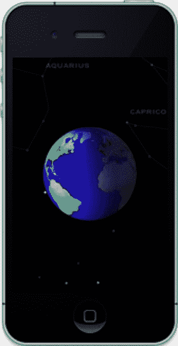
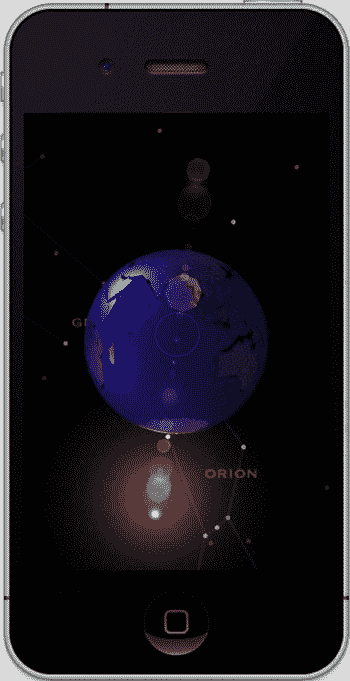
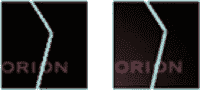
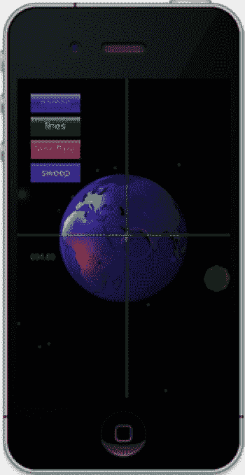
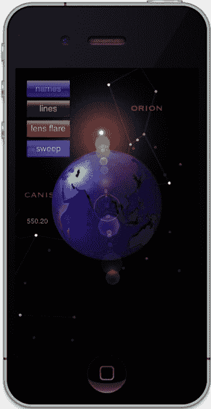
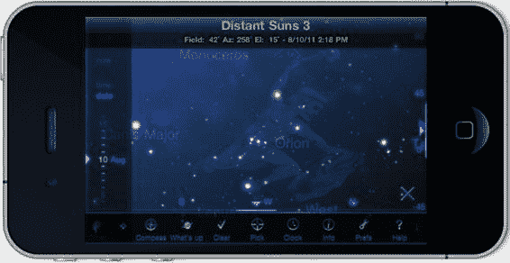

# 第 8 章：整合所有内容

**283**

```
[[OpenGLUtils getObject] sphereToRectTheta:15.0*[ra floatValue]/DEGREES_PER_RADIAN
phi:[dec floatValue]/DEGREES_PER_RADIAN radius:STANDARD_RADIUS
xprime:&x yprime:&y zprime:&z];
```

```
index=j*3;
data[index+0]=x;
data[index+1]=y;
data[index+2]=z;
```

```
nsdata=[[NSData alloc] initWithBytes:data length:numbytes];
[dict setObject:nsdata forKey:@"binarydata"];
```

与点的大小类似，OpenGL 同样允许你使用 `glLineWidth()` 来改变线条的宽度，该函数接受一个 `GLfloat` 类型的参数。`glLineWidth()` 并不了解 Retina 缩放，因此如果你希望线条在不同平台上看起来一致，请务必在适当时将宽度加倍。

最后要补充的是：分配和调用。在太阳系控制器中，分配星座对象（用于存储恒星、线条和名称的容器）并调用它。（我会让你自己琢磨具体的时机和位置。）布尔参数用于开启特定的可显示内容，这在添加用户界面时会用到：

```
[m_Constellations execute:TRUE names:m_TRUE];
```

现在我们准备看看效果了。运气好再加一点毅力，你可能会得到类似图 8-8 的结果。

[www.it-ebooks.info](http://www.it-ebooks.info)





**第 8 章：整合所有内容**

**284**

图 8-8. 我们的单行星太阳系

很酷，对吧？当然，如果你没有看到上述效果，请重新检查你的所有代码，也可以直接作弊，从 Apress 获取整个项目。当然，项目中没有云层，但那些会稍后处理。

在这个阶段，出现了一个小问题——OpenGL ES 显露出它稍微丑陋的一面。在你的模拟器或非 Retina 设备上仔细观察这些线条。它们看起来不太好，对吧？线条的抗锯齿功能似乎是 OpenGL ES 标准委员会认为可以省略的功能，尽管这在桌面库中是标准配置。

**注：** 模拟器可以生成抗锯齿线条，但在真实硬件上运行时却不行。

[www.it-ebooks.info](http://www.it-ebooks.info)



**第 8 章：整合所有内容**

**285**

为什么？我也不知道。但我们在桌面上习以为常的平滑线条，在手持设备上却不存在。Retina 显示屏凭借其高分辨率，基本上让抗锯齿变得无关紧要。然而，在非 Retina 设备（包括截至撰写本书时的 iPad）上，效果仍然相当粗糙。有几种变通方法，其中一种更像 hack。第一种（也更 hacky）方法是放弃标准的 OpenGL 线条支持，替换为非常长且细的纹理对象，因为后者可以被平滑处理。一个不错的副作用是（通过额外一点工作）你还可以得到虚线。

另一种不那么 hacky 但容易得多的方法是使用 iOS 4 及之后版本中提供的一个特性：多重采样抗锯齿（简称 MSAA）。

将多重采样作为抗锯齿的手段，需要添加一个特殊的多重采样帧缓冲对象。你的图像最初会被写入这个特殊缓冲区，其分辨率高于最终显示的分辨率。然后，它会被“解析”成一个更小的缓冲区，最终的像素代表原始颜色的混合版本。通常，多重采样缓冲区的尺寸是最终缓冲区的四倍；也就是说，每个最终像素通常是四个原始像素的加权平均值（这与第五章中介绍的纹理过滤并非完全不同）。这也被称为全屏抗锯齿，因为它确实做到了这一点。好处是图像更平滑；缺点包括性能下降以及离屏缓冲区消耗额外内存。图 8-9（左）显示了我们的一条没有 MSAA 的线条，而图 8-9（右）显示了启用 MSAA 后的效果。

图 8-9. 多重采样抗锯齿，之前（左）和之后（右）

iOS 5 的 GLKit 中另一个不错的补充是内置于 `GLKView` 中对 MSAA 的支持。以前，这需要大约 40 行代码，但现在你只需要在你的视图控制器的 `viewDidLoad()` 方法中添加以下内容：

```
view.drawableMultisample=GLKViewDrawableMultisample4X;
```

## 添加用户界面

当然，任何缺乏交互方式的应用程序通常被称为“演示”。但在这里，我们的小演示实际上将同时获得一个简单的用户界面和 HUD 图形。

在向你的 OpenGL 应用添加 UI 元素时，我有一些非常好的消息。因为 `GLKView` 是 `UIView` 的子类，你可以像对待任何其他视图对象一样对待它。这意味着你可以创建并添加任何其他 `UIView` 对象（因此实际上是任何 UIKit 控件）作为你 3D 场景的子视图。这也意味着你可以完全访问视图的动画属性，以创建一个真正流畅的界面。图 8-10 展示了我向示例中添加的一个快速 UI，用于打开和关闭各种物体，以及一个横穿屏幕的动画扫描线。按钮是带有自定义图像的 `UIButton`，文本是 `UILabel`，而绿色的扫描线像某种雷达序列一样扫过屏幕。

[www.it-ebooks.info](http://www.it-ebooks.info)





**第 8 章：整合所有内容**

**286**

令人惊讶的是，性能通常还保持得不错。所以，它有两个优点。缺点是它会让你更锁定在 iOS 生态系统中。考虑到 OpenGL ES 是一个行业标准，你可能需要考虑将标准对象与非标准对象混合使用的潜在影响。事实上，许多作者尽可能避免使用任何 Objective-C 和 iOS 特定的东西，而是在 OpenGL 世界中自己实现 UI。这样一来，移植到其他设备的时间可以从几个月缩短到几天。

**图 8-10.** 向太阳系添加界面元素

在 Distant Suns 中，我在屏幕左侧有一个日期/时间控件，允许用户非常快速地向前或向后推进时间（图 8-11）。这个控件完全在 OpenGL 层中渲染，很大程度上是为了看看我能否做到。它看起来和工作起来都很好，而底部和顶部的工具栏则是标准的 UIKit 模型。

[www.it-ebooks.info](http://www.it-ebooks.info)



**第 8 章：整合所有内容**

**287**

**图 8-11.** Distant Suns，左侧是自定义日期滚轮，同时底部拥有标准的 UIKit 工具栏

早期，苹果确实曾因性能原因警告不要混合使用这两个世界，特别是当使用 `NSTimer` 驱动渲染循环时。随着 iOS 3.1 中 `CADisplayLink` 的加入，情况好了很多。还有其它一些最佳实践需要牢记：

- 如果视图被隐藏或应用程序进入后台，请禁用任何 OpenGL 渲染循环。
- 如果正在执行全屏核心动画，请禁用任何 OpenGL 视图。
- 对话框窗口越简单，对 OpenGL 图形的性能影响越小。
- 少用透明度，特别是当你的 OpenGL 视图位于顶层时。

看到了吗？有时候简单的方法可能是最好的方法。

## 总结

在本章中，我们结合了许多前几章学到的技巧，将它们组合成一个更完整、更吸引人的太阳系模型。单行星太阳系本身并不令人印象深刻。所以，亲爱的读者，我将把添加月球、添加其他行星以及让地球围绕太阳公转的任务留给你。此外，我们还涉及了其他几个我没能来得及加入项目的主题和技巧。例如，可以使用帧缓冲对象（FBO）在屏幕上插入一个来自不同视角的地球辅助视图。

[www.it-ebooks.info](http://www.it-ebooks.info)

**第 8 章：整合所有内容**

**288**


不过，我们确实添加了镜头光晕、点和线对象，使应用程序支持高分辨率 Retina 显示屏，并涵盖了全屏抗锯齿以及 OpenGL 视图与标准 iOS 控件的混合使用。

在下一章中，我们将探讨优化技巧，以及如何利用苹果自带的工具来定位 OpenGL ES 应用程序的性能瓶颈。

[www.it-ebooks.info](http://www.it-ebooks.info)

