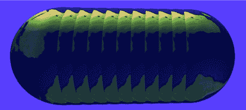
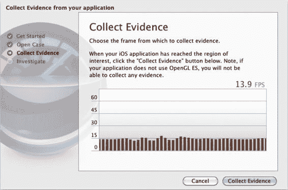
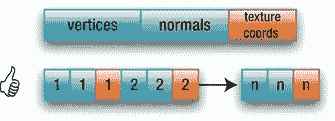

# 第 9 章：性能与相关优化

## 291

`totalNormalBytes=numNormalElements*m_NumVertices*sizeof(GLfloat);` `totalTexCoordinateBytes=numTextureCoordElements*m_NumVertices*sizeof(GLfloat);`

```
memcpy(vboBuffer,m_VertexData,totalXYZBytes); //6
```

```
if(m_UseNormals)
{
    vboBuffer += totalXYZBytes;
    memcpy(vboBuffer,m_NormalData,totalNormalBytes);
}
```

```
if(m_UseTexture)
{
    vboBuffer += totalNormalBytes;
    memcpy(vboBuffer,m_TexCoordsData,totalTexCoordinateBytes);
}
```

```
glUnmapBufferOES(GL_ARRAY_BUFFER); //7
```

```
m_TotalXYZBytes=totalXYZBytes;
m_TotalNormalBytes=totalNormalBytes;
}
```

以下是具体说明：

首先，我们需要在第 1 行中为这个 VBO 生成一个名称，其方式与纹理类似。

接下来，在第 2 行及后续行中统计每个顶点的大小。在本例中，一个顶点由坐标、纹理坐标和法向量（根据需要）的总和构成。然后将该总和乘以顶点总数。

第 3 行实际上是在 GPU 上分配内存。当你的对象不再需要时，可以通过调用`glDeleteBuffer()`来释放这块内存。最后一个参数是一个提示，告知驱动程序这些数据预计永远不会改变。如果你预期会更新数据，则应使用`GL_DYNAMIC_DRAW`。如果你发现两者之间没有任何变化，也不必惊讶，因为当前的驱动程序很可能直接忽略了该提示。

第 4 行开始将数据上传到缓存的过程。这可以通过两种方式实现：通过内存映射或直接上传。这里我们通过调用`glMapBufferOES()`来使用内存映射。该函数返回一个指针，指向应用程序地址空间内 GPU 数据存储中经过内存映射的部分。另一种方法使用更传统的`glBufferData()`。前者的优势在于，可以避免应用程序中因需要将多个组件合并成一个大数据块进行上传而产生的额外内存拷贝。

现在计算每种数据类型的总字节数。法线和 XYZ 坐标各自需要相同的内存，而我们仅使用 2D 纹理坐标。

神奇之处始于第 6 行及后续行，只需使用`memcpy()`即可逐一复制各个缓冲区。

第 7 行中的`glUnmapBufferOES()`强制执行实际的拷贝操作。

## 292

那么，我们如何使用 VBO 呢？非常简单。请看清单 9-2 中的`executeVBO()`方法。

**清单 9-2. 使用 VBO 渲染行星**

```
-(bool)executeVBO
{
    int i;
    static int counter=0;

    glBindBuffer(GL_ARRAY_BUFFER, m_VBO_SphereDataName); //1

    glMatrixMode(GL_MODELVIEW);

    glDisable(GL_CULL_FACE); //2
    glEnable(GL_BLEND);
    glEnable(GL_DEPTH_TEST);

    glEnableClientState(GL_VERTEX_ARRAY); //3

    if(m_UseNormals)
        glEnableClientState(GL_NORMAL_ARRAY);

    glVertexPointer(3,GL_FLOAT,0,(GLvoid*)(char*)0); //4
    glNormalPointer(GL_FLOAT,0,(const GLvoid*)(char*)(0+m_TotalXYZBytes));
    glTexCoordPointer(2,GL_FLOAT,0,
        (const GLvoid*)((char*)(m_TotalXYZBytes+m_TotalNormalBytes)));

    if(m_UseTexture)
    {
        if(m_TexCoordsData!=nil)
        {
            glEnable(GL_TEXTURE_2D);
            glEnableClientState(GL_TEXTURE_COORD_ARRAY);

            if(m_TextureID!=0)
                glBindTexture(GL_TEXTURE_2D, m_TextureID);

        }
    }
    else
        glDisableClientState(GL_TEXTURE_COORD_ARRAY);

    //5
    glDrawArrays(GL_TRIANGLE_STRIP, 0, (m_Slices+1)*2*(m_Stacks-1)+2);

    glDisable(GL_BLEND);
    glDisable(GL_TEXTURE_2D);

    return true;
}
```

## 293

渲染 VBO 相当直接，整个过程中只有一个地方让人稍感困惑。

第 1 行将其绑定，方式与绑定纹理相同。这简单地使其成为当前正在使用的对象，直到绑定另一个对象或通过`glBindBuffer(GL_ARRAY_BUFFER, 0);`将其解绑为止。


## 面剔除与 VBO 使用

第 2 行禁用了面剔除（用于测试目的），这样我们就能确认所有面都被渲染，而不仅仅是正面。

第 3 行及后续行启用了各种数据缓冲区，与之前`execute()`方法中的做法一致。

第 4 行及后续行则有所不同。使用 VBO 时，指向数据块的各种指针是相对于第一个元素的偏移量，该偏移量始终从零“地址”开始，而非应用程序自身地址空间中的地址。因此，顶点指针从地址 0 开始，法线紧随顶点之后，纹理坐标则位于法线之后。

第 5 行像之前一样绘制数组。

在代码优化方面，我属于需要先验证特定技巧是否有效的人。否则，我可能会花费大量时间来做一些仅能将帧率提升 0.23%的事情。游戏程序员或许会将此视为一种荣誉，但我认为这会分散我的注意力，从而剥夺用户获得某个可选新功能或 Bug 修复的机会——因为用户永远无法察觉到这些优化。因此，我开发了一个简单的测试程序来尝试本文描述的各种技巧。前面的两个代码清单便来自这项测试。

一旦你确认 VBO 按预期运行，就可以让程序在彼此之上绘制多个地球。以下代码将同时旋转并渲染 10 个额外的行星：

```
for(i=0;i<10;i++)
{
glTranslatef(0.0, 0.01, 0.0);
glDrawArrays(GL_TRIANGLE_STRIP, 0, (m_Slices+1)*2*(m_Stacks-1)+2);
}
```

并使用 200 个堆栈和 200 个切片生成球体，总计 80400 个顶点，数据量超过 2.5MB。由于使用同一个实例，我只需在程序启动时加载一次 GPU 数据。如果不使用 VBO，同一模型将被加载 11 次。参见图 9-1。

[www.it-ebooks.info](http://www.it-ebooks.info)



## 第 9 章：性能相关

**294**

图 9-1. 巨型计算机生成的潮虫，或 11 个彼此堆叠的地球。

在测试此类示例的帧率时，苹果公司随 iOS 5 开发工具包提供了一款极其简单但功能强大的新工具，名为“OpenGL ES 性能侦探”。如图 9-2 所示，它可以连接设备上的任意应用并提供帧率。如果帧率较低，它会为你分析原因，并告知是否属于 OpenGL 问题；如果是，则会推荐可能的解决方案。

使用该工具后，我发现：在 iPad 2 上，不使用 VBO 时示例运行帧率约为 9.5 帧/秒（FPS），而使用 VBO 后帧率跃升近 50%，达到 13.5 FPS。

有趣的是，在 iPad 1 上几乎检测不到性能提升（帧率仅维持在约 2.5 FPS）；而在 iPhone 3GS 和 iPhone 4 上，使用 VBO 的帧率甚至略低于不使用 VBO 时的帧率（2.0 对比 2.3 FPS）。性能侦探提示我，帧率是性能瓶颈，并建议限制数据量。

**注意** 从 iPhone 3GS 到 iPad 1 的所有设备均使用 Imagination Technologies 公司的同一款 GPU——PowerVR SGX-535，而 iPad 2 则使用双核 SGX 545MP。因此，如果你的应用存在 OpenGL 方面的限制，它在使用相同 GPU 的任何设备上运行表现可能相近。

所有这些测试结果仅具相对参考意义，因为该示例完全是人为设计的，未必能反映你的实际场景。

[www.it-ebooks.info](http://www.it-ebooks.info)





## 第 9 章：性能相关

**295**

图 9-2. 性能侦探

## 交错数据

另一个推荐的技巧是使用交错数据而非顺序数组。还记得第 8 章创建星体导入器的例子吗？两者区别不大。你可以将各个缓冲区交织在一起，使每个顶点的数据位于一个连续的结构中，如图 9-3 所示。


