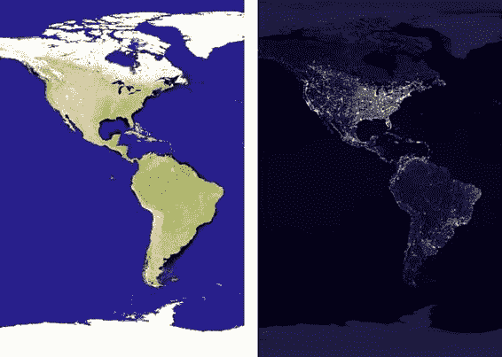
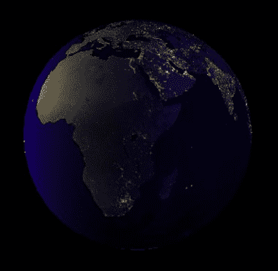
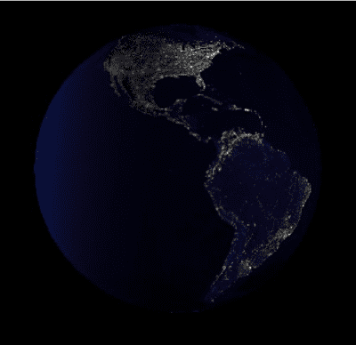
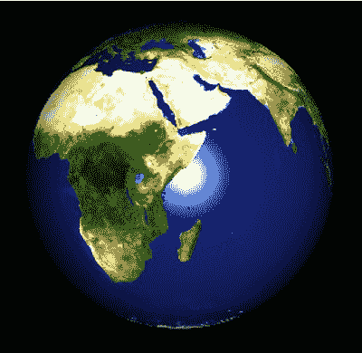
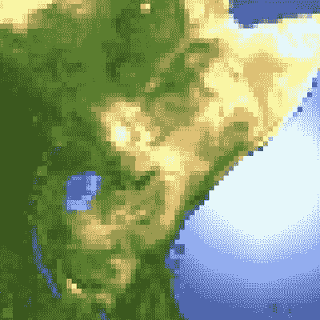
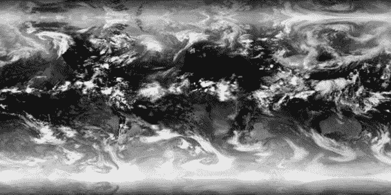
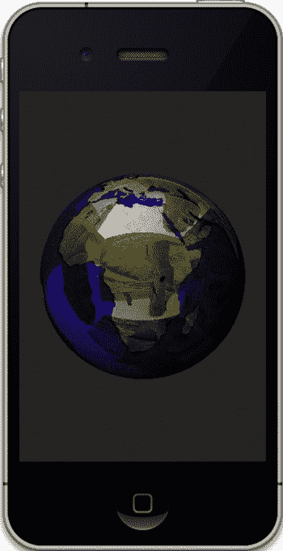
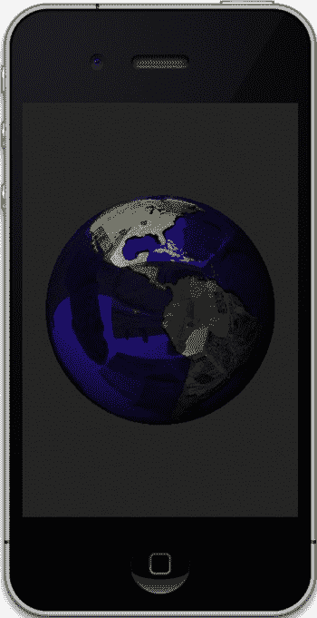

# 第 10 章：OpenGL ES 2、着色器与……

**309**

如果这听起来像是要对场景中每个对象的每个片元都进行大量工作，并以每秒 60 帧的速度运行，那么你说对了。但从根本上说，着色器实际上是在图形硬件本身上加载和运行的小型程序，因此它们非常非常快。

OpenGL 应用程序

几何图形与纹理

顶点着色器

光照、变换、缩放等

生成片元

光栅化

片段着色器

纹理、着色

帧缓冲区

模板、Alpha、Z 测试、混合

人眼

“嘿，这真的很酷！”

**图 10-1.** OpenGL ES 2 架构概述

## 着色器结构

顶点着色器和片段着色器在结构上相似，看起来有点像一段简短的 C 语言程序。


程序。入口点总是被命名为`main()`（类似于 C 语言和 Objective-C），语法也同样非常类似 C 语言。

着色器语言称为`GLSL`（不要与 Direct3D 中的`HLSL`混淆），它包含一组丰富的内置函数，这些函数属于以下三个主要类别：

*   面向图形处理的数学运算，例如矩阵、向量、三角学、导数和逻辑函数。
*   纹理采样。
*   小型辅助工具，例如取模、比较和求值器。

值通过以下类型传入和传出着色器：

*   **统一变量（Uniforms）**：从调用程序传入的值。这些值可能包括用于变换或投影的矩阵。它们在顶点着色器和片段着色器中都可用，并且在每个位置必须声明为相同的类型。
*   **易变变量（Varying variables）**：在顶点着色器中定义并传递到片段着色器的变量。

变量可以定义为常用的数值基本类型，也可以定义为基于向量和矩阵的面向图形学的类型，如表 10-1 所示。

**表 10-1\. GLSL 允许的变量类型**

| 类 | 类型 | 描述 |
| --- | --- | --- |
| 基本类型 | `float`, `int`, `bool` | 你现在真的不需要我来定义这些了吧？ |
| 向量 | `int`, `ivec2`, `ivec3`, `ivec4`, `float`, `vec2`, `vec3`, `vec4`, `bool`, `bvec2`, `bvec3`, `bvec4` | `float`, `int` 和 `bool` 是“一维向量”。布尔向量在其分量中只保存布尔值。 |
| 矩阵 | `mat2`, `mat3`, `mat4` | 不，这里没有布尔矩阵。 |

除了这些类型之外，你还可以使用修饰符来定义`int`和`float`类型变量的精度。精度可以是`highp`（24 位）、`mediump`（16 位）或`lowp`（10 位），其中`highp`是默认值。所有变换都必须使用`highp`完成，而颜色只需要`mediump`。（不过，我不明白为什么布尔值没有精度限定符。）任何基本类型都可以声明为常量变量，例如`const float x=1.0`。

结构体也被允许使用，其语法看起来与 C 语言中的结构体完全相同。

### 限制

由于着色器驻留在 GPU 上，因此它们自然有许多限制来约束其复杂性。它们可能受到“指令计数”、允许的统一变量数量（通常为 128 个）、临时变量数量以及循环嵌套深度的限制。

不幸的是，在 OpenGL ES 上，没有真正的方法从硬件获取这些限制，因此你只能意识到它们的存在，并让你的着色器尽可能保持精简。

顶点着色器和片段着色器之间也存在差异。例如，`highp`支持在片段着色器中是可选的，而在顶点着色器中是强制性的。哈。

### 回到旋转的立方体

那么，现在让我们回到之前那个“对决立方体”的例子，分析一下一个基本的 OpenGL ES 2 程序是如何构造的。正如你将看到的，生成着色器的过程与生成大多数其他应用程序的过程没什么不同。它包含基本的编译、链接和加载序列。清单 10-1 展示了该过程的第一部分——编译着色器。在 Apple 的示例中，所有这些步骤都放在一个视图控制器中，但它们可以放在任何地方。

**清单 10-1\. 编译着色器**

```objc
- (BOOL)compileShader:(GLuint *)shader //1
type:(GLenum)type file:(NSString *)file

{
    GLint status;
    const GLchar *source;

    source = (GLchar *)[[NSString stringWithContentsOfFile:file
    encoding:NSUTF8StringEncoding error:nil] UTF8String];

    if (!source)
    {
        NSLog(@"Failed to load vertex shader");
        return NO;
    }

    *shader = glCreateShader(type); //2

    glShaderSource(*shader, 1, &source, NULL); //3

    glCompileShader(*shader); //4

    #if defined(DEBUG)

    GLint logLength;
    glGetShaderiv(*shader, GL_INFO_LOG_LENGTH, &logLength); //5

    if (logLength > 0)
    {
        GLchar *log = (GLchar *)malloc(logLength);
```


`glGetShaderInfoLog(*shader, logLength, &logLength, log); //6`

`NSLog(@"Shader 编译日志：\n%s", log);`

`free(log);`

`}`

`#endif`

`glGetShaderiv(*shader, GL_COMPILE_STATUS, &status); //7`

`if (status == 0)`

`{`

`glDeleteShader(*shader); //8`

`return NO;`

`}`

[www.it-ebooks.info](http://www.it-ebooks.info)

## 第 10 章：OpenGL ES 2、着色器与……

312

`return YES;`

`}`

当你跳过所有错误处理代码后，整个过程归结为：创建着色器、传入源码并编译。

在第 1 行的参数列表中，传入了一个地址用于接收新生成的着色器句柄。同时还提供了一个类型值，可以是 `GL_VERTEX_SHADER` 或 `GL_FRAGMENT_SHADER`。最后还指定了一个文件名。你并不必须从文件中提供着色器，因为其他人可能会将着色器定义为代码体内的静态字符串。

在第 2 行中，`glCreateShader()` 生成了一个空着色器对象并返回其句柄。

第 3 行将着色器的源码传递给新创建的对象，因为其实际职责是包含用于定义着色器的文本字符串。

接下来我们在第 4 行编译该对象。

现在我们需要检查编译状态。由于在 GPU 上无法调试着色器，系统提供了一套完善的错误管理机制，可以将相当详细的字符串返回给调用程序。第 5 行获取字符串的长度，而第 6 行获取实际内容。例如，在 `Shader.vsh` 中，我提供了一个从未定义的变量，并收到了以下信息：

`ERROR: 0:19: 使用了未声明的标识符 'normalX'`

但除了使用字符串来确定状态外，你还可以获取数值形式的错误，如第 7 行所示：编译成功返回 `GL_TRUE`，否则返回 `GL_FALSE`。如果编译失败，则删除着色器，如第 8 行所示。

下一步是链接程序，如清单 10-2 所示。

`glLinkProgram()` 是唯一一个重要的调用，其余部分均为错误处理。

### 清单 10-2. 链接新创建的着色器程序

`- (BOOL)linkProgram:(GLuint)prog`

`{`

`GLint status;`

`glLinkProgram(prog);`

`#if defined(DEBUG)`

`GLint logLength;`

`glGetProgramiv(prog, GL_INFO_LOG_LENGTH, &logLength);`

[www.it-ebooks.info](http://www.it-ebooks.info)

## 第 10 章：OpenGL ES 2、着色器与……

313

`if (logLength > 0)`

`{`

`GLchar *log = (GLchar *)malloc(logLength);`

`glGetProgramInfoLog(prog, logLength, &logLength, log);`

`NSLog(@"程序链接日志：\n%s", log);`

`free(log);`

`}`

`#endif`

`glGetProgramiv(prog, GL_LINK_STATUS, &status);`

`if (status == 0)`

`{`

`return NO;`

`}`

`return YES;`

`}`

链接之后，通常需要对程序进行“验证”。验证是 OpenGL 实现者返回代码相关信息的途径，例如建议的改进。你主要在开发过程中使用此功能，如清单 10-3 所示。与之前一样，它主要是错误处理。

### 清单 10-3. 程序验证

`- (BOOL)validateProgram:(GLuint)prog`

`{`

`GLint logLength, status;`

`glValidateProgram(prog);`

`glGetProgramiv(prog, GL_INFO_LOG_LENGTH, &logLength);`

`if (logLength > 0)`

`{`

`GLchar *log = (GLchar *)malloc(logLength);`

`glGetProgramInfoLog(prog, logLength, &logLength, log);`

`NSLog(@"程序验证日志：\n%s", log);`

`free(log);`

`}`

`glGetProgramiv(prog, GL_VALIDATE_STATUS, &status);`

`if (status == 0)`

`{`

`return NO;`

`}`

`return YES;`

`}`

最后一个例程 `loadShaders()`，如清单 10-4 所示，将前面的三个例程整合在一起，并将我们的属性和参数绑定到程序。这样，我们就可以传入顶点信息或参数的数组，并在双方指定它们的名称。

[www.it-ebooks.info](http://www.it-ebooks.info)

## 第 10 章：OpenGL ES 2、着色器与……

314

### 清单 10-4. 加载着色器并解析参数


```objectivec
- (BOOL)loadShaders
{
    GLuint vertShader, fragShader;
    NSString *vertShaderPathname, *fragShaderPathname;

    _program = glCreateProgram(); //1

    vertShaderPathname = [[NSBundle mainBundle] pathForResource:@"Shader" ofType:@"vsh"];

    if (![self compileShader:&vertShader //2
                       type:GL_VERTEX_SHADER
                       file:vertShaderPathname])
    {
        NSLog(@"Failed to compile vertex shader");
        return NO;
    }

    fragShaderPathname = [[NSBundle mainBundle] pathForResource:@"Shader" ofType:@"fsh"];

    if (![self compileShader:&fragShader
                       type:GL_FRAGMENT_SHADER
                       file:fragShaderPathname])
    {
        NSLog(@"Failed to compile fragment shader");
        return NO;
    }

    glAttachShader(_program, vertShader); //3
    glAttachShader(_program, fragShader);

    glBindAttribLocation(_program, ATTRIB_VERTEX, "position"); //4
    glBindAttribLocation(_program, ATTRIB_NORMAL, "normal");

    if (![self linkProgram:_program]) //5
    {
        NSLog(@"Failed to link program: %d", _program);

        if (vertShader)
        {
            glDeleteShader(vertShader);
            vertShader = 0;
        }

        if (fragShader)
        {
            glDeleteShader(fragShader);
            fragShader = 0;
        }

        if (_program)
        {
            glDeleteProgram(_program);
            _program = 0;
        }

        return NO;
    }

    uniforms[UNIFORM_MODELVIEWPROJECTION_MATRIX] = //6
        glGetUniformLocation(_program, "modelViewProjectionMatrix");
    uniforms[UNIFORM_NORMAL_MATRIX] =
        glGetUniformLocation(_program, "normalMatrix");

    if (vertShader) //7
    {
        glDetachShader(_program, vertShader);
        glDeleteShader(vertShader);
    }

    if (fragShader)
    {
        glDetachShader(_program, fragShader);
        glDeleteShader(fragShader);
    }

    return YES;
}
```

以下是代码的逐行说明：

第 1 行生成一个程序句柄，并创建一个空的程序对象。你需要保存这个句柄，用它来指定某个几何体使用哪个程序，因为你可以创建多个程序，并根据需要在它们之间来回切换。

接下来，在第 2 行及之后几行中，着色器被编译。

第 3 行及之后几行将特定的着色器绑定到新的程序对象。每个程序对象必须包含一个顶点着色器和一个片段着色器。

在第 4 行及之后几行中，我们将所需的属性绑定到程序。在顶点着色器的实际代码中，可以看到定义了供使用的同名属性：

```glsl
attribute vec4 position;
attribute vec3 normal;
```

属性名称几乎可以任意指定；使用`position`或`normal`并无特殊之处。

第 5 行将两个着色器链接起来。

除了将属性绑定到着色器中的命名实体外，你还可以对 uniform 变量进行同样的操作，如第 6 行和第 7 行所示。

请记住，uniform 变量只是从调用程序传入的值。（它们与属性的区别在于，属性与每个顶点是一一映射的。）在本例中，我们提供了两个矩阵，并分别命名为`modelViewProjectionMatrix`和`normalMatrix`。再次查看顶点着色器，可以看到以下内容：

```glsl
uniform mat4 modelViewProjectionMatrix;
uniform mat3 normalMatrix;
```

第 7 行及之后几行支持一项内存优化特性。链接完成后，着色器代码会被复制到程序中，因此我们已有的着色器对象就不再需要了。由于它们使用引用计数，`glDetachShader()`函数可以将计数减一，当然，当计数为零时，就可以安全地删除它们。

作为副作用，如果你以任何方式修改了着色器，则必须在修改生效前重新链接。为了防止需要重新链接的情况，驱动程序可能会保留一些缓存信息以备后用。否则，分离/删除的过程可以帮助驱动程序重用缓存内存。

如你所见，实际需要的调用非常少，但苹果的演示代码也包含了所有的错误处理，这也是保留该代码的原因。

现在，解决了这些问题后，我们可以来看看这两个着色器。清单 10-5 是顶点着色器`Shader.vsh`。请注意，这对着色器共享相同的前缀，顶点着色器的后缀为`vsh`，而片段着色器的后缀为`fsh`。

**清单 10-5. 演示程序的顶点着色器**

```glsl
attribute vec4 position; //1
attribute vec3 normal;

varying lowp vec4 colorVarying; //2

uniform mat4 modelViewProjectionMatrix; //3
uniform mat3 normalMatrix;

void main()
{
    vec3 normalDirection = normalize(normalMatrix * normal); //4
    vec3 lightPosition = vec3(0.0, 0.0, 1.0); //5
    vec4 diffuseColor = vec4(0.4, 0.4, 1.0, 1.0); //6

    float nDotVP = max(0.0, dot(eyeNormal, normalize(lightPosition))); //7

    colorVarying = diffuseColor * nDotVP; //8

    gl_Position = modelViewProjectionMatrix * position; //9
}
```

详细说明如下：

第 1 行声明了我们在调用代码中指定的属性。请记住，属性是直接映射到每个顶点的数据数组，并且仅在顶点着色器中可用。

在第 2 行中，声明了一个 varying 向量变量。它将用于将颜色信息传递到片段着色器。

第 3 行声明了两个 uniform 变量，它们最初是在前面的`loadShaders()`函数中指定的。

在第 4 行中，法线乘以`normalMatrix`。在这种情况下不能使用模型视图矩阵，因为法线不需要平移，而且模型视图中的任何缩放都会扭曲法线。事实证明，你可以使用模型视图矩阵的逆矩阵和转置矩阵来处理法线。之后，对结果进行归一化处理。

第 5 行提供了光源的位置，而第 6 行提供了默认颜色。通常你不会将这些数据嵌入着色器内部，但这样做很可能是为了方便起见。

现在，在第 7 行中，计算法线（现在称为`eyeNormal`）与光源位置的点积，以得出两者之间的夹角。`max()`函数确保返回值被限制在`>=0`范围内，以处理任何负值。

然后，如第 7 行所示，只需将点积乘以漫反射颜色，就能得到一个面相对于光源局部位置的亮度。法线越朝向光源，亮度越高。随着法线偏离光源，亮度会降低，最终变为 0。

`gl_Position`是 GLSL 中预定义的 varying 变量，用于将变换后的顶点位置传回驱动程序。

此示例中的片段着色器是最基本的实现。它只是将颜色信息从顶点着色器原封不动地传递过来。`gl_FragColor`是另一个预定义的 varying 变量，所有最终计算都在这里完成，如清单 10-6 所示。

**清单 10-6. 最简单的片段着色器**

```glsl
varying lowp vec4 colorVarying;

void main()
{
    gl_FragColor = colorVarying;
}
```

现在我们准备使用着色器了，事实证明它们出乎意料地简单明了。

首先，`glUseProgram()`设置当前程序，接着使用`glUniform*`函数将应用中的值传递到显卡上的着色器中。属性通常与几何体同时提供，通过调用`glVertexAttribPointer()`等函数来实现。


### 关于 `setupGL()` 的补充说明

关于本示例，还有一个要点体现在它的 `setupGL()` 方法中。虽然第 1 章已简要提及，但现在是时候更仔细地看看数据在 OpenGL ES 2 程序中是如何传递给 GPU 的。顶点数组对象（VAO，切勿与顶点缓冲对象混淆）代表一组描述场景特定状态的信息集合。与其他对象一样，创建/使用 VAO 遵循相同的流程：生成唯一 ID、绑定、填充数据，然后解绑备用。可以生成多个 VAO，各自承载场景不同部分的几何体指针和属性。在立方体示例中，请参考代码清单 10-7。生成 VAO ID 并将其绑定为当前 VAO 后，会为交错排列的几何数据创建一个顶点缓冲对象。随后，VAO 会被通知 VBO 数据的组织方式，在此示例中，仅涉及位置和法线数据。

**代码清单 10-7.** 创建顶点数组对象

```
glGenVertexArraysOES(1, &_vertexArray);
glBindVertexArrayOES(_vertexArray);
glGenBuffers(1, &_vertexBuffer);
glBindBuffer(GL_ARRAY_BUFFER, _vertexBuffer);
glBufferData(GL_ARRAY_BUFFER, sizeof(gCubeVertexData), gCubeVertexData, GL_STATIC_DRAW);
glEnableVertexAttribArray(GLKVertexAttribPosition);
glVertexAttribPointer(GLKVertexAttribPosition, 3, GL_FLOAT, GL_FALSE, 24, BUFFER_OFFSET(0));
glEnableVertexAttribArray(GLKVertexAttribNormal);
glVertexAttribPointer(GLKVertexAttribNormal, 3, GL_FLOAT, GL_FALSE, 24, BUFFER_OFFSET(12));
glBindVertexArrayOES(0);
```

当需要绘制时，将 VAO 句柄设置为当前 VAO，并调用标准的 `glDrawArray()` 例程。

---

### 地球夜景

让我们从地球模型开始，看看如何利用着色器使其更生动。你熟悉地球表面的图像，如图 10-2（左图）所示，但你可能也见过类似的地球夜景图像，如图 10-2（右图）所示。如果能在地球的暗面显示夜景纹理，而不是仅仅显示常规纹理贴图的暗色版本，那将会非常酷。

[www.it-ebooks.info](http://www.it-ebooks.info)



**第 10 章：OpenGL ES 2、着色器与...** **319**

**图 10-2.** 白天地球（左）与夜地球（右）对比

在 OpenGL 1.1 下，即使可能实现，这也非常棘手。算法应该相对简单：渲染两个尺寸完全相同的球体。一个使用夜图像，另一个使用日图像。根据光照强度改变日半球纹理的 alpha 通道。当光照强度降至 0 时，纹理完全透明，夜半球显露出来。然而，在 OpenGL ES 2 下，你可以非常轻松地编写着色器，几乎完全匹配该算法。

于是，我从 Apple 的立方体模板开始，去掉了立方体相关内容，并添加了 `Planet.mm` 和 `Planet.h` 文件。`setupGL()` 修改为代码清单 10-8。注意加载两个纹理和两个着色器程序的过程。

**代码清单 10-8.** 设置显示地球夜景

```
- (void)setupGL
{
    int planetSize=20;
    [EAGLContext setCurrentContext:self.context];
    [self loadShaders:&m_NightsideProgram shaderName:@"nightside"];
    [self loadShaders:&m_DaysideProgram shaderName:@"dayside"];
    float aspect = fabsf(self.view.bounds.size.width / self.view.bounds.size.height);
    m_ProjectionMatrix = GLKMatrix4MakePerspective(GLKMathDegreesToRadians(65.0f),
                                                  aspect, 0.1f, 100.0f);
```

[www.it-ebooks.info](http://www.it-ebooks.info)

**第 10 章：OpenGL ES 2、着色器与...** **320**

```
    glEnable(GL_DEPTH_TEST);
    m_EyePosition=GLKVector3Make(0.0,0.0,65.0);
    m_WorldModelViewMatrix=GLKMatrix4MakeTranslation(-m_EyePosition.x,-m_EyePosition.y,-m_EyePosition.z);
}
```


`m_Sphere=[[Planet alloc] init:planetSize slices:planetSize radius:10.0f squash:1.0f textureFile:NULL];`

`[m_Sphere setPositionX:0.0 Y:0.0 Z:0.0];`

`m_EarthDayTexture=[self loadTexture:@"earth_light.png"];` `m_EarthNightTexture=[self loadTexture:@"earth_night.png"];`

`m_LightPosition=GLKVector3Make(100.0, 10,100.0);` //位于地球后方

`}`

在`loadShaders()`中，我仅仅增加了一个属性，即`texCoord`（纹理坐标）。这些属性在片段着色器中恢复：

`glBindAttribLocation(*program, ATTRIB_VERTEX, "position");` `glBindAttribLocation(*program, ATTRIB_NORMAL, "normal");` `glBindAttribLocation(*program, GLKVertexAttribTexCoord0, "texCoord");`

我还将光源的位置作为 uniform 变量传递，而不是在顶点着色器中硬编码。这通过以下几个步骤完成：

首先，将其添加到着色器中：`uniform vec3 lightPosition;`。

然后，在`loadShaders()`中，使用`glGetUniformLocation()`获取其“位置”。该函数仅返回一个会话内的唯一 ID，之后在向着色器设置或获取数据时使用。

然后可以通过以下方式设置光源位置：

`glUniform3fv(uniforms[UNIFORM_LIGHT_POSITION],1,m_LightPosition.v);`

接着修改调用，添加两个参数，以便能够使用不同的着色器名称进行调用，并添加一个指向程序句柄的指针。同时记得修改代码以支持参数，而不是临时变量：

`- (BOOL)loadShaders:(GLuint *)program shaderName:(NSString *)shaderName`

现在，在清单 10-9 中，地球的两面都被绘制，夜晚的一面先绘制，白昼的一面后绘制。根据需要交换程序（shader program）。

清单 10-9. 处理该情况的`drawInRect()`方法

```
- (void)glkView:(GLKView *)view drawInRect:(CGRect)rect
{
    GLfloat gray=0.0;
    static int frame=0;

    glClearColor(gray,gray,gray, 1.0f);
    glClear(GL_COLOR_BUFFER_BIT | GL_DEPTH_BUFFER_BIT);

    //夜晚面
    [self useProgram:m_NightsideProgram];
    [m_Sphere setBlendMode:PLANET_BLEND_MODE_SOLID];
    [m_Sphere execute:m_EarthNightTexture.name];

    //白昼面
    [self useProgram:m_DaylightProgram];
    [m_Sphere setBlendMode:PLANET_BLEND_MODE_FADE];
    [m_Sphere execute:m_EarthDayTexture.name];

    //大气层
    glCullFace(GL_FRONT);
    glEnable(GL_CULL_FACE);
    glFrontFace(GL_CW);

    frame++;
}
```

在地球的白昼一侧，我使用`m_DaysideProgram`程序，而夜晚一侧则使用另一个称为`m_NightsideProgram`的程序。两者使用相同的顶点着色器，如清单 10-10 所示。

清单 10-10. 地球白昼和夜晚两侧的顶点着色器

```
attribute vec4 position;
attribute vec3 normal;
attribute vec2 texCoord; //1

varying vec2 v_texCoord;
varying lowp vec4 colorVarying;

uniform mat4 modelViewProjectionMatrix;
uniform mat3 normalMatrix;
uniform vec3 lightPosition; //2

void main()
{
    v_texCoord=texCoord; //3

    vec3 eyeNormal = normalize(normalMatrix * normal);
    vec4 diffuseColor = vec4(1.0, 1.0, 1.0, 1.0);

    float nDotVP = max(0.0, dot(normalDirection, normalize(lightPosition)));
    colorVarying = diffuseColor * nDotVP;

    gl_Position = modelViewProjectionMatrix * position;
}
```

这与 Apple 的模板几乎相同，但我们添加了一些内容：

第 1 行用于传递一个额外的属性，即每个顶点的纹理坐标。然后通过第 3 行使用`v_texCoord` varying 变量将其直接传递给片段着色器。

第 2 行是新的 uniform 变量，您可能还记得在视图控制器的代码中，它保存了光源的位置。

清单 10-11 展示了地球白昼一侧的片段着色器，而清单 10-12 则展示了夜晚一侧的片段着色器。


### 列表 10-11\. 地球白昼侧的片段着色器

```
varying lowp vec4 colorVarying; //1

precision mediump float;

varying vec2 v_texCoord; //2

uniform sampler2D s_texture; //3

void main()
{
    gl_FragColor = texture2D( s_texture, v_texCoord )*colorVarying; //4
}
```

你会发现，能实现如此精美的效果，这些代码其实非常简单：

- 第 1 行从顶点着色器获取了易变变量 `colorVarying`。
- 第 2 行以同样的方式获取纹理坐标，接着第 3 行获取纹理。如第 3 行所示，`sampler2D` 是一个内置的统一变量，用于指明正在使用哪个纹理单元。
- 最后，在第 4 行，内置函数 `texture2D` 从 `s_texture` 所引用的纹理中，根据 `v_texCoord` 坐标提取数值。然后将该数值与片段"真实"的颜色 `colorVarying` 相乘。`colorVarying` 的值越小，颜色就越暗。

列表 10-12 展示了如何渲染地球的夜半球。

### 列表 10-12\. 渲染夜半球

```
varying lowp vec4 colorVarying;

precision mediump float;

varying vec2 v_texCoord;

uniform sampler2D s_texture;

void main()
{
    vec4 newColor;

    newColor=1.0-colorVarying; //1

    gl_FragColor = texture2D( s_texture, v_texCoord )*newColor; //2
}
```

在第 1 行，我们只是取了日半球着色器中颜色的相反值。随着阳光照射下颜色的增强，夜半球的纹理逐渐淡出至消失。这可能有些过度，因为夜半球的纹理会被另一侧的纹理冲淡，但在我的审美看来，明暗分界线之后的光点还是有点过于明显了。

最后还有一件事要做，那就是修改你的星球对象，使其能够使用顶点数组对象进行绘制。是的，这又是一个冗长的代码清单，如列表 10-13 所示。数据必须先被打包成更高效的交叉存取格式（参考第 9 章）。然后，生成一个 VAO 作为某种封装容器。

### 列表 10-13\. 为星球创建 VAO

```
-(void)createInterleavedData
{
    int i;
    GLfloat *vtxPtr;
    GLfloat *norPtr;
    GLfloat *colPtr;
    GLfloat *textPtr;
    int xyzSize;
    int nxyzSize;
    int rgbaSize;
    int textSize;

    struct VAOInterleaved *startData;

    int structSize=sizeof(struct VAOInterleaved);
    long allocSize=structSize*m_NumVertices;

    m_InterleavedData=(struct VAOInterleaved *)malloc(allocSize); //1

    startData=m_InterleavedData;

    vtxPtr=m_VertexData;
    norPtr=m_NormalData;
    colPtr=m_ColorData;
    textPtr=m_TexCoordsData;

    xyzSize=sizeof(GLfloat)*NUM_XYZ_ELS;
    nxyzSize=sizeof(GLfloat)*NUM_NXYZ_ELS;
    rgbaSize=sizeof(GLfloat)*NUM_RGBA_ELS;
    textSize=sizeof(GLfloat)*NUM_ST_ELS;

    for(i=0;i<m_NumVertices;i++) //2
    {
        memcpy(&startData->xyz,vtxPtr,xyzSize); //geometry（几何数据）
        memcpy(&startData->nxyz,norPtr,nxyzSize); //normals（法线数据）
        memcpy(&startData->rgba,colPtr,rgbaSize); //colors（颜色数据）
        memcpy(&startData->st,textPtr,textSize); //texture coords（纹理坐标）

        startData++;
        vtxPtr+=NUM_XYZ_ELS;
        norPtr+=NUM_NXYZ_ELS;
        colPtr+=NUM_RGBA_ELS;
        textPtr+=NUM_ST_ELS;
    }
}

-(void)createVAO
{
    GLuint numBytesPerXYZ,numBytesPerNXYZ,numBytesPerRGBA;
    GLuint structSize=sizeof(struct VAOInterleaved);

    [self createInterleavedData];

    //note that the context is set in the in the parent object
    //注意：上下文已在父对象中设置

    glGenVertexArraysOES(1, &m_VertexArrayName);
    glBindVertexArrayOES(m_VertexArrayName);

    numBytesPerXYZ=sizeof(GL_FLOAT)*NUM_XYZ_ELS;
    numBytesPerNXYZ=sizeof(GL_FLOAT)*NUM_NXYZ_ELS;
    numBytesPerRGBA=sizeof(GL_FLOAT)*NUM_RGBA_ELS;

    glGenBuffers(1, &m_VertexBufferName);
    glBindBuffer(GL_ARRAY_BUFFER, m_VertexBufferName);
```


`glBufferData(GL_ARRAY_BUFFER, sizeof(struct VAOInterleaved)*m_NumVertices, m_InterleavedData, GL_STATIC_DRAW);`

`glEnableVertexAttribArray(GLKVertexAttribNormal);`

`glVertexAttribPointer(GLKVertexAttribNormal, NUM_NXYZ_ELS, GL_FLOAT, GL_FALSE, structSize, BUFFER_OFFSET(numBytesPerXYZ));`

`glEnableVertexAttribArray(GLKVertexAttribColor);`

`glVertexAttribPointer(GLKVertexAttribColor, NUM_RGBA_ELS, GL_FLOAT, GL_FALSE, structSize, BUFFER_OFFSET(numBytesPerNXYZ+numBytesPerXYZ));`

`glEnableVertexAttribArray(GLKVertexAttribTexCoord0);`

`glVertexAttribPointer(GLKVertexAttribTexCoord0, NUM_ST_ELS, GL_FLOAT, GL_FALSE, structSize, BUFFER_OFFSET(numBytesPerNXYZ+numBytesPerXYZ+numBytesPerRGBA));`

`}`

[www.it-ebooks.info](http://www.it-ebooks.info)





## 第 10 章：OpenGL ES 2，着色器，以及…… 325

在第 1 行中，分配了一个结构体数组来承载每个分量。此处的结构体定义在 `Planet.h` 中：

```
struct VAOInterleaved
{
    GLfloat xyz[NUM_XYZ_ELS];
    GLfloat nxyz[NUM_NXYZ_ELS];
    GLfloat rgba[NUM_RGBA_ELS];
    GLfloat st[NUM_ST_ELS];
};
```

第 2 行及之后的行扫描所有数据，并将其复制到交错数组中。

在下一个方法中，创建了 VAO。与前面立方体的示例非常相似，唯一的区别在于纹理坐标和 RGBA 颜色数据被添加到了组合中。

现在，在完成这些之后，请检查图 10-3 中的结果。

**图 10-3.** 一次一个纹素地照亮黑暗

## 那么镜面反射呢？

就像任何其他闪亮的物体一样（地球的蓝色部分很闪亮），你可能期望看到太阳在水中的某种反射。嗯，你说得对。图 10-4 展示了一张地球的真实图像，正中间就是太阳的反射。让我们在我们自己的地球上尝试一下。

[www.it-ebooks.info](http://www.it-ebooks.info)


## 第 10 章：OpenGL ES 2，着色器，以及…… 326

**图 10-4.** 从太空看到的地球反射太阳

自然，我们需要编写自己的镜面反射着色器（在此例中，是将其添加到现有的日光着色器中）。

将旧的顶点着色器替换为列表 10-14，将片段着色器替换为列表 10-15 中的那个。这里我预先计算了镜面信息以及普通的漫反射颜色，但两者在片段着色器中才被分开处理。原因是地球上并非所有区域都具有反射性，因此陆地不应该进行镜面处理。

**列表 10-14.** 镜面反射的顶点着色器

```
attribute vec4 position;
attribute vec3 normal;
attribute vec2 texCoord;
varying vec2 v_texCoord;
varying lowp vec4 colorVarying;
varying lowp vec4 specularColorVarying; //1
uniform mat4 modelViewProjectionMatrix;
uniform mat3 normalMatrix;
uniform vec3 lightPosition;
uniform vec3 eyePosition;

void main()
{
    float shininess=100.0;
    float balance=.75;
    vec3 normalDirection = normalize(normalMatrix * normal); //2
    vec3 eyeNormal = normalize(eyePosition);
    vec3 lightDirection;
    float specular=0.0;
    v_texCoord=texCoord;
    eyeNormal = normalize(normalMatrix * normal);
```

[www.it-ebooks.info](http://www.it-ebooks.info)

## 第 10 章：OpenGL ES 2，着色器，以及…… 327

```
    vec4 diffuseColor = vec4(1.0, 1.0, 1.0, 1.0);
    lightDirection=normalize(lightPosition);
    float nDotVP = max(0.0, dot(normalDirection,lightDirection));
    float nDotVPReflection = dot(reflect(-lightDirection,normalDirection),eyeNormal); //3
```


```glsl
specular = pow(max(0.0, nDotVPReflection), shininess) * 0.75; // 4
specularColorVarying = vec4(specular, specular, specular, 0.0); // 5
colorVarying = diffuseColor * nDotVP;
gl_Position = modelViewProjectionMatrix * position;
}
```

以下是具体说明：

第 1 行声明了一个 varying 变量，用于将镜面光照传递给片段着色器。

接下来，在第 2 行中，我们获取一个经过 `normalMatrix`（没错，听起来还是有点滑稽）变换后的标准化法线，这是计算正确镜面反射值所必需的。

现在，我们需要计算光线反射向量与法线的点积。这里的法线需要以常规方式由 `normalMatrix` 进行标准化。详见第 3 行。请注意此处使用的 `reflect()` 方法，这是着色语言中另一个贴心的功能。`reflect()` 根据负的光线方向和局部法线生成反射向量，然后该向量再与 `eyeNormal` 计算点积。

在第 4 行中，该点积值被用来生成实际的镜面反射分量。你还会看到我们的老朋友 `shininess`，与 OpenGL ES 第一版一样，该值越大，反射范围越窄。

由于我们可以认为太阳的颜色只是白色，因此第 5 行中的镜面颜色可以将其所有分量设置为相同值。

现在，可以使用片段着色器进一步完善效果，如代码清单 10-15 所示。

**代码清单 10-15.** 处理镜面反射的片段着色器

```glsl
precision mediump float;
varying lowp vec4 colorVarying;
varying lowp vec4 specularColorVarying; // 1
uniform mat4 modelViewProjectionMatrix;
uniform mat3 normalMatrix;
uniform vec3 lightPosition;
varying vec2 v_texCoord;
uniform sampler2D s_texture;

void main()
{
    vec4 finalSpecular = vec4(0,0,0,1);
    vec4 surfaceColor;
    float halfBlue;

    surfaceColor = texture2D(s_texture, v_texCoord);
    halfBlue = 0.5 * surfaceColor[2]; // 2
    if(halfBlue > 1.0) // 3
        halfBlue = 1.0;
    if((surfaceColor[0] < halfBlue) && (surfaceColor[1] < halfBlue)) // 4
        finalSpecular = specularColorVarying;
    gl_FragColor = surfaceColor * colorVarying + colorVarying * finalSpecular; // 5
}
```

这里的主要任务是判断哪些片段代表海洋，哪些不是。这非常简单：蓝色的东西就是水（水可是强大的湿性物质！），而非蓝色的东西则不是水。

首先在第 1 行中，我们接收 `specularColorVarying` 变量。

在第 2 行中，我们获取蓝色分量并将其减半，并在第 3 行中进行钳位，因为任何颜色实际上都不能超过最大强度。

第 4 行进行过滤。如果红色和绿色分量都小于蓝色分量的一半，那么基本上可以确定我们可以将镜面高光绘制在水面上，而不是像乍得这样的地方。

最后一行中，在将 `colorVarying` 与片段颜色相乘之后，将镜面反射部分添加到其中，因为这样可以将其与其他所有颜色进行调和。

图 10-5 展示了结果。

[www.it-ebooks.info](http://www.it-ebooks.info)





**第 10 章：OpenGL ES 2、着色器以及……**

**329**


图 10-5\. 地球/海洋交界处右侧的特写

**引入云层**

看来似乎确实还缺少一些东西。哦，对了，还有那些云层。

不过我们很走运，因为着色器也能轻松处理这个问题。在可下载的项目文件中，我添加了一张整个地球的云层贴图，如图 10-6 所示。陆地部分有些难以辨认，但右下角是澳大利亚，而左半部分则依稀可见南美洲。因此，我们的任务是将它叠加在彩色地形图之上，并去掉所有低对比度的部分。

图 10-6\. 全球云层图案

我们不仅要为模型添加云层，还要了解如何使用着色器处理多纹理渲染，即如何告诉着色器使用多个纹理？还记得第 6 章中关于纹理单元的内容吗？它们现在非常有用，因为纹理就存储在这些单元中，供片元着色器拾取。通常，对于单一纹理，系统会默认设置，无需额外配置，只需正常调用 `glBindTexture()` 即可。但如果你想使用多个纹理，则需要进行一些设置。步骤如下：

1.  在主程序中加载新纹理。
2.  在片元着色器中添加第二个 `uniform` 类型的 `sampler2D`，以支持第二个纹理，并通过 `glGetUniformLocation()` 获取其位置。
3.  告诉系统哪个纹理单元对应哪个采样器。
4.  在主循环 `drawInRect()` 中，激活所需纹理并将其绑定到指定的纹理单元。

现在来看一些具体细节：你已经知道如何加载纹理了，这当然不在话下。因此，在步骤 2 中，你需要在片元着色器中添加类似以下几行代码，该着色器与之前几个练习中使用的是同一个：

```glsl
uniform sampler2D cloud_texture;
```

并在 `loadShaders()` 中添加：

```cpp
uniforms[UNIFORM_SAMPLER1] = glGetUniformLocation(*program, "cloud_texture");
uniforms[UNIFORM_SAMPLER0] = glGetUniformLocation(*program, "s_texture");
```

步骤 3 在视图控制器的 `setupGL()` 中添加。`glUniform1i()` 调用的第一个参数是片元着色器中 uniform 变量的“位置”，第二个参数是实际的纹理单元编号。因此，在本例中，`sampler0` 绑定到纹理单元 0，而 `sampler1` 绑定到纹理单元 1。由于单个纹理和第一个采样器默认都使用纹理单元 0，因此这段设置代码实际上不需要。

```cpp
glUseProgram(m_DaysideProgram);
glUniform1i(uniforms[UNIFORM_SAMPLER0], 0);
glUniform1i(uniforms[UNIFORM_SAMPLER1], 1);

glUseProgram(m_NightsideProgram);
glUniform1i(uniforms[UNIFORM_SAMPLER0], 0);
glUniform1i(uniforms[UNIFORM_SAMPLER1], 1);
```

在运行主循环时，步骤 4 可以这样操作：

```objectivec
glActiveTexture(GL_TEXTURE0);
glBindTexture(GL_TEXTURE_2D, m_EarthNightTexture.name);

glActiveTexture(GL_TEXTURE1);
glBindTexture(GL_TEXTURE_2D, m_EarthCloudTexture.name);

[self useProgram:m_NightsideProgram];
[m_Sphere setBlendMode:PLANET_BLEND_MODE_SOLID];
[m_Sphere execute:m_EarthNightTexture.name];
```

`glActiveTexture()` 指定要使用的纹理单元，随后调用 `glBindTexture()` 绑定纹理。之后，程序就可以用于实现所需效果了。


现在，`cloud-luv'n` 片段应该看起来像**代码清单 10-16**，以执行实际的混合操作。

**代码清单 10-16** 将第二张云纹理与其他纹理混合

```
precision mediump float;

varying lowp vec4 colorVarying;
varying lowp vec4 specularColorVarying;

uniform mat4 modelViewProjectionMatrix;
uniform mat3 normalMatrix;
uniform vec3 lightPosition;

varying vec2 v_texCoord;
uniform sampler2D s_texture;
uniform sampler2D cloud_texture; //1

void main()
{
    vec4 finalSpecular = vec4(0,0,0,1);
    vec4 surfaceColor;
    vec4 cloudColor;

    float halfBlue; //用于检测主蓝色片元的值。

    surfaceColor = texture2D( s_texture, v_texCoord );
    cloudColor = texture2D(cloud_texture, v_texCoord ); //2

    halfBlue = 0.5 * surfaceColor[2];

    if(halfBlue > 1.0)
        halfBlue = 1.0;

    if((surfaceColor[0] < halfBlue) && (surfaceColor[1] < halfBlue))
        finalSpecular = specularColorVarying;

    if(cloudColor[0] > 0.15) //3
    {
        cloudColor[3] = 1.0;
        gl_FragColor = (cloudColor * 1.3 + surfaceColor * .4) * colorVarying;
    }
    else
        gl_FragColor = (surfaceColor + finalSpecular) * colorVarying;
}
```

以下是具体说明：

第 1 行仅仅声明了新的 `cloud_texture`。
在第 2 行，我们从云采样器对象中获取云的颜色。

从第 3 行开始，新颜色被过滤并与地球表面图像合并。所使用的数值相当随意，但能呈现最佳图像。当然，为了确保彩色陆地能显现出来，许多精细细节必须被剔除。

由于云是灰度对象，我只需要获取单一颜色进行测试，因为常规的 RGB 值都是相同的。因此，我选择处理所有亮度高于 .20 的纹素。然后，我确保 alpha 通道为 1.0，并将所有三个分量组合起来。`cloudColor` 使用了 1.3 的乘数进行轻微增强，而底层表面仅使用 .4，这样既能稍微突出云层，又能使其保持相对不透明。

我希望你会看到类似**图 10-7** 的效果。现在它开始看起来像一个真正的行星了。

**图 10-7** 整合所有元素

这只是使用着色器的一个非常简单示例。例如，在涉及太空主题时，你可以在行星周围生成朦胧的大气层，或者使用 3D 体积纹理来模拟星系或星云。要是我还能再写十章就好了……

## 使用 GLKit 的更多乐趣

如前所述，iOS 5 中引入 GLKit 的主要目的是让 OpenGL ES 的开发工作变得更简单一些。该套件在四个领域提供了新功能，其中三个你已经接触过，并且在 1.0 或 2.0 版本中都非常实用：

- `GLKView` 和 `GLKViewController`（隐藏了处理绘制表面时的一些繁琐细节）
- 纹理管理
- 数学库（丰富且标准化的数学 API）
- 特效（封装基于着色器效果的标准化手段）

在这四个方面中，后两者是专门为了让 OpenGL ES 2.0 的开发工作更简便一些而设计的。不过，我们将重点介绍最后一项，因为它能增添一些额外的亮点。


### GLKEffects

`GLKEffects`库的创建是为了管理基于着色器的效果。在撰写本文时，`GLKit`附带两个预构建的效果类，相信未来还会看到更多。其核心是`GLKBaseEffects`类。`GLKBaseEffects`类集成并“模仿”（借用苹果的术语）了 OpenGL ES 1 用户在迁移到 OpenGL ES 2 时必须放弃的大部分功能。这包括以下内容：

- 来自 OpenGL ES 1 的基本光照模型，但一次仅支持三个光源（而版本 1 支持 8 个或更多）。
- 材质，使用`GLKEffectPropertyMaterial`类。
- 支持材质及其所有相关属性。
- 雾。
- 多重纹理。

以下是两个子类：

- `GLKReflectionMap`：将对象变成一个闪亮的玩具。
- `GLKSkyboxEffect`：创建一个 360 度全景。

---

**第 10 章：OpenGL ES 2、着色器以及……**（第 334 页）

反射效果和天空盒都是游戏及其他领域中常用的标准效果。天空盒在飞行模拟器中非常有用，你可以环顾四周并沉浸在虚拟世界中。

### GLKReflectionMap

有时也称为环境映射，反射映射用于使对象看起来像是用最光滑的金属或玻璃制成的。由于其外观酷炫且相对容易实现，因此在游戏及其他领域很常见。

反射效果主要源于将固定纹理与在其下方移动或旋转的几何体结合使用。这意味着反射面的纹理坐标会动态变化，以抵消底层对象可能产生的任何运动。

最常用的“环境”纹理通常采用所谓的立方体贴图形式。立方体贴图是一种可以细分为六个正方形，然后以立方体形式重新组装在反射对象周围的纹理。为什么用立方体而不是球体？主要是为了减少麻烦，除非你喜欢麻烦并希望获得尽可能纯净且无失真的反射纹理。但创建立方体贴图比创建完整的 360 度球体贴图更容易。

想象一下，用纸制成的立方体展开后的样子，以 Hedly 和他的伙伴们为主题，如图 10-8 所示。

---

**第 10 章：OpenGL ES 2、着色器以及……**（第 335 页）

图 10-8：Hedly 和他的朋友们。他们是一群安静的家伙。

那么，如何使用立方体贴图呢？首先，需要习惯在纹理坐标中添加第三个分量，该分量指定要使用的立方体面。立方体贴图基于以下几个假设：

- 反射中的环境非常遥远，因此不会出现视差。
- 除非你知道自己在找什么，否则不连续性很难被察觉。
- 除非使用特殊的图像贴图进行补偿，否则对象无法反射自身的任何部分。
- 对象具有弯曲表面，因为立方体贴图在镜面等平坦表面上看起来效果不佳。

要使用反射/立方体贴图绘制对象，OpenGL 会从你的视点发射一条射线，将其从目标反射回来，并计算出它在立方体贴图上的命中位置。对象上的交点指定要使用的纹理坐标，而立方体贴图上的交点则选择要使用的纹素以及命中的是哪一面。

---

**第 10 章：OpenGL ES 2、着色器以及……**（第 336 页）

基于此，让我们使用`GLKReflectionMapEffect`向地球添加立方体贴图。

你可以从标准模板项目开始，然后将`Planet.mm`添加到其中。


你需要同时修改视图控制器和行星的代码。首先，让我们在视图控制器中处理你的 `setupGL()` 方法，用代码清单 10-17 替换模板代码。

**代码清单 10-17\. 设置反射贴图**

```
-(NSString *)imagePath:(NSString *)image

{

return [[NSBundle mainBundle] pathForResource:image ofType:NULL];

}

- (void)setupGL

{

int planetSize=50;

[NSArray *images = [[NSMutableArray alloc] initWithObjects: //1

[self imagePath:@"hedly1.png"],

[self imagePath:@"hedly2.png"],

[self imagePath:@"hedly3.png"],

[self imagePath:@"hedly4.png"],

[self imagePath:@"hedly5.png"],

[self imagePath:@"hedly6.png"],

nil];

[EAGLContext setCurrentContext:self.context];

NSDictionary *options=

[NSDictionary dictionaryWithObjectsAndKeys:

[NSNumber numberWithBool:YES],GLKTextureLoaderOriginBottomLeft,nil];

[GLKTextureInfo *info= //2

[GLKTextureLoader cubeMapWithContentsOfFiles:images options:options error:nil];

[self.effect = [[GLKReflectionMapEffect alloc] init]; //3

self.effect.light0.enabled = GL_TRUE;

self.effect.light0.diffuseColor = GLKVector4Make(1.0f, 1.0f, 1.0f, 1.0f);

self.effect.light0.specularColor = GLKVector4Make(1.0f, 1.0f, 1.0f, 1.0f);

self.effect.material.shininess = 15.0f;

self.effect.lightingType = GLKLightingTypePerPixel;

self.effect.textureCubeMap.name =info.name;

self.effect.light0.position=GLKVector4Make(-5.0f, 5.0f, 10.0f, 1.0);

glEnable(GL_DEPTH_TEST);

m_Eyeposition.x=0.0;

m_Eyeposition.y=0.0;

m_Eyeposition.z=5.0;

[m_Earth=[[Planet alloc] init:planetSize slices:planetSize //4

radius:.5f squash:1.0f

textureFile:@"earth_light.png"];

[m_Earth setPositionX:0.0 Y:0.0 Z:-3.0];

}
```

你肯定想知道这里发生了什么？

六面立方体贴图是通过在第 1 行及之后创建一个包含六张图片的数组来指定的。

第 2 行生成了 `GLKTextureInfo` 对象，并利用其立方体贴图支持来获取所需的六个文件。

第 3 行分配了新的效果对象。之后，光照、材质和位置信息被填充进去，这与老牌的 OpenGL ES 1 并无二致。

最后，在第 4 行，地球像之前一样被生成。

现在我们需要的 `update()` 和 `drawInRect()` 方法，如代码清单 10-18 所示。

**代码清单 10-18\. 更新效果**

```
- (void)update

{

GLfloat scale=2.0;

float aspect = fabsf(self.view.bounds.size.width / self.view.bounds.size.height);//1

GLKMatrix4 projectionMatrix =

GLKMatrix4MakePerspective(GLKMathDegreesToRadians(65.0f), aspect, 0.1f, 100.0f);

self.effect.transform.projectionMatrix = projectionMatrix;

GLKMatrix4 baseModelViewMatrix = GLKMatrix4Identity;

GLKMatrix4 modelViewMatrix = GLKMatrix4Identity;

[baseModelViewMatrix = GLKMatrix4Scale(baseModelViewMatrix,scale,scale,scale); //2

baseModelViewMatrix = GLKMatrix4Rotate(baseModelViewMatrix, _rotation, 0.0, 0.5, 0.0f);

modelViewMatrix = GLKMatrix4MakeTranslation(0.0, 0.0, -3.0);

modelViewMatrix = GLKMatrix4Multiply(modelViewMatrix, baseModelViewMatrix);

self.effect.transform.modelviewMatrix = modelViewMatrix;

[self.effect.matrix=GLKMatrix3Identity; //3

_rotation+=0.03;

}

- (void)glkView:(GLKView *)view drawInRect:(CGRect)rect

{

GLfloat gray=0.2;

glClearColor(gray,gray,gray, 1.0f);

glClear(GL_COLOR_BUFFER_BIT | GL_DEPTH_BUFFER_BIT);

[[self.effect prepareToDraw]; //4

[m_Earth execute:self.effect];

}
```

在 `update()` 函数中，你会看到我们现在需要依赖新的数学库中的矩阵相关函数；在这个宇宙里，没有 `glRotatef()` 或 `glTranslatef()`，也没有 `glPushMatrix()` 或 `glPopMatrix()`。

第 1 行及之后指定了投影矩阵，在版本 1 的另一个宇宙中，这通常是由 `glFrustum()` 来处理的。

第 2 行及其后面的代码创建了我们进行变换所需的矩阵，最终将最终的 `modelViewMatrix` 对象赋值给效果自身的 `GLKEffectPropertyTransform` 对象的 transform 字段。`GLKEffectPropertyTransform` 同时包含了 Modelview 矩阵和法线矩阵。

“效果”不仅有自己的变换矩阵，还可以有一个额外的矩阵来处理该效果的特定组件。在这种情况下，第 3 行突出了这个额外的矩阵。Modelview 矩阵用于效果的几何图形，就像在版本 1 中一样，但这个新矩阵可以用来变换其他东西。在这里，它可以用于旋转立方体贴图。将其设置为单位矩阵可以使立方体贴图保持静态，只让地球模型旋转。

准备就绪后，调用效果类的 `prepareToDraw()` 方法，它将应用新的设置，之后你可以渲染对象本身，结果如图 10-9 所示。





**图 10-9\. 地球的反射贴图**

对于像地球模型这样复杂的物体，最好使用更简单的立方体贴图。最基本的立方体贴图通常显示地平线、地面和天空，通常由不同的渐变生成。

## 总结

在这最后一章中，你学到了一些关于 OpenGL ES 2（ES 的可编程管线版本）的知识；了解了着色器是如何以及在哪里融入其中的；并利用它们为地球增加了一些额外的细节。（作为额外挑战，尝试将模拟器的其余部分移植到版本 2。）最后的练习使用了 OpenGL ES 2 专属的 GLKit 效果对象来创建立方体贴图和闪闪发光的地球，从而圆满结束了 GLKit 的介绍。我建议你观看苹果公司在 2011 年 WWDC 上对 GLKit 所做的精彩演示。iTunes 上有所有在线演讲。

在整本书中，你学习了基础的 3D 理论，既涉及相关的数学知识，也涵盖了总体原则。我希望这能让你对这个主题有了基本的理解，尽管我也知道这本书的篇幅可能会大很多倍，毕竟我们只是浅尝了 3D 图形。


