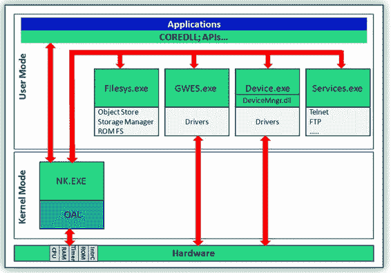
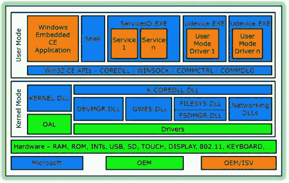

# Windows Embedded Compact 设备驱动程序开发基础

如果 Windows Embedded Compact 操作系统只是另一种通用操作系统，那么这本书只会对设备驱动程序开发人员感兴趣。然而，Windows Embedded Compact 绝非通用操作系统。它是一种嵌入式硬实时操作系统，因此开发时间关键型软件的应用程序开发人员必须了解如何访问 I/O 硬件。理解内核模式设备驱动程序并开发与之交互的用户模式，对应用程序开发人员同样有益。

理解 Windows Embedded Compact 7 的新型筛选器驱动程序模型，可以帮助应用程序开发人员将输入数据筛选算法（例如从有限脉冲响应到快速傅里叶变换）的代码从用户模式进程移动到内核，以获得更好的性能和模块化。

本书不是 Windows Embedded Compact 的入门介绍，也不是介绍如何创建基于 Windows Embedded Compact 7 的操作系统映像。它假定读者已经知道如何执行这些任务。因此，在讨论 `Platform Builder` 和内核调试器技术时，本书仅浅尝辄止。

在书的末尾有一个参考书目列表，按主题分类，以帮助读者找到关于可能需要进一步澄清的主题的更多信息，例如 `JTAG` 和相关的“扫描链”。

[www.it-ebooks.info](http://www.it-ebooks.info/)

### 引言

### 本书面向的读者

本书致力于设备驱动程序的开发，因此面向 Windows Embedded Compact 7 及先前版本 Windows CE 的资深开发人员。本书不是 Windows Embedded Compact 的入门介绍，也不是介绍如何创建基于 Windows Embedded Compact 7 的操作系统映像。它假定读者已经知道如何执行这些任务。因此，在讨论 `Platform Builder` 和内核调试器技术时，本书仅浅尝辄止。

[www.it-ebooks.info](http://www.it-ebooks.info/)

## 第 1 章：Windows Embedded Compact 设备驱动程序开发基础

任何关于设备驱动程序的讨论都应提供一些关于设备驱动程序是什么以及我们为什么需要它们的视角。实际上，设备驱动程序是一个可执行的软件片段，专门用于访问特定的外围硬件设备，以控制它并执行输入/输出 (I/O) 操作。

打个比方，你可以将设备驱动程序视为操作系统软件与其使用的硬件之间的协调者。要理解这个类比，我们需要看看像 Windows Embedded Compact 这样的多任务操作系统如何处理外围硬件设备，以便为其更高级别的应用程序和进程提供统一的通用访问方法。

本章内容：

- 嵌入式操作系统架构
- Windows CE 系统架构与 I/O 处理

### 嵌入式操作系统架构

嵌入式操作系统架构的演进催生了对设备驱动程序的需求。

如果你回顾 30-40 年前 4 位微处理器出现的时候，这一点就会变得更加清晰。那时，嵌入式操作系统是简单的控制循环，不包含任何设备驱动程序，然而中央处理器 (CPU) 稳步发展到今天的 32 位甚至 64 位 CPU。随着高级处理器的出现，带来了多任务处理能力，而多任务处理又带来了集中式硬件控制的需求，以避免数据冲突和混乱。如果没有集中式控制，就很难在多任务操作系统上的各种并发任务之间同步硬件访问。

*A. Kcholi，Pro Windows Embedded Compact 7*  
© Abraham Kcholi 2011

[www.it-ebooks.info](http://www.it-ebooks.info/)

本质上，有两种方法可以实现集中式硬件控制：要么操作系统一次只允许一个应用程序独占硬件访问，要么为其所有应用程序和进程提供硬件访问。这两种方法都可以依赖设备驱动程序来建立单一的硬件控制点，但这些设备驱动程序的具体实现方式以及硬件访问方式在很大程度上取决于操作系统架构本身及其设备驱动程序模型。

对于嵌入式设备驱动程序开发人员来说，两种最相关的商业操作系统架构是：

- **微内核架构** – 在此架构中，设备驱动程序在用户模式下运行，因此可以将 I/O 处理例程直接嵌入到用户模式应用程序中。然而，这意味着与其他用户模式应用程序共享同一外围 I/O 设备需要一种复杂的机制来同步对该硬件的访问。
- **单体内核架构** – 在此架构中，直接访问 I/O 硬件的设备驱动程序在内核模式下运行，因此用户模式应用程序必须使用设备驱动程序来访问硬件设备。设备驱动程序实现可以允许多个用户模式进程使用同一设备驱动程序来共享对 I/O 硬件的访问。

#### 微内核架构

在微内核架构中，内核进程是唯一在具有多个特权级别的 CPU 所提供的最高特权级别上执行的进程。在这个通常被称为内核模式的特权级别下，代码可以访问内核地址空间，并实现低级别的地址空间管理、线程管理和进程间通信。所有其他操作系统服务，如文件系统、设备驱动程序、协议栈和用户界面代码，都在用户模式下运行。

用户模式意味着用户模式线程只能访问用户模式地址空间。用户模式线程不能执行任何内核模式调用或访问内核模式地址。系统服务必须通过进程间通信机制与内核通信。

##### 微内核架构与 Windows CE

Windows CE 直到并包括 5.0 版本都是基于微内核架构的。图 1-1 显示了 Windows CE 5.0 微内核架构。该图中特别需要注意的是，设备驱动程序宿主（即 `GWES.exe` 和 `Device.exe`）是用户模式进程。因此，所有设备驱动程序都在用户模式下运行。

[www.it-ebooks.info](http://www.it-ebooks.info/)

*图 1-1. Windows CE 5.0 的微内核架构*

##### 微内核架构与时间关键型系统

在时间关键型系统中，有时值得将直接访问外围设备 I/O 的代码直接实现在应用程序中。这种方法为时间关键型系统提供了性能提升，因为 I/O 由应用程序进程直接处理。然而，这种做法应仅限于由一个进程独占访问且不与其他进程共享的外围 I/O 设备。还需要指出的是，这项技术对 Windows CE 开发人员不再有效，因为最新版本不再依赖微内核架构。

#### 单体内核架构

在单体内核架构中，内核仍然是唯一在具有多个特权级别的 CPU 所提供的最高特权级别上执行的进程。然而，那些在微内核架构中作为用户模式进程实现的系统服务，现在作为动态链接库 (DLL) 移入了单体内核。换句话说，系统服务现在在内核进程内运行，这意味着大多数设备驱动程序现在在内核模式下运行，因为设备驱动程序服务器现在是内核的一部分。

[www.it-ebooks.info](http://www.it-ebooks.info/)

