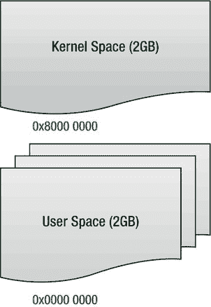
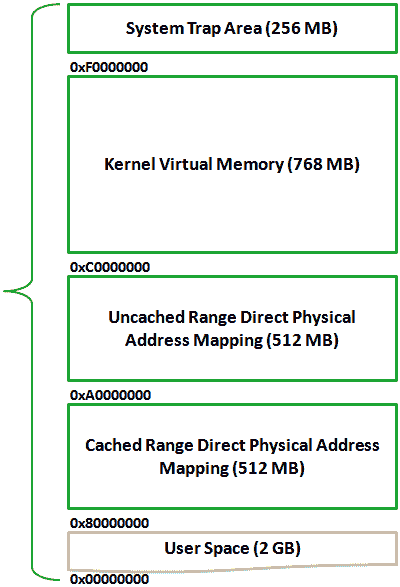
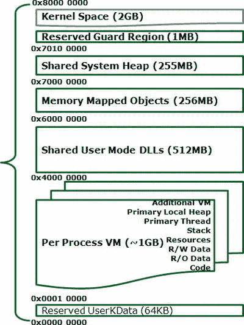

# Windows Embedded Compact 7 内存架构  

Windows CE 6.0 和 Windows Embedded Compact 7 采用一种虚拟内存模型，该模型将地址空间划分为内核和用户模式进程的独立区域（见图 1-4）。这种虚拟内存模型主要为内核以及一个进程免受其他进程干扰提供保护。这一点与通用操作系统并无不同。然而，与通用操作系统不同的是，Windows CE 6.0 和 Windows Embedded Compact 7 的虚拟内存模型不提供用于交换内存页面的后备存储。  

图 1-4 展示了内核和应用程序的两个独立虚拟内存区域及其起始地址的总体视图。  

[www.it-ebooks.info](http://www.it-ebooks.info/)  

  

第一章 ■ Windows Embedded Compact 设备驱动程序开发基础  

*图 1-4. Windows CE 6.0 和 Windows Embedded Compact 7 的虚拟内存模型*  

## 内核空间虚拟内存  

Windows CE 将内核虚拟内存空间划分为多个独立区域。图 1-5 展示了内核虚拟内存空间的结构。Windows Embedded Compact 7 的新增功能是能够寻址超过 512 MB、高达 3 GB 的物理 RAM。但是，这需要 OEM 通过在 OAL 中实现此支持来启用。OEM 必须在`OEMRamTable`结构内描述扩展 RAM 区域，该结构定义了任何硬件平台可用的额外物理 RAM。OEM 需要提供`OEMRamTable`函数来访问`OEMRamTable`结构。  

为了使`OEMRamTable`对内核和内核独立传输层 (KITL) 可用，OEM 必须将`OEMGLOBAL`的`pfnGetOEMRamTable`成员设置为指向`OEMGetOEMRamTable`函数。  

[www.it-ebooks.info](http://www.it-ebooks.info/)  

  

第一章 ■ Windows Embedded Compact 设备驱动程序开发基础  

*图 1-5. 内核空间虚拟内存结构*  

表 1-1 总结了内核空间虚拟内存中的区域并描述了它们的用途。  

*表 1-1. 内核空间虚拟内存区域*  

| 起始地址 | 结束地址 | 名称 | 描述 |
|---------------|-------------|------|-------------|
| `xF000 0000` | `xFFFF FFFF` | 系统陷阱区域 | CPU 特定的 VM 系统调用陷阱区域 |
| `xC000 0000` | `xEFFF FFFF` | 内核 VM | 内核的虚拟内存，CPU 特定。用于实现地址空间布局随机化 |
| `xA000 0000` | `xBFFF FFFF` | 静态映射非缓存地址空间 | 用于绕过 CPU 缓存访问物理内存。 |
| `x8000 0000` | `x9FFF FFFF` | 静态映射缓存地址空间 | 用于通过 CPU 缓存访问物理内存。 |

[www.it-ebooks.info](http://www.it-ebooks.info/)  

  

第一章 ■ Windows Embedded Compact 设备驱动程序开发基础  

## 用户空间虚拟内存  

Windows Embedded Compact 将用户虚拟内存空间划分为两个主要区域，分别用于用户进程、共享 DLL 和内存映射文件。图 1-6 展示了用户虚拟内存地址空间的示意结构。  

*图 1-6. 用户空间虚拟内存结构*  

表 1-2 总结了用户空间虚拟内存中的区域并描述了它们的用途。  

[www.it-ebooks.info](http://www.it-ebooks.info/)  

第一章 ■ Windows Embedded Compact 设备驱动程序开发基础  

*表 1-2. 用户空间虚拟内存区域*  

| 起始地址 | 结束地址 | 名称 | 描述 |
|---------------|-------------|------|-------------|
| `x7FF0 0000` | `x7FFF FFFF` | 保留保护区域 | 用户空间和内核空间之间的缓冲区。 |
| `x7000 0000` | `x7FEF FFFF` | 共享系统堆 | 内核与进程之间的共享堆。 |
| `x60000000` | `x6FFFFFFF` | 内存映射对象 | 用于进程间通信的 RAM 支持映射文件，期望所有进程在同一虚拟地址映射视图。这是 Windows CE 共享内存空间。 |
| `x4000 0000` | `x5FFF FFFF` | 共享用户模式 DLL | DLL 从堆栈底部开始加载并向上移动。 |
| `x0001 0000` | `x3FFF FFFF` | 每个进程的 VM | 可执行代码和数据。 |
| `x0000 0000` | `x0001 0000` | 保留用户数据 | 为用户数据分配的块 |

