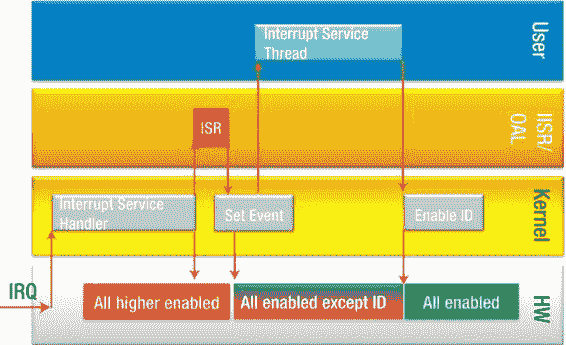
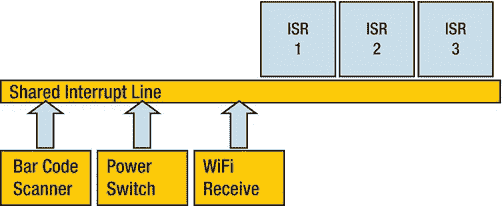

# 输入/输出处理  

Windows Embedded Compact 7 以及 Windows CE 6.0 提供嵌套中断，以提供低中断延迟并确保对最高优先级硬件设备中断的最小延迟。中断模型基于三个元素：  

- **内核中断服务处理程序** – 最多可处理 64 个独立的硬件 IRQ 源。它确定中断优先级，调用挂钩到该中断的 ISR，然后设置与相关中断 ID 关联的事件，以调度关联的 IST。  
- **中断服务例程 (ISR)** – ISR 在内核模式下挂钩到硬件中断请求 (IRQ)，它确认硬件并确定中断 ID。ISR 可以是静态的（即内置于`NK.EXE`中），也可以通过内核调用进行安装（链入）。  
- **中断服务线程 (IST)** – IST 为指定的中断 ID 执行设备特定服务，并且必须向硬件发出中断处理完成的信号。  

## 中断处理  

图 1-7 展示了 Windows Embedded Compact 如何处理中断。  

[www.it-ebooks.info](http://www.it-ebooks.info/)  

  

第一章 ■ Windows Embedded Compact 设备驱动程序开发基础  

*图 1-7. Windows CE 中的中断处理*  

如图 1-7 所示，处理中断的过程分为五个步骤：  

1. 设备触发注册的硬件中断  
2. 内核获取异常，调用关联的中断服务例程 (ISR)  
3. ISR 快速处理待处理的中断  
4. 驱动程序中的 IST 被触发以处理中断  
5. IST 完成处理  

## ISR 和 IST  

ISR 和 IST 协同工作，以执行必要的输入/输出操作，同时最小化对其他处理任务的影响，并防止高优先级中断的丢失和延迟。这种交互主要是协调 ISR 和 IST 之间的线程执行。ISR 和 IST 总是成对工作——ISR 快速识别并屏蔽中断，而 IST 处理大部分工作并尽快重新启用中断。  

ISR 和 IST 之间的交互涉及以下步骤：  

1. IST 创建一个映射到相关`SYSINTR ID`的事件对象。事件对象是一种内核资源，`WaitForSingleObject`函数调用可以在其上等待，并在事件对象变为有信号状态后退出。`SYSINTR ID`标识该事件对象。  
2. ISR 将`SYSINTR ID`返回给内核中断服务处理程序，以便它在准备好时能够触发该事件对象。  

[www.it-ebooks.info](http://www.it-ebooks.info/)  

  

第一章 ■ Windows Embedded Compact 设备驱动程序开发基础  

3. IST 通过`WaitForSingleObject`函数调用阻塞在该事件上，直到内核中断服务处理程序设置相关事件，从而解除 IST 的阻塞。  
4. 解除 IST 阻塞时，如果该 IST 是优先级最高的可运行线程，它将立即被调度运行。  

## 可安装 ISR 与中断共享  

可安装的 ISR 允许多个设备共享中断，并共享单个硬件平台中断请求 (IRQ)。本质上，共享中断触发一条由多个 IRQ 共享的中断线。为了操作系统能够处理这些 IRQ，必须链入多个 ISR 来处理共享中断。每个 ISR 依次确定它是否拥有该中断，如果是，则返回相关的`SYSINTR ID`以解除其关联 IST 的阻塞。  

图 1-8 说明了可安装的 ISR 如何共享一个中断以支持多个外围设备。  

*图 1-8. 使用链入法实现共享中断*

