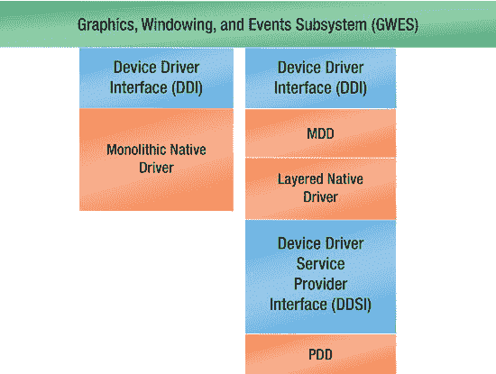
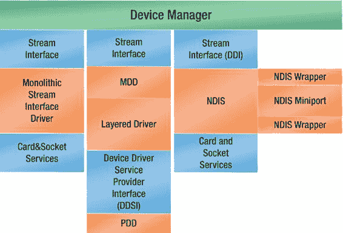
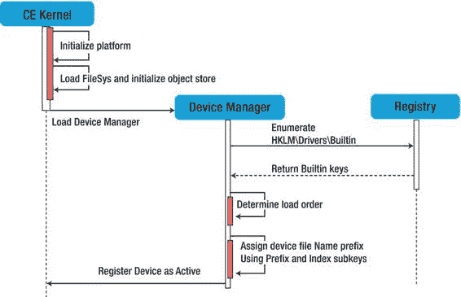

# 可安装的 ISR

可安装的 ISR 实现在 DLL 中。设备驱动程序可以通过 `LoadIntChainHandler` 函数在运行时将 ISR 加载到内核中。中断处理程序则通过 `FreeIntChainHandler` 函数卸载。第 8 章“*设备驱动程序的 I/O 与中断*”提供了关于在设备驱动程序中如何使用 `LoadIntChainHandler` 和 `FreeIntChainHandler` 的更多详细信息。

### Windows Embedded Compact 设备驱动程序模型

Windows Embedded Compact 7 实现了一种区分本机驱动程序和流接口设备驱动程序的简单设备驱动程序模型。

#### 本机 Windows CE 设备驱动程序

本机驱动程序对应于加载到图形、窗口和事件系统 (GWES) 中的用户输入设备驱动程序和显示设备驱动程序。另一方面，流接口设备驱动程序遵循流接口，以便另一个内核服务器——设备管理器能够管理这些驱动程序。

图 1-9 展示了本机设备驱动程序模型接口。

[www.it-ebooks.info](http://www.it-ebooks.info/)

*图 1-9. 本机设备驱动程序模型接口*

#### Windows Embedded Compact 中的流接口设备驱动程序

*流设备驱动程序*这个术语可能会引起误解，因为它通常用于处理数据流的外设 I/O 硬件，例如串行端口设备驱动程序。这可能意味着这种类型的设备驱动程序并不适合用于管理数据块（例如存储磁盘）的块设备。然而，Windows Embedded Compact 中的流接口设备驱动程序既可以处理流设备，也可以处理块设备。因此，我强烈建议使用*流接口*设备驱动程序这一术语，这意味着该设备驱动程序必须公开一组定义好的函数，允许应用程序通过文件系统 API 与设备驱动程序通信。

图 1-10 展示了流接口设备驱动程序模型接口。

[www.it-ebooks.info](http://www.it-ebooks.info/)

*图 1-10. 流接口设备驱动程序模型接口*

设备管理器加载内核模式的流设备驱动程序，并在加载期间管理这些驱动程序及其接口。当设备管理器加载时，它首先加载 I/O 资源管理器，以从注册表中枚举可用资源列表。此外，设备管理器会跟踪驱动程序所通告的接口，并支持基于全局唯一标识符 (GUID) 搜索驱动程序。本章后面的“加载和卸载设备驱动程序”一节提供了关于流接口设备驱动程序加载过程的更多详细信息。

### 单体驱动与分层驱动

如图 1-9 和 1-10 所示，本机驱动程序和流驱动程序都可以采用单体设计或分层设计。单体驱动程序依赖于单个 DLL 来实现操作系统和应用程序的接口以及硬件逻辑，而分层驱动程序架构则基于模型设备驱动程序 (MDD) 和平台设备驱动程序 (PDD)。

单体设备驱动程序和分层设备驱动程序具有以下优点和缺点：

- **单体设备驱动程序** – 如果出于性能考虑希望避免 MDD 和 PDD 之间的额外函数调用，单体驱动程序可能是不错的选择。
- **分层设备驱动程序** – 基于 MDD 和 PDD 的分层架构具有优势，因为它有利于代码复用和驱动程序更新的开发。因此，它是许多设备驱动程序开发人员的首选。

### 内核模式或用户模式下的 Windows Embedded Compact 设备驱动程序

由于 Windows Embedded Compact 现在是单内核架构，设备驱动程序现在既可以在内核模式下运行，也可以在用户模式下运行。在内核模式下，设备驱动程序可以访问内核资源。这带来了安全风险，并催生了一种新型的设备驱动程序——用户模式设备驱动程序。

内核模式设备驱动程序由设备管理器服务器库 `DEVMGR.DLL` 管理，而用户模式设备驱动程序则各自驻留在一个名为 `UDEVICE.EXE` 的用户模式进程中，但仍由设备管理器管理。

### 内核模式设备驱动程序

在 Windows Embedded Compact 中，内核模式意味着可以访问内核地址空间。但需要注意的是，当用户模式线程进行系统 API 调用时，由于几乎所有的系统 API 都在内核模式下运行的服务器库中实现，因此该用户模式线程是在内核模式下运行的。

这对内核模式设备驱动程序有一定影响。如果内核模式设备驱动程序接收了一个指向用户模式回调函数的指针，在没有适当预防措施的情况下，即使该回调函数在用户模式线程中运行，它也可能访问内核模式的调用和地址。关于适当的预防措施将在本书后面讨论。

从实现角度来看，内核模式设备驱动程序实际上与以前版本的 OS 中的实现方式相同，但用户模式设备驱动程序无法访问内核数据结构或资源，它们被托管在特殊的用户模式进程中，该进程会创建并与一个内核反射器服务通信，以便为用户模式设备驱动程序提供一种安全的方式来执行其任务。

内核模式设备驱动程序根据其接口，由设备管理器或 GWES 加载到内核中。流设备驱动程序由设备管理器 `DEVMGR.DLL` 加载并管理。本机设备驱动程序加载到图形、窗口和事件子系统 `GWES.DLL` 中。内核模式设备驱动程序可以完全访问内核数据结构和内核内存。内核模式设备驱动程序链接到 `KCOREDLL`，这是 `COREDLL` 的内核版本，用于提供对 API 的访问。

### 用户模式设备驱动程序

用户模式意味着设备驱动程序只能访问用户模式地址空间，并且这意味着设备驱动程序不能直接执行任何内核模式调用或访问内核模式内存。

用户模式设备驱动程序由设备管理器管理，但托管在特殊的用户模式进程 `udevice.exe` 中。用户模式设备驱动程序没有内核特权，无法访问内核结构或内存，也不能调用仅限内核的 API，例如 `VirtualCopyEx`。用户模式设备驱动程序提高了稳定性，因为用户模式设备驱动程序彼此隔离，并且没有访问内核的特权。用户模式设备驱动程序提供了更高的安全性，因为受损的用户模式设备驱动程序无法使系统崩溃，因为用户模式特权限制了受损驱动程序的能力。用户模式设备驱动程序提供了更好的可恢复性，因此操作系统可以在驱动程序崩溃后恢复，并且可以在不重启的情况下重新启动驱动程序。

### 加载和卸载设备驱动程序

本机驱动程序和流驱动程序仅在它们公开的 API 方面有所不同。您可以在系统启动时或按需加载这两种类型的驱动程序。然而，Windows Embedded Compact 加载设备驱动程序的具体方式取决于驱动程序类型。

#### 加载流接口设备驱动程序

Device Manager 加载内核模式流设备驱动程序，并在加载后对其进行管理并管理其接口。`Device Manager`是一个系统服务器动态链接库，名为（`DEVMGR.DLL`），由内核在启动时加载。加载后，它会持续运行，加载内核模式流设备驱动程序，并在加载后对其进行管理并管理其接口。当`Device Manager`加载时，它首先加载`I/O Resource Manager`，以从注册表中枚举可用资源列表。此外，`Device Manager`会跟踪驱动程序公布的接口，并支持基于全局唯一标识符（`GUID`）搜索驱动程序。`IClass`接口可以将接口`GUID`与驱动程序的旧名称、其`$device`名称或其`$bus`名称相关联。例如，`COM1:`、`$device\com1`或`$bus\pci_0_3_0`。

#### Device Manager 架构

`Device Manager`搜索`HKLM\Drivers\Drivers\BuiltIn`注册表项，以确定开始驱动程序加载过程的项。`Device Manager`调用`ActivateDeviceEx`API 来加载由`Drivers\BuiltIn`值指定的项中找到的`Dll`子项值所指定的驱动程序。`Dll`子项值默认为`BusEnum.dll`，也称为总线枚举器。加载`BusEnum.dll`会导致加载所有设备驱动程序。由`ActivateDeviceEx`加载的设备可以从其`Active`注册表项读取其激活句柄。`Device Manager`控制注册表中的`Active`项。只有`Device Manager`才能对`Active`项进行读取或写入访问。`Device Manager`使用`HKLM\Drivers`注册表项的`Active`和`BuiltIn`子项。设备驱动程序绝不应通过编程方式修改`Device Manager`放置在该注册表部分中的值。图 1-11 描述了在启动时初始化设备驱动程序的过程。

[www.it-ebooks.info](http://www.it-ebooks.info/)

**图 1-11\. 系统启动期间的设备驱动程序初始化**

#### Device Manager 注册表项

`HKLM\Drivers\Active`注册表项包含`Device Manager`已加载的当前活动设备驱动程序。设备驱动程序例程不应修改`Active`项，也不应依赖`Active`项中的任何特定值。当加载驱动程序时，`Device Manager`通过`dwContext`参数将驱动程序`Active`项的路径传递给初始化例程。初始化例程可以在`Active`项中读取和创建新值；但是，在初始化函数返回后，不允许访问该项。

#### 设备文件名称

应用程序可以通过文件系统函数访问设备驱动程序，例如使用`CreateFile`获取设备驱动程序的句柄，并使用此句柄执行 I/O 请求，如读取、写入或通过 I/O 控制请求执行更复杂的 I/O 操作。在调用诸如`CreateFile`之类的文件系统 API 时，其请求的第一个参数是文件名。此时，会使用设备驱动程序的命名空间来代替文件名。设备驱动程序的命名空间可以是以下格式之一：

-   三位字母前缀，后跟一个 0 到 9 之间的数字，再接一个冒号。
    例如 `"TST0:"`
-   `$bus`挂载点，后跟总线名称、总线编号、设备编号和功能号。
    例如 `"$bus\PCMCIA_0_0_0"`
-   `$device`挂载点，后跟代表设备的三位字母前缀，再接一个数字，这允许同一设备前缀有超过 10 个设备实例。
    例如 `"$device\TST0"`

#### 设备文件名称前缀

前缀由三个大写字母组成，用于标识对应于特定流接口的设备文件名。该前缀存储在名为`Prefix`的注册表值中。在实现流接口时，通常会指定三位字母前缀。第 3 章对此主题进行了深入讨论。

首先，前缀标识了所有可以访问流接口驱动程序的可能的设备文件名。

第二，前缀告诉操作系统在流接口 DLL 中应期望哪些入口点文件名。例如，要为 PC Card 寻呼机实现设备驱动程序，使用`PGR`表示`PAGER`作为三位字母前缀，这反过来会规定入口点名称，例如`PGR_Init`、`PGR_IOControl`等。

#### 设备文件名称索引

索引用于区分流接口管理的具有相同前缀的设备。索引是紧跟在前缀后面的数字。默认情况下，`Device Manager`从 1 到 9 进行逻辑索引，其中`1`对应第一个设备文件名。如果需要第十个设备文件名，则使用索引`0`。

如果设备文件名的起始索引需要不是`1`，则在注册表项中名为`Index`的注册表值中指定起始索引。当流接口驱动程序服务于使用通用前缀（如`COM`）的设备时，这通常是必要的。例如，`"COM1:"`、`"COM2:"`和`"COM3:"`通常对应于内置串行端口硬件。然而，如果驱动程序用于串行设备（如分组无线调制解调器），它应该显示为`COM`端口，因为调制解调器软件通常假定调制解调器连接到`COM`端口。因此，指定`Index`值为`4`以将此分组无线调制解调器设备与内置串行设备区分开。

`Device Manager`只能注册一个设备文件名，因此如果指定了`Index`值，而不是让`Device Manager`分配索引，则该设备驱动程序仅支持一个设备。

#### I/O 资源管理器

当操作系统启动时，总线枚举器枚举注册表并根据注册表信息加载所有内置设备。然后，`I/O Resource Manager`跟踪系统中可用资源的当前状态，并管理总线驱动程序的所有进一步 I/O 资源请求和分配。因此，当总线驱动程序为可安装设备或其他类型的设备加载客户端驱动程序时，应向`I/O Resource Manager`请求 I/O 资源。

`I/O Resource Manager`是`Device Manager`的一个固有部分。`I/O Resource Manager`跟踪在加载任何设备之前从注册表初始化的可用系统资源。跟踪这些资源可防止在多个设备驱动程序尝试使用相同资源时发生意外冲突。

`OAL`和注册表用于预分配总线驱动程序请求的`IRQ`和 I/O 空间资源。但是，`I/O Resource Manager`并不局限于管理 I/O 和 IRQ 空间。当总线驱动程序（如`PCI`总线驱动程序）加载其在注册表中找到的设备的设备驱动程序时，会从`I/O Resource Manager`请求`IRQ`和 I/O 空间资源。同样的情况也适用于`PC Card`总线驱动程序和`PC Card`客户端驱动程序所需的 I/O 资源。当用户从系统中移除`PC Card`时，`PC Card`总线驱动程序会释放这些资源。

每个硬件平台都有独特的`IRQ`和可用的 I/O 空间。内置和固定设备的`IRQ`在`OAL`中映射到中断标识符（`SYSINTRs`）。应将这些内置和固定设备的`IRQ`从可用资源中排除。与`PCI`总线一起使用的`IRQ`通常是共享的。

`IRQ`和 I/O 空间资源在`HKLM\Drivers\Resources\IRQ`和`HKLM\Drivers\Resources\IO`注册表项中预先定义，这些注册表项提供了`I/O Resource Manager`的初始状态。

### 章节摘要

### 理解设备驱动程序的操作系统架构

理解操作系统架构对于编写健壮的设备驱动程序至关重要。内存架构决定了内存如何在内核模式组件（设备驱动程序实际上就属于此类）与用户模式进程之间进行分配和传递。理解`Windows Embedded Compact 7`所采用的虚拟内存方案有助于设计出行为规范的设备驱动程序。`设备管理器`是操作系统中负责加载、跟踪流式设备驱动程序并与之交互的组件，而流式设备驱动程序正是本书的主要主题。

### 开发工具

“开发工具”这一术语源自破产法，用于界定一个人通常为谋生所使用哪些资产。作为设备驱动程序开发者为生，我们的“开发工具”包括`VS2008`、`平台构建器`（`PB`）以及第三方工具。

支持智能设备的`Visual Studio`仅允许你为设备开发应用程序。对于`Windows Embedded Compact 7`（以及之前的版本）的设备驱动程序开发来说，`平台构建器`是必不可少的。`平台构建器`为你提供了设备驱动程序开发套件（`DDK`）以及构建用于测试设备驱动程序的操作系统映像的能力。此外，`平台构建器`还提供了为`Windows Embedded Compact 7`（`CE`）构建设备驱动程序所需的构建工具，例如设置构建环境变量，以及调试和测试工具，如内核调试器工具和一套全面的远程工具。

`Visual Studio`和`平台构建器`为开发提供了坚实的基础，但仍有第三方工具可用来加速设备驱动程序的创建过程。设备驱动程序开发者会发现特别有用的两个工具是`TRACE32` JTAG 调试器和`Windows CE 设备驱动程序向导`。本章概述了这些工具，后续章节将深入讨论并提供如何使用这些工具的示例。

本章内容：

- `Visual Studio 2008`
- `平台构建器`
- `Windows CE 构建系统`
- `设备驱动程序开发套件`
- `TRACE32`
- `Windows CE 设备驱动程序向导`

##### Visual Studio 2008

实际上，`Visual Studio 2008`是`平台构建器 2008` IDE（一个`Visual Studio 2008`插件向导）的主机，这意味着你必须在安装`平台构建器 2008`之前先安装`Visual Studio 2008`。`Visual Studio 2008`与`平台构建器 2008`共同为你提供了一个全面的环境，用于开发操作系统映像、子项目、将操作系统映像下载到目标设备以及进行调试，所有这些功能都集成在一个开发工具中。对于`Windows Embedded Compact`开发人员和此操作系统的设备驱动程序开发者而言，他们更感兴趣的是将`平台构建器`集成到`Visual Studio 2008`中，而不是将`Visual Studio`作为通用的开发工具。

#### Visual Studio 2008 与平台构建器 IDE

用于`Windows Embedded Compact 7`的`平台构建器` IDE 已集成到`Visual Studio 2008`中。它为用户提供了一个图形用户界面，用于创建操作系统设计、连接目标设备并下载操作系统映像、为内核调试器提供图形界面、编辑源代码、构建子项目和`BSP`组件，以及更多功能。构建结果与使用命令行工具进行所有开发工作的结果相同；此外，结果是可互换的，这意味着你可以交替使用命令行开发和 IDE 开发。

安装`平台构建器`后，`Visual Studio`会具有特定的`Windows Embedded Compact`相关 UI 组件，包括一个名为“目标”的设备相关菜单、特定于操作系统设计的“构建”菜单选项，以及三个新的“工具”子菜单：“平台构建器”、“Windows Embedded Silverlight 工具”和“远程工具”。然而，主要功能是`平台构建器`向导，以及在“其他语言 ➤ Visual C#”项目类型下的“远程工具框架”向导。图 2-1 展示了“项目类型”树中的`平台构建器`向导。

*图 2-1. 使用平台构建器 IDE 向导创建操作系统设计*

同时，新增了一个名为“目录项视图”的窗口，可以在“视图 ➤ 其他窗口”菜单下找到。操作系统设计向导会要求选择一个构建操作系统设计所基于的`BSP`，并提供一组快速启动的操作系统设计模板供选择。图 2-2 和图 2-3 描述了这些步骤。在创建新的操作系统设计时，选择板级支持包（`BSP`）至关重要；但是，如果后面需要在使用不同架构的另一台设备上运行完全相同的操作系统映像，也可以轻松地向新创建的操作系统设计中添加另一个`BSP`。

*图 2-2. 为新操作系统设计选择 BSP*

创建操作系统设计后，你可以使用“目录项视图”向此操作系统设计添加或移除 OS 组件或`BSP`，如图 2-4 所示。解决方案资源管理器允许访问子项目、`BSP`源文件、Public 和 Private 目录（用于打开项目和源文件），以及在构建中排除或包含组件。图 2-5 显示了解决方案资源管理器。

*图 2-3. 选择快速启动设计模板*

*图 2-4. 目录项视图*

*图 2-5. 解决方案资源管理器*

#### 远程工具

选择智能设备开发选项后随`Visual Studio 2008`一起安装的远程工具主要旨在帮助进行应用程序开发。设备驱动程序开发者感兴趣的主要工具是`远程注册表编辑器`和`堆栈遍历显示器`。以下是`Visual Studio`附带的远程工具列表。

- `远程文件查看器` - 查看和管理目标设备上的文件系统（包括导出和导入）
- `堆栈遍历显示器` - 显示目标设备上运行的每个进程的堆标识符和标志信息
- `远程进程查看器` - 显示目标设备上运行的每个进程的远程信息
- `远程注册表编辑器` - 显示和管理目标设备的注册表
- `远程 Spy` - 显示目标设备上运行的应用程序相关窗口收到的消息
- `远程放大` - 从目标设备捕获位图（`.bmp`）文件格式的屏幕图像

#### 远程工具框架

远程工具框架随`平台构建器 2008`一起安装，是一个开发 SDK，它涵盖设备端和开发工作站插件库，用于创建自定义远程工具和一个用于托管自定义插件的远程工具外壳。开发远程工具包括创建一个设备端控制台应用程序，该应用程序可以向开发工作站上的自定义远程工具推送数据或响应其请求，当然还包括开发自定义远程工具插件。你可以选择使用原生 API 或`.NET`紧凑框架托管 API 来开发设备端应用程序。虽然原生客户端远程工具应用程序非常适合需要实时确定性的设备（因此不支持`.NET`紧凑框架），但托管设备端应用程序具有快速开发的优势。插件端则是使用`.NET`框架开发的。

### 框架及其安装到 Visual Studio 中

远程工具框架向导简化了开发流程，并可安装到 Visual Studio 中。本章后续部分在讨论调试与测试时，将介绍此类自定义远程工具的一个示例。

> **注意**：关于旧版 Windows CE：如果使用 Windows CE 6.0，你需要先安装 Visual Studio 2005，然后再安装 Platform Builder 6.0。在 Windows CE 6.0 之前，Platform Builder IDE 是一个独立工具，无需 Visual Studio。

### Platform Builder

`Platform Builder` 是你用来根据所选硬件开发和构建操作系统设计的工具。一个操作系统设计由开发者从目录中选择并整合到其操作系统中的所有系统组件组成。为此，`Platform Builder` 在其目录结构中包含了所有操作系统组件。

#### Platform Builder 目录树

创建 Windows CE 操作系统映像所需的所有必要文件和工具都收集在安装磁盘上的一个目录层级结构中。对于 Windows CE 7.0，操作系统安装根目录为 `WINCE700`；此目录由构建环境变量 `%_WINCEROOT%` 引用。例如，它通常设置为 `C:\WINCE700`，其中 `C:` 是安装磁盘。

在此文件夹下，你应该能找到以下五个文件夹：

- Platform 目录
- Public 目录
- SDK 目录
- Others 目录
- Private 目录

当首次创建新的操作系统设计时，会创建一个新文件夹：`OSDesigns`。见图 2-6。

*图 2-6. Platform Builder 文件夹层次结构*

与设备驱动程序开发者最相关的 `Platform Builder` 子目录是 `PLATFORM` 和 `PUBLIC` 子目录，因为它们包含设备驱动程序源代码，这些代码分为特定于板的驱动程序、片上系统驱动程序以及通用驱动程序。

- 特定板级支持包的设备驱动程序源代码位于 `%_WINCEROOT%\PLATFORM\%_TGTPLAT%\SRC\DRIVERS` 目录下
- 片上系统设备驱动程序源代码位于 `%_WINCEROOT%\PLATFORM\COMMON\SRC\SOC` 目录下
- SoC 设备驱动程序处理集成在 CPU 芯片上以构成 SoC 的外围 I/O 设备。
- 由 Microsoft 提供的设备驱动程序通用源代码位于 `%_WINCEROOT%\PLATFORM\COMMON\SRC\` 目录下
- 非本地外围设备的通用驱动程序源代码。这些设备驱动程序的源代码是平台无关的代码，不特定于某个硬件平台或 CPU 架构，位于 `%_WINCEROOT%\PUBLIC\COMMON\OAK\DRIVERS` 目录下

#### PLATFORM 目录

此目录是随 Platform Builder 一同安装的板级支持包的根目录。每个 BSP 都位于其自身的目录层次结构中，顶层文件夹的名称反映了其所支持的硬件。`PLATFORM` 目录树中另一个极其重要的子目录是 `COMMON` 子目录，其中包含 OEM 适配层源代码，包括所有 BSP 通用的例程以及特定于某些架构的例程。

#### PUBLIC 目录

此目录包含一组平台无关的组件和配置。`PUBLIC` 目录中包含模块和组件的子目录与 Windows CE 7.0 模块同名。它包含三种类型的子目录：

- 模块和组件子目录
- 参考配置子目录
- 自定义配置子目录

### Platform Builder IDE

`Platform Builder` 集成开发环境是 Visual Studio 2008 中包含的一个图形用户界面，由一组集成的工具、上下文菜单、工具栏和快捷键组成，使你能够创建、测试和优化操作系统设计以及目录项。

### 平台构建器向导

`平台构建器`在 IDE 中提供了一组向导，使您能够创建操作系统设计和子项目。

#### Windows CE 操作系统设计向导

`Windows CE 操作系统设计向导`是 `Visual Studio 2008` 中的一个附加向导。它提供了一组模板，可用于快速创建和配置操作系统设计。`操作系统设计向导`会引导您首先为操作系统设计选择一个 BSP，然后要求您选择一个设计模板，最后通过逐步操作一组组件完成整个过程，您可以添加或删除选定的目录项，包括各种通信组件。

**注意** 设计模板：设计模板提供了如何为特定设备类别开发操作系统的示例，有助于减少整体操作系统开发时间。这些 XML 文件包含了操作系统的基本构建块，以及构成设备类别的各种组件，例如工业控制器。

#### Windows CE 子项目向导

`Windows CE 子项目向导`将引导您完成创建子项目的整个过程，您可以使用子项目基于操作系统设计开发项目，包括应用程序、动态链接库 (DLL)、静态库和 `TUX` 测试框架。生成的子项目会添加到当前活动的操作系统设计中。由于子项目依赖于包含它们的特定操作系统设计，因此它们仅在该特定操作系统设计的上下文中构建。

### 平台构建器远程工具

随 `平台构建器` 安装的远程工具是一组宝贵的软件工具，可帮助您作为设备驱动程序开发者连接并远程监控信息以及测试您的作品。

这些工具分为两组：用于调试和测试的工具，以及用于信息管理的工具。在第二组中，最相关的工具是`远程注册表编辑器`。检查注册表中的活动设备驱动程序节点是确定您的设备驱动程序已由`设备管理器`加载的最可靠方法。在第一组中，最有用的工具是`远程内核跟踪器`和`远程调用探查器`。前者有助于跟踪中断，并同步设备的中断触发和线程执行，后者通过检测编码瓶颈帮助您创建高效代码。

### 平台构建器注册表编辑器

由于注册表编辑器具有`RegEdit`视图和源视图，因此它对您作为设备驱动程序开发者非常有价值。`RegEdit`视图提供了一个精确的可视化视图，显示设备驱动程序注册表项所在的位置，并能够编辑单个键值或添加新键。图 2-7 显示了 `Visual Studio 2008` 中注册表编辑器的`RegEdit`视图。

*图 2-7. 注册表编辑器 RegEdit 视图中设备驱动程序注册表项的示例*

#### 构建系统

构建软件的过程就是将源代码转换为二进制可执行文件，以便该可执行文件运行并执行其功能。为了完成这些任务，提供了一组工具、可执行文件和脚本，以使用一个命令执行自动构建。理解构建过程对于开发 `Windows CE` 设备驱动程序至关重要。

#### 概述

在 `Windows CE` 中，构建系统过程涉及将操作系统组件、设备驱动程序、应用程序、库以及配置文件（例如注册表项等）构建到单个操作系统映像中。`Windows CE` 构建系统由一组工具组成，例如特定架构的编译器、`make` 工具以及其他命令行可执行文件和批处理文件，用于自动化构建过程。

构建过程分为四个阶段：

- **编译阶段** – 编译和链接源代码和资源文件，为所选区域生成可执行文件、库和二进制资源文件。由于 Microsoft 已经提供了二进制文件，因此很少需要重建操作系统组件。
- **Sysgen 阶段** – 根据操作系统设计中包含的目录项和依赖关系树，设置或清除 `SYSGEN` 变量。然后，它会过滤头文件，为操作系统设计中定义的软件开发工具包 (SDK) 创建导入库，为操作系统设计创建一组运行时映像配置文件，并构建特定的 BSP。
- **发布副本阶段** – 创建运行时映像所需的所有文件都被复制到操作系统设计的发布目录中。
- **生成运行时映像阶段** – 特定于项目的文件（例如 `Project.bib` 和 `Project.reg`）被复制到发布目录中，并根据 `.reg` 和 `.bib` 文件中指定的环境变量在发布目录中创建最终的运行时映像。配置文件会被合并，例如注册表配置文件被合并到 `reginit.ini` 中以编译到映像注册表文件中。操作系统映像本地化在此映像创建的最后阶段执行。

#### 构建工具

`Windows CE 5.0` 的发布引入了 `平台构建器` IDE，它仅仅是构成构建系统的命令行工具之上的一个图形用户界面薄层，这意味着命令行构建和 IDE 构建是可以互换的。构建工具是一组协同工作的命令行可执行文件和批处理文件，用于构建操作系统映像。请参考图 2-8，该图展示了四个阶段各自对应的构建工具。引入了一种配色方案，以区分用蓝色着色的可执行工具和用橄榄色着色的批处理工具。理解构建工具对于简化 `Windows CE` 设备驱动程序的开发过程大有裨益。

*图 2-8. 操作系统映像构建阶段及相应的构建工具*

#### 命令行构建

命令行构建使用 `build demo` 工具来启动整个构建过程。`Build demo` 工具是一个批处理文件，它调用主构建工具 `cebuild.bat`，当前两个阶段完成后，它会调用 `buildrel.bat` 和 `makeimage.exe` 来完成构建。您应该知道，`平台构建器` IDE 会根据用户选择的菜单项指定的参数来调用 `builddemo.bat`。`平台构建器` 文档详细介绍了所有可能的选项。您应该查看 `builddemo.bat`，因为它自带了良好的注释文档。

#### 理解 SYSGEN 过程

顾名思义，`SYSGEN` 阶段是一个系统生成过程，在此过程中对组件进行过滤，并构建其中一些组件，以形成构成所选操作系统设计映像的组件集合。`SYSGEN.BAT` 这个工具实际上是一个位于 `BAT` 文件“代码”中的可扩展组件依赖关系数据库。它设置 `xxx_MODULES` 和 `yyy_COMPONENTS` 变量用于过滤。在每个 `_DEPTREES` 文件夹中的 `CESYSGEN` 文件夹内，对 `MAKEFILE` 运行 `NMAKE.EXE`，组件在此处链接到目标。

#### SYSGEN 过滤

过滤使用 `@CESYSGEN` 注释标签，根据组件设置过滤文件，并在 `%__PROJROOT%\CESYSGEN\MAKEFILE` 内部运行。过滤会根据 `xxx_MODULES` 和 `yyy_COMPONENTS` 变量创建标签变量，并生成 `CECONFIG.H` 供 C 预处理器使用。

例如：

`EXAMPLE_MODULES=ExmpleDLL`

`EXAMPLEDLL_COMPONENTS=Exmpl1 Exmpl2`

生成：

`EXAMPLE_MODULES_EXAMPLEDLL`

`EXAMPLEDLL_EXMPL1`

`EXAMPLEDLL_EXMPL2`

#### 环境变量和 DEPTREES

