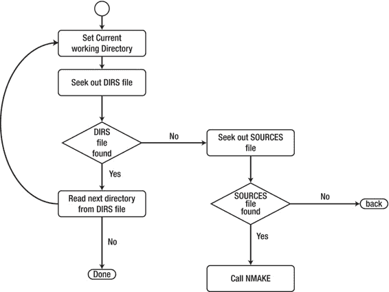
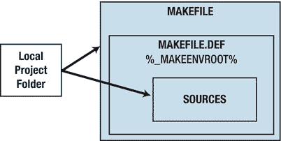
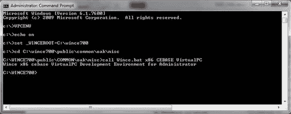

# 环境变量包含操作系统设计某个方面的信息，不应与系统变量（System Variables）混淆，后者有助于筛选操作系统设计的选定功能。`_DEPTREES`

这是一个环境变量，用于控制系统前生成（pre-sysgen）阶段，并描述操作系统依赖树。它被执行前系统生成（pre-sysgen）构建和系统生成（sysgen）的 `cebuild.bat` 所使用。`cebuild.bat` 利用 `_DEPTREES` 环境变量来确定要构建/系统生成的内容。你可以将自己的文件夹层次结构添加到 `DEPTREES`

环境变量中，例如，以下是 `PRIVATE` 文件夹被添加到 `_DEPTREES` 中的方式：

```
:AddDepTree
if EXIST %_WINCEROOT%\private\%1 set _DEPTREES=%_DEPTREES% %1
goto :EOF
```

环境变量有四种分组：

- **BSP 环境变量** – 定义板级支持包提供的可选支持级别。
- **BSP_NO 环境变量** – 定义硬件平台提供的可选支持级别。
- **IMG 环境变量** – 从操作系统设计中移除模块，但保留设计中相关的注册表项。
- **其他环境变量**

### 主构建工具

主构建工具（`Cebuild.bat`）负责构建模块和功能，并为整个操作系统设计生成源代码。`Cebuild.bat` 执行以下步骤来创建运行时映像：对于 `_DEPTREES` 环境变量指定的每个项目，`Cebuild.bat` 在 `%_WINCEROOT%\Public\Tree` 目录下运行 `Build.exe`，其中 Tree 是由 `_DEPTREES` 指定的项目。`Build.exe` 编译项目目录中的源代码。

[www.it-ebooks.info](http://www.it-ebooks.info/)

第 2 章 ■ 工具概览

对于 `_DEPTREES` 环境变量指定的每个项目，`Cebuild.bat` 运行 `Sysgen.bat –p Tree`，其中 Tree 是由 `_DEPTREES` 指定的项目。`Sysgen.bat` 构建在 `Cesysgen.bat` 中选定的项目模块。`Sysgen.bat` 在 `%_PROJECTROOT%\Oak\Misc` 目录中构建这些模块。

`Cebuild.bat` 在 `%_PLATFORMROOT%\%_TGTPLAT%` 目录下运行 `Build.exe`，以编译硬件平台的代码。

#### 如何准备开发环境

Windows Embedded Compact 构建环境工具 `WINCE.BAT` 是用于准备构建环境的工具。它使用三个输入参数来设置环境变量。第一个参数指示构建的 CPU 架构并设置 `%_TGTCPU%` 环境变量；第二个参数指示构建的操作系统设计目录名称并设置 `%_TGTPROJ%` 环境变量；最后一个参数指示构建所用的 BSP，用于设置 `%_TGTPLAT%` 环境变量。

准备好构建环境后，你就可以开始构建设备驱动程序了。你将使用构建工具 `Build.exe` 进行实际构建。

#### Build.exe

对于设备驱动程序开发者来说，构建过程中最重要的步骤是编译设备驱动程序的源代码。`Build.exe` 是执行此任务的工具。`Build.exe` 的活动如图 2-9 及以下步骤所示：

1.  `Build.exe` 在当前目录中查找 DIRS 文件；如果该文件存在，它会指示 `Build.exe` 进入包含源代码或其他 DIRS 文件的子目录。
2.  如果当前目录中没有 DIRS 文件，`Build.exe` 会搜索 SOURCES 文件。
3.  如果 `Build.exe` 在当前目录中找到 SOURCES 文件，它会调用 Microsoft 的 make 工具 `Nmake.exe`，以编译指定的 C/C++ 或汇编源文件，或链接目标模块。

[www.it-ebooks.info](http://www.it-ebooks.info/)



第 2 章 ■ 工具概览

*图 2-9. `Build.exe` 活动流程*

#### DIRS 文件

DIRS 文件是一个文本文件，列出了包含其他 DIRS 或 SOURCES 文件的子目录。以下示例显示了一个 DIRS 文件，其中列出了要为 VirtualPC BSP 构建的设备驱动程序。当 `build.exe` 读取此文件时，它会遍历 ISR_VPCMOUSE、KEYBD、NDIS_DC21X4 和 WAVEDEV2_SB16 目录，查找 SOURCES 文件或其他 DIRS 文件。DIRS 指令决定了构建顺序，因此在以下示例中，`build.exe` 将从 `wavedev2_sb16` 目录开始依次遍历。可以在 DIRS 文件中使用通配符 `*` 来遍历所有子目录，但这样不会保证遍历顺序。

```
DIRS= \
wavedev2_sb16 \
ndis_dc21x4 \
keybd \
isr_vpcmouse \
```

#### SOURCES 文件

SOURCES 文件是一个文本文件，包含了 `build.exe` 和 `NMAKE` 工具所需的组件特定指令。SOURCES 文件被系统级的共享 makefile（名为 `makefile.def`）所包含。

[www.it-ebooks.info](http://www.it-ebooks.info/)



第 2 章 ■ 工具概览

这使组件的 makefile 能够保持相对简单。共享的系统 makefile 通过组件子目录中一行简单的 makefile 来包含。

```
!INCLUDE $(_MAKEENVROOT)\makefile.def
```

`Makefile.def` 为构建的大多数方面提供了默认的 MAKE 规则，并为各种目标类型提供了标准规则，从而减少了每个项目所需的 MAKEFILE 脚本数量。该文件位于 `%_WINCEROOT%\public\common\OAK\misc` 中。以下是一个用于 VirtualPC 鼠标 ISR 的 SOURCES 文件示例，它展示了所涉及的 makefile 宏定义指令，并非复杂案例。例如，`TARGETLIBS` 宏定义指令指定了应链接到目标可执行文件中的额外库文件。Platform Builder 文档是了解 `NMAKE` 工具使用的各种宏定义指令的良好参考。

```
TARGETNAME=isr_vpcmouse
RELEASETYPE=PLATFORM
TARGETTYPE=DYNLINK
DLLENTRY=DllEntry
TARGETLIBS= \
$(_COMMONSDKROOT)\lib\$(_CPUINDPATH)\coredll.lib \
SOURCES=isr_vpcmouse.c
```

图 2-10 描述了如何使用 SOURCES 文件和 `makefile.def` 文件构成完整的项目 makefile。然后，`NMAKE` 工具会处理该 makefile，将项目的源代码文件和依赖库编译并链接成目标可执行文件。

*图 2-10. 将项目 SOURCES 文件指令插入 makefile 中*

#### SOURCES.CMN

`Sources.cmn` 是一个文本文件，用于存储适用于整个源代码树的通用设置。它位于源代码目录树的顶层目录（即顶层 DIRS 文件所在的位置）。以下示例是 VirtualPC BSP 的 `Sources.cmn` 文件：

```
WINCEOEM=1
IMGNODFLTDDK=1
WARNISERROR=1
RELEASETYPE=PLATFORM
_COMMONPUBROOT=$(SG_OUTPUT_ROOT)
__PROJROOT=$(_PROJECTROOT)
```

[www.it-ebooks.info](http://www.it-ebooks.info/)



第 2 章 ■ 工具概览

```
_PLATCOMMONLIB=$(_COMMONPUBROOT)\platcomm\$(_TGTPLAT)\lib
_PLATLIB=$(_COMMONPUBROOT)\platform\$(_TGTPLAT)\lib
_OEMINCPATH=$(_WINCEROOT)\public\common\sdk\inc
_OEMINCPATH=$(_OEMINCPATH);$(_WINCEROOT)\public\common\oak\inc
_OEMINCPATH=$(_OEMINCPATH);$(_WINCEROOT)\public\common\ddk\inc
_ISVINCPATH=$(_WINCEROOT)\public\common\sdk\inc
INCLUDES=$(_TARGETPLATROOT)\src\inc
INCLUDES=$(INCLUDES);$(_WINCEROOT)\platform\common\src\soc\x86_ms_v1\inc
INCLUDES=$(INCLUDES);$(_PLATFORMROOT)\common\src\x86\inc
INCLUDES=$(INCLUDES);$(_PLATFORMROOT)\common\src\inc
```

#### 创建命令行构建批处理文件


