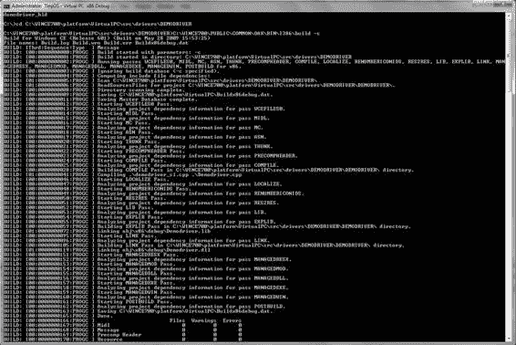

# 开发设备驱动程序时

在开发设备驱动程序时，使用命令行构建既快速又高效。很容易准备批处理文件来设置命令行构建环境，并从命令行提示符窗口运行构建。首先，您需要设置环境，以下示例演示了如何为使用 VirtualPC BSP 构建 x86 架构项目设置构建环境。由于我可能会创建各种环境批处理文件，因此将此文件命名为 `VPCENV.BAT`。

```
echo on
set _WINCEROOT=C:\wince700
cd %_WINCEROOT%\public\common\oak\misc
call Wince.bat x86 CEBASE VirtualPC
set WINCEDEBUG=debug
```

此批处理文件设置了构建设备驱动程序所需的一切，该驱动程序将集成到在虚拟 PC 设备上运行的操作系统中。图 2-11 展示了运行此环境批处理文件后的结果。

*图 2-11. 在命令行提示符中运行 VPCENV.BAT*

[www.it-ebooks.info](http://www.it-ebooks.info/)



