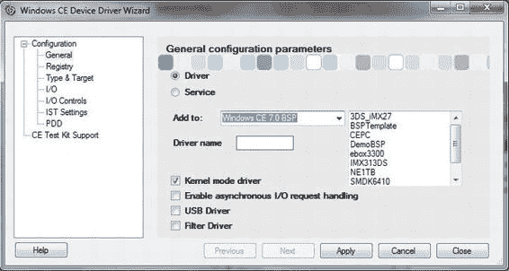
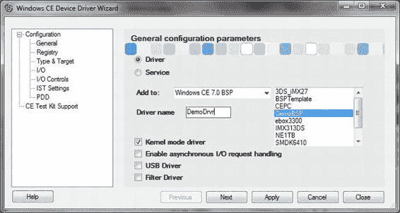
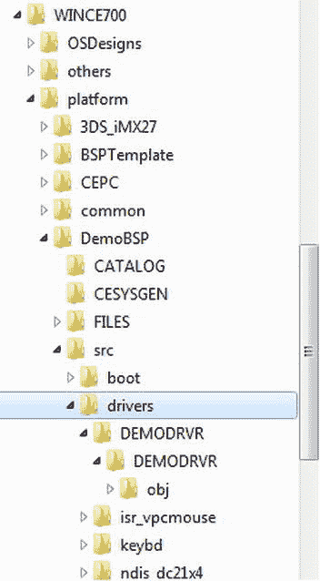
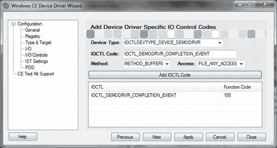
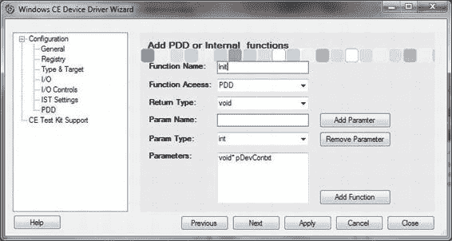
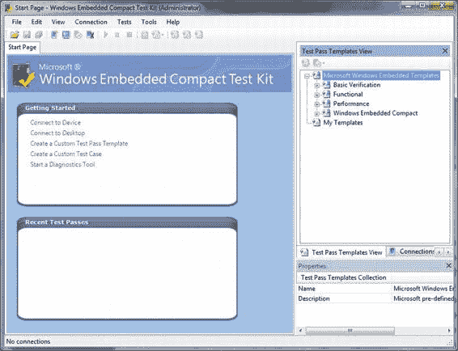

# 第 2 章 ■ 开发工具

下一步是创建一个批处理文件来执行实际的构建。以下示例展示了一个用于构建 VirtualPC BSP 演示驱动程序的批处理脚本。

```
REM DEMODRIVER 构建
echo on
call VPCENV.bat
REM 构建演示驱动程序
cd %_WINCEROOT%\platform\VirtualPC\src\drivers\DEMODRIVER
%_WINCEROOT%\PUBLIC\COMMON\OAK\BIN\I386\build –c
```

与之前一样，建议您为该文件取一个有意义的名称，例如 `demodriver_bld.bat`。

图 2-12 展示了运行此设备驱动程序构建批处理文件后的结果。

*图 2-12. 在命令行提示符中运行 DEMODRIVER_BLD.BAT*

### 设备驱动程序开发包

Windows CE 的设备驱动程序开发包（DDK）主要由两个重要的辅助库和一组头文件组成。这些头文件提供了辅助库（CEDDK 库和注册表辅助库）中可用的结构和辅助函数的定义。包含 DDK 文件的主目录位于 PUBLIC 树之下：

- `%PUBLICROOT%\COMMON\oak\drivers\ceddk`
- `%PUBLICROOT%\COMMON\ddk\inc`

#### CEDDK 动态链接库

CEDDK 库提供了驱动程序用于处理总线地址转换和总线访问、分配和映射设备内存、设置直接内存访问（DMA）缓冲区、执行 I/O、电源管理功能以及暂停计数器的函数、结构和 IO 控制代码。

##### 注册表辅助库

注册表辅助函数和结构为设备驱动程序开发者提供了一种一致的方法来从注册表读取资源配置。

### TRACE32-ICD

TRACE32-ICD 由 Lauterbach Datentechnik GmbH 提供，是一款极其强大的调试工具，用于芯片级调试。它绝非唯一可用的第三方工具，但它是我在调试设备驱动程序、引导加载程序和 OAL 代码时使用过的一款工具。

#### 概述

在线调试器是一种利用微处理器芯片上集成的调试和跟踪逻辑的工具。

大多数微处理器都实现了片上调试系统。例如 ARM 微处理器系列的 JTAG 接口。调试接口需要一些微处理器引脚，用于片上调试系统和第三方开发工具之间的通信。片上调试系统提供以下基本功能：

- 读/写内存
- 读/写 CPU 寄存器
- 单步执行和实时执行
- 硬件断点和触发功能（并非所有微处理器都支持）

TRACE32-ICD 利用片上调试系统的这些功能，提供了一个强大的调试工具，具备以下特性：

- 简便的高级语言和汇编语言调试
- 在逻辑层面上显示内部和外部外设
- 支持片上断点和触发
- RTOS 感知
- Flash 编程
- 强大的脚本语言
- 多处理器调试

TRACE32-ICD 支持广泛的片上调试接口。调试器的硬件是通用的，只需更换调试电缆和软件即可连接到不同的目标处理器。调试器硬件有三个版本，区别仅在于它们与开发工作站的通信方式。

- Power Debug USB 2 通过 USB 2 端口通信
- Power Debug Ethernet 通过 USB 2 和 100 MB 以太网接口通信
- Power Debug II 通过 USB 或千兆以太网接口通信

图 2-13 是 Power Debug USB 2 的图片。当然，三者之间存在明显的成本差异。除此之外，三者都提供相同的功能：

- 支持广泛的片上调试接口
- 简便的高级语言和汇编语言调试
- 与所有编译器接口
- 快速下载
- RTOS 感知
- 与所有主机接口
- 在逻辑层面上显示内部和外部外设
- Flash 编程
- 硬件断点和触发（如果芯片支持）
- 提供跟踪扩展
- 多处理器/多核调试
- 软件跟踪
- 虚拟分析器

TRACE32 系统包含一个可配置的多任务调试器，用于在实时操作系统中提供符号调试。它包含一个针对 Microsoft 提供的 Windows CE 实时内核的即用型配置。以下是特定于 Windows CE 的功能。

- 实时、非侵入式显示 Windows CE 系统资源
- 调试 Windows CE 内核
- 调试 Windows CE 设备驱动程序
- 同时调试多个 Windows CE 应用程序
- 动态线程性能测量
- 针对 Windows CE 的实时跟踪列表评估
- 用于操作系统数据的 PRACTICE 函数
- 与 Windows CE 相关的下拉菜单

*图 2-13. Power Debug USB 2*

#### 如何准备您的 Trace 工具

准备 TRACE32-ICD 环境意味着您需要连接目标设备硬件，并安装和准备您的 TRACE32 PowerView 软件工具。图 2-14 展示了如何通过在线调试器模块将目标设备连接到开发工作站。

调试电缆是微处理器专用的，因此不可互换。

使用安装程序安装 ICD（在线调试器）软件。安装完成后，您需要创建特定的命令批处理文件，因为这样可以避免每次从头开始配置会话。TRACE32 使用自己的命令语言来执行批处理任务。TRACE32 开发工具的所有命令，如程序流命令、条件命令和 I/O 命令，都是允许的。批处理文件的默认扩展名为 `.cmm`。

我们将在第 15 章结合动手实践深入讨论此工具。我们将创建一个特定的批处理文件来加载和运行内核设备驱动程序、测量性能以及调试设备驱动程序。

*图 2-14. 用于 TRACE32 辅助调试的硬件设置*

*图 2-15. 安装 TRACE32 软件*

#### 设备驱动程序向导

#### 概述

开发者通过示例学习。尽管我们学习理论，但作为人类，我们仍然通过分析示例来学习。这就是我们小时候学习做事的方式，这也是为什么书籍中充满了示例；本书也不例外。

Windows CE 文档中提供了一个名为“如何创建设备驱动程序”的主题。在该主题的第 4 步中，它告诉您“将电源管理开发示例驱动程序复制到您的操作系统设计中”。然后，它会指导您在创建过程的其余步骤中该如何操作。


好的，作为一名高级文档工程师和翻译员，我将严格按照您提供的注意事项和示例，将给定的英文文本翻译成中文。


`Wizards` 旨在消除复制示例项目、重命名并改编以创建新项目的繁琐工作。这正是 `Windows CE 设备驱动程序向导` 的全部意义所在。它旨在帮助设备驱动程序开发者快速开始为 5.0、6.0 和 7 版本的 `Windows CE` 创建流设备驱动程序。它有助于创建一个可构建的项目框架，并省去了与复制和重命名框架示例相关的海量繁琐工作。

#### 最佳实践

在开始之前，您应该考虑设备驱动程序的设计。这将有助于您通过 `设备驱动程序向导` 提供的创建步骤，最终获得一个全面的快速启动设备驱动程序项目。您需要计划以下信息：

-   设备驱动程序的**有意义名称**
-   它是内核模式设备驱动程序还是用户模式
-   设备驱动程序的位置
-   它是否是 BSP 的一部分？
-   它是否与单个操作系统设计相关？
-   它是否可以被任何操作系统设计使用？
-   注册表相关信息
-   CPU 架构
-   DMA 支持
-   中断支持
-   设备特定的 IO 控制代码支持

规划以上所有内容及更多方面，将帮助您向 `设备驱动程序向导` 提供信息，从而生成所有必要的源代码、构建支持和参数文件，这些文件随时可以构建。一旦您添加了设备特定的代码，您的设备驱动程序就准备好进行测试了。

`图 2-16` 显示了 `设备驱动程序向导` 的起始页面，允许开发者选择设备驱动程序的位置。

[www.it-ebooks.info](http://www.it-ebooks.info/)



第二章 ■ 专业工具

*图 2-16. 设备驱动程序向导通用配置参数页*

### 章节总结

`Visual Studio 2008` 为 `Platform Builder IDE` 提供了基础，使您能够创建、构建和调试设备驱动程序。`Platform Builder` 包含故障排除工具、向导和构建工具，以指导您完成构建过程。`Windows Embedded Compact` 附带一个定义好的构建系统，该系统使用四个阶段：编译 (compile)、系统生成 (sysgen)、发布复制 (release copy) 和生成运行时映像 (make run-time image)，并且 `Platform Builder` 工具在每个阶段都帮助您创建可工作的驱动程序。要排除故障和调试问题，并简化设备驱动程序开发，您可以使用 `Platform Builder` 中包含的工具，例如 `设备驱动程序向导`，以及第三方工具，例如 `TRACE32-ICD`。我们议程上的下一步是设计我们的设备驱动程序，考虑其位置、模式、内核模式或用户模式，以及在真正投入开发之前必须决定的许多其他考虑因素。

[www.it-ebooks.info](http://www.it-ebooks.info/)

**第三章**

****首先设计你的设备驱动程序！**

我知道大多数读者此时已经觉得指尖发痒，只想马上开始敲击键盘来实现一个设备驱动程序。与应用程序不同，设备驱动程序是相当直接的软件单元，那么为什么不直奔主题呢？我对这个合理问题的回答有两个方面；它可以消除代价高昂的错误并节省时间。消除错误是因为它迫使您研究和理解硬件。为您的设计选择正确的模型。规划设备驱动程序结构；仔细考虑设备驱动程序将如何访问内存。仔细考虑并规划设备驱动程序的中断处理。通过避免临时开发，您可以节省时间，并且即使使用像 `设备驱动程序向导` 这样的第三方工具来更高效地生成快速启动设备驱动程序框架，您为设计收集的信息也会有所帮助。本章旨在强调您在规划和设计设备驱动程序时*应该考虑*的要点。

### 本章内容

-   设备驱动程序位置考虑
-   内核模式与用户模式之间的权衡
-   注册表设置考虑
-   设备驱动程序类型考虑
-   内存访问方法考虑
-   中断支持考虑
-   电源管理支持考虑
-   IO 控制代码考虑
-   设计物理设备驱动程序 (PDD)
-   为测试而设计

A. Kcholi *P*, *ro Windows Embedded Compact 7* © Abraham Kcholi 2011

[www.it-ebooks.info](http://www.it-ebooks.info/)



第三章 ■ 首先设计你的设备驱动程序！

### 设备驱动程序位置

在第二章讨论 `平台目录` 树时，我们注意到两个最相关的目录是 `PLATFORM` 和 `PUBLIC` 目录。在 `PLATFORM` 目录下是特定于 BSP 的设备驱动程序，而在 `PUBLIC` 目录下是所有平台无关的设备驱动程序。

当我们开发设备驱动程序时，必须考虑这个设备驱动程序属于谁。它是特定于您的操作系统映像的设备驱动程序吗？它是 BSP 的一部分吗？或者，我正在创建一个与架构无关的设备驱动程序，并希望将其与我的 OEM 硬件一起推向市场。`图 3-1` 展示了如何创建设备驱动程序并将其添加到 BSP。

*图 3-1. 将设备驱动程序添加到 BSP*

生成的设备驱动程序位置如 `图 3-2` 所示；在这里，您可以看到位于 `DemoBSP` 设备驱动程序文件夹中的 `DemoDrvr` 设备驱动程序的文件夹层次结构。

[www.it-ebooks.info](http://www.it-ebooks.info/)



第三章 ■ 首先设计你的设备驱动程序！

*图 3-2. BSP 驱动程序位置*

#### BSP

如果计划的设备驱动程序要处理作为目标板内置部分的外围 IO 设备，那么它应该位于该板的 BSP 目录中。这将确保任何基于该 BSP 的操作系统设计都能够访问该外围 IO 设备。`生产质量 OAL` 倡议要求特定于板的设备驱动程序位于平台目录层次结构中的 `$(PLATFORMROOT)\<BSPName>\src\drivers` 文件夹下。这个位置将确保您的设备驱动程序将成为您的 BSP 构建的一部分。

#### 特定操作系统设计

此位置允许开发者创建一个特殊的设备驱动程序，该驱动程序被放置在操作系统设计中并内置于映像中。先前版本的设备驱动程序开发文档建议您走这条路，在一个测试床操作系统设计中实现和测试您的设备驱动程序，并在测试和调试完成后将设备驱动程序移动到最终位置。但是，此版本在一个模板 BSP 中提供了一个模板流设备驱动程序，其位置类似于上述位置。

然而，如果某个设备驱动程序在任何其他目标设备中都不需要，那么将其放在操作系统设计中是很有用的。

#### PUBLIC 树

`PUBLIC` 树位置提供了所有与平台无关的设备驱动程序，包括 Microsoft 在 `$(PUBLICROOT) \COMMON\oak\drivers` 文件夹下提供的开箱即用设备驱动程序。但是，这不是您应该放置设备驱动程序的位置，而是应该放在第三方文件夹下，例如 `$(PUBLICROOT)\ThirdParty\catalog\<CompanyName>\<DriverName>`。这不会破坏 `PUBLIC` 树的完整性，并允许设备驱动程序在目录中平滑集成。

### 决定模式

`Windows CE 6.0` 带来了 `Windows CE` 操作系统架构的变革。在此之前，所有设备驱动程序都是用户模式设备驱动程序；从此时开始，设备驱动程序既可以驻留在内核中，也可以位于用户模式。我们在第一章已经触及了这个主题，并将在后续章节中进一步讨论并深入探讨它。但对我们开发者而言，在实现之前就决定我们将要开发的设备驱动程序是驻留在内核中（即内核模式设备驱动程序）还是用户模式设备驱动程序仍然很重要。

#### 内核模式


#### 内核模式

内核模式设备驱动程序驻留并在内核上下文中运行，因此拥有任何其他内核模式代码所具有的所有特权。它可以访问内核模式内存空间；它可以读取和写入内核结构，并使用内核特定的 API。因此，内核模式设备驱动程序可以无限制地访问硬件。这些特权使得设备驱动程序对操作系统来说非常危险且具有风险。

选择开发内核模式设备驱动程序会给开发者带来编写安全、健壮代码的负担。这进一步强调了规划与设计行为良好且无风险的设备驱动程序的重要性。

-   设备驱动程序如何访问内存
-   用户模式进程如何访问检索到的数据
-   用户模式进程如何发送数据
-   设备驱动程序如何通知用户模式进程已发生中断且检索到的数据已就绪

本书将深入探讨所有这些主题。

#### 用户模式

用户模式设备驱动程序在旨在承载它并与设备管理器通信的用户模式进程中执行。你可能还记得，设备管理器在内核模式下执行，验证用户模式设备驱动程序的请求，并作为物理硬件与用户模式设备驱动程序之间的中介。这意味着用户模式设备驱动程序没有内核模式特权，并且对内核模式 API 的访问受到严格限制。由于用户模式与内核模式之间发生多次转换，用户模式设备驱动程序会遭受明显的性能损失。

它适用于处理连接到扩展总线（例如 USB 和安全数字总线）上的设备的可安装设备驱动程序。

#### 注册表

注册表在加载和初始化设备驱动程序方面起着重要作用，因为设备驱动程序是一个动态链接库。因此，它必须由一个宿主进程来承载。宿主进程需要知道在哪里找到可执行文件以加载它。有两个主要的内核组件承载和处理设备驱动程序：

-   图形、窗口和事件系统 (GWES)
-   设备管理器。

在开发的规划和设计阶段，决定哪个组件承载设备驱动程序将决定其注册表设置。对于流设备驱动程序，它位于注册表项`HKEY_LOCAL_MACHINE\Drivers\BuiltIn`下。

你应该规划的注册表项包括加载标志、内存配置和中断设置。

这并不是说这些值是必需的或比其他值更重要，但在需要时提前规划这些是有用的。在第 5 章中，将全面讨论注册表，并应为流设备驱动程序设计注册表项提供所有工具。

### 设备驱动程序类型

设备驱动程序属于几个设备驱动程序类别，由加载它们的组件区分。

本机设备驱动程序由`GWES`加载，流设备驱动程序由设备管理器加载，文件系统驱动程序由`FSD Manager` ( `FSDMGR.DLL` ) 加载。除了显示和用户输入驱动程序（如键盘）等用户界面设备驱动程序或文件系统驱动程序之外，你将开发的大多数设备驱动程序都是流设备驱动程序。因此，选择类别应该很直接。然而，流设备驱动程序可以是内置驱动程序（如作为 SoC 组成部分的`I2C`设备或总线驱动程序），甚至是与总线无关的驱动程序（如 PC 卡设备驱动程序）。

### 设备驱动程序特性

规划设备驱动程序时需要考虑的非常重要的一点是内存管理、如何处理中断以及电源管理支持。这很重要，因为设备驱动程序的性能受数据存储方式及其中断处理方式的影响。

对于电池供电的设备来说，电源管理极其重要。

### 直接内存访问

在考虑设备驱动程序如何存储传入数据时，性能是最重要的。处理大量数据输入的设备需要以最小的延迟移动数据。考虑直接内存访问是可取的，因为它移动数据无需处理器参与。但是，你应该熟悉外围设备的`DMA`能力。第 10 章将对内存处理进行深入讨论。

### 中断支持

规划中断支持意味着你了解你的 IO 外围设备映射到的硬件中断请求级别。接下来，你必须映射一个逻辑系统中断 ID，它将把你的`ISR`与`IST`关联起来。另一个考虑因素是`ISR`本身，它在很大程度上取决于 SoC 的架构以及你是否正在规划一个`ISR`将被链式连接的可安装设备驱动程序。

### 电源管理支持

除了考虑是否提供电源管理之外，你可能还需要设计设备驱动程序需要实现哪些具体的电源管理支持。例如，设备驱动程序是否应提供唤醒能力？

### IO 控制代码

IO 控制代码用于指定通过单个系统 API—— `DeviceIoControl`处理的设备特定系统调用。这允许应用程序向驱动程序请求执行常规文件系统 API 不提供的功能。例如，假设设备驱动程序需要设置一些事件来通知某些 IO 完成。设备驱动程序可以为命名事件提供一个名称，应用程序可以通过调用特定的`IOCTL`来检索该事件。然后，应用程序将创建一个命名事件，设备驱动程序将设置该事件以触发唤醒应用程序的线程。第 9 章专门讨论这个主题。然而，为设备特定的`IOCTL`进行规划以增强设备驱动程序的功能能力是一个好主意。图 3-3 显示了如何向设备驱动程序向导创建的设备驱动程序添加`IOCTL`。



*图 3-3. 向设备驱动程序添加 IOCTL*

### 设计物理设备驱动程序

物理设备驱动程序是一组硬件接口函数，用于隔离硬件特定的代码。例如，当你初始化一个设备驱动程序并调用其`XXX_Init`函数（对于流设备驱动程序）时，你可能需要初始化设备的硬件，向它的命令寄存器发送一些命令字，重置中断等。你可以将此代码添加到`XXX_Init`函数中，但你可以实现一个针对该硬件特定的`PDD_Init`函数。这将有助于更好的代码维护和代码质量。规划与设计设备驱动程序的一部分可能是设计能够完成硬件接口的`PDD`函数。设备驱动程序向导提供了向设备驱动程序代码中添加`PDD`函数的功能，这意味着如果你提前规划，可以通过添加已设计的函数来节省大量时间。图 3-4 显示了如何使用设备驱动程序向导添加`PDD`函数。



*图 3-4. 向设备驱动程序添加 PDD 函数*

### 为测试而设计


#### 习惯上，这是开发中最容易被忽视的领域。

开发者调试代码以消除错误，当开发过程似乎不再出现故障时，我们似乎就感到满意了，并将设备驱动程序交付给客户，结果却让客户感到沮丧。确保设备驱动程序按预期工作，可能不仅仅是修复那些显而易见的错误那么简单。它可能无法满足时序性能需求，从而导致丢失宝贵的数据；它可能表现不一致；还可能出现一个只在某些特定数据与时序的偶发组合下才会触发的错误。

要测试这些缺陷，需要对设备驱动程序有最深了解的人来设计测试场景。微软提供了一个非常出色的工具来实现设备驱动程序的测试用例套件，即 Windows Embedded Compact 测试工具包 (CTK)。此工具是 Windows CE 测试工具包 (CETK) 的改进版本，但仍使用相同的 Tux 测试框架。第 15 章专门介绍如何开发用于测试设备驱动程序的 TUX 测试模块。图 3-5 展示了最新的 CTK 集成开发环境。设备驱动程序向导提供了一个可用于定制和构建的测试模块框架实现。CTK 为各种驱动程序提供了一组预定义的测试，这些驱动程序实现了常见的设备，例如 USB 主机控制器。

[www.it-ebooks.info](http://www.it-ebooks.info/)



**第三章 ■ 首先设计你的设备驱动程序！**

*图 3-5. Windows Embedded Compact 测试工具包集成开发环境*

### 章节总结

本章讨论了在开始实现设备驱动程序代码之前应考虑的事项。本书后续章节将讨论如何在各项考量之间做出选择。然而，在实现阶段之前就全面考虑设备驱动程序实现的各个方面，应该能够缩短开发时间，甚至很可能减少潜在的错误和缺陷。

[www.it-ebooks.info](http://www.it-ebooks.info/)

## **第 四 章**

## **掌握硬件环境**

设备驱动程序开发者群体中，既有以硬件为主的开发者，也有以软件为主的开发者，可谓是混合体。如果你属于后者，需要牢记一点：不理解硬件，就不可能编写出硬件的设备驱动程序接口代码。

本章对具有这两种背景的开发者都大有裨益，因为前者将找到有用的编程技巧，而后者将找到有用的硬件规格说明技巧。

本章内容：

- 理解 I/O 设备寄存器
- 理解 I/O 设备中断
- 理解 I/O 设备内存
- 理解 DMA – 直接内存访问

### 引言

正如许多经验丰富的设备驱动程序开发者从其辛苦得来的经验中所知，开发设备驱动程序的第一步是理解底层硬件。设备驱动程序开发者不必是硬件开发者，然而，理解硬件功能以及如何通过编程与其交互是至关重要的。如果没有深刻理解硬件如何施展其魔力，设备驱动程序开发者就毫无希望达成其开发出稳定可靠驱动程序的目标。

简单来说，对于嵌入式设备，或者就此而言，对于任何计算机系统，I/O 硬件外设都是其与外界连接的生命线。I/O 设备类比于人类的眼睛、耳朵、鼻子或嘴巴等等。没有 I/O 设备的功能性运作，计算机系统将变得毫无用处，无法与外界通信。I/O 外设连接到某个数据源或数据汇；它接收输入的数据或推送输出的数据。

例如，假设你需要为一个模拟输入设备创建设备驱动程序，该设备接收来自制造工厂某台机器的数据。要开发你的设备驱动程序，你需要知道该设备从机器接收的模拟信号范围、它是如何进行转换的，以及如何校准以获得有意义的数据，以便设备驱动程序将这些数据传递给应用程序进行处理。你的硬件以电流的形式接收一些数据，这些数据对系统来说原本是毫无意义的，让你的驱动程序传递无意义的信息显然不是你所希望的。

作为一名程序员，你肯定知道，这样的外设设备是一块微电子硬件，它向系统提供一组数据端口，以及一种控制它或获取状态信息的方式。作为设备驱动程序开发者，你的责任是编写执行单元，使该外设设备能够与操作系统连接，并为应用程序提供从车间机器获取有意义数据的能力。你开发的设备驱动程序必须映射到这些数据端口，并从这些端口读取或写入数据。要执行此任务，你的代码必须通过向设备命令端口发送特定命令来正确设置外设设备，这就是为什么设备驱动程序开发者理解底层硬件如此重要的原因。

你需要添加代码来恢复状态信息，以便你设计的控制代码逻辑与设备可能处于的各种状态保持一致。

##### I/O 设备寄存器

外设设备将数据传递给系统的机制是一组数据端口，然而，数据端口并非外设设备向平台呈现的唯一寄存器。设备驱动程序开发者必须清楚，驱动程序代码必须管理设备，以便数据对需要输入数据的应用程序具有一致的意义。此外，开发者需要考虑硬件的状态，以便恰当地管理设备，这意味着任何此类设备都必须向系统报告其状态，并允许系统对其进行控制。出于这个原因，任何这样的硬件都提供三种基本类型的端口或寄存器：

- **状态寄存器** – 状态寄存器中设置的位或未设置的位的组合指示设备的当前状态。
- **控制寄存器** – 设置或清除控制寄存器中的位会创建一条设备将执行的命令。
- **数据寄存器** – 根据这些寄存器被配置用于移动数据的方向，它们将传输或接收数据位。

进行讨论的最佳方式是看一个相对简单的外设设备，例如两线串行接口总线（`TWSI`，以前称为 `I2C`）。例如，它被电源管理 ADC 控制器、内置摄像头等设备所使用。想象一下，你负责管理移动设备的电池，而设计提供了一个单芯片电源管理单元，该单元提供了 `TWSI` 通信接口。与该芯片通信以获取电池状态信息的方法，就是为位于目标设备 `SoC`（片上系统）上的 `TWSI` 控制器开发一个设备驱动程序。

© Abraham Kcholi 2011


