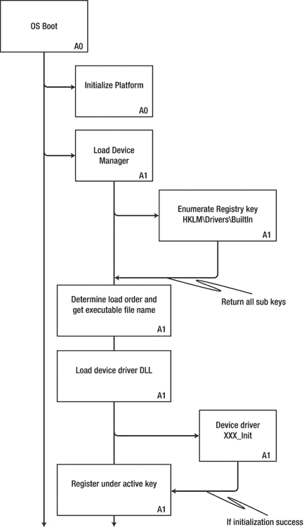

# 设备驱动注册表设置

本章全部关于`Windows Embedded Compact 7`注册表及其与设备驱动的关联。

首先对注册表及其在系统中的作用进行一般性讨论，然后深入讨论所有与设备驱动相关的注册表主题，包括：操作系统如何加载设备驱动；设备驱动的命名约定（以便应用程序可以通过文件系统与设备驱动交互）；哪些键是设备驱动开发者必须设置的，哪些是可选的；如何为用户模式设备驱动设置注册表项；以及如何在实际操作中将所有内容整合在一起。

本章内容：

- 了解`Windows CE`操作系统如何加载设备驱动
- 了解设备驱动的命名约定
- 为特定设备驱动的注册表项创建必要的文件

### 注册表概述

`Windows Embedded Compact 7`注册表存储有关应用程序、驱动、用户偏好和其他配置设置的信息。注册表采用键和值的层次结构系统组织。这种层次结构与文件夹层次结构类似，一个键可以包含值项或其他键。值项以名称/值对的形式存储。在每个文件夹树层次结构的顶部是根，它使用一个众所周知的常量值或`HKEY`来标识。`Windows CE`支持四个根键。

与设备驱动开发者最相关的是`HKEY_LOCAL_MACHINE`根键，硬件和驱动配置数据位于此处。`Windows Embedded Compact 7`注册表的结构与其他版本的 Windows 以及以前版本的`Windows CE`中的注册表类似。

##### 注册表类型

`Windows Embedded Compact 7`支持两种不同的注册表类型：`基于 RAM 的注册表`和`基于配置单元的注册表`。`OEM`可以为其设备确定注册表类型，这对应用程序或用户而言是透明的。

A. Kcholi *P*, *ro Windows Embedded Compact 7* © Abraham Kcholi 2011

[www.it-ebooks.info](http://www.it-ebooks.info/)

`Windows Embedded Compact 7`默认实现`基于配置单元的注册表`。应用程序不知道注册表类型，但它会影响持久性、启动顺序、速度、目标设备上的内存使用以及用户配置文件的行为。所有文件系统配置中都存在用户配置文件支持。

### 对象存储

`Windows Embedded Compact 7`中的对象存储为应用程序和相关数据提供持久存储，即使主电源丢失，只要有备用电源，数据也能保留。一个或多个内存存储芯片（通常是**非易失性**`RAM`芯片）构成了物理对象存储。对象存储由三种类型的持久存储组成：

- 文件系统
- 数据库
- 系统注册表


#### 存储机制

对象存储中的数据存储机制基于事务处理。如果在向对象存储写入数据时电源中断，Windows Embedded Compact 7 将确保存储不会损坏。它通过两种方式实现：要么在系统重启时完成操作，要么回滚到中断前最后一个已知的良好状态。对于系统文件（包括注册表设置），这意味着如果没有预定义保存当前设置的备份系统，则可以从 ROM 重新加载初始设置。

#### 基于 RAM 的注册表

基于 RAM 的注册表将所有注册表数据存储在对象存储中。对于配备电池供电 RAM 的设备而言，这种方式在速度和占用空间方面非常高效。关机后无法为 RAM 供电的设备，必须在关机时备份注册表，并在恢复供电时还原注册表。基于 RAM 的注册表适用于经常进行热启动但极少或从未进行冷启动的设备。

#### 基于配置单元的注册表

基于配置单元的注册表将所有注册表数据存储在称为配置单元的文件中，这些文件可以存放在任何文件系统上。因此，不再需要在关机/开机时进行备份和还原操作，从而加快了冷启动过程。基于配置单元的注册表分为两个配置单元：系统配置单元（包含所有系统数据）和用户配置单元（包含与特定用户相关的所有数据）。多用户系统将包含多个用户配置单元。用户配置单元会在登录时加载，在注销时卸载。基于配置单元的注册表适用于经常冷启动的设备，但对热启动没有影响。它同样适用于需要支持多用户的设备。

每个配置单元被视为一个整体单元，并以单个文件的形式进行保存和还原。系统配置单元包含不与任何特定用户相关的系统设置。OEM 选择系统配置单元的文件名和位置。系统配置单元文件通常命名为 `System.hv`，但位置可能有所不同。

---

### 摘要

Windows Embedded Compact 7 注册表在功能结构上与桌面和服务器版 Windows 操作系统的注册表类似。但出于显而易见的原因，它在体积上更为紧凑。与其他 Windows 操作系统上的注册表实现不同，它支持两种类型：基于 RAM 的注册表和基于配置单元的注册表。

### 设备驱动程序文件名

为了让用户模式应用程序与设备驱动程序交互，应用程序需要使用文件系统函数。应用程序首先要做的是获取设备驱动程序实例的句柄。它通过调用 `CreateFile()` 实现，并使用返回的句柄来调用其他函数，如 `ReadFile()` 或 `WriteFile()`，以及设备管理器函数，如 `DeviceIoControl()`。`CreateFile()` 的第一个参数需要一个文件名，这意味着需要一套设备驱动程序的命名约定。该命名约定分为三个设备命名空间：

- 三个字母的前缀，后跟 0 到 9 之间的一个数字，再跟一个冒号。
- `$device` 挂载点，后跟代表设备的三字母前缀，再跟一个数字。
- `$bus` 挂载点，后跟总线名称、总线号、设备号和功能号。

#### 设备文件命名空间——前缀与索引

前缀由三个大写字母组成，用于标识哪个设备文件名对应特定的流接口。前缀存储在名为 `Prefix` 的注册表值中，该值位于驱动程序的注册表项内。首先，前缀标识了所有可以访问该流接口驱动程序的设备文件名。其次，前缀告诉操作系统在流接口 DLL 中应期望哪些入口点文件名。例如，`DMO_Ini`、`DMO_Read` 或 `DMO_IOControl` 等入口点，其中指定的前缀为 `DMO`。索引是前缀后面的一个数字。索引用于区分流接口管理的相似设备。默认情况下，设备管理器逻辑上从 1 到 9 进行索引，其中 1 对应于第一个设备文件名。当需要第十个设备文件名时，使用 0 作为索引。例如，通过设备文件名前缀打开设备驱动程序的典型代码应为：

```
CreateFile("DMO1:", ....
```

#### 设备文件命名空间——挂载点

有两个挂载点命名空间：`$device` 挂载点和 `$bus` 挂载点。这两个命名空间支持超过 10 个具有相同三字母前缀的设备实例。设备管理器使用 `RegisterAFSEx()` 向文件系统注册这些文件命名空间。这使得文件系统能够为设备驱动程序返回句柄。虽然前缀命名空间和设备命名空间返回相同的句柄，但总线命名空间返回的是总线、功能和设备的句柄，这意味着操作系统可能以不同的方式处理访问。

使用设备命名空间打开设备驱动程序实例时，设备名称是一个路径字符串，由反斜杠、`$device` 空间标识符、反斜杠以及设备前缀后跟索引组成。例如：

```
CreateFile(_T("\\$device\\DMO1)", ....
```

使用总线命名空间打开设备驱动程序实例时，设备名称是一个路径字符串，由反斜杠、`$bus` 空间标识符、反斜杠，后跟总线类型名称、下划线总线号、下划线设备号和下划线功能号组成。

```
CreateFile(_T("\\$bus\\PCI_0_3_0)", ....
```

### 加载顺序

由于设备驱动程序实际上帮助操作系统与底层硬件平台交互，因此在系统启动过程中尽快加载它们至关重要。负责加载和管理流设备驱动程序的操作系统组件是设备管理器。如果 GWES 是操作系统的一部分，则它负责加载本机设备驱动程序，例如显示设备驱动程序、键盘驱动程序等。系统可能被设计为无头系统，从而省去 GWES 组件。然而，在任何有意义的操作系统设计中，设备管理器都是必需的。

#### 流设备驱动程序的加载顺序


##### 操作系统启动时

当系统硬件由 `OEMInit` 函数初始化完成后，操作系统启动，文件系统开始运行，`设备管理器` 通过加载并执行位于 `HKLM\Drivers\BuiltIn` 根目录下的 `BusEnum.dll` 来枚举该注册表项下的条目。总线枚举器启动扫描注册表的过程，以查找 `HKLM\Drivers\BuiltIn` 子项下需要加载的其他总线和设备。总线枚举器根据 `Order` 注册表子项，检查传递给它的键下的第一级键。它对找到的每个子项调用 `ActivateDeviceEx`。每个子项可以包含由 `ActivateDeviceEx` 或已加载驱动程序在其初始化例程中解释的任何值。此外，驱动程序可以有一个介于 0 到 255 之间的 `Order` 值，该值不必唯一。`Order` 值最小的驱动程序将首先被加载。如果没有 `Order` 值，则该驱动程序将在具有已定义 `Order` 值的驱动程序之后被加载。总线枚举器在加载设备驱动程序时，会逐个遍历 `HKEY_LOCAL_MACHINE\Drivers\BuiltIn` 的第一级键，为每个键初始化一个设备驱动程序。它加载由 `DLL` 值指定的 DLL，然后在 `HKEY_LOCAL_MACHINE\Drivers\Active` 下为驱动程序创建一个子项。接着，它调用驱动程序的 `XXX_Init` 入口点，并传入一个包含指向该流接口驱动程序活动键的注册表路径的字符串。`XXX_Init` 例程应使用返回的字符串调用 `RegOpenKeyEx` 以获取该键的句柄，然后调用 `RegQueryValueEx` 查找键值，该值包含与 `设备管理器` 最初在 `HKLM\Drivers\BuiltIn` 下遇到的注册表键对应的字符串。通过读取这些值，设备驱动程序可以初始化 I/O 资源、中断处理程序等。图 5-1 可视化地展示了流设备驱动程序的加载顺序。

[www.it-ebooks.info](http://www.it-ebooks.info/)



## 第 5 章 ■ 设备驱动程序注册表设置

*图 5-1. 流设备驱动程序加载顺序*

[www.it-ebooks.info](http://www.it-ebooks.info/)

## 第 5 章 ■ 设备驱动程序注册表设置

### 设备管理器注册表项

`设备管理器` 使用 `HKLM\Drivers` 注册表项下的 `Active` 和 `BuiltIn` 子项。`HKLM\Drivers\Active` 注册表项包含用于跟踪 `设备管理器` 加载的当前活动驱动程序的子项。

#### 活动注册表项

以下列表显示了 `Active` 注册表项中可用的子项：

*   `BusDriver` – 驱动程序的总线名称。
*   `BusName` - 设备的总线名称。
*   总线驱动程序为其从属设备添加这些子项。
*   `DevID` - 由 `设备管理器` 添加的唯一设备标识符。
*   `FullName` - 由 `设备管理器` 添加的名称，与 `$device` 命名空间结合使用。
*   `Name` - 设备驱动程序的设备文件名。此子项仅存在于指定了前缀的驱动程序中。
*   `Order` - 总线枚举器根据 `Order` 值检查键。
*   `Key` - 设备的注册表路径。
*   `PnpId` - 即插即用标识符字符串。仅存在于 PC 卡驱动程序中。
*   `Sckt` - PC 卡的当前插槽和功能对。仅存在于 PC 卡驱动程序中。

### 注册表条目

设备驱动程序的注册表设置对于设备驱动程序的开发至关重要。注册表设置控制 `设备管理器` 如何加载设备驱动程序，允许开发者在驱动程序依赖于其他驱动程序并需要在其之前加载时，对驱动程序的加载顺序进行排序。注册表设置可以包含有助于初始化过程甚至实例创建的信息。例如，一个特定的自定义子项指示允许的实例数量。请记住，注册表是设备驱动程序包中极其重要的一个方面。

有一系列控制驱动程序加载方式的注册表设置。大多数是可选的，一个是必需的。`设备管理器` 使用几个注册表设置，所有驱动程序都可能用到。设备驱动程序开发者可以创建自定义的注册表条目，这些条目将在驱动程序加载后由其直接引用。

[www.it-ebooks.info](http://www.it-ebooks.info/)

## 第 5 章 ■ 设备驱动程序注册表设置

#### 必需项

唯一绝对必需的注册表子项值是 `DLL` 子项。没有它，`设备管理器` 将无法确定要加载哪个 DLL。此子项包含文件系统中设备驱动程序可执行文件的名称。

`"DLL"="Demodriver.DLL"`

即使严格来说，`Prefix` 子项不是必需的，也应该进行设置。`Prefix` 是一个由三个字符组成的字符串，构成驱动程序的名称。为了拥有基于文件句柄的驱动程序接口，必须存在此值。`Prefix` 值必须与流驱动程序入口点中使用的值相同，除非设置了 `DEVFLAGS_NAKEDENTRIES` 标志。

#### 可选项

所有其他子项都是可选的，但某些子项几乎总是应该考虑的，尤其是 `Order` 子项。`Order` 子项是一个 `DWORD` 值，提供了一种支持加载顺序的机制。驱动程序将按照 `Order` 子项指定的顺序加载。如果此子项不存在，驱动程序将在最后加载。清单 5-1 是设备驱动程序向导为演示设备驱动程序生成的注册表条目示例。

*清单 5-1. 示例设备驱动程序的注册表条目*

```
; DemoDriver 驱动程序
[HKEY_LOCAL_MACHINE\Drivers\BuiltIn\Demodriver]
"Prefix"="DMO"
"DLL"="Demodriver.DLL"
"SysIntr"=dword:1A
"Irq"=dword:8
"MemBase"=dword:90001000
"MemLen"=dword:32
"Order"=dword:0
"DisplayName"="DemoDriver 驱动程序"
"IsrHandler"="IsrHandler"
"Flags"=dword:0
"IClass"="{A32942B7-920C-486b-B0E6-92A702A99B35}"
```

#### 设备驱动程序注册表子项

设备驱动程序开发者可以创建设备驱动程序特定的注册表键。例如，RTL8139 以太网驱动程序的注册表条目中有一个用于早期传输阈值的子项值，该值指定了 Tx FIFO 中开始传输的阈值水平：`EarlyTxThreshold`。清单 5-2 列出了 RTL8139 注册表条目的一个示例。

[www.it-ebooks.info](http://www.it-ebooks.info/)

## 第 5 章 ■ 设备驱动程序注册表设置

*清单 5-2. 自定义注册表子项条目示例*

```
"Transceiver"=dword:3
"DuplexMode"=dword:1
"EarlyTxThreshold"=dword:10000
"IsrDll"="giisr.dll"
"IsrHandler"="ISRHandler"
"PortIsIO"=dword:1
"PortOffset"=dword:3E
"PortSize"=dword:2
"PortMask"=dword:C07F
"UseMaskReg"=dword:1
"MaskOffset"=dword:3c
```

然而，大多数子项都是预设的通用值，如下表所述：

*   `Dll` - 指定驱动程序 DLL 的名称
*   `Prefix` - 指定设备驱动程序的文件名
*   `Order` - 指定驱动程序的加载顺序
*   `Index` - 指定设备索引（例如 COMx 中的 x）
*   `IClass` - 为 PnP 通知系统指定设备类的 GUID
    *   例如 – 对于电源管理的设备接口，值为 `A32942B7-920C-486b-B0E6-92A702A99B35`
*   `Flags` - 指定驱动程序的加载标志
*   `IoBase` - 指定设备使用的 I/O 映射窗口的基址。端口 I/O 必须得到架构的支持，即用于访问 I/O 端口的特殊 CPU 指令。
*   `IoLen` - 指定设备所需的每个 I/O 窗口的长度
*   `MemBase` - 指定设备使用的内存映射窗口的总线相对基址。内存映射 I/O 将 I/O 寄存器映射到系统内存中的一个区域。
*   `MemLen` - 指定设备所需的每个内存映射窗口的长度
*   `IRQ` - 指定设备使用的物理 IRQ
*   `SYSINTR` - 指定逻辑中断标识符。
*   `IsrDll` - 指定包含可安装中断处理程序的 DLL


