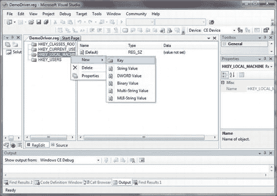
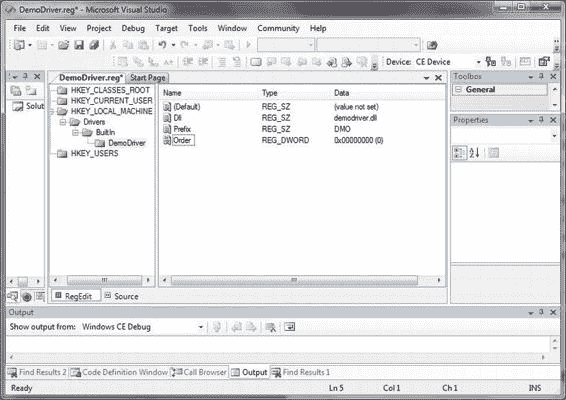
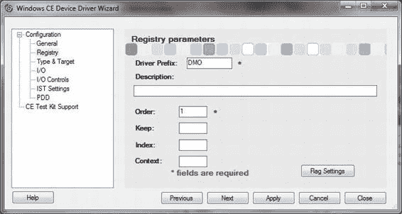
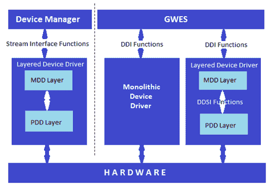

# 排版后的内容

`IsrHandler` - 指定 ISR DLL 中的 ISR 处理程序

[www.it-ebooks.info](http://www.it-ebooks.info/)

## 第 5 章 ■ 设备驱动程序注册表设置

### 用户模式驱动程序框架注册表设置

用户模式设备驱动程序在实现上与内核模式驱动程序并无不同。毕竟，用户模式设备驱动程序需要执行与内核模式设备驱动程序相同的任务。尽管如此，用户模式设备驱动程序仍受到限制，必须加载到特殊的用户模式宿主中，并借助内核模式反射器来执行其任务。为了让设备管理器在加载驱动程序之前能够判断它是否属于用户模式驱动程序，特定的注册表项必须向设备管理器指明该驱动程序是一个用户模式设备驱动程序。两个子项起了关键作用：告诉设备管理器该驱动程序是用户模式驱动程序的子项是`Flags`子项，其值被赋为 10。另一个子项则向设备管理器指明应在哪个用户模式宿主中加载该设备驱动程序，即`UserProcGroup`。如果设置了此子项，设备管理器会将驱动程序的 DLL 加载到一个可加载多个驱动程序的用户模式宿主中。否则，设备管理器将在一个独立的用户模式宿主中启动该驱动程序，该宿主唯一的目的就是加载和管理这个特定的设备驱动程序。清单 5-3 是一个加载在公共用户模式宿主中的用户模式设备驱动程序的示例。

*清单 5-3. 用户模式设备驱动程序注册表项示例*

```
; SIP
[HKEY_LOCAL_MACHINE\Drivers\BuiltIn\SIP]
"Prefix"="SIP"
"Dll"="softkb.DLL"
"Order"=dword:1
"Index"=dword:0
;Flags==10 表示 DEVFLAGS_LOAD_AS_USERPROC
"Flags"=dword:10
"UserProcGroup"=dword:3 ; // 默认为组 3
```

### 为设备驱动程序创建注册表项

为你的设备驱动程序创建注册表设置项并不复杂，但需要提前做一些思考。你必须考虑哪些信息是已知的。例如，关于 I/O 映射和地址、中断处理信息等。这些知识有助于在注册表设置中配置这些信息，并省去在设备驱动程序代码中设置它们的代码。这能使驱动程序更加健壮且易于维护，更少的代码意味着更少的潜在错误，而将设置放在外部文件中则意味着更容易进行变更或更新维护。

#### 创建注册表设置文件

操作系统的注册表文件是二进制文件，由构建系统将具有`.REG`文件扩展名的简单结构化文本文件转换而成。`.REG`文件的结构能够反映其键层次结构所在的根键。例如，

```
[HKEY_LOCAL_MACHINE\Drivers\BuiltIn\DemoDriver]
```

将`DemoDriver`注册表设置置于`HKEY_LOCAL_MACHINE`根键下的内置设备驱动程序中。

要创建一个注册表参数文件，例如针对名为`DemoDriver`的设备驱动程序，你需要创建一个简单的文本文件，并将其命名为`"DEMODRIVER.REG"`。接下来，你可以使用任何文本编辑器来编辑它并创建你的注册表参数文件，或者你也可以使用 Visual Studio 内置的注册表编辑器。图 5-2 显示了在打开名为`"DEMODRIVER.REG"`的空文本文件后，Visual Studio 中注册表编辑器的界面。

[www.it-ebooks.info](http://www.it-ebooks.info/)



## 第 5 章 ■ 设备驱动程序注册表设置

#### 使用注册表编辑器

使用它很简单，你可以通过 IDE 添加键和值。只需右键单击根键（本例中为`HKLM`），然后依次添加`Drivers`键、`BuiltIn`键等等。图 5-3 显示了生成的`DemoDriver`注册表设置，清单 5-4 显示了生成的文本文件。使用此编辑器的一个注意事项是：生成的文本文件会为每个值重复键层次结构，因此可能需要对其进行“清理”以获得更简洁、更清晰易读的外观，清单 5-5 展示了最终结果。

*图 5-2. 在 Visual Studio 中使用注册表编辑器*

*清单 5-4. 生成的源代码*

```
[HKEY_LOCAL_MACHINE\Drivers\BuiltIn\DemoDriver]
"Dll"="demodriver.dll"
```


`[HKEY_LOCAL_MACHINE\Drivers\BuiltIn\DemoDriver]`

`"Prefix"="DMO"`

`[HKEY_LOCAL_MACHINE\Drivers\BuiltIn\DemoDriver]`

`"Order"=dword:0`

[www.it-ebooks.info](http://www.it-ebooks.info/)



## 第 5 章 ■ 设备驱动程序注册表设置

*清单 5-5. “清理过的”源代码*

`[HKEY_LOCAL_MACHINE\Drivers\BuiltIn\DemoDriver]`

`"Dll"="demodriver.dll"`

`"Prefix"="DMO"`

`"Order"=dword:0`

*图 5-3. 将“DemoDriver”添加到注册表*

### 本章小结

本章讨论了设备驱动程序的注册表设置。阐述了创建这些值的重要性，以避免硬编码设备驱动程序信息，例如 I/O 寄存器的基地址或逻辑中断标识符。全面的注册表设置能够提供灵活性、可维护性和健壮性。Windows 设备驱动程序向导的功能不仅有助于开发人员快速创建设备驱动程序代码，还能创建注册表设置文件。基本条目示例可参见图 5-4。

[www.it-ebooks.info](http://www.it-ebooks.info/)



## 第 5 章 ■ 设备驱动程序注册表设置

*图 5-4. Windows CE 设备驱动程序向导的注册表参数页面* 在本章中，我们讨论了与注册表相关的主题。特别重要的内容如下：

• 总线枚举器

• 设备管理器

• Active 注册表键

• 设备文件名

[www.it-ebooks.info](http://www.it-ebooks.info/)

## 第 6 章

## 理解设备驱动程序类型

设备驱动程序类型实际上是一个模糊的术语。Windows Embedded Compact 7 将设备驱动程序视为两种基本类型：本机设备驱动程序和流设备驱动程序。第三种类型（实际上是前两者的结合）被称为混合设备驱动程序。本机驱动程序是一种内置设备驱动程序，在启动时由 GWES 加载和调用，并公开一组特定于该设备驱动程序类的自定义 API 集合。管理硬件平台内置 IO 设备、由设备管理器管理并公开流接口的设备驱动程序被视为流设备驱动程序。混合设备驱动程序同时向系统其余部分公开自定义用途接口和流接口。

本章内容包括：

• 本机设备驱动程序

• 流设备驱动程序

• 混合设备驱动程序

• 单片式与分层式

• 解释设备接口类

• 如何实现设备接口通知

### 本机设备驱动程序

本机设备驱动程序通常是支持用户输入和输出外围设备的驱动程序，例如键盘、鼠标、触摸屏和显示器外围设备。期望图形窗口和事件子系统（GWES）处理这些设备似乎是合理的。GWES 确实直接加载和管理这些设备驱动程序。本机设备驱动程序实现了与其功能目的相关的特定设备驱动程序接口（DDI）函数。本机设备驱动程序的注册表项位于 `HKEY_LOCAL_MACHINE\HARDWARE\DEVICEMAP\` 或 `HKEY_LOCAL_MACHINE\Drivers\Display\` 注册表节点下。

A. Kcholi *著*，《*精通 Windows Embedded Compact 7*》

© Abraham Kcholi 2011

[www.it-ebooks.info](http://www.it-ebooks.info/)

## 第 6 章 ■ 理解设备驱动程序类型

例如：

`[HKEY_LOCAL_MACHINE\HARDWARE\DEVICEMAP\TOUCH]`

`"DriverName"="touch.dll"`

`"MaxCalError"=dword:10`

#### 流设备驱动程序

流设备驱动程序由设备管理器加载和管理。流设备驱动程序公开一组已定义的函数，以便设备管理器能够代表系统或用户模式应用程序与设备驱动程序交互。用户模式应用程序使用文件系统 API 访问流设备驱动程序，以打开设备驱动程序的实例并读取和写入设备数据。扩展操作通过设备管理器 API `DeviceIoControl` 访问，该 API 可以容纳设备驱动程序允许的自定义操作。流设备驱动程序的注册表项位于 `HKEY_LOCAL_MACHINE\Drivers\BuiltIn` 注册表节点下。


#### 流设备驱动程序

**注意：** 流术语说明：术语`流设备驱动程序`意味着只有流内容由`流设备驱动程序`处理。但这种说法未必准确，因为`块`设备驱动程序（例如存储外设的`设备驱动程序`）也是`流设备驱动程序`。该术语特指由`设备管理器`加载和管理，并公开`流接口`的`设备驱动程序`。

### 混合设备驱动程序

混合设备驱动程序同时公开`流接口`和特定 API。`USB`设备驱动程序便是典型示例，它公开部分`流接口`和`USB`特有 API。例如：**LIBRARY WAVEDEV**

**导出函数**

`WAV_Init`
`WAV_Deinit`
`WAV_Open`
`WAV_Close`
`WAV_IOControl`
`USBInstallDriver`
`USBDeviceAttach`
`USBUnInstallDriver`

[www.it-ebooks.info](http://www.it-ebooks.info/)



## 第 6 章：理解设备驱动程序类型

### 单体式与分层式设备驱动程序

Windows Embedded Compact 7 设备驱动程序可以采用单体式或分层式组织结构。`单体式设备驱动程序`基于单一代码块构建，直接向操作系统公开硬件设备的功能。`分层式设备驱动程序`由两层构成：

- `模型设备驱动程序`（MDD）层，即与操作系统交互的上层。
  - 通过 PDD 层访问其设备。
  - 实现`设备驱动程序接口`（DDI），这是一组由操作系统组件（如 GWES 或`设备管理器`）调用的函数。
- `平台相关驱动程序`（PDD）层，即与底层硬件交互的下层。
  - 与硬件相关；通常必须针对特定硬件进行定制。
  - 将 MDD 层与硬件连接。
  - 实现`设备驱动程序服务提供程序接口`（DDSI）
  - 这是一组由 MDD 层调用的函数。

图 6-1 展示了分层式设备驱动程序模型与单体式模型之间的对比。

但请注意，单体式设备驱动程序既可以是本机设备驱动程序，也可以是流设备驱动程序，尽管由于空间限制，图中仅描绘了单体式本机设备驱动程序。

**图 6-1.** 单体式与分层式设备驱动程序对比

[www.it-ebooks.info](http://www.it-ebooks.info/)

## 第 6 章：理解设备驱动程序类型

### 设备接口类

设备驱动程序通过向操作系统公开的`设备接口类`来定义其特征。一个设备驱动程序可以拥有多个设备接口类，也可以没有。问题是，我为什么要在意设备驱动程序属于哪个接口类？基本上我并不在意。然而，如果某个设备驱动程序支持电源管理，你就需要将该驱动程序描述为支持通用电源管理类接口，以便电源管理器能够与该设备驱动程序交互。

但通常情况下，设备驱动程序公开接口类可以让`设备管理器`通知应用程序、服务或其他设备驱动程序该设备接口的出现和消失。

这对于管理`即插即用`设备、`USB`设备或其他可移动介质的设备驱动程序非常重要。对于可挂载的存储设备而言，通知应用程序卷被挂载或卸载也同样重要。

需要接收设备接口出现和消失通知的应用程序、服务或设备驱动程序，必须向`设备管理器`注册才能获得通知。下一节将讨论设备接口通知。

#### 设备接口 GUID

声明接口的头文件通常会定义与该接口关联的`GUID`。列表 6-1 展示了从`Storemgr.h`中提取的块存储设备接口示例。

公开设备接口的方式包括：在注册表中设置`IClass`子项，或在设备驱动程序初始化期间调用`AdvertiseInterface`来发布关联的`GUID`。

**列表 6-1.** 定义块存储设备接口及其关联 GUID

```c
#define STORAGE_DEVICE_CLASS_BLOCK 0x1
.................
.................
```


**// {A4E7EDDA-E575-4252-9D6B-4195D48BB865}**

`static const GUID BLOCK_DRIVER_GUID = { 0xa4e7edda, 0xe575, 0x4252, { 0x9d, 0x6b, 0x41, 0x95, 0xd4, 0x8b, 0xb8, 0x65 } };`

`#define BLOCK_DRIVER_GUID_STRING L"{A4E7EDDA-E575-4252-9D6B-4195D48BB865}"`

#### IClass 注册表子项

`IClass` 注册表子项通过其关联的 GUID 引用设备接口。清单 6-2 展示了如何公布 `DemoDriver` 支持通用电源管理类接口（`PMCLASS_GENERIC_DEVICE`）这一事实。

*清单 6-2. 将 IClass 子项值设置为 PMCLASS_GENERIC_DEVICE GUID*

```
; DemoDriver 驱动程序
[HKEY_LOCAL_MACHINE\Drivers\BuiltIn\Demodriver]
"Prefix"="DMO"
"DLL"="Demodriver.DLL"
"SysIntr"=dword:1A
"Irq"=dword:8
"MemBase"=dword:90001000
"MemLen"=dword:32
"Order"=dword:0
"DisplayName"="DemoDriver 驱动程序"
"IsrHandler"="IsrHandler"
"Flags"=dword:0
"IClass"="{A32942B7-920C-486b-B0E6-92A702A99B35}"
```

#### 公布接口

另一种公开设备接口并公布关联 GUID 的方法是在初始化期间调用 `AdvertiseInterface` API。相比于设置 `IClass` 子项，这是一种不太理想的选择，因为 `IClass` 值会被传递给 `ActivateDeviceEx`，而后者会在设备管理器中分配资源。将 `AdvertiseInterface` 的 `fAdd` 参数设置为 false 并调用该函数，可公布接口的移除行为，且应在取消初始化设备驱动程序时调用。

设备接口类对于应用程序访问设备驱动程序的功能至关重要。它们通过通知向应用程序指示某个特定接口的存在。

### 设备接口通知

设备管理器的接口通知机制（适用于 Windows Embedded Compact 7 及更早版本）与桌面端的即插即用事件通知系统相对应。设备管理器会通知用户模式应用程序、服务以及设备驱动程序设备接口的出现与消失。设备管理器使用消息队列来传递这些通知，可以是 GWES 消息队列，也可以使用点到点消息队列。

当设备管理器成功加载并初始化设备驱动程序时，它会检查设备键中是否存在 `IClass` 值。如果找到有效值，将启动一个线程，通过应用程序通知系统以及广播窗口消息来指示设备变化。图 6-2 显示了设置为流接口类的注册表 `IClass` 值。

#### 点到点消息队列通知

应用程序甚至其他设备驱动程序都可以通过向设备管理器注册来接收通知。这包括设置并创建一个点到点消息队列，并通过调用 `RequestDeviceNotifications` API 将该消息队列的句柄提供给设备管理器，该 API 的实现已从设备管理器移至文件系统。以下代码是一个示例，展示了如何实现向设备管理器请求并接收通知的代码。

在清单 6-3 的示例中，GUID 是一个通用的流接口 GUID，这对于流设备驱动程序来说没有问题；但您只能从消息队列返回的 `DEVDETAIL` 结构中检索到接口名称的第一个字符。在应用程序中进行比较时，这可能会产生歧义；因此，您可能需要生成自己的类接口 GUID，以便通过验证 GUID 值本身来确保一致性。

*清单 6-3. 通过点到点消息队列接收设备通知的示例代码*

```
#include <pnp.h>
#include <msgqueue.h>
……
……
……
GUID guid = DEVCLASS_STREAM_GUID; // 或任何相关的设备接口 GUID
```


