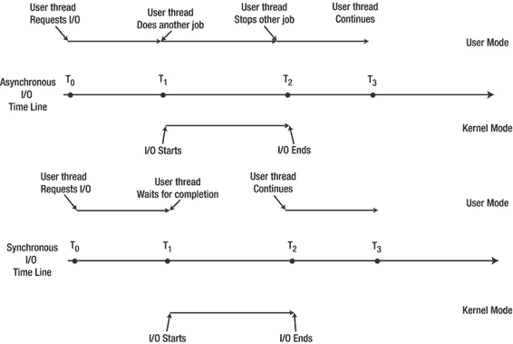
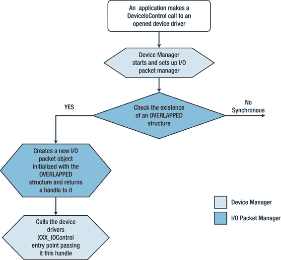

# 流式设备驱动程序与异步 I/O

#### 概述

诸如 `ReadFile` 之类的请求过去是以同步方式执行的。也就是说，应用程序调用 `ReadFile` 来读取设备驱动程序检索到的数据，并一直等待，直到读取操作完成，`ReadFile` 才返回。这给那些将应用程序从桌面 Windows 操作系统移植到 Windows CE 的开发人员带来了额外的困难。由于指向 `OVERLAPPED` 结构的指针被忽略，开发人员必须将其设置为 `NULL`。在桌面 Windows 操作系统中，开发人员使用 `OVERLAPPED` 结构来获取 I/O 操作完成的通知，而无需等待此操作同步完成。这使得应用程序能够继续其逻辑流程，尤其是在执行耗时较长的 I/O 操作时。图 7-3 展示了同步和异步 I/O 请求处理之间的差异。

[www.it-ebooks.info](http://www.it-ebooks.info/)

第 7 章 ■ 流式设备驱动程序的精髓

*图 7-3. 异步与同步 I/O 请求处理*

#### 动机与实现说明

并非每个设备驱动程序都必须提供对异步 I/O 请求处理的支持。为设备驱动程序添加此功能的唯一理由是：调用进程与设备驱动程序之间的数据传输量非常大，以至于在处理耗时较长的 I/O 请求时会导致调用进程被挂起。这就是作为设备驱动程序设计者，你引入支持异步 I/O 请求处理所需的额外复杂性的动机。

其中一种复杂性在于设置线程来处理异步 I/O 请求。由于此类请求由调用进程发起，它会向设备驱动程序传递一个已初始化的 `OVERLAPPED` 结构，驱动程序必须正确响应多个此类请求，因此每个请求都需要单独处理。虽然使用 IST 作为输入请求的处理程序很有诱惑力，但要注意这种做法。原因是 IST 在设备驱动程序初始化期间被初始化，并且对调用进程在 `OVERLAPPED` 结构中传递的事件对象一无所知。更重要的是，IST 是由外围硬件产生的中断触发的，而不是由调用进程的请求触发的。

IST 的任务将在第 8 章讨论，但它绝不承担处理调用进程 I/O 请求的角色，因为调用进程事先并不了解设备驱动程序的硬件交互情况。因此，如果 IST 完成了对硬件初始化时所发起的中断请求的处理，那么它的工作就结束了。当调用进程请求读取这些数据时，设备驱动程序会将数据缓冲区返回给调用方。如果缓冲区足够大，有必要进行异步 I/O 请求处理，则驱动程序应为此请求创建一个专用线程，并在完成后终止该线程。

试图避免为异步 I/O 请求创建专用线程的复杂性，超过了实现这些线程所需的代码量。

[www.it-ebooks.info](http://www.it-ebooks.info/)

第 7 章 ■ 流式设备驱动程序的精髓

#### 实现异步 I/O 请求处理

在 Windows Embedded Compact 7 中，设备管理器的实现得到了扩展，以支持这种异步 I/O 处理模式。如果设备驱动程序被实现为支持此模式，应用程序可以调用 `ReadFile` 并立即返回，而设备驱动程序将启动读取 I/O 操作，并且设备管理器会设置一个事件（该事件由调用应用程序创建，并通过实现 `OVERLAPPED` 结构提供给设备驱动程序），以通知应用程序读取操作已完成。

图 7-4 中的以下流程图展示了设备管理器如何处理 `OVERLAPPED` 结构并将信息传递给设备驱动程序。

*图 7-4. 设备管理器对异步 I/O 调用的处理*

