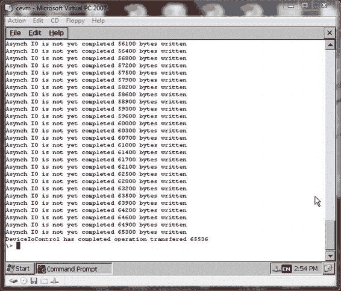

# 第 7 章 ■ 流式设备驱动程序的本质

##### 清单 7-1\. 添加异步 I/O 处理支持

```
BOOL TST_IOControl(DWORD hOpenContext, DWORD dwCode, PBYTE pBufIn, DWORD dwLenIn, PBYTE
pBufOut, DWORD dwLenOut, PDWORD pdwActualOut, HANDLE hAsyncRef)
{
    PTST_DEVCONTXT pDevContxt = (PTST_DEVCONTXT)hOpenContext;
    BOOL bRet = TRUE;
    DWORD dwErr = 0;
    HANDLE hAsyncIO = NULL;
    switch (dwCode)
    {
        case IOCTL_TESTDRVR_ASYNCTEST:
            if (hAsyncRef)
            {
                hAsyncIO = CreateAsyncIoHandle(hAsyncRef,
                (LPVOID*)pBufIn, 0);
            }
            g_AsyncIOParams.pSrcBufIn = (PBYTE)pBufIn;
```


```c
CeOpenCallerBuffer((PVOID*)(&g_AsyncTestParams.pBufIn),
(PVOID)pBufIn, dwLenIn,
ARG_I_PTR, TRUE);

g_AsyncTestParams.hAsyncIO = hAsyncIO;
g_AsyncTestParams.dwInLen = dwLenIn;

g_hAsyncThread =
CreateThread(NULL,163840,
(LPTHREAD_START_ROUTINE)AsyncTestThread,
(LPVOID)&g_AsyncTestParams,
CREATE_SUSPENDED |
STACK_SIZE_PARAM_IS_A_RESERVATION,
NULL);

if (g_hAsyncThread == NULL)
{
DEBUGMSG(ZONE_IOCTL,(_T("TST!失败 …\r\n"))); return FALSE;
}

// 若希望 IO 操作不会永远持续，请提高异步线程优先级
CeSetThreadPriority(g_hAsyncThread, 150);

ResumeThread(g_hAsyncThread);
dwErr = ERROR_IO_PENDING;

[www.it-ebooks.info](http://www.it-ebooks.info/)

第 7 章 ■ 流设备驱动精髓

break;
default:
break;
}

// 传回适当的响应代码
SetLastError(dwErr);
……
 return bRet;
}
```

以下代码展示了线程参数及线程本身。当然这是一个非常简单的示例，你可能需要考虑创建参数结构数组，以支持同时进行多个线程。你可能还希望该结构包含输出缓冲区指针和长度，从而使该结构对输入和输出 I/O 请求处理线程通用。`pSrcBufIn`字段用于关闭指向在`TST_IOControl`函数中创建的已封装调用者缓冲区的指针。

*列表 7-2\. I/O 处理线程*

```c
// I/O 线程的参数结构
typedef struct _IOCTLWTPARAMS_tag
{
volatile HANDLE hAsyncIO;
PBYTE pSrcBufIn;
volatile PBYTE pBufIn;
volatile DWORD dwInLen;
}IOCTLWTPARAMS, *PIOCTLWTPARAMS;

// 全局变量
HANDLE g_hInstance;
IOCTLWTPARAMS g_AsyncTestParams;
HANDLE g_hAsyncThread;

DWORD AsyncTestThread(LPVOID lpParameter)
{
PIOCTLWTPARAMS pParam = (PIOCTLWTPARAMS)lpParameter;
TCHAR buf[65536];
BOOL bComplete = 0;

PBYTE pBuf = pParam->pBufIn;
for (int i = 0; i < (int)pParam->dwInLen; i++)
{
buf[i] = *pBuf++;
if (i % 100 == 0)
{
SetIoProgress(pParam->hAsyncIO, i);
Sleep(50);
}
}

[www.it-ebooks.info](http://www.it-ebooks.info/)

第 7 章 ■ 流设备驱动精髓

if (pParam->hAsyncIO != NULL)
{
bComplete = CompleteAsyncIo(pParam->hAsyncIO, pParam->dwBufLen, 0);
}

// 请记住，我们在 TST_IOControl 中并未关闭调用者缓冲区
hRes = CeCloseCallerBuffer(pParam->pBufIn,
pParam->pSrcBufIn, pParam->dwInLen, ARG_I_PTR);
return 0;
}
```

以下代码是一个非常简单的演示应用程序，它调用异步 I/O 操作。在图 7-5 中，您可以看到运行此演示应用程序的输出结果。

*列表 7-3\. 演示异步 I/O 处理的用户模式应用程序*

```c
#define WRITE_TEST_STRING_SIZE 65536
TCHAR szBuf[WRITE_TEST_STRING_SIZE];

int _tmain(int argc, TCHAR *argv[], TCHAR *envp[])
{
BOOL bRet = FALSE;
volatile OVERLAPPED ovlpd;
HANDLE hCompltEvent = NULL;
HANDLE hTstDrvr = INVALID_HANDLE_VALUE;
DWORD dwBytes = 0;

memset((void*)&ovlpd, 0, sizeof(ovlpd));

// 尝试打开 TestDrvr 的一个实例
hTstDrvr = CreateFile(_T("TST1:"),
GENERIC_READ | GENERIC_WRITE,
0,NULL,OPEN_EXISTING,0,NULL);
if (INVALID_HANDLE_VALUE == hTstDrvr)
{
DWORD bdw = GetLastError();
// 格式化消息并打印
return FALSE;
}

// 为 IOControl IO 操作创建完成事件
ovlpd.hEvent = CreateEvent(NULL, TRUE, FALSE, NULL);
if (!ovlpd.hEvent)
{
DWORD bdw = GetLastError();
// 格式化消息并打印

[www.it-ebooks.info](http://www.it-ebooks.info/)

第 7 章 ■ 流设备驱动精髓

return FALSE;
}

for (int i = 0; i < WRITE_TEST_STRING_SIZE; i++)
{
szBuf[i] = i;
}

bRet = DeviceIoControl(hTstDrvr,IOCTL_TESTDRVR_ASYNCTEST,
szBuf, WRITE_TEST_STRING_SIZE, NULL,
0,NULL,(LPOVERLAPPED)&ovlpd);

while (!bRet) // I/O 尚未完成
{
bRet = GetOverlappedResult(hTstDrvr,
(LPOVERLAPPED)&ovlpd,
&dwBytes, FALSE);
if (!bRet )
{
_tprintf(_T("异步 IO 尚未完成，已写入 %d 字节\r\n"),
ovlpd.InternalHigh);
}
else
{
_tprintf(_T("DeviceIoControl 已完成操作\r\n"));
}
}

CloseHandle(hTstDrvr);
CloseHandle(ovlpd.hEvent);
return 0;
}
```

[www.it-ebooks.info](http://www.it-ebooks.info/)



第 7 章 ■ 流设备驱动精髓

*图 7-5\. 运行异步 IO 请求演示应用程序*

### 内核模式设备驱动程序

设备管理器将所有流设备驱动程序加载到内核空间，作为内核模式驱动程序运行，但那些在注册表中设置了 `DEVFLAGS_LOAD_AS_USERPROC` 标志的设备驱动程序除外。内核模式驱动程序提供最佳性能，因为它们可以使用 `coredll.dll` 的内核版本（名为 `k.coredll.dll`）直接调用内核 API。

内核模式设备驱动程序必须健壮，因为它们对内核数据结构和内核空间内存拥有无限制的访问权限。有缺陷的内核模式设备驱动程序可能会损坏内核内存，从而导致系统崩溃。内核模式设备驱动程序可以非常快速地同步访问用户缓冲区，因为用户内存是直接可用的。

#### 访问检查

流设备驱动程序可以接受来自调用用户模式进程的输入和输出缓冲区，这就带来了一个问题：如何将这些用户模式虚拟内存指针映射到内核模式虚拟内存指针。在 Windows CE 6.0 及更高版本中，内核会对指针参数执行完整的访问检查，因此，驱动程序只需要访问检查嵌入式指针。嵌入式指针意味着用户模式进程在传递给设备驱动程序的缓冲区中嵌入了一个用户模式虚拟地址指针。列表 7-13 是从设备驱动程序向导为 `XXX_IOControl` 函数生成的带注释代码中摘录的，用于演示如何访问嵌入式指针。图 7-6 以图示方式展示了访问检查过程。

*列表 7-13\. 演示嵌入式指针访问的代码片段*

```c
// 以下代码应指导您处理对嵌入式指针的访问
// 包含嵌入式指针的结构
typedef struct _INPUT_tag
{
UCHAR *pEmbedded;
DWORD dwSize;
}INPUT, *PINPUT;

PUCHAR g_pMappedEmbedded

// 代码实现
HRESULT hr = E_WASNEVERSET;
PINPUT pInput = pBufIn;
hr = CeOpenCallerBuffer((PVOID*)&g_pMappedEmbedded,
pInput->pEmbedded,
pInput->dwSize,
ARG_I_PTR,
FALSE);
// 如果 FAILED(hr) == true，则失败

// 处理完嵌入式指针后
hr = CeCloseCallerBuffer((PVOID)g_pMappedEmbedded,
pInput->pEmbedded,
pInput->dwSize,
ARG_I_PTR);
```

*图 7-6\. 访问检查过程示意图*

[www.it-ebooks.info](http://www.it-ebooks.info/)

第 7 章 ■ 流设备驱动精髓

#### 数据封送


