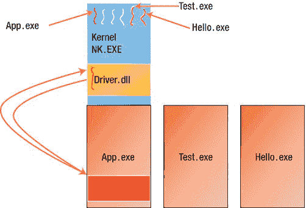
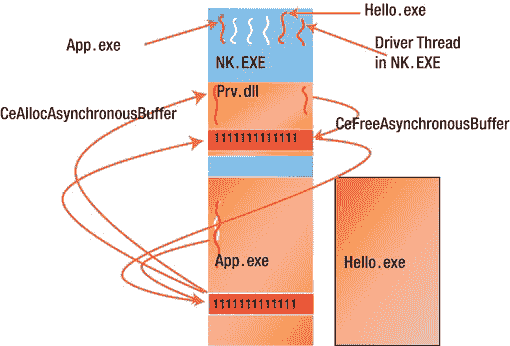
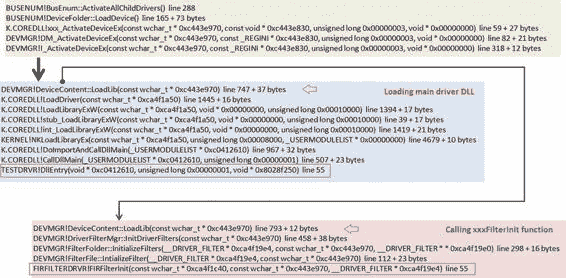
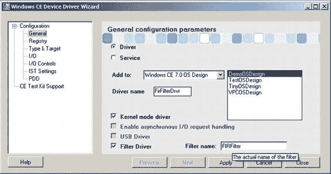

# Windows Embedded Compact 中的封送处理与筛选设备驱动程序

##### 同步与异步指针访问

`封送处理`是将存储在一个内存空间中的数据对象转换为另一个内存空间中可用数据对象的过程。在 Windows CE 6.0 及更高版本中，在用户模式进程与内核模式设备驱动程序之间移动数据对象的过程，取决于这些对象的指针是同步使用还是异步使用。不要将此与我们之前讨论的异步 I/O 请求处理主题混淆，关键在于：同步意味着在调用方的线程上下文中访问调用方的缓冲区。异步意味着设备驱动程序在另一个线程中处理缓冲区，或者调用返回至用户进程后继续处理该缓冲区。这实际上是异步 I/O 请求处理的基础，但它是随着 Windows CE 6.0 中架构的变更而引入的。然而，在 Windows Embedded Compact 7（实际上就是 Windows CE 7.0）中，设备管理器新增了功能，使用户进程能够接收 I/O 操作完成的通知、监控进度，并在 I/O 处理完成前取消操作。图 7-7 和图 7-8 展示了同步和异步访问的示意图。

**指针同步使用：**
- 在调用的整个生命周期内，调用方的地址空间均可访问
- 消除了对内嵌参数和指针参数进行封送处理的需求
- 采用直接访问封送处理

**指针异步使用：**
- 当调用方的地址空间不可用时，确保调用方的缓冲区可访问至关重要
- 使用新的操作系统封送处理辅助 API：`CeAllocAsynchronousBuffer` / `CeFreeAsynchronousBuffer`

[www.it-ebooks.info](http://www.it-ebooks.info/)




第 7 章 ■ 流设备驱动程序精髓

*图 7-7. 同步访问示意图*
*图 7-8. 异步访问示意图*

### 筛选设备驱动程序

筛选设备驱动程序是 Windows Embedded Compact 7 中的一项新功能。筛选设备驱动程序是可选的，基本上它们将自己“插入”到设备驱动程序“之前”，以筛选发送至该设备驱动程序的 I/O 请求。Windows Embedded Compact 中的文档与 Windows 驱动程序模型（WDM）文档类似；然而，它与桌面模型几乎没有可比性。筛选设备驱动程序可以关联总线设备驱动程序、内核模式设备驱动程序、用户模式设备驱动程序，或由 GWES 加载的设备驱动程序。

[www.it-ebooks.info](http://www.it-ebooks.info/)

第 7 章 ■ 流设备驱动程序精髓

筛选设备驱动程序的一个实用示例是用于某些采样低级流设备驱动程序的有限脉冲响应筛选驱动程序。要理解如何开发这样的筛选设备驱动程序，最佳方法是理解设备管理器如何处理其加载，以及它如何与其筛选 I/O 的设备驱动程序相关联。

与桌面模型中筛选驱动程序被插入驱动程序堆栈不同，在 Windows Embedded Compact 中，设备管理器有一个新组件：筛选管理器。筛选管理器管理一个由注册表设置链接在一起的筛选驱动程序列表。当你希望将一个筛选驱动程序与某个流设备驱动程序或任何设备驱动程序关联时，必须将该设备驱动程序的注册表设置中添加一个 `Filter` 键，其分配的值是一个与该筛选驱动程序关联的 GUID。清单 7-14 显示了一个支持筛选驱动程序的设备驱动程序的注册表设置。该设备驱动程序的筛选设备驱动程序的注册表设置项如清单 7-15 所示。

*清单 7-14. 支持筛选驱动程序的示例流设备驱动程序的注册表设置项*

```
; TesTdrvr 驱动程序
[HKEY_LOCAL_MACHINE\Drivers\BuiltIn\Testdrvr]
"Prefix"="TST"
"DLL"="Testdrvr.DLL"
"Order"=dword:0
"DisplayName"="TesTdrvr 驱动程序"
"Flags"=dword:0
"Filter"="{fbf9a438-f6c8-46dc-a278-df2900638f3f}"
```

*清单 7-15. 示例筛选驱动程序的注册表设置项*

```
[HKEY_LOCAL_MACHINE\Drivers\Filters\
{fbf9a438-f6c8-46dc-a278-df2900638f3f}\FIRFilter]
"DLL"="Firfilterdrvr.dll"
"InitEntry"="FIRFilterInit"
; 您可以更改加载顺序，因为这是一个临时值
"Order"=dword:0
; 将此行添加到被筛选的设备驱动程序的注册表设置中
;"Filter"=”{fbf9a438-f6c8-46dc-a278-df2900638f3f}”
```

这个流设备驱动程序是我之前一直使用的示例，只是增加了一个新的 IOCTL 码以帮助演示筛选过程。该筛选驱动程序是使用 Windows CE 设备驱动程序向导创建的，因此清单的最后两行如此显示。图 7-10 展示了如何使用 Windows CE 设备驱动程序向导创建筛选驱动程序。

设备管理器启动其设备驱动程序加载过程，BusEnum 通过调用 `ActivateDeviceEx` 加载 `Testdrvr.dll`。本质上，设备管理器在内部函数 `LoadLib` 中启动加载流设备驱动程序的过程。它首先加载 `Testdrvr.dll` 并分配其所有入口点，然后继续加载相关的筛选驱动程序。一旦筛选驱动程序 DLL 被加载，它会调用筛选驱动程序的注册表设置中 `InitEntry` 键所指向的函数。实际上，这两个驱动程序最初都被加载了。

图 7-9 展示了加载过程的调用堆栈。现在设备管理器调用 `Init` 入口点，这时情况变得有趣，因为两个设备驱动程序被链接在一起，并且筛选驱动程序的 `Init` 入口点首先被调用。如果它执行了初始化筛选驱动程序所需的操作，并且没有触发对 `TST_Init` 的调用，设备管理器不会自行调用它。有关 `FilterInit` 函数的示例，请参见清单 7-17。

[www.it-ebooks.info](http://www.it-ebooks.info/)



第 7 章 ■ 流设备驱动程序精髓

*图 7-9. 流设备驱动程序加载及相关筛选驱动程序的加载与初始化*

筛选驱动程序提供了一个 FIR 筛选器（对于此示例来说确实非常初级），它将以处理来自流设备驱动程序的采样数据。筛选驱动程序实现为一个 C++ 类，派生自 `DriverFilterBase` 类，该类由 Microsoft 在 `C:\WINCE700\public\common\ddk\inc\drfilter.h` 中提供。

清单 7-16 展示了由设备驱动程序向导生成的入门级筛选驱动程序。

*清单 7-16. 示例筛选驱动程序类*

```
class FIRFilter : public DriverFilterBase
{
protected:
    // 从 xxx_Init() 返回的值
    DWORD m_initReturn;
    // 指向此驱动程序所筛选的设备驱动程序的指针
    PDRIVER_FILTER m_pNext;

public:
    FIRFilter(LPCTSTR lpcFilterRegistryPath,
              LPCTSTR lpcDriverRegistryPath,
              PDRIVER_FILTER pNextFilterParam);
    ~FIRFilter();

    DWORD FilterInit(DWORD dwContext, LPVOID lpParam);
    BOOL FilterPreDeinit(DWORD dwContext);
    BOOL FilterDeinit(DWORD dwContext);
    DWORD FilterOpen(DWORD dwContext, DWORD AccessCode,
                     DWORD ShareMode);
```

[www.it-ebooks.info](http://www.it-ebooks.info/)



第 7 章 ■ 流设备驱动程序精髓

```
    BOOL FilterPreClose(DWORD dwOpenCont);
    BOOL FilterClose(DWORD dwOpenCont);
    BOOL FilterControl(DWORD dwOpenCont, DWORD dwCode,
                       PBYTE pBufIn,
                       DWORD dwLenIn, PBYTE pBufOut, DWORD dwLenOut,
                       PDWORD pdwActualOut, HANDLE hAsyncRef);
    void FilterPowerdn(DWORD dwConext);
    void FilterPowerup(DWORD dwConext);
    DWORD FilterRead(DWORD dwOpenCont, LPVOID pBuffer,
                     DWORD Count);
    DWORD FilterWrite(DWORD dwOpenCont, LPCVOID pSourceBytes,
                      DWORD NumberOfBytes);
    DWORD FilterSeek(DWORD dwOpenCont, long Amount, DWORD Type);
    BOOL FilterCancelIo(DWORD dwOpenCont, HANDLE hAsyncHandle);
};
```


