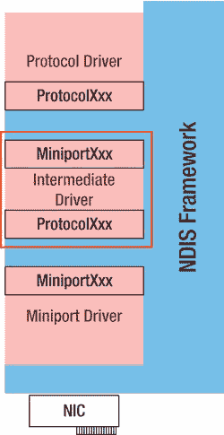

# 第 10 章 ■ 网络驱动程序接口规范与网络设备驱动程序

##### `MiniportShutdownEx`

系统关闭时会调用此函数。它负责禁用中断、使传输单元进入空闲状态，并尝试强制复位。清单 10-9 展示了一个通过调用两个驱动程序本地函数来对 NIC 硬件执行上述操作的示例。

*清单 10-9. `MiniportShutdownEx` 函数实现示例*

```c
VOID MPShutdown(IN NDIS_HANDLE MiniportAdapterContext,
IN NDIS_SHUTDOWN_ACTION ShutdownAction)
{
PMP_ADAPTER Adapter = (PMP_ADAPTER)MiniportAdapterContext;

// 禁用中断并执行完全复位
NICDisableInterrupt(Adapter);
NICIssueFullReset(Adapter);
}
```

##### `MiniportCheckForHangEx`

此函数仅用于检查网络适配器的内部状态，并在检测到 NIC 适配器运行异常时返回 `TRUE` 。清单 10-10 展示了一个检查硬件错误或故障、发送挂起以及介质状态的示例。

*清单 10-10. `MiniportCheckForHangEx` 函数实现示例*

```c
BOOLEAN MPCheckForHang(IN NDIS_HANDLE MiniportAdapterContext)
{
PMP_ADAPTER Adapter = (PMP_ADAPTER) MiniportAdapterContext;
NDIS_MEDIA_CONNECT_STATE CurrMediaState;
PMP_TCB pMpTcb;
BOOLEAN NeedReset = TRUE;

do
{
// 如果适配器正在进行链路检测，则跳过此代码块
if ((Adapter->Flags & F_MP_ADAPTER_LINK_DETECTION) != 0)
{
NeedReset = FALSE;
break;
}

// 发生任何不可恢复的硬件错误
if ((Adapter->Flags & F_MP_ADAPTER_NON_RECOVER_ERROR)
!= 0)
{
break;
}

// 发生任何硬件故障
if ((Adapter->Flags & F_MP_ADAPTER_HARDWARE_ERROR)
!= 0)
{
break;
}

// 发送挂起？
NdisAcquireSpinLock(&Adapter->SendLock);
if (Adapter->nBusySend > 0)
{
pMpTcb = Adapter->CurrSendHead;
pMpTcb->Count++;
if (pMpTcb->Count > NIC_SEND_HANG_THRESHOLD)
{
NdisReleaseSpinLock(&Adapter->SendLock);
break;
}
}

NeedReset = FALSE;

NdisReleaseSpinLock(&Adapter->SendLock);
NdisAcquireSpinLock(&Adapter->RcvLock);

// 更新 RFD 缩减计数
if (Adapter->CurrNumRfd > Adapter->NumRfd)
{
Adapter->RfdShrinkCount++;
}

NdisReleaseSpinLock(&Adapter->RcvLock);

NdisAcquireSpinLock(&Adapter->Lock);
CurrMediaState = NICGetMediaState(Adapter);

if (CurrMediaState != Adapter->MediaState)
{
Adapter->MediaState = CurrMediaState;
MPIndicateLinkState(Adapter);
}

NdisReleaseSpinLock(&Adapter->Lock);
}
while (FALSE); // do while 代码块结束

return NeedReset;
}
```

[www.it-ebooks.info](http://www.it-ebooks.info/)

##### `MiniportResetEx`

此函数用于复位 NIC 适配器硬件设备。它首先检查是否已有另一个复位操作正在进行或被挂起。然后它会终止所有待处理的请求，确保复位过程中不会意外唤醒。如果存在硬件错误或故障，则请求 `NDIS` 移除微型端口。禁用中断并复位硬件。释放发送缓冲区并重启接收单元。清单 10-11 展示了一个使用驱动程序本地辅助函数的复位函数示例。

*清单 10-11. `MiniportResetEx` 函数实现示例*

```c
NDIS_STATUS MPReset(IN NDIS_HANDLE MiniportAdapterContext,
OUT PBOOLEAN AddressingReset)
{
NDIS_STATUS Status;
PNDIS_OID_REQUEST PendingRequest;
PMP_ADAPTER Adapter = (PMP_ADAPTER) MiniportAdapterContext;

*AddressingReset = TRUE;

NdisAcquireSpinLock(&Adapter->Lock);
NdisDprAcquireSpinLock(&Adapter->SendLock);
NdisDprAcquireSpinLock(&Adapter->RcvLock);

ASSERT(!(Adapter->Flags & F_MP_ADAPTER_HALT_IN_PROGRESS)
!= 0));

// 此适配器是否已在执行复位操作？
}
```


```c
if (Adapter->Flags & F_MP_ADAPTER_RESET_IN_PROGRESS) != 0)
{
    Status = NDIS_STATUS_RESET_IN_PROGRESS;
    goto exit;
}

Adapter->Flags |= F_MP_ADAPTER_RESET_IN_PROGRESS;

// 中止任何待处理请求
if (Adapter->PendingRequest != NULL)
{
    PendingRequest = Adapter->PendingRequest;
    Adapter->PendingRequest = NULL;
    NdisDprReleaseSpinLock(&Adapter->RcvLock);
    NdisDprReleaseSpinLock(&Adapter->SendLock);
    NdisReleaseSpinLock(&Adapter->Lock);
    NdisMOidRequestComplete(Adapter->AdapterHandle,
                            PendingRequest,
                            NDIS_STATUS_REQUEST_ABORTED);
    NdisAcquireSpinLock(&Adapter->Lock);
    NdisDprAcquireSpinLock(&Adapter->SendLock);
    NdisDprAcquireSpinLock(&Adapter->RcvLock);
}

MPRemoveAllWakeUpPatterns(Adapter);

// 此适配器是否正在进行链路检测？
if (Adapter->Flags & F_MP_ADAPTER_LINK_DETECTION) != 0)
{
    DEBUGMSG(ZONE_WARN, ("重置已挂起...\n"));
    Status = NDIS_STATUS_PENDING;
    Adapter->bResetPending = TRUE;
    goto exit;
}

// 此适配器是否即将被移除？
if (Adapter->Flags & F_MP_ADAPTER_NON_RECOVER_ERROR) != 0)
{
    Status = NDIS_STATUS_HARD_ERRORS;
    if (Adapter->Flags & F_MP_ADAPTER_REMOVE_IN_PROGRESS) != 0)
    {
        goto exit;
    }

    // 这是不可恢复的硬件故障。
    // 需要通知 NDIS 移除该微型端口
    Adapter->Flags |= F_MP_ADAPTER_REMOVE_IN_PROGRESS;
    Adapter->Flags &= ~F_MP_ADAPTER_RESET_IN_PROGRESS;
    NdisDprReleaseSpinLock(&Adapter->RcvLock);
    NdisDprReleaseSpinLock(&Adapter->SendLock);
    NdisReleaseSpinLock(&Adapter->Lock);
    NdisWriteErrorLogEntry(Adapter->AdapterHandle,
                           NDIS_ERROR_CODE_HARDWARE_FAILURE, 1, ERRLOG_REMOVE_MINIPORT);
    NdisMRemoveMiniport(Adapter->AdapterHandle);
    return Status;
}

// 禁用中断并向 NIC 发出重置命令
NICDisableInterrupt(Adapter);
NICIssueSelectiveReset(Adapter);

// 释放所有锁，然后重新获取发送锁，
// 清理发送队列（涉及调用 Ndis 框架），
// 释放所有锁后再获取发送锁以避免死锁
NdisDprReleaseSpinLock(&Adapter->RcvLock);
NdisDprReleaseSpinLock(&Adapter->SendLock);
NdisReleaseSpinLock(&Adapter->Lock);
NdisAcquireSpinLock(&Adapter->SendLock);

// 释放 SendWaitList 上的数据包
MpFreeQueuedSendNetBufferLists(Adapter);

// 释放正在主动发送和已停止的数据包
MpFreeBusySendNetBufferLists(Adapter);

NdisZeroMemory(Adapter->MpTcbMem,
               Adapter->NumTcb * sizeof(MP_TCB));

// 重新初始化发送结构
NICInitSend(Adapter);
NdisReleaseSpinLock(&Adapter->SendLock);

// 按正确顺序重新获取所有锁
NdisAcquireSpinLock(&Adapter->Lock);
NdisDprAcquireSpinLock(&Adapter->SendLock);
NdisDprAcquireSpinLock(&Adapter->RcvLock);

// 重置 RFD 列表并重新启动 RU
NICResetRecv(Adapter);
Status = NICStartRecv(Adapter);
if (Status != NDIS_STATUS_SUCCESS)
{
    // 是否在连续几次重置中都出现故障？
    if (Adapter->HwErrCount < NIC_HARDWARE_ERROR_THRESHOLD)
    {
        // 尚未超过阈值，允许继续
        Adapter->HwErrCount++;
    }
    else
    {
        // 这是不可恢复的硬件故障。
        // 我们需要告知 NDIS 移除该微型端口
        Adapter->Flags |= F_MP_ADAPTER_REMOVE_IN_PROGRESS;
        Adapter->Flags &= ~F_MP_ADAPTER_RESET_IN_PROGRESS;
        NdisDprReleaseSpinLock(&Adapter->RcvLock);
        NdisDprReleaseSpinLock(&Adapter->SendLock);
        NdisReleaseSpinLock(&Adapter->Lock);
        NdisWriteErrorLogEntry(Adapter->AdapterHandle,
                               NDIS_ERROR_CODE_HARDWARE_FAILURE, 1,
                               ERRLOG_REMOVE_MINIPORT);
        NdisMRemoveMiniport(Adapter->AdapterHandle);
        return Status;
    }
    return Status;
}

Adapter->HwErrCount = 0;
Adapter->Flags &= ~F_MP_ADAPTER_HARDWARE_ERROR;
NICEnableInterrupt(Adapter);
Adapter->Flags &= ~F_MP_ADAPTER_RESET_IN_PROGRESS;

exit:
NdisDprReleaseSpinLock(&Adapter->RcvLock);
NdisDprReleaseSpinLock(&Adapter->SendLock);
NdisReleaseSpinLock(&Adapter->Lock);
return(Status);
```

##### 物理数据传输

在上述所有示例中，我抽象地使用了局部函数来处理各类硬件 I/O 接口。所描述的微型端口函数为上层 NDIS 驱动程序提供了一个上层边缘接口，以便从微型端口驱动程序获取服务。然而，微型端口驱动程序仍需完成其"驱动"实际网络接口卡（NIC）的主要任务，即对硬件端口/寄存器进行数据读写和配置属性操作。它还需要处理用于事务数据的内存缓冲区。

NDIS 框架为微型端口驱动程序提供了一个与硬件交互的下层边缘接口。它提供了一组函数，供微型端口网络适配器（NIC）驱动程序用于访问 I/O 端口。这些调用提供了一个标准的可移植接口，支持面向 NDIS 驱动程序的多种操作系统。

框架提供了用于映射端口、申请 I/O 资源，以及对已映射和未映射的 I/O 端口进行读写操作的函数。如果你决定自行实现端口映射和资源管理，NDIS 框架提供了一组原始 I/O 端口接口函数，例如`NdisRawReadPortXxx`，其中`Xxx`表示端口的字节大小。但这些函数特定于基于端口 I/O 的体系结构。

对于内存映射 I/O 体系结构，NDIS 框架提供了一组函数，用于将 NIC 寄存器映射到系统内存：`NdisMMapIoSpace` 用于将给定的设备 RAM 或寄存器的物理范围映射到系统空间的虚拟范围；同时提供了一组函数，例如`NdisReadRegisterXxx`，其中`Xxx`表示寄存器的字节大小。

#### NDIS 内存管理辅助函数

考虑到 NIC（网络接口卡）及其微型端口驱动程序的性能，我们必须意识到，当数据在 NIC 和计算机内存之间移动时会出现瓶颈。从网络接口卡将信息传输到计算机的两种最高效的方法是总线主控 DMA 和共享内存。提供总线主控 DMA 的 NIC 控制器会接管系统总线，将数据从 NIC 传输到内存位置，从而降低 CPU 负载。在共享内存方案中，要么 NIC 拥有自己的内存，系统处理器可以直接访问；要么 CPU 和 NIC 共享一块两者都可以直接访问的系统内存块。

##### 共享内存

NDIS 框架为微型端口驱动程序开发者提供了一组函数来实现共享内存方案。核心函数是`NdisMAllocateSharedMemory`。该函数同时提供驱动程序用于访问共享内存块的映射虚拟地址范围，以及网络适配器使用的`NDIS_PHYSICAL_ADDRESS`类型范围。此函数只能从`MiniportInitializeEx`入口点调用。共享内存的最大问题在于其大小。一方面，在网络流量较高的情况下，如果微型端口驱动程序共享内存资源不足，则无法维持高 I/O 吞吐量。


共享内存空间用于存放设备可访问的数据缓冲区。因此，您可以尝试预估一些最大传输需求并设置共享内存大小来满足这些需求。但这会导致驱动程序映像体积过大，且资源使用率在大多数情况下非常低效。另一个问题是，如果 `NdisMAllocateSharedMemory` 因系统内存不足而无法分配请求的大小，则会导致驱动程序初始化失败。请注意，尽管内核模式驱动程序通常使用非缓存内存，但在这种情况下您应考虑使用缓存内存，因为非缓存内存是稀缺的，因此较大的内存分配应来自缓存内存。

##### 散聚 DMA

这是性能首选的内存方案。NDIS 在将数据缓冲区发送到微型端口驱动程序之前不会对其进行映射。相反，NDIS 为驱动程序提供了一个接口来映射网络数据。因此，微型端口驱动程序可以通过将小型或高度碎片化的数据包复制到具有已知物理地址的预分配缓冲区来优化其传输。这还避免了不必要的映射，从而提高了系统性能。NDIS 可以安全地将多个缓冲区发送到微型端口驱动程序。这减少了对微型端口驱动程序的调用次数，从而提升了系统性能。最后，微型端口驱动程序可以将 SG 列表的内存作为传输描述符块的一部分进行预分配。因此，NDIS 或微型端口驱动程序无需在运行时为 SG 列表分配内存。

NDIS 框架提供了以下函数来处理散聚 DMA 事务：`NdisMAllocateNetBufferSGList`

总线主控微型端口驱动程序调用此函数以获取与 `NET_BUFFER` 结构关联的网络数据的散聚列表。

`NdisMAllocateSharedMemoryAsyncEx`

微型端口驱动程序调用此函数来分配驱动程序与其总线主控 DMA NIC 之间共享的额外内存，通常是在微型端口驱动程序可用的 NIC 接收缓冲区不足时调用。

`NdisMRegisterScatterGatherDma`

总线主控微型端口驱动程序从 `MiniportInitializeEx` 调用此函数以初始化散聚 DMA 通道。

`NdisMDeregisterScatterGatherDma`

总线主控微型端口驱动程序调用此函数以释放使用 `NdisMRegisterScatterGatherDma` 函数分配的 DMA 资源。

`NdisMFreeNetBufferSGList`

总线主控微型端口驱动程序调用此函数以释放通过调用 `NdisMAllocateNetBufferSGList` 函数分配的散聚列表资源。

[www.it-ebooks.info](http://www.it-ebooks.info/)

## 第 10 章 ■ 网络驱动程序接口规范与网络设备驱动程序

### NDIS 协议驱动程序

协议驱动程序实现了 OSI 模型（图 10-4）的网络层和传输层。因此，它确保消息无差错、按顺序、无丢失或无重复地传递。此外，它还根据以下因素确定数据应采用的物理路径：

- 网络状况
- 服务优先级
- 其他因素，例如路由、流量控制、帧分段与重组、逻辑地址到物理地址的映射以及使用计费

协议驱动程序与 NDIS 通信以发送和接收网络数据。它在其下边缘实现并导出一组 `ProtocolXxx` 函数，并绑定到在其上边缘导出 `MiniportXxx` 接口的底层微型端口驱动程序。它必须在 `DriverEntry` 中分配驱动程序资源并注册所需的 `ProtocolXxx` 函数。要向 NDIS 框架注册 `ProtocolXxx` 函数和协议驱动程序，您必须设置 `NDIS_PROTOCOL_DRIVER_CHARACTERISTICS` 结构并调用 `NdisRegisterProtocolDriver`。

NDIS 协议驱动程序提供以下 `ProtocolXxx` 函数；最后两个函数用于发送和接收操作：

`ProtocolSetOptions`

这是一个可选函数。它注册可选服务并可分配其他驱动程序资源。它调用 `NdisSetOptionalHandlers` 来覆盖其默认入口点。它与之前描述的 `MiniportSetOptions` 函数非常相似，因此您目前完全可以不实现它。

`ProtocolBindAdapterEx`

这是一个必需函数。NDIS 框架调用此函数以绑定到底层微型端口适配器。在其实现中，应使用 `NdisAllocateNetBufferListPool` 创建发送和接收缓冲区列表池，然后调用 `NdisOpenAdapterEx` 函数来建立协议驱动程序与底层驱动程序之间的绑定。如果对 `NdisOpenAdapterEx` 的调用返回 `NDIS_STATUS_PENDING`，您应等待来自 `ProtocolOpenAdapterCompleteEx` 的信号以指示完成。如果对 `NdisOpenAdapterEx` 的调用返回 `NDIS_STATUS_SUCCESS`，您可以继续调用 `NdisQueryAdapterInstanceName` 来检索调用协议所绑定的物理网络适配器（或虚拟适配器）的友好名称。使用 `NDIS_BIND_PARAMETERS` 结构的 `CurrentMacAddress` 字段，您可以检索媒体连接状态和 MAC 选项。

`ProtocolUnbindAdapterEx`

这是一个必需函数。它是 `ProtocolBindAdapterEx` 函数的镜像；NDIS 框架调用 `ProtocolUnbindAdapterEx` 来释放驱动程序为特定绑定的网络 I/O 操作所分配的资源。此函数的实现必须调用 `NdisCloseAdapterEx` 函数来关闭与底层微型端口适配器的绑定。协议驱动程序不能使解绑定操作失败。

[www.it-ebooks.info](http://www.it-ebooks.info/)

## 第 10 章 ■ 网络驱动程序接口规范与网络设备驱动程序

`ProtocolOpenAdapterCompleteEx`

这是一个必需函数。这是 `NdisOpenAdapterEx` 函数的完成例程。此函数的实现简单地通知进行打开适配器调用 `NdisOpenAdapterEx` 的线程，以指示操作完成。

`ProtocolCloseAdapterCompleteEx`

这是一个必需函数。与 `ProtocolOpenAdapterCompleteEx` 函数类似，这是一个完成例程，但用于 `NdisCloseAdapterEx` 函数。此函数的实现简单地通知进行关闭适配器调用 `NdisCloseAdapterEx` 的线程，以指示操作完成。

`ProtocolNetPnPEvent`

此函数对于支持即插即用和电源管理的协议驱动程序是必需的。实现根据通过 `NET_PNP_EVENT_NOTIFICATION` 结构传递的事件类型进行分支处理，并根据协议驱动程序的设计处理需要的内容。例如，它可以处理电源管理通知或重启通知。

`ProtocolUninstall`

此函数是可选的。如果实现，此函数在协议驱动程序被卸载前执行清理工作。

`ProtocolReceiveNetBufferLists`

如果为底层微型端口驱动程序实现了散聚 DMA，则此函数对于协议驱动程序是必需的。NDIS 框架在绑定的微型端口驱动程序调用 `NdisMIndicateReceiveNetBufferLists` 函数后调用此函数。网络缓冲区列表仅适用于 NDIS 6.x 版本。如果 `ReceiveFlags` 参数中的 `NDIS_RECEIVE_FLAGS_RESOURCES` 标志未设置，协议驱动程序将保留 `NET_BUFFER_LIST` 结构的所有权，直到它调用 `NdisReturnNetBufferLists` 函数。该函数的原型见清单 10-12。

*清单 10-12. `ProtocolReceiveNetBufferLists` 函数的原型*

```
VOID ProtocolReceiveNetBufferLists(
    IN NDIS_HANDLE ProtocolBindingContext,
    IN PNET_BUFFER_LIST pNetBufferLists,
    IN NDIS_PORT_NUMBER PortNumber,
    IN ULONG NumberOfNetBufferLists,
    IN ULONG ReceiveFlags)
```

[www.it-ebooks.info](http://www.it-ebooks.info/)

## 第 10 章 ■ 网络驱动程序接口规范与网络设备驱动程序


```c
void ProtocolSendNetBufferListsComplete(
    IN NDIS_HANDLE ProtocolBindingContext,
    IN PNET_BUFFER_LIST pNetBufferLists,
    IN ULONG SendCompleteFlags
);
```

**`ProtocolSendNetBufferListsComplete` 函数的原型：**

```c
VOID ProtocolSendNetBufferListsComplete(
    IN NDIS_HANDLE ProtocolBindingContext,
    IN PNET_BUFFER_LIST pNetBufferLists,
    IN ULONG SendCompleteFlags
);
```

其中传递给函数的参数为：

- `ProtocolBindingContext` - 指向打开上下文的指针
- `pNetBufferLists` - 正在被向上指示的 `Net Buffer` 列表的链表。
- `PortNumber` - 接收 NBL 的端口
- `NumberOfNetBufferLists` - 本次调用中包含的 `NetBufferLists` 数量
- `ReceiveFlags` - 与接收操作相关的标志

`ProtocolSendNetBufferListsComplete`

如果底层微型端口驱动程序实现了分散/聚合 DMA，则此函数是协议驱动程序所必需的。此函数执行完成发送操作所需的任何后处理。例如，协议驱动程序可以通知请求发送数据的客户端操作已完成。

NDIS 框架在底层微型端口驱动程序调用 `NdisMSendNetBufferListsComplete` 函数后调用此函数。发送操作的完成意味着底层微型端口驱动程序已传输了指定的网络数据。此函数的原型见列表 10-13。

*列表 10-13. `ProtocolSendNetBufferListsComplete` 函数的原型*

```
VOID ProtocolSendNetBufferListsComplete(
    IN NDIS_HANDLE ProtocolBindingContext,
    IN PNET_BUFFER_LIST pNetBufferLists,
    IN ULONG SendCompleteFlags
);
```

其中传递给函数的参数为：

- `ProtocolBindingContext` - 指向打开上下文的指针
- `pNetBufferLists` - 正在被向上指示的 `Net Buffer` 列表的链表
- `SendCompleteFlags` - 可通过 OR 操作组合的 NDIS 标志

### NDIS 中间层驱动程序

NDIS 中间层驱动程序位于上层协议驱动程序和硬件级微型端口驱动程序之间。NDIS 中间层驱动程序应被视为一个分层微型端口驱动程序。分层微型端口驱动程序向上层协议驱动程序暴露微型端口接口，向下层 NIC 微型端口驱动程序暴露协议驱动程序接口。在分层微型端口驱动程序结构中，协议驱动程序与分层微型端口驱动程序底部的微型端口驱动程序进行通信。分层微型端口驱动程序在其上边缘导出 `MiniportXxx` 函数，在其下边缘导出 `ProtocolXxx` 函数。中间层驱动程序的微型端口接口可被称为虚拟微型端口。它是“虚拟”的，因为它不直接控制 NIC。相反，它依赖底层微型端口驱动程序与物理设备进行通信。图 10-5 说明了分层 NDIS 微型端口驱动程序架构。

[www.it-ebooks.info](http://www.it-ebooks.info/)



*图 10-5. 分层 NDIS 微型端口驱动程序与 NDIS 架构中其他驱动程序之间的关系*

以下示例说明了中间层驱动程序的各种用法：

- 在旧版传输驱动程序与管理传输驱动程序未知媒体类型的微型端口驱动程序之间进行媒体转换
- 用于安全或其他目的的数据过滤
- 负载均衡故障转移 (LBFO) 解决方案
- 监控和收集网络数据统计信息

NDIS 中间层驱动程序在其 `DriverEntry` 例程的上下文中注册其 `MiniportXxx` 函数和 `ProtocolXxx` 函数。要注册其微型端口函数，驱动程序必须将 `NDIS_MINIPORT_DRIVER_CHARACTERISTICS` 结构中的 `Flags` 设置为 `NDIS_INTERMEDIATE_DRIVER` 标志，并调用 `NdisMRegisterMiniportDriver` 函数。否则，设置 `NDIS_MINIPORT_DRIVER_CHARACTERISTICS` 的方式与任何其他微型端口驱动程序相同。要注册其 `ProtocolXxx` 函数，中间层驱动程序必须调用 `NdisRegisterProtocolDriver` 函数。

##### 注册表设置

NDIS 网络驱动程序的注册表设置围绕由设备管理器加载的 NDIS 设备驱动程序展开。NDIS 反过来负责加载和运行网络驱动程序。注册表允许 NDIS 加载驱动程序，然后调用其 `DriverEntry` 例程，并继续驱动程序的初始化和运行。微型端口驱动程序和适配器实例的注册表信息必须在 `HKEY_LOCAL_MACHINE\Comm\` 中进行配置。列表 10-14 是此类注册表信息的通用模板。

*列表 10-14. NDIS 微型端口驱动程序的通用注册表信息*

```
[HKEY_LOCAL_MACHINE\Comm\<MiniportDriverName>]
"Group"="NDIS"
"ImagePatch"="<driver>.dll"

[HKEY_LOCAL_MACHINE\Comm\<AdapterInstanceName>\Parms]
"BusNumber"=dword:<busnumber>
"BusType"=dword:<bustype>
<其他微型端口驱动程序所需的参数，例如 IRQ、IOAddr、TcpIP 等>
```

一个能很好说明这一点的具体示例是任何 NE2000 兼容适配器的注册表项设置。列表 10-15 摘自 `common.reg`。

*列表 10-15. NE2000 网络适配器的注册表信息*

```
[HKEY_LOCAL_MACHINE\Comm\NE20001]
;LOC_FRIENDLYNE2000COMPAT
"DisplayName"=mui_sz:"netmui.dll,#9001"
"Group"="NDIS"
"ImagePath"="ne2000.dll"

[HKEY_LOCAL_MACHINE\Comm\NE20001\Parms]
"BusNumber"=dword:0
"BusType"=dword:8
"InterruptNumber"=dword:03
"IoBaseAddress"=dword:0300
"Transceiver"=dword:3
"CardType"=dword:1

[HKEY_LOCAL_MACHINE\Comm\NE20001\Parms\Tcpip]
"EnableWINS"=dword:1
```

如果 NE2000 适配器是 PCI 总线适配器，则它必须在 `HKLM\Drivers\BuiltIn\PCI\Template` 节点下拥有注册表信息条目。以下列表 (10-16) 是 NE2000 PCI NIC 的注册表信息：

*列表 10-16. NE2000 兼容 PCI 适配器的注册表信息*

```
[HKEY_LOCAL_MACHINE\Drivers\BuiltIn\PCI\Template\NE2000]
"Dll"="NDIS.dll"
"Class"=dword:02
"SubClass"=dword:00
"ProgIF"=dword:0
"VendorID"=multi_sz:"10ec","1050"
"DeviceID"=multi_sz:"8029","0940"
; "Entry"="NdisPCIBusDeviceInit"
"Prefix"="NDS"
; Flags==2 是 DEVFLAGS_LOADLIBRARY
"Flags"=dword:2
"Transceiver"=dword:3
```

值得记住的是，NE2000 不使用 `giisr.dll` 中的通用 ISR，而是加载自身的 `NE2000ISR.dll` 中的 ISR 来处理中断。

### 章节总结

本章专门介绍网络驱动程序，重点放在网络适配器卡的驱动程序上。因此，对 NIC 微型端口驱动程序的强调多于对协议驱动程序或中间层驱动程序的强调。NIC 微型端口驱动程序负责使用 NDIS 框架为开发人员提供的 API 来与硬件接口，以处理高性能网络硬件。它为驱动程序开发人员提供了使用分散/聚合 DMA 接收和发送大量数据、执行内存映射 I/O 或端口映射 I/O 操作的函数。它提供了处理硬件信息、内务处理、中断和同步的函数。所有这些 API 都使得设备驱动程序能够跨操作系统移植，并降低了开发网络适配器驱动程序的难度。最后关于 NIC 设备驱动程序的说明是，您不能在引导加载程序中使用 NDIS 驱动程序，因为 NDIS 不是引导加载程序的一部分。这意味着支持引导加载程序的网络设备驱动程序必须在驱动程序代码中实现所有硬件接口。

[www.it-ebooks.info](http://www.it-ebooks.info/)

**第 11 章**

**调试设备驱动程序**


