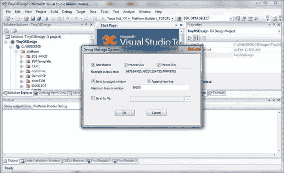

# 调试设备驱动程序

您能说出哪位开发者能编写出除了"Hello World"程序之外毫无缺陷的软件单元吗？我想不能。软件开发周期如此漫长的主要原因在于代码实现中的错误，即所谓的"bug"（"调试"一词便用来描述从软件中筛除这些错误的过程）。软件中存在 bug 的最终结果是可执行文件迟早会运行失败。管理硬件的软件开发复杂性直接导致了更复杂且难以修复的多重 bug。最难修复的 bug 是那些偶发且难以重现的。这些通常是逻辑错误而非编码错误。内核模式设备驱动程序还存在一个额外风险：如果其代码发生故障，系统可能崩溃。

本章内容

* 可用工具概述
* 使用最简单的工具
* 调试区域
* 内核调试器
* 硬件辅助调试
* 事后调试

### 调试工具与技术概述

编写健壮的代码是发现并修复 bug 的关键。在可能发生错误的地方添加错误处理代码不仅是良好的编码实践，更是编写设备驱动程序代码时必须遵守的准则。每当调用 API 时，都要检查返回值并进行错误恢复处理。同样，操作内存和内存指针的代码，以及可能失败的算术运算（如经典的除零错误）也需如此。话虽如此，由于编码错误或逻辑错误仍会存在于代码中（至少在我的代码中是这样），因此有多种调试工具可用于调试设备驱动程序。

A. Kcholi  
*《精通 Windows Embedded Compact 7》*  
© Abraham Kcholi 2011

[www.it-ebooks.info](http://www.it-ebooks.info/)

### 调试技术

所有调试技术中最简单的是将调试消息输出到调试终端。这项技术对于调试设备驱动等软件极为有价值。该技术侵入性最小，因为它不会中断设备驱动程序的执行和流程。包括 Windows Embedded Compact 7 在内的所有 Windows CE 版本都提供了一个极其有用的工具，可通过调试区域有条件地输出调试消息。这很有帮助，因为它可以控制显示的大量消息，从而允许您仅查看与所调试代码特定区域相关的消息。例如，如果您正在调试设备驱动程序的 IST，可以将调试消息限制为仅在 IST 代码中触发的那些，这样就不会收到来自设备驱动程序每个函数的数百条消息。

其他技术涉及软件和硬件调试器。虽然软件调试器（如内核调试器）在调试初始化、打开设备驱动程序实例以及反初始化和关闭设备驱动程序实例时非常有用，但在调试处理 I/O 数据事务的设备驱动程序代码时可能能力不足。这就需要利用芯片调试能力的硬件调试器。

#### 调试工具

这些工具包括 Platform Builder 提供的工具，例如：

* 调试区域
* 内核调试器
* 目标控制

Lauterbach 的 TRACE32 是一款第三方工具，可与 CPU 硬件内置的调试能力交互。

* TRACE32 调试器
* Lauterbach 的 eXDI 硬件调试驱动程序

### 简单高效的调试技术

如上所述，调试技术种类繁多；然而，要实现有效且高效，明智的做法是将技术应用于我们正在调试的特定代码。设备驱动程序对调试技术尤其敏感，因为与硬件的紧密交互以及时序敏感性可能不允许始终使用断点来停止执行流程并检查代码以尝试隔离 bug。

虽然可以合理地假设初始化和反初始化代码使用软件调试器（如内核调试器）并在`XXX_Init`入口点等函数中设置断点应该没有问题，但如果我们必须调试设备驱动程序的 IST，这很可能成为问题。要调试时序敏感代码和直接寻址硬件寄存器的代码，我们可能更倾向于使用不那么侵入性的技术，例如调试消息或硬件跟踪技术。

在调试设备驱动程序时，最好手动加载设备驱动程序。这意味着，与其让设备管理器在系统启动时加载设备驱动程序，迫使您在系统加载设备驱动程序时执行调试，不如在您准备好调试时控制加载。要做到这一点，只需创建一个简单应用程序，调用`ActivateDeviceEx`来加载设备驱动程序即可。

[www.it-ebooks.info](http://www.it-ebooks.info/)

#### 调试消息

调试消息是在执行单元执行时获取有意义信息的最不具侵入性的方法。调试消息不会停止执行，并且根据其格式化方式，可以提供丰富的信息。适当格式化的调试消息对于不熟悉您代码实现细节的其他开发者也很有用。以下一些指导原则应能帮助您为当前任务良好地格式化调试消息。

* 指定消息来源
* 编写有意义的消息
* 调试消息应易于不熟悉实现代码的人员（如测试人员）理解
* 使用一致的符号突出显示重要类型的消息以帮助识别
* 使用调试区域过滤输出

您可以添加消息来源的文件名和行号，以便快速定位。

```
DEBUGMSG(ZONE_INIT, (_T("DMO!Error Getting window information\r\n"), _T(__FILE__), _T(__LINE__)));
```

您可以通过在输出字符串中添加"**DMO!**"来标识组件（例如设备驱动程序）的前缀，正如刚才的消息所示。您可以从 Platform Builder IDE 的`<Target>`菜单中打开"调试消息选项"对话框，以在消息中包含时间戳、进程 ID 和线程 ID 信息。请参见图 11-1。

[www.it-ebooks.info](http://www.it-ebooks.info/)



解释字符串应阐明消息旨在传达的内容，例如指示名为某某的 ISR 处理程序已为特定 IRQ 安装。

```
DEBUGMSG(ZONE_INIT, (_T("DMO!ISR handler installed , Dll: '%s', Handler: '%s', Irq: %d\r\n"), IsrInfo.szIsrDll, IsrInfo.szIsrHandler, IsrInfo.dwIrq));
```

例如，您可以通过在函数名前添加'+'和'-'符号来突出显示函数的进入和退出。

```
DEBUGMSG(ZONE_INIT, (_T("DMO!+DMO_Init\r\n")));
```

为了能够过滤并抑制可能干扰您或其他开发者/测试人员解决问题的消息洪流，请使用调试区域。

#### 调试区域

调试区域是一种用于过滤调试消息并抑制过多消息输出的机制。该机制为开发者提供了一组可嵌入代码中的宏，用于有条件地输出可控的调试消息。这些宏最终归结为调用`NKOutputDebugString`，这是一个用于打印调试消息的高效内核函数。

[www.it-ebooks.info](http://www.it-ebooks.info/)

##### 调试区域宏

总共有十一个调试区域宏。这些区域提供向调试系统注册调试区域、关联区域掩码、打印消息的功能，其中两个还提供了在 OEM 提供此类接口的情况下输出 LED 模式的能力。


• `DEBUGREGISTER` - 此宏仅在调试（Debug）版本中注册区域。不影响零售版和正式版。
• `RETAILREGISTERZONES` - 此宏仅在调试版和零售版中注册区域。不影响正式版。
• `DEBUGZONE` - 将一个掩码位与一个区域关联。
• `DEBUGMSG` - 有条件地输出格式化调试消息。不影响零售版和正式版。
• `RETAILMSG` - 有条件地输出格式化调试消息。不影响正式版。
• `ERRORMSG` - 有条件地输出格式化错误消息，并附上发生错误的文件名和行号。不影响正式版。
• `DEBUGCHK` - 断言一个表达式，如果表达式为 **FALSE**，则产生一个 `DebugBreak`。不影响零售版和正式版。
• `ASSERT` - 断言一个表达式，如果表达式为 **FALSE**，则产生一个 `DebugBreak`。
• `ASSERTMSG` - 断言一个表达式，如果表达式为 **FALSE**，则产生一条错误消息。不影响零售版和正式版。
• `DEBUGLED` - 有条件地输出一个 LED 模式。不影响零售版和正式版。对于无 LED 硬件的开发板，此选项不可用。量产版开发板通常不会提供 LED 硬件。
• `RETAILLED` - 有条件地输出一个 LED 模式。不影响正式版。

Windows CE 中的术语有时会令人困惑；请注意有 `RETAILMSG` 和 `DEBUGMSG` 之分。`DEBUGMSG` 宏仅用于调试版本中。因此，如果一个模块以零售版方式编译（即构建环境中设置了 `WINCEDEBUG=RETAIL`），它将不会输出任何 `DEBUGMSG` 语句。另一方面，`RETAILMSG` 在零售版和调试版中都会输出消息。如果构建以“正式版”方式编译（即构建环境中设置了 `WINCESHIP=1`），则不会输出任何消息。为什么术语会令人困惑？因为“零售”一词在英语里并不等同于人们通常理解的“正式发布”。

##### 注册调试区域

在模块中使用调试区域之前，必须先在调试系统中注册这些区域。你需要完成几个准备步骤。首先是定义你的调试区域。需要记住的是，每个模块最多可以定义十六个区域。清单 11-1 展示了一段定义五个区域的代码示例。

*清单 11-1. 定义模块特定的调试区域*

```
#ifdef DEBUG

#define ZONE_INIT DEBUGZONE(0)
#define ZONE_OPEN DEBUGZONE(1)
#define ZONE_IOCTL DEBUGZONE(2)
#define ZONE_DEINIT DEBUGZONE(3)
#define ZONE_ERROR DEBUGZONE(15)

#endif //DEBUG
```

接下来，你需要将一个位掩码与区域 ID 关联起来。清单 11-2 展示了一种实现方法。这个掩码用于设置 `DBGPARAM` 结构中的 `ulZoneMask` 字段，以指示哪些区域已启用。

*清单 11-2. 将位掩码与区域 ID 关联*

```
#define DEBUGMASK(bit) (1 << (bit))

#define MASK_INIT DEBUGMASK(0)
#define MASK_OPEN DEBUGMASK(1)
#define MASK_IOCTL DEBUGMASK(2)
#define MASK_DEINIT DEBUGMASK(3)
#define MASK_ERROR DEBUGMASK(15)
```

在注册之前，你必须声明一个特定于该模块的私有 `DBGPARAM` 结构。因为该结构实际上将你的区域 ID 与模块关联起来，注册后调试系统便能够管理你模块的特定区域。清单 11-3 展示了声明该结构的一个示例。但请注意，分配的变量必须始终命名为 `dpCurSettings`。

*清单 11-3. 声明 DBGPARAM*

```
DBGPARAM dpCurSettings = {
    _T("Demodrvr"),
    {
        _T("Init"), _T("Open"), _T("Ioctl"), _T("DeInit"),
        _T(""), _T(""), _T(""), _T(""),
        _T(""),_T(""),_T(""),_T(""),
        _T(""),_T(""),_T(""),_T("Error")
    },
    MASK_INIT | MASK_DEINIT
};
```

关于这个结构体需要注意两点：第一，模块的名称被分配在结构的第一个字段中；最后一个字段 `ulZoneMask` 指示哪些区域已启用。

```
typedef struct _DBGPARAM {
    WCHAR lpszName[32];
```


`WCHAR rglpszZones[16][32];`

`ULONG ulZoneMask;`

`} DBGPARAM, *LPDBGPARAM;`

[www.it-ebooks.info](http://www.it-ebooks.info/)

