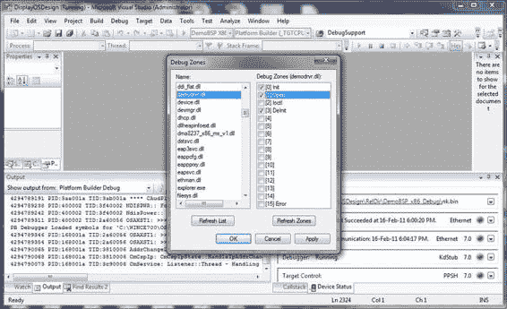
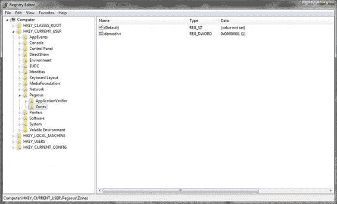
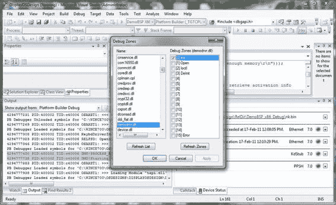
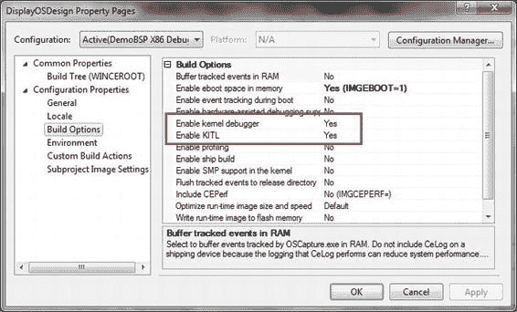
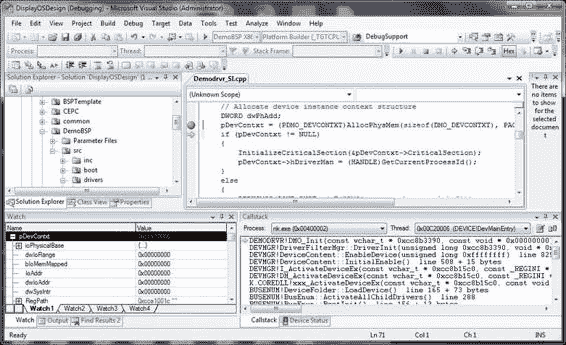
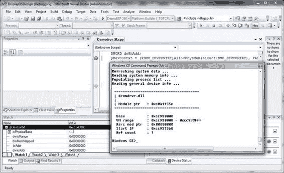

# 第 11 章 ■ 调试设备驱动程序

接下来，您必须向调试系统注册您的调试区域。由于设备驱动程序必须在 DLL 中实现，因此注册必须在 `DllEntry` 函数中进行。清单 11-4 是注册设备驱动程序调试区域的示例代码。请注意对 `DisableThreadLibraryCalls` 的调用，它有效地禁用了 `DLL_THREAD_ATTACH` 和 `DLL_THREAD_DETACH` 通知。这有助于减少设备驱动程序 DLL 的初始化代码。

*清单 11-4. 注册设备驱动程序的调试区域*

```
BOOL WINAPI DllEntry(HANDLE hinstDLL, DWORD dwReason, LPVOID lpvReserved)
{
    switch(dwReason)
    {
        case DLL_PROCESS_ATTACH:
        {
            g_hInstance = hinstDLL;
            DEBUGREGISTER((HINSTANCE)hinstDLL);
            DEBUGMSG(ZONE_INIT,(_T("DMO!PROCESS_ATTACH: Process: 0x%x, ID: 0x%x \r\n"),
            GetCurrentProcess(), GetCurrentProcessId()));
            DisableThreadLibraryCalls ((HMODULE)hinstDLL);
            return TRUE;
        }
        case DLL_PROCESS_DETACH:
        {
            DEBUGMSG(ZONE_INIT,(_T("DMO!PROCESS_DETACH: Process: 0x%x, ID: 0x%x \r\n"),
            GetCurrentProcess(), GetCurrentProcessId()));
        }
        break;
    }
    return TRUE;
}
```

##### 更改调试区域

按照刚才给出的代码示例，您可以调试已分配给初始化和反初始化的设备驱动程序中的代码。那么，例如调试 `DMO_Open` 函数又如何呢？在此函数中，仅当启用了 `ZONE_OPEN` 区域时才会输出调试消息。如果您想更改在代码中创建的初始调试区域，该怎么办？一种方法是编辑代码，重新构建，并将其放入映像中。这确实是一个耗时且浪费的过程。您可以在调试会话期间使用 IDE 启动“调试区域”对话框，选择您的设备驱动程序模块，并勾选要启用的调试区域。图 11-2 展示了如何启用 `ZONE_OPEN` 区域。

[www.it-ebooks.info](http://www.it-ebooks.info/)



*图 11-2. 在操作系统运行时启用 `ZONE_OPEN` 区域*

另一种无需干扰代码或操作系统映像即可启用区域的方法是在开发工作站上编辑注册表项 `HKEY_CURRENT_USER\Pegasus\Zones`。为了演示这一点，我在 Demodrvr 模块中重置了 `DBGPARAM` 结构（见清单 11-5），并重新构建了它。

*清单 11-5. `ulZoneMask` 设置为 0，因此没有区域被启用*

```
DBGPARAM dpCurSettings = {
    _T("Demodrvr"),
    {
        _T("Init"), _T("Open"), _T("Ioctl"), _T("DeInit"),
        _T(""), _T(""), _T(""), _T(""),
        _T(""),_T(""),_T(""),_T(""),
        _T(""),_T(""),_T(""),_T("Error")
    },
    0
};
```

接下来，我在开发工作站上为 Demodrvr 创建了一个条目，并将掩码设置为 1。见图 11-3。

[www.it-ebooks.info](http://www.it-ebooks.info/)



*图 11-3. `HKEY_CURRENT_USER\Pegasus\Zones`，名为 demodrvr 的 DWORD 值设置为 1*

如果我没有这样做，Demodrvr 将不会输出任何调试消息。然而，编辑开发工作站注册表启用了 `ZONE_INIT` 区域。图 11-4 演示了来自 Init 区域的消息如何输出到 Visual Studio 的输出窗格，并且“调试区域”对话框显示 Init 区域已被勾选。

[www.it-ebooks.info](http://www.it-ebooks.info/)



*图 11-4. 显示 `ZONE_INIT` 已被勾选，并且在输出窗格中输出了 Demodrvr 消息*

### 内核调试器

内核调试器是平台生成器的一部分。如果为操作系统映像构建启用了内核调试，则内核调试器将作为一项服务使用核心连接基础架构运行。为了使内核调试器能够执行调试存根，`KdStub` 必须包含在运行时映像中。请注意图 11-4 中的设备状态窗格（第 4 行），显示 `KdStub` 正在运行。

要启用内核调试，您只需从“项目”菜单中打开操作系统设计属性页对话框，选择“生成选项”节点，将“启用内核调试器”字段设置为“是”。如果您愿意，在此同时也可以启用 KITL。使用内核调试器与使用 WinDbg 或集成在 Visual Studio 中的桌面调试器非常相似，因此我将省略如何使用内核调试器的操作细节，因为这些可以在产品文档中找到。图 11-6 展示了 Demodrvr 驱动程序的一个调试会话，在第 70 行设置了一个断点，由棕色（至少在我看来是棕色）的圆点指示，黄色的箭头显示了下一条要执行的语句。右侧的“监视”窗格显示了 `pDevContext` 结构的内容，而左侧的“调用堆栈”窗格显示了包含下一条要执行语句的函数，以及导致到达此点的函数调用堆栈。

[www.it-ebooks.info](http://www.it-ebooks.info/)



*图 11-5. 配置内核调试器支持*

> **注意：** 发布版本警告：您不应该在发布版本映像中启用内核调试器。如果您这样做，`KdStub` 将等待内核调试器连接，因为运行发布版本的设备通常不会连接到运行内核调试器的开发工作站，设备将需要很长时间才能启动。

[www.it-ebooks.info](http://www.it-ebooks.info/)



*图 11-6. 使用内核调试器在 `Demodrvr_SI.cpp` 文件的第 70 行中断*

### CeDebugX

`CeDebugX` 是内核调试器的扩展。它提供有关中断状态下系统状态的详细信息，并尝试诊断崩溃、挂起和死锁。映像中必须支持目标控制，并且调试器必须处于中断状态才能使用 `CeDebugX` 命令。本章稍后将详细介绍目标控制。要将目标控制集成到您的映像中，请在目录中找到 `Core OS>>Core OS Services>>Kernel Functionality>>Target Control Support(Shell.exe)` 并勾选它。图 11-7 显示了在中断期间使用 `!module` 命令获得的关于 Demodrvr 的信息。

```
!module demodrvr.dll
```

有关命令列表，请查阅文档。这些命令被分为十组相关命令：

- 诊断 CeDebugX 命令
- 扩展帮助和控制 CeDebugX 命令
- 常规系统信息 CeDebugX 命令
- 线程信息 CeDebugX 命令
- 进程信息 CeDebugX 命令
- 模块信息 CeDebugX 命令
- 句柄 CeDebugX 命令
- 代理 CeDebugX 命令
- 内存信息 CeDebugX 命令
- GWES 信息 CeDebugX 命令

[www.it-ebooks.info](http://www.it-ebooks.info/)



*图 11-7. 使用 CeDebugX 获取模块信息*

### 硬件辅助调试

使用硬件辅助调试器可以获得很多优势。第一个也是最重要的优势是，当您刚开始着手时，甚至还没有引导加载程序，更不用说操作系统了。硬件辅助调试器到底是什么意思？大多数 CPU 都提供片上调试支持。例如，ARM 调试架构使用现有的 JTAG 接口作为访问内核的方法。

在生产测试中围绕内核的扫描链在调试状态下被重复使用，以从数据总线捕获信息，并将新信息插入到内核或内存中。内核周围有两个扫描链：

- 一个围绕整个内核外围的扫描链
- 第一个扫描链的一个子集，仅覆盖数据总线和断点 203

[www.it-ebooks.info](http://www.it-ebooks.info/)


