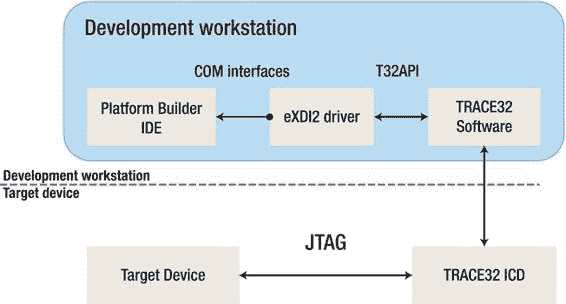

# 数据总线上较短的扫描链允许指令和数据插入到内核中，而无需将数据围绕 ARM 处理器内核整个周边进行时钟传输的开销。更多信息请查阅与您的 CPU 相关的调试架构参考手册。片上调试系统将提供四个基本功能：

- 读写内存
- 读写 CPU 寄存器
- 单步执行和实时执行
- 硬件断点和触发功能

> **注意：** `JTAG`（联合测试行动组）是 IEEE 1149.1 标准测试访问端口和边界扫描架构的通用名称。它最初设计用于通过边界扫描测试印刷电路板，并至今仍用于此应用。

如今，`JTAG`被用于 IC 调试端口。在嵌入式处理器市场中，几乎所有现代处理器都支持`JTAG`。嵌入式系统开发依赖于调试器通过`JTAG`与芯片通信，以执行单步执行和设置断点等操作。

### TRACE 32

`TRACE32`是硬件辅助调试工具的一个很好的例子。它为目标设备提供了一个`JTAG`接口，即在线调试器（`TRACE32 ICD`），并在开发工作站上提供一个 IDE 来控制设备并执行调试过程。它支持使用高级语言代码、汇编器和混合反汇编代码进行调试。它提供片内断点和触发功能。当然，它还允许闪存编程，并提供 RTOS 感知能力，最新版本支持 Windows Embedded Compact 7，包括调试多核系统的能力。对于设备驱动程序开发人员，它还能在逻辑层面显示内部和外部外设。

为了帮助实现调试过程的自动化，脚本语言允许编写一系列命令的脚本，以将调试会话运行到您想要开始调试的点。

在开发 BSP 时，硬件辅助调试是极其宝贵的。没有它，例如调试引导加载程序几乎是不可能的。“给我一个支点，我就能撬动地球”，据说是阿基米德对杠杆的评论。嗯，硬件辅助调试正是这个杠杆。

当涉及到设备驱动程序时，能够以逻辑方式查看由寄存器（端口）表示的硬件是极其有帮助的。调试引导加载程序的以太网设备驱动程序只能使用像`TRACE32`这样的工具来完成，因为引导加载程序不提供 NDIS 支持，您必须从头开始实现 NIC 接口。

### 自动化调试过程

虽然可以使用`TRACE32` IDE 通过位于窗口底部的命令接口（如图 11-8 所示）单独设置命令，但创建一个由 IDE 运行的脚本批处理文件要高效得多，该文件可以按顺序执行所有必需的命令，而无需逐个输入每个命令。主窗口的底部有四行：最上面一行是命令行，下一行是消息栏，其下是充当命令快捷键的软键，这些命令输入到命令行中，最底部是状态栏。

例如，如果需要设置 CPU 类型，您可以输入命令，在这种情况下，`TRACE32`会提供一个它所支持的参考 CPU 列表。

```
SYStem.CPU DM3730
```

然后继续设置其他命令以初始化调试器，您可以编写一个扩展名为`CMM`的批处理文件来按顺序运行它们。清单 11-6 是一个示例批处理文件，我根据从 Lauterbach 收到的示例批处理文件进行了修改，以处理我使用的特定板卡。说实话，没有`TRACE32`，我永远无法将 Adeneo 为`OMAP3530`创建的 WinCE 6.0 BSP 移植到适用于 Variscite 板卡的 Windows Embedded Compact 7 上。这个文件注释良好，可以作为创建类似批处理文件的参考。

*清单 11-6. `Wince74SOM37.cmm` ICD 脚本文件*

```bash
;--------------------------------------------------------------------------
;
; Windows Embedded Compact 7 用于 TRACE32 RTOS 调试器的演示
;
; 此批处理文件演示了用于 CE7 的 RTOS 调试器的使用
; 该示例是为使用 ICD 的 OMAP37xx Variscite 板卡生成的。
; 它不会在任何其他板卡上运行，但可以作为其他板卡的模板。
; Windows CE 映像通过 ICD 下载。
;
;--------------------------------------------------------------------------

; 使用 TRACE32 启动 WinCE 示例：
; - 启动 TRACE32
; - 给板卡上电
; - TRACE32: "do wince"
; - 通过 CMD 在目标上启动 "application1.exe"

; 为了使用 TRACE32 进行调试，我们建议禁用按需分页
; 通过在 PLATFORM\VAR_SOM37_EVM\FILES\config.bib 中设置 ROMFLAGS 的第一位

&winceroot="C:\WINCE700" ; 通常是 C:\WINCE700
&reldir="&winceroot\OSDesigns\TinyOSDesign\TinyOSDesign\RelDir\VARSOM37_EVM__ARMv7_Debug"

; 调试器复位
winpage.reset
area.reset
WINPOS 55. 5. 120. 30.
area
print "复位中..."
RESet

; 初始化调试器
print "初始化中..."
SYStem.CPU DM3730
SYStem.JtagClock 5MHZ ; 硬件相关（请查阅手册）
SYStem.Option DACR ON ; 授予调试器全局写入权限
TrOnchip.Set DABORT OFF ; 操作系统用于页面缺失！
TrOnchip.Set PABORT OFF ; 操作系统用于页面缺失！
TrOnchip.Set UNDEF OFF ; 操作系统可能用于 FPU 检测
SYStem.Option MMUSPACES ON ; 为虚拟地址启用空间 ID

SYStem.Up
SETUP.IMASKASM ON ; 单步执行时锁定中断
; 启动 u-boot 来初始化板卡
Go
print "目标设置中..."
wait 1.s
Break

; 加载 eboot
; 有关物理加载地址，请运行 viewbin -r ebootnand.bin 以获取所需的所有信息
; 请参阅 ROMOFFSET 以了解闪存加载地址的偏移量
; 然后将 eboot 加载到 <物理地址> - <闪存地址>
Register.RESet
print "加载 eboot..."
Data.LOAD.EXE "&reldir\EBOOTNAND.bin" 0x87E00000-0x87E00000
Register.Set PC 0x87E00000

; 让 eboot 初始化所有内容
Go
print "运行 eboot..."
wait 3.s
Break

; 加载 Windows CE 映像
; 仅当您想使用调试器将映像直接加载到 RAM 时，才使用以下行。

print "加载 Windows CE 映像..."
; 准备直接下载：禁用 MMU！
PER.Set C15:0x1 %Long data.long(c15:1)&~1 ; 关闭 MMU
Register.Reset

; 将映像下载到物理地址。
Data.LOAD.EXE &reldir\nk.bin
; 将 PC 设置为物理起始地址
; 请参阅 config.bib 中的 NK RAMIMAGE，或者更好的是运行 viewbin -r nk.bin 以获取所需的所有信息
Register.Set pc 0x8C000000

; 我们想看到一些东西，打开一个代码窗口。
WINPOS 0. 0. 77. 22.
Data.List

; 向调试器声明 MMU 格式
; 表格格式为 "WINCE6"
; 跳过根表 (0)
; 为内核声明默认转换
MMU.FORMAT WINCE6 0 0x80000000--0x8fffffff 0x80000000
```

以下是几个图示，用于演示由此批处理文件初始化的调试过程。

图 11-8 显示了这个批处理文件的执行流程。

*图 11-8. 区域窗口显示了清单 11-6 中批处理文件的执行流程*

*图 11-9. 显示 OEMInit 的混合代码列表和断点列表的窗口*

eXDI


### eXDI 概述

`eXDI` 是 Extended Debugging Interface（扩展调试接口）的缩写。它允许 Platform Builder 通过在线调试器（如 TRACE32）监控并控制目标设备的活动。本质上，它是 Platform Builder 与在线调试器之间的适配层。`eXDI` 作为核心连接服务实现，与操作系统访问服务协同工作，为 Platform Builder 提供调试服务。

操作系统访问服务为调试器提供操作系统感知能力。它充当 `eXDI` 服务与 Platform Builder 之间的中介。这使得第三方解决方案提供商能够开发出支持 Windows Embedded Compact 7 的调试工具。图 11-10 展示了 Platform Builder 如何使用 Lauterbach `eXDI2` 驱动程序在 TRACE32 ICD 之间建立接口，后者通过 `JTAG` 连接目标设备，用于硬件辅助调试。

[www.it-ebooks.info](http://www.it-ebooks.info/)



