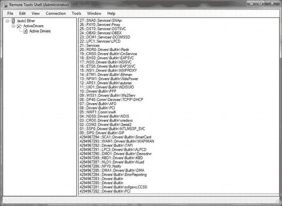
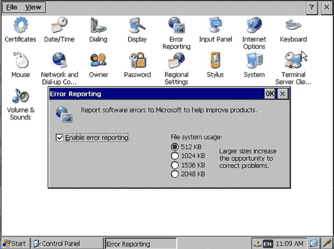

# 第 11 章 ■ 调试设备驱动程序

`m_commandPacket.CommandId = 1;`

`DispatchActiveDrivers();`

`e.CommandPacketOut = m_commandPacket;`

`break;`

`}`

`}`

#### 桌面远程工具插件实现

向导会创建三个类：插件类、数据类和一个视图类。这些类包含与设备通信所需的所有基础设施代码。你只需实现从设备检索已发送回来的数据，这项工作在数据类中完成。接下来，你需要在视图类中实现以你想要的方式显示数据的代码。清单 11-10 展示了如何通过粗体显示的修改代码在数据类中检索数据。清单 11-11 展示了如何通过粗体显示的修改代码在视图类中实现数据的显示。

*清单 11-10. 从设备检索数据并将其存储到字符串数组中*

```
public class MyData : PluginData
{
    /// 用于表示数据的字符串数组。
    private ArrayList strings;

    /// 构造函数：构建空字符串数组
    /// <param name="host">拥有此数据的插件</param>
    /// <param name="guid">拥有此数据的节点的 GUID</param>
    public MyData(
        PluginComponent host,
        string guid)
        : base(host, guid)
    {
        this.InitDataAtViewTime = false;
        this.strings = new ArrayList();
    }

    /// 返回表示数据的字符串数组
    public ArrayList Strings
    {
        get { return this.strings; }
        set { this.strings = value; }
    }

    /// 存储来自序列化器的数据项
    /// <param name="description">数据项的描述</param>
    /// <param name="value">数据项的值</param>
    protected override void OnAddVirtualDataItem(
        string description,
        string value)
    {
        this.strings.Add(value);
    }

    /// 从设备检索数据并将其存储在数据项中。
    protected override void OnGetData()
    {
        CommandPacket sendCommand = new CommandPacket();

        // 填充命令对象（命令值为 1）
        sendCommand.CommandId = 1;

        // 处理命令
        ProcessCommandExData pcexData = new
            ProcessCommandExData(sendCommand, this);
        pcexData.CommandReceived += new
            EventHandler(pcexData_CommandReceived);

        CommandTransport.ProcessCommandEx(pcexData);
    }

    /// 以通用方式渲染此对象的数据项。
    /// <param name="dataAcceptor">用于渲染数据项的数据接受器</param>
    protected override void OnRenderGeneric(
        GenericDataAcceptor dataAcceptor)
    {
        string category = "我的类别";

        for (int index = 0; index < this.strings.Count; index++)
        {
            dataAcceptor.AddItem(
                category,
                "字符串 #" + index.ToString(),
                this.strings[index].ToString());
        }
    }

    /// 从接收到的命令中检索数据并更新 UI
    /// <param name="sender">事件源</param>
    /// <param name="eventArgs">事件参数</param>
    private void pcexData_CommandReceived(object sender,
        EventArgs eventArgs)
    {
        // 设备端应用程序构建并返回一个数据包，
        // 其中包含一个 WORD、一个 DWORD、一个字符串以及一些字节。
        // 将这些值取出来转换为字符串，并放入我们的数组中。
        ProcessCommandExData pcexData =
            (ProcessCommandExData)sender;
        CommandPacket receivedCommand = pcexData.CommandOut;

        // 从设备获取值并放入字符串数组
        UInt32 NumOfIter =
            receivedCommand.GetParameterDWORD();

        try
        {
            for (int i = 0; i < NumOfIter; i++)
            {
                string sActive =
                    receivedCommand.GetParameterString();
                strings.Add(sActive);
            }
        }
        catch
        {
        }

        // 通过将 Initialized 设置为 true，
        // 连接到此数据对象的视图面板将刷新。
        this.Initialized = true;

        // 从 pcexData 事件处理器取消注册，以便...
    }
}
```


```csharp
// 此对象可被垃圾回收

pcexData.CommandReceived -= new
EventHandler(pcexData_CommandReceived);

}
}
```

*列表 11-11. 显示活动设备驱动程序的视图实现*

```csharp
public class MyView : PluginDataView
{
    private ListView listView1;
    private ColumnHeader Handles;
    private ColumnHeader DName;
    private ColumnHeader Key;
    private ListView listView2;

    /// 字符串数据列表
    private ListBox listboxStrings;

    /// 构造视图。此对象在主 UI 线程上创建。
    /// <param name="data">插件数据对象</param>
    public MyView(
        MyData data)
        : base(data)
    {
    }

    /// 初始化视图控件
    /// 此方法在视图首次渲染前被调用。它保证在主 UI 线程上运行，因此无需调用 Invoke。
    ///
    /// 你也可以使用设计器来布局控件。如果
    /// 将 InitializeComponent() 的调用移至此处，
    /// 可以缩短插件加载时间，因为子控件只在需要时才创建。
    /// </remarks>
    protected override void OnBuildControls()
    {
        this.listboxStrings = new System.Windows.Forms.ListBox();
        this.listboxStrings.Dock =
            System.Windows.Forms.DockStyle.Fill;
        this.Controls.Add(this.listboxStrings);
    }

    /// 填充控件数据
    /// <param name="hint">控件的附加信息</param>
    /// 此方法在主 UI 线程上被调用，当远程工具框架需要刷新视图以反映数据变化时触发。
    /// 如果此方法调用是由远程工具框架生成的，则 hint 参数为 null。
    /// 数据对象也可以调用自身的 RenderViews 方法，这会导致所有连接到该数据的视图的此方法被调用。
    /// RenderViews 可以将 hint 参数设置为你想要的任何内容。
    protected override void OnPopulateControls(object hint)
    {
        MyData data = (MyData)this.Data;

        this.listboxStrings.Items.Clear();

        for (int index = 0; index < data.Strings.Count; index++)
        {
            this.listboxStrings.Items.Add(data.Strings[index]);
        }
    }

    private void AddLine(string _strDesc)
    {
        string strItem = string.Empty;
        int indx = _strDesc.IndexOf("|");
        string strTemp = _strDesc.Substring(0, indx);
        ListViewItem listItem = new ListViewItem(strTemp);
        int indx2 = _strDesc.LastIndexOf("|");
        int length = _strDesc.Length - indx2;
        strItem = _strDesc.Substring(indx + 2, 5);
        listItem.SubItems.Add(strItem);
        strItem = _strDesc.Substring(indx2 + 2);
        listItem.SubItems.Add(strItem);
        this.listView1.Items.Add(listItem);
    }

    private void InitializeComponent()
    {
        this.listView1 =
            new System.Windows.Forms.ListView();
        this.Handles =
            new System.Windows.Forms.ColumnHeader();
        this.DName =
            new System.Windows.Forms.ColumnHeader();
        this.Key = new System.Windows.Forms.ColumnHeader();
        this.SuspendLayout();
        //
        // listView1
        //
        this.listView1.BackColor =
            System.Drawing.Color.FromArgb(((int)(((byte)(255)))),
            ((int)(((byte)(255)))), ((int)(((byte)(128)))));
        this.listView1.Columns.AddRange(
            new System.Windows.Forms.ColumnHeader[] {
                this.Handles,
                this.DName,
                this.Key});
        this.listView1.Dock =
            System.Windows.Forms.DockStyle.Fill;
        this.listView1.Location =
            new System.Drawing.Point(0, 0);
        this.listView1.Name = "listView1";
        this.listView1.Size =
            new System.Drawing.Size(262, 196);
        this.listView1.TabIndex = 1;
        this.listView1.UseCompatibleStateImageBehavior =
            false;
        this.listView1.View =
            System.Windows.Forms.View.Details;
        //
        // Handles
        //
        this.Handles.Text = "句柄";
        //
        // DName
        //
        this.DName.Text = "驱动程序名称";
        //
        // Key
        //
        this.Key.Text = "键";
        this.Key.Width = 180;
        //
    }
}
```


```markdown

// MyView

`this.Controls.Add(this.listView1);`

`this.Name = "MyView";`

`this.Size = new System.Drawing.Size(262, 196);`

`this.ResumeLayout(false);`

`}`

构建项目后，结果位于目录 `<project>\Bundle\Release` 下，本例中名为 `ActiveDrivers.cetool`。双击该文件将打开远程框架 shell，如图 11-13 所示。当连接到设备时，它会下载并启动设备端工具，然后检索结果，如图 11-14 所示。

*图 11-13. 远程工具 Shell*

[www.it-ebooks.info](http://www.it-ebooks.info/)



第 11 章 调试设备驱动程序

*图 11-14. 已连接设备上的活动设备驱动程序列表*

**实现说明：** 虽然可以开发原生的设备端远程工具，但用于创建远程工具项目的 Visual Studio 2008 向导仅支持过时的 SDK。因此，您需要调整设备端项目属性，才能构建可执行文件。请注意，您需要添加与设备处理器相对应的 `rtfhlp10.lib`，该库位于 `<安装磁盘>\Program Files (x86)\Microsoft Remote Framework Tools\1.10\lib\wce700` 路径下。另请注意，此路径适用于 64 位桌面系统。

### 事后调试与 Dr. Watson

人非圣贤，产品亦非完美。设备驱动程序开发者也不例外。开发周期从设计作为设备驱动程序的硬件和软件开始，到实现、调试和测试。一旦周期完成，产品便发布并投入使用。然而，不可预见的问题时有发生。为了智能地解决这些问题，事后诊断和调试方法应运而生。

[www.it-ebooks.info](http://www.it-ebooks.info/)

第 11 章 调试设备驱动程序

Windows Embedded Compact 为此提供了一套工具，用于捕获程序崩溃时机器的关键状态信息，并允许用户将收集到的信息报告给 OEM 厂商和 Microsoft。

标准错误报告包含崩溃时的有用信息，包括：

- 堆栈详细信息
- 系统信息
- 已加载模块的列表
- 异常类型
- 全局和局部变量

崩溃信息被压缩到 CAB 文件中，并在用户同意后发送到 Microsoft Watson 网站。

#### 错误报告生成器

错误报告生成器是负责使用注册表中配置的选项创建转储文件的组件。

要生成错误报告转储文件，必须预留至少 128 KB 的内存。OAL 开发者通过设置名为 `dwNKDrWatsonSize` 的变量来初始化需要预留的内存大小。这通常在 `OEMInit` 函数中完成，代码清单 11-12 展示了该函数的示例。

*代码清单 11-12. 初始化错误报告转储文件的内存*

```
// 为 Watson 转储保留 128kB 内存
dwNKDrWatsonSize = 0;
if (dwOEMDrWatsonSize != DR_WATSON_SIZE_NOT_FIXEDUP)
{
    dwNKDrWatsonSize = dwOEMDrWatsonSize;
}
```

内核将使用此大小在主内存末尾预留一个内存块。必须设置 Sysgen 变量 `SYSGEN_WATSON_DMPGEN`，以将错误报告生成器包含在映像中。

`[HKLM\System\ErrorReporting\DumpSettings]` 注册表项保存了用于生成错误报告的注册表值。代码清单 11-13 是此类注册表设置的示例。

*代码清单 11-13. 特定操作系统设计的错误报告注册表设置*

```
;---------------------------- 开始 WATSON ----------------------
;
; @CESYSGEN IF WCESHELLFE_MODULES_DWXFER
;
[HKEY_LOCAL_MACHINE\Drivers\BuiltIn\ErrorReporting]
"Dll"="DwXfer.dll"
"FriendlyName" = "转储文件传输"
"PollInterval"=dword:493E0
; @CESYSGEN IF WCESHELLFE_MODULES_DDXPROBE
; @CESYSGEN ELSE
```

[www.it-ebooks.info](http://www.it-ebooks.info/)

第 11 章 调试设备驱动程序

```
"PollPriority256"=dword:F9
```

```


; @CESYSGEN ENDIF WCESHELLFE_MODULES_DDXPROBE`

`"Index"=dword:1`

`"Order"=dword:0`

`"Flags"=dword:2`

`[HKEY_LOCAL_MACHINE\System\ErrorReporting\DumpSettings]`

`"DumpDirectory"="\\Windows\\DumpFiles"`

`"ExtraFilesDirectory"="\\Windows\\ExtraDumpFiles"`

`"CabDirectory"="\\Windows\\DumpFiles\\CabFiles"`

`"UploadClient"="\\Windows\\Dw.exe"`

`"MaxDiskUsage"=dword:80000`

`"DumpEnabled"= dword:1`

`"DumpType"= dword:2`

`;`

`; @CESYSGEN ENDIF WCESHELLFE_MODULES_DWXFER`

`; @CESYSGEN IF WCESHELLFE_MODULES_DDXPROBE`

`; @CESYSGEN ELSE`

`[HKEY_LOCAL_MACHINE\System\ErrorReporting\DDxSettings]`

`"DDxEnabled"=dword:0`

`;`

`; @CESYSGEN ENDIF WCESHELLFE_MODULES_DDXPROBE`

`;`

`;---------------------------- WATSON 结束 ------------------------`

错误报告传输驱动程序会将注册表设置值传输到前述预留内存中。然后，错误报告生成器从内存中检索这些设置，以便生成适当的转储文件。这些设置告知错误报告生成器在何处生成转储文件以及要创建何种类型的转储文件；在本例中，它指的是系统转储，并且使用的最大磁盘空间是预留内存大小的四倍。

在开发操作系统设计时，开发人员会设置要生成的故障转储类型，请注意清单 11-10 中注册表设置的`DumpType`键的值。每种转储类型都遵循相同的文件格式，其中三种类型可以生成：

- 上下文转储，4 KB 到 64 KB
  - 关于崩溃系统的信息
  - 引发崩溃的异常
  - 出错线程的上下文记录
  - 模块列表，仅限于拥有进程的出错线程
  - 线程列表，仅限于拥有进程的出错线程
  - 出错线程的调用堆栈
  - 出错线程指令指针上下各 64 字节的内存
  - 出错线程的堆栈内存转储，截断至 64 KB 限制内

[www.it-ebooks.info](http://www.it-ebooks.info/)

- 系统转储，64 KB 到若干 MB
  - 上下文转储中的所有信息
  - 所有线程的调用栈和上下文记录
  - 整个设备的完整模块、进程和线程列表
  - 出错线程指令指针上下各 2048 字节的内存
  - 崩溃发生时正在运行的进程的全局变量

- 完整转储，包括所有物理内存外加至少 64 KB
  - 上下文转储中的所有信息
  - 所有已使用内存的完整转储

#### 错误报告传输驱动程序

错误报告传输驱动程序将注册表值（错误报告生成器所需）从注册表移动到预留内存块，并将生成的文件从预留内存移动到持久化文件中。

将转储文件传输到持久化存储后，错误报告传输驱动程序会启动注册表中指定的报告上传客户端。

必须设置系统生成变量 `SYSGEN_WATSON_XFER`，以将错误报告传输驱动程序包含在镜像中。`[HKLM\Drivers\BuiltIn\ErrorReporting]` 注册表键保存了错误报告传输驱动程序的注册表值。清单 11-10 展示了此类注册表设置的示例，其中传输轮询的时间间隔设置为 5 分钟，轮询优先级设置为 249。

#### 错误报告控制面板

错误报告控制面板允许基于显示设备的用户通过控制面板小程序配置转储文件生成的选项。用户可以使用的选项包括：

- 启用/禁用错误报告——在基于显示设备上，错误报告默认启用。在无头设备上，错误报告默认禁用。
- 控制分配给转储文件的存储空间量——控制面板对话框包含一组单选按钮，允许用户选择用于存储转储文件的存储空间大小，如图 11-15 所示。
- 启用用户通知对话框

[www.it-ebooks.info](http://www.it-ebooks.info/)



*图 11-15. 基于显示设备的错误报告控制面板小程序*

必须设置系统生成变量 `SYSGEN_WATSON_CTLPNL`，以将错误报告控制面板包含在镜像中。`[HKLM\System\ErrorReporting\DumpSettings]` 注册表键和 `[HKLM\System\ErrorReporting\UploadSettings]` 注册表键中包含的注册表设置被错误报告控制面板用来设置控制面板对话框中的初始值。

#### 报告上传客户端

上传客户端负责将生成并创建的转储文件上传到 `watson.microsoft.com` 错误报告网站。然而，也可以将此文件上传到另一个网站——但这涉及代码更改，例如更改 `FValidBucketResponseURL` 函数，使其验证一个不同于上述提及并在 `(_PUBLICROOT)\WCESHELLFE\OAK\WATSON\DWUI\DWUIDLGS.CPP` 中实现的网站。

您可能还想查看另一个文件 `(_PUBLICROOT)\COMMON\OAK\INC\DWPUBLIC.H`。在这里，您可以为您的服务器定义一个有效的响应服务器 (`VALID_RESPONSE_SERVER`)，当然，您还需要创建一个能够获取存储桶参数、将小型转储文件分组到存储桶中并响应上传客户端的上传网站。尽管这一切都是可行的，但可能不值得费此周折。

[www.it-ebooks.info](http://www.it-ebooks.info/)

#### 小型转储与存储桶

小型转储是由 Dr. Watson 在设备上生成的转储文件，包含崩溃应用程序的最重要部分。它之所以被称为“小型”，是因为它只包含识别和分析崩溃应用程序所需的内容。存储桶代表一个唯一的错误或问题，并标识导致该错误的组件。存储桶化帮助上传服务器组织上传的小型转储文件。所有这些都意味着描述同一问题的小型转储文件被分组在一起，称为一个存储桶。

`DMPFILEINFO` 结构包含将小型转储文件分组到存储桶所需的所有信息：

```
// 包含转储文件相关信息的结构
typedef struct tagDMPFILEINFO
{
    WORD wBucketParams; // 正在使用的存储桶参数数量
    LPWSTR rgwzBucketParams[MAX_BUCKETPARAMS]; // 通用模式的存储桶参数
    LPWSTR pwzQueryString; // 额外的查询字符串
    LPWSTR pwzAppName; // 在 UI 中显示的名称
    LPWSTR pwzFilesToKeep; // 要包含在日志中但不删除的文件
    LPWSTR pwzFilesToDelete; // 要包含在日志中但在完成时删除的文件
    BOOL fGenericParams; // 为 True 表示存储桶参数是通用参数
} DMPFILEINFO, *PDMPFILEINFO;
```

### 章节总结

调试过程是设备驱动程序开发周期中最耗时甚至可能是最重要的方面，任何软件也是如此。Platform Builder 提供了一系列对调试过程非常有价值的工具。尽管如此，所有这些调试工具都是软件工具。从内核调试器和目标控制（同时也是调用调试扩展的主机）开始。Platform Builder 提供了一个名为 `CeDebugX` 的全面调试扩展 DLL，以帮助高效诊断问题。

然而，有时软件调试工具是不够的，尤其是当硬件与正在调试的软件相关时。这需要硬件辅助调试，而现代处理器在芯片上支持这一点。像 Lauterbach 的 TRACE32 ICD 这样的工具提供了一个接口和 IDE 来帮助开发人员。它提供芯片上的信息和实时跟踪能力。

[www.it-ebooks.info](http://www.it-ebooks.info/)

## 使用 CTK 开发测试代码


