# 使用 CTK 开发测试代码

测试是发布任何产品（软件或硬件）之前开发周期的最后阶段。测试的目的是确保成品具有最高质量。在二十一世纪，当对高质量软件的依赖影响到我们生活的几乎每个方面时，高质量的软件产品是必不可少的。开发人员似乎对这一过程嗤之以鼻，而质量保证人员往往被视为次于设计师和编码人员。然而，ISO 软件开发标准迫使软件供应商和原始设备制造商重视起来，并实施严格的测试以保证质量。

### 本章内容

- Windows Embedded Compact 测试工具包
- 设计测试
- TUX 测试框架
- 查看结果
- 性能测试

### Windows Embedded Compact 测试工具包

随 `Platform Builder 7` 提供的 `Windows Embedded Compact 测试工具包` 使开发人员和质量保证工程师能够测试 Windows Embedded Compact 设备的设备驱动程序及相关硬件的功能和性能是否失败。`CTK` 提供的功能可以反馈被测设备驱动程序功能成功或失败的信息，并提供对 `BSP` 的验证。

#### 概述

与之前的工具 `Windows Embedded CE 测试工具包` (`CETK`) 相比，`Windows Embedded Compact 测试工具包` 在用户界面和整体功能集方面都做出了显著改进。`CTK` 是一个新的应用程序，具有以下主要功能：

- 改进的用户界面
- 能够将用户选择的测试用例分组到测试过程中
- 改进的测试结果查看器允许您按测试过程存储和查看测试结果
- 连接到设备时，检测测试所需的*外设和驱动程序*
- 与新的 `Graph Tool` 集成，以绘制性能测试结果图表
- 用户可以向 `CTK` 添加自定义的基于 `TUX` 测试框架（`TUX`）的测试
- 支持 `x86`、`MIPSII`、`MIPSII_FP`、`ARMv5`、`ARMv6`、`ARMv7` 处理器

#### 用户界面

图形用户界面与 `Visual Studio` 的 GUI 相似。它有一个用于基本入门选项的`“起始页”`选项卡。右上角是`“测试用例资源管理器”`窗口，包含三个选项卡：

- `“测试用例资源管理器”`选项卡以树状视图显示主测试目录。它默认包含 Windows Embedded 测试目录。您可以添加自己的自定义测试用例。将来可能会添加其他目录。
- `“测试过程模板视图”`选项卡显示用户创建和内置的测试过程模板。
- `“连接视图”`选项卡显示 `CTK` 所连接的设备。

右下角的`“属性”`窗口类似于 `Visual Studio` 中的`“属性”`窗口。它显示当前选定的测试用例、测试过程、模板或连接的属性。左下角的`“连接输出”`窗口显示来自 `CTK` 以及正在运行的测试用例的调试消息。图 12-1 显示了未建立连接时打开的 `CTK`。

此外，菜单和工具栏沿袭了 Windows GUI 应用程序的传统。它们直观且易于操作，并带有提示工具栏按钮含义的工具提示。

`Windows Embedded CTK` 引入了测试过程的概念，即一个测试集合，在设备上执行，其结果可以查看和保存。测试过程中的测试可以一次性全部运行，也可以选择性地运行。

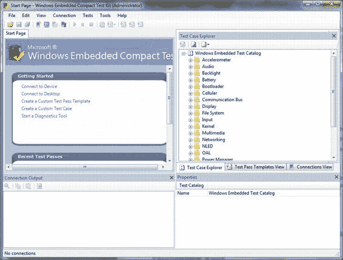

*图 12-1. CTK 图形用户界面*

##### CTK 使用的术语

- `TestCatalog` - 与特定产品关联的测试集合
- `TestCategory` - `TestCatalog` 内测试的逻辑分组，通常基于特定的技术领域
- `TestCase` - 在设备/桌面上执行以获得通过/失败结果的测试
- `TestCaseRun` - 在设备/桌面上执行测试用例的一个实例
- `TestPass` - 在设备上执行且其结果可查看和保存的测试集合
- `TestPassTemplate` - 用作创建在设备上执行的 `TestPass` 模板的测试集合

### 创建测试过程

在创建测试过程之前，您必须创建一个作为测试过程基础的模板。本节说明如何创建测试过程模板以及如何从此模板创建测试过程。

#### 创建测试过程模板

启动`“测试管理器”`最简单的方法是单击起始页上的“创建自定义测试过程模板”选项。`“测试管理器”`是用于管理测试用例的创建、编辑和删除的工具。

图 12-2 显示了`“测试管理器”`对话框和一个准备命名的新模板。

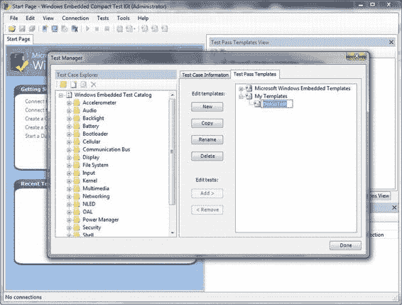

*图 12-2. 单击“新建”按钮后的测试管理器*

#### 创建测试用例

创建测试用例就是将您为测试设备驱动程序而开发的 `TUX` 测试 DLL 关联起来。要将测试用例绑定到测试过程，您必须将此测试用例绑定到您已创建的测试过程模板。使用刚刚创建的测试过程模板 `DemoTest`，选择它并切换到“测试用例信息”选项卡。

在“Windows Embedded 测试目录”中创建一个新类别。在本例中，我沿用了 `Demo` 主题并将其命名为 `DemoCat`。在“测试用例信息”选项卡中，单击“新建”按钮并设置新的测试用例。图 12-3 展示了此过程。

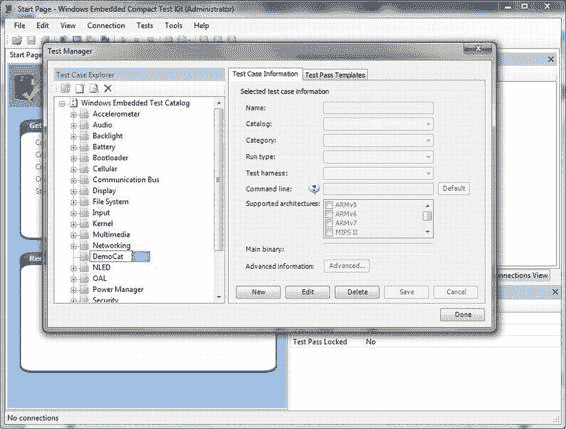

*图 12-3. 生成新的测试类别和测试用例*

您实际将 `TUX` 测试 DLL 连接到测试用例的步骤是选择支持的架构。图 12-4 显示了这个新创建的测试用例，它被命名为 `DemoDrvrAsynIOTest`，属于 `DemoCat` 类别，在这种情况下是完全自动化的，并使用 `TUX` 测试框架。一旦您尝试选择支持的架构，它需要架构特定的文件。在这种情况下，它是一个基于 `x86` 架构的设备，因此请注意，主二进制文件是 `TUX` 测试 DLL `Demodrvrtest.dll`，它位于：

`WINCEROOT\OSDesigns\DemoOSDesign\DemoOSDesign\RelDir\DemoBSP_x86_Debug`

当然，如果您要开发一个与 CPU 无关并将其放置在 `PUBLIC` 树下的设备驱动程序，您将创建一个特定的文件夹层次结构，其中包含一组位于 CPU 特定文件夹下的、依赖于 CPU 的 `TUX` 测试 DLL，并为您测试的每个 CPU 架构引用这些 DLL。

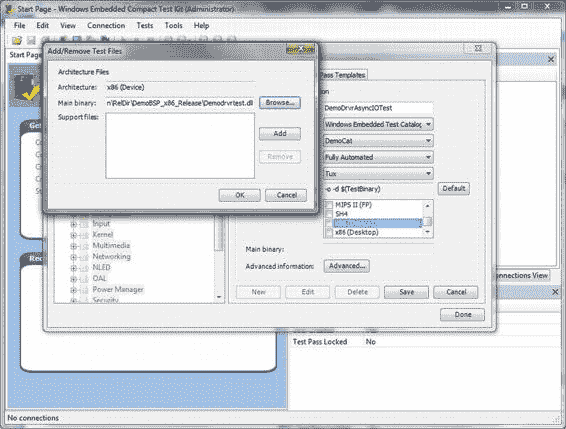

*图 12-4. 创建新的测试用例并链接架构特定的 TUX 测试 DLL 文件*

#### 从模板创建测试过程

此时，您有了一个新的测试 `DemoDrvrAsynIOTest`，它包含在新的测试类别 `DemoCat` 中。这使您可以赋予测试过程模板 `DemoTest` 意义。切换回“测试过程模板”选项卡，并通过（选择测试用例并单击“添加”按钮）将新创建的测试用例添加到 `DemoTest` 过程模板中。您实际上可以使用此过程为测试过程添加来自`“测试用例资源管理器”`的任意多个测试用例。

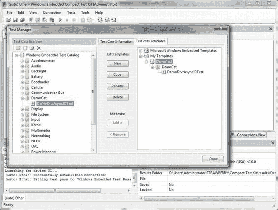

*图 12-5. 将测试用例添加到测试过程*


#### 为什么使用测试通行模板？

为何要费心创建测试通行模板？主要是为了高效管理测试会话、控制测试时间以及日志文件的大小。在描述的示例中，测试仅限于设备驱动程序的异步 IO 支持。这表明你可以仅为单个设备驱动程序创建一次测试通行。这有助于缩短测试时间，而无需运行目录中的所有测试，并且最重要的是，如你在`Listing 12-2`中所见，日志文件的大小是可管理的。在`Figure 12-6`中，你可以看到仅显示“DemoTest”通行的测试通行界面。

[www.it-ebooks.info](http://www.it-ebooks.info/)

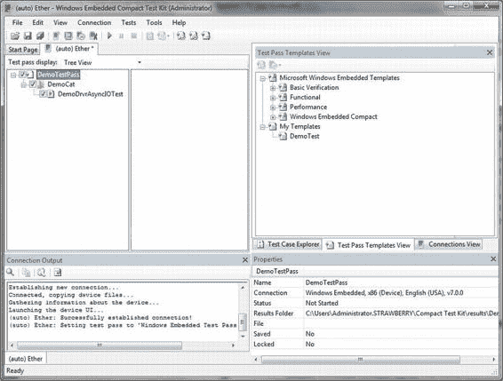

**图 12-6.** *运行 DemoTest 通行*

### 设计测试

设计测试听起来有些夸张，但实际上比听起来要简单得多。测试设备驱动程序的目的在于确保其健壮性，并且在接收到错误输入时不会崩溃。

由于不可能测试所有可能的输入，因此需要识别测试对象中最薄弱的环节，并提供测试流程以最佳评估其脆弱性。

质量保证和测试有一套需要衡量的既定指标体系。这些指标需要被鉴定合格才能通过测试。嵌入式设备的驱动程序需要的质量指标相对较少，因为嵌入式设备不同于通用计算机，特别是嵌入式设备驱动程序，不需要针对可安装性、可用性和文档等情形进行测试。嵌入式设备驱动程序需要测试的是可靠性和性能。

可靠性和性能都源于设备驱动程序的功能。在测试设备驱动程序之前，你需要完全明确设备驱动程序的功能。设备驱动程序的设计需求是一个很好的起点。

那么什么是质量指标？我们首先来定义指标。指标是一种可验证的度量标准，可以用定量或定性术语表述。它根据事物相对于标准的执行方式来衡量性能。

[www.it-ebooks.info](http://www.it-ebooks.info/)

下面的例子将以一种非常简化的方式说明这一切的含义。在这个例子中，有一个非常简单的设备驱动程序，它支持异步 I/O 写入请求。测试应检查该驱动程序是否提供了它应该提供的功能，即异步 I/O 写入请求。测试被设计用于打开设备驱动程序，并使用设备`IOCTL`码请求一个写入操作。然后，如果对`DeviceIoControl`的调用立即返回，并且之后提供了 I/O 完成指示，则测试应返回通过结果。否则，应返回失败结果。

除了功能测试之外，还添加了一项性能测试，它将完成 I/O 请求所需的时间与一个参考滴答计数进行比较。如果时间等于或小于参考滴答计数，则性能测试通过；否则失败。

### TUX 测试框架

TUX 测试框架是一个设备端的客户端可执行程序，它加载以动态链接库形式实现的设备端测试，并且可以在设备上以独立模式运行，或者由之前描述的 CTK 服务器触发执行。`Tux.exe`是一个与体系结构相关的设备端可执行测试引擎，通过核心连接与开发工作站 CTK 测试服务器进行通信。这是一种典型的客户端/服务器架构，具有许多优点，包括将 GUI 与测试引擎分离到独立的地址空间中，以及一个占用空间小的设备端测试引擎。

#### 实现一个 TUX 测试 DLL

测试在动态链接库测试模块中实现，这些模块被加载到测试引擎中，并提供两个函数原型。`ShellProc`函数负责处理测试引擎与测试模块之间的通信。这个函数通常无需修改，因为确实没有必要修改它。第二个函数是实现测试本身的函数，它有一个必须遵守的特定原型：

```
TESTPROCAPI TestProc(UINT uMsg, TPPARAM tpParam, LPFUNCTION_TABLE_ENTRY lpFTE)
```

你可以根据设计在一个模块中实现任意多个测试功能。Platform Builder 提供了一个应用程序向导，用于创建一个 TUX 测试 DLL 的骨架实现，这可以作为你测试模块的快速入门实现。设备驱动程序向导提供了类似的功能，但它会重命名模块名称并自定义初始的 TUX 函数表。`Figure 12-7`展示了设备驱动程序向导的 CTK 支持面板。

测试的实现实际上类似于为你开发的应用程序实现，该应用程序打开设备驱动程序并请求驱动程序执行一个操作。`Listing 12-1`中的例子就是如此。被测试的设备驱动程序提供了对异步写入请求的支持，就像第 7 章中的例子一样。测试函数代码与第 7 章中描述的示例演示程序非常相似。`TestProc`函数简单地调用另一个实现测试代码的函数，并返回一个布尔值指示成功或失败，使用 Kato 记录结果，并将测试状态返回给 CTK。

**列表 12-1.** *测试过程的实现 (test.cpp)*

```cpp
#include "main.h"
#include "globals.h"
#include "..\SDK\DemodrvrSDK.h"

HANDLE g_hDevice;
#define WRITE_TEST_STRING_SIZE 65536
TCHAR szBuf[WRITE_TEST_STRING_SIZE];

BOOL TestAsynchWrite()
{
    BOOL bRc = FALSE;
    DEVMGR_DEVICE_INFORMATION ddiDemo;
    TCHAR strDrvrName[5] = {'D', 'M', 'O', '*', 0};
    volatile OVERLAPPED ovlpd;
    HANDLE hCompltEvent = NULL;
    DWORD dwWaitRet = WAIT_FAILED, dwBytes = 0;

    memset(&ddiDemo, 0, sizeof(DEVMGR_DEVICE_INFORMATION));
    ddiDemo.dwSize = sizeof(DEVMGR_DEVICE_INFORMATION);

    g_hDevice = FindFirstDevice(DeviceSearchByLegacyName,
                                &strDrvrName, &ddiDemo);
    if (g_hDevice == INVALID_HANDLE_VALUE)
    {
        return bRc;
    }
    else
    {
        g_hDevice = CreateFile(L"DMO1:", 0, 0, NULL, 0, 0, NULL);
        if (g_hDevice == INVALID_HANDLE_VALUE)
        {
            return bRc;
        }
        bRc = TRUE;
    }

    // 为 IOControl IO 操作创建完成事件
    ovlpd.hEvent = CreateEvent(NULL, TRUE, FALSE, NULL);
    if (!ovlpd.hEvent)
    {
        return FALSE;
    }

    for (int i = 0; i < WRITE_TEST_STRING_SIZE; i++)
    {
        szBuf[i] = i;
    }

    memset((void*)&ovlpd, 0, sizeof(ovlpd));

    bRc = DeviceIoControl(g_hDevice, IOCTL_DEMODRVR_ASYNC_WRITE,
                          szBuf, WRITE_TEST_STRING_SIZE, NULL,
                          0, NULL, (LPOVERLAPPED)&ovlpd);

    while (!bRc) // I/O 尚未完成
    {
        bRc = GetOverlappedResult(g_hDevice,
                                  (LPOVERLAPPED)&ovlpd,
                                  &dwBytes, FALSE);
    }

    CloseHandle(ovlpd.hEvent);
    CloseHandle(g_hDevice);
    return bRc;
}

/////////////////////////////////////////////////////////////////////////////
// TestProc
// 执行一个测试。
//
// 参数：
//   uMsg       消息代码。
//   tpParam    附加的消息相关数据。
//   lpFTE      生成此调用的函数表条目。
//
// 返回值：
//   如果测试通过则返回 TPR_PASS，如果测试失败则返回 TPR_FAIL，或者可能
//   其他特殊情况。

TESTPROCAPI TestProc(UINT uMsg, TPPARAM tpParam,
                     LPFUNCTION_TABLE_ENTRY lpFTE)
{
    INT TP_Status = TPR_FAIL;

    // shell 不一定希望我们执行测试。
}
```


```cpp
// 请确保首先执行此检查。

if(uMsg != TPM_EXECUTE)
{
    return TPR_NOT_HANDLED;
}

// TODO: 将以下行替换为你自己的测试代码
// 此处。同时，将返回值 TPR_SKIP 修改为适当的代码。

if(TestAsynchWrite())
{
    TP_Status = TPR_PASS;
    g_pKato->Log(LOG_COMMENT, TEXT("此测试通过。"));
}
else
{
    g_pKato->Log(LOG_COMMENT, TEXT("此测试失败。"));
}

return TP_Status;
}
```

[www.it-ebooks.info](http://www.it-ebooks.info/)

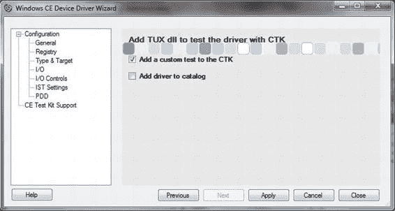

## 第 12 章 ■ 使用 CTK 开发测试代码

*图 12-7. 将 TUX 测试模块骨架添加到设备驱动程序目录层次结构中*

### 运行测试

在开发完 TUX 测试 DLL 并实现了各种测试过程以执行设计好的测试之后，你可以运行 TUX 设备端控制台应用程序，并使用命令行以独立方式加载测试 DLL 并运行测试，或者在开发工作站上运行 CTK 服务器来触发测试。在图 12-8 中，我们使用测试通过模板作为默认测试通过方案，直接运行特定测试。

[www.it-ebooks.info](http://www.it-ebooks.info/)

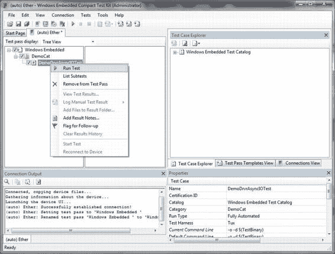

## 第 12 章 ■ 使用 CTK 开发测试代码

*图 12-8. 从 Windows Embedded Compact 测试工具包运行测试*

一旦发出运行测试的请求，TUX 会加载 `Demodrvrtest.dll` 模块，运行 `ShellProc` 函数，该函数向 TUX 注册测试过程，以便能够运行。提醒一下，一个测试 DLL 中可以实现多个测试过程。测试运行后，会写入一个日志文件，可以通过左侧的“结果”选项卡访问，如图 12-10 所述。双击日志文件图标将在记事本中打开该文件。测试完成后，它会在左下角的连接输出中显示简洁的结果输出，如图 12-9 所示。

[www.it-ebooks.info](http://www.it-ebooks.info/)

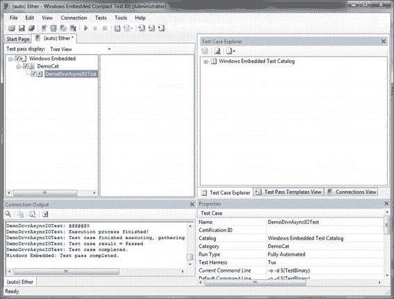

## 第 12 章 ■ 使用 CTK 开发测试代码

*图 12-9. 测试运行后的连接输出*

### 查看和分析测试结果

简短的结果输出可以立即指示测试是通过还是失败。如果测试通过，你很可能就会结束会话。你可能希望创建更复杂的测试，这些测试会自动重复多次，或者使用不同的参数，或者重试几次，但这实际上是一种效率很低的测试方法。然而，如果测试失败，你肯定希望更详细地检查结果。如果使用图 12-10 中描述的结果选项卡，你将打开测试的日志文件，并能够扫描日志以查找可能的问题。清单 12-2 展示了 `DemoDrvrAsynIOTest` 测试的测试结果日志。

[www.it-ebooks.info](http://www.it-ebooks.info/)

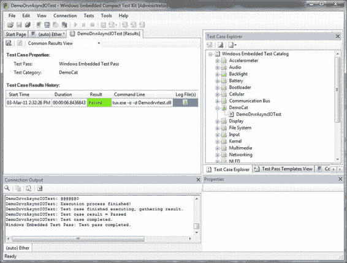

## 第 12 章 ■ 使用 CTK 开发测试代码

*图 12-10. 使用测试的测试用例结果历史记录打开测试日志文件*

日志文件的初始部分提供内存和存储状态信息。下一部分描述每个测试用例及其结果。这些信息按 TUX 测试 DLL 分组，并通过测试用例 ID 分隔。接下来的部分提供测试执行后的内存和存储状态信息。这很可能表明测试套件和/或被测对象中可能存在内存泄漏。最后是一个描述测试套件摘要的部分。

*清单 12-2. results.log 的内容*

```
*******
***** 内存总量：330,600,448 字节
***** 已用内存：11,542,528 字节
***** 空闲内存：319,057,920 字节
*******
***** 内核已用：471,040 字节
***** 水位线：77,895 页
*******
***** 存储总量：133,971,968 字节
***** 已用存储：999,424 字节
```

[www.it-ebooks.info](http://www.it-ebooks.info/)

## 第 12 章 ■ 使用 CTK 开发测试代码

```
***** 空闲存储：132,972,544 字节
```


  
*****
#### 开始组：`Demodrvrtest.DLL`

**<测试用例 ID=1>**

*****
**vvvvvvvvvvvvvvvvvvvvvvvvvvvvvvvvvvvvvvvvvvvvvvvvvvvvvvvvvvvvvvvvvv**
**测试开始**

- **测试名称：** `Demodrvr test`
- **测试 ID：** `1`
- **库路径：** `\release\demodrvrtest.dll`
- **命令行：**
- **内核模式：** 否
- **随机种子：** `5511`
- **线程数：** `0`

**vvvvvvvvvvvvvvvvvvvvvvvvvvvvvvvvvvvvvvvvvvvvvvvvvvvvvvvvvvvvvvvvvv**
**开始测试："Demodrvr test"，线程数=0，种子=5511**
此测试通过。
**结束测试："Demodrvr test"，结果：通过，用时=0.050**

*****
**^^^^^^^^^^^^^^^^^^^^^^^^^^^^^^^^^^^^^^^^^^^^^^^^^^^^^^^^^^^^^^^^^^**
**测试完成**

- **测试名称：** `Demodrvr test`
- **测试 ID：** `1`
- **库路径：** `\release\demodrvrtest.dll`
- **命令行：**
- **内核模式：** 否
- **结果：** 通过
- **随机种子：** `5511`
- **线程数：** `1`
- **执行时间：** `0:00:00.050`

**^^^^^^^^^^^^^^^^^^^^^^^^^^^^^^^^^^^^^^^^^^^^^^^^^^^^^^^^^^^^^^^^^^**
**</测试用例 结果="通过">**

**结束组：`Demodrvrtest.DLL`**

*****
**内存信息**
- **内存总量：** `330,600,448` 字节
- **已用内存：** `11,751,424` 字节
- **可用内存：** `318,849,024` 字节

- **内核已用：** `471,040` 字节
- **水位线：** `77,844` 页

- **存储总量：** `133,971,968` 字节
- **已用存储：** `999,424` 字节
- **可用存储：** `132,972,544` 字节

*****
**套件摘要**
- **通过：** `1`
- **失败：** `0`
- **跳过：** `0`
- **中止：** `0`
- **------- ---------**
- **总计：** `1`

- **累计测试执行时间：** `0:00:00.050`
- **TUX 套件总执行时间：** `0:00:00.070`
- **CPU 空闲时间：** `0:00:00.000`

*****
**</测试组>**
**@@@@@@0**

---

### 性能测试

性能测试实际上是评估一个基准标尺，测试结果将与之比较。如果比较结果优于或等于此基准，则测试通过；若低于基准值，则测试失败。功能测试在设备驱动程序提供异步 I/O 写入请求时返回通过结果。将测试扩展为测量此请求的持续时间，并将其与特定的参考滴答计数进行比较，即为测试者提供了性能测试。

### 添加第二个测试过程

向 `Demodrvrtest` TUX 测试 DLL 添加第二个测试过程，意味着在代码中添加了第二个测试过程。清单 12-3 展示了如何修改 `test.cpp` 以提供两个测试，清单 12-4 演示了如何将第二个函数添加到 TUX 函数表中，以便 `ShellProc` 函数能够注册它。此实现是一个简单的示例，它使用相同的辅助函数来执行实际测试并确定结果。该函数增加了滴答计数测量，然后将滴答计数持续时间与特定的参考滴答计数值进行比较，以得出通过或失败的结果，而功能测试则基本保持不变。传递给该函数的一个参数决定了要执行哪个测试。第二个测试过程命名为 `PerfomanceTestProc`，并且必须符合 `TESTPROCAPI` 声明。

*清单 12-3. 两个测试过程的实现（test.cpp）*

```cpp
#include "main.h"
#include "globals.h"
#include "..\SDK\DemodrvrSDK.h"

HANDLE g_hDevice;
#define WRITE_TEST_STRING_SIZE 65536
TCHAR szBuf[WRITE_TEST_STRING_SIZE];

BOOL TestAsynchWrite(int nTest)
{
    BOOL bRc = FALSE;
    DEVMGR_DEVICE_INFORMATION ddiDemo;
```


```c
TCHAR strDrvrName[5] = {'D', 'M', 'O', '*', 0};

volatile OVERLAPPED ovlpd;

HANDLE hCompltEvent = NULL;

DWORD dwWaitRet = WAIT_FAILED, dwBytes = 0;

DWORD dwOldTime = 0, dwTimeElapsed = 0;

memset(&ddiDemo, 0, sizeof(DEVMGR_DEVICE_INFORMATION));

ddiDemo.dwSize = sizeof(DEVMGR_DEVICE_INFORMATION);

g_hDevice = FindFirstDevice(DeviceSearchByLegacyName,
                            &strDrvrName,
                            &ddiDemo);

if (g_hDevice == INVALID_HANDLE_VALUE)
{
    return bRc;
}
else
{
    g_hDevice = CreateFile(L"DMO1:", 0, 0, NULL, 0, 0, NULL);
    if (g_hDevice == INVALID_HANDLE_VALUE)
    {
        return bRc;
    }
    bRc = TRUE;
}

// 为 IOControl IO 操作创建一个完成事件
ovlpd.hEvent = CreateEvent(NULL, TRUE, FALSE, NULL);
if (!ovlpd.hEvent)
{
    return FALSE;
}

for (int i = 0; i < WRITE_TEST_STRING_SIZE; i++)
{
    szBuf[i] = i;
}

memset((void*)&ovlpd, 0, sizeof(ovlpd));

dwOldTime = GetTickCount();

bRc = DeviceIoControl(g_hDevice, IOCTL_DEMODRVR_ASYNC_WRITE,
                      szBuf, WRITE_TEST_STRING_SIZE, NULL,
                      0, NULL, (LPOVERLAPPED)&ovlpd);
```
[www.it-ebooks.info](http://www.it-ebooks.info/)

第 12 章 ■ 使用 CTK 开发测试代码

```c
while (!bRc)
// I/O 尚未完成
{
    bRc = GetOverlappedResult(g_hDevice,
                               (LPOVERLAPPED)&ovlpd,
                               &dwBytes, FALSE);
    if (!!bRc)
    {
        g_pKato->Log(LOG_COMMENT,
                     TEXT("异步 I/O 已挂起，已写入 %d 字节\r\n"),
                     ovlpd.InternalHigh);
    }
}

dwTimeElapsed = GetTickCount() - dwOldTime;

CloseHandle(ovlpd.hEvent);
CloseHandle(g_hDevice);

switch (nTest)
{
    case 1:
        if (dwBytes < WRITE_TEST_STRING_SIZE)
        {
            bRc = FALSE;
        }
        else if (dwBytes == WRITE_TEST_STRING_SIZE)
        {
            bRc = TRUE;
        }
        break;

    case 2:
        if (dwTimeElapsed > 250)
        {
            bRc = FALSE;
        }
        else
        {
            bRc = TRUE;
        }
        break;
}

return bRc;
}
```
245
[www.it-ebooks.info](http://www.it-ebooks.info/)

第 12 章 ■ 使用 CTK 开发测试代码

```c
///////////////////////////////////////////////////////////////////
// TestProc
// 执行一项测试。
//
// 参数：
//   uMsg     消息代码。
//   tpParam  附加的消息相关数据。
//   lpFTE    生成此调用的函数表项。
//
// 返回值：
//   如果测试通过则返回 TPR_PASS，测试失败则返回 TPR_FAIL，
//   或者可能返回其他特殊条件。

TESTPROCAPI TestProc(UINT uMsg, TPPARAM tpParam,
                     LPFUNCTION_TABLE_ENTRY lpFTE)
{
    INT TP_Status = TPR_FAIL;

    // Shell 不一定要求我们执行测试。先确认一下。
    if (uMsg != TPM_EXECUTE)
    {
        return TPR_NOT_HANDLED;
    }

    // TODO: 将下面一行替换为您自己的测试代码
    // 此处。同时将返回值从 TPR_SKIP 改为适当的代码。

    if (TestAsynchWrite(1))
    {
        TP_Status = TPR_PASS;
        g_pKato->Log(LOG_COMMENT, TEXT("此测试通过。"));
    }
    else
    {
        g_pKato->Log(LOG_COMMENT, TEXT("此测试失败。"));
    }

    return TP_Status;
}
```
246
[www.it-ebooks.info](http://www.it-ebooks.info/)

第 12 章 ■ 使用 CTK 开发测试代码

```c
///////////////////////////////////////////////////////////////////
// PerfomanceTestProc
// 执行一项测试。
//
// 参数：
//   uMsg     消息代码。
//   tpParam  附加的消息相关数据。
//   lpFTE    生成此调用的函数表项。
//
// 返回值：
//   如果测试通过则返回 TPR_PASS，测试失败则返回 TPR_FAIL，
//   或者可能返回其他特殊条件。

TESTPROCAPI PerfomanceTestProc(UINT uMsg, TPPARAM tpParam,
                               LPFUNCTION_TABLE_ENTRY lpFTE)
{
    INT TP_Status = TPR_FAIL;

    // Shell 不一定要求我们执行测试。先确认一下。
    if (uMsg != TPM_EXECUTE)
    {
        return TPR_NOT_HANDLED;
    }

    // TODO: 将下面一行替换为您自己的测试代码
    // 此处。同时将返回值从 TPR_SKIP 改为适当的代码。
```


```c
if (TestAsynchWrite(2))
{
    TP_Status = TPR_PASS;
    g_pKato->Log(LOG_COMMENT, TEXT("This test passed."));
}
else
{
    g_pKato->Log(LOG_COMMENT, TEXT("This test failed."));
}
return TP_Status;
```

[www.it-ebooks.info](http://www.it-ebooks.info/)

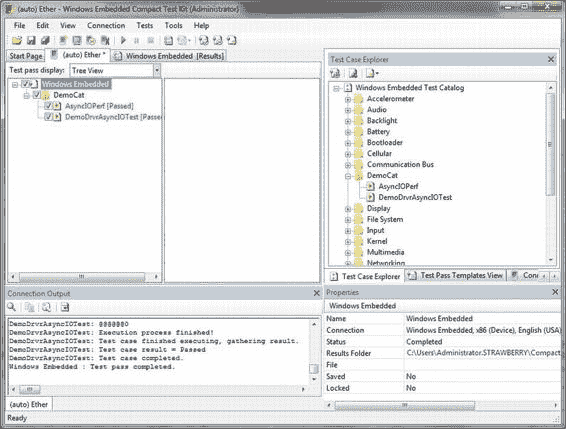

