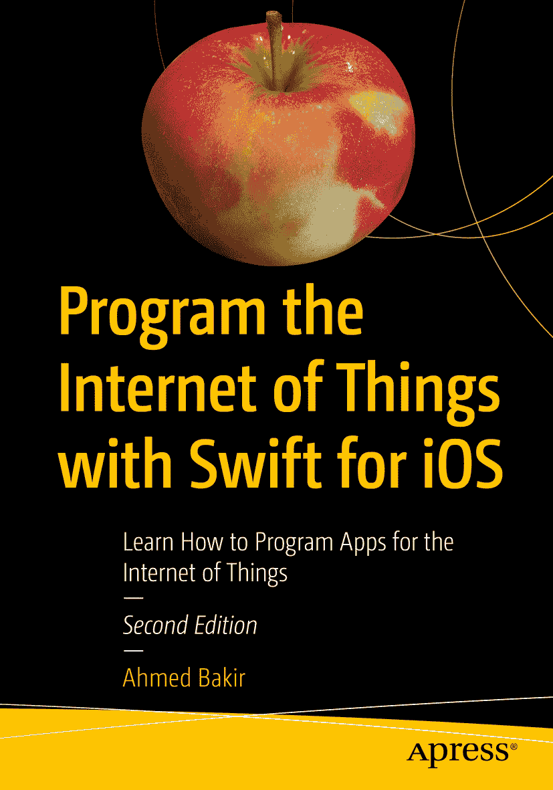

#   

ISBN 978-1-4842-3512-6  
电子 ISBN 978-1-4842-3513-3  
[`doi.org/10.1007/978-1-4842-3513-3`](https://doi.org/10.1007/978-1-4842-3513-3)  
美国国会图书馆控制号：2018964570  

© Ahmed Bakir 2018  
标准 Apress 出版  

书中可能包含商标名称、徽标和图片。我们并非在每次出现商标名称、徽标或图片时都使用商标符号，而是仅以编辑方式使用这些名称、徽标和图片，以维护商标所有者的权益，并无意侵犯其商标。本书中使用商品名称、商标、服务标记及类似术语（即使未明确标识）不应被视为对其是否受专有权利保护的立场表述。

尽管本书中的建议和信息在出版时被认为是真实准确的，但作者、编辑及出版商均不对可能出现的任何错误或遗漏承担法律责任。出版商对书中所含内容不作任何明示或暗示的担保。

本书由 Springer Science+Business Media New York 在全球图书贸易中发行，地址：233 Spring Street, 6th Floor, New York, NY 10013。电话：1-800-SPRINGER，传真：(201) 348-4505，电子邮件：`orders-ny@springer-sbm.com`，或访问 `www.springeronline.com`。Apress Media, LLC 是加利福尼亚州的有限责任公司，其唯一成员（所有者）是 Springer Science + Business Media Finance Inc (SSBM Finance Inc)。SSBM Finance Inc 是一家特拉华州的公司。

*谨以此书献给我的母亲 Layla Bakir，她让我懂得了对教学的热爱和持久的乐观*

