# 为你的第一个物联网应用奠定基础

在深入探讨苹果的物联网技术之前，我认为先简要介绍一下你将在本书中构建项目时使用的一些工具和工作流程会很有帮助。在本书中，你构建物联网应用的主要工具将是苹果的 Xcode 集成开发环境及其用于构建用户界面的 `Interface Builder` 工具。在教授 iOS 开发时，我经常注意到，无论是新手还是有经验的开发者，都认为掌握这些工具是最大的挑战之一，甚至比掌握 `Swift` 或任何框架的特性更难。

为了练习使用 Xcode，在本章中，你将开始开发你的第一个 iOS 物联网应用：`IOTFit`，这是一款利用用户手机定位服务（GPS）帮助他们记录运动时长和地点的健身应用。如果你是 `Runkeeper` 或 `Nike Plus` 这类健身应用的忠实用户，你会意识到时间追踪是最基本的要求，而位置追踪则是一项能吸引用户并让他们持续使用的功能。

在本书中，你将不断扩展 `IOTFit` 应用，以集成更多苹果的物联网框架。我希望这种方法能帮助你注意到何时某些解决方案比其他方案更合适。此外，我觉得这种方法非常类似于许多敏捷工作环境，在这种环境中，你基于每次明确定义的一组功能，不断优化或扩展一个产品。

如果你已经熟悉 iOS 开发，可以快速浏览本章内容，但我强烈建议你看一下截图，看看自你上次使用 Xcode 以来是否有任何变化。本章内容是基于 Xcode 9 和 10 设计并测试的。

## 学习目标

在本章中，你将通过开始开发 `IOTFit` 应用，学习以下在 iOS 上进行物联网开发的关键技能。

- 在 Xcode 中设置项目
- 修改项目的默认设置
- 将 Xcode 链接到你的 Apple Developer Program 账户
- 使用 `Interface Builder` 布局自适应用户界面
- 将基于视觉布局的用户界面连接到代码

苹果平台开发最令人恼火的一点是，为了实现作为 iOS 开发者的关键里程碑（例如发布你的第一个应用），你必须掌握使用 Xcode 的某些工作流程和方面。为了帮助你完成这个过程，在本章中，我将尽可能在项目设置和用户界面设置步骤中包含详细的截图和解释。

不幸的是，苹果经常更换其旧工具和工作流程。这使得苹果能够构建更符合当前趋势的工具，但也给开发者带来了跟上最新变化和注意事项的负担。根据我的个人经验，我注意到，虽然工作流程可能每隔几年才改变一次，但项目设置几乎每次重大发布都会改变。在过去两年中，iOS 11 增加了强制设置，用于启用权限锁定的功能，如位置共享；而 iOS 12 则更进一步，替换了默认的构建系统。

在本章中，我强调自适应（苹果的术语）用户界面开发，因为目前支持的 iOS 设备种类繁多。虽然 iPhone 8 和 8 Plus 这类外形尺寸的设备在撰写本文时使用最广泛，但小巧的 iPhone SE 仍在活跃设备中占据很大比例，而苹果的无边框设备（iPhone X、XR、XS、XS Max）正被强势定位为该平台的未来。如果你考虑 iPad 产品线，你会注意到 iPad mini 几乎与 iPhone 8 Plus 大小相同，而 13 英寸的 iPad Pro 型号比当今许多笔记本电脑还要大。作为开发者，能在所有这些设备上运行相同的代码真是太棒了；然而，这需要付出代价，即必须进行一些仔细的准备工作并调试，以确保在所有设备上体验一致。在本章中，我将分享我用来构建自适应用户界面的工作流程，以及我认为能帮助你更轻松地完成此任务的技巧。

### 注意

为清晰起见，本书中的图表展示了这些项目的 iPhone 实现。本书中的大多数项目在 iPad 上也能正常运行，除非是那些需要特定设备硬件的项目（例如 `Core Motion`、`Face ID`）。我会在相关章节的开头说明这些项目。

本章旨在指导你完成设置项目的过程，但如果你在过程中遇到任何问题，并希望查看已完成的项目作为参考，可以从本书的 GitHub 仓库中获取，位于 `Chapter 1` 文件夹下 (`https://github.com/Apress/program-internet-of-things-w-swift-for-ios`)。

### 设置项目

在开始开发一个项目之前，我总是想知道自己要构建什么。为了帮助你更好地理解 `IOTFit` 应用的第一个版本将包含哪些内容，请查看图 1-1 中的线框图。在设计术语中，线框图通常是一个初步草图（手绘或计算机生成），它布局了用户界面最关键的组件。

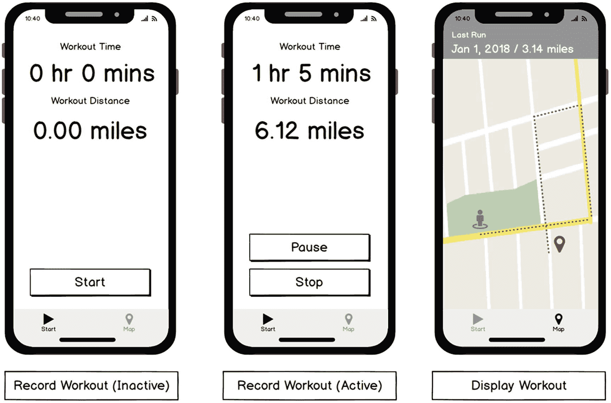

*图 1-1 IOTFit 应用的线框图*

查看线框图时，你会注意到应用的三种主要状态：记录运动（非活跃状态）、记录运动（活跃状态）和在地图上显示运动。当用户想要开始运动时，他们按下记录屏幕上的 `Start` 按钮，按钮和标签上的文字会改变，以指示正在记录运动。如果用户想在地图上查看他们的进度，他们按下底部标签栏中的 `Map` 图标，应用将显示一个带注释的地图来取代记录屏幕。如果你使用 iOS 上的 `App Store` 或 `Facebook` 应用，你应已熟悉标签栏，这是一种在应用屏幕间切换的便捷方式，同时保留每个标签的状态。虽然线框图上没有列出，但您将为应用实现的背景状态保留功能，允许用户即使在应用处于后台时也能持续追踪运动。


### 线框图 vs. 高保真原型

在项目初期，我喜欢先使用线框图，让项目相关方、开发人员和设计团队在应用程序需要实现的功能上达成共识，然后再投入到耗时的高保真原型制作中。高保真原型是通过 Photoshop 或 Sketch 生成的设计资源，用于指定实现的精细细节，包括精确的颜色、字体大小和阴影。丢弃或重做线框图要比重做高保真原型容易得多！

要开始开发流程，你需要为 IOTFit 应用创建一个新的 Xcode 项目，并配置好所需使用的 iOS 框架。Apple 提供了非常丰富的工具箱供你使用，但总需要进行一些细致的准备工作。在开始之前，先花点时间思考一下，你想要使用哪些框架来实现应用的需求，然后参考表 1-1，其中列出了本项目最终会用到的一系列应用程序编程接口。

**表 1-1** IOTFit 功能及其对应的 iOS API

| 需求 | 应用程序编程接口 | 父框架 |
| --- | --- | --- |
| 轻松切换屏幕 | Tab View Controller (`UITabViewController`) | UIKit |
| 显示地图 | Map View (`MKMapViewController`) | MapKit |
| 访问 GPS 硬件 | Location Manager (`CLLocationManager`) | Core Location |
| 请求位置权限 | Location Manager (`CLLocationManager`) | Core Location |

`UITabViewController` 和 `MKMapViewController` 类将驱动用户界面中最复杂的部分。Core Location 框架将负责处理和跟踪用户位置这一繁重任务。

现在你对项目的技术和设计方面有了更好的了解，就可以开始实现了。首先，在你的 Mac 上打开 Xcode，从“欢迎使用 Xcode”界面（如图 1-2 所示）点击 **创建新的 Xcode 项目** 来新建一个 Xcode 项目。或者，如果 Xcode 已经打开，你可以点击 **文件** 菜单，然后选择 **新建 > 项目**。

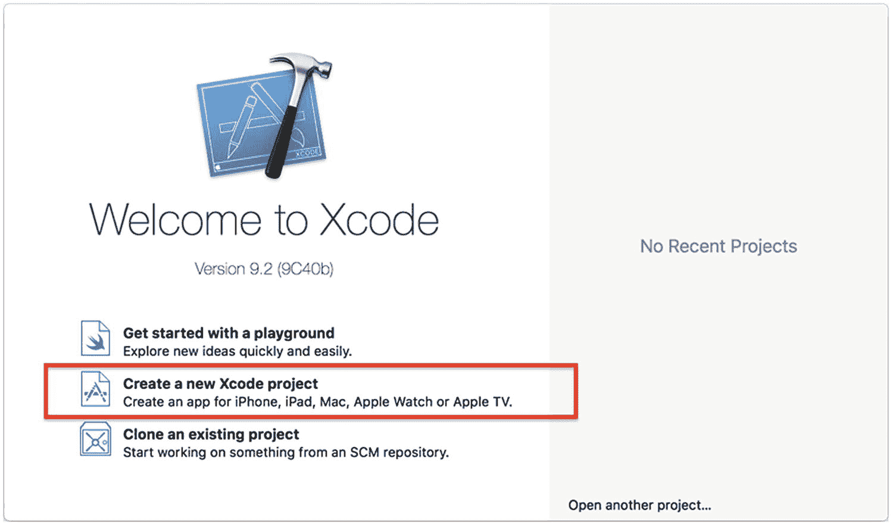

**图 1-2** 从 Xcode 欢迎界面创建新项目

接下来，Xcode 会弹出一个窗口，要求你为项目选择模板类型。如图 1-3 所示，选择 **标签页应用** 来创建一个基于模板的项目，该模板包含一个标签栏控制器和两个空的视图控制器。这个模板与你为 IOTFit 应用准备的通用用户界面非常接近，可以节省大量手动设置的时间。

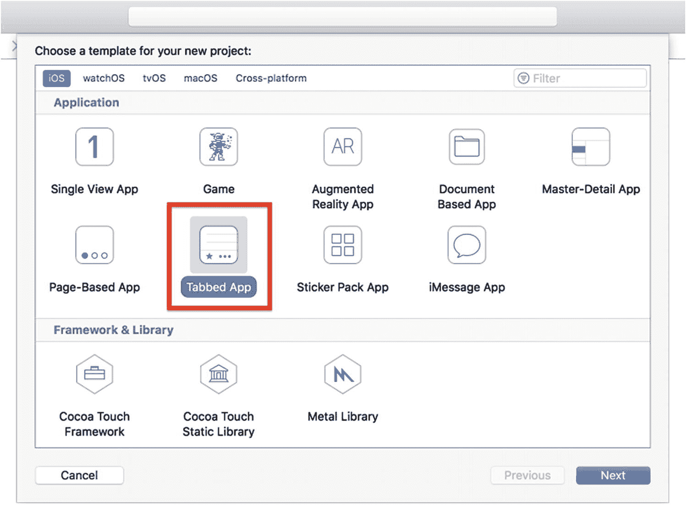

**图 1-3** 选择标签页应用模板

选择正确的模板后，点击 **下一步** 按钮，然后在提示设置项目选项时，输入“IOTFit”作为项目名称，如图 1-4 所示。这将用作整个项目的通用标识符，也是 iOS 主屏幕上应用的默认显示名称。如果你有想要使用的组织名称或组织标识符，也可以在此输入。此时你无需为项目设置团队，可以稍后在确认项目已成功创建后再进行设置。

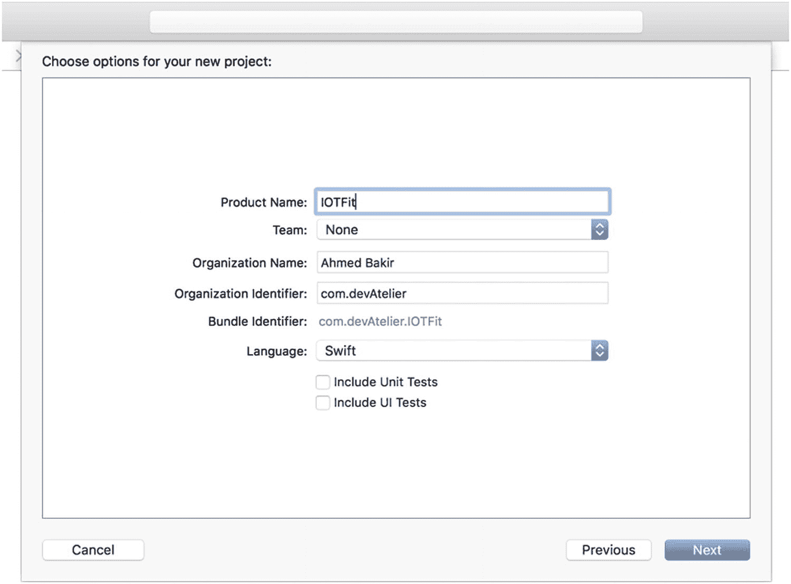

**图 1-4** IOTFit 项目的初始选项

确认这些选项后，点击 **下一步** 按钮，然后选择一个位置来保存项目。我喜欢将项目放在个人目录中容易找到的文件夹里。如图 1-5 所示，点击 **创建** 按钮即可生成项目。

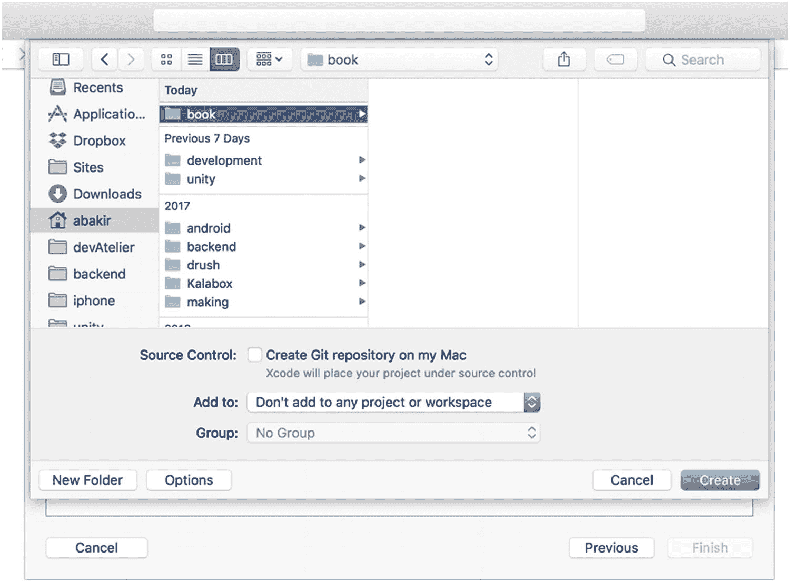

**图 1-5** 为 IOTFit 项目选择保存位置

项目成功生成后，Xcode 会打开新项目的 Xcode 编辑器窗口，如图 1-6 所示。

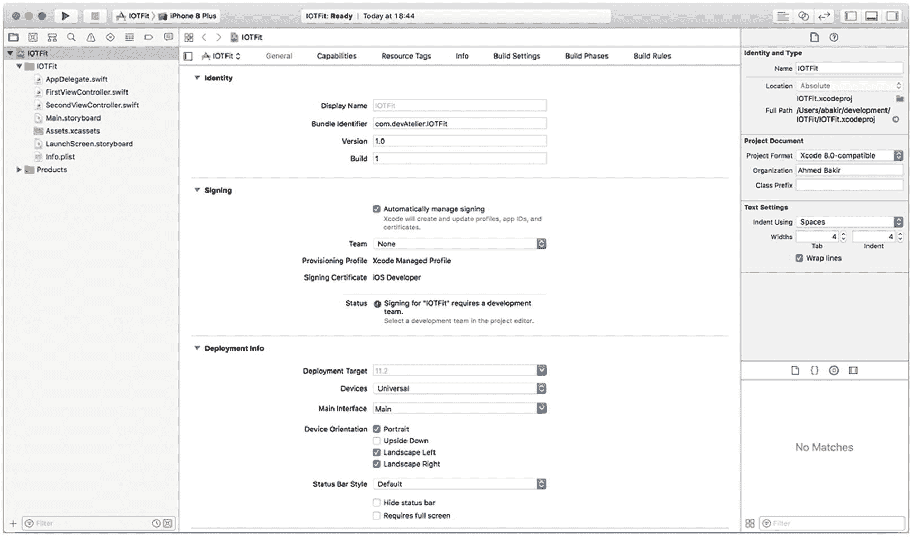

**图 1-6** IOTFit 项目的默认 Xcode 编辑器窗口

如果你已经开发应用一段时间，这个编辑器窗口应该非常熟悉。对于新用户，此界面的主要区域描述如下。

*   **导航窗格（左侧）**：项目的地图，让你管理项目层级、在项目中搜索文本，并快速导航至调试问题。
*   **编辑器窗格（中央）**：主编辑工作区，可以修改源代码、构建设置，以及查看源代码管理文件的差异对比。
*   **实用工具窗格（右侧）**：源代码助手，可以管理单个文件的附加设置，并通过高亮类名快速查看其帮助提示。

回到手头的项目，验证生成项目的设置是否与图 1-7 的放大截图相似。特别要确认导航窗格中项目是否包含源文件，以及应用的显示名称和包标识符与你之前输入的匹配。

> **提示**：如果项目设置没有随编辑器窗口自动显示，可以手动在项目导航器（导航窗格中最顶部的项目）中点击项目名称来选择。

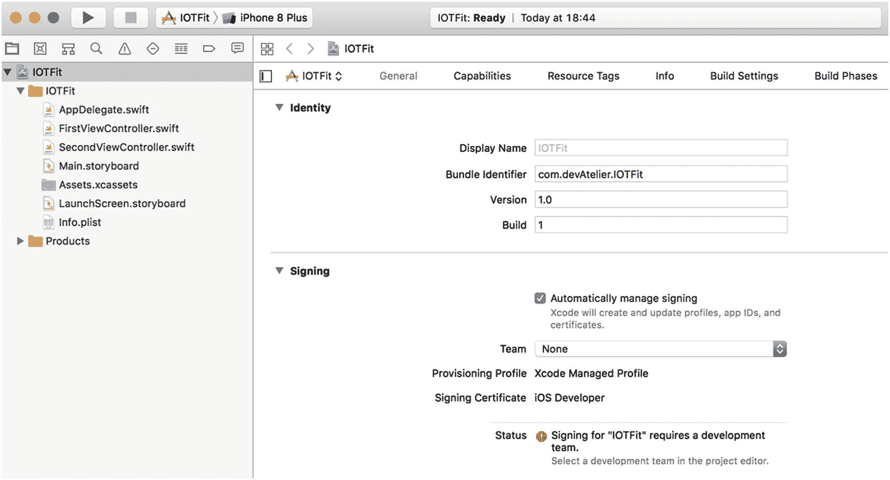

**图 1-7** IOTFit 的默认 Xcode 项目设置

### 将你的 Apple 开发者账户关联到 Xcode

首次在你的电脑上打开 Xcode 或一个并非自己创建的项目（例如从 GitHub 克隆的项目）时，项目设置的 **签名** 部分可能会显示图 1-8 或图 1-9 所示的错误消息之一，表示找不到构建项目所需的签名凭据。

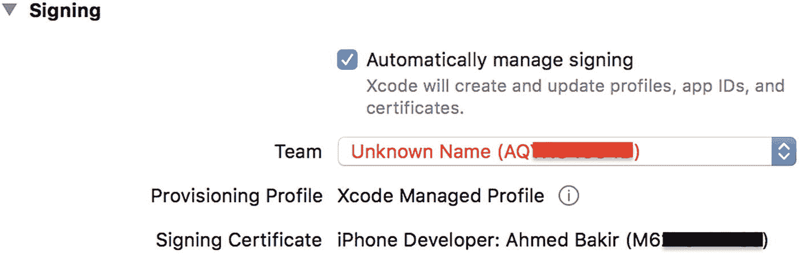

**图 1-9** 缺少 Apple 开发者账户导致的签名错误

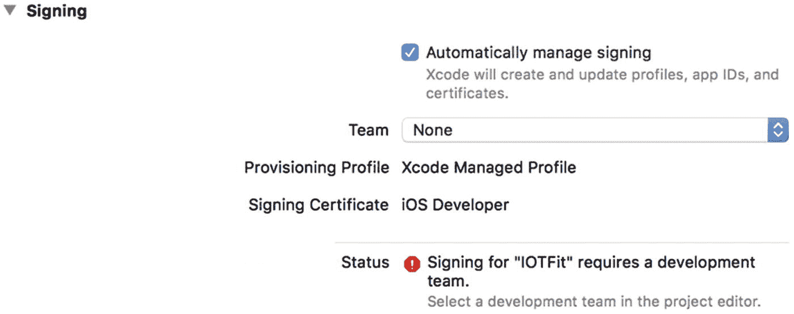

**图 1-8** 全新 Xcode 安装导致的签名错误

要解决这些问题，请点击 **团队** 旁边的下拉菜单，如图 1-10 所示。然后点击 **添加账户**。

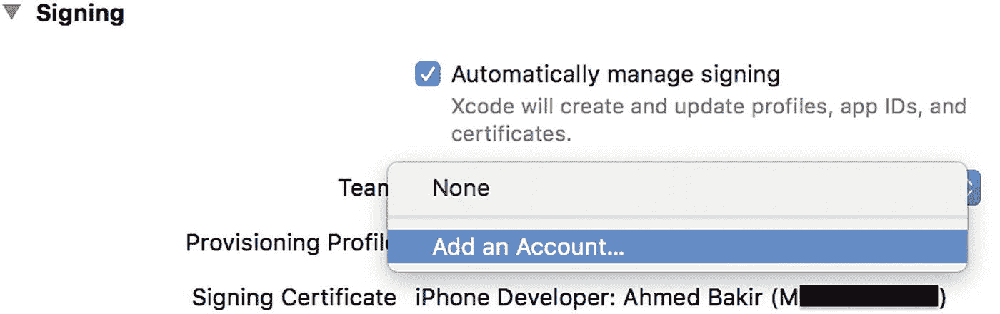

**图 1-10** 团队选择下拉菜单

做出选择后，Xcode 会显示如图 1-11 所示的登录提示。如果你已付费加入 Apple 开发者计划，请使用该账户登录。否则，请输入一个有效的 Apple ID（用于 iTunes 或 App Store 的账户）。

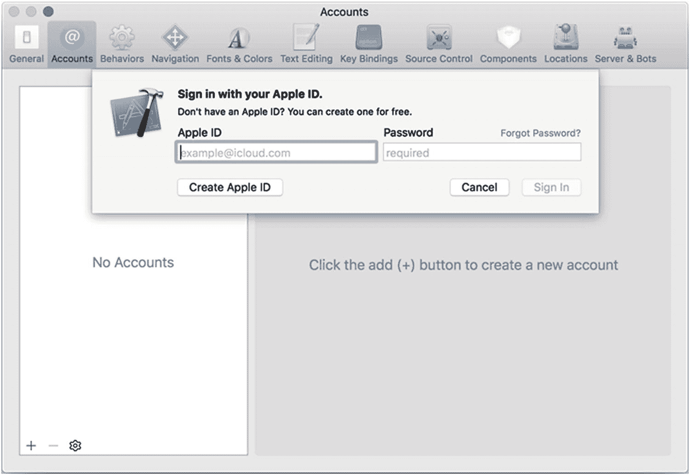

**图 1-11** Xcode 的 Apple ID 登录提示


### 注意事项

Apple 允许你在不付费的情况下创建一个受限的开发者账户，这样每个 Apple ID 最多可以测试三台设备。对于本书而言，这种类型的账户就足够了。但是，当你需要在 App Store 上发布应用，或者希望通过 TestFlight 或企业级分发进行共享时，你就必须将账户升级到付费级别。

登录后，“账户”窗口会显示你的 Apple ID 所关联的所有 Apple Developer Program 团队列表，如图 1-12 所示。若要登录另一个 Apple ID 账户，或向 Xcode 添加源代码管理账户（例如 GitHub、Bitbucket），可以点击左下角的加号（+）按钮（在图 1-12 中用圆圈标出）。

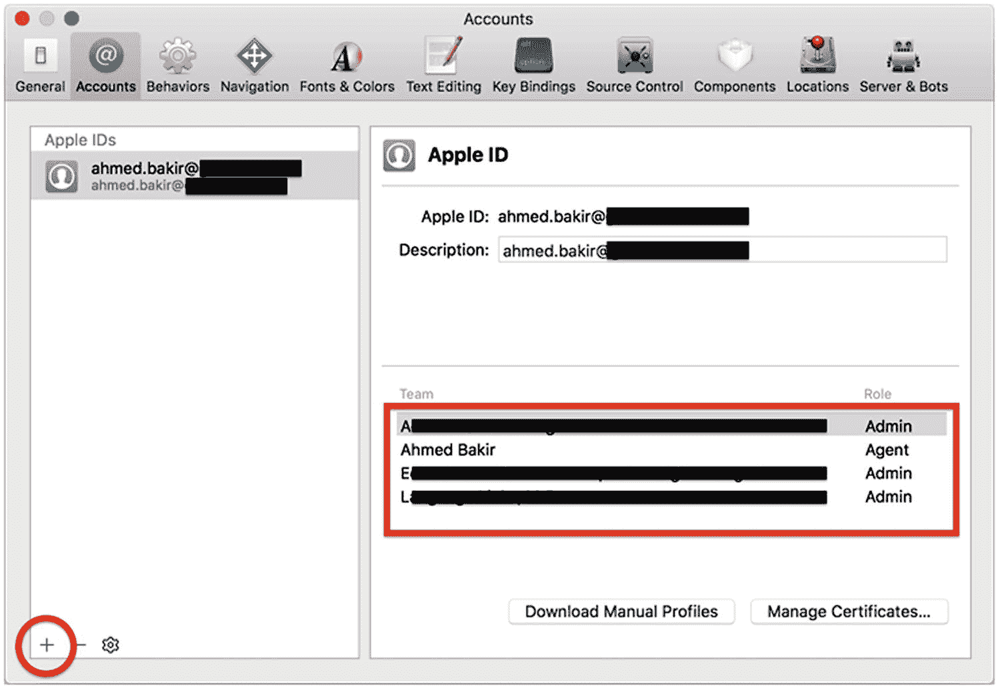

图 1-12：成功登录后的“账户”窗口

成功链接账户后，就可以安全地关闭“账户”窗口了。当你返回编辑器窗口时，你的项目设置应该类似于图 1-13，但项目中已经将你的团队设为默认团队。

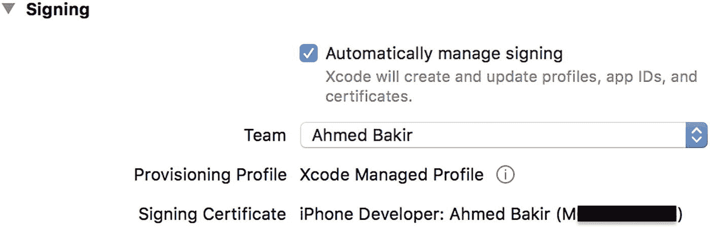

图 1-13：成功登录后的项目设置

如果关闭“账户”窗口后，你的选择仍未出现，请再次点击“团队”下拉菜单，手动选择一个已关联的团队。你也可以使用同样的方法更改项目所关联的团队。

至此，本章的项目设置阶段就完成了。在后续的章节中，你将回到项目设置中为应用添加新功能。届时可以将本节内容作为快速参考。

## 构建自适应用户界面

作为一名应用开发者，你始终需要牢记三个要点：“*如何构建它？*”、“*如何说服用户下载它？*”以及“*如何让用户持续使用？*”虽然营销策略对于建立和维护客户群至关重要，但作为开发者，你可以通过确保应用拥有完善的功能集，并在所有设备上提供引人入胜且一致的用户体验，来让应用对用户更具吸引力。在本节中，我将向你介绍如何使用 iOS 的 Auto Layout 功能，来构建一个能够*适应* iOS 所支持的所有不同设备的用户界面。

在 iPhone 5 发布之前，iOS 开发者只需要关注两款设备：iPhone 和 iPad。如果开发者想要走在技术前沿，还需要配置所有用户界面元素以支持设备旋转。对于这种工作流程，我们大多数人可以自行编写整个布局代码，并为 iPhone 和 iPad，以及竖屏和横屏模式分别维护独立的 Interface Builder（`.xib`）文件。然而，自 iPhone 4 发布后，情况开始迅速变化，而如今的 iOS 设备阵容相比早期已经大大扩展。例如，图 1-14 展示了截至 2018 年底，Interface Builder 中的设备预览选项截图。

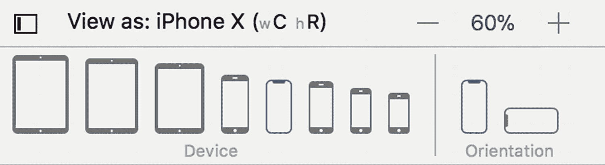

图 1-14：Xcode 9 的 Interface Builder 设备预览选择器

按屏幕尺寸递减的顺序，你可以预览以下设备：

- iPad Pro 13"
- iPad Pro 10.5"
- iPad Pro 9.7"
- iPhone 8 Plus
- iPhone X
- iPhone 8
- iPhone SE
- iPhone 4S

再回头看图 1-14，如果你仔细观察，会发现列表中的每款 iPhone 都有不同的屏幕宽高比。当将这些变量与竖屏和横屏模式结合起来时，iOS 开发者为何很久以前就放弃了为用户界面元素硬编码像素位置，原因就显而易见了。那样做会让你陷入无穷无尽的 `if` 语句深渊！

通过使用 Apple 的特征 API（`horizontalSizeClass`、`verticalSizeClass`、`displayScale`、`userInterfaceIdiom`），你可以在运行时确定当前运行设备的显示特性，而无需关心具体的设备型号或像素尺寸。然后，你可以利用这些信息来定义规则（*约束*），告诉 Auto Layout 如何针对不同的屏幕配置（例如，横屏模式下的 iPad Pro，竖屏模式下的 iPhone SE）来调整界面元素。

每个尺寸类别有两个可能的值：`regular`（常规）或 `compact`（紧凑）。Auto Layout 将 iPad 定义为纯粹的 `regular` 设备。无论屏幕方向如何，其水平和垂直尺寸类别都返回 `regular` 值。然而，iPhone 会根据设备方向引入 `compact` 值。处于竖屏方向的 iPhone，其垂直尺寸类别返回 `regular`，水平尺寸类别返回 `compact`。处于横屏方向的 iPhone，其垂直尺寸类别返回 `compact`，水平尺寸类别也返回 `compact`。如果你想知道原因，图 1-15 应该能提供帮助。当你将竖屏方向的 iPhone X 与横屏方向的 10 英寸 iPad Pro 放在一起比较时，你会注意到它们的屏幕高度大致相同，但 iPhone X 的宽度要小得多。当你将 iPhone X 旋转至横屏方向时，它的两个维度都会比 iPad Pro 小得多。

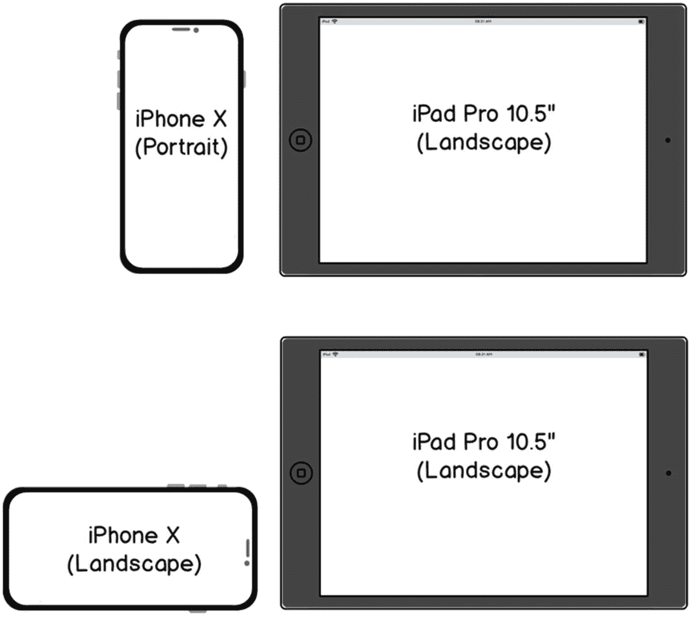

图 1-15：iPhone X 和 iPad Pro 物理尺寸对比

在本项目中，你将通过 Interface Builder 将界面元素放置到应用的主故事板中，然后使用 IDE 为每个元素设置 Auto Layout 约束。Interface Builder 的预览工具允许你在不同的设备配置之间切换，从而查看你定义的规则是否足以完美适配目标设备。根据我以往的经验，最有效的方法是先在 Interface Builder 中处理好 Auto Layout 的大部分细节，然后再通过代码进行微调。


### 从基础模板重命名类

如前所述，使用 Apple 的 Tabbed App 模板的一大优势在于，它会自动为项目预填充一个故事板（storyboard）和多个空类，这些类用于一个以标签界面作为屏幕间主要导航方式的应用。之前我们已经确认项目本身生成成功。要验证故事板是否生成成功，请点击项目导航器中的 `Main.storyboard` 文件。编辑器窗口的中央面板应切换至界面构建器，并显示默认故事板的内容，如图 1-16 所示。故事板应包含一个连接到两个空白视图控制器的标签视图控制器。

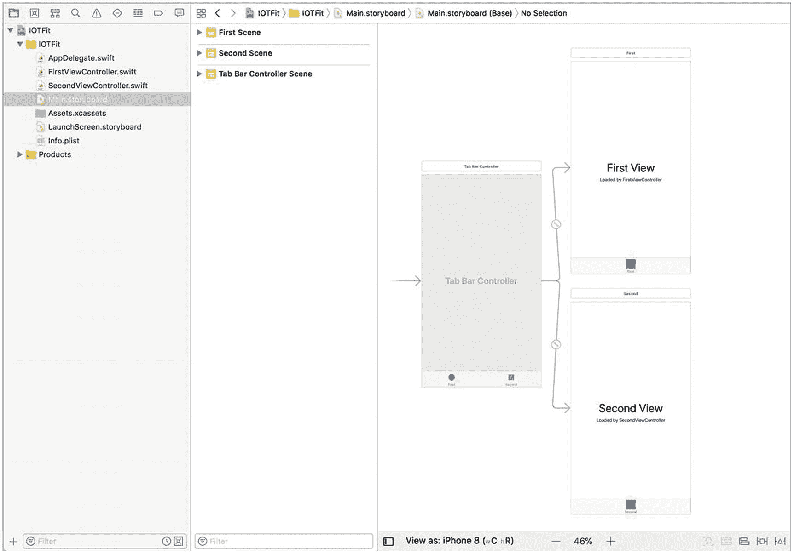

图 1-16

Tabbed App 项目的默认故事板

子视图控制器被命名为 `FirstViewController` 和 `SecondViewController`。然而，随着项目规模的增长，这些类名会给后续维护带来困难。如同自然生态系统，Xcode 项目中的各项元素之间的关联远比表面看到的要深入。对于故事板所使用的类，更改类名同时也意味着需要修改其他类及故事板文件中的引用。为了管理这一复杂过程，你可以使用 Xcode 中的重构工具。要重命名 `FirstViewController` 类，请辅助点击 (右键点击或长按) 该符号名称，在上下文菜单中滚动到 "Refactor"，然后选择 "Rename"，如图 1-17 所示。

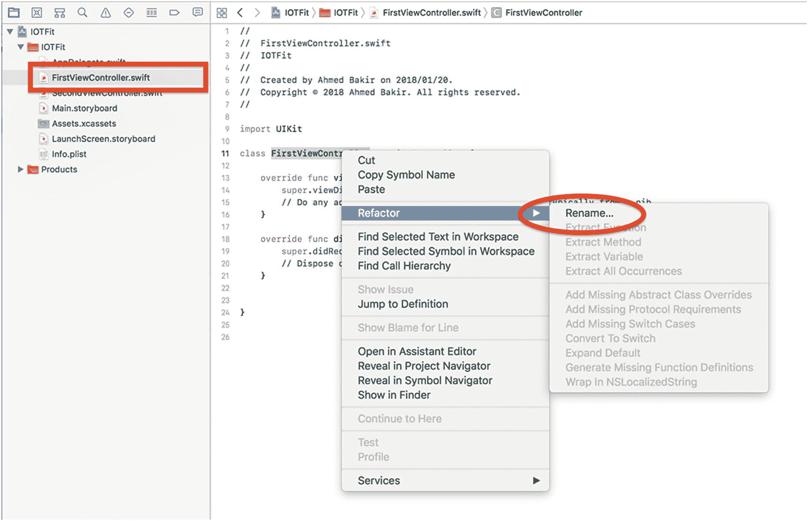

图 1-17

显示符号的重构菜单

点击 "Rename" 后，中央面板将显示一个手风琴式的表格。在重命名类的情况下，第一行显示文件名的预览，第二行提供一个编辑区域，你可以在其中修改类名，第三行及之后的行则显示那些依赖你类的文件（如故事板或其他类）中将发生的更改预览。输入 `CreateWorkoutViewController` 作为视图控制器的新名称，并确认输出结果与图 1-18 类似。然后点击右上角的 "Rename" 按钮以应用更改。

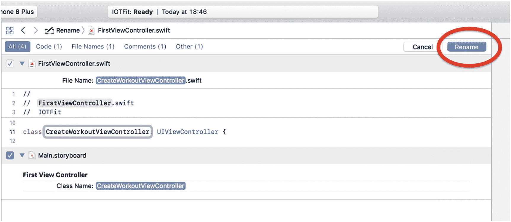

图 1-18

Xcode 编辑器对重构的预览

按照同样的流程，将 `SecondViewController` 重命名为 `WorkoutMapViewController`。你之后可以在自己的代码中使用 `Rename` 工具，通过相同的可视化编辑器来修改变量名和数据结构。

### 注意

如果文件没有自动重命名，你可以通过两次点击操作来修复。首先，点击一次文件名以选中该项，然后再次点击以编辑文件名。在 Swift 中，文件名不影响编译。

### 布局用户界面

现在故事板的依赖关系已经解析完毕，你可以开始放置用户界面元素了。如果你开发 iOS 应用已有一段时间，这应该是一个相当常规的操作，但对于新手来说，这可能会澄清过去的一些困惑。

你的第一个目标是根据图 1-1 中的线框图，布局“创建锻炼”屏幕。该屏幕包含四个标签（两个用于信息，两个用于数值）来显示你的锻炼进度，以及两个按钮供用户开始/停止锻炼或暂停/继续锻炼。

首先，从项目导航器中点击 `Main.storyboard`。然后，确保工具面板（右侧面板）处于打开状态。右下角是一个分屏，其中有一个看起来像旧款 iPhone Home 键的图标。这被称为*对象库*，包含你可以拖放到故事板中视图控制器上的用户界面元素。向下滚动或搜索 `Label`，以找到 `UILabel`。如图 1-19 所示，将标签对象从对象库拖放到“创建锻炼视图控制器”（该控制器上应该仍保留着模板中的 `First View Controller` 标签）。

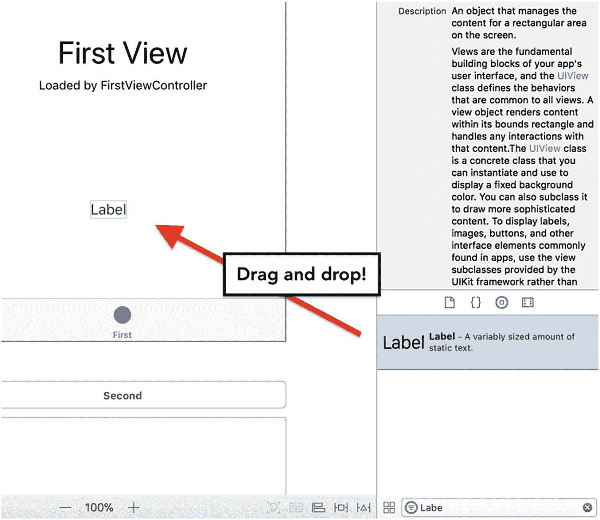

图 1-19

向视图控制器添加标签

#### 提示

为了加快导航速度，你可以通过按下 Command+T (`⌘+T`) 在 Xcode 的标签页中打开文件。

继续这个过程，添加其他三个标签和两个按钮。你也可以删除带有 `First View` 文字的旧标签。此时，不必担心这些项的确切位置，因为你即将学习如何使用约束来设置大小和自动布局规则。

### 应用自动布局约束

在使用自动布局构建用户界面时，不应思考每个项的 (x, y) 坐标位置，而应考虑它们相对于屏幕边界和其他元素应该位于何处。在 iOS 中，这些规则由*约束*来管理。在运行时，自动布局将使用这些约束来调整屏幕上元素的大小或重新定位。最常见的约束类型是*固定*（固定位置）和*相对*（其位置相对于屏幕边界或其他元素）。约束可以大于、等于或小于某个值。

对于 IOTFit 应用，我认为“创建锻炼”屏幕的关键特性是，无论用户使用的是何种尺寸的 iPhone，他们都能轻松按下“开始”和“暂停”按钮。通过将按钮固定在屏幕底部，我就不必担心按钮位置会因屏幕尺寸变化而变得难以操作。用户已经习惯于按下屏幕底部的按钮，因为每个 iOS 设备底部 Home 键的放置方式教会了他们与屏幕底部进行交互以执行控制手势。对于状态标签，我希望能达成两个目标：保持屏幕平衡且不干扰按钮的放置，因此我将它们固定在屏幕顶部。如图 1-20 所示，在这种布局下，当应用在 iPhone SE、iPhone X 和 iPhone 8 Plus 上运行时，唯一会改变的是元素的缩放比例以及状态标签与操作按钮之间的垂直间距。

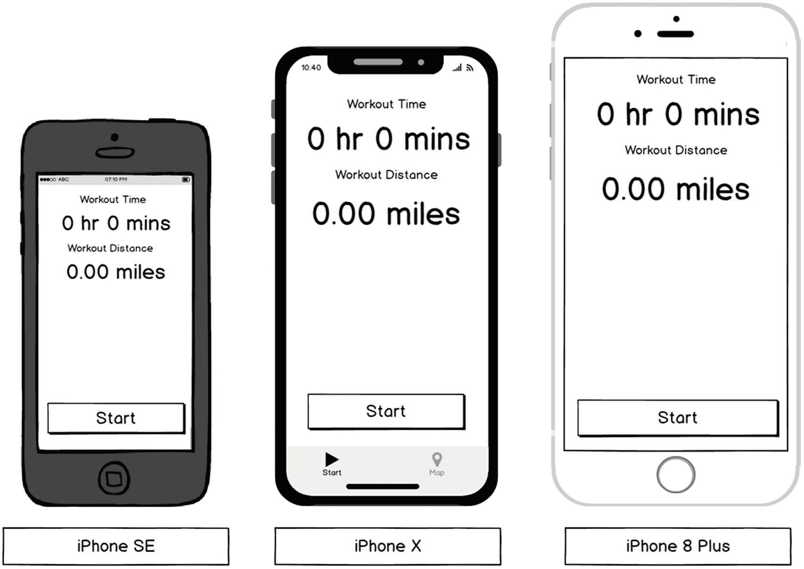

图 1-20

IOTFit 用户界面如何适配不同的 iPhone 尺寸


#### 提示

另一个良好的 Auto Layout 策略是将项目在屏幕中央居中，然后将其他项目放置在其下方或上方。

在 Interface Builder 中，您可以使用`Add New Constraints`工具，通过图形用户界面来设置约束。如图 1-21 所示，选中顶部标签，然后在编辑器窗口底部工具栏中找到`Add New Constraints`按钮（图标看起来像一个箱线图），并点击它。弹出的窗口将显示该标签与最近邻元素之间的距离。

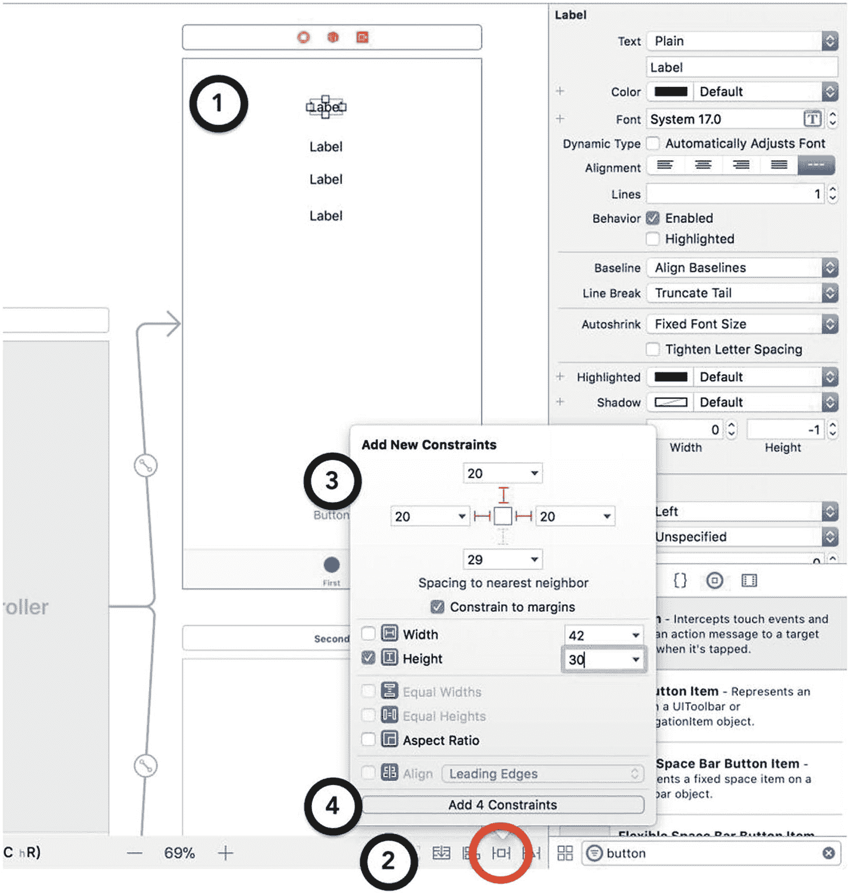

图 1-21 — 通过 Interface Builder 的 `Add New Constraints` 工具设置约束的步骤

要设置固定常量，请点击包含您想固定值的文本字段，并输入新值。文本字段旁边的线条将从红色虚线变为红色实线，表示您的值已成功读取。对于顶部标签，将其固定到距离屏幕顶部、左侧和右侧各 20 像素的位置。将标签的高度设置为 30 像素。勾选高度旁边的复选框，以确保您的更改被记录。最后，点击弹出窗口底部的 `Add 4 Constraints` 按钮以保存更改。修改后的故事板应类似于图 1-22 中的截图。

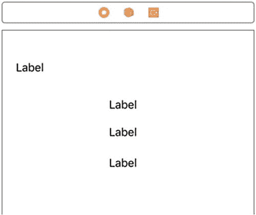

图 1-22 — 为顶部标签设置约束后的 Create Workout View Controller

### 自定义项目外观

虽然您已经为 Create Workout View Controller 中的顶部标签设置了约束，但标签的外观与线框图中的初始设计不符。需要修改文本、应用正确的文本对齐方式（居中）并设置文本大小。请按照图 1-23 所示的步骤操作。首先，点击故事板中的标签，然后在工具面板（右侧）中点击属性检查器（中心图标）。要更改文本，请在`Text`行中插入您想要的新文本。点击`Font`旁边的`T`图标以更改字体。将弹出一个窗口。不要手动输入字体大小，而是选择 Apple 预定义的样式`Title 3`。这将有助于文本应用更好地适应有视力障碍的用户。此外，您稍后将使用此系列中的样式，以实现一致的用户界面。点击`Alignment`旁边的“居中”图形以将文本对齐方式设为居中。最后，为防止文本在小屏幕上被截断，请将`Autoshrink`属性设置为`Minimum Font Scale`。这将在文本被截断前，将其缩小至原始大小的 50%。

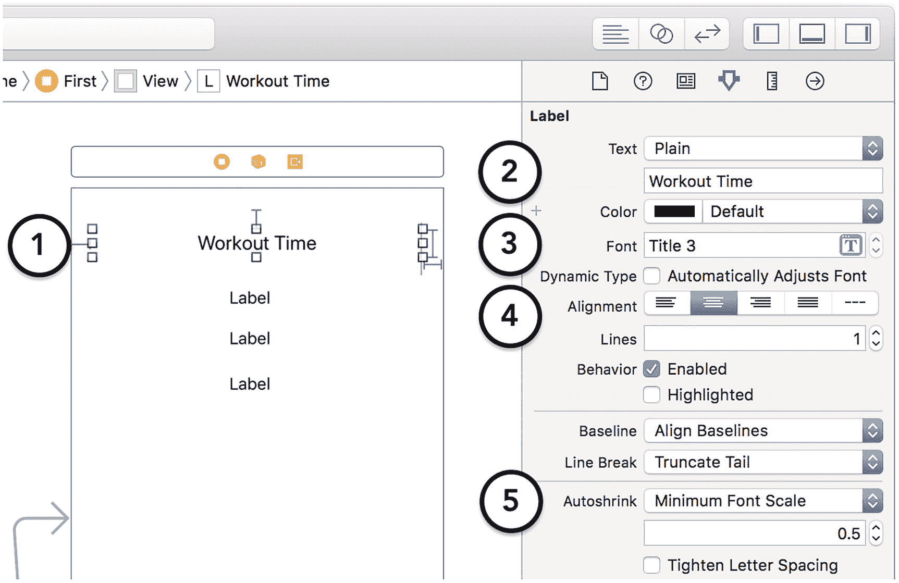

图 1-23 — 为 Workout Time 标签设置正确显示属性的步骤

按照表 1-2 中指定的参数，为所有标签和按钮重复设置约束和文本属性的这些步骤。

**表 1-2** — Create Workout View Controller 用户界面元素的约束和字体设置

| 显示文本 | 顶部 | 左侧 | 右侧 | 底部 | 高度 | 文本样式 |
| --- | --- | --- | --- | --- | --- | --- |
| Workout Time | 20 | 20 | 20 | -- | 30 | Title 3 |
| 0 hrs 00 mins | 10 | 20 | 20 | -- | 50 | Title 1 |
| Workout Distance | 10 | 20 | 20 | -- | 30 | Title 3 |
| 0.00 meters | 10 | 20 | 20 | ≥20 | 50 | Title 1 |
| Pause | -- | 20 | 20 | 20 | 60 | Title 2 |
| Stop | 20 | 20 | 20 | 20 | 60 | Title 2 |

应用约束和字体设置后，您的故事板应类似于图 1-24 中的截图。

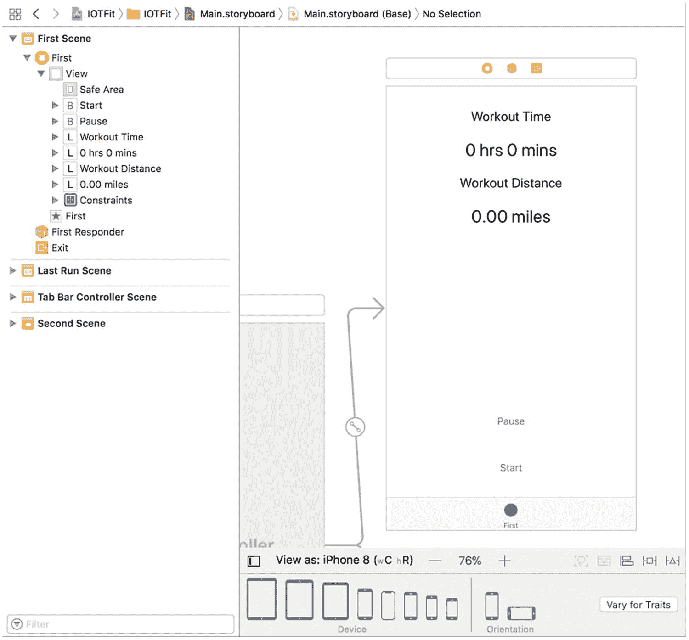

图 1-24 — 设置所有约束后的 Create Workout View Controller

默认情况下，`UIButton`对象的样式是透明背景，文本样式与应用程序的默认色调颜色相匹配（在撰写本文时，默认色调颜色是蓝色调）。为了使应用程序更易于使用，在我的线框图中，我建议使用具有大面积彩色触摸区域和白色文本的按钮。再次使用属性检查器，您可以修改`UIButton`元素的文本颜色和背景颜色。

点击“Pause”按钮将其选中，然后（如果尚未选中）点击工具面板中的属性检查器（标签图标）。如图 1-25 所示，点击`Text Color`下拉菜单，打开一个包含常用颜色的二级菜单。选择`White Color`使按钮文本变为白色。按钮会看起来不可见，但在设置背景颜色后会重新出现。

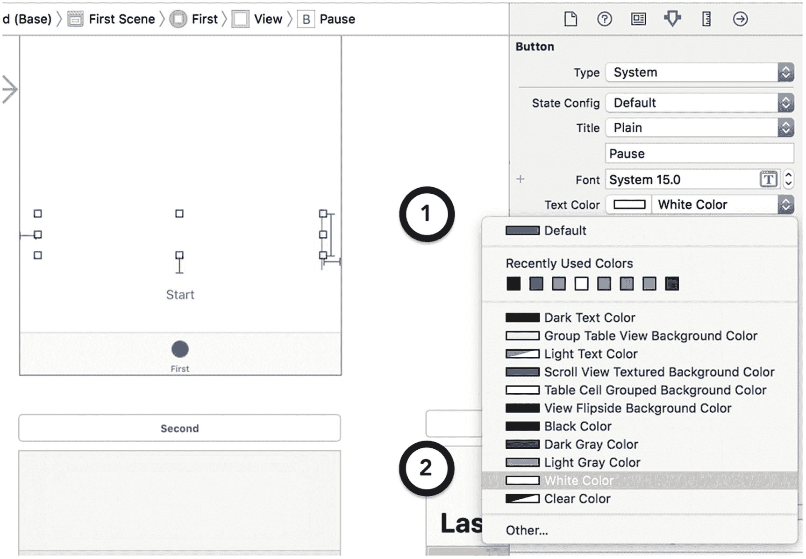

图 1-25 — 设置按钮的文本颜色

要设置背景颜色，请在属性检查器中向下滚动。在`View`部分下，选择`Background`下拉菜单。这次，当二级菜单出现时，选择`Other`。如图 1-26 所示，这将调出一个颜色选择器。选择一种红色调，因为这是许多用户在停止或暂停操作（例如，红色停止标志）上下文中熟悉的颜色。

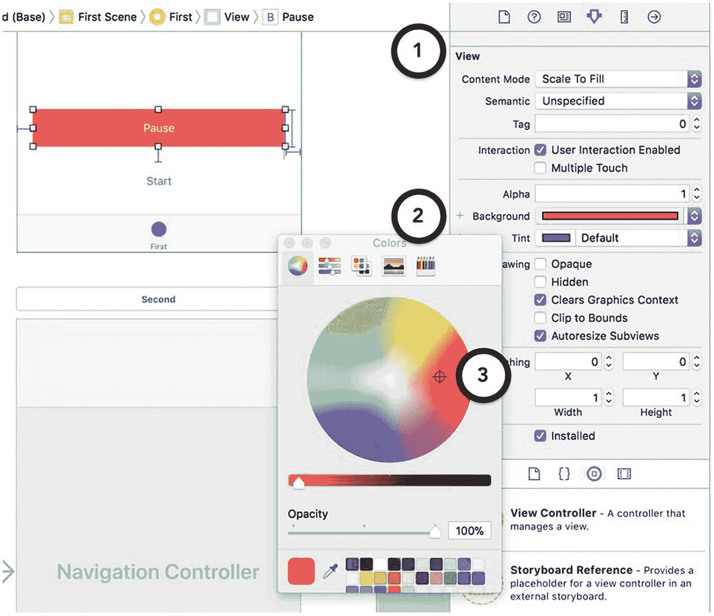

图 1-26 — 用于选择背景颜色的颜色选择器

按照相同步骤为“Start”按钮选择蓝色背景。您的 Create Workout View Controller 的最终布局应类似于图 1-27 中的截图。

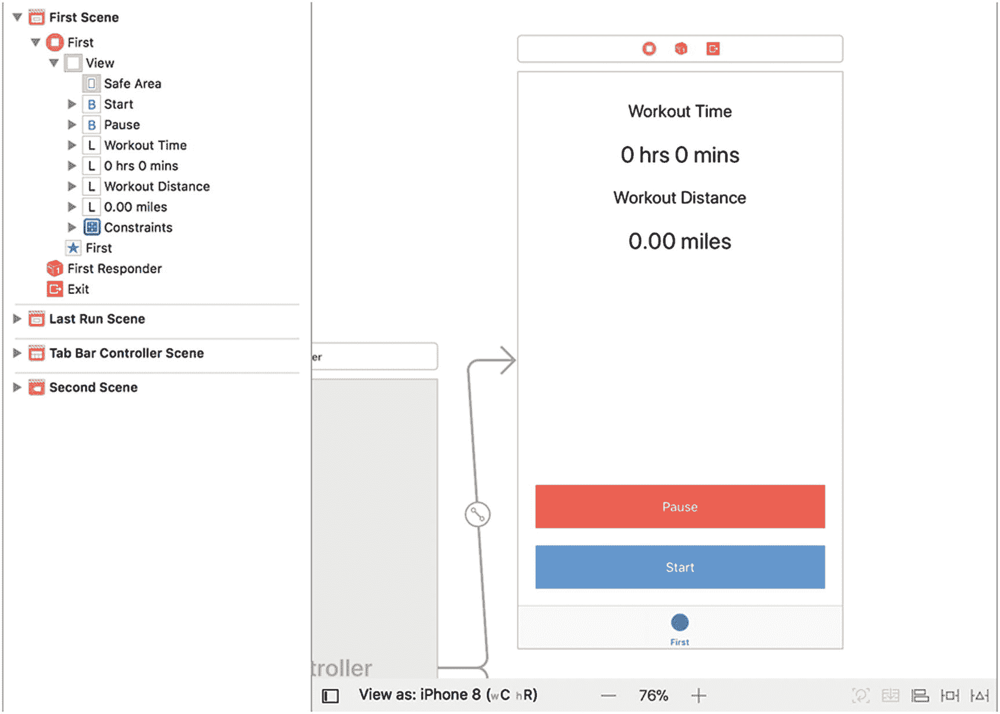

图 1-27 — Create Workout View Controller 的最终布局


#### 提示

你可以使用层级面板（编辑器左侧窗格）快速验证视图控制器中是否已添加项目。同样，通过重新排列层级中的项目，你可以快速将项目移到其他项目的前面或后面。

现在，`Create Workout View Controller`（创建锻炼视图控制器）已经成功设置好，你可以继续处理`Workout Map View Controller`（锻炼地图视图控制器）。如果你还记得图 1-1，这个屏幕由一个位于顶部的导航栏、一些关于上次锻炼记录的信息以及一个占据大部分屏幕的地图组成。

最容易入手的是添加导航栏。导航栏是 iOS 核心导航功能之一，它通过在顶部提供一个通用信息栏来模拟浏览器窗口的行为。导航栏加载了一个*根视图控制器*（类似于主页）。当`Root View Controller`（根视图控制器）内的按钮（或链接）被点击时，导航栏会将其内容推送到主窗口中，同时在右上角提供一个返回按钮，允许用户导航回上一个屏幕。

要轻松地为空白的`Workout Map View Controller`（锻炼地图视图控制器）添加导航栏，请点击 Interface Builder 中的`View Controller`（视图控制器）（它上面应该还标有“Second View”字样），然后按照图 1-28 所示，进入 Editor 菜单并选择`Embed In` ➤ `Navigation Controller`。

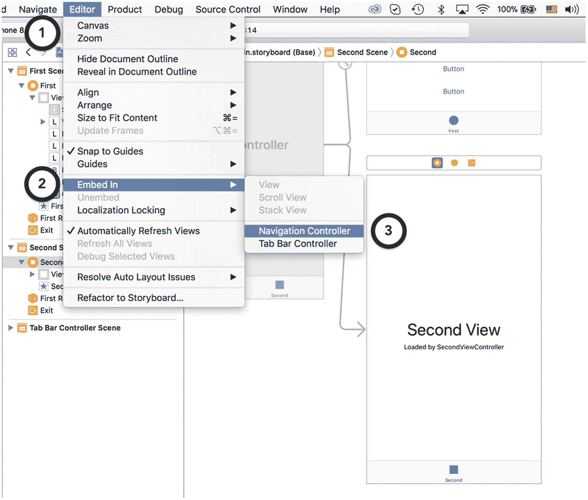

图 1-28

通过 Editor 菜单添加导航控制器

如图 1-29 所示，这将在 Tab Bar Controller 和`Workout Map View Controller`（锻炼地图视图控制器）之间添加一个 Navigation Controller（导航控制器）。通过按住`Workout Map View Controller`（锻炼地图视图控制器），你可以更改它在故事板上的位置，使其在视觉上更美观。你会注意到，在 Tab Bar Controller、Navigation Controller（导航控制器）和`Workout Map View Controller`（锻炼地图视图控制器）之间有带方向的箭头。这些被称为*segues*（转场），用于指定视图控制器之间在故事板上的链接方式，可以通过关系（例如父子关系）或动作（例如按下按钮）来实现。`Embed In`（嵌入）功能非常方便，因为它可以避免你手动设置所有这些转场，尽管手动设置是可行的，但非常耗时且容易出错。

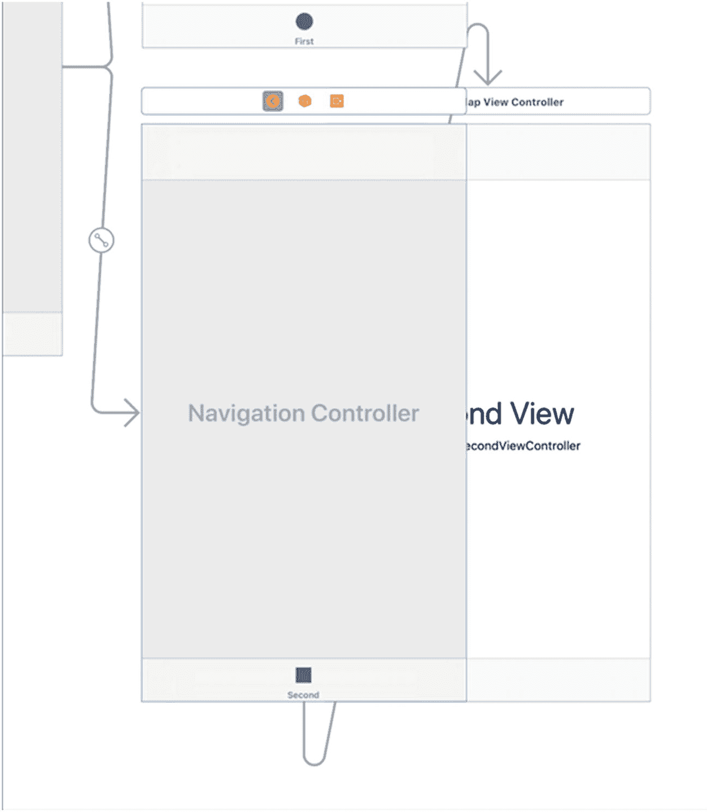

图 1-29

嵌入导航控制器后的故事板

要自定义`Workout Map View Controller`（锻炼地图视图控制器）的标题，点击`Workout Map View Controller`（锻炼地图视图控制器）上 Navigation Item（导航项）（栏）的中间位置并开始输入，如图 1-30 所示。你也可以使用 Attributes Inspector（属性检查器）输入文本。

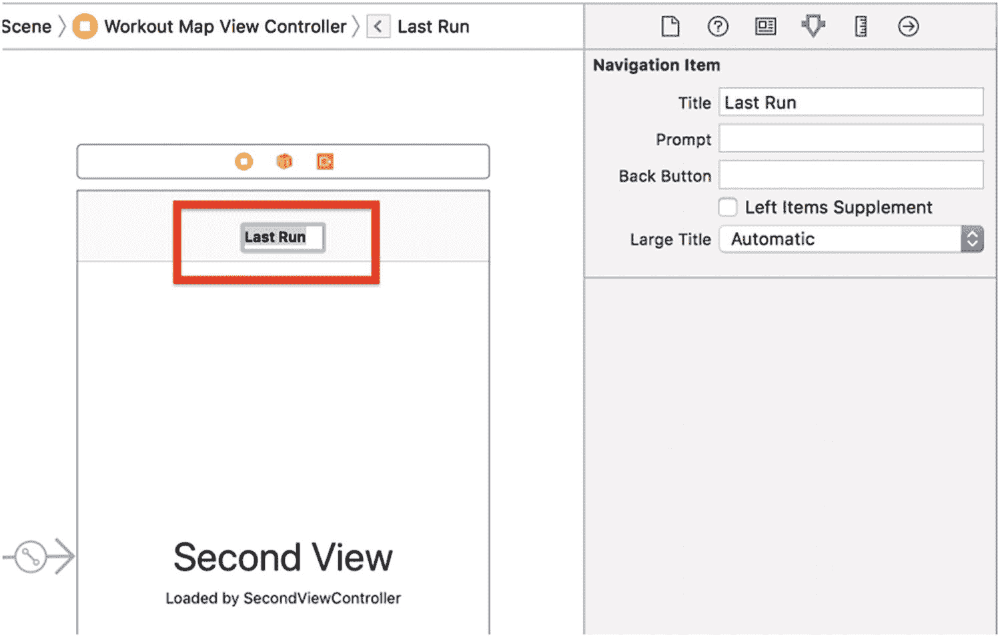

图 1-30

编辑`Workout Map View Controller`（锻炼地图视图控制器）的标题

要使标题文本变大（iOS 11 的首选新样式），请点击 Navigation Controller（导航控制器），然后在 Attributes Inspector（属性检查器）中选择`Prefers Large Titles`（偏好大标题），如图 1-31 所示。

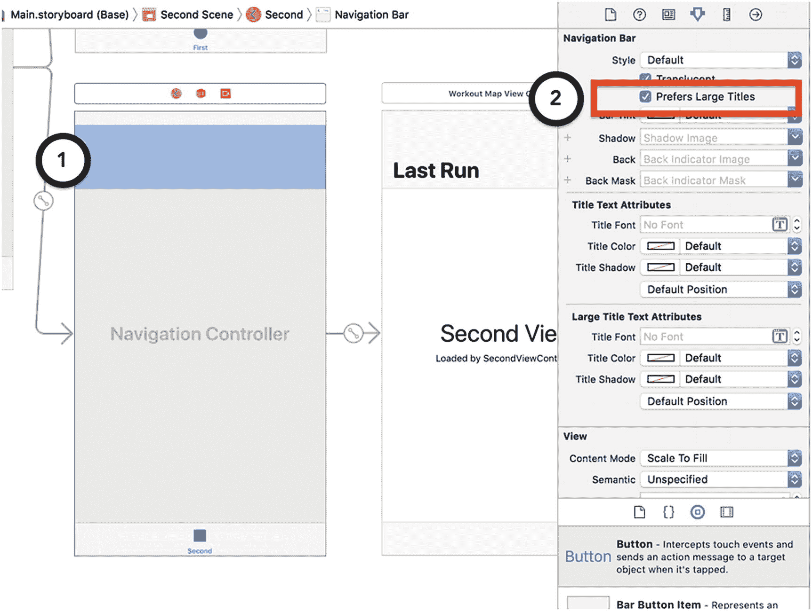

图 1-31

启用 iOS 11 风格的 Navigation Item（导航项）标题

在准备`Workout Map View Controller`（锻炼地图视图控制器）的最后一步中，你必须添加一个 Map View（地图视图）。首先，从模板生成的视图控制器中删除旧的标签，然后从 Object Library（对象库）中拖出一个 Map View（地图视图），并将其上、下、右、左的约束条件设置为`0`。接着点击 Add 4 Constraints（添加 4 个约束）按钮来应用这些约束。如果你需要回忆如何操作，请回到本章前面的“应用自动布局约束”部分。你的输出结果应类似于图 1-32。

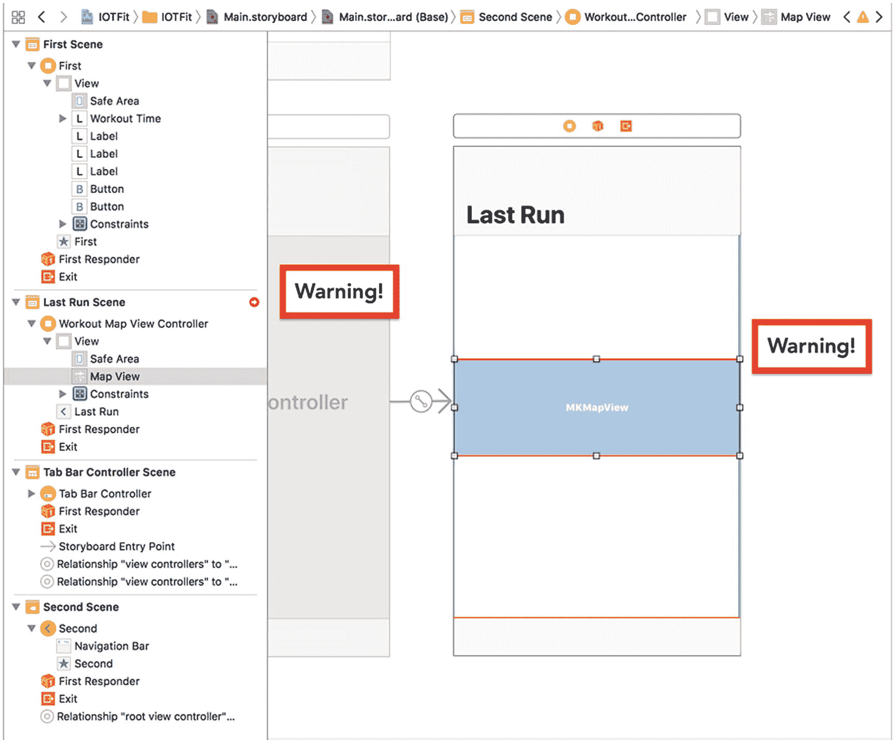

图 1-32

添加 Map View（地图视图）后的`Workout Map View Controller`（锻炼地图视图控制器）


### 解决自动布局问题

`Map`已成功添加到`View Controller`中，如图 1-32 所示，但框架并不符合你的预期（是一个居中的小矩形，而非全屏）。别担心！你并没有做错什么。

iPhone X（苹果首款无边框手机）的推出引发的一个问题在于，开发者需要检测手机的新边缘。更复杂的是，顶部边缘被传感器条打断，底部边缘则与新版 iOS 应用切换器共享空间。为了解决这个问题，苹果在 iOS 11 中引入了*安全区域*的概念。故事板中的安全区域充当自动布局的新边界。当你将某个元素固定到安全区域时，系统会自动处理在 iPhone X“不安全”区域周围所需逻辑。安全区域可用于所有 iOS 设备的故事板。

不幸的是，有时苹果的 API 尚未准备就绪，或者这些规则的应用方式存在冲突，例如本例中的`Map View`。为了解决这个问题，我将介绍一些我喜欢使用的技巧，以消除 Interface Builder 中的自动布局冲突。

当我遇到自动布局冲突时，首先查看的是`Document Outline`（`Interface Builder`中的左侧窗格）。自动布局约束有误的视图控制器旁边会有一个红色的停止标志图标，如图 1-33 左侧所示。点击该停止标志图标，`Document Outline`将向下展开至该`View Controller`，并列出有误的约束（通常不止一个）。如图 1-33 所示，再次点击停止标志将弹出一个对话框，提供解决方案建议。

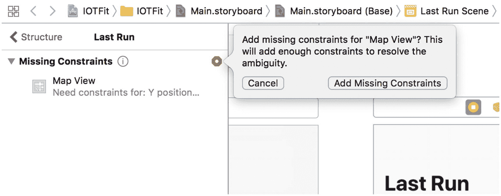

图 1-33

*用于解决约束问题的`Document Outline`弹出窗口*

对于这个问题，弹出窗口并不够用；还需要另一种解决技巧。我的第二个常用修复方法是使用`Interface Builder`编辑器右下角的`Resolve Auto Layout Issues`工具。如图 1-34 所示，点击它会显示一个上下文菜单，要求你填充缺失的约束、删除所选视图的所有约束，或删除该`View Controller`的所有约束。根据我的经验，此工具的最佳用法是重置有问题视图的约束，然后再次尝试应用约束。很多时候，当你重新排列`View Controller`中的元素时，会意外破坏依赖于旧位置的其他约束。此工具为单个视图提供了一个良好的重置方法。

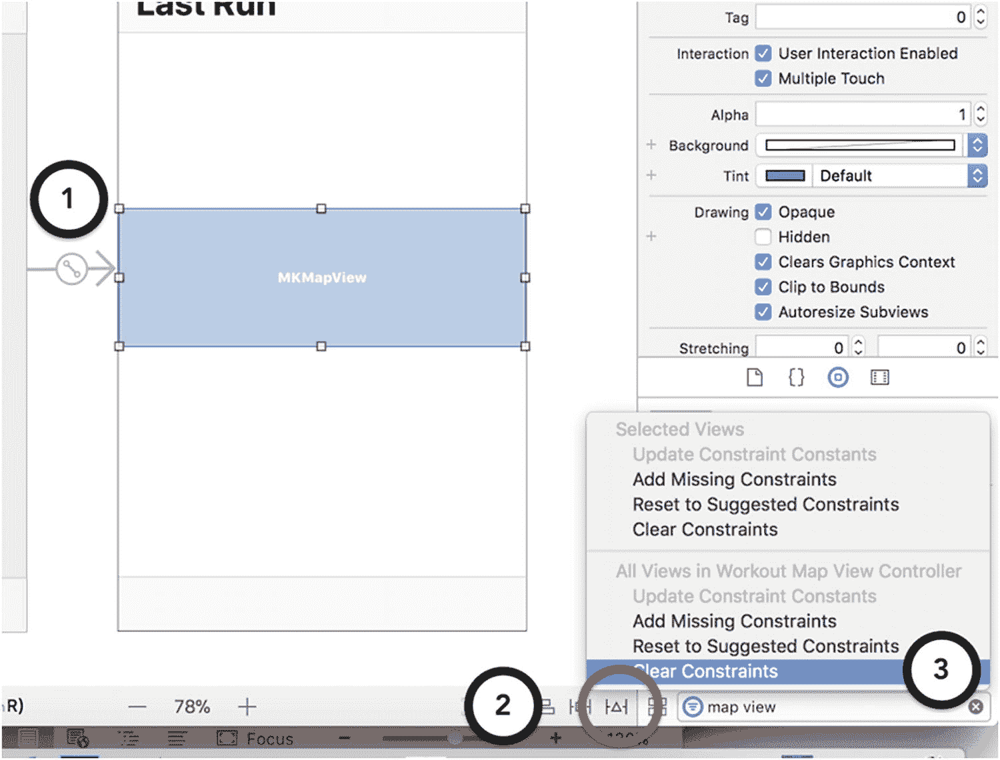

图 1-34

展示`Resolve Auto Layout Issues`上下文菜单

不幸的是，这也没能解决问题。当其他方法都不奏效时，我喜欢打开有问题视图的`Size Inspector`工具（由右侧实用工具面板中的`Ruler`图标指示），然后手动修改数值，直到警告消失。如图 1-35 所示，你可以通过在文本字段中输入新值来编辑数值，或者点击约束旁边的`Edit`按钮，弹出一个包含其属性的窗口。

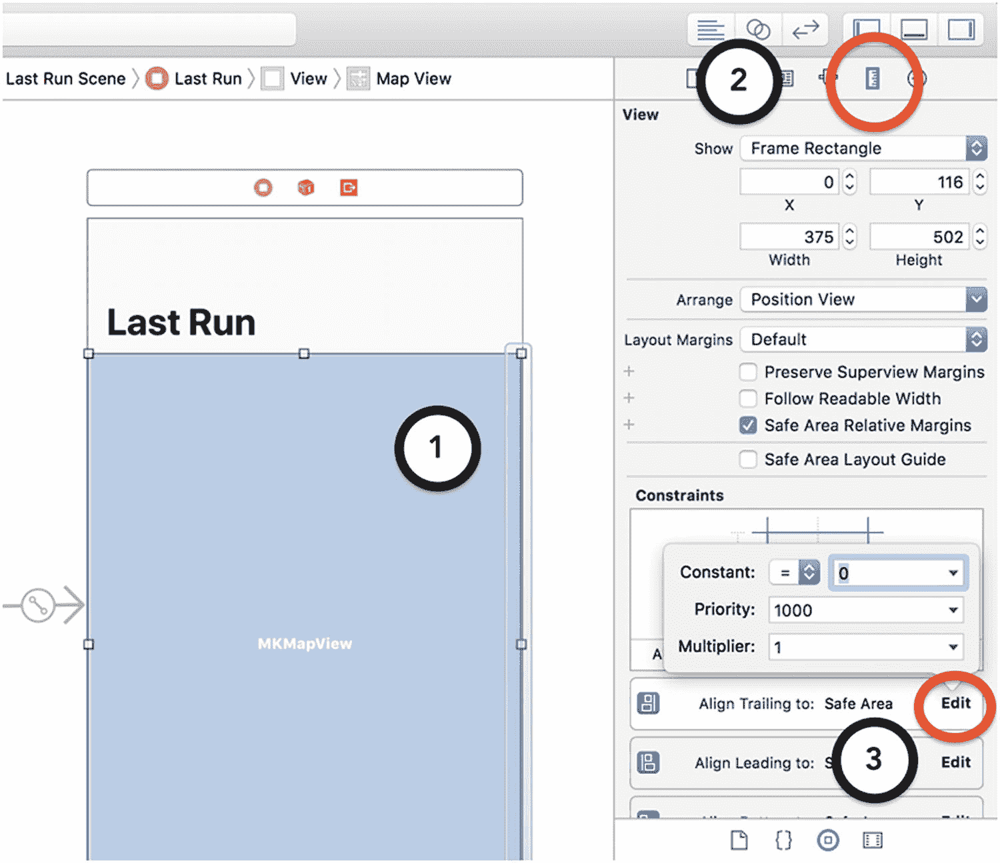

图 1-35

使用`Size Inspector`修改约束

对于`Map View`而言，问题在于约束没有固定视图的顶部和底部位置，因此我将`y`位置设置为`0`（屏幕顶部），并使高度匹配屏幕高度。我通过确认`Document Outline`中的警告消失来验证这一点。

解决自动布局问题后，项目的最终故事板应类似于图 1-36。

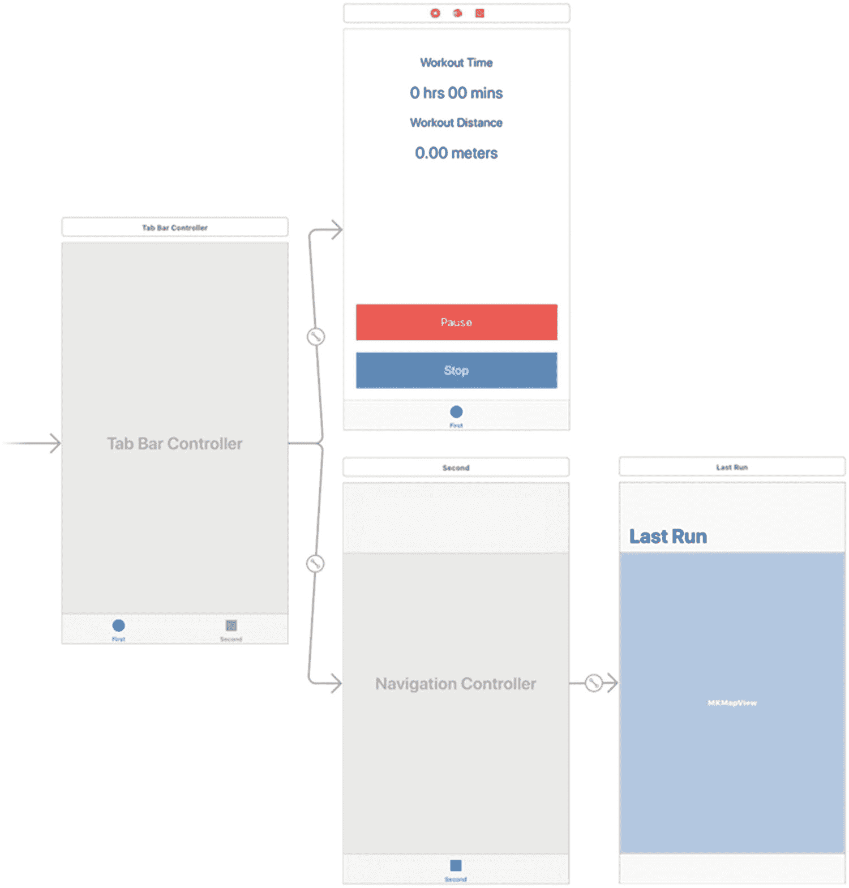

图 1-36

IOTFit 项目完成的故事板

## 将故事板连接到代码

尽管完成的故事板很漂亮，但目前如果用户按下任何按钮，它都不会执行任何操作，因为新的用户界面对象尚未绑定到任何代码。在 Xcode 中，将代码连接到故事板的方式是，使用特殊关键字（`IBOutlet`、`IBAction`）定义必须与 Interface Builder 交互的属性和方法。然后，在`Interface Builder`中找到这些项目，并在故事板与代码之间拖拽连接。


### 定义与 Interface Builder 兼容的属性和方法（动作）

当你从 Xcode 的“标签页应用”模板创建 `IOTFit` 项目时，它已为第一个（创建训练）和第二个（地图训练）视图控制器生成了空白的 Storyboard 和空白类。如果你在项目导航器中点击 `CreateWorkoutViewController.swift` 文件，编辑器将显示其内容，如代码清单 1-1 所示。此时，`WorkoutMapViewController.swift` 文件的内容与之类似。

```
import UIKit
class CreateWorkoutViewController: UIViewController {
override func viewDidLoad() {
super.viewDidLoad()
}
override func didReceiveMemoryWarning() {
super.didReceiveMemoryWarning()
}
}
代码清单 1-1
CreateWorkoutViewController 类的初始内容
```

这并没有什么特别之处，因为初始化视图控制器本身所需的大部分关键代码已由其父类 `UIViewController` 提供。你可能还会注意到，这里没有用于标签的代码。通常来说，对于运行时外观不会显著变化的用户界面元素，你无需声明*属性*（类成员）。然而，那些会变化的元素则应表示为属性。对于“创建训练”视图控制器，你可以忽略“训练距离”和“训练时间”标签，但必须创建属性来表示那些包含数值的标签。

与 Interface Builder 兼容的属性的初始化方式与普通属性类似，但有两个要点：你必须特别关注它们的类型，并且必须添加一个关键字，让 Interface Builder 能将它们暴露给拖放界面（`@IBOutlet`）。

与普通变量不同，与 Storyboard 关联的用户界面属性将由该 Storyboard 进行初始化。因此，你需要特别关注变量的引用强度和类型。对于大多数属性而言，这意味着你必须将属性定义为 `optional`（可选择初始化为某个值，或保持可检测的未初始化状态的变量），并且使用 `weak` 引用（其内容不会无限期地保留在内存中）。

你可以在代码清单 1-2 中找到“创建训练”视图控制器的更新类定义，其中包含了新声明的、格式正确的属性。

```
import UIKit
class CreateWorkoutViewController: UIViewController {
@IBOutlet weak var workoutTimeLabel: UILabel?
@IBOutlet weak var workoutDistanceLabel: UILabel?
@IBOutlet weak var toggleWorkoutButton: UIButton?
@IBOutlet weak var pauseWorkoutButton: UIButton?
override func viewDidLoad() {
super.viewDidLoad()
}
override func didReceiveMemoryWarning() {
super.didReceiveMemoryWarning()
}
}
代码清单 1-2
CreateWorkoutViewController 类定义（包含用户界面属性）
```

声明一个可被 Interface 发现的方法的过程与此类似。在 `func` 关键字前添加 `@IBAction` 关键字即可。对于“创建训练”视图控制器，此时需要考虑的用户发起的动作只有两个：开始/停止（切换）训练和暂停/恢复训练。代码清单 1-3 提供了包含新方法在内的 `CreateWorkoutViewController` 类的修改后定义。

```
import UIKit
class CreateWorkoutViewController: UIViewController {
@IBOutlet weak var workoutTimeLabel: UILabel?
@IBOutlet weak var workoutDistanceLabel:  UILabel?
@IBOutlet weak var toggleWorkoutButton:  UIButton?
@IBOutlet weak var pauseWorkoutButton: UIButton?
override func viewDidLoad() {
super.viewDidLoad()
}
override func didReceiveMemoryWarning() {
super.didReceiveMemoryWarning()
}
@IBAction func toggleWorkout() {
NSLog("Toggle workout button pressed")
}
@IBAction func pauseWorkout() {
NSLog("Pause workout button pressed")
}
}
代码清单 1-3
CreateWorkoutViewController 类定义（包含与 Interface Builder 兼容的方法定义）
```

我在这个示例中添加了 `NSLog()` 语句，以便你在点击按钮时，能够在 Xcode 调试面板中查看输出信息。

接下来是“地图训练”视图控制器，其设置非常直接。你只需向该类添加一个地图视图即可。该视图控制器上的所有用户界面操作都由地图视图处理，因此你无需再定义其他方法。不过，最后还有一点需要注意：要声明一个 `MKMapView`（地图视图）对象，你必须将 `MapKit` 框架导入到你的类中。代码清单 1-4 展示了包含这些更改的 `WorkoutMapViewController` 类的修改后类定义。

```
import UIKit
import MapKit
class WorkoutMapViewController: UIViewController {
@IBOutlet weak var mapView: MKMapView?
override func viewDidLoad() {
super.viewDidLoad()
}
override func didReceiveMemoryWarning() {
super.didReceiveMemoryWarning()
}
}
代码清单 1-4
WorkoutMapViewController 类定义（包含 MapKit 框架和地图视图属性）
```


### 使用连接检查器完成最终的故事板连接

现在项目的类已完全定义，你可以使用 Interface Builder 进行连接。如图 1-37 所示，点击`Main.storyboard`文件，然后选择 Create Workout View Controller 并点击连接检查器（工具面板中带圆圈的箭头图标）。

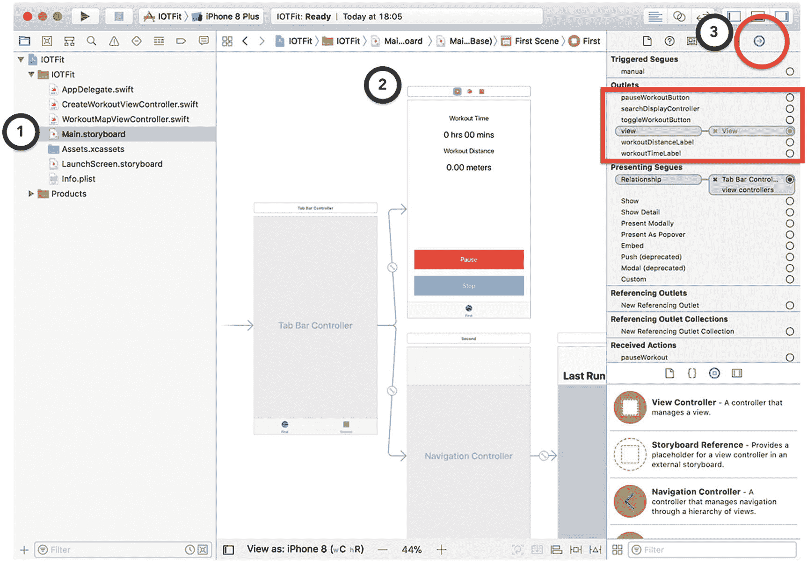

图 1-37：展示`CreateWorkoutViewController`类的连接检查器

连接检查器中列出了该类所有可用的输出口，其中包含你刚刚定义的属性（`pauseWorkoutButton`、`toggleWorkoutButton`、`workoutDistanceLabel`和`workoutTimeLabel`）。要连接某个项，按住其名称旁边的单选按钮，然后将其拖拽到你想要连接的项上释放，如图 1-38 所示。

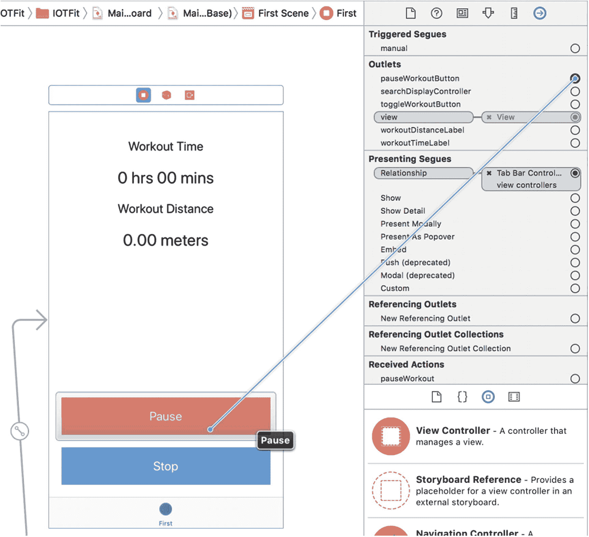

图 1-38：将 Pause Workout 按钮连接到其属性

连接成功后，单选按钮会被替换为包含属性名称的文本气泡，如图 1-39 所示。

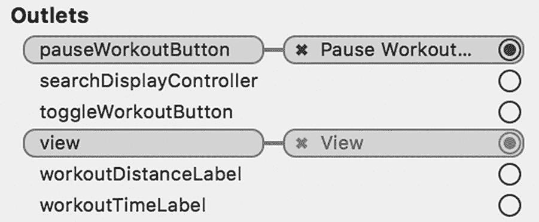

图 1-39：成功连接属性后的连接检查器

对`CreateWorkoutViewController`和`WorkoutMapViewController`类中的其余属性重复此过程。

要将方法连接到用户界面事件（例如按下按钮或点击视图上的某个区域），操作步骤大体相同，但略有区别。如图 1-40 所示，首先选中 Pause Workout 按钮。此时连接检查器将显示所有适用于按钮的用户界面事件列表，包括 Touch Up Inside、Touch Down、Value Changed 和 Touch Cancel。

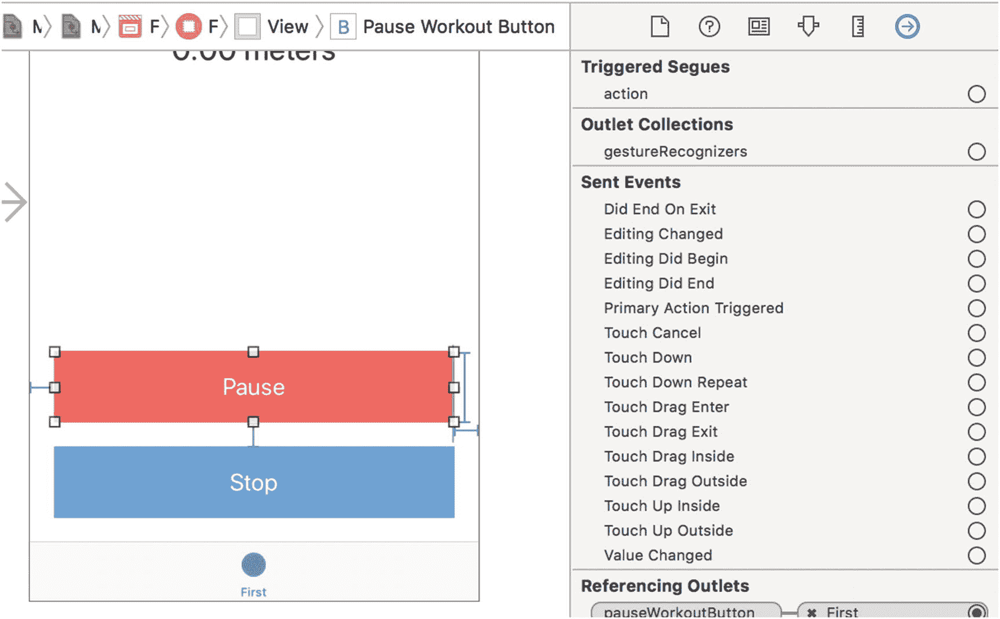

图 1-40：Pause Workout 按钮的连接检查器事件

你最常用来检测用户按下按钮的事件是 Touch Up Inside。该事件在用户按住并释放按钮后触发一次。要将操作连接到其处理方法`toggleWorkout()`，请选中 Touch Up Inside 行中的单选按钮，然后将其拖拽到`CreateWorkoutViewController`类上释放。如图 1-41 所示，释放鼠标后，会弹出一个上下文菜单，列出该类中所有兼容 Interface Builder 的方法。选择`toggleWorkout`。

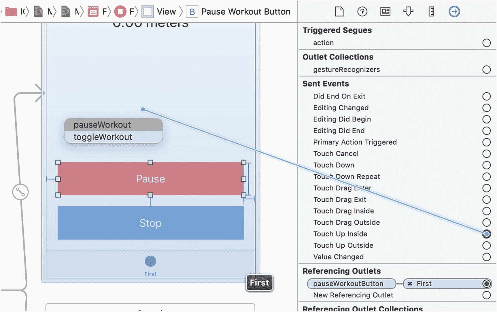

图 1-41：将用户界面事件连接到类中的方法

完成选择后，`pauseWorkout()`方法的名称应出现在 Touch Up Inside 事件旁边的文本气泡中，如图 1-42 所示。

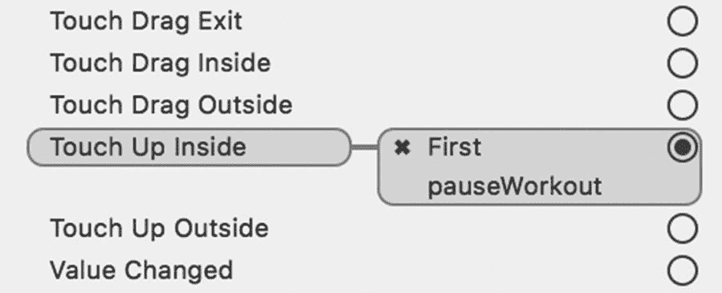

图 1-42：验证 Pause Workout 按钮的事件连接是否成功

对 Toggle Workout 按钮重复此过程，一切就大功告成了！要验证一切是否按预期工作，请点击 Xcode 编辑器窗口右上角的 Run 按钮。这会编译并运行你的应用程序。默认情况下，Xcode 会使用其默认设置（当前是 iPhone 8 Plus 模拟器）运行你的项目，但你也可以从 Run 按钮右侧的下拉菜单中将其更改为其他模拟器或已连接的设备。如图 1-43 所示，点击 Run 按钮后，模拟器将启动并显示你的应用界面，当你点击 Toggle Workout 或 Pause Workout 按钮时，调试控制台（右下角）会显示你之前指定的日志消息。

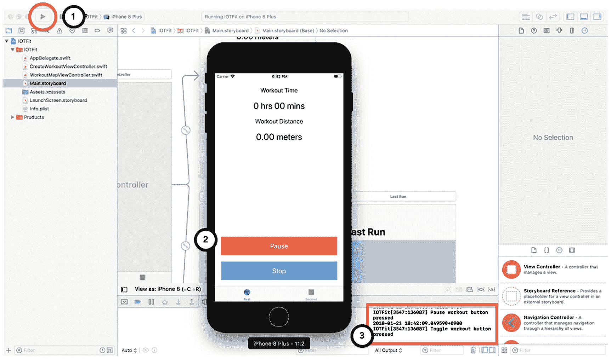

图 1-43：使用 Xcode iPhone 8 Plus 模拟器测试 IOTFit 应用

## 本章小结

在本章中，你学习了如何在 Xcode 中执行许多关键的项目生命周期任务，这些技能将在本书后续内容及你自己的项目中反复使用。这些任务包括创建新项目、将你的 Apple Developer Program 账户连接到 Xcode、使用 Xcode 的重构工具、构建用户界面，以及使用 Interface Builder 将故事板连接到代码。本章包含了大量图片和分步说明，体现了使用 Xcode 工作的可视化特性。根据我的经验，iOS 开发中的许多乐趣和挫折都来自于学习 Xcode 的工作流程。希望本章能让学习过程少一些痛苦！

