# 2. 使用 Core Location 构建健身追踪应用

在第一章中，你学习了如何使用 Xcode 和 Interface Builder 为 IOTFit 健身应用搭建项目并创建其用户界面。然而，由于复杂的设置过程，你还没有机会通过访问手机上的 GPS 硬件来使其成为真正的物联网（IoT）应用。在本章中，你将学习如何利用 Apple 的 Core Location 框架来向用户请求位置权限、定期接收用户位置的更新，并将这些位置标绘在地图上。

本章将开始纠正你在 iOS 开发过程中经常听到的一个误解：该平台太难用、太不方便了。尽管这有一定道理，正如第一章中复杂的用户界面设置过程所证明的那样，但你会发现，随着你对 Apple 开发模式越来越熟悉，学习新框架的学习曲线会显著下降。此外，你会注意到，学习新框架所需的工作量远小于自行实现所有功能所需的工作量。以 Core Location 为例，该框架完成了发送位置请求、处理来自 GPS 硬件的数据，并通过你的应用可以处理的异步事件传递数据等艰巨工作。想象一下，如果要在截止日期前全部自己编写这些代码，那将是多么困难！

遵循本书的迭代式学习过程，本章将重点介绍如何实现 IOTFit 应用中负责记录锻炼时长、追踪用户在锻炼过程中所经过的路径，以及在地图上显示这些位置信息的功能。


## 学习目标

在本章中，你将通过构建 `IOTFit` 应用的基于位置的功能，学习在 iOS 上进行物联网开发的关键技能：

- 配置应用以支持后台活动
- 检查硬件资源的可用性
- 请求用户授权访问敏感权限
- 请求并响应位置更新
- 在地图上显示已保存的位置

本章你将学到的最重要课程之一是：在进行任何硬件功能操作之前，先检查该功能是否可用，然后请求用户授权访问该资源的工作流程。这不仅是一种帮助你设计应用流程（例如，思考当用户不同意授权时该怎么做）的优良策略，还能帮助你避免一些最常见的运行时崩溃原因。如果你尝试访问不可用或被禁止的资源，苹果的 SDK 会导致应用崩溃。

与第一章一样，本书的 GitHub 仓库中 `Chapter 2` 文件夹（`https://github.com/Apress/program-internet-of-things-w-swift-for-ios`）提供了此项目的代码。

## 为后台位置活动配置项目

在锻炼过程中，用户通常会将手机放在口袋、臂带或健身器材上。为了让 `IOTFit` 应用在这些情况下对用户有用，你应该配置 `IOTFit` 应用使其在后台运行时也能继续跟踪锻炼。用户需要在首次启动应用时，通过 iOS 在应用内弹出的提示来启用此功能。为了让这些功能正常工作，你将学习如何声明你的应用需要使用后台位置更新，以及如何配置权限提示消息。在开发过程的早期执行这些设置步骤非常重要，因为它们都会影响应用的编译方式，并且只能通过项目设置编辑器进行配置。

为了节省电量并防止内存泄漏，苹果对 iOS 中各个应用可以执行的后台操作施加了严格限制。除非你的应用正确配置以请求启用后台功能的权限（模式），否则你的应用在后台时将无法执行任何操作。表 2-1 描述了苹果允许你配置让应用在后台访问的特殊功能。对于 `IOTFit` 应用，你将使用后台位置更新。在本书的后续章节中，你将启用低功耗蓝牙（Bluetooth LE）功能。

**表 2-1** iOS 应用的可配置后台模式

| 后台模式名称 | 用途 |
| --- | --- |
| 音频、AirPlay 和画中画 | 允许多媒体应用在用户将应用切至后台时继续不间断播放 |
| 位置更新 | 允许开发者基于应用在后台时发生的位置变化事件执行小任务 |
| 报刊亭下载 | 允许报刊亭应用（例如杂志、报纸）在应用未激活时获取新内容 |
| 外部配件通信 | 允许应用与物理连接的“Made for iPhone”（MFI）硬件保持活动数据通道 |
| 使用低功耗蓝牙配件 | 允许应用充当低功耗蓝牙中央管理器，并与配置为低功耗蓝牙外设的外部设备通信 |
| 充当低功耗蓝牙配件 | 允许应用充当低功耗蓝牙外设，并接收来自低功耗蓝牙中央管理器设备的消息 |
| 后台获取 | 允许应用在后台定期从 HTTPS 端点获取数据（频率由 iOS 任务管理器决定） |
| 远程通知 | 允许应用响应苹果推送通知 |

要开始开发本章版本的 `IOTFit` 应用，首先复制你在第一章中完成的项目，或者从本书 GitHub 仓库的 `Chapter 1` 文件夹（`https://github.com/Apress/program-internet-of-things-w-swift-for-ios`）下载代码。

打开你的新项目，并在项目导航器（Xcode 左侧窗格中）点击项目名称 (`IOTFit`)。要配置 `IOTFit` 项目使用位置更新后台模式，请点击项目设置编辑器视图中的“Capabilities”选项卡，如图 2-1 所示。

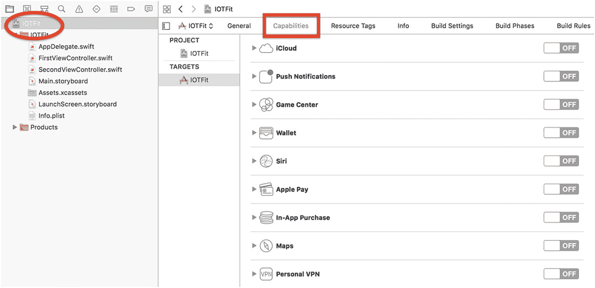

**图 2-1** 项目设置中的“Capabilities”选项卡

向下滚动到“Background Modes”并点击开关以启用它。勾选标记为“Location updates”的复选框，以启用后台位置更新。完成这些更改后，你的功能界面应如图 2-2 所示。

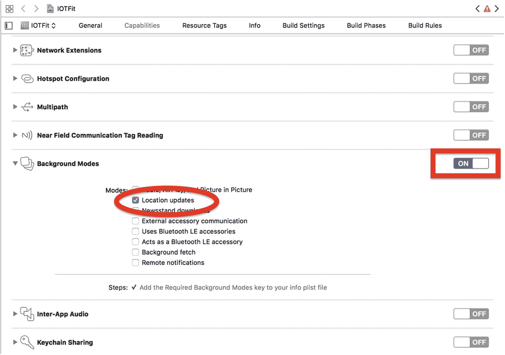

**图 2-2** 已正确配置位置更新的“Capabilities”选项卡


### 注意事项

如果你没有将 Apple ID 账户与 Xcode 关联成功，将无法成功设置任何后台模式。

虽然将所有内容管理在同一个屏幕上会很方便，但你仍需切换到“信息”标签页来编辑应用的权限提示信息。在项目设置中点击`Info`标签页，你将会看到一个属性列表编辑器，其中已填充了项目的默认设置，如图 2-3 所示。

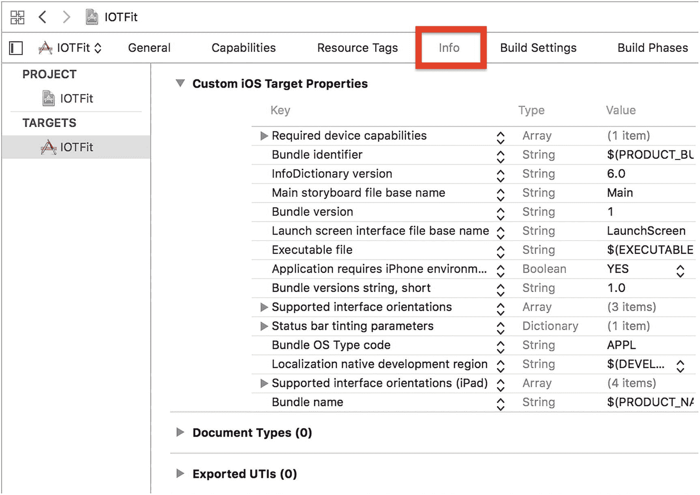

**图 2-3** 信息标签页中的默认属性列表

属性列表（`.plist`文件）是基于 XML 的文本文件。属性列表中的配置设置以键值对（字典）的形式存储。由于其易于阅读和使用，它们成为苹果管理可选项目设置的首选方法。这个文件通常以其文件名`Info.plist`来指代。

虽然你可以在文本编辑器中编辑属性列表文件，但 Xcode 提供了你在图 2-3 中看到的可视化编辑器，使属性列表管理更加便捷。这个编辑器既适用于自动生成的文件（如`Info.plist`），也适用于你手动创建的文件。

要向属性列表添加键值对，请点击任意一行，然后点击加号（`+`）按钮。对于项目设置，会显示一个下拉菜单，其中包含建议的构建设置键。滚动菜单并选择 **隐私 - 定位始终及使用期间使用描述**，如图 2-4 所示。

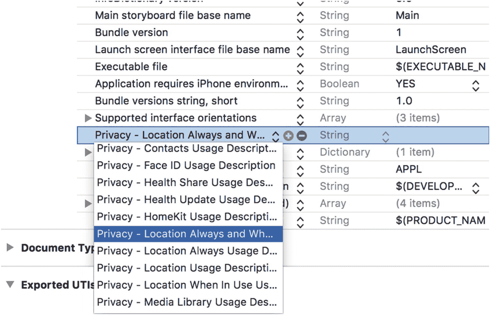

**图 2-4** 向信息属性列表添加键值对

双击新行的“值”列中的空白区域，并输入你希望在权限提示窗口中显示的文本。苹果的 App Store 提交指南之一是你的权限提示应描述你对受保护功能的预期用途。对于此应用，我使用了以下字符串作为权限提示描述：

```
IOTFit 希望使用定位权限来绘制你在锻炼期间的位置。此信息不会在应用外共享。
```

在 iOS 中，用户可以选择三种定位权限：`始终`、`使用期间`以及`始终和使用期间`。为`隐私 - 定位使用期间使用描述`和`隐私 - 定位使用描述`键值对创建额外的行，并同样指定这些权限提示。完成工作后，你的输出应类似于图 2-5。

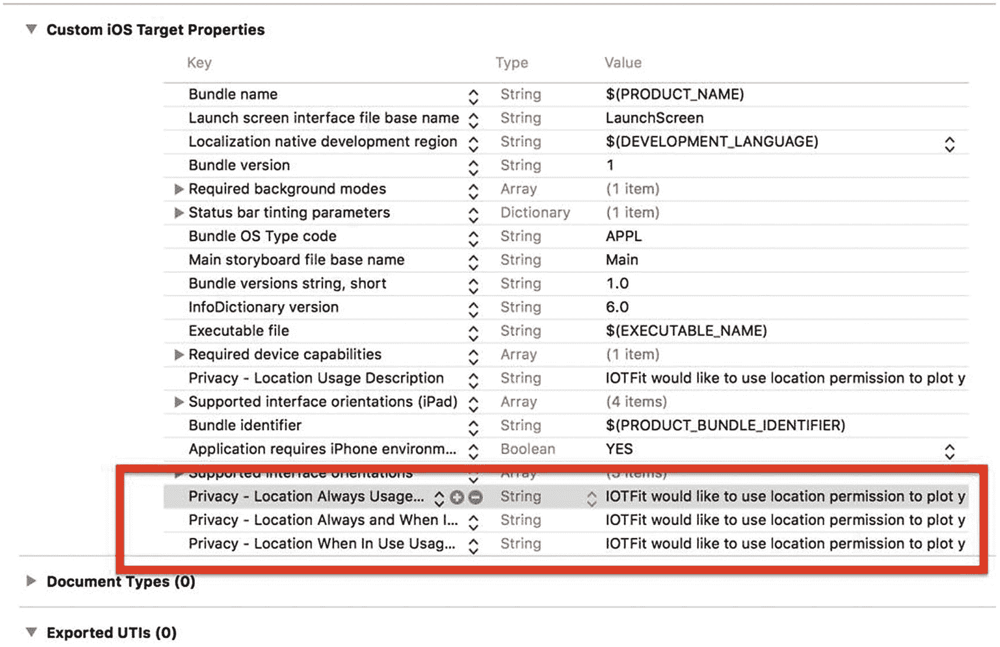

**图 2-5** 完成的信息属性列表，包括所有定位权限字符串

### 注意事项

新的键值对在列表中的位置不影响编译。

## 请求定位权限

现在项目依赖项已处理完毕，你可以开始实现向用户请求定位权限的逻辑。此时你需要问自己的一个最关键的问题是：“我应该在哪里放置定位权限弹窗？”

要开始回答这个问题，首先看一下图 2-6，回顾你在第 1 章中构建的用户界面。用户可以通过按下“开始”按钮来开始或停止锻炼，通过按下“暂停”按钮来暂停或恢复锻炼。如果用户想要查看地图，他们可以按下“第二个”标签页切换到地图视图。

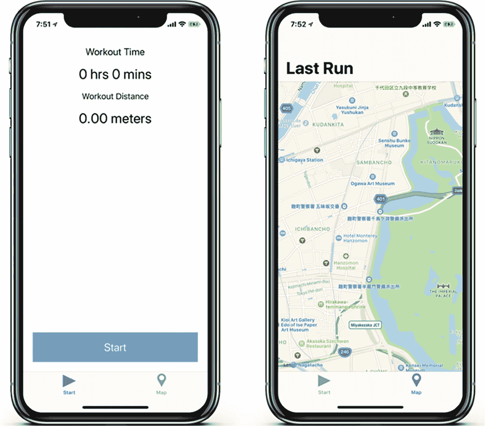

**图 2-6** 来自第 1 章的完整 IOTFit 用户界面

移动应用的最新趋势是在用户首次尝试执行需要你希望使用的资源的操作时请求权限。在 IOTFit 应用的情况下，这将是用户首次按下“开始”按钮时。除了请求定位权限外，此时你还需要更新用户界面以指示锻炼已开始。一旦确认一切准备就绪，你就可以开始记录用户的锻炼数据。

考虑到“创建锻炼视图控制器”上的其他活动（暂停和停止锻炼），这些将需要额外的用户界面更新以及某种机制来暂停定位和时间跟踪。

在图 2-7 中，我创建了一个记录所有这些决策的流程图。你将在本章中将其作为指南来实现“创建锻炼视图控制器”的行为。

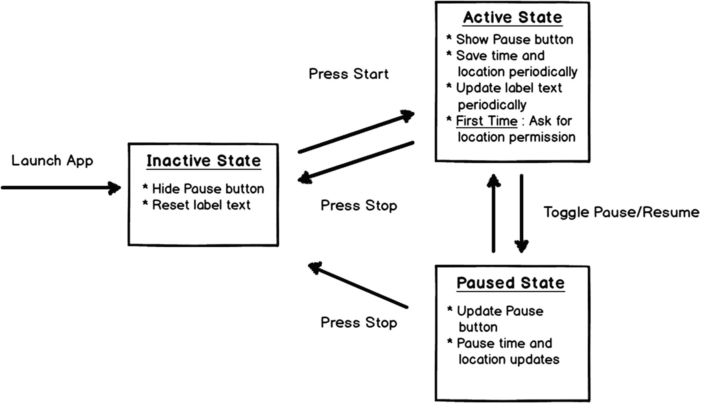

**图 2-7** 创建锻炼视图控制器的流程图

非活跃和活跃状态之间的转换由`toggleWorkout()`方法处理，该方法绑定到“切换锻炼”按钮的“触摸内部”事件。位置请求的代码应在此处启动。为了唤起你的记忆，在代码清单 2-1 中，我提供了第 1 章中实现的`CreateWorkoutViewController`类中的代码。

```
import UIKit
class CreateWorkoutViewController: UIViewController {
    @IBOutlet weak var workoutTimeLabel :UILabel?
    @IBOutlet weak var workoutDistanceLabel :UILabel?
    @IBOutlet weak var toggleWorkoutButton :UIButton?
    @IBOutlet weak var pauseWorkoutButton :UIButton?
    override func viewDidLoad() {
        super.viewDidLoad()
    }
    override func didReceiveMemoryWarning() {
        super.didReceiveMemoryWarning()
    }
    @IBAction func toggleWorkout() {
        NSLog("切换锻炼按钮已按下")
    }
    @IBAction func pauseWorkout() {
        NSLog("暂停锻炼按钮已按下")
    }
}
```

**代码清单 2-1** 来自第 1 章的 `CreateWorkoutViewController` 类

为了表示应用的不同状态，你可以创建一个与流程图中的状态相对应的枚举。在类内部，创建一个以该枚举为类型的属性。当用户按下“开始”按钮时，更新状态属性并调用请求定位权限的方法。要实现此逻辑，请更新`CreateWorkoutViewController`类，如代码清单 2-2 所示。

```
import UIKit
enum WorkoutState {
    case inactive
    case active
    case paused
}
class CreateWorkoutViewController: UIViewController {
    @IBOutlet weak var workoutTimeLabel: UILabel?
    @IBOutlet weak var workoutDistanceLabel: UILabel?
    var currentWorkoutState = WorkoutState.inactive
    ...
    @IBAction func toggleWorkout() {
        switch currentWorkoutState {
        case .inactive:
            currentWorkoutState = .active
            requestLocationPermission()
        case .active:
            currentWorkoutState = .inactive
        default:
            NSLog("toggleWorkout() 在上下文之外被调用！")
        }
        NSLog("切换锻炼按钮已按下")
    }
    func requestLocationPermission() {
        NSLog("已请求定位权限")
    }
    ...
}
```

**代码清单 2-2** 向 `CreateWorkoutViewController` 类添加状态跟踪


### 检查硬件可用性

正如我在本章开头提到的，苹果推荐的设计模式是首先检查硬件设备是否可用，然后请求使用权限。苹果一直通过硬件特性来区分其设备，更倾向于采用功能最先进的最新设备。作为开发者，你自然希望使用这些功能，但基于设备型号做决策很快就会变得笨拙。对于许多硬件功能（包括 iPhone 的 GPS 和摄像头），都有相应的 API 可以让你判断该功能是否可用。

以 GPS 为例，管理其运行的框架是 Core Location。它提供了一个类方法 `CLLocationManager.locationServicesEnabled()`，你可以用该方法查询设备上定位功能的可用性。要使用这个方法，你必须在 `CreateWorkoutViewController` 类中导入 Core Location 框架。按照代码清单 2-3 所示更新该类。

```swift
import UIKit
import CoreLocation
class CreateWorkoutViewController: UIViewController {
...
func requestLocationPermission() {
if CLLocationManager.locationServicesEnabled() {
NSLog("Location services are available")
} else {
presentEnableLocationAlert()
}
}
func presentEnableLocationAlert() {
let alert = UIAlertController(title: "Permission
Error", message: "Please enable location services on your device", preferredStyle: UIAlertControllerStyle.alert)
let okAction = UIAlertAction(title: "OK", style:
UIAlertActionStyle.default, handler: nil)
alert.addAction(okAction)
self.present(alert, animated: true, completion: nil)
}
...
}
代码清单 2-3
为 CreateWorkoutViewController 类添加定位服务查询功能
```

你会注意到，如果设备上的定位服务未全局启用（由于用户设置或硬件不可用），我添加了一个方法来显示一个警告视图。这是一个很好的方式，可以告知用户定位权限对于获得最佳应用体验至关重要。

### 响应定位权限状态的变化

在确认用户的设备上 GPS 硬件可用之后，你现在可以请求 iOS 的定位权限了。同样，Core Location 框架管理此操作。然而，为了响应状态变化，你必须实例化一个负责与 Core Location 框架交互的对象，并且必须将 `CreateWorkoutViewController` 类声明为 `CLLocationManagerDelegate` 协议的委托。

*协议* 是一种编程概念，允许你在两个类之间定义一个轻量级接口。这在苹果的硬件框架中非常常用，你只需要能够在目标硬件上调用一两个方法，而无需了解其实现的所有细节。实现了协议所指定函数的对象称为委托。它扮演着发起对硬件的调用并*接收*输出的角色。

为了管理与 Core Location 框架的接口，给 `CreateWorkoutViewController` 类添加一个 `CLLocationManager` 属性。如代码清单 2-4 所示，在声明时初始化该对象，然后在 `toggleWorkout()` 方法内部，将管理对象的 `delegate` 属性设置为 `self`（对 `CreateWorkoutViewController` 类的引用）。这将允许该类响应来自 Core Location 框架的消息。

```swift
class CreateWorkoutViewController: UIViewController {
...
let locationManager = CLLocationManager()
@IBOutlet weak var workoutTimeLabel: UILabel?
...
func requestLocationPermission() {
if CLLocationManager.locationServicesEnabled(){
locationManager.delegate = self
NSLog("Location services are available")
} else {
...
}
}
...
}
代码清单 2-4
为 CreateWorkoutViewController 类添加 CLLocationManager 属性
```

Swift 编译器会标记你的代码，指出你正试图将属性赋值给一个不兼容的类。要解决这个问题，请添加 `CLLocationManagerDelegate` 协议的定义。

在 Swift 中，我比较喜欢通过在类定义下添加扩展（extension）的方式来声明类实现了某些协议。从长远来看，这有助于保持代码清晰。扩展是一个代码块，允许你在不修改原始类本身的情况下为其添加额外的功能。一个常见的例子是，当你想扩展 `UIColor` 类，为你应用中使用的某个苹果未定义的颜色添加一个方法时。

`CreateWorkoutViewController` 类的扩展如代码清单 2-5 所示。处理定位权限状态更新时必须实现的协议方法是 `func locationManager:didChangeAuthorizationStatus:`。如果你之前已经请求过权限，这个委托方法会立即返回已授权的状态值。如果你之前没有请求过权限，它会在用户做出决定后返回。

```swift
func requestLocationPermission() {
if CLLocationManager.locationServicesEnabled(){
...
} else {
...
}
}
} //类定义结束
extension CreateWorkoutViewController:
CLLocationManagerDelegate {
func locationManager(_ manager: CLLocationManager,
didChangeAuthorization status: CLAuthorizationStatus) {
NSLog("Received permission change update!")
}
}
代码清单 2-5
为 CLLocationManagerDelegate 协议添加扩展
```

与锻炼状态由你定义的 `WorkoutState` 枚举管理类似，你的应用的权限状态由 Core Location 框架提供的 `CLAuthorizationStatus` 枚举管理。可能的授权状态值及其含义列于表 2-2 中。

表 2-2

Core Location 授权状态


| 值 | 用户操作 | 对应用的影响 |
| --- | --- | --- |
| `notDetermined` | 用户尚未看到你的应用的权限弹窗。 | 在显示位置权限弹窗且用户批准之前，你的应用无法使用任何基于位置的功能。 |
| `restricted` | 由于家长控制或移动设备管理设置，用户设备上的定位服务被禁用。 | 在管理策略变更之前，你的应用无法使用任何基于位置的功能。 |
| `denied` | 用户已拒绝你的应用使用定位服务。 | 在用户通过 iOS 设置应用允许权限状态之前，你的应用无法使用任何基于位置的功能。 |
| `authorizedWhenInUse` | 用户已允许你的应用在前台时使用定位服务。 | 你的应用仅在前台运行时才能访问定位服务。 |
| `authorizedAlways` | 用户已允许你的应用在前台和后台使用定位服务。 | 你的应用在活跃状态和后台运行时均可使用定位服务。 |

`didChangeAuthorizationStatus()` 方法会在所有状态下触发。同样，当你检查位置权限时，基于用户当前的授权状态，发起的调用也应有所不同。你可以通过调用 `CLLocationManager.authorizationStatus()` 方法来获知当前的授权状态。在清单 2-6 中，我更新了 `requestLocationPermission()` 和 `didChangeAuthorizationStatus()` 方法，使其包含基于新授权状态的逻辑。

```
class CreateWorkoutViewController: UIViewController {
...
func requestLocationPermission() {
if CLLocationManager.locationServicesEnabled(){
locationManager.delegate = self
switch(CLLocationManager.authorizationStatus()) {
case .notDetermined:
locationManager.requestWhenInUseAuthorization()
case .authorizedWhenInUse :
requestAlwaysPermission()
case .authorizedAlways:
startWorkout()
default:
presentPermissionErrorAlert()
}
} else {
presentEnableLocationAlert()
}
}
func requestAlwaysPermission() {
if let isConfigured = UserDefaults.standard.value(forKey:
"isConfigured") as? Bool, isConfigured == true {
startWorkout()
} else {
locationManager.requestAlwaysAuthorization()
}
}
func startWorkout() {
currentWorkoutState = .active
UserDefaults.standard.setValue(true, forKey:
"isConfigured")
UserDefaults.standard.synchronize()
}
func presentPermissionErrorAlert() {
let alert = UIAlertController(title: "Permission
Error", message: "Please enable location services
for this app", preferredStyle:
UIAlertControllerStyle.alert)
let okAction = UIAlertAction(title: "OK", style:
UIAlertActionStyle.default, handler: nil)
alert.addAction(okAction)
self.present(alert, animated: true, completion: nil)
}
...
}
extension CreateWorkoutViewController :
CLLocationManagerDelegate {
func locationManager(_ manager:
CLLocationManager, didChangeAuthorization
status: CLAuthorizationStatus) {
switch status {
case .authorizedWhenInUse:
requestAlwaysPermission()
case .authorizedAlways:
startWorkout()
case .denied:
presentPermissionErrorAlert()
default:
NSLog("Unhandled Location Manager Status:
\(status)")
}
}
清单 2-6
使用授权状态来呈现位置权限并响应授权状态的变化
```

在 `requestLocationPermission()` 方法中，我添加了一个 `switch` 语句，用于根据现有的授权状态来指导下一步操作。在 `notDetermined` 的情况下，我将其映射为用户第一次打开应用，并调用 `locationManager.requestWhenInUseAuthorization()` 方法来向用户请求“使用期间”权限。苹果推荐的设计模式是先请求 `authorizedWhenInUse` 权限，然后再请求 `authorizedAlways` 权限。

继续看 `switch` 语句，如果应用已被授权为“使用期间”权限，此时你就可以请求“始终”权限了。为了处理苹果的工作流程，我将“始终”权限的请求封装在一个方法中。如果用户是直接从 `authorizedWhenInUse` 权限请求过来的，你应显示“始终”权限请求；否则，就开始锻炼。我需要跳出 Core Location 框架，使用 `UserDefaults` 类来跟踪应用之前是否已经请求过权限，因为在这里检查 `authorizedWhenInUse` 或 `denied` 授权状态会导致过多的误判。当用户开始第一次锻炼时，`isConfigured` 值会被设为 `true`。

最后，在 `authorizedAlways` 权限的情况下，你可以正常开始锻炼。对于 `denied` 情况，我会显示一个错误提示。对于所有其他情况，我会将未知状态记录到控制台日志中，以便于后续调试。

`didChangeAuthorizationStatus()` 方法使用了与 `requestLocationPermission()` 方法相同的逻辑来处理各种状态。如果你把权限请求想象成一次对话，那么代理方法就是听者对说话者问题的回应。

为了确保一切正常，请编译并运行应用。当你第一次按下 `Start` 按钮时，你应该会看到图 2-8 中所示的提示。

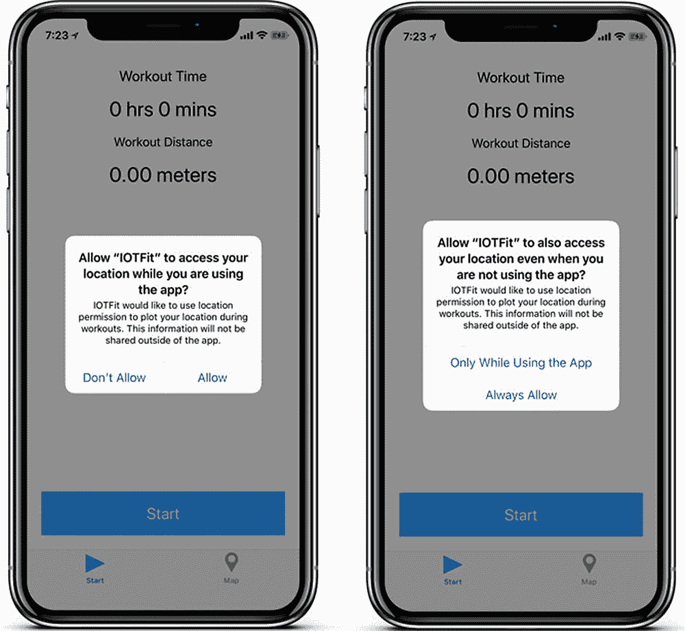

图 2-8

IOTFit 的位置权限提示


#### 请求用户更改应用设置

从 `denied` 权限恢复的唯一方法是让用户在 iOS 的设置应用中为你的应用页面开启权限。一种常见的鼓励用户进行此操作的方法是创建一个提示框，直接引导用户进入该页面。尽管与桌面电脑或安卓手机相比，iOS 在应用间共享数据方面的设置非常有限，但 `URL Schemes`（特殊格式的 URL）一直是官方支持的、在注册了各自 scheme（例如 `mySocalApp://`）的应用之间传递少量数据的方式。数据通过 URL 参数来回传递（例如 `mySocalApp://?request=shareLink`）。

iOS 的设置应用注册了 `prefs://` scheme。幸运的是，苹果为你提供了查找特定设置的 URL。你只需要调用 `UIApplicationOpenSettingsURLSetting` 宏即可。在代码清单 2-7 中，我修改了 `presentPermissionErrorAlert()` 方法，以便通过此 URL 启动设置应用。

```
func presentPermissionErrorAlert() {
let alert = UIAlertController(title: "Permission Error",
message: "Please enable location services for this app",
preferredStyle: UIAlertControllerStyle.alert)
let okAction = UIAlertAction(title: "OK", style:
UIAlertActionStyle.default, handler: {
(action:  UIAlertAction) in
if let settingsUrl = URL(string:
UIApplicationOpenSettingsURLString),
UIApplication.shared.canOpenURL(settingsUrl) {
UIApplication.shared.open(settingsUrl,
options: [:], completionHandler: nil)
}
})
let cancelAction = UIAlertAction(title: "Cancel", style:
UIAlertActionStyle.cancel, handler: nil)
alert.addAction(okAction)
alert.addAction(cancelAction)
self.present(alert, animated: true, completion: nil)
}
代码清单 2-7
将用户引导至你应用的设置页面
```

与请求权限前必须检查定位服务是否可用一样，在尝试打开设置 URL 之前，你必须询问应用是否可以打开该 URL。苹果实现其受保护资源的方式所带来的最不幸的副作用之一就是，如果你不请求权限或检查可用性，应用可能会在运行时崩溃。运行时崩溃是应用被 App Store 拒绝的首要原因。

如果用户拒绝了应用的位置权限，那么下次他们按下“开始”按钮时，将会看到如图 2-9 所示的流程。按下“确定”按钮将带他们进入 IOTFit 的设置页面。当他们返回应用时，就可以正常使用了。你可以通过在设置应用中禁用位置权限，然后在 IOTFit 应用中按下“开始”按钮来测试此功能。

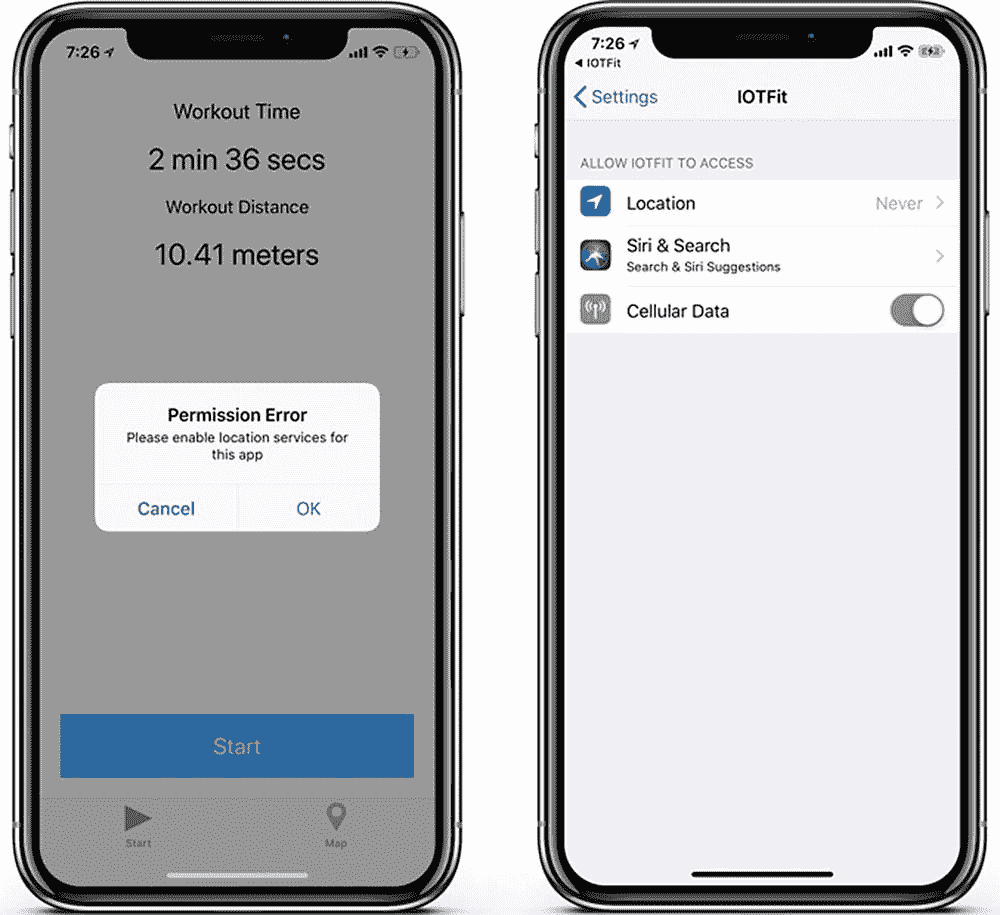

图 2-9

IOTFit 的设置请求流程

## 请求位置更新

现在应用已经被允许与 iOS 的位置功能交互，你可以开始轮询位置更新了。如图 2-7 中的应用流程图所示，每隔几秒钟，你必须保存最近的位置，计算新的锻炼时间，并计算新的锻炼距离。当用户暂停锻炼时，你必须暂停更新。恢复则会继续更新时间和距离。

在 iOS 中处理位置更新的流程与请求位置权限的流程非常相似。首先，让你的位置管理器实例知道你需要位置更新，然后通过 `locationManager:didUpdateLocations:` 代理方法来响应这些更新。为了减少更新次数，你还需要对位置管理器的精度设置一个限制。

在代码清单 2-8 中，我更新了 `requestLocationPermission()` 和 `startWorkout()` 方法以及 `CLLocationManagerDelegate` 扩展，以包含位置更新请求和代理处理方法。

```
class CreateWorkoutViewController: UIViewController {
...
func requestLocationPermission() {
if CLLocationManager.locationServicesEnabled(){
locationManager.desiredAccuracy =
kCLLocationAccuracyHundredMeters
locationManager.distanceFilter = 10.0 //米
locationManager.delegate = self
...
}
} else {
presentEnableLocationAlert()
}
}
func startWorkout() {
currentWorkoutState = .active
...
locationManager.startUpdatingLocation()
}
}
extension CreateWorkoutViewController:
CLLocationManagerDelegate {
...
func locationManager(_ manager: CLLocationManager,
didUpdateLocations locations: [CLLocation]) {
guard let mostRecentLocation = locations.last else {
NSLog("无法读取最近位置")
return
}
NSLog("最近位置: \(String(describing:
mostRecentLocation))")
}
代码清单 2-8
在锻炼开始时请求位置权限
```

`locationManager:didUpdateLocations:` 代理方法会返回多个位置，但就计算距离而言，最后一个就足够了。在我的代码中，我添加了一个 `guard-let` 来在访问值之前进行验证。对于来自硬件的可选值，它们未被初始化的风险很高（例如当硬件未就绪或连接断开时）。在这种情况下，强制解包是不明智的。


### 响应位置更新

当系统检测到位置变化超过你指定的 `distanceFilter` 值时，`locationManager:didUpdateLocations:` 委托方法将触发。不过，你需要在此时更新用户界面以显示新值。此外，当用户改变锻炼状态时，你也应该更改按钮上的标签（如果锻炼完全停止，则隐藏暂停按钮）。最后，你还需要某种方式记录已过去的时间。

这些任务中最简单的是更新按钮。当锻炼开始时，你将显示暂停按钮，并将开始按钮的标签改为“停止”。当暂停按钮被按下时，将其标签改为“继续”。最后，当停止按钮被按下时，重置用户界面（显示开始按钮，隐藏暂停按钮）。由于此逻辑在应用的所有状态变更中均相同，你可以将其封装到一个方法中，并在整个代码中使用该方法。在清单 2-9 中，我创建了一个名为 `updateUserInterface()` 的方法来处理这些更新，并在 `viewDidLoad()`、`toggleWorkout()` 和 `pauseWorkout()` 方法中添加了对该方法的调用。这些是视图被创建以及用户与屏幕交互的关键点。

```swift
class CreateWorkoutViewController: UIViewController {
...
override func viewDidLoad() {
super.viewDidLoad()
updateUserInterface()
}
@IBAction func toggleWorkout() {
switch currentWorkoutState {
case .inactive:
requestLocationPermission()
case .active:
currentWorkoutState = .inactive
default:
NSLog("toggleWorkout() called out of context!")
}
updateUserInterface()
}
@IBAction func pauseWorkout() {
updateUserInterface()
}
func updateUserInterface() {
switch(currentWorkoutState) {
case .active:
toggleWorkoutButton?.setTitle("Stop", for: UIControlState.normal)
pauseWorkoutButton?.setTitle("Pause", for: UIControlState.normal)
pauseWorkoutButton?.isHidden = false
case .paused:
pauseWorkoutButton?.setTitle("Resume", for: UIControlState.normal)
pauseWorkoutButton?.isHidden = false
default:
toggleWorkoutButton?.setTitle("Start", for: UIControlState.normal)
pauseWorkoutButton?.setTitle("Pause", for: UIControlState.normal)
pauseWorkoutButton?.isHidden = true
}
}
...
}
清单 2-9
当应用状态改变时更新按钮
```

下一个最简单的任务是更新时间显示。由于位置更新会在不可预测的时间触发（只要超过阈值），你需要设计一个独立的计时机制。幸运的是，有个 API 就是为此而生！你可以使用 `Timer` 类创建计时器对象，该对象可以在稍后时间或按你指定的时间间隔重复调用某个方法。对于 IOTFit 应用，每次计时器触发时，你必须计算新的锻炼总时间并更新锻炼时间标签。在清单 2-10 中，我更新了 `CreateWorkoutViewController` 类，添加了用于管理计时器的属性和辅助方法，并插入了适当的计时器状态管理调用。

```swift
import UIKit
import CoreLocation
...
let timerInterval: TimeInterval = 1.0
class CreateWorkoutViewController: UIViewController {
...
var lastSavedTime: Date?
var workoutDuration: TimeInterval = 0.0
var workoutTimer: Timer?
...
func startWorkout() {
currentWorkoutState = .active
UserDefaults.standard.setValue(true, forKey: "isConfigured")
UserDefaults.standard.synchronize()
workoutDuration = 0.0
workoutTimer = Timer.scheduledTimer(timeInterval: timerInterval, target: self, selector: #selector(updateWorkoutData), userInfo: nil, repeats: true)
locationManager.startUpdatingLocation()
}
@objc func updateWorkoutData() {
let now = Date()
if let lastTime = lastSavedTime {
self.workoutDuration += now.timeIntervalSince(lastTime)
}
self.workoutDuration += timerInterval
workoutTimeLabel?.text = stringFromTime(timeInterval: self.workoutDuration)
}
func stringFromTime(timeInterval: TimeInterval) -> String{
let integerDuration = Int(timeInterval)
let seconds = integerDuration % 60
let minutes = (integerDuration / 60) % 60
let hours = (integerDuration / 3600)
if hours > 0 {
return String("\(hours) hrs \(minutes) mins \(seconds) secs")
} else {
return String("\(minutes) min \(seconds) secs")
}
}
@IBAction func toggleWorkout() {
switch currentWorkoutState {
case .inactive:
requestLocationPermission()
case .active:
currentWorkoutState = .inactive
stopWorkoutTimer()
default:
NSLog("toggleWorkout() called out of context!")
}
updateUserInterface()
}
@IBAction func pauseWorkout() {
switch currentWorkoutState {
case .paused:
startWorkout()
case .active:
currentWorkoutState = .paused
stopWorkoutTimer()
default:
NSLog("pauseWorkout() called out of context!")
}
updateUserInterface()
}
...
func stopWorkoutTimer() {
workoutTimer?.invalidate()
lastSavedTime = nil
}
}
清单 2-10
使用计时器跟踪锻炼时间更新
```

为了跟踪经过的时间，我创建了一个 `TimeInterval` 对象。`Timer` 对象使用 `TimeInterval` 值进行初始化，因此使用同一类来跟踪时间能使代码更加一致。接着，在 `startWorkout()` 方法中初始化 `Timer` 并重置 `workoutDuration`。该 `Timer` 被设置为每秒重复一次。当它触发时，会调用 `updateWorkoutData()` 方法。在此方法内部，我使用 `stringFromTime()` 辅助方法将 `workoutDuration` 属性转换为字符串，并更新 `workoutTime` 标签。我通过比较两个 `Date` 对象（`lastSavedTime` 和 `now`）来计算时间差。这样，即使应用在后台运行，也能精确跟踪时间。

关于计时器的最后任务，你可能注意到我在 `toggleWorkout()` 和 `pauseWorkout()` 方法中插入了适当的 `stopWorkoutTimer()` 调用，并完善了 `pauseWorkout()` 方法，使其包含实现图 2-7 流程图中各状态所需的逻辑。

在所有这些用户界面更新基础工作就绪后，更新锻炼总距离就很简单了。就像你创建属性来跟踪总时间一样，你可以创建属性来跟踪锻炼距离和最后保存的位置。当 `locationManager:didUpdateLocations:` 委托方法触发时，你可以使用 `CLLocation` 对象（表示位置坐标点的类）的 `distance` 属性，将最新位置与最后保存位置之间的距离累加进来。在清单 2-11 中，我更新了 `CreateWorkoutViewController` 类、`locationManager:didUpdateLocations:` 委托方法和 `updateWorkoutData()` 方法，以实现此逻辑。

```swift
class CreateWorkoutViewController: UIViewController {
...
var workoutDistance: Double = 0.0
var lastSavedLocation: CLLocation?
...
@objc func updateWorkoutData() {
self.workoutDuration += timerInterval
workoutTimeLabel?.text = stringFromTime(timeInterval: self.workoutDuration)
workoutDistanceLabel?.text = String(format: "%.2f meters", arguments: [workoutDistance])
}
...
}
extension CreateWorkoutViewController: CLLocationManagerDelegate {
...
func locationManager(_ manager: CLLocationManager, didUpdateLocations locations: [CLLocation]) {
guard let mostRecentLocation = locations.last else {
NSLog("Unable to read most recent location")
return
}
if let savedLocation = lastSavedLocation {
let distanceDelta = savedLocation.distance(from: mostRecentLocation)
workoutDistance += distanceDelta
}
lastSavedLocation = mostRecentLocation
}
}
清单 2-11
计算锻炼距离
```


#### 以编程方式启用后台更新

如前所述，当检测到的位置变化超过您设定的最小阈值时，`locationManager:didUpdateLocations:` 委托方法将会触发，包括应用程序在后台运行时也是如此。为了最安全的实现，您必须修改“创建锻炼视图控制器”的位置管理器设置代码，声明应用程序将在后台使用位置服务，并且更新可以被暂停。除了使代码更清晰外，这还将帮助您的应用成为一个负责任的电量消耗者。GPS 是移动设备上最耗电的功能之一！在代码清单 2-12 中，我通过以下修改调整了 `requestLocationPermission()` 方法。

```
func requestLocationPermission() {
if CLLocationManager.locationServicesEnabled() {
locationManager.distanceFilter = 10.0
locationManager.pausesLocationUpdatesAutomatically
= true
locationManager.allowsBackgroundLocationUpdates
= true
locationManager.desiredAccuracy =
kCLLocationAccuracyHundredMeters
locationManager.delegate = self
...
} else {
presentEnableLocationAlert()
}
}
代码清单 2-12
为位置管理器启用后台更新
```

经过最后这几项修改，您现在可以使用“创建锻炼”屏幕来追踪锻炼了！试着在您的家或办公室里走动几米，您会看到时间和距离在增加，直到您按下“暂停”或“停止”按钮！

## 在地图上显示位置数据

既然 IOTFit 应用能够使用 iPhone 上的位置服务来帮助用户了解他们跑了多远，那么让这些数据对用户有用会是个好主意。在构建物联网应用时，您应该思考如何利用这些数据来帮助用户改善生活，就像思考如何与硬件通信来收集这些数据一样重要。通过让用户在地图上可视化他们的锻炼，您可以帮助他们思考路线对运动表现的影响，研究他们喜欢的路线，或者为他们提供一张可与朋友分享的有趣图片。

在本章的前半部分，您学习了如何使用 `CLLocation` 类来保存位置坐标数据并计算两点间的距离。在本节中，您将学习如何更进一步，将这些数据转换为地图上的标记点和路径。您将会发现，这实际上非常简单。不幸的是，这些操作需要一组数据来工作，而 Apple 并没有为您提供一个免费的开箱即用的位置存储方案，因此您需要自己构建一个。然而幸运的是，借助于 `Codable` 协议，在 iOS 11 中这项工作也变得容易多了。

### 使用 Codable 协议进行基于文件的数据存储

任何锻炼应用的关键特性之一就是历史记录功能，它允许用户查看过去的锻炼记录。在 IOTFit 的第一个版本中，历史功能是一张地图，显示用户起点和终点之间（以标记点表示）的路径。为了实现这一功能，您必须添加一个用于保存和检索锻炼数据的类，并修改现有的类以使其作为数据源。对于 IOTFit 应用，您将创建一个名为 `WorkoutDataManager` 的新类来管理这些职责，并通过单例对象进行访问。

单例是一个在应用程序中只能被实例化一次的对象。这是一种有争议的设计模式，因为许多开发者认为单例与全局变量的用途相同（会产生副作用并在应用程序中随处共享），但我还是想介绍它，因为 Apple 在其硬件 API 中经常使用单例，并且我认为在必须管理应用程序内部共享资源访问的场景中，使用单例是合适的。

为了让用户在关闭应用后仍能访问数据，`WorkoutDataManager` 将使用一个属性列表（`.plist`）文件作为其持久化数据存储。属性列表（就像您之前用来配置应用位置权限的那个）在 iOS 中经常被用来存储设置和简单数据集，既可以作为捆绑文件也可以作为文档使用。在过去，您必须自己编写整个数据输入/输出（I/O）栈，但现在，多亏了 `Codable` 协议，您所要做的只是将您的信息抽象为实现该协议的基本数据类型（例如，`Int`，`String`），编写适配器来帮助将更复杂的类型（如 `CLLocation`）序列化为您的基本类型，然后指定您想要存储数据的格式（例如，JSON，属性列表）。

### 注意

本节中的代码仅适用于 iOS 11 及更高版本。`Codable` 协议是在 iOS 11 中随 Swift 4 一起引入的。

要开始操作，您必须创建 `WorkoutDataManager` 类。如图 2-10 所示，转到“文件”菜单并选择“新建” ➤ “文件”。

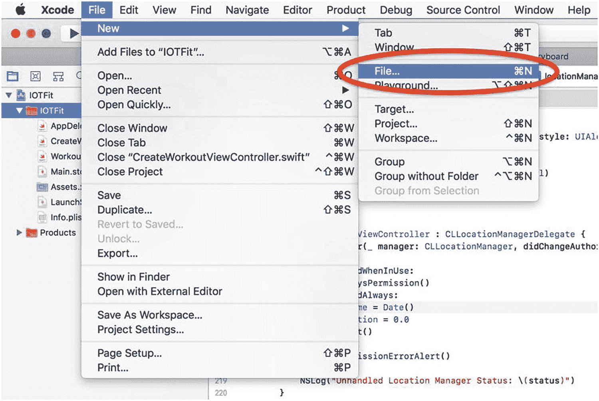

图 2-10

在 Xcode 中创建新文件

当被要求选择类型时，请选择“Swift 文件”，如图 2-11 所示。将新文件命名为 `WorkoutDataManager.swift`。

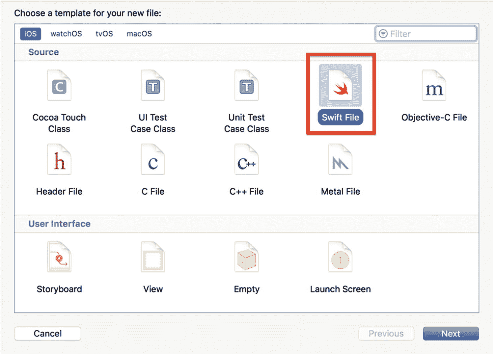

图 2-11

Xcode 新文件模板

您的新类应类似于代码清单 2-13。

```
import Foundation
class WorkoutDataManager {
}
代码清单 2-13
空的 WorkoutDataManager 类
```

Swift 中的单例是通过创建类的静态实例和一个自定义初始化器来实现*懒加载*（在第一次调用时才初始化对象）。要实现这些，请修改这个空白类，如代码清单 2-14 所示。

```
class WorkoutDataManager {
static let sharedManager = WorkoutDataManager()
private init() {
print("Singleton initialized")
}
}
代码清单 2-14
将 WorkoutDataManager 类实现为单例
```

如前所述，要利用 `Codable` 协议的数据序列化功能，您必须定义实现该协议的数据类型。与类名保持一致，IOTFit 应用的核心数据类型将是*锻炼*。如果您回想一下“创建锻炼视图控制器”，那里显示的数据是锻炼时长和距离。为了帮助绘制地图，您还应该保留锻炼期间检测到的位置列表。在代码清单 2-15 中，我添加了您将用于构建锻炼数据管理器的数据类型。

```
import Foundation
struct Coordinate: Codable {
var latitude: Double
var longitude: Double
}
struct Workout: Codable {
var endTime: Date
var duration: TimeInterval
var locations: [Coordinate]
}
typealias Workouts = [Workout]
class WorkoutDataManager {
static let sharedManager = WorkoutDataManager()
private var workouts: Workouts?
private init() {
print("Singleton initialized")
}
}
代码清单 2-15
将 Codable 兼容的数据类型添加到 WorkoutDataManager 类
```

如前所述，要使用 `Codable` 协议，必须将所有内容抽象为基本数据类型。为了辅助这一点，我创建了 `Coordinate` 数据类型，稍后您将用它来帮助从 `CLLocation` 对象转换数据。由于用户会多次使用该应用，我创建了一个名为 `Workouts` 的 `typealias` 来表示锻炼项目的数组。`Codable` 协议的一大优点是，当您想要存储整个项目数组时，您所要做的就是*编码*（写入）或*解码*（读取）数据存储中的该数组。


#### 实现文件输入输出（File I/O）

iOS 以将应用程序隔离在沙盒中而闻名，这意味着应用程序只能访问和管理其自身空间内的资源（例如文件），苹果允许的少数例外情况除外。开发者处理此沙盒最常见的方式之一是在运行时，在应用程序包的 `Documents` 文件夹中创建文件。对于 IOTFit 应用，你也要这样做。锻炼数据将存储在一个名为 `Workouts.plist` 的属性列表文件中。

处理应用程序 `Documents` 文件夹的一个挑战是，你必须在运行时找到其文件路径。每次安装你的应用时，它都会被创建在 iOS 生成的一个唯一文件夹中。为帮助管理这一点，我在代码清单 2-16 中添加了逻辑，该逻辑在运行时查找 IOTFit 的 `Documents` 文件夹路径，并将 `Workouts.plist` 文件名附加到末尾。

```
class WorkoutDataManager {
    ...
    private var workoutsFileUrl: URL? {
        guard let documentsUrl = documentsDirectoryUrl() else {
            return nil
        }
        return documentsUrl.appendingPathComponent("Workouts.plist")
    }
    func documentsDirectoryUrl() -> URL? {
        let fileManager = FileManager.default
        return fileManager.urls(for: .documentDirectory, in: .userDomainMask).first
    }
}
// 代码清单 2-16：在应用程序的 Documents 目录中运行时查找文件路径
```

`FileManager` 类主要用于执行手动文件 I/O；但它附带了便捷的辅助方法来帮助你管理程序的沙盒。你可能还注意到我在这里使用了 `guard-let` 模式。当你需要在条件失败后停止执行某个代码块时，`guard-let` 是一个完美的选择。它还有助于提高可读性，因为后续逻辑嵌套在更少的链式 `if-let` 语句中。

要加载数据，你必须创建一个 `Decoder` 对象。该对象使用苹果预构建的文件接口之一（或你自己编写的接口）以及你的 `Codable` 兼容数据类型，将文件中的数据映射为你可以在应用中使用的数据。在代码清单 2-17 中，我添加了 `loadFromPlist()` 方法来处理此操作，并在自定义初始化方法中调用了该方法。为了保持数据同步，初始化 `WorkoutDataManager` 类后，你应该执行的第一项操作就是加载过往数据。

```
class WorkoutDataManager {
    ...
    private init() {
        print("Singleton initialized")
        loadFromPlist()
    }
    ...
    func loadFromPlist() {
        workouts = [Workout]()
        guard let fileUrl = workoutsFileUrl else {
            return
        }
        do {
            let workoutData = try Data(contentsOf: fileUrl)
            let decoder = PropertyListDecoder()
            workouts = try decoder.decode(Workouts.self, from: workoutData)
        } catch {
            NSLog("Error reading plist")
        }
    }
}
// 代码清单 2-17：使用 PropertyListDecoder 从属性列表加载数据
```

写入文件的过程非常相似，只不过不是使用解码器，而是使用编码器来读取文件内容。为处理保存到文件的操作，请将 `saveToList()` 方法添加到 `WorkoutDataManager` 类，如代码清单 2-18 所示。

```
class WorkoutDataManager {
    ...
    func saveToPlist() {
        guard let fileUrl = workoutsFileUrl else {
            return
        }
        let encoder = PropertyListEncoder()
        encoder.outputFormat = .xml
        do {
            let workoutData = try encoder.encode(workouts)
            try workoutData.write(to: fileUrl)
        } catch {
            NSLog("Error writing plist")
        }
    }
}
// 代码清单 2-18：使用 PropertyListEncoder 写入属性列表
```

#### 使用 `map()` 方法序列化数据

完成锻炼数据管理器所需完成的最后任务是与“创建锻炼视图控制器”和“锻炼地图视图控制器”的接口。这些包括创建锻炼、关闭锻炼、向锻炼追加位置以及检索最近一次锻炼所需的操作。这些视图控制器从 Core Location 框架接收数据，其形式为 `CLLocation` 对象，因此你还需要添加一些逻辑，将 `CLLocation` 转换为你在本节中创建的 `Coordinate` 数据类型。幸运的是，这正是 Swift 3.0 中引入的 `map()` 高阶函数（方法）发挥作用的地方。

与之前的示例一样，在考虑实现细节之前，先思考用户界面将如何与锻炼生命周期逻辑连接。当你开始新锻炼时，必须创建一个新的锻炼实例。每次 Core Location 检测到新位置时，必须将其追加到当前锻炼中。当你完成锻炼时，应关闭当前锻炼并保存它。最后，当地图出现时，应加载最后保存的锻炼。在代码清单 2-19 中，我修改了 `CreateWorkoutViewController` 类以包含这些调用，这些调用基于每个方法被调用时各自拥有的信息。

```
class CreateWorkoutViewController: UIViewController {
    ...
    func startWorkout() {
        ...
        locationManager.startUpdatingLocation()
        lastSavedTime = Date()
        WorkoutDataManager.sharedManager.createNewWorkout()
    }
    ...
    @IBAction func toggleWorkout() {
        switch currentWorkoutState {
        case .inactive:
            requestLocationPermission()
        case .active:
            currentWorkoutState = .inactive
            stopWorkoutTimer()
            WorkoutDataManager.sharedManager.saveWorkout(duration: workoutDuration)
        default:
            NSLog("toggleWorkout() called out of context!")
        }
        updateUserInterface()
    }
    ...
}
extension CreateWorkoutViewController: CLLocationManagerDelegate {
    ...
    func locationManager(_ manager: CLLocationManager, didUpdateLocations locations: [CLLocation]) {
        guard let mostRecentLocation = locations.last else {
            return
        }
        ...
        WorkoutDataManager.sharedManager.addLocation(coordinate: mostRecentLocation.coordinate)
    }
}
// 代码清单 2-19：从“创建锻炼视图控制器”与 WorkoutDataManager 类进行交互
```

为管理进行中锻炼的坐标数据，请向 `WorkoutDataManager` 类添加一个属性，用于保存 `CLLocationCoordinate2D` 对象数组。当锻炼重置时，清空该数组。当位置更新被发布时，将最新位置追加到数组中。在代码清单 2-20 中，我更新了 `WorkoutDataManager` 类以包含此逻辑。`CLLocationCoordinate2D` 类是一种很好的方式，可以从 `CLLocation` 对象获取坐标信息，而无需编写太多额外代码。

```
import Foundation
import CoreLocation
...
class WorkoutDataManager {
    static let sharedManager = WorkoutDataManager()
    private var workouts: Workouts?
    private var activeLocations: [CLLocationCoordinate2D]?
    ...
    func createNewWorkout() {
        activeLocations = [CLLocationCoordinate2D]()
    }
    func addLocation(coordinate: CLLocationCoordinate2D) {
        activeLocations?.append(coordinate)
    }
    ...
}
// 代码清单 2-20：向 WorkoutDataManager 类添加进行中锻炼的位置管理功能
```


创建和更新锻炼位置非常简单；然而，对于保存和检索操作，您需要将这些位置与`Coordinate`对象进行相互转换。与其创建`for-loop`来遍历所有项目，从 Swift 3.0 开始，您可以使用`map()`高阶函数来定义一个要应用于集合中每个项目的操作（例如，为数组中的每个项目加 3）。对于`WorkoutDataManager`，您可以使用`map()`将每个项目与`Coordinate`数据类型进行相互转换。在**清单 2-21**中，我向`WorkoutDataManager`类添加了`saveWorkout()`和`getLastWorkout()`方法，实现了此逻辑。

```
class WorkoutDataManager {
...
func saveWorkout(duration: TimeInterval) {
guard let activeLocations = activeLocations else {
return
}
let mappedCoordinates = activeLocations.map{(value:
CLLocationCoordinate2D) in
return Coordinate(latitude: value.latitude,
longitude: value.longitude)
}
let currentWorkout = Workout(endTime: Date(), duration:
duration, locations: mappedCoordinates)
workouts?.append(currentWorkout)
saveToPlist()
}
func getLastWorkout() -> [CLLocationCoordinate2D]? {
guard let workouts = workouts, let lastWorkout =
workouts.last else {
return nil
}
let locations = lastWorkout.locations.map{(value:
Coordinate) in
return CLLocationCoordinate2D(latitude:
value.latitude, longitude: value.longitude)
}
return locations
}
}
Listing 2-21
Using the map() Method to Serialize Data in the saveWorkout() and getLastWorkout() Methods
```

就像回调处理程序或块一样，`map()`中对每个项目执行的逻辑被定义为一个匿名函数。为了便于阅读，我给迭代的值添加了一个标签。至此，`WorkoutDataManager`就完成了；现在您可以使用它在地图上显示已保存的位置！

## 在地图上显示已保存的位置

在本章中您将学到的所有功能中，映射数据是最简单的。要映射数据，您必须从`WorkoutLocationManager`中检索数据，添加显示锻炼起点和终点的图钉，并在它们之间绘制一条路径。对于数据检索操作，您将使用上一个练习中的`getLastWorkout:`方法。要绘制图钉和路径，您可以使用 MapKit 的内置标注（`MKPointAnnotation`）和折线（`MKPolylineRenderer`）API。

创建一个图钉（用 Apple 的术语来说是*标注*）很简单。您所需要做的就是用一个`CLLocationCoordinate2D`对象初始化一个`MKPointAnnotation`对象，并为该标注分配一个标题。显示标注甚至更简单。只需在 Map View 上调用`showAnnotations:`方法即可。它会自动缩放以适应地图上的这些标注。在**清单 2-22**中，我在`WorkoutMapViewController`类的`viewWillAppear:`方法中添加了生成这些标注的逻辑。每当显示 Map 选项卡时，都会调用此方法。

```
import MapKit
class WorkoutMapViewController: UIViewController {
@IBOutlet weak var mapView: MKMapView?
...
override func viewWillAppear(_ animated: Bool) {
super.viewWillAppear(animated)
guard var locations =
WorkoutDataManager.sharedManager.getLastWorkout(),
let first = locations.first,
let last = locations.last else {
return
}
let startPin = workoutAnnotation(title: "Start",
coordinate: first)
let finishPin = workoutAnnotation(title: "Finish",
coordinate: last)
if let oldAnnotations = mapView?.annotations {
mapView?.removeAnnotations(oldAnnotations)
}
mapView?.showAnnotations([startPin, finishPin],
animated: true)
}
func workoutAnnotation(title: String, coordinate:
CLLocationCoordinate2D) -> MKPointAnnotation {
let annotation = MKPointAnnotation()
annotation.coordinate = coordinate
annotation.title = title
return annotation
}
}
Listing 2-22
Generating and Displaying Annotations on a Map View
```

关于**清单 2-22**值得注意的一点是，在显示新标注之前，您必须调用`removeAnnotations:`方法来清除旧标注。这是 MapKit 实现中的一个缺点，但克服起来并不难。

绘制路径也很简单，但需要您将`WorkoutMapViewController`声明为实现`MKMapViewDelegate`协议。要绘制路径，您只需根据完整的已保存位置集合创建一个`MKPolyline`对象，并将其作为覆盖层应用到地图上。要定义路径的形状，您必须实现`MKMapViewDelegate`协议中的`mapView:rendererFor:overlay:`方法。然而，实现的细节非常简单。此方法仅指定线条的颜色、大小和其他显示属性。在**清单 2-23**中，我更新了`WorkoutMapViewController`类，使其包含协议实现并调用以绘制折线。与`CreateWorkoutViewController`类一样，我通过扩展来实现协议，以提高可读性。

```
class WorkoutMapViewController: UIViewController {
@IBOutlet weak var mapView: MKMapView?
override func viewDidLoad() {
super.viewDidLoad()
mapView?.delegate = self
}
override func viewWillAppear(_ animated: Bool) {
super.viewWillAppear(animated)
guard var locations =
WorkoutDataManager.sharedManager.getLastWorkout(), let first = locations.first, let last = locations.last else {
return
}
...
let workoutRoute = MKPolyline(coordinates:
&locations, count: locations.count)
mapView?.addOverlays([workoutRoute])
}
...
}
extension WorkoutMapViewController: MKMapViewDelegate {
func mapView(_ mapView: MKMapView, rendererFor overlay:
MKOverlay) -> MKOverlayRenderer {
let pathRenderer = MKPolylineRenderer(overlay: overlay)
pathRenderer.strokeColor = UIColor.red
pathRenderer.lineWidth = 3
return pathRenderer
}
}
Listing 2-23
Generating and Displaying a Path on a Map View
```

至此，IOTFit 应用的地图部分就完成了！保存您的第一次锻炼后，当您按下 Map 选项卡时，您会看到两个图钉指示锻炼的起点和终点，以及它们之间的一条红线，类似于**图 2-12**中的截图。

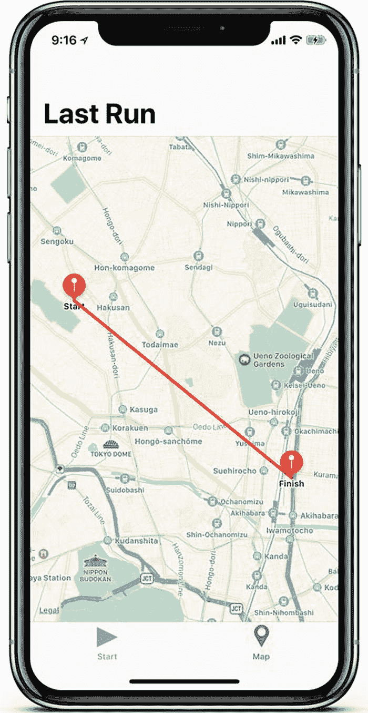

Figure 2-12

IOTFit app with completed workout in Workout Map screen

## 总结

在本章中，您采用了第一章中 IOTFit 应用的用户界面骨架，并通过添加位置权限、锻炼距离计算以及在地图上显示位置的能力对其进行了充实。在此过程中，您了解到当访问用户设备上的敏感权限时，Apple 会让您在项目设置中经历很多步骤，并调用以向用户显示请求。您还学习了协议如何帮助您实现来自 Apple 硬件框架的回调，甚至定义如何在地图上绘制路径。随着您继续阅读本书并进行物联网应用开发，这些概念将不断出现。


