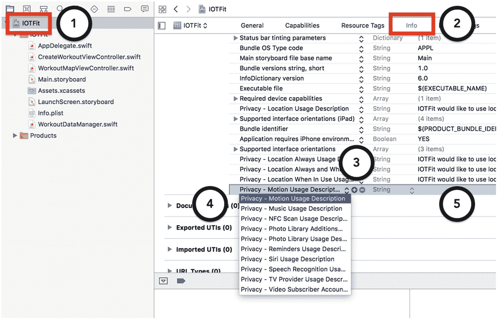
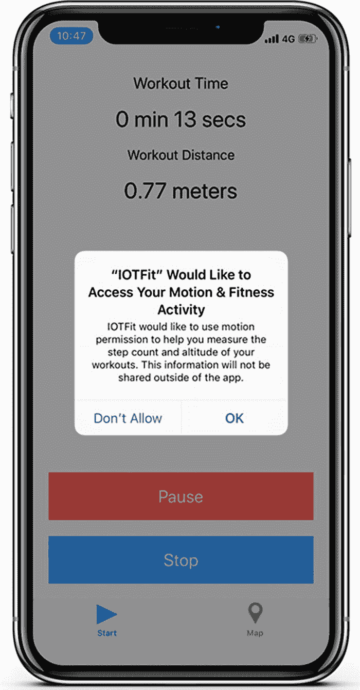

# 3. 使用 Core Motion 向你的 App 添加体能活动数据

在最后两章中，你从一个健身 App 的设计图开始着手，并为其充实了一个可用的用户界面，该界面能够根据 GPS 读数记录锻炼距离，并在地图上显示路径。不幸的是，正如你可能在操作该 App 时注意到的，位置信息仅在用户移动时更新，而且该 App 容易丢失 GPS 信号，偶尔会产生不准确的距离数据。为了打造一个更精确、更合适的健身 App，在本章中，你将学习如何使用 Core Motion——苹果 M 系列运动协处理器的接口，该芯片为 iPhone 和 Apple Watch 提供了计步器、加速度计和陀螺仪功能。

借助 Core Motion 框架提供的功能，你不仅可以向用户提供他们期望从其他健身追踪器（如步数）获得的数据，还可以减少 App 对电池的影响，因为 GPS 是 iPhone 最耗电的功能之一。随着 iOS 设备的不断演进，许多健身 App 也遵循了同样的转变：将 GPS 从主要的传感方法转变为一个面向高级用户的可选功能。

作为开发者，你还能获得一个额外的好处：当你在本书后续章节构建 IOTFit App 的 watchOS 版本时，你将能够再次运用本章学到的知识。当苹果在 watchOS 2.0 版本发布期间试图强化其功能时，它在手表上加入了 iOS 框架的精简版本。Core Motion 以及许多其他与健身相关的框架保留了 iOS 中的大部分 API，因此移植过程将会是轻松无痛的。

### 注意

Core Motion 依赖一个独立的微处理器芯片来执行其运动追踪功能。虽然 iPhone 和 Apple Watch 设备上都有这种芯片的不同变体，但截至本文撰写时，iPad 上尚未配备。你仍然可以使用 iPad 来开发该项目，但无法成功进行测试。

## 学习目标

在本章中，你将学习如何使用 Core Motion 来扩展 IOTFit App，使其能够显示关于步数和活动类型的实时更新报告、执行基于步数的距离计算，并测量海拔变化。通过完成这些任务，你将学到物联网 App 开发的以下关键技能：

-   为 App 设置运动（活动）权限
-   从 iPhone 的计步器请求步数数据
-   通过 iPhone 的气压计测量海拔差异
-   响应快速变化的事件（步数、活动类型、海拔）
-   基于运动数据进行计算

与 Core Location 一样，Core Motion 为你的 App 提供了访问 iPhone 硬件的权限，这些硬件可能收集用户的敏感数据。你将应用从第 2 章（位置功能）学到的经验，来检查用户设备上运动功能的可用性并请求其权限。本章相当于 IOTFit 的第三次迭代，或第三个冲刺阶段。它建立在你在第 1 章和第 2 章学到的用户界面开发和基于权限的资源开发基础之上，并引入了一个新概念。如果你对这两个主题中的任何一个仍不确定，请在继续本章之前回顾一下那些章节。

与之前的章节一样，本章中的项目旨在让你跟随叙述的进度逐步构建。如果你遇到任何问题或需要参考资料，该项目的完整代码可在本书的 GitHub 仓库中找到，位于 `Chapter 3` 文件夹下（https://github.com/Apress/program-internet-of-things-w-swift-for-ios）。

## 向用户请求运动权限

当你分别在第一章和第二章构建 IOTFit App 的基于位置的功能时，这些更改包含三个主要部分：

-   修改项目文件以声明它将使用敏感权限（以及原因）
-   在尝试使用硬件资源之前检查其可用性
-   显示一个弹窗，请求用户允许 App 使用该敏感权限

这些概念同样适用于 Core Motion；然而，与 Core Location 不同，你对如何呈现权限请求的控制较少。对于 Core Motion，请求会在首次尝试访问受保护资源时呈现。虽然这看起来很棒，因为这意味着代码更少，但这也意味着你必须将资源可用性检查从执行开始处移到每个操作开始之前。

最简单的起点是将你的项目声明为需要运动权限。你可以通过向项目的 `Info.plist` 文件中添加 `NSMotionUsageDescription` 键值对来启用此操作。首先，从第 2 章复制一份 IOTFit 项目（无论是来自你自己的代码还是 GitHub 仓库），然后打开该项目。如图 3-1 所示，在项目层次结构中点击项目名称以打开项目设置编辑器，然后点击“信息”标签页。向下滚动到位置权限键值对附近（例如，隐私 - 使用时描述），然后点击加号（`+`）按钮来添加一个新的键值对。运动权限的键是“隐私 - 运动使用描述”。



点击文本字段内部，输入当用户被询问运动权限时将显示的描述。对于 IOTFit 项目，我使用了以下文本：

> IOTFit 希望使用运动权限来帮助您测量锻炼时的步数和海拔高度。此信息不会在 App 外部共享。

为了帮助你的用户（并避免被 App Store 提交团队拒绝），你应该始终尽可能准确地描述为什么需要使用受限制的资源。在提交 App Store 时（包括初次提交和更新），苹果会运行你的 App 并尝试验证你是否确实使用了所请求的权限。

既然项目已经设置了运动权限，你必须检查用户设备上 M 系列运动协处理器是否可用。与 Core Location 类似，你可以查询 `CMMotionManager` 类来检查硬件可用性。你可以通过查询 `isDeviceMotionAvailable` 计算属性来执行此操作。与 GPS 硬件相比，iOS 设备中的运动传感硬件有更多变体，因此你还必须为你尝试使用的功能（计步、海拔测量）添加检查。这些功能有类似的类方法可供调用来检查可用性。在清单 3-1 中，我更新了 `CreateWorkoutViewController` 类，以包含 Core Motion 框架，并在 `startWorkout()` 方法内部检查硬件可用性。


```swift
import UIKit
import CoreLocation
import CoreMotion
...
class CreateWorkoutViewController: UIViewController {
let locationManager = CLLocationManager()
...
var isMotionAvailable: Bool = false
...
func startWorkout() {
currentWorkoutState = .active
...
if (CMMotionManager().isDeviceMotionAvailable &&
CMPedometer.isStepCountingAvailable() &&
CMAltimeter.isRelativeAltitudeAvailable()) {
//开始运动数据更新
isMotionAvailable = true
} else {
NSLog("设备不支持运动活动。")
isMotionAvailable = false
}
}
}
// 代码清单 3-1
// 向 CreateWorkoutViewController 类添加运动权限检查
```

当采用基于权限的功能时，请尝试设计你的应用，使其即使在所需功能被禁用时也能为用户提供价值。以运动权限为例，我并未阻止用户开始锻炼，但将 `CreateWorkoutViewController` 类中的 `isMotionAvailable` 标志设置为 `false`，以便后续在该类中禁用基于运动功能的钩子。

最后，要让权限提示出现，你必须尝试通过 `CoreMotion` API 收集数据。由于 IOTFit 第三次迭代的目标之一是增加计步功能，你可以通过发起计步器更新请求来触发运动权限。你可能已经从代码清单 3-1 中了解到，iOS 上管理计步器的类是 `CMPedometer`。要发起计步器更新请求，先初始化一个 `CMPedometer` 对象，然后在该对象上调用 `startUpdates(from:withHandler:)` 方法，并指定开始日期和完成处理器。在代码清单 3-2 中，我更新了 `CreateWorkoutViewController` 类以包含此逻辑。该请求的响应由 `startWorkout()` 方法触发。

```swift
class CreateWorkoutViewController: UIViewController {
...
var lastSavedTime: Date?
var workoutStartTime: Date?
var pedometer: CMPedometer?
...
func startWorkout() {
...
lastSavedTime = Date()
workoutStartTime = Date()
WorkoutDataManager.sharedManager.
createNewWorkout()
if(CMMotionManager().isDeviceMotionAvailable
&& CMPedometer.isStepCountingAvailable()
&& CMAltimeter.isRelativeAltitudeAvailable()){
isMotionAvailable = true
startPedometerUpdates()
} else {
NSLog("设备不支持运动活动。")
isMotionAvailable = false
}
}
func startPedometerUpdates() {
guard let workoutStartTime = workoutStartTime else {
return
}
pedometer = CMPedometer()
pedometer?.startUpdates(from: workoutStartTime,
withHandler: { (pedometerData:
CMPedometerData?, error: Error?) in
NSLog("收到计步器更新！")
})
}
...
}
// 代码清单 3-2
// 向 CreateWorkoutViewController 类添加计步请求
```

完成处理器特意留空，因为此练习的目的是学习如何呈现权限提示。在下一节中，你将学习如何处理数据以在应用中显示步数。

现在，在 iPhone 上运行修改后的应用并按下“开始”按钮。第一次按下“开始”按钮时，你会在手机上看到一个权限提示，类似于图 3-2 截图中所示。



**图 3-2** IOTFit 应用的运动权限提示

## 从 iPhone 计步器接收实时步数更新

21 世纪初，推动量化自我运动的技术之一，是推出了价格低廉的独立计步器，这些计步器可在 LCD 屏幕上显示步数。随着技术的发展，它们开始集成其他统计数据，例如爬楼梯层数和智能手机集成（最著名的是 Fitbit）。幸运的是，iPhone 现在在 M 系列运动协处理器芯片中内置了非常先进、精确的类似计步器的功能，无需额外外部硬件。

在代码清单 3-2 中，我用来发起权限请求的方法是 `startUpdates(from:withHandler:)`。此方法指示计步器开始收集数据，并通过你指定的完成处理器*闭包*将数据发送回你的应用。

Swift 中的闭包与 Objective-C 中的 block 或其他高级编程语言中的匿名函数运行方式相同。闭包通常被定义并作为参数传递给其他方法。对于长时间运行的方法或响应时间不明确的方法（例如来自硬件的更新），或者作为*协议*的替代方案（其实现在往需要大量辅助代码），闭包是一种合适的选择。

如果操作成功，计步器更新的闭包会返回一个 `CMPedometerData` 对象（如果失败，则返回一个未初始化的可选值）。通过检查此值，你可以确定从开始时间到更新时刻之间用户的步数、上楼或下楼楼层数、距离和步速。在代码清单 3-3 中，我更新了 `CreateWorkoutViewController` 类，添加了用于跟踪步速和爬楼层数的新属性。我还更新了 `startPedometerUpdates()` 方法，使其使用基于计步器的值而非 GPS 值，并重构了逻辑，将重置锻炼跟踪值的操作转移到一个新的 `resetWorkoutData()` 方法中。


