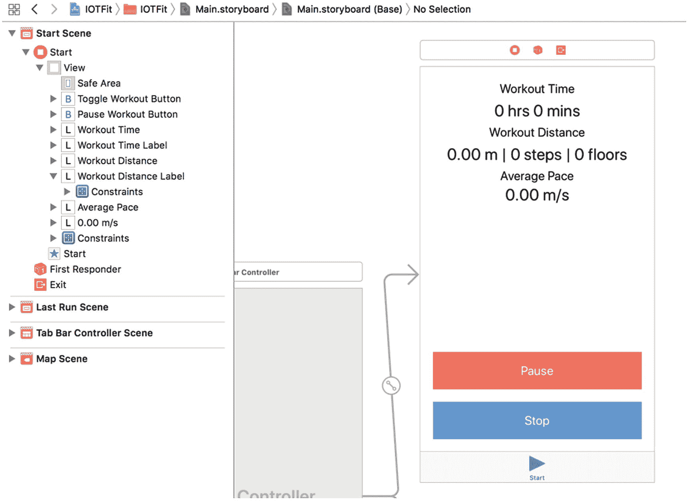
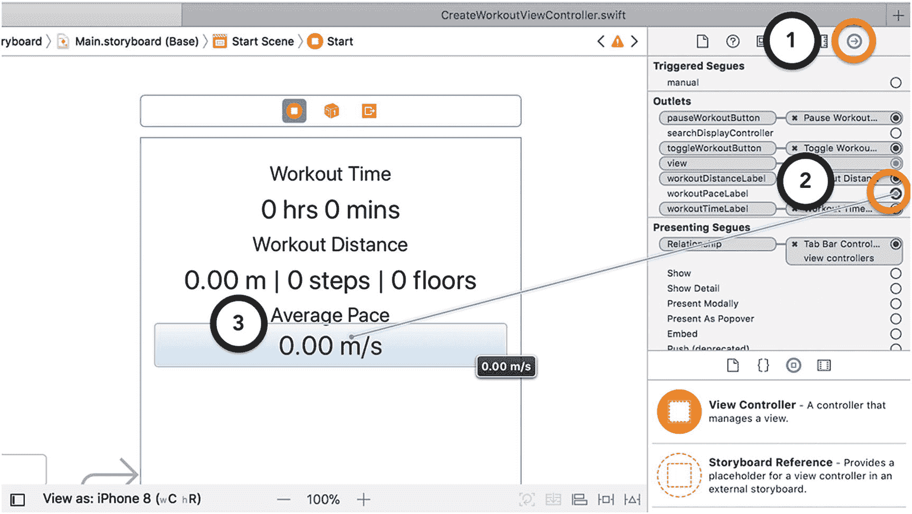
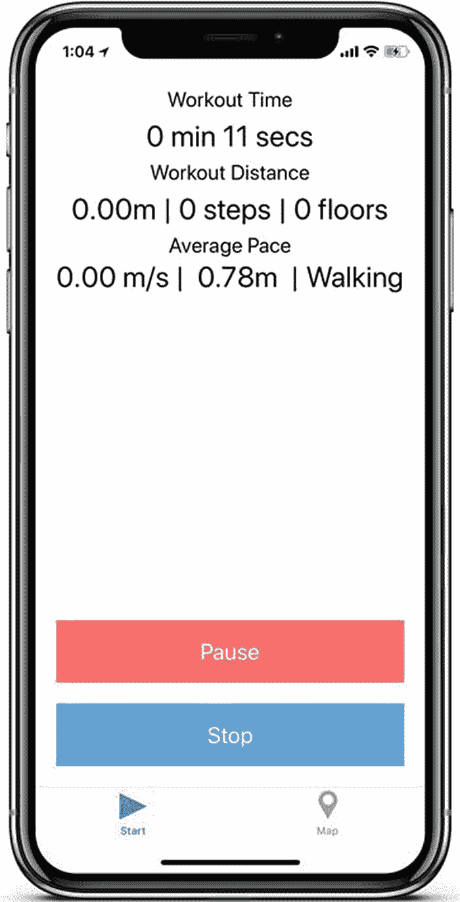

# 排版后的内容

```
class CreateWorkoutViewController: UIViewController {
...
var workoutDistance: Double = 0.0
var averagePace: Double = 0.0
var workoutSteps: Int = 0
var floorsAscended: Int = 0
...
func resetWorkoutData() {
    lastSavedTime = Date()
    workoutDuration = 0.0
    workoutDistance = 0.0
    workoutSteps = 0
    floorsAscended = 0
    averagePace = 0.0
}
...
func startPedometerUpdates() {
    guard let workoutStartTime = workoutStartTime
    else { return }
    pedometer = CMPedometer()
    pedometer?.startUpdates(from: workoutStartTime,
    withHandler: { [weak self] (pedometerData:
    CMPedometerData?, error: Error?) in
        if let error = error {
            NSLog("读取计步器数据出错：
            \(error.localizedDescription)")
            return
        }
        guard let pedometerData = pedometerData,
        let distance = pedometerData.distance
        as? Double,
        let averagePace = pedometerData.averageActivePace
        as? Double,
        let steps = pedometerData.numberOfSteps
        as? Int,
        let floorsAscended = pedometerData.floorsAscended
        as? Int else { return }
        self?.workoutDistance = distance
        self?.workoutSteps = steps
        self?.floorsAscended = floorsAscended
        self?.averagePace = averagePace
    })
}
func requestLocationPermission() {
    if CLLocationManager.locationServicesEnabled(){
    ...
        switch(CLLocationManager.authorizationStatus()){
        ...
        case .authorizedAlways:
            resetWorkoutData()
            startWorkout()
        default:
            presentPermissionErrorAlert()
        }
    } else {
        presentEnableLocationAlert()
    }
}
...
}
extension CreateWorkoutViewController: CLLocationManagerDelegate {
func locationManager(_ manager:
CLLocationManager, didChangeAuthorization status:
CLAuthorizationStatus) {
    switch status {
    ...
    case .authorizedAlways:
        resetWorkoutData()
        startWorkout()
    ...
    }
}
func locationManager(_ manager:
CLLocationManager, didUpdateLocations
locations: [CLLocation]) {
    guard let mostRecentLocation = locations.last
    else { return }
    //禁用旧的位置计算代码
    //if let savedLocation = lastSavedLocation {
    //    let distanceDelta = savedLocation.distance(from:
mostRecentLocation)
    //    workoutDistance += distanceDelta
    //}
    lastSavedLocation = mostRecentLocation
    WorkoutDataManager.sharedManager.addLocation(
    coordinate: mostRecentLocation.coordinate)
    }
}
```

**代码清单 3-3** 为 `CreateWorkoutViewController` 类添加实时计步器更新处理

在 Swift 中使用可选值时的一个挑战是，你总是需要检查该值是否已被初始化。当在另一个可选值内部处理可选值时，你必须同时进行这两项检查。为了解决这个问题，许多开发者像我示例中那样，将解包检查链式组合到单个 `if-let` 或 `guard-let` 语句中。我建议不要使用 `!` 语法强制解包，因为这可能导致应用在运行时崩溃。

## 更新用户界面

现在 IOTFit 应用能检测到更多关于用户锻炼的信息，你必须修改用户界面来展示这些信息。我选择处理这个问题的方式是：缩小“创建锻炼视图控制器”中标签之间的间距，重新利用距离标签，并添加一个额外标签来显示平均配速，如图 3-3 所示。



**图 3-3** 为“创建锻炼视图控制器”修改后的用户界面

在你的 `Main.storyboard` 文件中更新“创建锻炼视图控制器”的布局：添加两个 `UILabel` 对象，并调整自动布局约束以匹配表 3-1 中的值。如果你需要复习如何操作，请参考第 1 章。

**表 3-1** “创建锻炼视图控制器”的新自动布局约束

| 显示文本 | 顶部 | 左侧 | 右侧 | 底部 | 高度 | 文本样式 |
| --- | --- | --- | --- | --- | --- | --- |
| 锻炼时间 | 10 | 20 | 20 | -- | 30 | 标题 3 |
| 0 小时 00 分钟 | 0 | 20 | 20 | -- | 50 | 标题 1 |
| 锻炼距离 | 0 | 20 | 20 | -- | 30 | 标题 3 |
| 0.00 米 &#124; 0 步 &#124; 0 层 | 0 | 20 | 20 | -- | 50 | 标题 1 |
| 锻炼配速 | 0 | 20 | 20 | -- | 30 | 标题 3 |
| 0.00 米 / 秒 | 0 | 20 | 20 | ≥20 | 50 | 标题 1 |

与第 1 章类似，为了在代码中更新“锻炼配速”标签，你需要在 `WorkoutViewController` 类中添加一个 `UILabel` 属性，如代码清单 3-4 所示。

```
class CreateWorkoutViewController: UIViewController {
...
@IBOutlet weak var workoutDistanceLabel: UILabel?
@IBOutlet weak var workoutPaceLabel: UILabel?
...
}
```

**代码清单 3-4** 将“锻炼配速”标签添加到 `CreateWorkoutViewController` 类

接下来，将标签连接到类：切换回 `Main.storyboard` 文件，点击“创建视图控制器”的连接检查器，按住 `workoutPaceLabel` 旁边的单选按钮，并将其拖放至“配速”标签上，如图 3-4 所示。同样，如果在操作过程中遇到问题，请参考第 1 章快速复习该流程。



**图 3-4** 将“锻炼配速”标签连接到“创建锻炼视图控制器”

最后，为了更新标签中的数值，修改 `updateWorkoutData()` 方法，如代码清单 3-5 所示。从 `averagePace`、`workoutDistance` 和 `workoutSteps` 属性中读取数值，并将其包含在标签的文本中。你无需担心为数据更新添加额外的事件。用于更新时间（每秒一次）的定时器事件应为大多数用户提供足够的精度。

```
@objc func updateWorkoutData() {
    let now = Date()
    if let lastTime = lastSavedTime {
        self.workoutDuration +=
        now.timeIntervalSince(lastTime)
    }
    workoutTimeLabel?.text =
    stringFromTime(timeInterval:
    self.workoutDuration)
    workoutDistanceLabel?.text = String(format: "%.2fm | %d 步
    | %d 层", arguments: [workoutDistance, workoutSteps,
    floorsAscended])
    workoutPaceLabel?.text = String(format: "%.2f m /s",
    arguments: [averagePace])
    lastSavedTime = now
}
```

**代码清单 3-5** 将锻炼数据更新添加到 `updateWorkoutData()` 方法


### 停止与暂停计步器更新

对于最后几个与计步器相关的任务，你需要能够停止和暂停计步器更新。要停止计步器更新，只需在 `toggleWorkout()` 方法中，对 `CMPedometer` 对象调用 `stopUpdates()` 方法即可，如代码清单 3-6 所示。

```
@IBAction func toggleWorkout() {
    switch currentWorkoutState {
    case .inactive:
        requestLocationPermission()
    case .active:
        currentWorkoutState = .inactive
        stopWorkoutTimer()
        pedometer?.stopUpdates()
        WorkoutDataManager.sharedManager.saveWorkout(duration: workoutDuration)
    default:
        NSLog("toggleWorkout() called out of context!")
    }
    updateUserInterface()
}
```

*代码清单 3-6 停止计步器更新*

计步器没有可用的暂停方法；不过，你可以通过精心管理用于处理时间更新的变量来实现同样的功能。`startPedometerUpdates()` 方法的原始实现使用 `workoutStartTime` 属性作为所有计步器更新的基准。所有更新将根据原始开始时间与上次更新时间之间的时间段生成数据。在这种行为下，你无法实现准确的暂停。然而，如果你使用 `lastSavedTime`（即你创建的用于管理工作 out 时长标签时间更新的属性），则可以获取到一个查询计步器更新的起始日期值，当用户按下“暂停”和“恢复”按钮时，该日期值会随之更新。在代码清单 3-7 中，我更新了 `startPedometerUpdates()` 方法，使其在计算运动距离时使用 `lastSavedTime` 属性和增量数据更新。

```
func startPedometerUpdates() {
    guard let lastSavedTime = lastSavedTime else { return }
    pedometer = CMPedometer()
    pedometer?.startUpdates(from: lastSavedTime, withHandler: {
        [weak self] (pedometerData: CMPedometerData?, error: Error?) in
        NSLog("Received pedometer update!")
        if let error = error {
            NSLog("Error reading data: \(error.localizedDescription)")
            return
        }
        guard let pedometerData = pedometerData,
              let distance = pedometerData.distance as? Double,
              let averagePace = pedometerData.averageActivePace as? Double,
              let steps = pedometerData.numberOfSteps as? Int,
              let floorsAscended = pedometerData.floorsAscended as? Int else {
            return
        }
        self?.workoutDistance += distance
        self?.floorsAscended += floorsAscended
        self?.workoutSteps += steps
        self?.averagePace = averagePace
    })
}
```

*代码清单 3-7 将暂停功能集成到计步器距离计算中*

### 获取活动类型

正如你之前所学，Core Motion 为你提供了一个非常精确且易于使用的计步器。然而，它能提供的不仅仅只是原始数据。当苹果发布 Apple Watch 时，他们引以为傲的幻灯片之一就是公开了其健身实验室，他们雇佣了大量工程师和研究人员，希望能找到更好的方法来测量和利用 M 系列芯片及 Apple Watch 生成的传感器数据。这项工作的成果之一便是能够确定用户正在参与的活动类型（例如，跑步、步行或骑自行车）。在与接收计步器更新类似的过程中，你可以在类中使用 `CMMotionActivityManager` 的实例来监听活动类型的异步更新。

用于监听 `CMMotionActivityManager` 对象运动更新的方法是 `startActivityUpdates(to:withHandler:)`。它接收两个参数：一个 `OperationQueue` 和一个返回活动类型信息的完成处理程序。在 iOS 编程中，`OperationQueue` 的概念类似于其他高级编程语言中的*线程*。它是一种让一组指令（任务或*操作*）在其自己的执行路径中运行的方式，旨在防止其他指令被阻塞。这些方法常用于长时间运行的任务，例如繁重的 Core Data 数据库操作。开发者会为 Core Data 任务创建一个单独的 `OperationQueue` 对象，并使用协议或完成处理程序来告知程序的另一部分任务已完成运行。

`startActivityUpdates(to:withHandler:)` 方法要求你指定将运动更新传递到哪个 `OperationQueue`。对于 IOTFit 应用，你将主要使用运动数据来更新用户界面，因此应该将更新传递到应用的主 `OperationQueue`。在代码清单 3-8 中，我更新了 `CreateWorkoutViewController` 类，使其包含一个 `CMMotionActivityManager` 属性，并添加了一个 `startActivityUpdates()` 方法，用于在工作 out 开始时监控活动变化。

```
class CreateWorkoutViewController: UIViewController {
    ...
    var pedometer: CMPedometer?
    var motionManager: CMMotionActivityManager?
    ...
    func startWorkout() {
        ...
        if (CMMotionManager().isDeviceMotionAvailable && CMPedometer.isStepCountingAvailable() && CMAltimeter.isRelativeAltitudeAvailable()) {
            isMotionAvailable = true
            startPedometerUpdates()
            startActivityUpdates()
        } else {
            isMotionAvailable = false
        }
    }
    ...
    func startActivityUpdates() {
        motionManager = CMMotionActivityManager()
        motionManager?.startActivityUpdates(to: OperationQueue.main, withHandler: { (activity: CMMotionActivity?) in
            // 收到运动更新
        })
    }
}
```

*代码清单 3-8 启动活动类型更新*


### Note

如果您在 iOS 应用中遇到用户界面无法正确显示项目的问题，请确认您的调用是否发生在主线程（主`OperationQueue`）上。iOS 只允许在主线程上执行用户界面更新。

`CMMotionActivity`响应对象包含一系列`Bool`属性，表示 Core Motion 对当前活动类型的估计，以及一个`confidence`属性，表示估计的准确性（`low`、`medium`、`high`）。对于 IOTFit 应用，您只需在“创建锻炼视图控制器”上显示活动类型，因此只需在响应处理程序中评估响应并保存最佳值。在清单 3-9 中，我更新了`CreateWorkoutViewController`类，使其包含一个`currentActivity`属性，并在`startActivityUpdates()`方法的运动完成处理程序中保存该值。

```
import UIKit
...
struct WorkoutType {
static let automotive = "Driving"
static let running = "Running"
static let bicycling = "Bicycling"
static let stationary = "Stationary"
static let walking = "Walking"
static let unknown = "Unknown"
}
class CreateWorkoutViewController: UIViewController {
...
var currentWorkoutState = WorkoutState.inactive
var currentWorkoutType = WorkoutType.unknown
...
func startActivityUpdates() {
motionManager = CMMotionActivityManager()
motionManager?.startActivityUpdates(to:
OperationQueue.main, withHandler: { [weak self]
(activity: CMMotionActivity?) in
guard let activity = activity else { return }
if activity.walking {
self?.currentWorkoutType = WorkoutType.walking
} else if activity.running {
self?.currentWorkoutType = WorkoutType.running
} else if activity.cycling {
self?.currentWorkoutType =
WorkoutType.bicycling
} else if activity.stationary {
self?.currentWorkoutType =
WorkoutType.stationary
} else {
self?.currentWorkoutType = WorkoutType.unknown
}
})
}
...
}
Listing 3-9
保存更新的活动类型
```

`CMMotionActivity`类设计中的一个不足之处在于，它要求您定义活动的优先级，而不是使用枚举值来表示数据。我在完成处理程序前添加了`[weak self]`。在使用闭包时，通过强引用访问`self`可能会导致对象被保留，从而引起内存泄漏。使用`weak`可以避免这种情况。

要在用户界面上显示该值，只需更新`updateWorkoutData()`方法，使其包含对`currentActivity`属性的检查，如清单 3-10 所示。

```
@objc func updateWorkoutData() {
let now = Date()
var workoutPaceText = String(format: "%.2f m/s", arguments:
[averagePace])
if let lastTime = lastSavedTime {
self.workoutDuration +=
now.timeIntervalSince(lastTime)
}
if currentWorkoutType != WorkoutType.unknown {
workoutPaceText.append(" | \(currentWorkoutType)")
}
...
workoutPaceLabel?.text = workoutPaceText
...
}
Listing 3-10
显示活动类型
```

在此示例中，我修改了配速标签以包含活动类型。如果活动类型未知，则不显示该值。这样做反而会让用户感到困惑，而不是提供帮助。

要停止运动（活动类型）更新，只需更新`toggleWorkout()`方法，让`CMMotionActivityManager`停止监听运动更新，方法与停止计步器更新相同，如清单 3-11 所示。

```
@IBAction func toggleWorkout() {
switch currentWorkoutState {
...
case .active:
currentWorkoutState = .inactive
stopWorkoutTimer()
pedometer?.stopUpdates()
motionManager?.stopActivityUpdates()
...
default:
...
}
updateUserInterface()
}
Listing 3-11
停止运动更新
```

## 处理气压计更新

在进行 Core Motion 的最后一个实验时，您还可以获取用户的海拔高度。最棒的是，它遵循了其他 Core Motion 传感器 API 的设计模式，即：

- 实例化一个管理器对象
- 定义一个完成块来保存最新数据
- 更新用户界面
- 在完成后停止更新

由于您应该已经熟悉这种设计模式，我在清单 3-12 中包含了将气压计数据添加到“创建锻炼视图控制器”的代码。

```
class CreateWorkoutViewController: UIViewController {
...
var workoutAltitude: Double = 0.0
var workoutDistance: Double = 0.0
...
var motionManager: CMMotionActivityManager?
var altimeter: CMAltimeter?
...
@IBAction func toggleWorkout() {
...
switch currentWorkoutState {
...
case .active:
...
motionManager?.stopActivityUpdates()
altimeter?.stopRelativeAltitudeUpdates()
default:
...
}
updateUserInterface()
}
...
@objc func updateWorkoutData() {
let now = Date()
var workoutPaceText = String(format: "%.2f m/s |
%0.2fm ", arguments: [averagePace, workoutAltitude])
...
}
...
func startWorkout() {
currentWorkoutState = .active
...
if (CMMotionManager().isDeviceMotionAvailable
&& CMPedometer.isStepCountingAvailable() &&
CMAltimeter.isRelativeAltitudeAvailable()) {
...
startActivityUpdates()
startAltimeterUpdates()
} else {
isMotionAvailable = false
}
}
...
func startAltimeterUpdates() {
altimeter = CMAltimeter()
altimeter?.startRelativeAltitudeUpdates(to:
OperationQueue.main, withHandler: { [weak self]
(altitudeData: CMAltitudeData?, error: Error?) in
if let error = error {
NSLog("Error reading altimeter data:
\(error.localizedDescription)")
return
}
guard let altitudeData = altitudeData,
let relativeAltitude =
altitudeData.relativeAltitude as? Double
else { return }
self?.workoutAltitude += relativeAltitude
})
}
...
func resetWorkoutData() {
...
workoutDistance = 0.0
workoutAltitude = 0.0
currentWorkoutType = WorkoutType.unknown
}
}
Listing 3-12
将海拔高度追踪添加到创建锻炼视图控制器
```

现在，当您在 iPhone 上运行 IOTFit 应用并稍微走动（或摇晃手机）时，您应该会看到更快、更准确的活动更新，类似于图 3-5 截图中的效果。



图 3-5 IOTFit 应用截图（显示额外的锻炼数据）

## 总结

在本章中，您将基于 GPS 的 IOTFit 应用转变为更准确、功能更丰富且更省电的版本，方法是使用 Core Motion 框架来访问 iPhone 和 Apple Watch 上的 M 系列运动协处理器。您学习了如何为多个传感器设置管理器对象，以及如何使用完成处理程序响应它们的异步更新。经过几个示例后，设置管理器、响应更新和停止请求的过程变得非常明显，成为一种广泛使用的模式，使得气压计集成变得极其简单。

为了可读性，并跟上当前的编程趋势，Apple 在其框架中越来越多地采用基于完成处理程序的工作流程。在需要在一个长时间运行的方法完成后立即执行快速操作的情况下，完成处理程序非常方便。我相信您会在本书以及您自己的项目中多次复用这一知识。


