# 4. 使用 HealthKit 安全地检索和存储健康数据

到目前为止，你已经学会了如何使用 iOS 设备上的运动传感器和 GPS 传感器来构建一个名为 IOTFit 的锻炼应用，该应用能够追踪活动数据（步数、海拔、步频），并在地图上显示用户的锻炼路径。此外，你还学会了如何将这些数据以属性列表（`.plist`）文件的形式存储到应用的 `Documents` 文件夹中。

虽然将数据存储在一个应用中很有用，但通过将数据以其他锻炼应用也能访问的方式进行保存，可以更好地帮助用户。为此，你可以使用 HealthKit 框架。HealthKit 允许你将锻炼数据抽象为 `HKWorkout` 对象，并将其存储在 iPhone 的 HealthKit 存储区中。HealthKit 存储区是内存中的一个加密区域，iOS 健康应用以及经过 HealthKit 授权的第三方应用可以在其中共享用户信息。例如，启用 HealthKit 后，用户可以在 iOS 健康应用中看到他们在 IOTFit 中创建的锻炼记录，并将其作为独立项目查看。他们还可以使用 HealthKit 在 IOTFit 内读取并展示来自其他应用的锻炼数据。

除了安全性之外，HealthKit 最强大的功能之一是其通过 `HKSample` 类所能存储的广泛数据类型。为清晰起见，本章将重点介绍如何将其应用于与锻炼相关的数据，但你完全可以开发应用来管理从心率、紫外线暴露到维生素 C 摄入等各种数据。

## 学习目标

在本章中，通过将 HealthKit 集成到 IOTFit 中，你将学习到物联网应用开发中的以下关键概念：

*   向 iOS HealthKit 存储区请求权限
*   如何将数据保存到 HealthKit
*   如何从 HealthKit 加载数据
*   如何在表格视图控制器中展示数据

这些变更将通过扩展之前开发的 `WorkoutDataManager` 类，并为应用添加一个“历史记录”标签页来实现，该标签页将包含一个展示用户锻炼历史的表格视图，如图 4-1 所示。

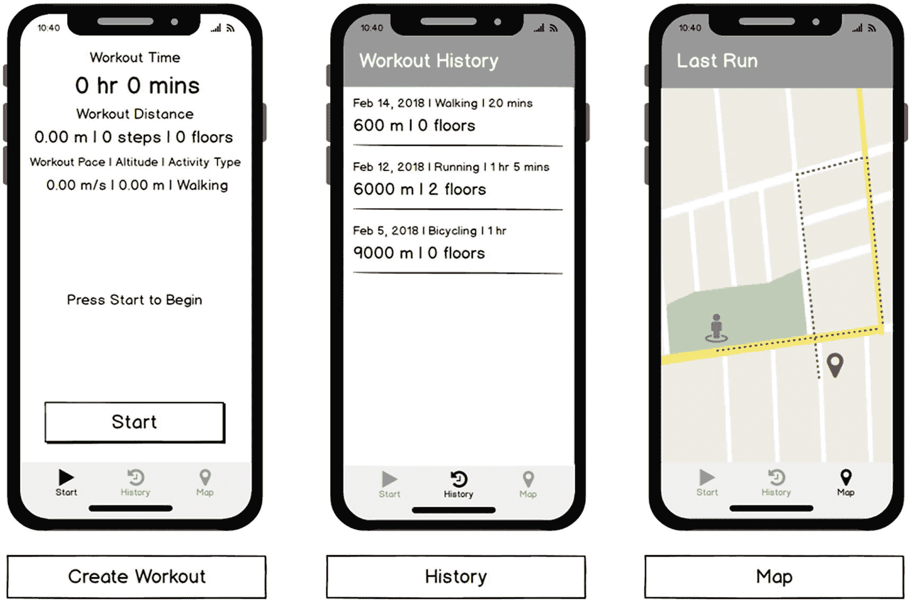

**图 4-1** 修改后的 IOTFit 应用线框图，包含新的“历史记录”标签页

与前几章一样，本项目建立在第三章成果的基础之上。如果你遇到困难或需要参考本项目的完整代码，可以在本书的 GitHub 仓库中找到，位于 `Chapter 4` 文件夹下（ [`github.com/Apress/program-internet-of-things-w-swift-for-ios`](https://github.com/Apress/program-internet-of-things-w-swift-for-ios) ）。

## 请求 HealthKit 权限

鉴于健康数据的敏感性，使用 HealthKit 需要你修改应用以声明其想要使用健康相关功能，并在用户尝试访问这些功能时显示权限提示，这并不令人意外。与 Core Motion 类似，HealthKit 仅在较新的 iPhone、iPod touch 和 Apple Watch 上可用，因此你也需要查询这些功能的可用性。幸运的是，你可以使用在 Core Motion 和 Core Location 中学到的请求权限的相同工作流程，将 HealthKit 添加到你的应用中。

### 注意

与第三章讨论的 Core Motion 功能类似，本章内容旨在 iPhone 或 iPod touch 上运行。截至撰写本书时，Apple 未在 iPad 上开放健康应用或 HealthKit。

首先，复制你在第三章中开发的 IOTFit 应用，或从本书的 GitHub 仓库下载一份副本。接下来，点击项目层级导航器中的 `IOTFit`，选择应用的工程设置。如图 4-2 所示，要声明应用想要使用 HealthKit，请点击 Capabilities 标签页，将 HealthKit 功能添加到应用中。向下滚动找到 HealthKit，点击旁边的开关将其切换为 ON。

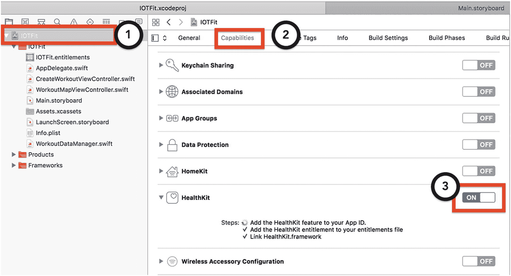

**图 4-2** 在 IOTFit 项目中启用 HealthKit 功能

如果应用未链接到有效的 Apple Developer 帐户（付费或免费帐户均可），启用 HealthKit 功能将会失败，表现为开关恢复为 OFF 状态。如果你记不清如何将项目连接到 Apple Developer 帐户，请回顾第一章。

接下来，与所有基于权限的功能一样，你必须在项目的 Info.plist 文件中添加键值对，以定义系统生成的权限提示中将要显示的消息。如图 4-3 所示，点击 Info 标签页，然后将鼠标悬停在“Privacy – Location When in Use Description”行上，点击出现的 `(+)` 按钮添加新的键。

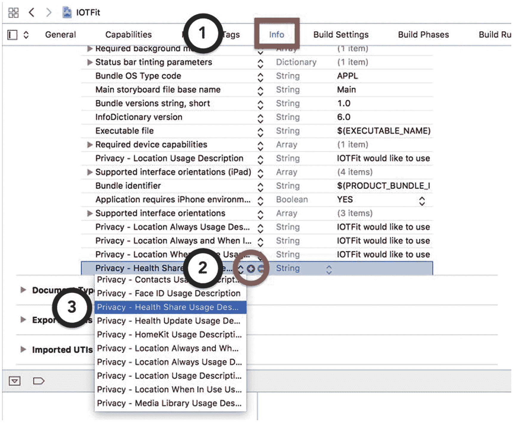

**图 4-3** 向 IOTFit 的信息属性列表中添加新键

要启用从 HealthKit 读取数据，请添加 `Privacy – Health Share Usage Description` 键值对。对于描述字符串，我使用的文本是：“IOTFit 希望使用 HealthKit 权限从健康应用导入锻炼数据到应用的历史记录功能中。此信息不会在线共享或与第三方共享。” 要启用向 HealthKit 保存数据，请添加 `Privacy – Health Update Usage Description` 键值对。对于描述字符串，我使用的文本是：“IOTFit 希望使用 HealthKit 权限将锻炼数据导出到健康应用。此信息不会在线共享或与第三方共享。”

与 Core Location 类似，你应该在首次尝试使用 HealthKit 框架的操作之前，查询其可用性并显示权限提示。从你的应用中访问 HealthKit 的主要类是 `HKHealthStore`。与 Core Motion 的管理器对象类似，你需要实例化该类的实例，并通过该实例调用 HealthKit。与 Core Motion 不同的是，Apple 硬性要求你在应用中只能创建该类的一个实例。为此，将 `HKHealthStore` 对象放在 `WorkoutDataManager` 单例中是最合适的位置。在清单 4-1 中，我修改了 `WorkoutDataManager` 类，添加了一个 `HKHealthStore` 对象作为属性，并在设备支持此功能时对其进行实例化。

```
import Foundation
import CoreLocation
import HealthKit
...
class WorkoutDataManager {
static let sharedManager = WorkoutDataManager()
...
private var healthStore: HKHealthStore?
private init() {
print("单例已初始化")
loadFromPlist()
if HKHealthStore.isHealthDataAvailable() {
healthStore = HKHealthStore.init()
}
}
...
}
```

**清单 4-1** 为 `WorkoutDataManager` 类添加 `HKHealthStore` 属性


对于 IOTFit 应用，你需要与 HealthKit 进行交互的两个关键点是：保存锻炼记录时，以及读取锻炼列表以在“锻炼历史表格视图控制器”上显示它们时。为了让代码更易读，我将通过`WorkoutDataManager`类中的`loadWorkoutsFromHealthKit()`和`saveWorkoutToHealthKit()`方法来执行这些操作。由于你无法预知用户会先执行哪个操作，因此应在两个方法中都请求权限。如果用户已经接受或拒绝了权限请求，则不会显示任何提示，代码将继续执行下一条指令。

HealthKit 用于请求健康权限的方法是`requestAuthorization(toShare:read:completion:)`，它是`HKHealthStore`类的一部分。该方法接受一组你想要读取和写入的健康数据类型作为参数，以及一个完成回调——当用户做出决定（或第二次调用时立即执行）时，该回调会被触发。要使用 HealthKit，你必须指定你想要读取或写入的每一种数据类型。我建议在每次 HealthKit 操作前都调用权限请求的第二个原因是：如果你的类型列表在不同应用版本之间发生变化，iOS 会再次弹出授权提示，请求用户授权新权限。在代码清单 4-2 中，我向`WorkoutDataManager`类添加了`loadWorkoutsFromHealthKit()`和`saveWorkoutToHealthKit()`方法，并在`saveWorkout(duration:)`方法中添加了对`saveWorkoutToHealthKit()`的调用，以触发健康权限弹窗。得益于`healthStore`属性被声明为可选值，如果`init()`方法中的可用性请求失败，权限请求及其后续的 HealthKit 操作将不会执行。

```
class WorkoutDataManager {
...
private var hkDataTypes: Set {
var hkTypesSet = Set()
if let stepCountType =
HKQuantityType.quantityType(forIdentifier:
HKQuantityTypeIdentifier.stepCount) {
hkTypesSet.insert(stepCountType)
}
if let flightsClimbedType =
HKQuantityType.quantityType(forIdentifier:
HKQuantityTypeIdentifier.flightsClimbed) {
hkTypesSet.insert(flightsClimbedType)
}
if let cyclingDistanceType =
HKQuantityType.quantityType(forIdentifier:
HKQuantityTypeIdentifier.distanceCycling) {
hkTypesSet.insert(cyclingDistanceType)
}
if let walkingDistanceType =
HKQuantityType.quantityType(forIdentifier:
HKQuantityTypeIdentifier.distanceWalkingRunning) {
hkTypesSet.insert(walkingDistanceType)
}
hkTypesSet.insert(HKObjectType.workoutType())
return hkTypesSet
}
...
func saveWorkout(duration: TimeInterval) {
...
saveToPlist()
saveWorkoutToHealthKit()
}
func loadWorkoutsFromHealthKit() {
healthStore?.requestAuthorization(toShare: hkDataTypes,
read: hkDataTypes, completion: { (isAuthorized:
Bool, error: Error?) in
//请求已完成，现在可以安全使用 HealthKit 了
})
}
func saveWorkoutToHealthKit() {
healthStore?.requestAuthorization(toShare: hkDataTypes,
read: hkDataTypes, completion: { (isAuthorized:
Bool, error: Error?) in
//请求已完成，现在可以安全使用 HealthKit 了
})
}
}
```

代码清单 4-2：在读取或写入健康数据前请求健康权限

为了减少重复代码，我创建了一个计算属性`hkDataTypes`来表示应用所需的数据类型列表。用于请求权限的类型必须是`HKSampleType`抽象类的实现。顾名思义，它们代表以样本形式保存和测量的数据。你将在下一节中了解更多关于 HealthKit 如何表示数据的信息。样本只是你可以使用的众多类型之一。目前需要记住的最重要的一点是，与健康权限一样，并非所有样本类型都适用于所有 iOS 设备，在尝试使用之前，你必须查询你想要使用的类型。

现在，如果你运行 IOTFit 应用并尝试保存一次锻炼，将会看到健康权限提示，如图 4-4 所示。用户可以在此界面上有选择地允许权限，或全部开启。当他们按下“允许”按钮后，设置将被保存，并且应用中的完成回调将会执行。

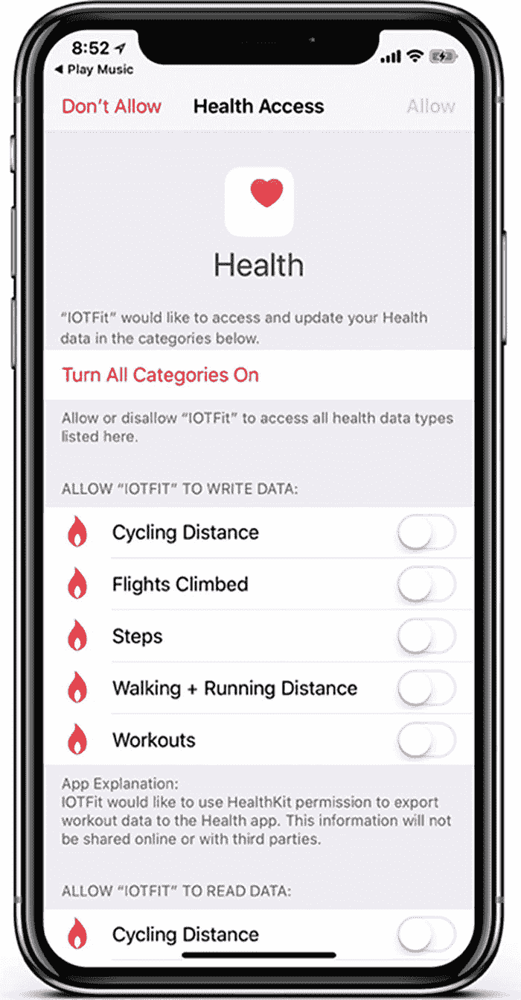

图 4-4：IOTFit 应用的健康权限提示

## 将数据写入 HealthKit

开始使用 HealthKit 最简单的方法就是用它来将锻炼记录保存到 HealthKit 存储中。在前面的章节中，你已经生成了足够的数据来获取用户活动的良好快照，但这些数据需要被序列化（整理）成 HealthKit 可以消费的格式。HealthKit 并非像`String`或`Float`那样以简单数据类型存储，而是采用了一种分层系统，允许你将相关的统计数据分组整理在一起。它还有自己的一套单位系统，你必须学习如何使用，以便使你的数据符合 HealthKit 存储所能识别的格式。在本节中，你将了解此系统的概念基础，以及如何使用它将原始数值转换为健康数据。

### 理解 HealthKit 如何表示数据

iOS 中的 HealthKit 存储将数据分为两大类：*特征数据*和*样本数据*。特征数据是关于用户的定性信息，用特征而非单位来描述，并且不经常变化。例如，用户的血型或肤色。在 HealthKit 中，这些由`HKCharacteristicType`类的实例表示。样本数据是指由用户行为产生的信息，可以用定量单位（例如，米）或数据的定量描述符（例如，步数）或聚合行为（例如，锻炼）来衡量和描述。在 HealthKit 中，这些由`HKSample`类的子类表示。在 IOTFit 应用中，你将主要处理样本数据。

在 HealthKit 术语中，定量样本数据（例如步数或距离）被称为*数量样本*，由`HKQuantitySample`类的对象表示。描述活动特征的样本数据（例如，一次锻炼应被描述为骑行还是跑步）被称为*类别样本*，由`HKCategorySample`对象表示。为了描述聚合活动，HealthKit 定义了两种最终的样本类型：*锻炼*和*关联*。锻炼由`HKWorkout`对象表示，其用途正如其名：旨在表示关于用户执行的一次锻炼的一组数据。关联由`HKCollection`对象表示，虽然其名称的含义有点难以推导，但其用途与锻炼相似：它们专门用于对关于已摄入食物或血压读数的数据进行分组。

HealthKit 中的单位由`HKUnit`对象表示。在存储定量样本时，你必须指定使用哪个`HKUnit`类来表示数据。你可以使用 Apple 为常用单位提供的便捷方法（例如，`HKUnit.meter()`），也可以通过向`HKUnit`类的`init(from:)`便捷初始化方法传递一个`String`来定义你自己的单位。


### 创建和保存 HealthKit 样本

对于 IOTFit 应用及你自己的项目，必须遵循以下步骤将数据保存到 HealthKit：

- 确认设备能够存储你要处理的样本（锻炼、关联数据和数量样本）
- 创建一个聚合样本对象（锻炼或关联数据）
- 创建数量样本
- 将样本保存到锻炼记录中

在列表 4-2 中，你通过检查要处理的数量类型（步数、爬楼层数、锻炼类型、步行距离和骑行距离）完成了验证步骤。现在你对 HealthKit 如何表示数据有了更清晰的认识，可以开始将“创建锻炼视图控制器”中的简单数值数据转换为 HealthKit 可消费的数据。

要保存数据到 HealthKit，第一步是创建一个 `HKWorkout` 对象来表示锻炼记录。`HKWorkout` 类有多个便捷构造函数，但最适合存储 IOTFit 锻炼记录的是 `init(activityType:start:end:duration:totalEnergyBurned:totalDistance:distanceQuantity:device:metadata)`，该构造方法允许你指定锻炼类型（`HKWorkoutType`）、开始和结束日期（`Date` 对象）以及锻炼距离。为了实现这一操作，并最终保存爬楼层数等其他统计数据，你需要修改 `Workout` 结构体以添加新参数，并对调用函数进行重构，使其使用 `Workout` 对象作为参数，而非冗长的参数列表。在列表 4-3 中，我对 `CreateWorkoutViewController` 和 `WorkoutDataManager` 类进行了修改以包含这些变更。

```
class CreateWorkoutViewController: UIViewController {
...
@IBAction func toggleWorkout() {
switch currentWorkoutState {
...
case .active:
currentWorkoutState = .inactive
...
if let workoutStartTime = workoutStartTime {
let workout = Workout(startTime: workoutStartTime,
endTime: Date(), duration: workoutDuration,
locations: [], workoutType:
self.currentWorkoutType, totalSteps:
workoutSteps, flightsClimbed: floorsAscended,
distance: workoutDistance)
WorkoutDataManager.sharedManager.saveWorkout(workout)
}
default:
NSLog("Error")
}
updateUserInterface()
}
}
// 以下代码行位于
// WorkoutDataManager.swift 文件中
struct Workout: Codable {
var startTime: Date
var endTime: Date
var duration: TimeInterval
var locations: [Coordinate]
var workoutType: String
var totalSteps: Double
var flightsClimbed: Double
var distance: Double
}
class WorkoutDataManager {
...
func saveWorkout(_ workout: Workout) {
var activeWorkout = workout
...
saveToPlist()
workouts?.append(activeWorkout)
saveWorkoutToHealthKit(activeWorkout)
}
func saveWorkoutToHealthKit(_ workout: Workout) {
healthStore?.requestAuthorization(toShare:
hkDataTypes, read: hkDataTypes, completion: {
[weak self] (isAuthorized: Bool, error:
Error?) in
...
})
}
}
```
*列表 4-3 修改 `CreateWorkoutViewController` 和 `WorkoutDataManager` 类以包含所有锻炼数据*

现在你已经能访问所有所需数据，可以尝试创建 `HKWorkout` 对象了。在列表 4-4 中，我修改了 `saveWorkoutToHealthKit(...)` 方法，新增了创建 `HKWorkout` 对象的调用。我创建了 `createHKWorkout(workoutType:startDate:endDate)` 方法来帮助将自定义的 `WorkoutType` 结构体转换为 HealthKit 的 `HKWorkoutActivityType` 类别样本类型。在尝试使用该对象之前，请使用 `guard-let` 或 `if-let` 块验证对象是否创建成功。

```
class WorkoutDataManager {
func saveWorkoutToHealthKit(stepCount: Double,
flightsClimbed: Double, distance: Double,
workoutType: String, startDate: Date, endDate:
Date) {
healthStore?.requestAuthorization(toShare:
hkDataTypes, read: hkDataTypes, completion: {
[weak self] (isAuthorized: Bool, error:
Error?) in
if let error = error {
NSLog("Error accessing HealthKit")
} else {
guard let workoutObject =
self?.createHKWorkout(workout)
else { return }
}
})
}
func createHKWorkout(_ workout: Workout) -> HKWorkout? {
let distanceQuantity = HKQuantity(unit: HKUnit.meter(),
doubleValue: workout.distance)
var activityType = HKWorkoutActivityType.walking
switch(workout.workoutType) {
case WorkoutType.running:
activityType = HKWorkoutActivityType.running
case WorkoutType.bicycling:
activityType = HKWorkoutActivityType.cycling
default:
activityType = HKWorkoutActivityType.walking
}
return HKWorkout(activityType: activityType, start:
workout.startTime, end: workout.endTime, duration:
workout.duration, totalEnergyBurned: nil,
totalDistance: distanceQuantity , device: nil,
metadata: nil)
}
}
```
*列表 4-4 创建 `HKWorkout` 对象*

使用 HealthKit 的缺点之一是其配置步骤非常严格。创建锻炼记录后，唯一能将样本附加到锻炼记录的方法就是先将它保存到 HealthKit 存储区。如果操作成功，你就可以开始向该锻炼记录添加样本。在列表 4-5 中，我修改了 `saveWorkoutToHealthKit(...)` 方法，先保存锻炼记录，然后调用一个用于添加样本的函数。

```
class WorkoutDataManager {
...
func saveWorkoutToHealthKit(_ workout: Workout) {
healthStore?.requestAuthorization(toShare:
hkDataTypes, read: hkDataTypes, completion: {
[weak self] (isAuthorized: Bool,error:Error?)
in
if let error = error {
NSLog("Error accessing HealthKit")
} else {
guard let workoutObject =
self?.createHKWorkout(workout)
else { return }
self?.healthStore?.save(workoutObject,
withCompletion: { (completed: Bool,
error: Error?) in
if let error = error {
NSLog("Error creating workout")
} else {
self?.addSamples(hkWorkout:
workoutObject, workoutData:
workout)
}
})
}
})
}
...
func addSamples(hkWorkout: HKWorkout, workoutData: Workout){
var samples = [HKSample]()
addStepCountSample(workoutData, objectArray: &samples)
addFlightsClimbedSample(workoutData, objectArray:
&samples)
addDistanceSample(workoutData, activityType:
hkWorkout.workoutActivityType, objectArray: &samples)
self.healthStore?.add(samples, to:hkWorkout, completion:{
(saveCompleted: Bool, saveError: Error?) in
if let saveError = saveError {
NSLog("Error adding workout samples")
} else {
NSLog("Workout samples added successfully!")
}
})
}
}
```
*列表 4-5 准备向锻炼记录添加样本*

如 `addSamples(...)` 方法所示，要向锻炼记录添加样本，你需要构建一系列 `HKSample` 对象，并使用之前创建的锻炼对象，在 iOS 健康存储区上调用 `add(to:completion:)` 方法。`HKSample` 对象的设置代码可能很长，因此我创建了单独的方法来生成每个样本并将其追加到数组中。

回顾之前关于 HealthKit 样本类型的讨论，要存储锻炼的定量数据，你应该使用 `HKQuantitySample` 类。在比较便捷初始化方法后，最合适的应该是 `init(type: quantity: start: end:)`。至此，脚手架代码开始变得冗长。要使用数量参数，你必须生成一个 `HKQuantity` 对象，并指定一个 `HKQuantityType` 对象来表示数量类型。同样，你还需要指定单位类型。在列表 4-6 中，我实现了 `addStepCountSample(...)` 和 `addFlightsClimbedSample(...)` 方法，这两个方法包含了上述所有步骤。


```
class WorkoutDataManager {
...
func addStepCountSample(_ workoutData: Workout,
objectArray: inout [HKSample]) {
guard let stepQuantityType =
HKQuantityType.quantityType(forIdentifier:
HKQuantityTypeIdentifier.stepCount)
else { return }
let stepUnit = HKUnit.count()
let stepQuantity = HKQuantity(unit: stepUnit,
doubleValue: workoutData.totalSteps)
let stepSample = HKQuantitySample(type:
stepQuantityType, quantity: stepQuantity, start:
workoutData.startTime, end: workoutData.endTime)
objectArray.append(stepSample)
}
func addFlightsClimbedSample(_ workoutData: Workout,
objectArray: inout [HKSample]) {
guard let flightQuantityType =
HKQuantityType.quantityType(forIdentifier:
HKQuantityTypeIdentifier.flightsClimbed)
else { return }
let flightUnit = HKUnit.count()
let flightQuantity = HKQuantity(unit: flightUnit,
doubleValue: workoutData.flightsClimbed)
let flightSample = HKQuantitySample(type:
flightQuantityType, quantity: flightQuantity,
start: workoutData.startTime, end:
workoutData.endTime)
objectArray.append(flightSample)
}
}
```
**代码清单 4-6** 创建“步数”和“爬楼层数”样本对象

在这些方法中，最突出的两行是方法签名和数量类型的查找。`inout` 关键字指定某个参数应通过*引用传递*。对于 C/C++ 程序员来说，这个术语应该非常熟悉。引用传递是一种从方法内部修改参数内容的方式，而不是对数据的副本进行操作。调用方法时，在要被修改的变量名前加上 `&` 符号即可实现*按引用传递*。Apple 在传递 `Error` 对象的方法中经常使用这种模式。

在查找数量类型的那一行中，再次需要在使用前检查结果是否有效。如前所述，某些样本类型并非在所有 iOS 设备或 iOS 版本上可用。谨慎总比后悔好！

最后需要添加的数量类型是锻炼距离。这种数量类型的一个特殊之处在于，Apple 将步行/跑步距离和骑行距离视为两种不同的数量类型。为了消除这一限制，在代码清单 4-7 中，我实现了 `addWorkoutDistance(...)` 方法，通过锻炼类型来指定数量类型。

```
class WorkoutDataManager {
...
func addDistanceSample(_ workoutData: Workout,
activityType: HKWorkoutActivityType, objectArray: inout
[HKSample]) {
guard let cyclingDistanceType =
HKQuantityType.quantityType(forIdentifier:
HKQuantityTypeIdentifier.distanceCycling),
let walkingDistanceType =
HKQuantityType.quantityType(forIdentifier:
HKQuantityTypeIdentifier.distanceWalkingRunning)
else { return }
let distanceUnit = HKUnit.meter()
let distanceQuantity = HKQuantity(unit: distanceUnit,
doubleValue: workoutData.distance)
let distanceQuantityType = activityType ==
HKWorkoutActivityType.cycling ? cyclingDistanceType:
walkingDistanceType
let distanceSample = HKQuantitySample(type:
distanceQuantityType, quantity: distanceQuantity,
start: workoutData.startTime, end:
workoutData.endTime)
objectArray.append(distanceSample)
}
}
```
**代码清单 4-7** 添加“锻炼距离”样本对象

信不信由你，至此已经完成了将数据保存到 HealthKit 所需的所有步骤！现在，如果你在“创建锻炼”视图控制器中完成一项锻炼，它就会创建一个新的锻炼记录，你可以在 iOS 健康应用中查看，如图 4-5 所示。要在健康应用中查看锻炼记录，请点击“数据来源”标签，然后依次点击 IOTFit、数据，最后点击“锻炼”。

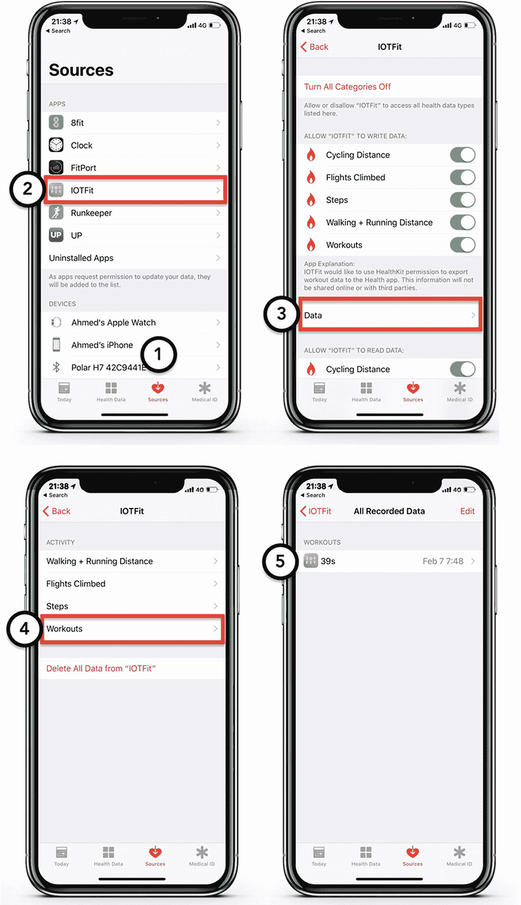

**图 4-5** 在 iOS 健康应用中查看已保存的锻炼记录

## 从 HealthKit 读取锻炼数据

既然你已经了解了 HealthKit 如何表示数据，以及将简单数据类型转换为 HealthKit 样本数据所需的步骤，你就可以利用这些知识从 iOS HealthKit 存储中读取数据了。在 IOTFit 应用中，你将使用此功能来获取用户的锻炼历史。与写入数据类似，从 HealthKit 存储读取数据时使用的主要数据类型是 `HKSample`。

要获取数据，必须使用 `HKSampleQuery` 类在 HealthKit 存储上执行*查询*。与创建 `HKSample` 对象一样，有多个便捷初始化器可供使用，但对于 IOTFit 应用，`HKSampleQuery(sampleType:predicate:limit:, sortDescriptors:resultsHandler)` 是一个合适的选择。这里有很多内容需要理解，但重要的概念是必须指定要获取的样本类型、用于过滤搜索结果的*谓词*以及用于处理结果的完成处理程序。在代码清单 4-8 中，我更新了 `loadWorkoutsFromHealthKit()` 方法，使其包含一个针对锻炼记录的查询，结果按日期降序排列（最新的在前），并限制为前一周内最新的十条记录。

```
func loadWorkoutsFromHealthKit(completion: @escaping
(([Workout]?) -> Void)) {
healthStore?.requestAuthorization(toShare:
hkDataTypes, read: hkDataTypes, completion: {
[weak self] (isAuthorized: Bool, error :
Error?) in
if let error = error {
NSLog("Error accessing HealthKit")
} else {
let workoutType = HKCategoryType.workoutType()
let weekAgo = Date(timeIntervalSinceNow:
-3600 * 24 * 7)
let predicate = HKQuery.predicateForSamples(withStart:
weekAgo, end: Date(), options: [])
let sortDescriptor = NSSortDescriptor(key: "startDate",
ascending: false)
let query = HKSampleQuery(sampleType: workoutType,
predicate: predicate, limit: 10, sortDescriptors:
[sortDescriptor], resultsHandler: { (query:
HKSampleQuery, samples: [HKSample]?, error:
Error?) in
if let error = error {
NSLog("Error fetching items from HealthKit ")
completion(nil)
} else {
let workouts = [Workout]()
completion(workouts)
}
})
self?.healthStore?.execute(query)
}
})
}
```
**代码清单 4-8** 设置 HealthKit 样本查询

除非用户禁用了定位和计步功能，否则 iOS 始终在收集用户的健康数据。为避免查询耗时过长，我建议使用基于日期的谓词或（页面）限制来约束查询结果。你始终可以通过用户界面让用户查看更多搜索结果。另一个需要记住的重要点是，声明查询后，必须调用 `HKHealthStore` 对象的 `execute()` 方法，查询才会开始执行。

接下来，要在应用中使用样本查询的结果，你必须将 `HKSample` 数组转换为整个项目中一直使用的自定义 `Workout` 结构体。在代码清单 4-9 中，我进一步扩展了 `loadWorkoutsFromHealthKit(completion:)` 方法，以执行转换逻辑。


```swift
func loadWorkoutsFromHealthKit(completion: @escaping (([Workout]?) -> Void)) {
    healthStore?.requestAuthorization(toShare: hkDataTypes, read: hkDataTypes, completion: {
        [weak self] (isAuthorized: Bool, error: Error?) in
        if let error = error {
            NSLog("访问 HealthKit 时出错")
        } else {
            let query = HKSampleQuery(sampleType: workoutType, predicate: predicate, limit: 10, sortDescriptors: [sortDescriptor], resultsHandler: { (query: HKSampleQuery, samples: [HKSample]?, error: Error?) in
                if let error = error {
                    NSLog("获取项目时出错")
                    completion(nil)
                } else {
                    guard let hkWorkouts = samples as? [HKWorkout] else {
                        completion(nil)
                        return
                    }
                    let workouts = hkWorkouts.map({ (hkWorkout: HKWorkout) -> Workout in
                        let totalDistance = hkWorkout.totalDistance?.doubleValue(for: HKUnit.meter()) ?? 0
                        let flightsClimbed = hkWorkout.totalFlightsClimbed?.doubleValue(for: HKUnit.count()) ?? 0
                        var workoutType = WorkoutType.walking
                        switch(hkWorkout.workoutActivityType) {
                        case .running:
                            workoutType = WorkoutType.running
                        case .cycling:
                            workoutType = WorkoutType.bicycling
                        default:
                            workoutType = WorkoutType.walking
                        }
                        return Workout(startTime: hkWorkout.startDate, endTime: hkWorkout.endDate, duration: hkWorkout.duration, locations: [], workoutType: workoutType, totalSteps: 0, flightsClimbed: flightsClimbed, distance: totalDistance)
                    })
                    completion(workouts)
                }
            })
            self?.healthStore?.execute(query)
        }
    })
}
```
代码清单 4-9
将 HealthKit 样本对象转换为简单数据类型

在这个函数中，我需要解决的第一个挑战是确保样本是一个`HKWorkout`对象。为了创建通用的完成处理程序，Apple 必须使用足够通用的类型来处理所有样本数据。但对于 IOTFit 而言，我需要处理的类型是`HKWorkout`。接下来，我需要从`HKSample`对象中提取简单数据类型。为了进行类型转换，我使用了`doubleValue(for:)`方法并指定了要转换的单位。如果操作失败，则返回`0`作为默认值。最后一个挑战是将`HKWorkoutType`属性转换为`String`，以便构建`Workout`对象。不过，这一点通过`switch()`语句轻松解决了。

## 使用表格视图控制器显示数据

本章的最后一步是显示锻炼历史记录。对于许多基于数据的应用程序来说，表格视图控制器是让用户与数据交互的绝佳选择。它开箱即用地提供了可滚动的用户界面、以统一方式（单元格）显示结果的简便方法，以及可通过 Interface Builder 轻松自定义的组件。然而，难点在于`UITableViewController`类的设置代码非常依赖协议，对于 iOS 新手开发者来说可能有些令人生畏。在学习如何以表格形式显示 IOTFit 的锻炼结果时，你将掌握使用`UITableViewController`类的三项基本技能，这些技能可应用于其他应用程序：从 Interface Builder 添加表格视图控制器、设置`UITableViewDataSource`代理方法以填充表格，以及设置`UITableViewDelegate`代理方法以在每个单元格中显示锻炼内容。

首先，使用 Xcode 的模板功能创建一个新的`UITableViewController`子类。与第 1 章和第 2 章的示例类似，进入“文件”菜单，选择“新建”➤“文件”，然后从模板选择器中选取“Cocoa Touch Class”，如图 4-6 所示。

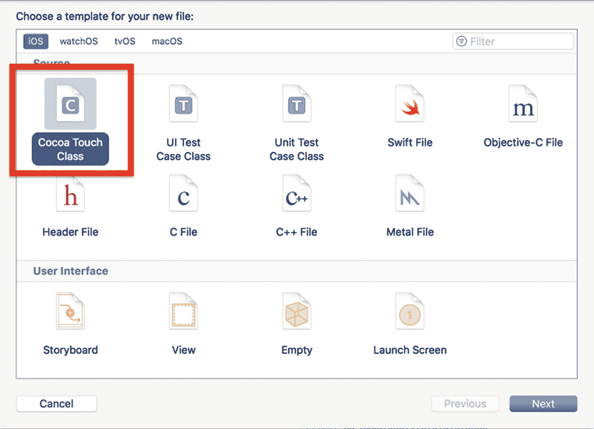

图 4-6
创建新的 Cocoa Touch 类

接下来，系统会要求你为新类命名并选择基类。如图 4-7 所示，将新文件命名为`WorkoutTableViewController`，并选择`UITableViewController`作为基类。

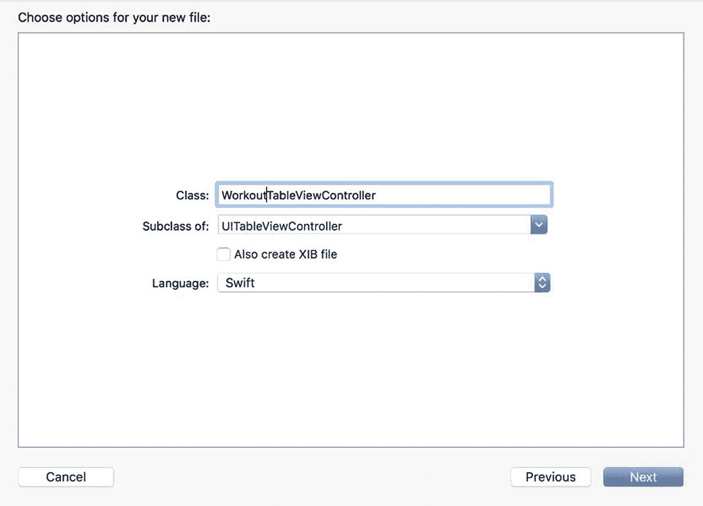

图 4-7
基于模板创建新的`UITableViewController`类

新的`WorkoutTableViewController`类应类似于代码清单 4-10，其中 Apple 的模板提供了实现`UITableViewDelegate`和`UITableViewDataSource`协议所需的`required`方法的存根。

```
import UIKit
class WorkoutTableViewController: UITableViewController {
    override func viewDidLoad() {
        super.viewDidLoad()
    }
    // MARK: - 表格视图数据源
    override func numberOfSections(in tableView: UITableView) -> Int {
        return 0
    }
    override func tableView(_ tableView: UITableView, numberOfRowsInSection section: Int) -> Int {
        return 0
    }
    override func tableView(_ tableView: UITableView, cellForRowAt indexPath: IndexPath) -> UITableViewCell {
        let cell = tableView.dequeueReusableCell(withIdentifier: "Identifier", for: indexPath)
        return cell
    }
}
```
代码清单 4-10
空的 WorkoutTableViewController 类


### 设置用户界面

首先，从项目导航器中选择 `Main.storyboard` 文件，在 Xcode 的编辑器（中央）窗格中打开 Interface Builder。如图 4-8 所示，从对象库中拖拽一个**表格视图控制器**对象到故事板中。

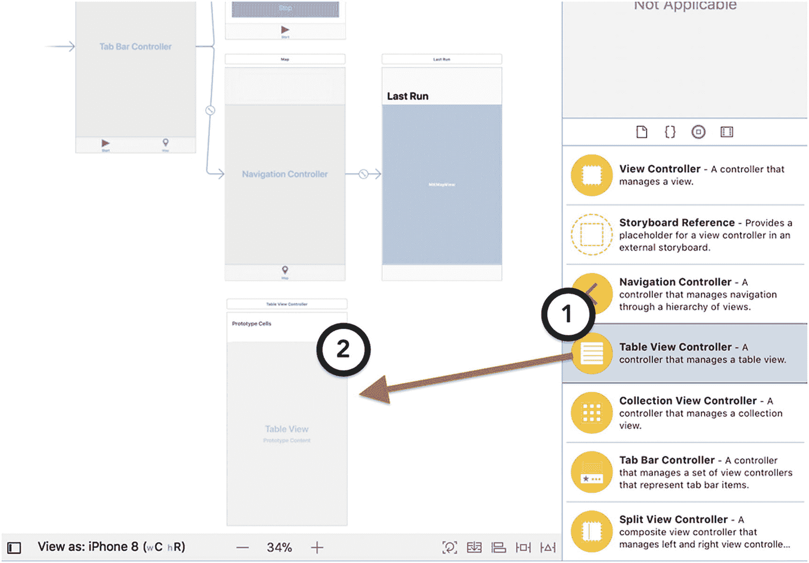

图 4-8 — 向故事板添加表格视图控制器

要将表格视图控制器连接到标签视图控制器，请按住键盘上的 Control 键，并拖拽一条连线到标签视图控制器。从上下文菜单中，选择 **View Controllers** 作为关系类型，如图 4-9 所示。

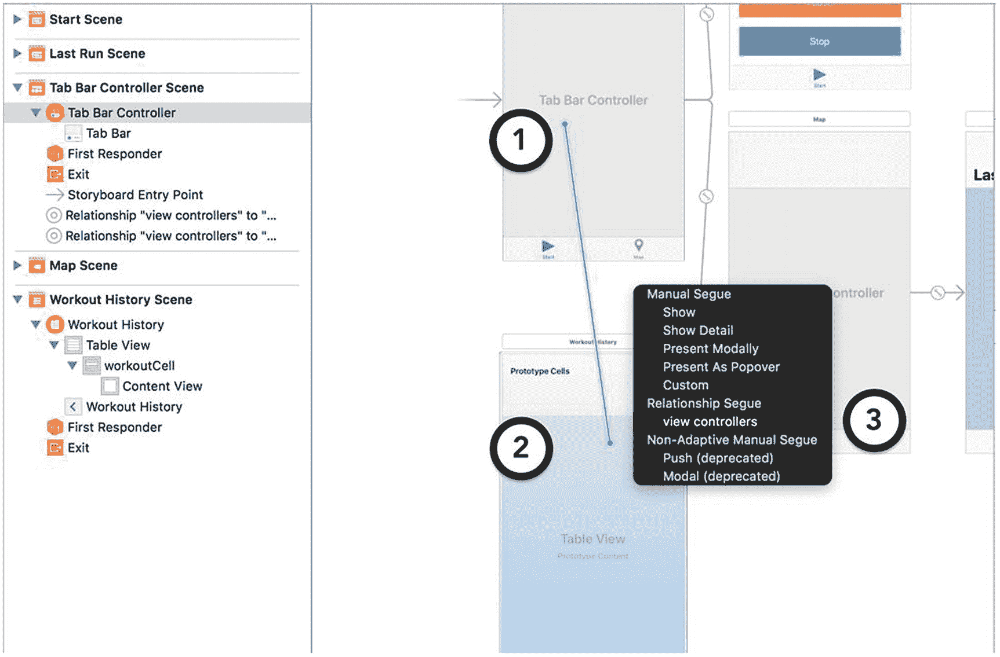

图 4-9 — 向标签视图控制器添加新项目

要更改标签栏上的图标，请点击表格视图控制器下方的标签栏，然后在属性检查器中，从 **System Item** 行中选择 **History**，如图 4-10 所示。

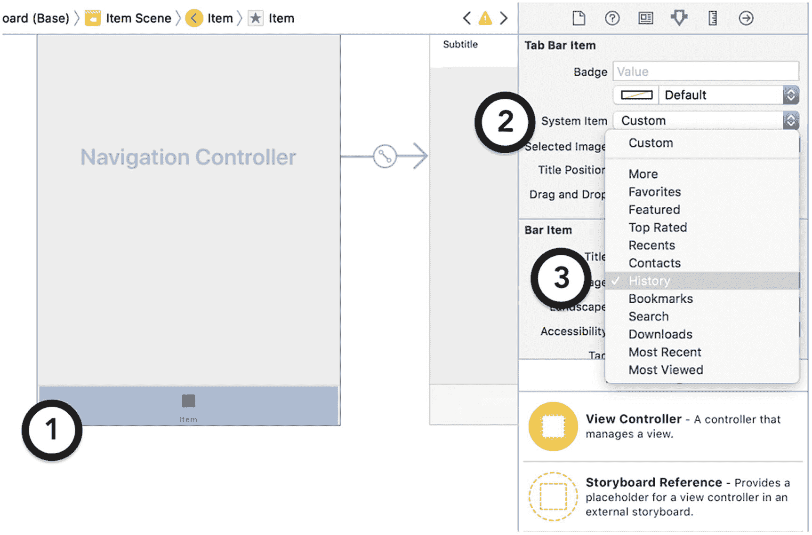

图 4-10 — 更改标签栏项目的图标

为了使单元格与图 4-1 中包含两行文本的线框相匹配，请点击该单元格，然后在属性检查器中将样式设置为 **Subtitle**，如图 4-11 所示。

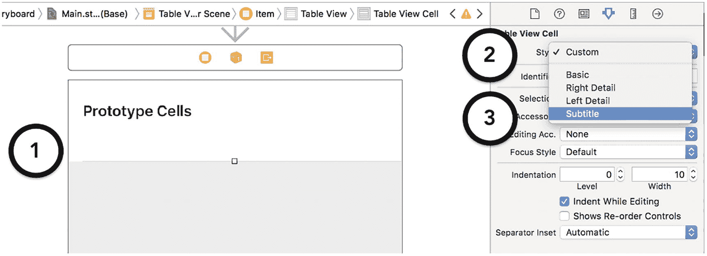

图 4-11 — 更改表格视图单元格的样式

作为最后的布局任务，你必须将表格视图控制器嵌入到一个导航控制器中。这将有助于应用在锻炼历史记录和地图屏幕之间保持一致。要执行此操作，请点击选择该视图控制器，然后从 **Editor** 菜单中选择 **Embed In** ➤ **Navigation Controller**。要编辑锻炼表格视图控制器的导航项目标题，请双击屏幕上方的导航栏，然后在出现的文本字段中开始输入。要使文本变大，请为导航控制器启用 **Prefers Large Titles** 选项。当所有这些操作完成后，你的锻炼表格视图控制器应类似于图 4-12 中的截图。

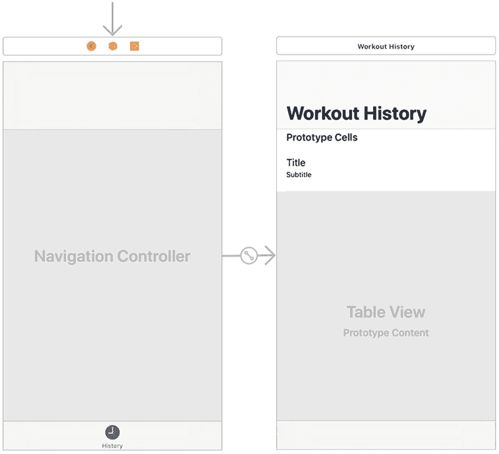

图 4-12 — 锻炼表格视图控制器的完成版故事板

现在布局已完成，你必须修改锻炼表格视图控制器的所属关系和输出口，使其能够与 `WorkoutTableViewController.swift` 文件进行交互。点击表格视图控制器，然后导航到身份检查器，在 **Class** 文本字段中输入 `WorkoutTableViewController` 来设置文件的所属关系，如图 4-13 所示。

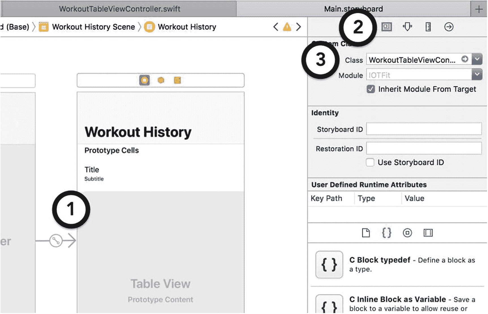

图 4-13 — 为表格视图控制器设置所属关系

### 注意
只有当你在项目中定义了一个基于你正在尝试使用的对象库模板（例如，表格视图控制器、按钮）的子类时，设置所属关系才有效。

在第 1 章和第 2 章中，你使用了输出口来将按钮处理程序连接到对象所属类中的方法。对于表格视图控制器，你必须执行类似的操作来标识 `UITableViewDataSource` 和 `UITableViewDelegate` 委托对象。如图 4-14 所示，点击连接检查器，然后从 `dataSource` 和 `delegate` 输出口拖拽连线到锻炼表格视图控制器。

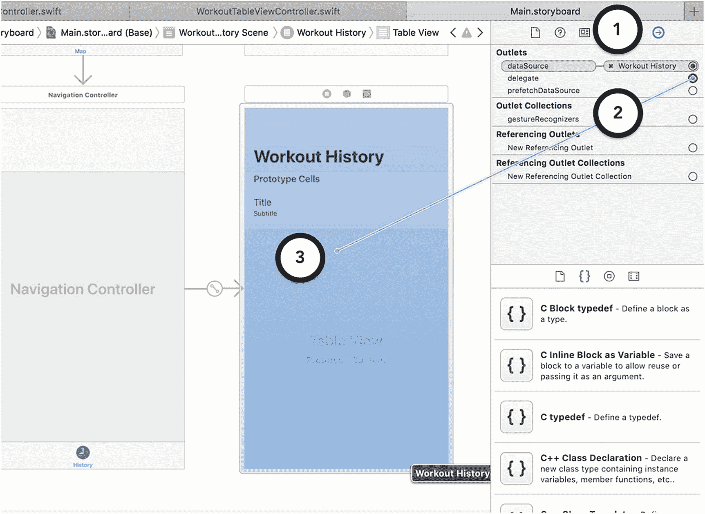

图 4-14 — 为表格视图控制器设置委托输出口

作为最后的连接步骤，你必须在锻炼表格视图控制器中为单元格模板设置一个标识符。基于此标识符，你可以在运行时查找单元格并修改其内容。如图 4-15 所示，选择该单元格，然后导航到属性检查器，在 **Identifier** 文本字段中输入一个标题来设置该单元格的标识符。

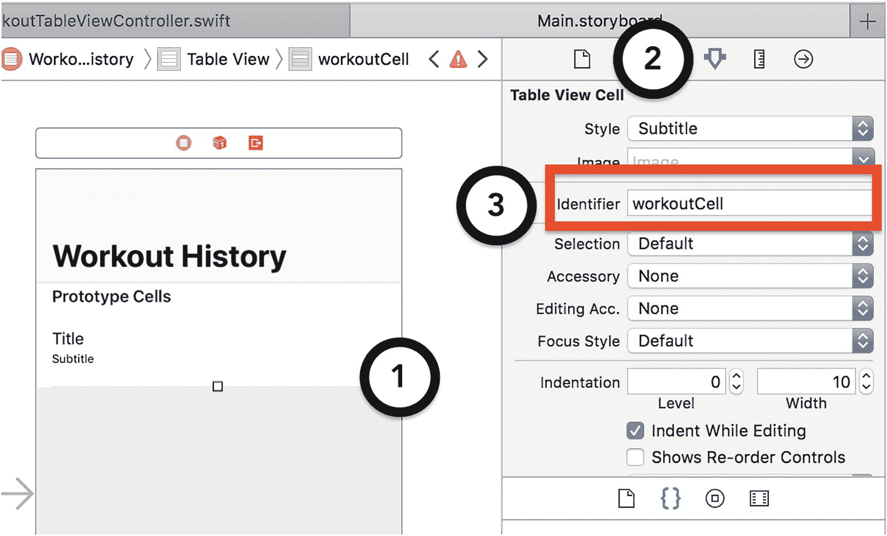

图 4-15 — 为表格视图单元格设置标识符

#### 使用 `UITableViewDataSource` 协议填充表格视图

现在锻炼表格视图控制器已完全布局，你必须实现 `UITableViewDataSource` 协议的方法来填充表格视图。这些方法让你指定表格视图的行数、分区数、标题和编辑特性，例如是否希望用户能够重新排列表格中的单元格。对于 IOTFit 应用，你需要实现的方法集中在表格视图的分区数和行数上。大多数开发者用来实现此行为的模式是定义一个单一或多维数组来表示数据，并从中提取数据的层次结构。在代码清单 4-11 中，我向 `WorkoutTableViewController` 类添加了 `workouts` 属性来保存锻炼数据，并使用该属性来确定 `numberOfSections()` 和 `tableView(numberOfRowsInSection:)` 委托方法的值。Apple 的表格视图控制器模板为这些方法提供了空的实现（存根）。

```
class WorkoutTableViewController: UITableViewController {
    var workouts: [Workout]?

    override func numberOfSections(in tableView: UITableView) -> Int {
        return 1
    }

    override func tableView(_ tableView: UITableView, numberOfRowsInSection section: Int) -> Int {
        return self.workouts?.count ?? 0
    }
    ...
}
```

代码清单 4-11 — 使用数组确定表格视图控制器中的行和分区

尽管你在代码清单 4-11 中指定了表格视图控制器的行数和分区数，但 `workouts` 属性在填充之前将为空。为此，你可以综合运用本章至今学到的所有知识，使用来自 Workout Data Manager 的 `loadWorkoutsFromHealthKit()` 方法来填充 `workouts` 数组。在代码清单 4-12 中，我修改了 `WorkoutTableViewController` 类，覆盖了 `viewWillAppear()` 方法，并在其中调用方法加载数据。每当表格视图即将呈现时（例如从应用中的另一个标签切换过来），`viewWillAppear()` 方法就会被调用，是检查更新的合适位置。

```
class WorkoutTableViewController: UITableViewController {
    ...
    override func viewWillAppear(_ animated: Bool) {
        super.viewWillAppear(animated)

        WorkoutDataManager.sharedManager.loadWorkoutsFromHealthKit { [weak self] (fetchedWorkouts: [Workout]?) in
            if let fetchedWorkouts = fetchedWorkouts {
                self?.workouts = fetchedWorkouts
                DispatchQueue.main.async {
                    self?.tableView?.reloadData()
                }
            }
        }
    }
    ...
}
```

代码清单 4-12 — 触发表格视图控制器的更新

在完成处理程序中，我调用了该类 `tableView` 属性上的 `reloadData()` 方法，以强制其重新加载数据。尽管数组已填充，但除非你明确要求，否则表格视图不会重新加载数据。


#### 使用 `UITableViewDelegate` 协议将数据映射到单元格

为了在“Workout Table View Controller”上显示 `workouts` 数组中的数据，你必须实现 `UITableViewDelegate` 协议。该协议负责表格视图的显示和一般用户交互属性，例如每个单元格的高度、填充单元格内容的方法分配，以及用户选择单元格时应执行的操作。与 `UITableViewDataSource` 协议类似，对于 IOTFit 应用，你无需实现该协议提供的所有方法。为了填充 IOTFit 应用中的单元格，你将实现 `tableView(cellForRow:)` 方法。这允许在运行时使用分区和行号来确定单元格的显示。此外，每次重新加载表格视图时，都会为每个单元格调用此方法。

使用数组管理 Table View Controller 的数据的优势在于，它使数据映射变得极其简单。你可以简单地将行号与数组中的位置相关联。在代码清单 4-13 中，我使用此逻辑实现了 `WorkoutTableViewController` 类的 `tableView(cellForRow:)` 方法。我使用 `workoutCell` 标识符查找单元格模板，然后根据每个 `Workout` 项目中的值创建格式化字符串。

```swift
class WorkoutTableViewController: UITableViewController {
...
let dateFormatter = DateFormatter()
...
override func tableView(_ tableView: UITableView,
cellForRowAt indexPath: IndexPath) ->
UITableViewCell {
let cell = tableView.dequeueReusableCell(withIdentifier:
"workoutCell", for: indexPath)
guard let workouts = workouts else {
return cell
}
let selectedWorkout = workouts[indexPath.row]
let dateString = dateFormatter.string(from:
selectedWorkout.startTime)
let durationString =
WorkoutDataManager.stringFromTime(timeInterval:
selectedWorkout.duration)
let titleText = "\(dateString) |
\(selectedWorkout.workoutType) | \(durationString)"
let detailText = String(format: "%.0f m | %.0f floors",
arguments: [selectedWorkout.distance,
selectedWorkout.flightsClimbed])
cell.textLabel?.text = titleText
cell.detailTextLabel?.text = detailText
return cell
}
}
```
*代码清单 4-13：用数据填充表格视图单元格*

现在，如果你重新编译应用并保存更多锻炼记录，当进入“历史”标签页时，表格视图将显示用户 HealthKit 存储中最近十次锻炼的开始时间、距离、总步数和楼层数，类似于图 4-16 中的截图。

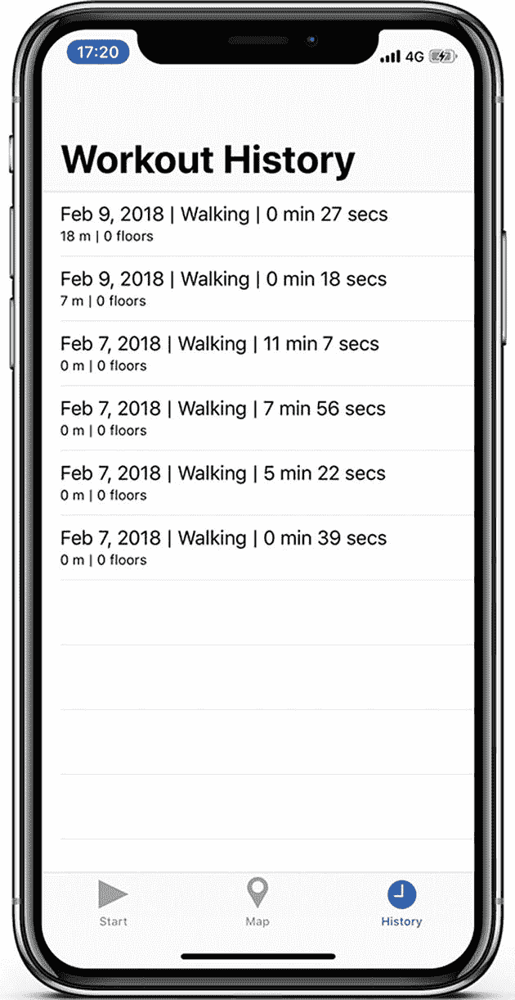

*图 4-16：IOTFit 应用已完成的“历史”标签页*

## 总结

在本章中，通过扩展 Workout Data Manager 并添加用于显示锻炼历史的 Table View Controller，你学习了如何利用 HealthKit 的强大功能，在 IOTFit 应用中安全地导入和导出健康数据。在应用的最初版本中，你必须依赖属性列表文件进行数据管理，并且无法将数据导出到应用之外。在应用了访问基于权限的硬件资源的熟悉经验，并学习了 HealthKit 如何表示数据之后，你能够帮助用户在一个地方管理所有锻炼记录，并查看他们可能使用的其他应用中的锻炼数据。

尽管 HealthKit 在数据表示方面很独特，但你在本章中练习的基于协议和完成处理程序的通信方法，在 Apple 的物联网相关框架中经常被应用。此外，只需稍作修改，本章中的大部分代码都可以复用于本书后面部分的 Apple Watch 版本应用中，就像你从前一章的 Core Motion 代码中复用它一样。

---

