# 5. 构建基于 Arduino 的外围设备

促成你今天所知的物联网（IoT）发展的最大力量之一，是过去只有大公司才能使用的低成本、高质量电子元件和通信标准的普及。以前，如果你想学习如何编程微处理器，你必须购买一台高性能计算机、芯片编程器、空白芯片以及来自芯片制造商的昂贵软件许可证。今天，只需一块 30 美元的 Arduino、Raspberry Pi 或 BeagleBone 微控制器板，你就可以编程所有你想要的硬件项目，并且你可以购买到各种内置两针或三针连接、价格低于 10 美元的传感器。

类似地，蓝牙过去是一种只能通过使用功能有限的专用硬件芯片并自行编程协议接口才能使用的技术。如今，蓝牙芯片内置在大多数联网设备中，并且可以通过许多协议的开源实现来使用。作为 iOS 的一部分，Apple 提供了 Core Bluetooth 框架，允许你开发与蓝牙配件通信的应用，或让 iPhone 充当蓝牙配件。

正如 Apple II 为那些无法自行组装计算机的人打开了个人计算机和编程的大门一样，这些低成本的编程环境正在为新一代的学生、爱好者以及初创公司打开硬件开发的大门。在本章中，你将加入他们的行列，学习如何开始制造你自己的物联网设备！


## 学习目标

本章开启本书的第二部分，重点围绕构建与外部硬件交互的应用。我们将短暂离开苹果的生态，学习如何利用 Arduino 和 Raspberry Pi 这类流行的通用硬件，创建自己的传感器，并将行业最佳实践应用于自定义硬件。为了给这类硬件开发应用，你将学习允许通过 HTTPS 和蓝牙等常见协议进行通信的 iOS 框架。

与本书第一部分类似，在这一部分中，你将构建一个智能家居管理应用`IOTHome`，并随着后续章节的推进不断对其进行迭代。在本章中，你将学习如何组装一个基于 Arduino 的无线门磁传感器并为其编写软件。在下一章中，你将学习如何通过低功耗蓝牙（Bluetooth LE）让它与 iOS 应用通信。

与由单一实体设计和生产的 Raspberry Pi 或 BeagleBone 不同，Arduino 项目对其硬件设计采取了更为放手的方式：开源其基础设计和编程环境（`IDE`），并鼓励其他人在此基础上进行迭代。图 5-1 所示的 Adafruit HUZZAH32 便是这些迭代产品之一，它基于乐鑫 ESP32 片上系统（`SoC`），在保留与常见编程环境兼容性的同时，增加了更多的接口引脚、蓝牙、Wi-Fi 以及内置电池插头/充电器。

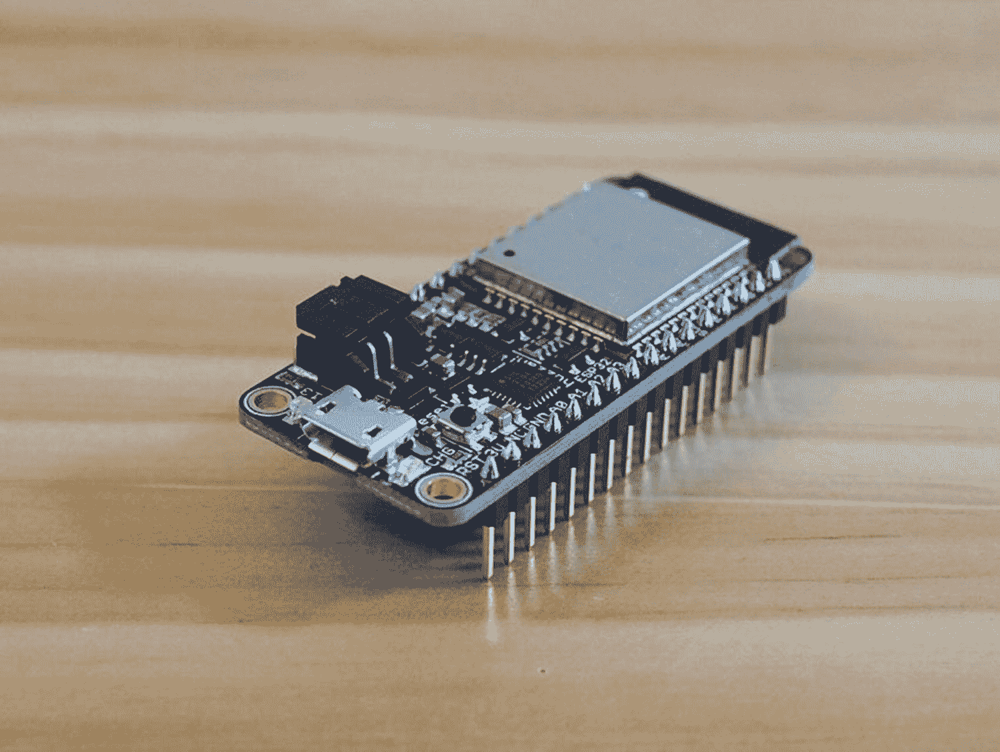

图 5-1

*Adafruit HUZZAH32 微控制器*

在构建门磁硬件及其控制软件的过程中，你将学习物联网应用开发所需的以下关键技能：

-   搭建用于检测开关输入的简单电路
-   配置 Arduino 编程环境
-   编写基于 C++的 Arduino“解决方案”（程序）
-   使用通用输入/输出（`GPIO`）和模数转换（`ADC`）监控与控制设备

由于本书面向软件工程师和爱好者，本章的电子学部分将以非常直接、实用的方式呈现。我的初衷是让硬件新手充分体验这项工作的乐趣，以便他们进一步探索，同时避免让有经验的读者感到乏味。此外，该项目不需要任何焊接，所需的所有零件均可轻松从 Amazon.com、Adafruit 或 Mouser Electronics 订购。

本章的 C++部分将借鉴你从 Swift 中已熟悉的概念。得益于 Arduino 项目开发者的辛勤工作，你会注意到 Arduino IDE 所使用的 C++语法非常现代化，并且再次与你在 Swift 中熟悉的语法非常相似。

## 构建无线门磁硬件

现在你已经对蓝牙有了更好的了解，可以开始为`IOTHome`构建外设——门磁传感器了。为此，你需要组装硬件、配置 Arduino 编程环境、编写 Arduino 程序代码，并将其下载到 HUZZAH32 微控制器中。如今，这些任务比以往任何时候都更加简化和可靠，但仍需细心关注。在本节中，我将引导你完成我创建门磁传感器的步骤，以及帮助我做出决策的设计考量。

### 零件清单

要构建本章的门磁传感器，你需要获取表 5-1 中列出的零件。主要部件包括：负责运行控制软件的 Adafruit HUZZAH32 微控制器、用于组装电路的面包板、用于检测门关闭或打开的磁簧开关、用于直观显示系统状态的两个发光二极管（`LED`），以及用于调节电压的一些电阻。

表 5-1

门磁传感器零件清单

| **零件名称** | **数量** | **Mouser 零件编号** |
| --- | --- | --- |
| Adafruit HUZZAH32 微控制器（已预焊） | 1 | 485-3591 |
| 无焊面包板 | 1 | 589-TW-E40-1020 |
| 面包板跳线套件 | 1 | 424-WIRE-KIT |
| 3.7V 190mAh 锂聚合物电池 | 1 | 932-MIKROE-2759 |
| 磁簧接近传感器 | 1 | 934-59140-1-S-03-F |
| 10KΩ 电阻 | 1 | 603-FMP200JR-52-10K |
| 200Ω 电阻 | 2 | 603-CFR-12JB-52-200R |
| 蓝色 LED（直插式，3.4V，5mm 封装） | 1 | 941-C5SMFBJECR0U045 |
| 红色 LED（直插式，2.1V，5mm 封装） | 1 | 941-C5SMFRJFCT0W0BB2 |

Adafruit 提供三种版本的 HUZZAH32：未组装版，需要你将排针或零件直接焊接到其引脚上才能使用；已组装版，引脚上已焊好排针，允许你将微控制器插到面包板上；以及已组装版并带有堆叠排针，允许你将微控制器插到主板上，并使用跳线连接引脚。对于本项目，我推荐后两种版本，它们能为你节省大量时间和避免挫败感，而价格仅相差 1 或 2 美元。

对于其余零件，你会注意到我没有提及品牌或对零件施加严格限制。我设计这个项目的目标是创造一些我认为你可以用其他项目剩余的零件或你在 Amazon.com 或本地电子零件店可能见过的廉价 Arduino 入门套件中的内容来制作的东西。

本项目中的所有零件都是特别挑选的，以便于在 Amazon.com、Adafruit（`www.adafruit.com`）或 Mouser Electronics（`www.mouser.com`）上购买。比较这三家零售商，Adafruit 对爱好者最为友好，提供精心挑选的可靠零件以及丰富的教程和示例项目。Mouser 是专业人士以及那些需要订购特殊零件或大量物品的最佳选择。最后，Amazon 是万能的零售商。在 Amazon 上搜索零件比另外两家要困难得多，而且更难保证你获得的质量（许多小型制造商可以直接通过 Amazon 销售），但它可以是一个好资源，让你在同一次订单中买到流行零件和通用的低价零件。

你为本项目准备的完整零件套件应类似于图 5-2 中的照片所示。

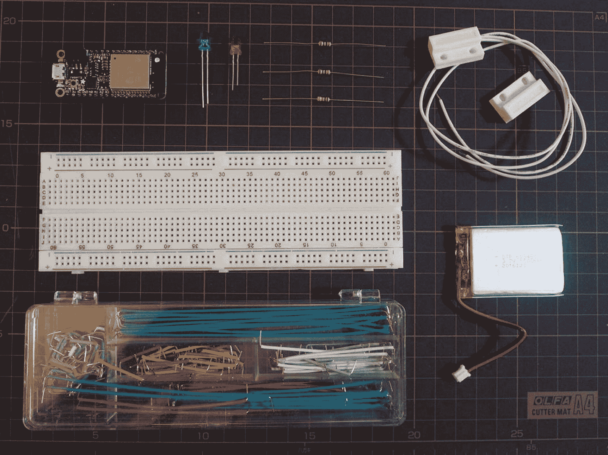

图 5-2

为`IOTHome`项目收集的零件照片


### 组装硬件

我的第一任老板告诉我，在 NASA 工作最棒的一点就是，所有工程师都必须参加 NASA 的焊接培训课程。话虽如此，焊接是一项需要练习和精准度的操作。当处理像微控制器这样敏感的部件时，你必须要小心，不要使用过多的焊料（一种易熔化的金属，用于形成部件之间的连接），否则会有造成短路（两个不应接触的部件之间发生意外的物理连接）的风险。你还必须注意，不要让烙铁（加热焊料的工具）停留时间过长或温度过高，否则可能会烧坏部件。

为了降低这两种风险，许多工程师会使用面包板（如图 5-3 所示），通过杜邦线在部件之间建立连接。这在原型设计阶段尤其有用，因为你经常要试验不同的部件并修改电路。为了更准确地模拟真实情况，你也会使用面包板来组装这个项目的硬件。如果你对焊接感到得心应手，并希望将设计转移到更紧凑或更稳定的介质上，也欢迎你这么做。

尽管面包板有各种形状和尺寸，但它们都有一些共同的特点。

-   外壳通常由坚固的塑料制成，上面有许多金属插孔。
-   通常，顶部和底部各有一行，标有共享的正极和负极连接。
-   面包板上大部分物理空间被紧密排列的引脚列所占据，这些列贯穿整个器件。
-   面包板的中央行通常会有一个凹槽。

与所有事物一样，这些特性都有其存在的理由。首先，塑料是绝缘体，意味着它不导电（为电流提供通路）。你可以随意触碰塑料区域，不用担心触电。顶部和底部的行是共享连接。你插入这些行中任何一个引脚的部件或导线，都将与该行中的所有其他引脚共享电气连接。大多数电子部件都在直流电压下工作，需要电源（正极）连接和地（负极）连接，就像电池出来的连接一样，因此这些引脚成为电路中共享最频繁的引脚就说得通了。对于较小的共享连接，你将使用面包板中央的列。一列中的所有引脚都是共享的。由于大多数集成电路（IC）都采用双列直插式封装（DIP）标准的外壳，面包板中央的凹槽为你提供了足够的空间，可以插入一个 IC，并为每个引脚单独使用一列。这样一来，你就可以在不焊接的情况下将其他部件连接到这些引脚上。为了帮助可视化这一点，我在图 5-3 中加入了一张带有注释的面包板照片，标明了共享连接。

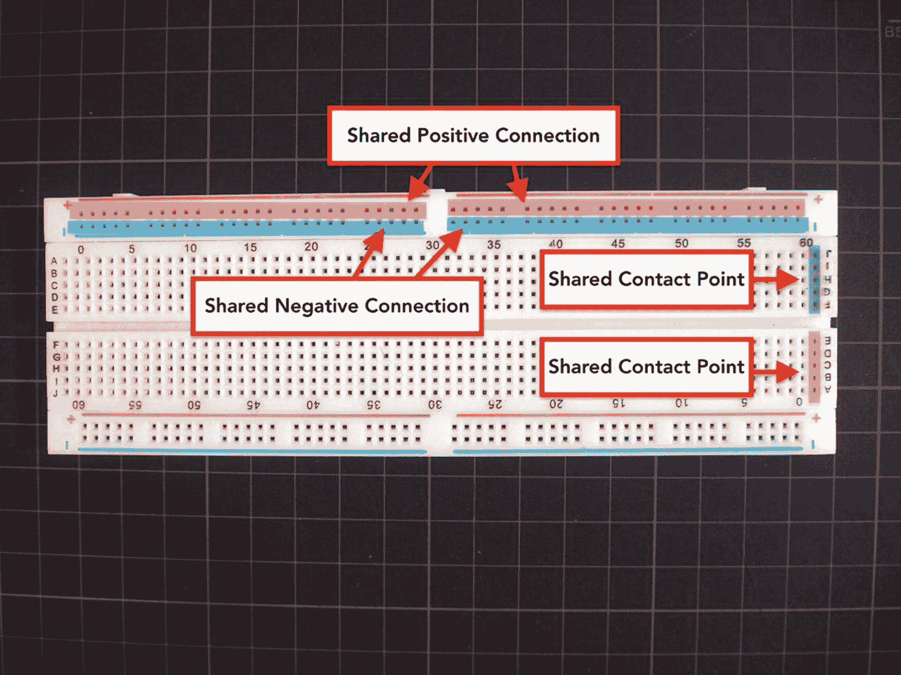

图 5-3

面包板上的物理连接

开始组装项目时，取出你的`HUZZAH32`，将其放在面包板的左中侧。如图 5-4 所示，确保将`HUZZAH32`放在面包板上，并使 USB 端口朝外。这样既能更容易地插入 USB 线缆进行编程，也能在面包板上留出更多空间来插入其他部件。

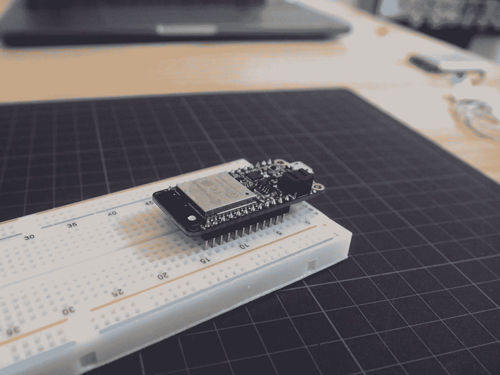

图 5-4

放置了`HUZZAH32`芯片的面包板

为了防止弯曲或损坏排针，轻轻向下按压芯片的右侧，直到排针在面包板中感觉稍微稳固，如图 5-5 所示。

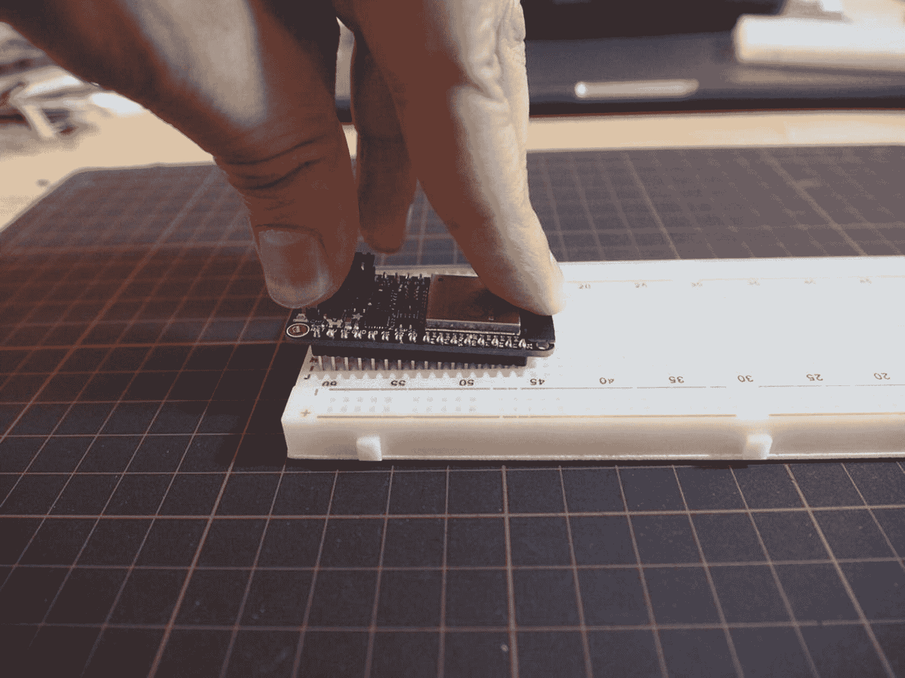

图 5-5

将`HUZZAH32`芯片固定在面包板上

继续这个过程，向下按压芯片的左侧，然后左右交替按压，直到排针底部与面包板齐平，如图 5-6 所示。

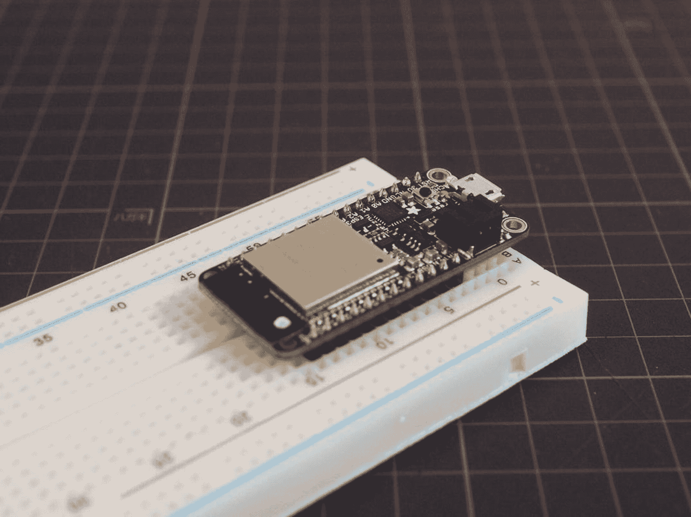

图 5-6

完全固定的`HUZZAH32`芯片

你将使用同样的方法来插入部件并用排针导线连接它们，以完成这个项目的电路。在继续之前，花点时间查看图 5-7 中的电路图。电路图是一种设计图，它规定了电路中使用了哪些部件以及这些部件之间是如何连接的。所有电路图都使用标准化的符号来表示部件和连接，因此任何工程师都能快速查看电路图并理解如何构建或分析该电路。

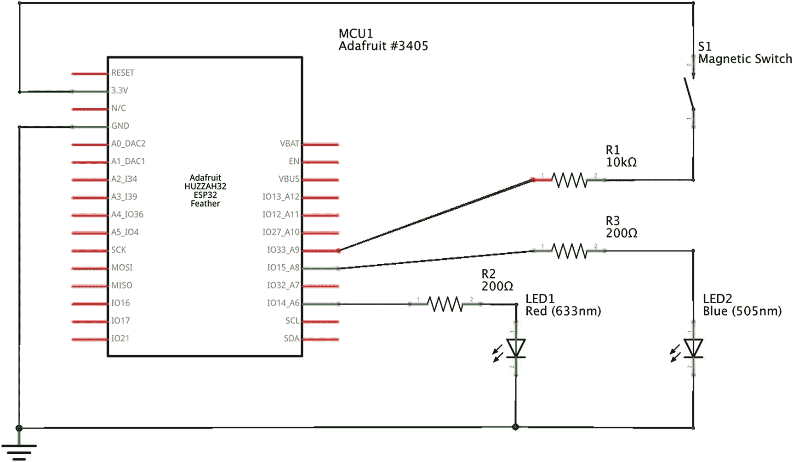

图 5-7

门磁传感器的电路图

对于门磁传感器，电路的核心是`HUZZAH32`芯片。它的`3V`和`GND`引脚用于为电路的其余部分提供电源和接地连接。连接到`GPIO14`和`GPIO15`引脚的是 LED，它们将用于指示门是否锁好以及蓝牙连接是否已经建立。许多部件，尤其是 LED，对驱动（操作）它们所需的电压和电流有特定要求。放置在引脚和 LED 之间的电阻用于将电压降低到使 LED 能够正常工作、而不会因高于其设计电压而烧坏的水平。电路中的最后一个连接是开关。开关的一侧连接到`3V`引脚和电源连接，另一侧连接到一个电阻，该电阻置于开关另一侧和接地连接之间。这被称为下拉电阻，用于在开关断开时建立稳定的接地连接。如果没有下拉电阻，微控制器将无法可靠地读取引脚是*高电平*（连接到电源）还是*低电平*（接地），你也就无法判断开关是断开还是闭合。

首先，开始建立电路的电源和接地连接。取出红色和绿色的杜邦线。在`HUZZAH32`芯片上找到标有`3V`的引脚。将红色导线（红色代表电源）的一端插入该引脚所在的排，另一端插入面包板上标有“正极”的列。对`GND`引脚重复此过程，但使用绿色导线（代表接地），并将连接终止于“负极”列。安装了`HUZZAH32`芯片以及电源/接地导线的面包板如图 5-8 所示。当`HUZZAH32`通过 USB 线缆或电池供电时，这两个连接将为电路的其余部分提供电力。

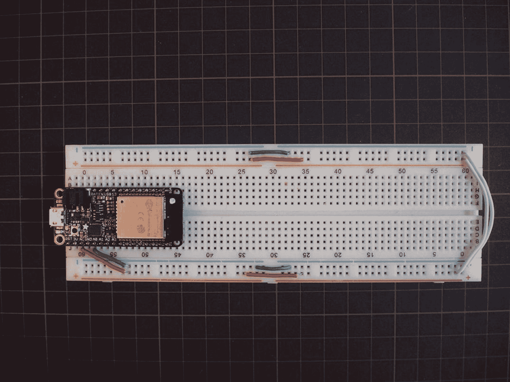

图 5-8

带有`HUZZAH32`芯片和电源/接地连接的面包板


现在你已准备好开始组装电路的核心部分。首先，用剪线钳剪掉电阻器多余的引脚末端，留出约 10 毫米（0.4 英寸）的长度，以便于在面包板上插拔。你还需要将发光二极管的引脚修剪到合适的尺寸。如电路图符号所示，发光二极管是**有极性**的，这意味着它们只允许电流从一个方向流过——从**阳极**（正极）到**阴极**（负极）。为了指示哪个引脚是阳极，制造商在出厂时将发光二极管的阳极引脚故意剪得比阴极更长。如图 5-9 所示，使用剪线钳对电阻器的引脚进行斜剪，注意让阳极保持为较长的引脚。

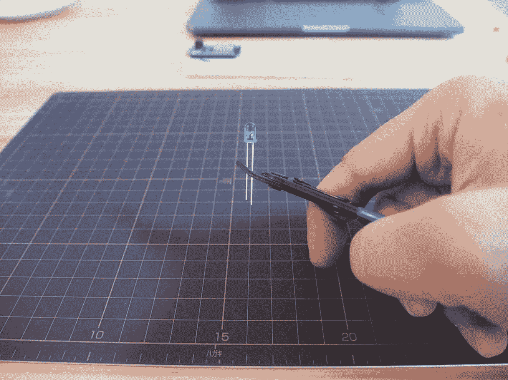

图 5-9 修剪发光二极管的引脚

现在零件已准备就绪，你可以开始将它们插入面包板。首先，为红色发光二极管搭建电路。取一根灰色、蓝色或白色的排线（除红色或绿色外的任何颜色均可），将其从`GPIO14`连接到面包板的空白区域。然后，将一个`200Ω`电阻器插入面包板，垂直跨过中央的空隙，连接两列。电阻器无极性，因此方向无关紧要。接着，将红色发光二极管水平插入面包板，阳极（长脚，正极端）插入与电阻器末端（下方列）相同的列中，阴极（短脚，负极端）插入一个空列。最后，取一根绿色排线，连接在阴极所在列与接地行之间。此过程建立了从 GPIO 引脚到电阻器，再进入发光二极管，最终到达接地的连接。此时，你的面包板应类似于图 5-10 中的照片。

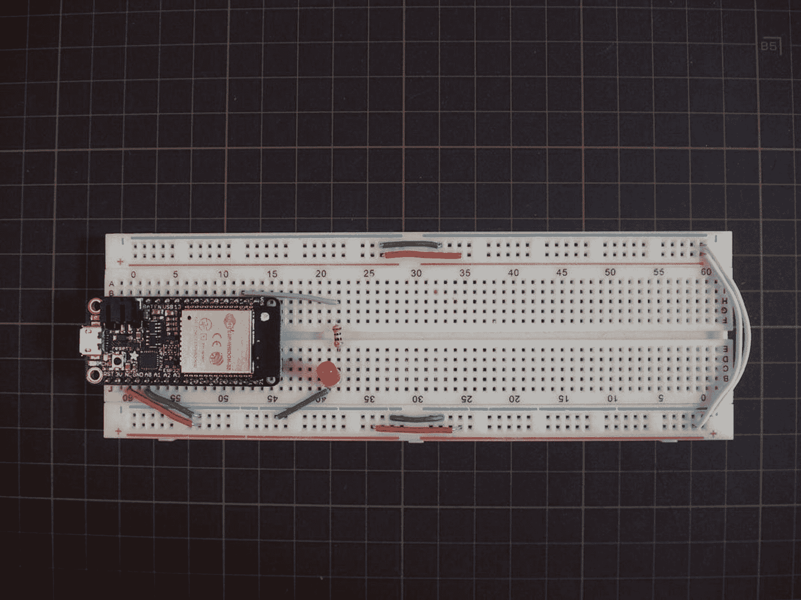

图 5-10 安装了红色发光二极管及支持零件的面包板

按照相同的步骤连接蓝色发光二极管，区别在于从标记为`GPIO15`的引脚开始，并确保所有连接都使用空列。

### 注意

工程师通常会对面包板上的连接进行颜色编码，以帮助识别排线的用途。这在处理电源引脚时尤其重要。如果必须重复使用颜色，请尽量将它们放置在面包板的不同物理区域，以便于调试。

最后要连接的部件是磁簧开关。再次取一根排线，从标记为`GPIO33`的引脚伸至一个空列。接着，将一个`10KΩ`电阻器跨接在列间隙上。最后，将开关的一端连接到电阻器的末端，另一端连接到面包板底部的共用正极行。与电阻器类似，开关无极性，因此方向无关紧要。你的完整电路应类似于图 5-11 中的照片。

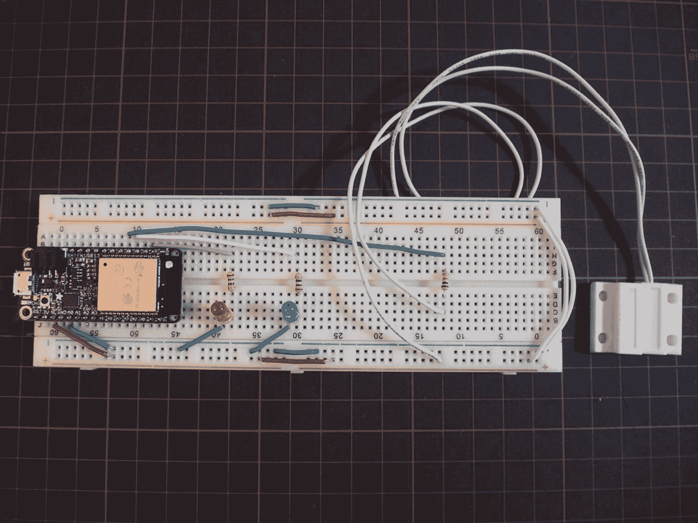

图 5-11 门磁传感器的完整电路

## 编写 Arduino 解决方案（程序）

现在硬件工作已完成，你可以重新回到软件领域。在 Arduino 问世之前，可重新编程的原始芯片是你开发嵌入式系统的唯一选择。你在电路中所用的零件具有固定用途，你需要仔细查阅零件说明书，弄清楚每个引脚的功能以及使用它们是否需要任何其他条件（例如电流限制或对其他零件的依赖）。

借助 Arduino，虽然仍有部分引脚只能用于单一用途，但 GPIO 和 ADC 引脚是你的自由发挥空间。你可以编写程序将它们用作简单的输入或输出（GPIO），或更精细、精确的输入输出（ADC）。就像在 iOS 中使用第三方库一样，你也可以下载第三方库，通过这些引脚控制更复杂的零件。在下一节中，你将学习如何编写你自己的 Arduino 解决方案（程序），利用这些可编程引脚读取磁性接近传感器（开关）和电池电量的状态，并通过发光二极管和蓝牙共享结果。

### 设置 Arduino 编程环境

要开始你的 Arduino 编程体验，你必须下载免费的官方 Arduino 集成开发环境（IDE）软件。如图 5-12 所示，导航至[`www.arduino.cc`](http://www.arduino.cc)，并点击顶部的`Software`选项卡。在`Software`页面，向下滚动到`Download the Arduino IDE`，然后点击链接下载适用于 OS X 版本的 Arduino IDE。

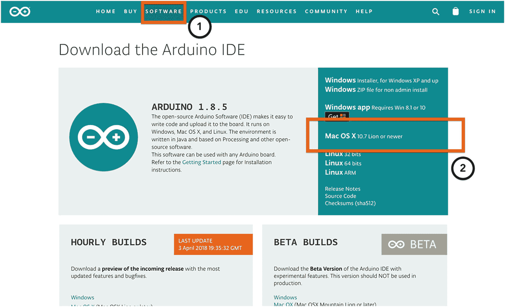

图 5-12 下载 Arduino IDE


### 注意

Arduino 开发团队在确保 OS X、Windows 和 Linux 版本的 IDE 具有近乎一致的用户体验方面做得非常出色；不过，本书中的操作说明需要使用命令行指令，且这些指令仅在 OS X 和 Linux 版本上经过测试。

下载完成后，双击压缩文件将其解压。将 Arduino 二进制文件拖放至你的“应用程序”文件夹，如图 5-13 所示。

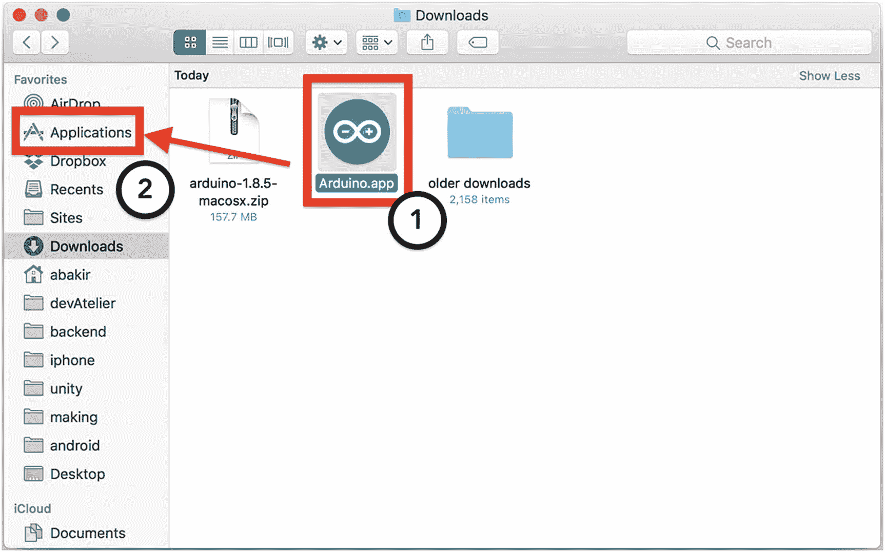

**图 5-13** 安装 Arduino IDE

接下来，从“应用程序”文件夹中点击 Arduino 图标以打开 IDE。你会看到一个文本编辑器界面，其中包含新程序的存根函数，如图 5-14 所示。与任何 IDE 一样，屏幕左上角都有编译和运行按钮。编译由带有对勾标记的按钮表示，运行则由指向右方的箭头表示。

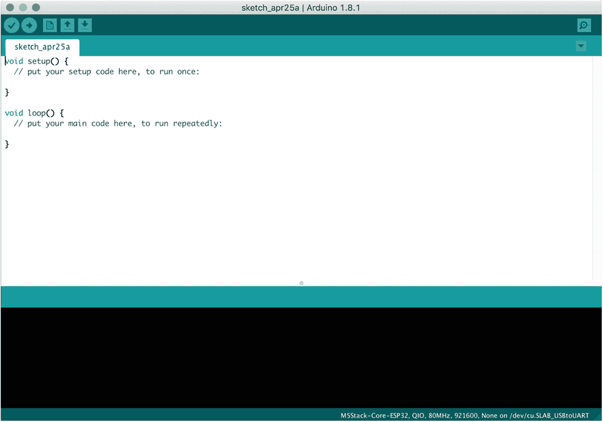

**图 5-14** Arduino IDE 的默认显示界面

在将 HUZZAH32 与 Arduino IDE 配合使用之前，你必须运行由其所基于的 SoC（即乐鑫公司生产的 ESP32）制造商提供的配置脚本。该 SoC 提供了 Arduino 兼容性和引脚映射的核心功能。像 Adafruit 这样的制造商可以随后选择要使用的功能以及如何进行封装。要安装构建脚本，你必须通过 `git` 检出它们。如果你之前安装过 Xcode 命令行工具，那么 `git` 版本控制软件应该已经安装在你的电脑上。如果没有，你可以打开终端并输入以下命令来安装这些工具：

```
xcode-select --install
```

要运行 ESP32 安装脚本，请先关闭 Arduino IDE，然后打开一个终端窗口。在终端窗口中，输入清单 5-1 中的命令。该命令将创建一个新目录，从 `git` 检出代码，并运行安装脚本。

```
mkdir -p ~/arduino && \
cd ~/arduino && \
git clone https://github.com/espressif/arduino-esp32.git esp32 && \
cd esp32 && \
git submodule update --init --recursive && \
cd tools && \
python get.py
```

**清单 5-1** 为 Arduino IDE 添加 ESP32 支持的命令行指令

如果脚本运行成功，输出的最后一行应包含“`Done！`”。

现在你已经为 Arduino 添加了 ESP32 支持，必须将 HUZZAH32 选为目标设备。首先，重新打开 Arduino IDE，然后导航到“工具”菜单。如图 5-15 所示，选择“开发板：…”菜单项，向下滚动直到找到“ESP32 Feather”。

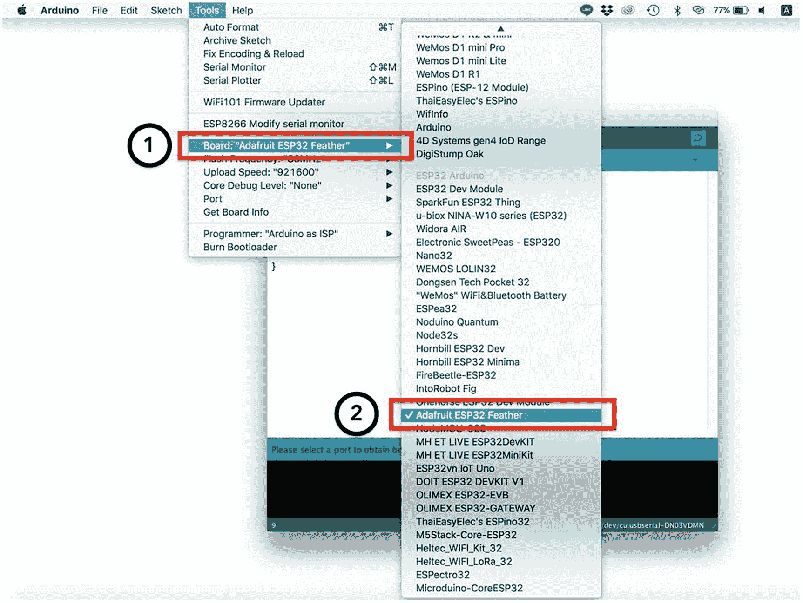

**图 5-15** 在 Arduino IDE 中选择目标硬件

接下来，你必须选择计算机的 USB 端口作为调试接口。再次导航到“工具”菜单，然后选择 `/dev/cu.SLAB_USBtoUART` 作为端口，如图 5-16 所示。为了保持一致性，同时在“工具”菜单中确认“Flash 频率”设置为 80Hz，“上传速度”设置为 921600。

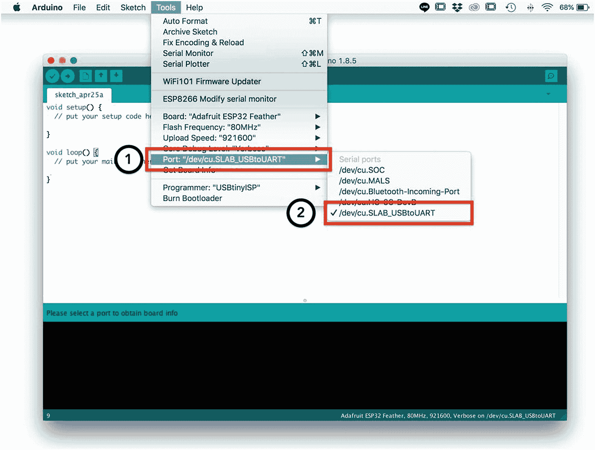

**图 5-16** 选择用于调试的 USB 端口

最后，要验证 Arduino IDE 能够与 HUZZAH32 通信，请进入“工具”菜单并选择“获取开发板信息”。如果连接成功建立，你将看到一个类似于图 5-17 的对话框，其中列出了你单片机的唯一标识符值。

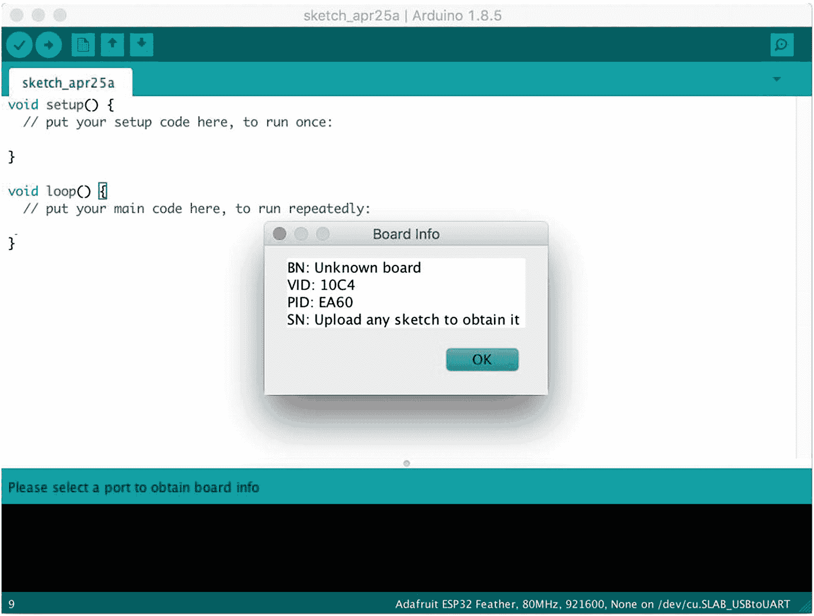

**图 5-17** 验证与 HUZZAH32 的连接


## 使用 GPIO 监控输入引脚并控制输出引脚

现在 Arduino IDE 已设置完毕，可以开始编写 Arduino 代码了！门传感器的 Arduino 解决方案可以分为两个部分：监控硬件和通过蓝牙传输结果。在本节中，你将专注于硬件监控代码，因为你可以通过监控 Arduino IDE 的调试控制台并目视检查电路中的 LED 来调试这部分代码。

要开始编写新的 Arduino 解决方案，请转到 `File` 菜单并选择 `New`。你将看到一个空的解决方案文件，其中包含两个存根方法：`setup()` 和 `loop()`。顾名思义，Arduino 解决方案具有简单的架构：`setup()` 方法中的逻辑在设备通电后立即执行，而 `loop()` 方法中的逻辑会重复执行，直到设备断电。初始的 Arduino 解决方案应类似于清单 5-2。

```
void setup() {
// put your setup code here, to run once:
}
void loop() {
// put your main code here, to run repeatedly:
}
```
*清单 5-2 初始的空 Arduino 解决方案*

在 Arduino 中使用 GPIO 是直接明了的操作。在 `setup()` 方法中，指定引脚号以及该引脚是用于输入还是输出。用于指定此功能的 API 是 `pinMode()`。在清单 5-3 中，我更新了解决方案以进行这些调用。为了帮助管理代码，我使用 `#define` 关键字将引脚号定义为编译器宏。如果你熟悉 Objective-C，你会认出这个关键字，因为它在 Objective-C 中用于相同的目的。这些引脚号与你之前在“组装硬件”一节中组装电路时使用的引脚号匹配。

```
#define RED_LED_PIN 14
#define BLUE_LED_PIN 15
#define SWITCH_PIN 32
void setup() {
pinMode(RED_LED_PIN, OUTPUT);
pinMode(BLUE_LED_PIN, OUTPUT);
pinMode(SWITCH_PIN, INPUT);
}
void loop() {
// put your main code here, to run repeatedly:
}
```
*清单 5-3 在 Arduino 解决方案中设置 GPIO 引脚模式*

在清单 5-3 中，我将 `BLUE_LED` 和 `RED_LED` 引脚设置为输出，并将 `DOOR_SENSOR` 引脚设置为输入。现在，是时候利用它们了。要与 Arduino 上的 GPIO 引脚交互，可以使用 `DigitalRead()` 和 `DigitalWrite()` API。顾名思义，它们用于向数字引脚读取或写入值。在本程序的介绍性部分，你将根据磁性传感器是相互接触（门关闭）还是未接触（门打开）来打开或关闭 `RED_LED`。因为我在 GPIO 引脚和地之间设计了一个下拉电阻，所以当门打开时开关将读取为 OFF，门关闭时读取为 ON。在清单 5-4 中，我更新了 `loop()` 方法以包含此逻辑。为了更准确地读取磁性开关的值，我使用 `delay()` API 在 `loop()` 方法的末尾添加了 1 秒（1000 毫秒）的延迟。

```
#define RED_LED_PIN 14
#define BLUE_LED_PIN 15
#define SWITCH_PIN 32
void setup() {
pinMode(RED_LED_PIN, OUTPUT);
pinMode(BLUE_LED_PIN, OUTPUT);
pinMode(SWITCH_PIN, INPUT);
Serial.begin(9600);
Serial.println(" Program start");
}
void loop() {
checkSwitch();
delay(1000);
}
void checkSwitch() {
int currentState = digitalRead(SWITCH_PIN);
if (currentState != switchState) {
updateLockBLE(currentState);
}
switchState = currentState;
digitalWrite(LED_PIN, switchState);
Serial.print("Switch state: ");
Serial.println(switchState);
}
```
*清单 5-4 根据 GPIO 状态打开或关闭 LED*

在下一章中，你将使用蓝色 LED 来指示蓝牙连接是否已建立。

## 计算电池状态

HUZZAH32 最便捷的特性之一是，其内置的电池端口允许你使用廉价的锂聚合物（LiPo）电池为其供电，并在通过 USB 为 HUZZAH32 供电时为其充电。然而，为了帮助用户充分利用设备，通过配套应用传输电池的充电水平是明智的做法。幸运的是，我们可以利用 ADC 的强大功能来读取电池电量并通过蓝牙进行传输。

就像软件开发人员一样，硬件开发人员经常发现自己需要调整设计以适应所面临的限制。就 HUZZAH32 而言，其设计者通过允许某些引脚具有多种功能，能够在设备中集成更多功能。为了读取电池电量，你可以利用他们在引脚 35（ADC #13）上的工程设计智慧。当此引脚未连接任何东西时，你可以使用它来读取所连接电池电压恰好一半的值。HUZZAH32 上的 ADC 引脚的工作方式与 iOS 代码中的 RGB 值类似，你可以从中读取或写入 12 位的电平。这允许你微调电机的速度，或者像本示例中必须做的那样，从引脚读取非二进制值。为了准确计算电池电量，将 ADC 输出值除以 4095（2¹² - 1），以找出电池电量（相对于最大值）的百分比，然后将此结果乘以 2，再乘以 1.1（ADC 引脚的参考电压）和 3.3（HUZZAH32 输出的参考电压）。如果你想将电池电量报告为百分比，请将此数字除以 4.2，这是可以连接到芯片的 LiPo 电池的最大可能电压。在清单 5-5 中，我修改了 Arduino 解决方案以包含这些计算。现在，我将输出值显示在 Arduino IDE 控制台上。在下一章中，你将学习如何通过低功耗蓝牙对其进行传输。

```
#define RED_LED_PIN 14
#define BLUE_LED_PIN 15
#define SWITCH_PIN 32
#define BATTERY_PIN 35
void setup() {
pinMode(RED_LED_PIN, OUTPUT);
pinMode(BLUE_LED_PIN, OUTPUT);
pinMode(SWITCH_PIN, INPUT);
pinMode(BATTERY_PIN, INPUT);
Serial.begin(9600);
Serial.println(" Program start");
}
void loop() {
checkSwitch();
checkBattery();
delay(1000);
}
...
void checkBattery() {
float currentLevel = analogRead(BATTERY_PIN);
currentLevel = ((currentLevel / 4095) * 2 * 3.3 * 1.1)
* 100 / 4.3;
batteryLevel = currentLevel;
Serial.print("Battery Level: ");
Serial.print(t);
Serial.println("%");
}
```
*清单 5-5 从 ADC 引脚 13 读取电池电量*


### 运行与监控 Arduino 解决方案

现在 Arduino 硬件及其控制软件已经完成，只剩下最后一步：尝试运行程序，检查传感器是否正常工作——当磁传感器断开时打开开关，并定期报告所连接电池的电压水平。

在编写 Arduino 解决方案时，你可能已经发现自己不断保存程序。如果喜欢冒险，你可能已经编译过几次，以检查代码是否有效。为了充分利用 Arduino IDE，请参考图 5-18，了解其用户界面的更详细说明。

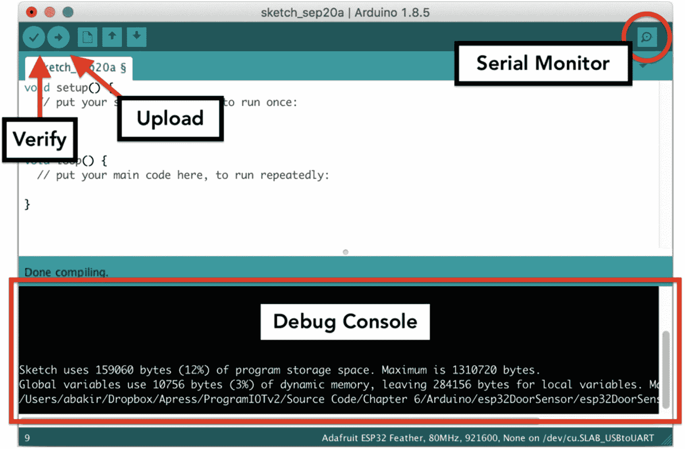

图 5-18

识别 Arduino IDE 中的运行按钮和串口监视器

与 Xcode 不同，你会注意到 Arduino 有两个运行按钮——验证和上传。验证按钮仅执行编译，类似于 Xcode 中的 `Build` 命令，允许你检查代码是否编译通过并满足基本运行时要求，例如不超过目标设备的可用存储空间。上传按钮则编译解决方案并将其上传到目标设备的硬件。由于 HUZZAH32 是一款兼容 Arduino 的设备，你之前安装的脚本将在此步骤中用于完成上传。在顶部栏的最右侧，你会找到串口监视器按钮。如果尚未打开，它会将 UART 端口的输出添加到 IDE 底部的调试控制台窗格中。当编译器或设备准备好新消息时，它们将显示在此窗格中。

要开始调试应用程序，请点击上传按钮。在串口控制台中，你应该会看到一系列显示上传进度的消息。上传成功后，你会看到开关和电池状态每秒输出一次（即 `loop()` 方法中延迟的时长）。你还可以通过打开磁开关来点亮红色 LED。Arduino 解决方案在上传后会持续运行，因此你无需每次运行时都重新上传解决方案。只需为设备供电，`start()` 和 `loop()` 方法便会立即开始执行。

### 编译故障排除

在我成为 iOS 开发者之前，我曾从事嵌入式系统工作。整个过程中最令人沮丧且耗时的事情，总是让程序首次成功运行。以下是我在 Arduino 设备上运行解决方案时遇到的一些最常见问题。

**电路工作正常，但串口控制台显示乱码字符。**

串行通信仅在发送方和接收方以相同频率通信时才能正常工作（字面意义上的频率！）。要解决此问题，请验证串口监视器设置的值与你在 Arduino 解决方案中配置串口时使用的值一致。对于门磁监控器，你可以在串口初始化代码中找到它：

```
Serial.begin(9600);
```

**Arduino IDE 成功上传了解决方案，但我无法看到串口消息，也无法让开关工作。**

这个问题令人沮丧，因为它阻止你验证程序的行为。根据我的经验，此错误通常有两个原因：

1.  设备需要重置。这是一个简单的操作。只需在 HUZZAH32 芯片仍连接电源时按下其重置按钮即可。设备重新启动后，你应该会在串口监视器和电路上看到正确的输出。

2.  在上传解决方案到 HUZZAH32 时，你必须按住重置按钮。在较旧的基于 ESP32 的开发板上，乐鑫要求编程期间将重置信号保持为低电平。如果硬件卡在无法重新编程设备或程序无法运行的状态，请尝试在上传操作期间全程按住设备的重置按钮。这应该能重新启用芯片的编程功能。

**Arduino IDE 无法找到 HUZZAH32 的串口。**

这是最难排查的问题。HUZZAH32 可能在一次编程会话中正常工作，然后突然无响应。根据我的经验，此问题通常由 OS X 上用于 HUZZAH32 的 USB 转串口驱动程序引起，而非硬件本身。由于绝大多数现代计算机不再配备串口（RS-232）端口，设备制造商使用集成电路通过 USB 传输串行信号。因为需要此功能的用户群体相较于普通用户较小，驱动程序往往不稳定。要解决此问题，我建议重启你的 Mac，然后在重启完成后尝试将 HUZZAH32 重新插入电脑。

就像在 Xcode 上调试连接设备一样，一旦你能够识别连接问题的症状，解决起来就变得轻而易举了。

### 总结

在本章中，你学习了如何使用 Arduino 制作你的第一个传感器。在硬件方面，你了解了面包板如何帮助你在无需焊接的情况下连接组件。除了用于稳定开关信号的下拉电阻外，组装电路的大部分工作就是将原理图中的连接点对应到面包板上。在软件方面，你了解到 Arduino IDE 和 Arduino 解决方案的运行方式类似于简化版的 Swift 应用程序。你在 Arduino 解决方案中编写的大部分代码并非依赖 `UIKit` 或其他 Apple 框架，而是利用了 HUZZAH32 芯片上的 GPIO 和 ADC 引脚。在 `setup()` 方法中，你配置了将要使用的每个引脚的角色和模式；然后在 `loop()` 方法中，你读取数值并用它们来打开或关闭引脚，以控制硬件。在下一章中，你将扩展这个简单程序，通过低功耗蓝牙将这些数据传输到配套的 iOS 应用。

