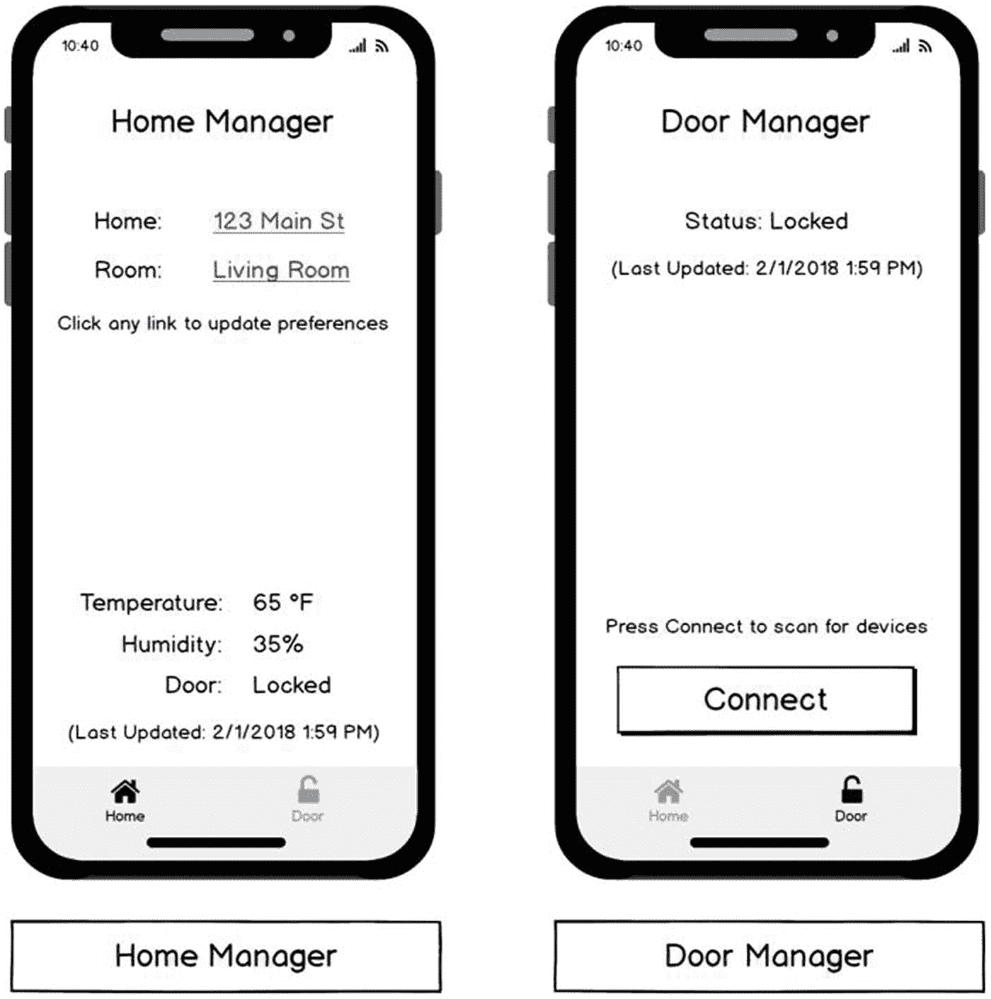
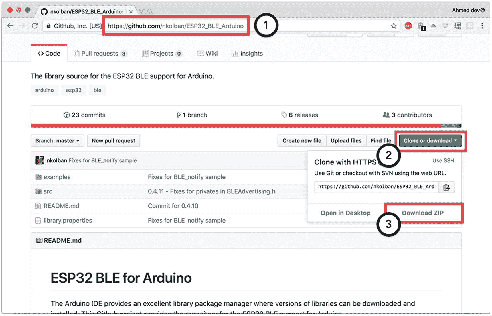
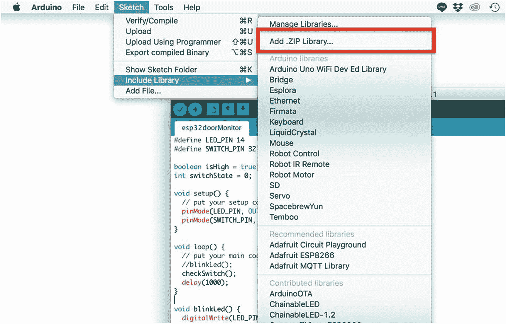
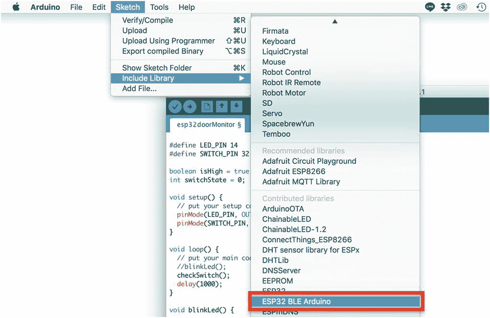
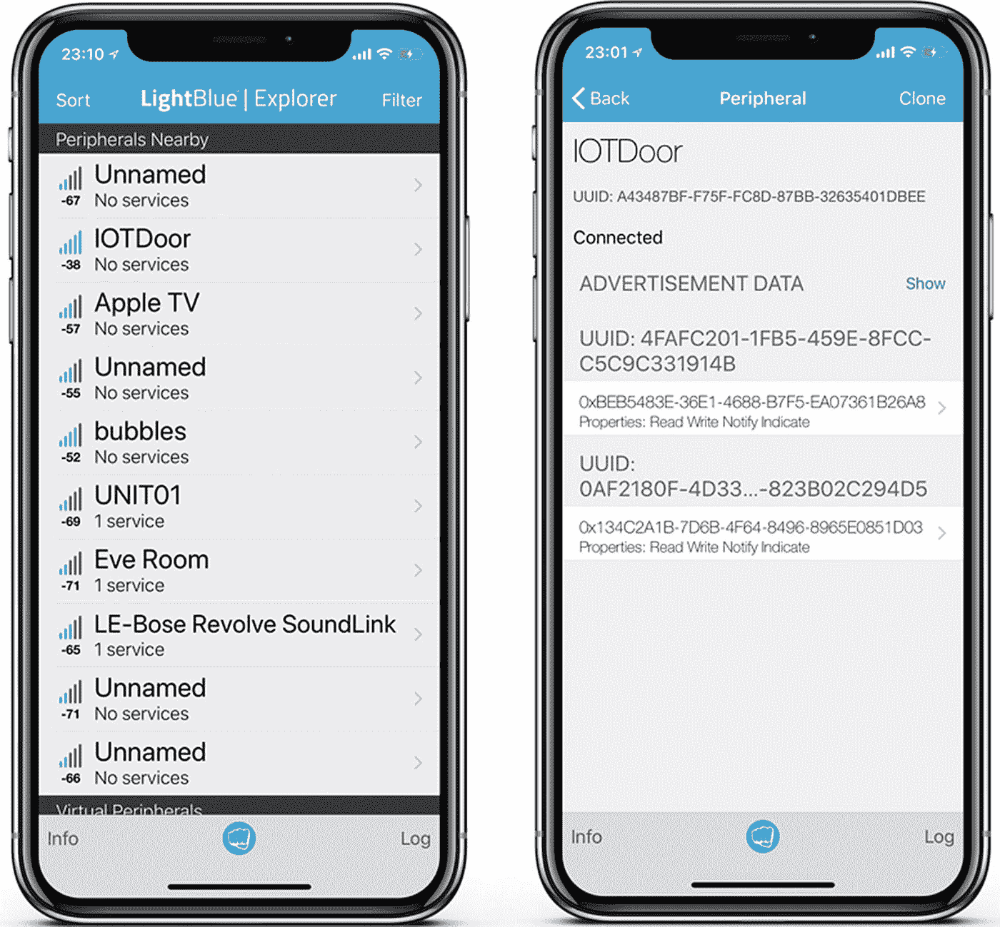
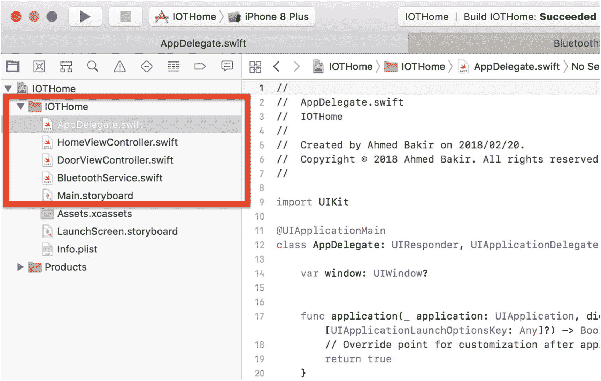
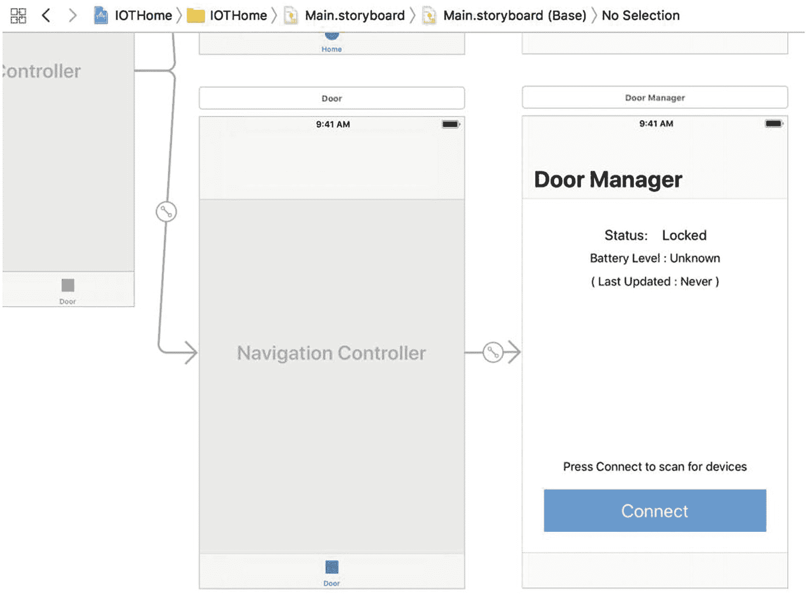
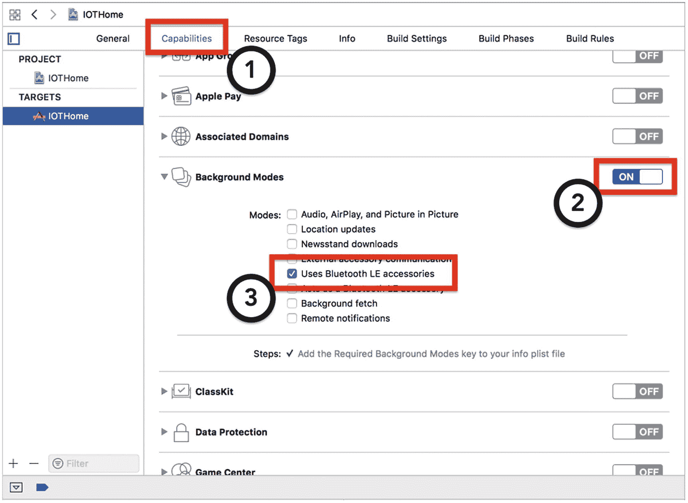
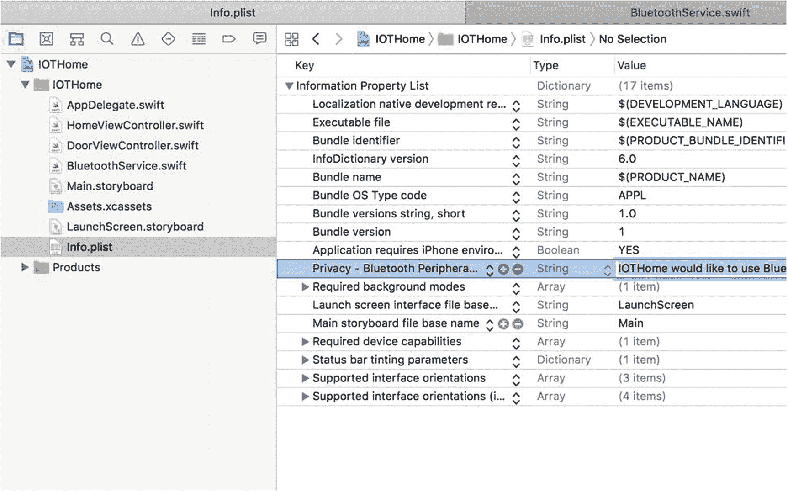
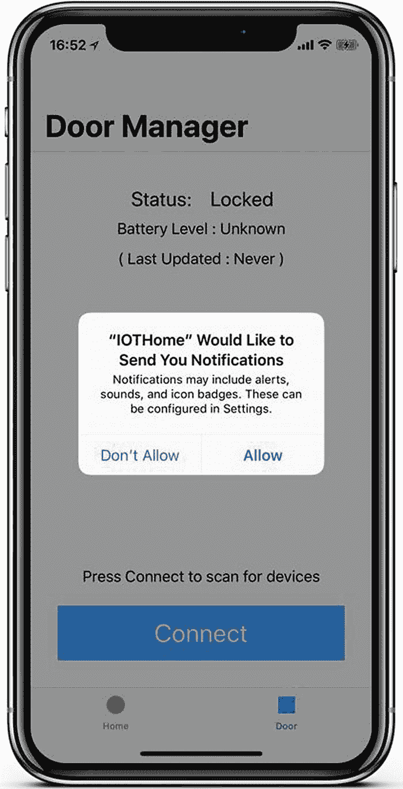

# 6. 构建低功耗蓝牙硬件配套应用

在第 5 章中，你通过构建一个基于 Arduino 的无线门磁传感器，初步涉足了嵌入式系统的世界。在本章中，你将通过为门磁传感器开发基于低功耗蓝牙的配套应用，继续你的硬件工程之旅。低功耗蓝牙是一种极为流行的基于无线电的通信协议，与其他无线通信方式相比，它允许设备在长达 77 米（约 250 英尺）的距离内以极低的能量需求进行通信（这就是低功耗蓝牙中“低功耗”的含义）。

当今 iOS 开发的一大优点在于，Apple 的 Core Bluetooth 框架包含了让你的应用利用 iOS 设备内置蓝牙硬件与低功耗蓝牙设备通信（或作为低功耗蓝牙设备）所需的一切。除了简单地建立与设备的连接外，本章还将介绍一些改善用户蓝牙体验的最佳实践，例如保存已配对的设备以及将来自硬件的消息作为推送通知显示在用户的 iOS 设备上。与 iOS 中的许多事情一样，Apple 在其文档中提供了关于实现低功耗蓝牙协议栈的理论指导，但将澄清实现细节的责任留给了开发者。为了帮助填补这一知识空白，在本章中，我将分享过去对我而言最有效的方法。


## 学习目标

在本章中，你将使用第 5 章搭建的门传感器，学习如何通过向现有 Arduino 程序添加蓝牙配对和数据传输功能，将其打造成完整的低功耗蓝牙解决方案，并构建一个 iOS 配套应用来监控该传感器。本章将启动一个新应用 `IOTHome`，你将在后续章节中持续迭代它。`IOTHome` 是一个物联网家居管理系统，最终将用于追踪多个物联网设备，并通过 HomeKit 为硬件提供安全且支持 Siri 的接口。作为介绍，图 6-1 展示了 `IOTHome` 应用首个迭代版本的设计线框。



图 6-1  
`IOTHome` 应用的设计线框

为了简化迭代过程，你将再次采用基于标签视图控制器的设计，在应用的各个屏幕之间切换。本章中，你将专注于构建“门”标签，该标签允许用户连接到门传感硬件，并监控门的状态以及设备的电池电量。在构建这款 iPhone 配套应用的过程中，你将学习物联网应用开发的以下关键技能：

*   低功耗蓝牙核心概念
*   将 Arduino 作为蓝牙外设进行广播
*   通过蓝牙从 Arduino 发送数据更新
*   在 iOS 上使用 Core Bluetooth 发现蓝牙设备
*   在 iOS 上使用 Core Bluetooth 监听设备更新
*   在后台响应蓝牙更新

本章将要求你在 Arduino IDE 和 Xcode 之间来回切换。如果你觉得需要回顾 Arduino 的知识，我建议重新学习第 5 章，并查看 Adafruit 的一些在线教程，网址为 [`https://learn.adafruit.com`](https://learn.adafruit.com)。

## 低功耗蓝牙快速入门

为了方便你理解本章后续内容，我想先介绍一些与低功耗蓝牙相关的关键概念和术语。在本章中，你将在 Arduino 和 iOS 程序中实现低功耗蓝牙协议栈的不同方面，提前了解整体框架将有助于你更轻松地将各个组件整合起来。

蓝牙最初是由蓝牙技术联盟开发的短距离、低功耗无线通信协议。蓝牙技术联盟是一个由多家计算机硬件和电信公司成员运营的标准组织。它的设计目标从一开始就与 LTE 或 Wi-Fi 不同，旨在实现计算机之间或计算机与外设之间的高效、短消息通信。低功耗蓝牙是蓝牙 4.0 规范的一部分，旨在提供功耗更低、成本更低的实现方案，同时不牺牲通信距离，也无需为支持蓝牙经典或低功耗蓝牙任一版本而采用截然不同的硬件。在实践中，苹果和许多其他智能手机制造商使用功耗更低、速度稍慢的低功耗蓝牙标准，与数据量需求小的外设（如物联网健康传感器或位置信标）通信；而使用功耗更高、吞吐量更大的蓝牙标准，与对延迟要求较低的设备（如手机耳机或扬声器）通信。

在实现蓝牙功能时，设备可以扮演两种明确定义的*角色*。*外设*是一种为其设备提供支持功能或数据的设备。你可以把蓝牙外设想象成个人计算机的外设。你连接到外设，它便提供主处理单元原先不具备的*服务*。蓝牙键盘或耳机就是充当*外设*的设备。设备可以扮演的另一种主要角色是*中心*设备，即连接并管理外设的设备。大多数情况下，当计算机或智能手机将音频发送到蓝牙耳机，或使用蓝牙键盘输入时，它就在扮演中心设备的角色。

蓝牙设备并不受硬件限制只能扮演一种角色。例如，在同一个应用中，你可以创建一种模式，使应用充当中心设备，同时创建另一种模式使应用充当外设（例如，如果你正在制作一个离线照片分享应用）。但在一次通信会话中，设备只会扮演一个角色。在本章中，Arduino 将扮演外设，而 `IOTHome` 应用将扮演中心设备。

如果你曾用 iPhone 连接过蓝牙外设，可能还记得过程是这样的：

1.  扫描附近设备。
2.  点击列表中的设备尝试连接。
3.  使用 PIN 码确认连接。
4.  开始蓝牙通信。

中心设备发现外设的方式是*扫描*（搜索）外设正在广播的*广播数据包*。类似于以太网数据包，这些是特殊的短消息，用于广播设备的名称、*服务*以及它提供的*特征*（数据类型）。与 iOS 上的配对方式类似，在大多数应用中，你将利用这些广播数据让用户选择他要连接的设备。一旦设备连接成功，就可以进行双向通信。为了在双方设备上节省电量，扫描和广播是由用户发起的操作，一旦连接建立就会停止。在本章中，Arduino 一通电就会开始广播其服务，而 `IOTHome` 应用中的“连接”按钮将用于扫描并连接 Arduino。

最后要提及的蓝牙概念是*规范*。服务和特征通过 128 位的通用唯一标识符来标识。然而，对于心率监测器、耳机等重复出现的硬件，蓝牙技术联盟要求你使用这些设备通用的服务与特征 UUID 集合。这些被称为*规范*，通过利用中心设备对已知规范的优化，可以帮助你为用户提供更好的体验。例如，当你连接蓝牙耳机时，iOS 会显示电池电量和耳机图标。`IOTHome` 应用的门传感器不属于任何预定义的规范，因此你将使用随机生成的 UUID 来标识它。


## 为 Arduino 解决方案添加蓝牙功能

既然你对蓝牙有了更深入的了解，就可以开始在门磁传感器的 Arduino 解决方案（程序）中应用它了。要将门磁传感器配置为蓝牙外设，你需要在 Arduino 解决方案中执行以下操作：

- 将设备设置为蓝牙服务器（外设），使其能够接受传入连接
- 广播外设提供的服务和特征
- 当磁簧开关状态或电池电量发生变化时，通过低功耗蓝牙发送数据更新

尽管低功耗蓝牙本身是一种高效的协议，但你可以在状态发生变化时（而非每秒）才推送更新，从而使实现更加高效。保持连接建立是一种低功耗操作，但通过它推送数据会产生能耗成本。减少通信将显著延长 Arduino 和 iOS 应用的电池续航时间。

与 iOS 类似，Arduino 拥有由 Arduino 基金会提供的大量库以及用户社区开发的开源库。在本章中，你将使用 Neil Kolban 开发的 `ESP32_BLE_Arduino` 库来建立低功耗蓝牙服务器、处理传入连接并通过低功耗蓝牙推送更新。他的付出意味着你无需研究时序图或自行实现底层协议。你可以专注于如何在应用中使用蓝牙，而非如何构建它。此外，他的库还提供了针对基于 ESP32 的设备（例如本项目使用的 Adafruit HUZZAH32）的定制功能。尽管基于 ESP32 的设备在形态和可用功能上千差万别，但它们都使用来自乐鑫（Espressif）的同一款片上系统（SoC）。设备制造商（OEM）只需决定要使用哪些功能以及如何将它们暴露出来。

### 安装 `ESP32_BLE_Arduino` 库以实现蓝牙通信

要使用 `ESP32_BLE_Arduino` 库，你首先必须将其导入 Arduino IDE。导入后，你可以在其他项目中重复使用它，而无需重复导入步骤。首先，在浏览器中访问该库的 GitHub 页面：`https://github.com/nkolban/ESP32_BLE_Arduino`。要下载该库的最新版本，请点击右上角的 **Clone or download**（克隆或下载）按钮，如图 6-2 所示。你将看到 **Open in Desktop**（在桌面客户端中打开，通常如果电脑上安装了 GitHub 或 Sourcetree，会打开相应程序）或 **Download ZIP**（将文件以压缩包形式下载）两个选项。由于你只需将库中的部分文件导入 Arduino IDE，我建议选择 **Download ZIP**。



**图 6-2** 从 GitHub 下载仓库

将仓库下载到电脑后，返回 Arduino IDE，进入 **Sketch**（项目）菜单。如图 6-3 所示，选择 **Include Library**（加载库），然后选择 **Add .ZIP Library**（添加 .ZIP 库）。当文件浏览器窗口出现时，选择你刚刚下载的 zip 文件。



**图 6-3** 导入 zip 压缩包

导入文件后，再次返回 **Sketch**（项目）菜单。如图 6-4 所示，再次选择 **Include Library**（加载库）。这次，你刚刚导入的库 **ESP32 BLE Arduino** 应该会出现在上下文菜单中。



**图 6-4** 在项目中包含 ESP32 BLE Arduino 库

选择该库后，你会注意到解决方案的源代码已被修改，包含了该库中的部分文件，如代码清单 6-1 所示。

```
#include 
#include 
#include 
#include 
#define RED_LED_PIN 14
...
void setup() {
  // put your setup code here, to run once:
  Serial.begin(9600);
  Serial.println(" Program start");
  ...
}
...
```

**代码清单 6-1** 包含 ESP32 BLE 库后的 Arduino 解决方案

对于本项目，你必须使用该库的蓝牙服务器和数据传输功能，而这些功能并未包含在默认导入的文件集中。请修改你的解决方案，如代码清单 6-2 所示，以包含正确的文件。

```
#include 
#include 
#include 
#include 
#define RED_LED_PIN 14
...
void setup() {
  // put your setup code here, to run once:
  Serial.begin(9600);
  Serial.println(" Program start");
  pinMode(RED_LED_PIN, OUTPUT);
  ...
}
...
```

**代码清单 6-2** 包含蓝牙服务器功能文件的 Arduino 解决方案

要确认这些文件与项目兼容，请点击 Arduino IDE 中的 **Verify**（验证）按钮。项目应能够成功编译。你可以在未来的项目中重复这些步骤以包含其他库。


## 将 Arduino 设置为蓝牙外设

导入蓝牙库后，即可开始实现蓝牙服务器，这将使设备能够作为外设广播自身并接受传入连接。回顾前面关于蓝牙规范的概述，这是通过广播设备所提供的服务（功能）和数据类型（特征）来实现的。这两个值均以 128 位 UUID 表示。UUID 是一串基本随机的十六进制字符；然而，为了将门传感器注册为兼容低功耗蓝牙的设备，你需要将其中部分值替换为蓝牙低功耗规范中已知的标识符。

首先，你需要生成四个 UUID——两个用于表示正在广播的服务（门信息、电池信息），两个用于表示特征（电池电量、门锁状态）。在 Mac 上，你可以使用 `uuidgen` 工具通过命令行生成 UUID。我的结果展示在代码清单 6-3 中。

```
ahmeds-macbook:arduino abakir$ uuidgen
8CED1808-7984-47CE-BE9C-E2DD56317575
代码清单 6-3
从 OS X 命令行生成 UUID
```

如你所见，运行 `uuidgen` 工具无需额外参数。结果会立即以字符串形式打印在命令行上。运行此命令四次以生成你的四个 UUID 并保存结果。我已将我的结果追加到 Arduino 解决方案中，如代码清单 6-4 所示。

```
#include 
#include 
#include 
#include 
#define RED_LED_PIN 14
...
#define LOCK_SERVICE_UUID        "83b46845-6e9c-4b25-89cf-871cc74cc68e"
#define BATT_SERVICE_UUID        "7d6925f3-6e19-48c6-a503-05585abe761e"
#define LOCK_CHARACTERISTIC_UUID "4b61d6b9-2e29-4fdf-a74a-7b8bf70ecd9a"
#define BATT_CHARACTERISTIC_UUID "8e628af6-0275-4f80-bb64-58f2b2771cba"
void setup() {
// put your setup code here, to run once:
Serial.begin(9600);
Serial.println(" Program start");
pinMode(RED_LED_PIN, OUTPUT);
...
}
...
代码清单 6-4
将 UUID 追加到 Arduino 解决方案
```

接下来，你必须将从字符串第五个字符开始的四个字符（即第二个双字节组）替换为蓝牙规范中的已知值。这份主记录值被称为蓝牙 GATT（通用属性）。你可以在 [`www.bluetooth.com/specifications/gatt/services`](http://www.bluetooth.com/specifications/gatt/services) 找到服务的值，在 [`www.bluetooth.com/specifications/gatt/characteristics`](http://www.bluetooth.com/specifications/gatt/characteristics) 找到特征的值。虽然 GATT 并未涵盖所有用例，但它覆盖了广泛的范围，足以满足大多数项目需求。对于广播电池电量，你可以使用电池服务标识符 (`0x180F`) 和电池电量状态特征 (`0x2A1B`)。门的情况稍微复杂一些，因为没有门服务；然而，警报通知服务标识符 (`0x1811`) 和警报状态特征 (`0x2A3F`) 能很好地近似此用例，并且在此处适用。如代码清单 6-5 所示，修改你的解决方案以包含这些新值。

```
#include 
#include 
#include 
#include 
#define RED_LED_PIN 14
...
#define LOCK_SERVICE_UUID        "83b41811-6e9c-4b25-89cf-871cc74cc68e"
#define BATT_SERVICE_UUID        "7d69180F-6e19-48c6-a503-05585abe761e"
#define LOCK_CHARACTERISTIC_UUID "4b612A3F-2e29-4fdf-a74a-7b8bf70ecd9a"
#define BATT_CHARACTERISTIC_UUID "8e622A1B-0275-4f80-bb64-58f2b2771cba"
void setup() {
// put your setup code here, to run once:
Serial.begin(9600);
Serial.println(" Program start");
pinMode(RED_LED_PIN, OUTPUT);
...
}
...
代码清单 6-5
包含有效 GATT UUID 的 Arduino 解决方案
```

接下来，你可以开始设置蓝牙服务器。`Arduino_ESP32_BLE` 库通过 `BLEServer` 类暴露这些函数。该类使用起来很直接，因为设置主要需要注册特征、服务以及服务器事件的回调处理程序（例如，连接已建立、连接已断开）。首先，如代码清单 6-6 所示，初始化服务器、特征和服务。

```
...
#define BATT_CHARACTERISTIC_UUID "134c298f-7d6b-4f64-8496-8965e0851d03"
BLECharacteristic *lockCharacteristic;
BLECharacteristic *battCharacteristic;
void setup() {
...
pinMode(BATTERY_PIN, INPUT);
startBLE();
}
void startBLE() {
// Create the BLE Device
BLEDevice::init("IOTDoor");
// Create the BLE Server
BLEServer *bleServer = BLEDevice::createServer();
// Create the BLE Service
BLEService *lockService = bleServer->
createService(LOCK_SERVICE_UUID);
// Create a BLE Characteristic
lockCharacteristic = lockService->createCharacteristic(
LOCK_CHARACTERISTIC_UUID,
BLECharacteristic::PROPERTY_READ   |
BLECharacteristic::PROPERTY_WRITE  |
BLECharacteristic::PROPERTY_NOTIFY |
BLECharacteristic::PROPERTY_INDICATE
);
lockCharacteristic->addDescriptor(new BLE2902());
BLEService *battService = bleServer->
createService(BATT_SERVICE_UUID);
battCharacteristic = lockService->createCharacteristic(
BATT_CHARACTERISTIC_UUID,
BLECharacteristic::PROPERTY_READ   |
BLECharacteristic::PROPERTY_WRITE  |
BLECharacteristic::PROPERTY_NOTIFY |
BLECharacteristic::PROPERTY_INDICATE
);
battCharacteristic->addDescriptor(new BLE2902());
// Start the service
lockService->start();
battService->start();
// Start advertising
bleServer->getAdvertising()->start();
}
代码清单 6-6
从 Arduino 解决方案初始化低功耗蓝牙服务器
```

根据 Arduino 解决方案的执行流程，你必须在 `setup()` 方法中启动服务器，因为它是程序中仅执行一次的部分。为了稍后发送消息，你需要重用特征对象，因此我将它们声明为全局变量。在设置服务和特征时，请务必正确附加它们，否则将无法工作。与蓝牙规范一致，服务只有在附加到特征时才能被发现。特征属性不必包含我的示例中的完整列表（`READ`、`WRITE`、`NOTIFY`、`INDICATE`）。在未来的项目中，你可以根据需要精简它们。

启动服务器的最后一个要求是注册连接回调。要执行此操作，你需要实现 `BLEServerCallbacks` 协议。由于 C++ 和 Swift 共享共同的语言设计渊源，实现该协议的过程对你来说应该非常熟悉。就像在 Swift 中一样，定义一个继承该协议的类，并实现所需的命名方法：`onConnect(BLEServer * pServer)` 和 `onDisconnect(BLEServer * pServer)`。正如名称所示，这些方法在服务器建立或断开连接时被调用。在代码清单 6-7 中，我修改了解决方案以包含此代码，并添加了将回调附加到服务器对象的调用。目前，你需要在回调中执行的操作仅是将状态对象设置为 `true` 或 `false`，以及打开或关闭蓝色 LED 灯。稍后，你将再次使用此状态对象，以帮助过滤外发消息。


```
...
BLECharacteristic *lockCharacteristic;
BLECharacteristic *battCharacteristic;
bool deviceConnected = false;
class MyServerCallbacks: public BLEServerCallbacks {
void onConnect(BLEServer* pServer) {
deviceConnected = true;
digitalWrite(BLUE_LED_PIN, deviceConnected);
};
void onDisconnect(BLEServer* pServer) {
deviceConnected = false;
digitalWrite(BLUE_LED_PIN, deviceConnected);
}
};
...
void startBLE() {
// 创建 BLE 设备
BLEDevice::init("IOTDoor");
// 创建 BLE 服务器
BLEServer *bleServer = BLEDevice::createServer();
bleServer->setCallbacks(new MyServerCallbacks());
// 创建 BLE 服务
BLEService *lockService = bleServer->createService(LOCK_SERVICE_UUID);
...
}
...
清单 6-7
包含有效蓝牙 LE 回调的 Arduino 解决方案
```

此步骤完成了 Arduino 解决方案中蓝牙 LE 服务器组件的所有设置。为了验证服务器是否正确创建，我喜欢使用蓝牙 LE 扫描器应用来检查 Arduino 是否正在广播正确的信息。我首选的应用是 LightBlue^® Explorer，可在 App Store 上的 [`https://itunes.apple.com/us/app/lightblue-explorer/id557428110?mt=8`](https://itunes.apple.com/us/app/lightblue-explorer/id557428110?mt=8) 下载。在图 6-5 中，我展示了该应用的截图，包括门传感器的状态。在应用的主屏幕上，你应该能看到你在清单 6-6 中指定的广播名称（“IOTDoor”），在详情页面上，你会看到你用于设置服务器的四个 UUID。要找到该设备，只需将解决方案下载到 HUZZAH32 开发板，按下芯片上的重置按钮，然后等待几秒钟。



图 6-5

使用 LightBlue^® Explorer 验证蓝牙 LE 广播数据

### 注意

添加蓝牙服务器初始化代码后，你的 Arduino 解决方案启动速度会明显变慢。你可以打开 Arduino IDE 的串行监视器来验证这一点。在启动过程中，你应该每隔几秒就能看到蓝牙服务器代码记录的日志消息。

### 通过蓝牙 LE 发送数据更新

信不信由你，设置用于广播设备的蓝牙服务器是 Arduino 解决方案中最困难的部分。要通过蓝牙 LE 发送数据更新，你只需使用已保存的特征（电池电量等级、警报状态），并在状态发生变化时推送新的更新。尽管 Arduino 解决方案设置为每秒轮询一次更新，但在实践中，每秒都传输蓝牙更新并非明智之举。除了消耗电量外，持续传输状态还会导致在设备有更新时（例如当磁传感器检测到门已打开时）无法通知用户。

首先修改你在第 5 章中用于检测门传感器是关闭还是打开的 `checkSensor()` 方法。在该方法的旧实现中，你检查引脚是高电平（连接）还是低电平（断开），然后使用该值来打开或关闭 LED。虽然这种实现仍然有效，但你必须保存旧值才能触发更新。

要使用 ESP32 BLE Arduino 库发送更新，你可以使用 `setValue()` 方法在特征上设置一个新值。然后，你告诉特征对象使用 `notify()` 方法通知所有已连接的设备。在清单 6-8 中，我已更新解决方案，将旧的传感器值保存为全局变量，并且仅当有设备连接到外设且自上次更新以来值发生了变化时，才触发蓝牙更新。

```
void loop() {
// 在此处放置你的主代码，以便重复运行：
checkSensor();
checkBattery();
delay(1000);
}
...
void checkSensor() {
int currentState = digitalRead(SWITCH_PIN);
if (currentState != switchState) {
updateLockBLE(currentState);
}
switchState = currentState;
digitalWrite(RED_LED_PIN, switchState);
Serial.print("传感器状态: ");
Serial.println(switchState);
}
...
void updateLockBLE(bool currentState) {
uint8_t value = 0;
if (deviceConnected) {
value = currentState ? 1 : 0;
lockCharacteristic->setValue(&value, 1);
lockCharacteristic->notify();
}
}
清单 6-8
从 Arduino 解决方案发布磁传感器更新
```

对于 `checkBattery()` 方法，你可以使用相同的过程；但是你需要调整检测状态变化的逻辑。在实践中，你会注意到随着传感器保持通电状态，电池电量会持续下降。这是正常的，但为了方便用户，最好只在有显著变化时才通知他们。在清单 6-9 中，我已更新解决方案来保存旧电池值（就像磁传感器一样），但不是每次值变化时都发送通知，而仅当电池电量比上次读数至少低 5% 时才发送通知。

```
void checkBattery() {
float currentLevel = analogRead(BATTERY_PIN);
currentLevel = ((currentLevel / 4095) * 2 * 3.3 *
1.1) * 100 / 4.3;
if (currentLevel + 5.0 < batteryLevel) {
batteryLevel = currentLevel;
String valueString = String(batteryLevel);
battCharacteristic->setValue(valueString);
battCharacteristic->notify();
}
}
清单 6-9
当电量降低超过 5% 时发布电池更新
```

完成这些步骤后，本章的 Arduino 解决方案就完整了。从现在开始，你将专注于如何构建一个应用，连接到你所创建的传感器，并读取它传输的值。

## 使用 Core Bluetooth 与蓝牙 LE 设备通信

正如本章开头所述，Apple 提供了 Core Bluetooth 框架，帮助你使用其 API 快速、安全地连接到蓝牙设备。你无需埋头钻研蓝牙规范来自行实现基本通信，而是可以直接专注于业务逻辑，就像你在 Arduino 解决方案中使用 `ESP32 BLE` 库一样。在本章后半部分，我将快速引导你完成 `IOTHome` 项目的设置，该项目将作为本节剩余项目的基础，然后介绍设置一个连接到蓝牙 LE 配件的应用的以下步骤：

* 向项目添加蓝牙后台服务权限
* 发现并连接蓝牙设备
* 监控蓝牙特征更新
* 在应用处于后台时响应蓝牙特征更新

与本书之前的项目一样，这里的目标不仅是学习一些有用的技能，还要学会如何应用它们，以便在未来提供便捷的用户体验。


### 设置 IOTHome 项目

再次回到图 6-1，本节中的 IOTHome 项目将提供一个基于标签的用户界面，允许用户利用物联网技术监控家中的各种数据点。虽然本章只关注门磁传感器界面，但最好的做法是让项目从一开始就步入正轨，即像你在第一章中为 IOTFit 项目所做的那样，在 Xcode 中使用标签栏控制器模板创建一个新项目。为了将重点转移到项目的蓝牙部分，我强烈建议你回顾第一章以详细了解此操作流程。不过，为了方便大家，以下是摘要：

1. 从 Xcode “文件”菜单的“新建项目”选项中，选择“标签栏控制器”。
2. 导航到 `Main.storyboard` 文件，验证基于标签的项目是否创建成功。
3. 通过双击故事板中的标签将其重命名为“门”和“主页”，然后在 Xcode 右侧窗格的“属性检查器”中选择新名称和图标。
4. 将代表标签视图控制器的类重命名为 `HomeViewController`（第一个标签）和 `DoorViewController`（第二个标签）。

完成后，你的故事板和项目结构应类似于图 6-6 中的截图。



**图 6-6.** 新的 IOTHome 项目，包含修改后的故事板和视图控制器名称

为了发起蓝牙连接并显示传感器数据，你需要通过代码和 Interface Builder 来设置用户界面。在代码清单 6-10 中，我提供了修改后的 `DoorViewController` 类，其中包含了用户界面的属性和存根方法。由于此界面主要用于显示数据，因此用户界面主要由 `UILabel` 对象组成；不过，你需要使用一个 `UIButton` 来发起和断开连接。用户只能在“已连接”或“未连接”状态下访问应用，因此我的实现方案对连接管理操作共用了同一个按钮。

```
import UIKit
class DoorViewController: UIViewController {
    @IBOutlet var statusLabel: UILabel?
    @IBOutlet var batteryLabel: UILabel?
    @IBOutlet var lastUpdatedLabel: UILabel?
    @IBOutlet var connectButton: UIButton?
    let dateFormatter = DateFormatter()
    override func viewDidLoad() {
        super.viewDidLoad()
        dateFormatter.dateStyle = .medium
        dateFormatter.timeStyle = .short
    }
    @IBAction func connect() {
    }
}
```

**代码清单 6-10.** `DoorViewController` 类，包含用户界面属性和存根方法

为了帮助你为主题化视图控制器，我在表 6-1 中提供了我为每个元素使用的样式选项。与第一部分一样，我使用了 Apple 的字体类来降低字体管理的复杂性，并为用户提供更符合 Apple iOS 设计指南的体验。

**表 6-1.** 门视图控制器用户界面元素的样式

| 元素名称 | 文本样式 | 高度 | 上边距 | 下边距 | 左边距 | 右边距 |
| --- | --- | --- | --- | --- | --- | --- |
| 导航栏 | 偏好大文本 | — | — | — | — | — |
| “状态”标题标签 | 标题 2 | 24 | 40 | — | 30 | 20 |
| “状态”值标签 | 标题 2 | 24 | 40 | — | 20 | ≥30 |
| “电池电量”标题标签 | 标题 2 | 24 | 8 | — | 30 | 20 |
| “电池电量”值标签 | 标题 2 | 24 | 8 | — | 20 | ≥30 |
| “上次更新”标签 | 正文 | 25 | 8 | — | 20 | 20 |
| “点击连接”标签 | 正文 | 25 | — | 20 | 20 | 20 |
| “连接”按钮 | 标题 1 | 60 | 20 | 30 | 20 | 20 |

在元素样式设置完成后，记得拖放插座（outlet），将代码连接到故事板文件。你完成的故事板及其连接检查器应类似于图 6-7 所示的结果。



**图 6-7.** 为门视图控制器设置样式后的故事板和 Interface Builder 连接

### 启用蓝牙配件后台更新

尽管 iOS 因在应用进入后台时暂停应用而闻名，但低功耗蓝牙外设更新是为数不多的例外之一，就像你在本书第一部分启用的后台位置更新一样。与后台位置更新类似，要启用蓝牙更新，你必须在应用的项目设置中将它们声明为功能。

开始声明该功能的过程时，请点击 IOTHome 项目的 `.xcodeproj` 文件（`IOTHome.xcodeproj`）。如图 6-8 所示，点击“功能”标签。然后点击“后台模式”，接着选中“使用蓝牙 LE 配件”。



**图 6-8.** 启用蓝牙配件后台模式

对于后台位置更新，你需要更新项目的功能，并在项目的 `Info.plist` 文件中定义位置权限提醒消息。对于后台蓝牙项目，“同样需要”你在 `Info.plist` 文件中定义 iOS 设备在蓝牙操作中扮演的角色。对于本项目，你只需发现并连接到低功耗蓝牙设备。因此，你只需执行中心管理器的角色。点击项目的 `Info.plist` 文件，启用 `NSBluetoothPeripheralUsageDescription` 键值对，如图 6-9 所示。对于描述说明，我使用了以下消息：“IOTHome 希望使用蓝牙来帮助您监控家中的基于蓝牙的物联网传感器。此信息不会在应用之外共享。”



**图 6-9.** 在项目的 `Info.plist` 中指定中心管理器提醒消息

这些步骤完成了 IOTHome 项目当前迭代的项目设置。现在，你可以开始充实项目内容，使用 Core Bluetooth 来发现门磁传感器并与之交互。


## 将 App 设置为中央管理器

有了基本的用户界面和权限配置，现在你可以从 `IOTHome` app 开始扫描蓝牙设备。遵循低功耗蓝牙的术语，在本节中，你将让 iOS app 扮演中央管理器的角色，并连接到基于 Arduino 的外围设备。

为了让代码更易于管理，你将把蓝牙操作封装到一个名为 `BluetoothService` 的类中。该类将通过一个你即将定义的名为 `BluetoothServiceDelegate` 的协议，将状态消息传回实例化它的类。虽然将所有内容放在一个文件中是可行的，但实现蓝牙所需的逻辑较为繁重，将众多函数塞入一个视图控制器会引入*巨型视图控制器*反模式，许多开发者认为这是苹果 iOS 应用 Model-View-Controller 架构的弱点。最近，采用协议来缓解这一问题的方法被称为*面向协议编程*。它提供了一种简便的方式拆分代码，通过在协议中定义关键行为，并通过*扩展*将实现分组。如果你曾使用扩展为类添加功能，或拆分过基于委托的大型 API（例如 `UITableViewDelegate`），那么你就已经熟悉面向协议编程的基础知识了。

对于 `IOTHome` app，你必须向 `BluetoothService` 类的使用者暴露以下事件：

- 蓝牙连接状态变化
- 门状态变化
- 电池电量变化

根据这些需求，你可以声明 `BluetoothServiceDelegate` 协议，其签名如代码清单 6-11 所示。该协议应放在名为 `BluetoothService.swift` 的新文件中。蓝牙是一种基于串行的协议，类似于传统计算中的 RS-232 串口，这意味着它作为连续的字节流来传递数据。Core Bluetooth 使用 `Data` 类来暴露这些数据。在 Arduino 方案中，状态数据以字符串值的形式传输，因此你可以安全地将来自 Core Bluetooth 的输入数据转换为 `String` 对象，以便更轻松地进行消息传递。类似地，Core Bluetooth 没有提供简洁的对象来描述连接状态，因此我定义了 `ConnectionStatus` 枚举来表示它。

```
enum ConnectionStatus {
    case unknown
    case scanning
    case connecting
    case connected
    case disconnected
}

protocol BluetoothServiceDelegate: class {
    func didUpdateConnection(status: ConnectionStatus)
    func didReceiveDoorUpdate(value: String)
    func didReceiveBatteryUpdate(value: String)
}
```

**代码清单 6-11** `BluetoothServiceDelegate` 协议的声明

尽管协议指定了将要使用的方法，但它本身并不执行任何逻辑。为了实现 `BluetoothServiceDelegate` 协议的行为，你必须在 `BluetoothService.swift` 中提供方法定义，如代码清单 6-12 所示。这一初始实现的主要内容包括便捷初始化器、`connect()` 方法的桩代码，以及用于表示你需要与之交互的蓝牙低功耗服务和特征 UUID 的 `CBUUID` 对象。

```
import Foundation
import CoreBluetooth

let doorServiceUUID = CBUUID(string: "83b46845-6e9c-4b25-89cf-871cc74cc68e")
let battServiceUUID = CBUUID(string: "7d6925f3-6e19-48c6-a503-05585abe761e")
let doorCharUUID = CBUUID(string: "4b61d6b9-2e29-4fdf-a74a-7b8bf70ecd9a")
let battCharUUID = CBUUID(string: "8e628af6-0275-4f80-bb64-58f2b2771cba")

class BluetoothService: NSObject {
    let doorServices = [doorServiceUUID]
    let doorCharacteristics = [doorCharUUID, battCharUUID]
    weak var delegate: BluetoothServiceDelegate?

    convenience init(delegate: BluetoothServiceDelegate) {
        self.init()
        self.delegate = delegate
    }

    private override init() {
        super.init()
    }

    func connect() {
        delegate?.didUpdateConnection(status: connectionStatus)
    }
}
```

**代码清单 6-12** `BluetoothService` 类的初始定义

声明了 `BluetoothService` 类及其对应的协议后，切换回 `DoorViewController.swift`。如代码清单 6-13 所示，创建一个属性来表示 `BluetoothService` 类的实例，并在 `viewDidLoad()` 方法中实例化它。为了确保编译成功，在 `DoorViewController` 类的定义下方添加 `BluetoothServiceDelegate` 协议的*桩代码*（空扩展）。在你之前定义的表示点击*连接*按钮的 `connect()` 方法中，调用 `BluetoothService` 类中对应的方法。

```
class DoorViewController: UIViewController {
    ...
    var bluetoothService: BluetoothService?

    override func viewDidLoad() {
        super.viewDidLoad()
        ...
        bluetoothService = BluetoothService(delegate: self)
    }

    @IBAction func connect() {
        bluetoothService?.connect()
    }
}

extension DoorViewController: BluetoothServiceDelegate {
    func didReceiveDoorUpdate(value: String) {
    }

    func didReceiveBatteryUpdate(value: String) {
    }

    func didUpdateConnection(status: ConnectionStatus) {
    }
}
```

**代码清单 6-13** `BluetoothServiceDelegate` 协议的初始实现

根据应用的逻辑流程，你现在应该开始为 `BluetoothService` 类开发 `connect()` 方法。我之前提供的 `ConnectionState` 枚举定义了蓝牙连接的五个状态：`unknown`、`scanning`、`connecting`、`connected` 和 `disconnected`。在 `unknown` 和 `disconnected` 状态下，可以安全地认为应用未连接到蓝牙外围设备，因此可以利用这些状态开始扫描设备。如果状态是 `connected` 或 `connecting`，可以认为用户正在尝试与设备建立连接，这是断开连接的信号。最后，`scanning` 状态表示应用正在扫描设备，你可以利用它来停止扫描。在代码清单 6-14 中，我包含了 `connect()` 方法的初始实现，该方法根据前一个状态来更新连接状态。为了正确设置初始状态，我在类中添加了一个 `connectionStatus` 属性，默认值为 `unknown`。随着本节内容的深入，你将把这些状态变化连接到 `CoreBluetooth` API 调用。

```
class BluetoothService: NSObject {
    func connect() {
        switch connectionStatus {
        case .unknown, .disconnected:
            connectionStatus = .scanning
        case .connected, .connecting:
            connectionStatus = .disconnected
        default:
            connectionStatus = .disconnected
        }
        delegate?.didUpdateConnection(status: connectionStatus)
    }
}

extension DoorViewController: BluetoothServiceDelegate {
    ...
    func didUpdateConnection(status: ConnectionStatus) {
        switch status {
        case .connecting:
            connectButton?.setTitle("Connecting", for: .normal)
        case .connected:
            connectButton?.setTitle("Disconnect", for: .normal)
        case .scanning:
            connectButton?.setTitle("Scanning", for: .normal)
        default:
            connectButton?.setTitle("Connect", for: .normal)
        }
    }
}
```

**代码清单 6-14** `connect()` 方法的初始实现


好的，作为高级文档工程师和翻译员，我将遵循您提供的注意事项和示例，将给定的英文文本翻译成中文。


## 为 IOTHome 应用配置蓝牙中心管理器

对于 IOTHome 应用，`BluetoothService` 类必须提供的唯一蓝牙角色是中心管理器。你可以通过 `CBCentralManager` 类来实现这一点。要在你的程序中使用它，你必须实例化一个 `CBCentralManager` 对象并设置其委托。在代码清单 6-15 中，我将其作为一个属性添加到了类中，并提供了你在此项目中必须使用的 `CBCentralManagerDelegate` 协议方法的存根。

```
class BluetoothService: NSObject {
...
weak var delegate: BluetoothServiceDelegate?
var centralManager: CBCentralManager?
...
private override init() {
super.init()
centralManager = CBCentralManager.init(delegate: self,
queue: nil)
}
}
extension BluetoothService: CBCentralManagerDelegate {
func centralManagerDidUpdateState(_ central:
CBCentralManager) {
}
func centralManager(_ central: CBCentralManager,
didDiscover peripheral: CBPeripheral, advertisementData:
[String: Any], rssi RSSI: NSNumber) {
}
func centralManager(_ central: CBCentralManager, didConnect
peripheral: CBPeripheral) {
}
}
代码清单 6-15 初始化一个 CBCentralManager 对象
```

## 连接到蓝牙低功耗外设

现在 `CBCentralManager` 对象已正确初始化，你可以准备建立与蓝牙低功耗外设的连接了。首先，更新 `connect()` 方法，如代码清单 6-16 所示，以便根据按下“连接”按钮时应用所处的状态来开始或停止扫描。

```
class BluetoothService: NSObject {
...
var centralManager: CBCentralManager?
var connectedPeripheral: CBPeripheral?
...
func connect() {
switch connectionStatus {
case .unknown, .disconnected :
centralManager?.scanForPeripherals(withServices:
nil, options: nil)
connectionStatus = .scanning
case .connected, .connecting:
if let connectedPeripheral = connectedPeripheral {
centralManager?.cancelPeripheralConnection(
connectedPeripheral)
connectionStatus = .disconnected
}
default:
centralManager?.stopScan()
connectionStatus = .disconnected
}
delegate?.didUpdateConnection(status: connectionStatus)
}
}
代码清单 6-16 开始或停止扫描蓝牙低功耗外设
```

你通过在中央管理器对象上调用 `scanForPeripherals(withServices:options:)` 方法来启动扫描。你可以指定 UUID 进行过滤，但根据我的经验，如果你的广告代码在 Arduino 上设置不正确，这会使设备扫描变得更加困难，因此我在此示例中省略了这一点。停止扫描同样简单，只需调用 `stopScan()` 方法即可。要断开连接，你必须使用一个已保存的 `CBPeripheral` 对象（在完成连接后你将拥有该对象）调用 `cancelPeripheralConnection()`。

当你的中央管理器发现蓝牙低功耗外设时，它会通过你的 `centralManager(didDiscover:advertisementData:RSSI:)` 方法实现进行回调。此方法会为它找到的每个设备返回一个 `CBPeripheral` 对象，包括设备名称及其广播数据中的服务。在你确定了要连接的设备后，应保存其 `CBPeripheral` 对象并尝试连接到它。在代码清单 6-17 中，我更新了 `BluetoothService` 类中 `centralManager(didDiscover:advertisementData:RSSI:)` 方法的实现，将名称匹配“IOTHome”的设备保存到该类的一个属性中，然后尝试连接。

```
extension BluetoothService: CBCentralManagerDelegate {
...
func centralManager(_ central: CBCentralManager,
didDiscover peripheral: CBPeripheral, advertisementData:
[String: Any], rssi RSSI: NSNumber) {
if peripheral.name == "IOTDoor" {
self.connectedPeripheral = peripheral
self.connectedPeripheral?.delegate = self
centralManager?.connect(peripheral, options: nil)
}
}
...
}
代码清单 6-17 发现并保存一个蓝牙低功耗外设
```

虽然理想情况是在发现外设后立即开始使用它，但要从设备检索数据，仍需付出更多努力。一旦连接建立，`centralManager(didConnect:)` 方法将被触发。在此方法内部，你必须开始扫描你想在外设上使用的服务（门和电池状态）。在连接到 IOTHome 外设后，你不再需要扫描设备，因此应告知中央管理器停止扫描，并更新 `BluetoothService` 类的连接状态属性。

与 `CBCentralManager` 类似，`CBPeripheral` 通过其委托方法发送更新。在代码清单 6-18 中，我更新了 `BluetoothService` 类，加入了完整的 `centralManager(didConnect:)` 方法和一个 `CBPeripheralDelegate` 协议的存根。

```
extension BluetoothService: CBCentralManagerDelegate {
func centralManagerDidUpdateState(_ central:
CBCentralManager) {
switch(central.state) {
case .poweredOn:
NSLog("It's showtime")
default:
NSLog("Device is not ready")
}
}
...
func centralManager(_ central: CBCentralManager, didConnect
peripheral: CBPeripheral) {
central.stopScan()
connectedPeripheral?.discoverServices(doorServices)
self.connectionStatus = .connecting
delegate?.didUpdateConnection(status: connectionStatus)
}
}
extension BluetoothService: CBPeripheralDelegate {
func peripheral(_ peripheral: CBPeripheral,
didDiscoverServices error: Error?) {
}
func peripheral(_ peripheral: CBPeripheral,
didDiscoverCharacteristicsFor service: CBService,
error: Error?) {
}
func peripheral(_ peripheral: CBPeripheral,
didUpdateValueFor characteristic: CBCharacteristic,
error: Error?) {
}
}
代码清单 6-18 连接到外设后发送更新
```

连接到设备后，`CBPeripheral` 对象将响应它发现的服务。考虑到蓝牙低功耗通信的层次结构，在找到服务后，你必须询问它们所公开的特征。如代码清单 6-19 所示，这是通过在 `CBPeripheral` 对象上调用 `discoverCharacteristics()` 来完成的。

```
extension BluetoothService: CBPeripheralDelegate {
func peripheral(_ peripheral: CBPeripheral,
didDiscoverServices error: Error?) {
guard let services = peripheral.services
else { return }
for service in services {
peripheral.discoverCharacteristics(
doorCharacteristics, for: service)
}
}
func peripheral(_ peripheral: CBPeripheral,
didDiscoverCharacteristicsFor service: CBService, error:
Error?) {
self.connectionStatus = .connected
delegate?.didUpdateConnection(status: connectionStatus)
}
...
}
代码清单 6-19 查询蓝牙低功耗外设的服务和特征
```

现在，在 `peripheral(didDiscoverCharacteristicsFor:error:)` 方法内部，你可以将连接状态设置为已连接，并通知 `BluetoothService` 委托连接已建立。


## 监控特征值更新

在发现外设的能力后，最后剩下的步骤是指示`BluetoothService`对象在特征值发生变化时接收更新，并将这些变化传递给`BluetoothService`委托。要注册更新，您需要修改`peripheral(didDiscoverCharacteristicsFor:error:)`方法。该方法返回一个`CBService`对象，其中包含设备上所有可用服务的有效引用。使用`characteristics`属性从服务中提取这些值，然后使用`CBPeripheral`对象上的`setNotifyValue(enabled:for:)`方法指示您想要接收更新，如代码清单 6-20 所示。为了限制接收到的消息数量，请使用已知的电池和门锁特征 UUID。

```
extension BluetoothService: CBPeripheralDelegate {
...
func peripheral(_ peripheral: CBPeripheral,
didDiscoverCharacteristicsFor service: CBService,
error: Error?) {
guard let characteristics = service.characteristics
else { return }
for characteristic in characteristics {
if characteristic.uuid == doorCharUUID {
self.connectedPeripheral?.setNotifyValue(true,
for: characteristic)
}
if characteristic.uuid == battCharUUID {
self.connectedPeripheral?.setNotifyValue(true,
for: characteristic)
}
}
self.connectionStatus = .connected
delegate?.didUpdateConnection(status:
connectionStatus)
}
}
```
*代码清单 6-20* – 注册特征值更新

要处理特征值更新，需要实现`peripheral(didUpdateValueFor:error:)`方法。该方法返回一个`CBCharacteristic`对象，其中包含来自特征对象的原始二进制数据。由于更新是从 Arduino 设备以字符串形式传输的，因此在此方法中，您应该尝试将原始数据转换为字符串。最简单的方法是使用`String`类的`String(data:encoding:)`构造方法。通常，在解析纯文本英文时，UTF-8 是最安全的编码方式，但如果您计划处理非英文字符，也可以尝试 Unicode 编码。

由于`IOTHome`应用应能独立处理门锁或电池更新，您应该通过`BluetoothServiceDelegate`协议中的独立方法传递这些更新。在代码清单 6-21 中，我实现了带有此逻辑的`peripheral(didUpdateValueFor:error:)`方法。当更新到来时，我会检查它们来自哪个特征 UUID，将数据转换为字符串，然后调用`didReceiveDoorUpdate(value:)`方法或`didReceiveBatteryUpdate(value:)`方法。

```
extension BluetoothService: CBPeripheralDelegate {
...
func peripheral(_ peripheral: CBPeripheral,
didUpdateValueFor characteristic: CBCharacteristic,
error: Error?) {
guard let characteristicData = characteristic.value
else { return }
if characteristic.uuid == doorCharUUID,
let stringValue = String(data: characteristicData,
encoding: String.Encoding.utf8) {
delegate?.didReceiveDoorUpdate(value: stringValue)
}
if characteristic.uuid == battCharUUID,
let stringValue = String(data: characteristicData,
encoding: String.Encoding.utf8) {
delegate?.didReceiveBatteryUpdate(value:
stringValue)
}
}
}
```
*代码清单 6-21* – 处理特征值更新

最后，要在更新到来时更新用户界面，请切换到`DoorViewController`类。如代码清单 6-22 所示，在`didReceiveDoorUpdate(value:)`和`didReceiveBatteryUpdate(value:)`方法内部，用新值更新状态标签。

```
extension DoorViewController: BluetoothServiceDelegate {
func didReceiveDoorUpdate(value: String) {
let statusString = (value == "1") ? "已锁定" :
"未锁定"
let dateString = dateFormatter.string(from: Date())
statusLabel?.text = statusString
lastUpdatedLabel?.text = "(最后更新: \(dateString))"
}
func didReceiveBatteryUpdate(value: String) {
batteryLabel?.text = "电池电量: \(value)%"
}
}
```
*代码清单 6-22* – 接收特征值更新后更新用户界面

### 在应用后台运行时监控更新

作为`IOTHome`应用的锦上添花之笔，您可以让应用在后台运行且特征值更新到来时，在用户手机上显示通知。这样，即使应用未打开，用户也能知道门是否被打开或传感器电量是否过低。要添加此功能，您必须利用 iOS 通知框架`UserNotifications`的两个特性：请求用户的通知权限，以及在蓝牙特征值更新到来时安排通知。

要显示通知权限对话框，您需要在代表用户设备的`UNUserNotificationCenter`对象上调用`requestAuthorization(options:completionHandler:)`方法。与定位服务类似，这是一个所有 iOS 应用共享的单例对象。您可以通过调用`UNUserNotificationCenter`类的`current()`方法来访问它。在代码清单 6-23 中，我通过在`DoorViewController`类中添加`viewWillAppear()`实现来请求权限。权限提示的消息来自您在项目的`Info.plist`文件中为`NSBluetoothPeripheralUsageDescription`键值对指定的值。

```
import UIKit
import UserNotifications
class DoorViewController: UIViewController {
...
override func viewDidAppear(_ animated: Bool) {
super.viewDidAppear(animated)
let center =
UNUserNotificationCenter.current()
center.requestAuthorization(
options: [.alert, .sound]) { (completed: Bool,
error: Error?) in
NSLog("通知请求完成，状态: \(completed)")
}
}
}
```
*代码清单 6-23* – 从门锁视图控制器请求通知权限

`viewWillAppear()`方法在视图控制器呈现时被调用，无论是通过切换标签页还是从导航堆栈中的另一个视图控制器返回。权限对话框仅在用户首次打开门锁视图控制器时出现。它应类似于图 6-10 中的截图。



*图 6-10* – `IOTHome`应用的通知权限对话框

要呈现通知，您必须使用内容信息（包括标题、消息和声音）以及触发器（如时间或位置更新）创建通知请求。对于`DoorViewController`类，我将此逻辑封装在一个名为`scheduledLocalNotification()`的方法中，该方法接收指示更新类型和值的字符串作为输入。触发器设置为在接收到值后半秒触发，因为我希望用户在门打开时立即知晓。

由于您在本节开始时请求了应用的蓝牙中心管理器权限，您可以利用这一点来安排通知请求。后台权限允许`IOTHome`应用在每次特征值更新时获得几秒钟的执行时间。如代码清单 6-24 所示，在`DoorViewController`类的`BluetoothService`委托方法中，如果应用在后台运行，您可以添加对安排本地通知的调用。检查应用是否在后台运行有助于用户体验，因为用户无需在应用打开时看到通知。通知将持续递送，直到用户断开蓝牙连接或出现物理限制（例如，距离或电量不足）。


extension `DoorViewController: BluetoothServiceDelegate` {
    func `didReceiveDoorUpdate(value: String)` {
        ...
        let state = `UIApplication.shared.applicationState`
        if state == `.background` {
            `scheduleLocalNotification(updateType: "Door", updateValue: value)`
        }
    }

    func `didReceiveBatteryUpdate(value: String)` {
        ...
        let state = `UIApplication.shared.applicationState`
        if state == `.background` {
            `scheduleLocalNotification(updateType: "Battery level", updateValue: "\(value)%")`
        }
    }

    ...

    func `scheduleLocalNotification(updateType: String, updateValue: String)` {
        let center = `UNUserNotificationCenter.current()`
        let content = `UNMutableNotificationContent()`
        content.title = "IOTHome device update"
        content.body = "\(updateType) is now \(updateValue)"
        content.sound = `UNNotificationSound.default()`
        let trigger = `UNTimeIntervalNotificationTrigger(timeInterval: 0.5, repeats: false)`
        let request = `UNNotificationRequest(identifier: "IOTHomeNotification", content: content, trigger: trigger)`
        `center.add(request) { (error: Error?) in`
            if let errorObject = error {
                `NSLog("Error scheduling notification: \(errorObject.localizedDescription)")`
            } else {
                `NSLog("Notification scheduled successfully")`
            }
        `}`
    }
}

*列表 6-24 接收到特征值更新时安排后台通知*

## 总结

在本章中，你学习了如何实现蓝牙低功耗（Bluetooth LE）的两种角色：外设（提供信息的设备）和中心管理器（从一个或多个外设获取信息的设备）。你在第 5 章开始搭建的基于 `ESP32` 的电路作为外设，由开源库 `ESP32_BLE_Arduino` 驱动，而 `IOTHome` iOS 应用则作为中心管理器，使用了 Core Bluetooth 框架。对于这两种角色，在完成一系列较为冗长的设置步骤后，利用蓝牙低功耗的特征值更新来传输数据变得相当容易。为了帮助用户减少电池消耗，你还配置了两个设备，使其仅在设备发生明显状态变化时（例如，自上次更新以来，门打开程度或电池电量降低 10%）才发送和响应更新。

蓝牙仍然是连接硬件配件最常用的通信协议之一。希望你能将本章学到的知识运用到未来对该协议版本的更新，以及你可能选择构建的其他设备上！

