# 7. 搭建树莓派并将其用作 HomeKit 桥接器

在物联网应用开发的旅程中，到目前为止，你已经学习了如何在 iOS 设备上使用传感器（GPS、运动），以及如何利用开放通信协议（包括蓝牙）与第三方硬件设备（如 Arduino）进行交互。在本章中，你将学习一种介于两者之间的、苹果专属的物联网技术：HomeKit。

HomeKit 于 2014 年随 iOS 8 推出，是苹果专有的标准，旨在使 iOS 设备能够与经过认证的家用第三方物联网配件（如智能灯泡和空调）进行通信。其卖点在于，通过苹果的硬件认证流程、专为物联网设备设计的特殊加密芯片，以及与 iOS 的深度集成，它能够提供最强大、最安全的家用物联网平台。你无需购买专门的硬件设备作为网关，只需使用家中的 iPad、HomePod 或 Apple TV 即可实现此功能。此外，你还可以使用 Siri 来检查设备的状态。

不幸的是，对于许多第三方硬件制造商来说，其认证流程和专用硬件芯片被证明过于昂贵且推出太晚，该平台从未达到预期的势头。虽然 HomeKit 并未证明自己是苹果所期望的立竿见影的商业成功，但每天都有更多兼容设备为其推出。更重要的是，苹果现在允许爱好者通过发布 HomeKit 配件协议规范的非商业版本，创建未经认证的 HomeKit 设备供个人使用。该许可允许你创建供个人使用的配件，当你通过 iOS 设备连接它们时，这些配件会显示为“未经认证”。更棒的是，你的个人设备可以构建在任何能够实现 HAP 的平台上，从树莓派到 Mac 都可以。

在软件方面，作为 iOS 的一部分，苹果提供了 HomeKit 框架，允许你管理注册在系统 HomeKit 数据库中的房间和设备。HomeKit 与 HealthKit 同时发布，旨在以相同的方式运作，提供一个受保护的系统级 HomeKit 设备数据库，任何获得用户许可的应用程序都可以访问。然而，苹果没有提供的一个主要组件是用于硬件设备的 HAP 实现。为了填补这一空白，本章中你将使用一个优秀的开源项目 HomeBridge (`https://github.com/nfarina/homebridge`)，它实现了 HAP 规范的大部分内容，并提供了一个插件系统，使你能够轻松地将其他流行的物联网服务和配件连接到你的项目中。


## 学习目标

在本章中，你将使用树莓派为在第 5 章和第 6 章中制作的门磁传感器构建一个 HomeKit 桥接器，并学习如何在 iOS 中将其注册为有效的 HomeKit 设备。树莓派将通过蓝牙连接传感器以读取其状态，并通过 HomeKit 配件协议（HAP）报告状态。顾名思义，HomeKit 桥接器可以通过单个接口将多个设备连接到 HomeKit。为了演示设备的桥接功能，你还需要将一个温度传感器连接到树莓派，并通过 HAP 报告其状态。

虽然有一个 API 可以让你在应用内管理 HomeKit 设备和房间，但在本书第一版出版后，我发现这些功能在 HomeKit 设备中的采用率较低，因为它们与苹果家庭应用中的功能是镜像关系。因此在本版中，我决定放弃这些主题，转而侧重于扩展树莓派的配置，因为这是一个非常复杂的过程。

在部署 HomeKit 桥接器的过程中，你将学习 iOS 物联网应用开发的以下关键概念：

- 设置树莓派
- 安装 Linux 软件包，例如`Node.js`，及其依赖项
- 安装和配置`HomeBridge`
- 通过家庭应用注册设备
- 调试`HomeBridge`

在本章中，你将使用树莓派作为硬件开发平台。与 Arduino 类似，树莓派也是一种流行的开源硬件平台。但与 Arduino 不同的是，只有少数几款由树莓派基金会（[`www.raspberrypi.org`](http://www.raspberrypi.org)）官方支持的树莓派设备，而且树莓派旨在运行 Linux 并提供类似台式计算机的功能，而 Arduino 则用于驱动传感器。因此，树莓派被称为**单板计算机**。作为一台完整的 Linux 计算机，你可以运行大多数 Linux 软件包。在本章中，你将利用`Node.js`来运行`HomeBridge`服务及其插件。`Node.js`是一个运行时环境，允许你从命令行运行 JavaScript 程序，如今常被用作 Web 服务器以及用 C 等编译型语言编写的启动工具的替代品。

根据你的需求，你最终可能会考虑使用 BeagleBone 或 Asus Tinker Board 来代替树莓派，但我认为树莓派的设置过程和用户社区对初学者最友好。

像往常一样，你可以在本书 GitHub 页面（[`https://github.com/Apress/program-internet-of-things-w-swift-for-ios`](https://github.com/Apress/program-internet-of-things-w-swift-for-ios)）的`Chapter` `7`文件夹下找到此项目的 iOS 代码。该项目树莓派部分的配置脚本包含在`Chapter` `7`文件夹下的`Pi`子文件夹中。

## 设置树莓派 HomeKit 桥接器

在本章中，你将使用一个树莓派作为 IOTHome 门磁传感器和直接连接到树莓派的温度传感器的 HomeKit 桥接器。这将允许用户通过 Siri 中的语音命令以及本章稍后将构建的配套应用来访问这两类统计数据。

虽然本章涉及硬件部分，但其中很多内容将基于你在第 5 章中学到的知识。与 Arduino 不同，你无需安装特殊的 IDE 来连接树莓派。但是，你将需要多花一点时间在设置上，以确保`HomeBridge`能正常工作。

### 组装硬件

对于这个项目，硬件需求是一块能够运行`HomeBridge`的树莓派，以及一个用于读取树莓派所在房间温度的温度传感器。在表 7-1 中，我列出了组装本项目电路时使用的零件清单。

表 7-1

HomeKit 桥接器项目零件清单

| **零件名称** | **数量** | **贸泽电子零件号** |
| --- | --- | --- |
| 树莓派 3（或更新版本） | 1 | RPI3-MODBP-BULK |
| 无焊面包板 | 1 | 854-BB170-WH |
| 面包板跳线包 | 1 | 713-110990049 |
| DHT22 温度传感器 | 1 | 485-385 |
| microSD USB 读卡器/写入器 | 1 | 485-939 |
| 16GB（或更大）microSD 存储卡 | 1 | 467-SDSDQAD-016G |

让我们稍微回顾一下第 5 章和第 6 章，过去几年物联网应用普及带来的最大好处之一是，爱好者们可以更容易地获得低成本传感器。正如你在零件清单中会注意到的，我为我们的项目选择了 DHT22 温湿度传感器模块。该模块将湿度传感器的集成电路及其支持部件（例如电容器、电阻器）集成在一个封装中，并提供了一个简单的三针接口，由电源引脚、接地引脚和数据引脚组成。虽然你可以将传感器直接连接到树莓派的排针上，但我建议使用面包板，以便将来更容易移动和重新配置电路。

在零件清单中，我指定了“任何现代的、支持无线功能的树莓派”。为了运行`HomeBridge`，你的主机设备不仅必须能够运行`Node.js`服务器，还需要 Wi-Fi 和蓝牙，以便与你的 HomeKit 中枢（家中的 iPad、HomePod 或 Apple TV）进行通信。虽然本章提供的脚本和说明可以在任何能够运行最新版本 Raspbian Linux 发行版的树莓派上运行，但树莓派 3 和树莓派 Zero W 是首批内置蓝牙和 Wi-Fi 的设备。如果你有树莓派 2 或 Pi Zero，并且已经为其配置了 USB 蓝牙和 Wi-Fi 模块，我们非常欢迎你在此使用它们。

另外，如果你不熟悉树莓派的工作原理，它需要一张 microSD 卡来运行其系统镜像。它带有一个小型引导加载程序，但该程序只能启动 microSD 卡上的镜像。对于电源，你可以使用任何能够输出 5V 直流电的设备，例如计算机的 USB 端口、便携式电池或 USB 墙插式电源适配器。

收集齐所有零件后，它们应该类似于图 7-1 照片中的样子。我在实现中使用了树莓派 3，因为我认为它最容易获得，而且其较大的尺寸使得操作非常方便。

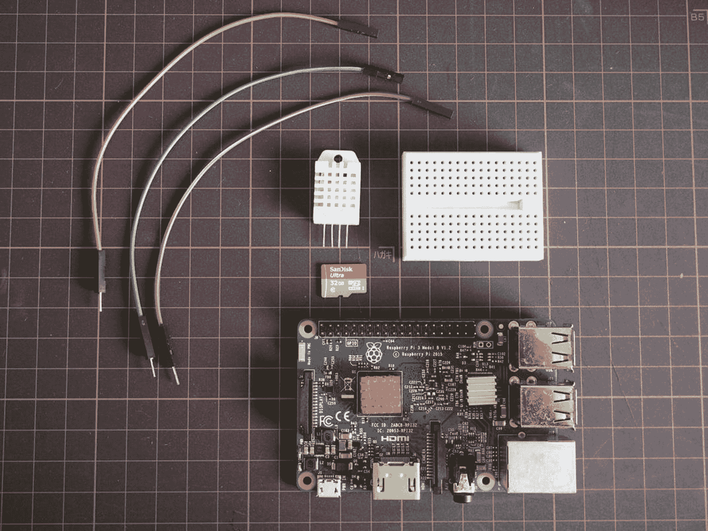

图 7-1

IOTHome 项目收集的零件


#### 组装电路

本项目的电路组装非常直接。如图 7-2 所示，你主要需要将温度传感器的 `VCC` 和 `GND` 引脚连接到树莓派上的对应引脚，然后将 `DATA` 引脚连接到树莓派上任意可用的通用输入/输出（`GPIO`）引脚。在本项目中，我选择了 `GPIO21`（引脚 40）。

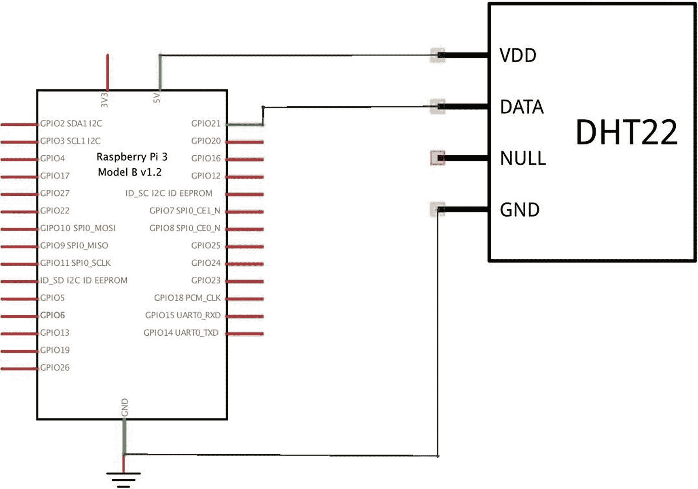

图 7-2

IOTHome 项目原理图

为了进行连接，我使用了公对母排线。我将母头端连接到树莓派的排针上，公头端插入面包板。然后，我将 `DHT22` 温度传感器直接连接到面包板。我在图 7-3 中附上了已完成电路的实物照片。同样，我使用了颜色编码的排线和面包板跳线，以便快速调试电路。

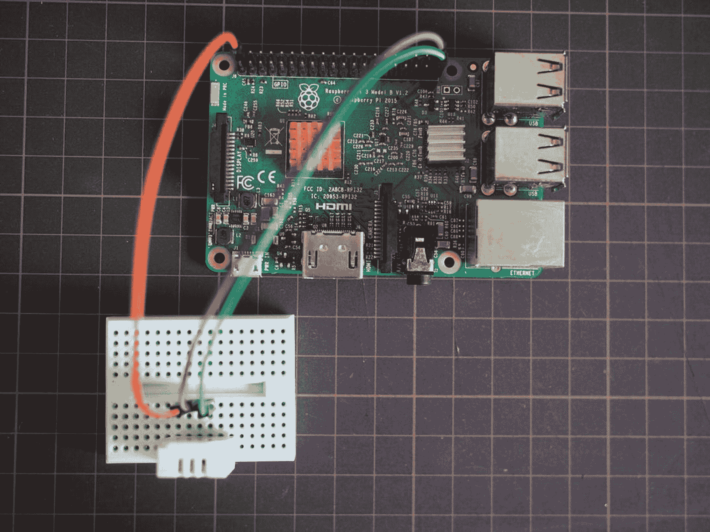

图 7-3

IOTHome 项目完成后的电路实物照片

### 引导启动树莓派

既然项目的辅助电路已经完成，你可以开始引导启动树莓派了。*引导启动*（Bootstrapping）是 Linux 和嵌入式系统中使用的一个术语，指的是准备系统以便首次启动（"自举启动"）。

正如我之前提到的，树莓派上的引导加载程序只能启动插入设备中的 microSD 卡上的任何内容。对于本项目，你将使用树莓派基金会提供的 Raspbian Linux 发行版作为树莓派的操作系统。如果你之前曾在台式电脑上使用过 Ubuntu，你会非常熟悉 Raspbian 的工作方式，因为它们共享同一个“亲戚”：Debian Linux。这两个发行版都共享与 Debian 相同的包管理器和架构，只是根据其预期用途进行了细微调整。

要安装 Raspbian，第一步是从树莓派基金会网站（`www.raspberrypi.org/downloads/raspbian/`）下载一个预构建的镜像文件，其中包含一个预构建的、可启动的 Raspbian 实例。如图 7-4 所示，从下载页面选择 Raspbian、Raspbian Stretch with Desktop，然后点击下载 ZIP。Desktop 版和 Lite 版的主要区别在于，Lite 版牺牲了 GNOME 桌面图形用户界面，仅提供命令行界面。如果你对命令行操作感到舒适，欢迎安装 Lite 版，但我推荐完整的 Desktop 版，因为 GNOME 使树莓派更易于配置，并且方便日后将其用于其他目的。

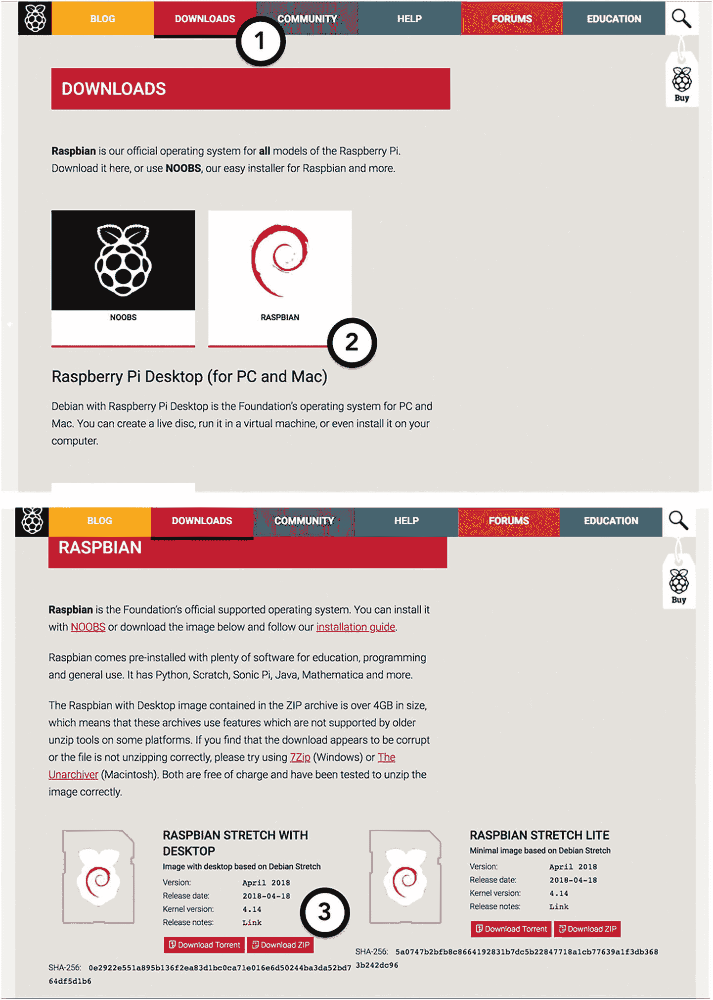

图 7-4

从树莓派网站下载 Raspbian 镜像

一旦 zip 文件下载完成，你需要将其写入 microSD 卡，方式要能让引导加载程序将其识别为有效的磁盘镜像。磁盘镜像打包了操作系统的文件以及创建者认为对镜像使用者有用的任何文档和配置文件。对于 Linux 发行版，它们提供了一种有用的方式来与最终用户共享发行版，而无需迫使他们经历一个漫长且敏感的安装过程。一位熟练的工程师会构建一个他或她认为对大多数用户来说合适的起始系统，然后进行分享。然而，如果磁盘镜像没有以正确的方式解包和安装，目标计算机将无法使用它。我倾向于用来将树莓派镜像烧录到 microSD 卡的工具是 Etcher（`https://etcher.io`）。它拥有易于理解的用户界面和高可靠性。如图 7-5 所示，安装 Etcher 后，将 microSD 卡插入 Mac 的适配器并打开 Etcher。在其单屏用户界面中，选择 Raspbian 镜像的 ZIP 文件以及对应于 microSD 卡的驱动器，然后选择“Flash!”开始镜像烧录过程。如果你的 microSD 卡没有出现在 Etcher 中，请检查 microSD 卡和适配器是否都已牢固地连接到你的 Mac。

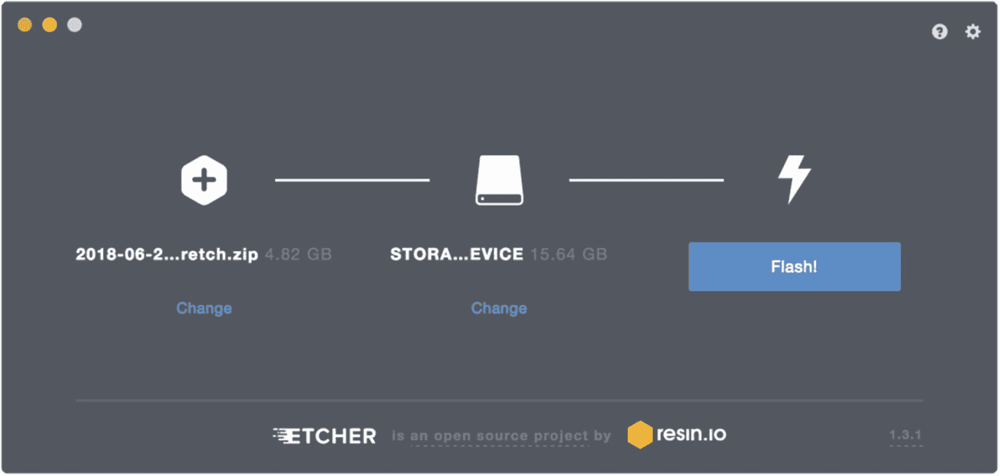

图 7-5

使用 Etcher 将 Raspbian 镜像烧录到 microSD 卡

Etcher 会播放声音并弹出一个窗口，通知你磁盘镜像已成功写入。此时，可以安全地从 Mac 上移除 microSD 卡，并将其插入树莓派底部的插槽中，如图 7-6 所示。此时，你还应将一个基于 HDMI 的显示器以及 USB 键盘/鼠标连接到树莓派。

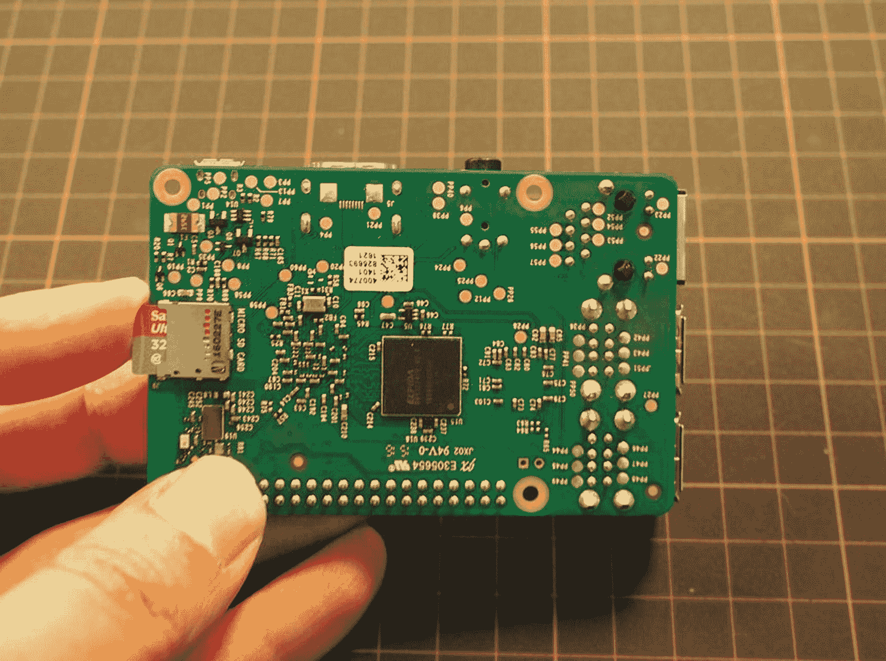

图 7-6

将 microSD 卡插入树莓派

所有准备工作完成后，将电源连接到标有 `PWR` 的 USB 端口，等待一两分钟，让 GNOME 桌面启动。当桌面准备就绪时，显示器上的图像应类似于图 7-7。

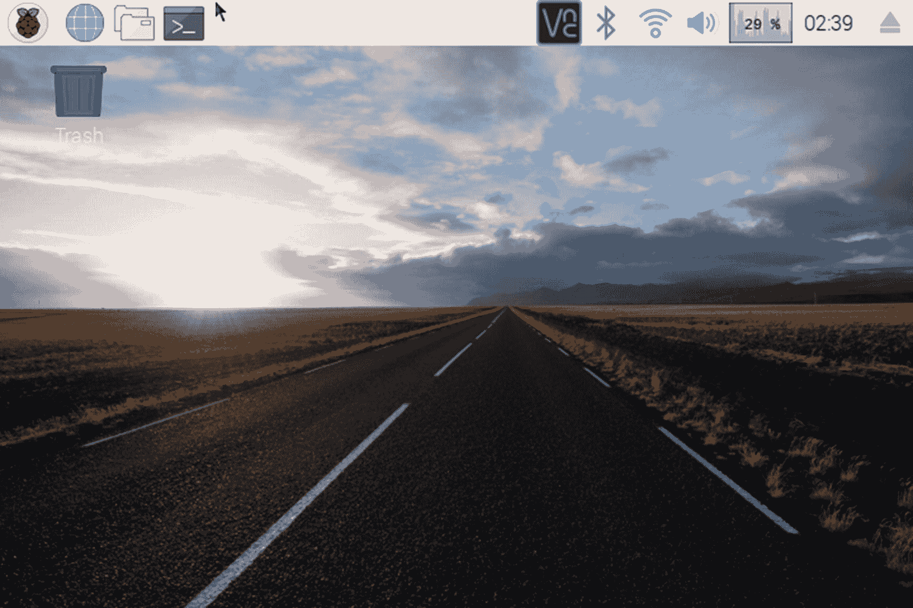

图 7-7

新安装的 Raspbian 发行版桌面截图

如图 7-8 所示，在系统托盘的右上角找到 Wi-Fi 图标，然后点击它以显示网络选择下拉菜单。选择你的网络，然后在提示时输入密码。

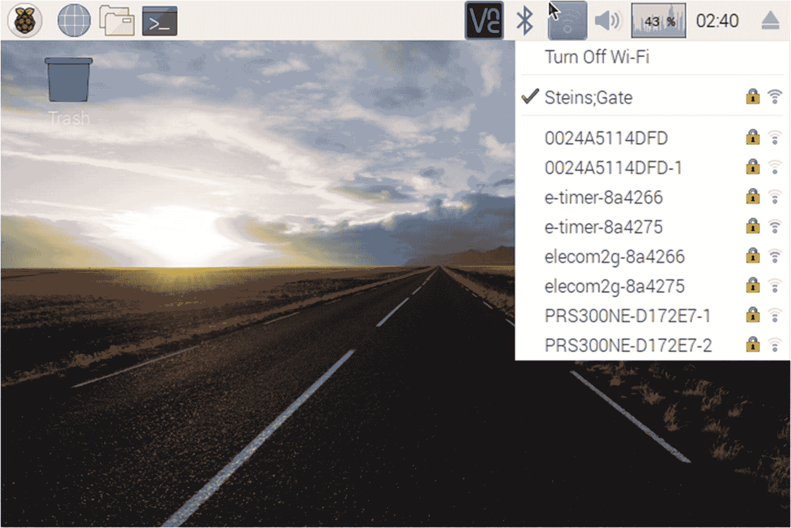

图 7-8

从 Raspbian 桌面选择 WiFi 网络

在最后的配置步骤中，你必须使用树莓派配置工具启用树莓派上的硬件接口。这将允许你访问预装在 Raspbian 中但出于安全原因默认禁用的 `I2C`、`SPI` 和其他硬件通信库。如图 7-9 所示，要找到此工具，请点击系统托盘左上角的树莓派图标，导航至“首选项”，然后选择“树莓派配置”。在弹出的应用程序中，点击“接口”选项卡，然后勾选 `SPI`、`I2C` 和 `1-Wire` 复选框以启用它们。点击“确定”后，系统将要求你重启树莓派以保存设置。

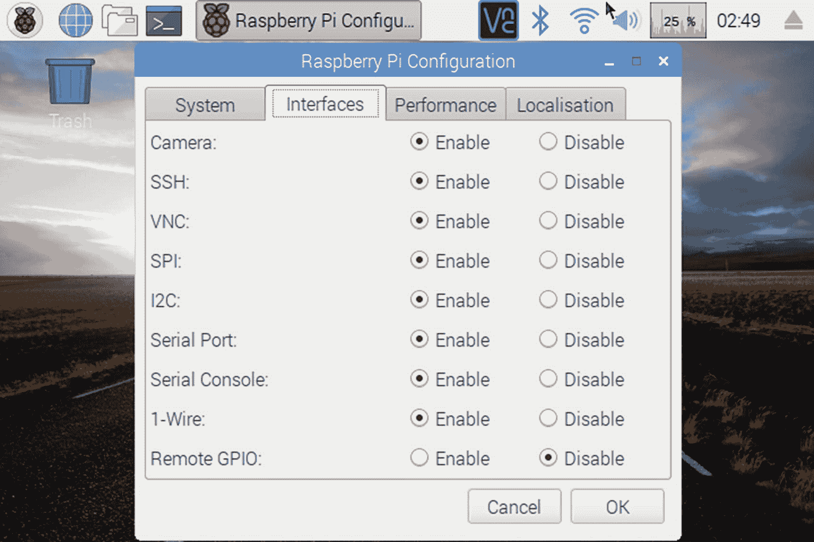

图 7-9

在树莓派上启用硬件接口

如果你想使用如 RealVNC 或 TightVNC 这样的远程桌面客户端来查看树莓派的桌面而无需连接显示器，你同样可以在配置工具中启用此功能。下次树莓派重启时，RealVNC 服务器应用程序将启动，并提示你配置设备的 VNC 设置。


### 安装 HomeBridge  

完成项目的硬件设置阶段后，现在可以将注意力转移到安装 HomeBridge 及其依赖项上，这是将树莓派用作 HomeKit 桥接器之前的倒数第二步。  

如本章开头所述，HomeBridge 及其核心依赖项 HAP-NodeJS（实现 HomeKit 配件协议的库）作为 Node.js 应用程序运行。您必须通过安装 Node.js 来开始设置此过程。尽管默认包管理器（`apt-get`）提供的 Node.js 发行版非常稳定，并且适合大多数常见用例，但 HomeBridge 需要稍新、功能更强大的 Node.js 版本，您必须自行安装。要开始此过程，请导航至 Node.js 发行版网站（[`nodejs.org/dist/`](http://nodejs.org/dist/)）并选择 Node.js 8 的最新版本（[`nodejs.org/dist/latest-v8.x/`](http://nodejs.org/dist/latest-v8.x/)）。在此目录下，您将看到几个可供下载的不同文件，它们的名称因操作系统和处理器架构而异（例如，`x86`、`ARMv6`）。这些表示所附二进制文件编译的目标平台。对于树莓派，您应搜索最新的 Linux/ARMv6L 存档。在撰写本文时，此文件的 URL 为 [`nodejs.org/dist/latest-v8.x/node-v8.11.4-linux-armv6l.tar.gz`](http://nodejs.org/dist/latest-v8.x/node-v8.11.4-linux-armv6l.tar.gz)。  

虽然您可以通过浏览器下载存档，但我建议使用 OS X 终端。默认情况下，您的树莓派会通过 Bonjour 广播其主机名（`raspberrypi.local`）。您可以在终端中尝试以 `pi` 用户登录 SSH 来连接到它。  

```
ssh pi@raspberrypi.local
```

如图 7-10 所示，连接到设备后，使用 `wget` 命令下载文件。  

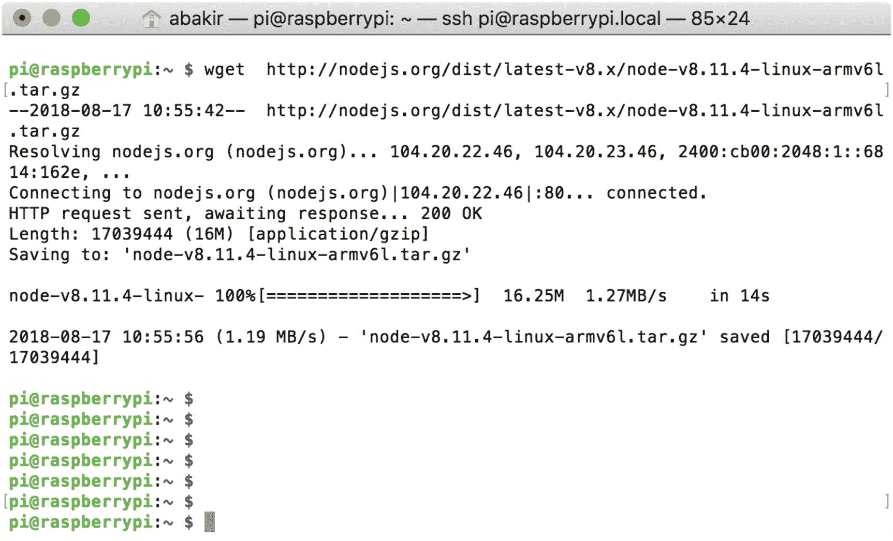  

**图 7-10** 通过树莓派终端下载 Node.js  

```
wget http://nodejs.org/dist/latest-v8.x/node-v8.11.4-linux-armv6l.tar.gz
```

### 注意  

在撰写本文时，我发现用于树莓派的 Node.js 8 二进制文件比 Node.js 9 二进制文件与 HomeBridge 及本章插件的兼容性更好。欢迎您尝试任意一个！  

下载完成后，您必须使用 `tar` 命令解压存档。对于前面提到的文件，我使用的命令是  

```
tar -xvf node-v8.11.4-linux-armv6l.tar.gz
```

解压文件后，您必须将 Node 二进制文件复制到用户安装软件的默认位置：`/usr/local`。这将允许 HomeBridge 和您以后可能编写的其他 Node 应用程序像使用由 `apt-get` 包管理器安装的软件一样使用这些二进制文件。对于我的 Node 版本，我使用以下命令来复制文件：  

```
sudo cp -R node-v8.11.4-linux-armv6l/* /usr/local/
```

您可以通过重启树莓派并尝试运行查询当前安装版本的 Node 命令来验证文件是否已正确复制：  

```
node -v
```

结果应打印出您手动下载的版本号。  

在安装 HomeBridge 之前，您必须安装它所依赖的其他几个软件包，具体来说，是最新版本的 C++、Python 开发工具、WiringPi、AVAHI、PiGPIO 和 BCM2835。这些将允许 HomeBridge 在 Node 内部与 GPIO 引脚和蓝牙交互。您可以使用 `apt-get` 包管理器轻松安装 C++ 和 Python 开发工具，如下所示：  

```
sudo apt-get install g++
sudo apt-get install libavahi-compat-libdnssd-dev
sudo apt-get install python-dev
sudo apt-get install pigpio python-pigpio
```

运行这些命令后，您必须将 PiGPIO 作为服务启用并重启 Pi，如下所示：  

```
sudo systemctl enable pigpiod.service
```

BCM2835 包是允许 WiringPi 访问树莓派上 GPIO 引脚的 C 库，必须首先安装。首先从 [www.airspayce.com/mikem/bcm2835/](http://www.airspayce.com/mikem/bcm2835/) 找到该包的最新版本，使用 `wget` 命令下载，然后像处理 Node 一样使用 `tar` 解压。  

```
wget http://www.airspayce.com/mikem/bcm2835/bcm2835-1.56.tar.gz
tar -xvf bcm2835-1.56.tar.gz
```

与 Node 不同，您必须运行 BCM2835 的构建脚本来正确安装它。按顺序运行以下命令，为您的硬件配置库、验证它，然后安装它：  

```
cd bcm2835-1.56
./configure
make
sudo make check
sudo make install
```

如果运行最后一个 `make` 命令时没有出现构建失败，则可以验证安装成功。  

要安装 WiringPi，您必须从 GitHub 下载它。您可以按照以下 `git pull` 命令从命令行执行此操作，该命令会创建项目的本地克隆：  

```
git clone git://git.drogon.net/wiringPi
```

与 BCM2835 一样，您必须运行构建脚本才能在树莓派上安装该包。对于 WiringPi，这些命令是  

```
cd wiringPi/
./build
```

要验证包是否正确安装，请尝试运行 `gpio readall` 命令以回显树莓派上所有引脚的状态。您的输出应包含一个引脚状态表，类似于图 7-11 截图中的内容。  

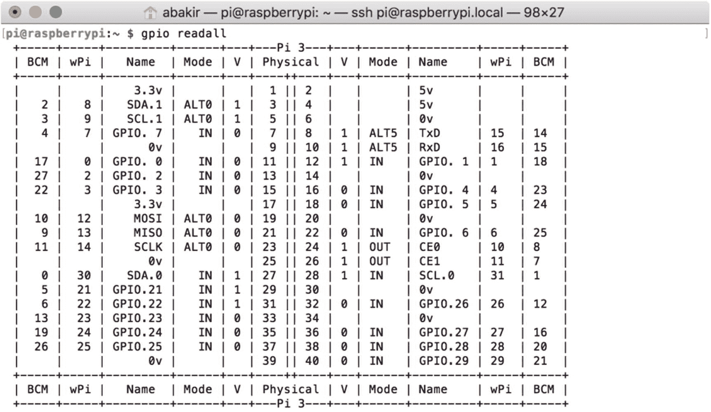  

**图 7-11** 使用 `gpio readall` 命令查询 GPIO 状态  

现在，您终于可以安装 HomeBridge 了！要安装 HomeBridge，请使用 Node 包管理器（NPM）下载它。  

```
sudo npm install -g --unsafe-perm homebridge
```

安装需要几分钟才能完成。由于 iOS 的 Home App 管理着一个 HomeKit 设备数据库，验证您是否创建了一个有效设备的最简单方法是在您想要使用的所有插件配置完毕后，尝试注册该设备。在接下来的两节中，我将解释从温度传感器和蓝牙设备（您在第 6 章中创建的门传感器）读取数据所需执行的步骤。  

### 警告  

`-g` 和 `--unsafe-perm` 标志确保 Node 包被全局安装（适用于所有应用程序），并且不限制谁可以执行它们。运行 HomeBridge 需要全局设置；但是，如果您担心家庭/办公室网络中的安全威胁，您可能需要考虑寻找非安全权限设置的替代方案。


### 配置 HomeBridge 以读取温度传感器数据

正如本章开头所述，HomeBridge 的一大优势在于它拥有一个非常活跃维护、易于使用的插件系统。要读取 DHT22 温湿度传感器的温度，可以使用 `homebridge-dht` 插件。与 HomeBridge 本身一样，它也可以作为 NPM 包使用。使用以下命令全局安装该插件：

```
sudo npm install -g homebridge-dht --unsafe-perm
```

为帮助验证 DHT22 传感器和插件是否正常工作，我建议像之前安装 Node 一样，在命令行中创建一个用于读取传感器状态的二进制文件。

```
sudo cp /usr/local/lib/node_modules/homebridge-dht/dht22 /usr/local/bin/dht22
```

与 Node 不同，你必须显式地为 `dht22` 二进制文件赋予可执行权限，才能从命令行运行它。你可以使用 `chmod` 命令配合 `a+x` 参数（添加可执行权限）来执行此操作。

```
sudo chmod a+x /usr/local/bin/dht22
```

现在，你可以使用 `dht22` 命令来验证 HomeBridge 是否能够访问传感器。要测试此功能，请尝试运行 `dht22` 命令，并指定传感器连接到 GPIO 21 引脚，如下所示：

```
dht22 -g 21
```

如果你的电路和 HomeBridge 包设置正确，终端上应打印出三个数字，分别包含读取计数、温度和湿度。对于我的传感器，结果如下：

```
0 28.2 C 41.5 %
```

### 注意

在我为此项目调试示例时，我发现此步骤中的错误大多是由于 PiGPIO 和 WiringPi 安装不完整，或 DHT22 传感器供电不足造成的。我发现 5V 电压对 DHT22 效果最好，而其较低规格的同类产品 DHT11 则在 3.3V 电压下表现更好。

在确认 DHT22 传感器和二进制文件运行正常后，你可以开始为 HomeBridge 编写配置文件。除了其插件系统外，HomeBridge 还允许你使用 JSON 文件轻松配置设备。首先，使用以下命令创建一个空配置文件：

```
mkdir .homebridge
touch .homebridge/config.json
```

HomeBridge 要求名为 `config.json` 的配置文件位于用于运行应用程序的用户账户的隐藏文件夹 `.homebridge` 中，因此请务必严格按照上述命令进行输入。

接下来，使用你喜欢的命令行文本编辑器打开 `config.json` 文件。将清单 7-1 中的文本输入此文件作为配置。

```
{
    "bridge": {
        "name": "IOTHome",
        "username": "CC:22:3D:E3:CD:31",
        "port": 51826,
        "pin": "031-45-154"
    },
    "description": "IOTHome HomeBridge",
    "platforms": [],
    "accessories": [
        {
            "accessory": "Dht",
            "name": "室内舒适度传感器",
            "name_temperature": "温度",
            "name_humidity": "湿度",
            "gpio": "21",
            "service": "dht22"
        }
    ]
}
```

*清单 7-1 HomeBridge 的配置文件 JSON（config.json）*

关于该文件，需要说明的是：`bridge` 字典指定了用于将树莓派暴露为有效 HomeKit 桥接器的值，具体包括设备名称、端口、PIN 码和 HomeKit 的"用户名"。你可以根据需要更改这些值，但要注意保持端口号和用户名的十六进制数字格式。`accessories` 字典指定了将连接到桥接器的每个配件的配置数组。具体的键值对必须来自你所用插件的文档。对于 HomeBridge 的 DHT 传感器，此文档可在 [www.npmjs.com/package/homebridge-dht](http://www.npmjs.com/package/homebridge-dht) 找到。本项目配置中特别值得关注的是 `gpio` 和 `service` 键值对。你可能已经注意到，`"gpio": "21"` 表示传感器连接到 GPIO 21 引脚；`"service": "dht22"` 键值对指定你使用的是 DHT22 传感器，而不是该系列中的其他芯片，例如 DHT11。

完成这些步骤后，温度传感器即可与你的树莓派和 HomeBridge 进行交互。如果你不希望设置与门磁传感器的蓝牙连接或设备的启动选项，可以直接跳到"连接到你的新 HomeKit 桥接器"部分，立即开始使用传感器。


### 配置 HomeBridge 以连接蓝牙低功耗配件

HomeBridge 可用的另一个强大插件是 `homebridge-bluetooth`，它允许你通过 HomeKit 连接蓝牙外设。该插件充当蓝牙客户端（例如第 6 章中的 IOTHome 应用），除了读取状态外，还可用于控制设备。这一功能让你可以询问 Siri“入户门传感器是否开着”，并根据你自建传感器传来的数据获得响应。

安装插件前，你需要解决几个依赖项。首先，通过 `npm` 安装 `node-gyp` 和 `noble` Node.js 模块。

```
sudo npm install -g --unsafe-perm node-gyp
sudo npm install -g --unsafe-perm noble
```

接下来，根据 Noble 的 GitHub 文档（`https://github.com/noble/noble`）中的提示，你必须允许非管理员账户在树莓派上使用蓝牙低功耗工具，操作如下：

```
sudo setcap cap_net_raw+eip $(eval readlink -f `which node`)
```

出于安全考虑，始终建议仅将网络和硬件访问权限锁定给受信用户。但在原型开发阶段，额外的安全措施可能会增加障碍，导致调试困难。对于计划长期使用的 HomeKit 桥接器，我建议在熟悉 HomeBridge 后撤销此设置。

现在，你终于可以使用 `npm` 安装 `homebridge-bluetooth` 了。

```
sudo npm install -g --unsafe-perm homebridge-bluetooth
```

与 `homebridge-dht` 类似，要将该插件作为桥接器的一部分使用，你需要按照开发者提供的规范（位于 `www.npmjs.com/package/homebridge-bluetooth`），将配置信息添加到 HomeBridge 配置文件（`~/.homebridge/config.json`）中。在我的实现中，我选择遵循他们的 `switch` 示例，该示例将门传感器注册为一个智能开关。虽然也有 `lock` 示例，但它主要针对控制流行的物联网智能锁。遗憾的是，IOTDoor 项目尚未满足该规范。在代码清单 7-2 中，我提供了用于门传感器的配置文件。

```
{
    "bridge": {
        "name": "IOTHome",
        "username": "CC:22:3D:E3:CD:31",
        "port": 51826,
        "pin": "031-45-154"
    },
    "description": "IOTHome HomeBridge",
    "platforms": [
        {
            "platform": "Bluetooth",
            "accessories": [
                {
                    "name": "IOTDoor",
                    "address": "30:AE:A4:28:73:76",
                    "services": [
                        {
                            "name": "Door Sensor",
                            "type": "Switch",
                            "UUID": "83b46845-6e9c-4b25-89cf-871cc74cc68e",
                            "characteristics": [
                                {
                                    "type": "On",
                                    "UUID": "4b61d6b9-2e29-4fdf-a74a-7b8bf70ecd9a"
                                }
                            ]
                        }
                    ]
                }
            ]
        }
    ],
    "accessories": [
        {
            "accessory": "Dht",
            "name": "Indoor Comfort Sensor",
            "name_temperature": "Temperature",
            "name_humidity": "Humidity",
            "gpio": "21",
            "service": "dht22"
        }
    ]
}
```
**代码清单 7-2** 包含蓝牙的 Homebridge 配置文件（`config.json`）

配置中有三个方面需要特别注意。首先，`homebridge-bluetooth` 通过 `platform` 配置而非 `accessory` 来实现其接口。

其次，为了桥接正确的蓝牙功能，你必须将 Arduino 程序中锁状态的精确服务和特性 UUID 填入 `config.json` 文件。最后，为了找到设备，你必须提供其广播时使用的名称和硬件地址。在第 6 章的 Arduino 设置代码中，你无需设置硬件地址，因为它由 ESP32 微控制器中的蓝牙低功耗模块生成。不过，你可以使用树莓派上的扫描工具来查找硬件地址。在确认你的门传感器当前未连接任何设备后，运行以下命令：

```
sudo hcitool lescan
```

输出应包含树莓派物理附近正在广播的蓝牙低功耗设备列表，如图 7-12 所示。

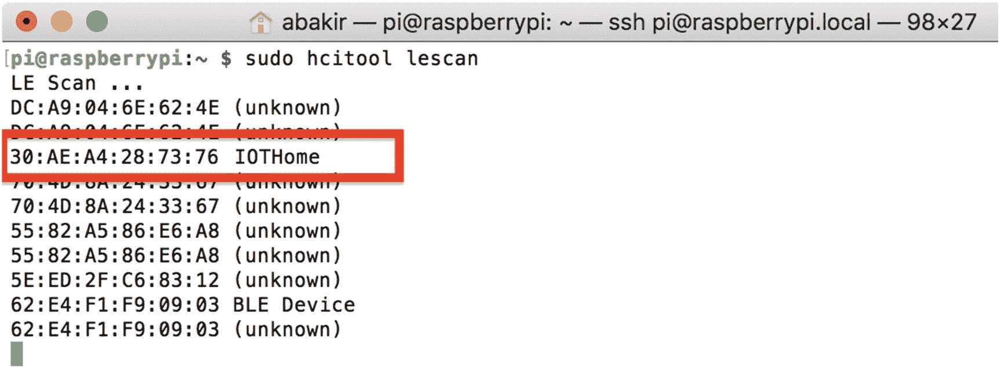

**图 7-12** 使用 `hcitool` 工具扫描蓝牙低功耗设备的结果

将 IOTDoor 传感器的十六进制硬件地址复制到 HomeBridge 配置文件中后，保存结果。至此，你的 HomeKit 桥接器已完全配置完成！


### 配置 HomeBridge 开机自启动（实验性功能）

为了让您的新 HomeKit 桥接器满足用户期望，即插电就能正常工作，您需要配置树莓派，使其在开机时自动启动 HomeBridge。我将此部分标记为实验性功能，因为在研究过程中，我发现很难找到一种既符合 Linux 管理标准、又易于解释且稳定（即每次启动均无错误）的配置方法。我在此提供的解决方案主要参考了官方 HomeBridge GitHub 文档（`https://github.com/nfarina/homebridge/wiki/Running-HomeBridge-on-a-Raspberry-Pi#running-homebridge-on-bootup`）以及 Tim Leland 的补充指南（`https://timleland.com/setup-homebridge-to-start-on-bootup/`）。根据我的实验，这些说明在经历一到两次调试会话后效果最佳。经过大量试错后，我发现稳定性开始显著下降。此时，重置树莓派并从零开始对我来说效果最好。

要开始配置过程，首先使用 `useradd` 命令创建一个名为 `homebridge` 的系统用户：

```
sudo useradd --system homebridge
```

对于启动脚本，通常的做法是使用专用的用户账户来运行。这可以让您根据预期角色来区分不同用户，并通过防止任务以完全管理员权限运行来增强安全性。

接下来，您必须指定该任务的启动选项。使用 `nano` 或您喜欢的其他文本编辑器，创建一个名为 `/etc/default/homebridge` 的新文件。

```
sudo nano /etc/default/homebridge
```

对于配置文件的内容，请使用示例 7-3。最重要的配置选项是 `HOMEBRIDGE_OPTS`，它指定了 HomeBridge 配置文件的存放位置。对于本项目，您需要将配置复制到 `/var/lib/homebridge`，以便 `homebridge` 用户可以更方便地访问。

```
# homebridge 的默认配置/选项
# 以下设置告诉 homebridge 在哪里找到 config.json 文件以及在哪里持久化数据（例如配对信息等）
HOMEBRIDGE_OPTS=-U /var/lib/homebridge
# 如果您取消注释以下行，homebridge 将会记录更多日志
# 您可以通过 systemd 的 journalctl 查看：journalctl -f -u homebridge
DEBUG=*
列表 7-3
HomeBridge 启动选项文件
```

保存启动选项文件后，您必须定义服务本身。同样，使用您喜欢的文本编辑器，创建一个名为 `/etc/systemd/system/homebridge.service` 的文件。

```
sudo nano /etc/systemd/system/homebridge.service
```

使用列表 7-4 的内容作为填充服务定义的指南。在此文件中，请注意 `User` 键（它定义了将使用哪个用户账户来运行服务）以及 `ExecStart` 键（它定义了 HomeBridge 的安装位置）。

```
[Unit]
Description=Node.js HomeKit 服务器
After=syslog.target network-online.target
[Service]
Type=simple
User=homebridge
EnvironmentFile=/etc/default/homebridge
# 根据您的具体设置进行调整（可能是 /usr/bin/homebridge）
# 更多信息请参阅下方注释
ExecStart=/usr/local/bin/homebridge $HOMEBRIDGE_OPTS
Restart=on-failure
RestartSec=10
KillMode=process
[Install]
WantedBy=multi-user.target
列表 7-4
HomeBridge 启动服务定义
```

接下来，您必须将本地的 HomeBridge 配置文件从您的 `.homebridge` 目录复制到一个专用于 `homebridge` 用户的新目录。如列表 7-5 所示，创建一个名为 `/var/lib/homebridge` 的新目录，将所有旧文件复制到那里，然后使这些文件可执行。

```
sudo mkdir /var/lib/homebridge
sudo cp ~/.homebridge/config.json /var/lib/homebridge/
sudo chmod -R 0777 /var/lib/homebridge
列表 7-5
移动 HomeBridge 配置文件
```

最后，当文件移动完成后，使用 `systemctl` 命令注册该服务。

```
sudo systemctl daemon-reload
```

至此，当树莓派开机启动时，您的 HomeBridge 安装就准备启动就绪了！


### 连接到你的新 HomeKit 桥接器

在经历了设置树莓派、HomeBridge、其插件以及创建配置文件这一漫长而艰巨的过程后，现在你终于可以启动 HomeBridge，并尝试在 iOS 的“家庭”App 中找到你的新 HomeKit 桥接器了。

首先，在你的树莓派上启动 HomeBridge。通过运行命令 `homebridge -D &`（这些选项会提供更多调试信息，并让应用在后台运行）即可完成 HomeBridge 的标准安装。如果你已经完成了启动服务的设置，那么通过运行命令 `sudo systemctl start homebridge` 即可启动。接下来，需要监控控制台输出，确保 HomeBridge 在启动过程中没有报错。对于标准安装，这些信息会在 HomeBridge 启动时显示在终端中。对于启动服务安装，你需要通过命令 `sudo journalctl -au homebridge` 来监控其状态。当 HomeBridge 成功启动后，你应该会看到日志消息，表明蓝牙和 DHT 传感器接口已成功建立，更重要的是，还会看到一个大型二维码，你可以使用它从“家庭”App 来设置桥接器，如图 7-13 所示。

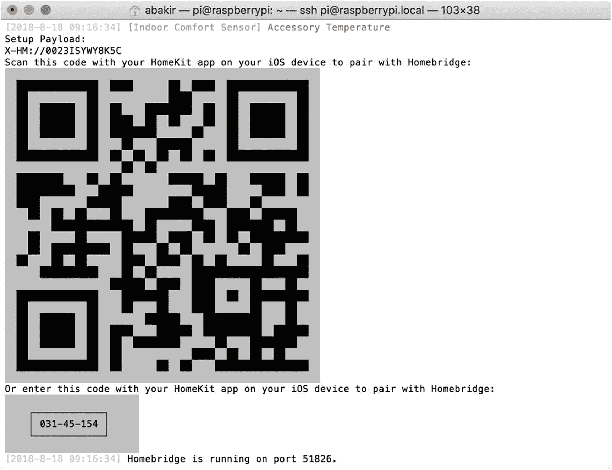

图 7-13

HomeBridge 为 HomeKit 配置生成的二维码

接下来，在你的 iPhone 或 iPad 上打开“家庭”App。它应该会以选中“家庭”标签页的状态启动，显示你当前已配置的 HomeKit 家庭和设备的概览。如图 7-14 所示，按下右上角的“添加”按钮（+ 号），然后从出现的操作列表中选择“添加配件”。这将带你进入一个带有相机视图的屏幕，你可以用它扫描 HomeKit 设置二维码。此时，扫描 HomeKit 控制台输出中显示的二维码。

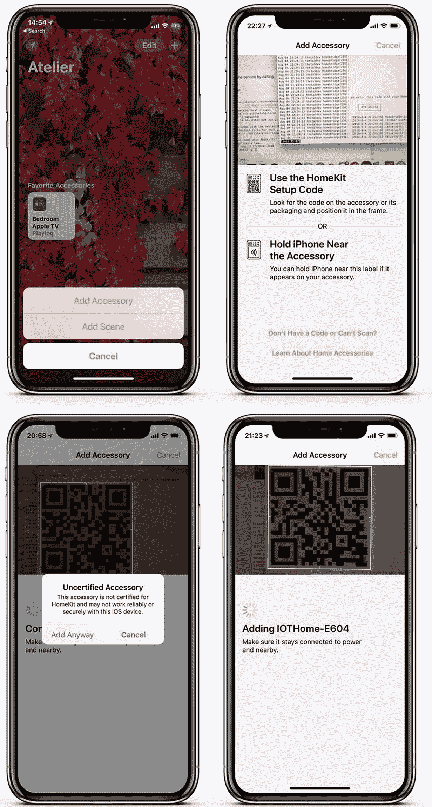

图 7-14

使用“家庭”App 添加 HomeKit 配件

当“家庭”App 识别出二维码后，你会收到一个弹出窗口，询问你是否确认要添加一个非官方的 HomeKit 设备。这表示 HomeBridge 已成功将你的桥接器作为有效的 HomeKit 设备进行广播。如果“家庭”App 无法识别你的二维码，你可以使用“添加配件”屏幕上的“没有或无法扫描代码”按钮，手动输入 HomeBridge 配置文件中的 PIN 码。如果你的设备设置正确，成功输入 PIN 码后应该能找到你的设备，并显示相同的弹出窗口。

确认你的选择后，屏幕上会出现“正在添加...”的消息，持续几秒钟，同时桥接器正在被注册到 HomeKit 数据库中。如图 7-15 所示，注册完成后，系统会要求你为通过桥接器暴露的每个服务分配房间和显示名称。针对我的配置，我将温度和湿度服务分配给了卧室，门传感器分配给了入口。这样我就可以说“入口的门开关是开着的吗？”或者“卧室的温度是多少？”。

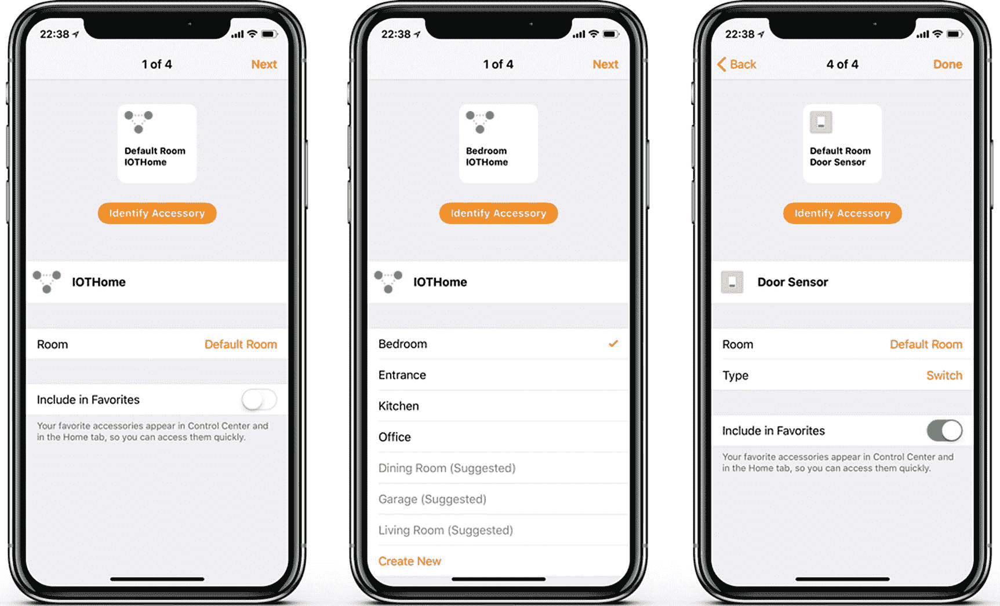

图 7-15

为新的 HomeKit 设备分配详细信息

设置完成后，你将返回到“家庭”标签页。如图 7-16 所示，该标签页现在将包含来自你 HomeKit 桥接器的服务，以及每个服务的最新数值。作为最后一项测试，说“嘿，Siri”以激活 Siri，然后询问你卧室的温度。几秒钟后，Siri 应该会读出树莓派上的最新数值。

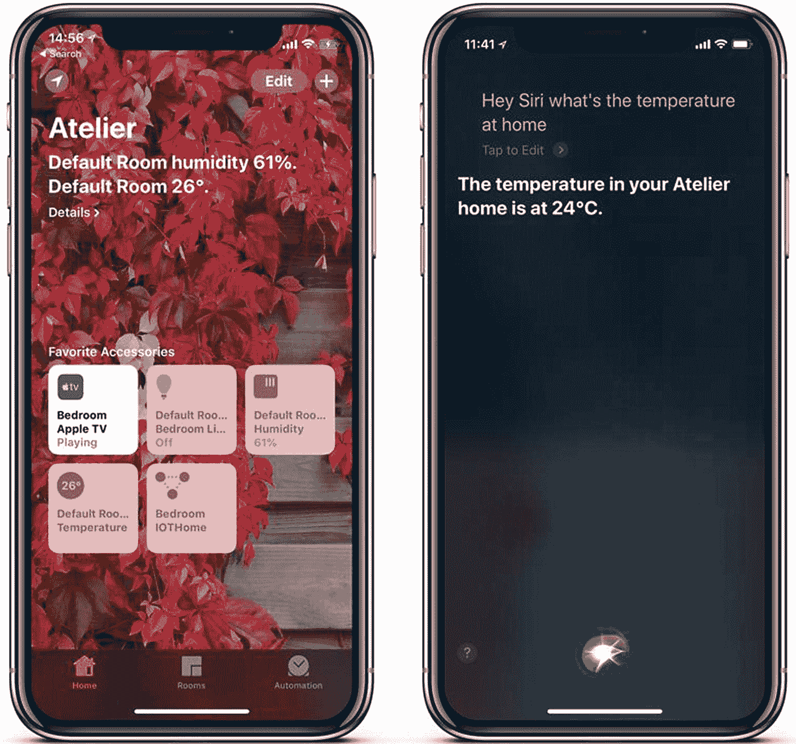

图 7-16

使用“家庭”App 和 Siri 确认 HomeKit 桥接器正常运行

### 排查配置问题

在编写本章时，我遇到的最常见的调试问题是，更改 HomeBridge 配置后，即使重启了所有设备，HomeKit 也无法找到新的服务。为了解决这个问题，我找到了两个最快捷的技巧：更改 HomeKit 桥接器的 `username`，以及清空 HomeBridge 配置目录中的 `persist` 文件夹（路径为 `~/.homebridge/persist` 或 `/var/lib/homebridge`，具体取决于你的启动方法）。

如本章开头所述，HomeKit 是一个安全的设备数据库，由你的 Apple 设备和 HomeKit 中枢管理。与此相辅相成，HomeBridge 将已保存设备的信息存放在其 `persist` 文件夹中。清空此文件夹会重置树莓派上已保存的信息。虽然你可以通过 iOS 设备上的“家庭”App 删除并重新添加设备，但你无法自行完全擦除其数据库。但是，通过更改用户名的某些字节（例如，将最后两位数字从 30 改为 31），你可以让 HomeKit 认为你正在连接一台新设备，从而允许你重新进入配置流程。

## 总结

在本章中，你学习了如何利用树莓派单板计算机的能力，运行 HomeBridge 作为一个基于 Node.js 的 HomeKit 桥接器，用于你在第 5 章和第 6 章中构建的门传感器以及温度传感器。这不仅扩展了你 IOTHome 的智能功能，还使你能够利用 Siri 命令来获取家庭传感器的统计数据。

本章最艰巨的部分是引导树莓派、HomeBridge 及其所有依赖项，但我希望你能够在自己的项目中再次使用本章作为快速设置指南。在后续章节中，你将进一步扩展树莓派的功能，将其打造成一个网络服务器。对于一台 35 美元的电脑来说，这已经很不错了！

本章中的说明是针对树莓派优化的，但稍加修改即可适用于 BeagleBone、Mac 或任何其他可以运行 Node.js 的基于 Linux 的系统。


