# Express 工作原理快速入门

Express 通过监听指定端口上的 HTTP 请求，然后根据特定的*端点*来响应这些请求。端点定义为可供 API 使用者调用的函数，由*路由*（附加到服务器地址上的路径部分）以及用于发起请求的 HTTP 方法（例如 `GET`、`POST`）共同构成。在整个 Web 应用开发过程中，你会看到这两个术语经常互换使用。为了减少混淆，我认为最清晰的解释是：*端点*主要用于描述与服务器之间的外部（面向客户端）交互，而*路由*则主要用于描述 Express 应用程序的内部逻辑。

例如，如果你想从 IP 地址为 `10.0.1.5` 的服务器获取电影标题列表，请求将是 `GET 10.0.1.5/movie/titles`。`GET` 方法通常用于读取数据。在这个例子中，路由是 `/movie/titles`，而 `GET` 是端点。在 Express 中，这个端点的代码看起来像这样：

```
app.get('/movie/titles', function (req, res) { ... }
```

另一方面，为新电影创建一条记录可能看起来像这样：`POST 10.0.1.5/movie/new`。`POST` 方法通常用于添加新记录。在数据库编程中，术语 *CRUD* 用于描述任何类型数据的四种主要操作：创建、读取、更新和删除。许多后端开发人员喜欢使用相同的模型来命名他们的路由，他们会在路由后面附加 `/new`、`/delete` 或 `/update`，以表示这是一个创建、更新或删除操作。在 Express 中，这个端点的代码将是：

```
app.post('/movie/now', function (req, res) { ... }
```

正如你所看到的，在 `app` 对象上调用的方法以及路由的字符串都发生了变化。

最后，另外两个最常用的 `HTTP` 方法是 `PUT` 和 `DELETE`，它们用于更新和删除记录。在本章中你不会用到它们，但它们在未来的个人项目中可能会对你有帮助。

默认情况下，当你在浏览器中加载一个网页时，浏览器会尝试向服务器文档根目录的 TCP 端口 80（为 HTTP 流量保留的端口）发起一个 `GET` 请求。要在 Express 中表示这一点，请在你的对象上使用 `get()` 方法，来指定应为根目录执行的代码。要让 Express 监听请求，请使用 `app` 对象上的 `listen()` 方法。路由和监听器的实现都显示在清单 8-3 中。

```
var express = require('express');
var app = express();
app.get('/', function (req, res) {
res.send('Hello World');
});
app.listen(3000);
清单 8-3
创建一个新的基于 Express 的 Node 应用程序
```

在这个例子中，我指示 Node 在收到对文档根目录的 `GET` 请求时发送文本 `Hello World`。`res` 对象内置于 Node 中，它指定了你希望以 HTTP 响应的形式输出内容。在这个例子中，我让 Express 监听端口 3000 而不是标准的 HTTP 端口 80，因为 Node 将端口 80 视为*特权*端口。除非你以 root 或系统用户帐户登录，否则无法通过此端口运行应用程序。在本节稍后部分，你将切换到端口 80，但对于初始测试，最好使用非特权端口。

要验证 Express 应用程序是否正常工作，你必须先告诉 Node 开始执行新脚本，然后尝试从 Web 浏览器发起请求。

在启动服务器之前，你必须获取树莓派的 IP 地址。在终端内部，使用 `ifconfig` 命令查看设备信息。如图 8-1 所示，IP 地址将出现在 `inet` 字段旁边，位于 `wlan0` 接口（代表内置的 Wi-Fi 接口）的记录下方。

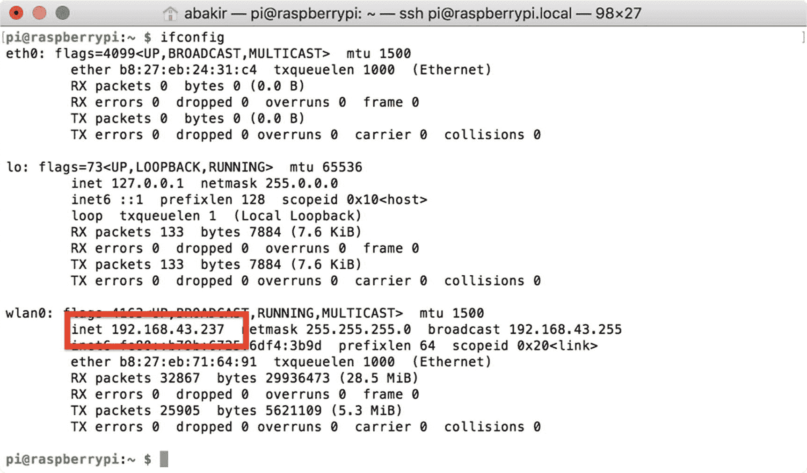

图 8-1

获取树莓派的 IP 地址

接下来，通过调用 `node` 命令并指定脚本的文件名，开始执行 Node 应用程序。

```
node app.js
```

最后，在网络中的另一台计算机上打开你最喜欢的浏览器，输入树莓派的 URL，并附上端口号（3000）。你的 `"Hello World"` 字符串应该以纯文本形式出现在浏览器中，如图 8-2 所示。

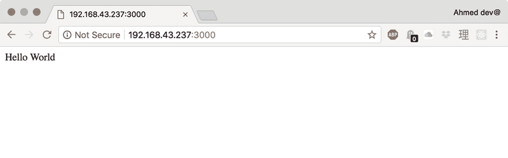

图 8-2

在浏览器中验证 Hello World 示例

恭喜你创建了第一个 Node 应用程序！它会持续运行，直到你在树莓派上终止 Node 进程。


### 从 DHT 温湿度传感器读取数值

现在你已经掌握了添加 Node 模块和 Express 路由的方法，可以开始完善你的简单示例，通过 HTTP 来模拟温湿度传感器的状态。首先，在终端中输入`Ctrl+C`停止 Node.js，然后使用`npm`安装`node-dht-sensor`模块。

```
npm install node-dht-sensor
```

在我的示例中，我认为使用`temperature`路径扩展来表示温湿度传感器是合理的。如代码清单 8-4 所示，在应用中引入`node-dht-sensor`模块，并为`temperature`路径扩展添加一个用于处理`GET`请求的路由和端点。

```
var express = require('express');
var dht = require('node-dht-sensor');
var app = express();
app.get('/temperature', function (req, res) {
//你精妙的代码将放在这里
});
app.listen(80);
代码清单 8-4
为温湿度传感器定义一个新路由
```

此时，我建议做两处修改：移除前面示例中的端点，并将端口改为 80。许多 Web 服务器因调试端点未关闭而容易被入侵。警惕的代码维护是降低应用中此类风险的简易方法。使用端口 80 还能让你的服务器更符合 HTTP 规范，该规范规定 HTTP 流量在 TCP/IP 端口 80 上传输。

接下来，你必须使用`node-dht-sensor`模块从传感器获取数据。查阅该模块在其 GitHub 仓库（ [`https://github.com/momenso/node-dht-sensor`](https://github.com/momenso/node-dht-sensor) ）中的文档，你将了解到可以通过调用`dht`对象上的`read()`方法来执行此操作，指定传感器类型（DHT22 为`22`，DHT11 为`11`）、数据线所连接的通用输入/输出（GPIO）引脚号，以及一个在读取完成时执行的回调函数。在我第 7 章的示例中，为 DHT22 传感器使用了 GPIO 21。在代码清单 8-5 中，我扩展了示例，加入了从温湿度传感器读取数据的功能。

```
var express = require('express');
var dht = require('node-dht-sensor');
var app = express();
app.get('/temperature', function (req, res) {
dht.read(22, 21, function(err, temperature, humidity) {
res.type('json');
if (!err) {
res.json({
'temperature': temperature.toFixed(1),
'humidity':  humidity.toFixed(1)
});
} else {
res.status(500).json({error: '无法访问传感器'});
}
});
});
app.listen(80);
代码清单 8-5
从 Node 应用读取 DHT22 数据
```

在这个例子中，你会注意到我对`res`对象使用了`json()`方法来返回温湿度数据。虽然纯文本对于`Hello World`示例已经足够，但使用 JSON（JavaScript 对象表示法）是在 Web 应用开发中表示字典和层级数据广泛采用的做法。此外，如今大多数 Web 和移动框架都提供了内置的 JSON 验证和编码/解码功能，使其比自定义数据类型更容易使用。基于同样的逻辑，你会注意到我还使用了`status()`方法来将错误作为标准的 HTTP 500 服务器错误返回。这允许你利用内置的 HTTP 错误处理。

接下来，你需要重启 Node 应用。终止现有进程，然后以超级用户权限再次运行脚本。

```
sudo node app.js
```

#### 提示

如果你希望 Node 应用在源代码更改时自动重启，我建议了解`nodemon`工具，它可通过`npm`和 GitHub（ [`https://github.com/remy/nodemon`](https://github.com/remy/nodemon) ）获取。虽然这个工具在开发阶段很方便，但我建议在生产环境中禁用它。

要验证新路由是否正常工作，请在 Web 浏览器中尝试加载它，方法是在旧 URL 后附加`/temperature`。你应该会收到一个包含 JSON 编码的温湿度数据的纯文本响应，如图 8-3 所示。

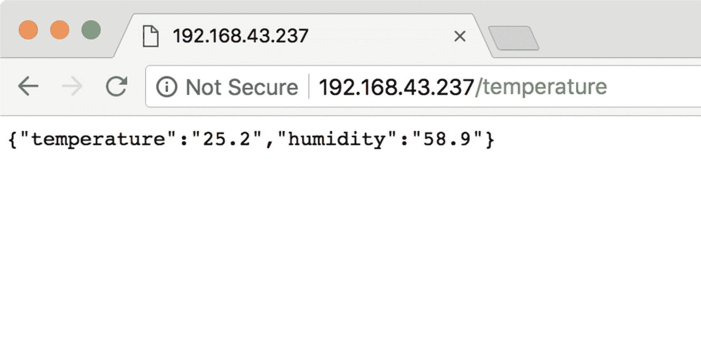

图 8-3

在浏览器中验证温湿度路由

### 注意

DHT22 温湿度传感器需要大约两秒钟才能获取准确的读数。如果在访问`temperature`路由时遇到数据陈旧或超时的情况，请记住这一点。


### 从蓝牙设备读取信息

在上一节中，你通过 Node 应用直接读取温度传感器的数据，并使用 Express 进行响应，从而通过 HTTP 公开了该数据。在本节中，你将通过 HTTP 公开蓝牙门传感器的数据，方法是让 Node 应用充当蓝牙中央管理器，并使用适用于 Node 的 `Noble` 模块（[`https://github.com/noble/noble`](https://github.com/noble/noble)）。你可能还记得前几章的内容，蓝牙通信中风险最高且最耗时的部分之一就是发现设备并建立连接以接收数据。为了简化此操作，在本节中，你将添加用于管理连接状态的端点，并根据最后一次更新传输数据（而不是在每次请求数据时都建立新连接）。

首先，你必须使用 `npm` 包管理器将 `Noble` 添加到项目中。

```
npm install noble
```

接下来，你必须修改 Node 应用，以包含 `Noble` 以及门传感器的蓝牙服务和特征 UUID，如代码清单 8-6 所示。与前几章的应用一样，你需要使用这些值来帮助识别设备及其数据通知。

```
var express = require('express');
var dht = require('node-dht-sensor');
var noble = require('noble');
var app = express();
const LOCK_SERVICE_UUID = "4fafc2011fb5459e8fccc5c9c331914b";
const BATT_SERVICE_UUID = "0af2d54c4d334fc79e34823b02c294d5";
const LOCK_CHARACTERISTIC_UUID = "beb5483e36e14688b7f5ea07361b26a8";
const BATT_CHARACTERISTIC_UUID = "134c298f7d6b4f6484968965e0851d03";
...
代码清单 8-6
将 Noble 和蓝牙 UUID 添加到 Node 应用
```

请记住：这些 UUID 在第六章中定义为唯一的随机十六进制值，用于标识设备。与第六章的蓝牙应用以及第七章的 HomeBridge 配置一样，你需要这些值来查找和识别设备。由于这些值在应用执行期间不会改变，你可以使用 `const` 关键字将它们定义为常量。

与连接蓝牙或 I2C 等硬件协议类似，基于流程的 Web 服务器操作（例如创建新用户账户）通常要求客户端开发人员（例如移动应用开发人员、前端 Web 开发人员）遵循指定的 API 调用流程来完成操作。对于 IOTHome Node 应用，客户端开发人员必须先向 `/door/connect/` 端点 `POST` 请求，然后才能尝试从设备请求数据。同样，在他们完成会话后，必须向 `/door/disconnect/` 端点 `POST` 请求，以关闭连接并允许其他应用程序使用该硬件。

在我的实现中，我决定从 Express 端点启动连接过程。在代码清单 8-7 中，我扩展了 Node 应用，使其包含一个 `/door/connect/` 端点，该端点使用 `Noble` 扫描门传感器。在这个例子中，我还保存了对 Express 中 `response` 对象的引用，以便在建立蓝牙连接的同时完成 HTTP 请求。

```
var response;
...
app.post('/door/connect', function (req, res) {
console.log("start connect");
response = res;
noble.startScanning();
});
...
noble.on('discover', function(peripheral) {
console.log("discovered");
console.log("peripheral name "+peripheral.id+" "+peripheral.address + " | " + peripheral.advertisement.localName);
var advertisement = peripheral.advertisement;
if (PERIPHERAL_NAME == advertisement.localName) {
noble.stopScanning();
console.log('peripheral with name ' +
advertisement.localName + ' found');
console.log('ready to connect');
}
});
代码清单 8-7
使用 Noble 发现蓝牙外设
```

连接的安排起初可能看起来有点奇怪。在门传感器的 Arduino 代码中，你必须实现完成处理程序来推进蓝牙服务器的连接流程。在 iOS 应用中，你必须实现委托方法。要使用 `Noble` 接收消息，你必须响应 `discover` 事件，这些事件是通过发起设备扫描触发的。要实现高效的蓝牙低功耗连接过程，你应该只扫描广播了你所需服务的设备。然而，在编写本文时，我注意到指定服务 UUID 的 `scan` API 的结果难以预测，因此，我决定改为根据设备广播数据中指定的名称来过滤已发现的设备。

在确认设备在范围内后，你必须尝试连接它。在代码清单 8-8 中，我扩展了应用以包含连接过程。就像在 iOS 上实现蓝牙中央管理器时一样，在找到设备后，你必须连接它并保存对其的引用，以便稍后可以断开连接。

```
...
var savedPeripheral;
...
noble.on('discover', function(peripheral) {
console.log("discovered");
var advertisement = peripheral.advertisement;
if (PERIPHERAL_NAME == advertisement.localName) {
noble.stopScanning();
console.log('attempting to connect');
connect(peripheral);
}
});
function connect(peripheral) {
peripheral.connect(function(error) {
if (error) {
console.log('error = ' + error);
response.status(500).json({error: 'Could not
find sensor'});
} else {
console.log('connected');
response.json({'status': 'connected'});
savedPeripheral = peripheral;
}
});
}
代码清单 8-8
使用 Noble 连接蓝牙外设
```

连接过程的最后一步是，你必须找到要观察的数据的特征并设置其完成处理程序。在代码清单 8-9 中，我调用了 `discoverAllServicesAndCharacteristics()` 方法，然后仅订阅与所需 UUID 匹配的特征的事件。

```
function connect(peripheral) {
peripheral.connect(function(error) {
if (error) {
...
} else {
...
discoverServices();
}
});
}
function discoverServices() {
if (savedPeripheral) {
savedPeripheral.discoverAllServicesAndCharacteristics(
function(error, services,  characteristics) {
if (error) {
console.log('error  = ' + error);
}
console.log('services = ' + services);
console.log('characteristics = ' + characteristics);
for (characteristic in characteristics) {
if (characteristic.uuid ==
LOCK_CHARACTERISTIC_UUID ||
characteristic.uuid == BATT_CHARACTERISTIC_UUID) {
observeCharacteristic(characteristic);
}
}
});
}
}
function observeCharacteristic(characteristic) {
//Fires when data comes in
characteristic.on('data', (data, isNotification) => {
console.log('data: "' + data + '"');
lastUpdateTime = date.getTime();
if (characteristic.uuid == BATT_CHARACTERISTIC_UUID) {
batteryStatus = data;
}
if (characteristic.uuid == LOCK_CHARACTERISTIC_UUID) {
lockStatus = data;
}
});
//Used to setup subscription
characteristic.subscribe(error => {
if (error) {
console.log('error setting up subscription = ' + error +
'for uuid:' + characteristic.uuid);
} else {
console.log('subscription successful for uuid:' +
characteristic.uuid);
}
});
代码清单 8-9
使用 Noble 观察和响应特征更新
```

订阅过程通过 `subscribe` 方法启动，但数据必须通过 `on` 方法进行观察。由于让用户等待直到第一次更新传递是不切实际的，因此我将值保存到稍后可以查询的全局变量中。


### 注意

在研究本章内容时，我注意到树莓派上的蓝牙工具在进行多次连接调试后，会无法维持连接。如果你的门磁传感器无法通过其蓝色状态 LED 灯报告连接成功，请尝试重启树莓派，然后再次尝试。

要使用 HTTP 暴露数据，请创建一个 `/door/status` 端点。当该端点被调用时，返回全局变量中保存的值，并将其包装在 JSON 字典中，如清单 8-10 所示。为了强制实施 API 的连接流程，如果设备连接尚未建立，则返回一个错误。

```
app.get('/door/status', function (req, res) {
console.log("开始连接");
if (savedPeripheral) {
res.json({
'lockStatus': lockStatus,
'batteryStatus': batteryStatus,
'lastUpdateTime': lastUpdateTime
});
} else {
res.status(500).json({error: '未连接至传感器。请重新连接后重试。'});
}
});
清单 8-10
使用 Noble 从蓝牙外设读取数据
```

为了完善 Node 应用程序，你必须创建 `/door/disconnect/` 端点。如清单 8-11 所示，在我的实现中，当该端点被调用时，我会断开与设备的连接。为安全起见，我还会停止扫描 BLE 设备，以防在连接完全建立之前调用了此方法。

```
app.post('/door/disconnect', function (req, res) {
noble.stopScanning();
console.log("停止扫描");
if (savedPeripheral) {
console.log('已断开连接');
savedPeripheral.disconnect();
}
res.json({
'status': '已断开连接'
});
});
清单 8-11
使用 Noble 断开与蓝牙外设的连接
```

在继续之前，你可能想知道如何测试基于 `POST` 的端点。对于此任务，我建议从 [`www.getpostman.com/`](http://www.getpostman.com/) 下载 Postman OS X 应用程序。如图 8-4 所示，配置好请求后，只需单击“发送”按钮即可开始调试会话。请求的结果将出现在窗口底部的大文本字段中。你可以从窗口左侧的侧边栏访问历史请求列表（及其配置）。

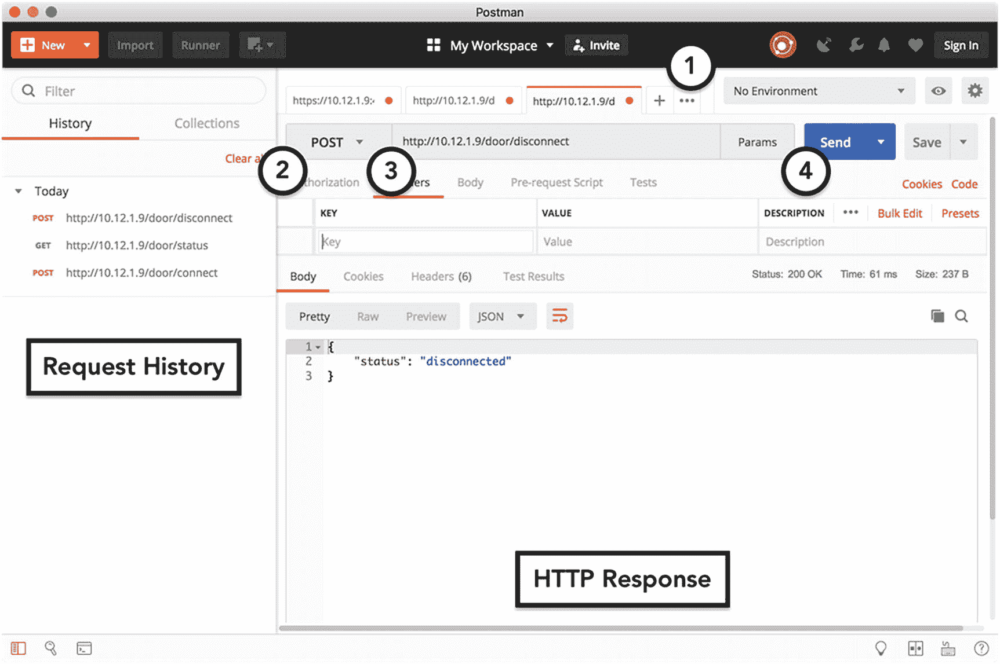

图 8-4

使用 Postman 验证 `POST` 请求

### 使用 HTTPS 提供安全的 HTTP 连接

为了提升用户数据的隐私性并减少互联网上的钓鱼（虚假身份）攻击，自 2016 年起，苹果、谷歌及其他主要科技公司宣布其平台将主要转向支持实现 HTTPS 的服务器。HTTPS 是 HTTP 的扩展，要求所有数据都使用传输层安全性协议进行加密。TLS 通过向服务器添加安全套接层证书来实现，该证书需由主流浏览器及你的平台（例如 iOS）所信任的提供商签发的 SSL 证书。

在谷歌 Chrome 浏览器中，不使用 HTTPS 最明显的影响之一是，你的网站在谷歌搜索排名中会显示得更靠后。此外，带有不受信任 TLS 证书的网站将被标记为`不安全`，并在浏览器中加载时向用户显示警告页面。在 iOS 中，苹果通过使应用程序内的所有 HTTP 请求失败来强制执行 HTTPS，除非开发者手动重新启用它们。此外，所有不受信任的 HTTPS 请求也会失败。

为了解决这些限制并提高 IOTHome 设备的安全性，你应该扩展 Node 应用程序以支持 HTTPS。与该项目中的其他功能类似，你可以利用为 Web 应用程序开发的 Node 模块和工具，轻松地为 IOTHome 项目添加 HTTPS 支持。

在你的项目中实现 HTTPS 主要有三种选择。

1. 如果你为生产环境进行开发，你必须向受互联网工程任务组（即维护 HTTPS 标准的组织）信任的服务商请求 SSL 证书。我推荐使用 Comodo、Verisign，或来自亚马逊云服务的证书。这些提供商提供的证书兼容性最好，并附有清晰的说明和支持。

2. 如果你想开发一个生产级别的原型并且已拥有域名，你可以使用 Let’s Encrypt 信任机构（ [`www.letsencrypt.org`](http://www.letsencrypt.org) ）及其配套工具 `certbot-auto` ( [`https://certbot.eff.org/docs/install.html`](https://certbot.eff.org/docs/install.html) )，为测试生成免费的受信任 SSL 证书。

3. 仅用于原型开发目的，你可以在树莓派上使用 OpenSSL 自行生成 SSL 证书。

就本书而言，我选择了选项 #3。如果你想使用选项 #1 或 #2，我建议在你域名所关联的服务器上创建这些证书，然后将其复制到树莓派上（前提是你的 SSL 提供商允许此功能）。


### 生成 OpenSSL 自签名 SSL 证书

使用 OpenSSL，您可以充当自己的信任提供者，生成满足 HTTPS 基本加密要求的 SSL 证书。这被称为*自签名证书*。由于它不是由我上述提到的受信任供应商生成的，大多数浏览器和 iOS 最初会拒绝它，直到您执行一些步骤使其在设备上受信任，我将在您完成证书生成后对此进行说明。

如果您曾经创建过 Apple Developer Program iOS 开发证书或推送通知证书，那么您已经熟悉生成 SSL 证书的流程（尽管交付方式不同）。在 Apple 的模型中，您需要创建一个私钥（一个唯一的十六进制值，用作通信加密/解密的基础），使用`钥匙串访问`工具创建一个证书签名请求 (CSR) 文件，作为您申请新证书的凭证，然后将该 CSR 文件提交给 Apple 的网站，一旦您的请求被处理，该网站将刷新并提供一个新的 SSL 证书供您下载。

使用 OpenSSL，您可以完全控制此流程，甚至可以导入现有的私钥或将 CSR 交给其他服务。不过，对于本项目，您将充当自己的证书颁发机构 (CA)，因此您不需要外部 CA；您只需创建一个私钥和一个证书即可。要在 OpenSSL 中通过一条命令完成此操作，请输入以下命令：

```
openssl req -x509 -nodes -days 365 -newkey rsa:2048 -keyout express.key -out express.crt
```

上述命令指定您要创建一个基于 RSA 2048 位加密的私钥，以及一个基于该密钥的证书，该证书有效期为 365 天。与您的 iPhone 开发者证书一样，请确保保存好私钥，不要与他人分享。丢失密钥将导致无法使用该证书。分享密钥则会使他人能够破解您的加密。

现在您已经有了有效的 SSL 证书，可以开始在 Node 应用程序中使用它了。首先，将 `https` 和 `fs`（文件系统）模块添加到您的项目中，如清单 8-12 所示。这些模块随标准 Node.js 发行版提供，无需任何额外的安装步骤。

```
var express = require('express');
var dht = require('node-dht-sensor');
var fs = require('fs');
var https = require('https');
var app = express();
app.get('/temperature', function (req, res) {
...
});
清单 8-12
向 Node 项目添加 https 和 fs 模块
```

在本章前面部分，使用了 `app.listen(80)` 来指示 Express 监听 80 端口上的 HTTP 流量。要使用 HTTPS 替代 HTTP，您必须禁用此行代码，转而指示一个 `https` 对象来监听流量。要初始化 `https` 对象，您需要向其提供 SSL 证书及其在 Raspberry Pi 上的私钥路径。如果您使用 Let's Encrypt 生成这些文件，它们将位于 `certbot-auto` 工具输出的文件夹下。如果您使用自己的供应商生成 SSL 证书，则必须将这些文件保存到 Raspberry Pi 上，可以通过 Pi 上的 Chromium 浏览器下载，或者配置另一个工具（如 `avahi-daemon`）来帮助您的 Mac 通过 Bonjour 发现 Raspberry Pi。

在确认了 SSL 证书和私钥的位置后，创建一个字典来存储文件路径，并初始化一个新的 `https` 对象，如清单 8-13 所示。

```
var express = require('express');
var dht = require('node-dht-sensor');
var fs = require('fs');
var https = require('https');
var app = express();
var sslOptions = {
key: fs.readFileSync('express.key'),
cert: fs.readFileSync('express.crt')
}
https.createServer(sslOptions, app);
https.listen(4443);
//app.listen(80);
app.get('/temperature', function (req, res) {
...
});
清单 8-13
配置 Node 项目以使用 HTTPS 替代 HTTP
```

与之前的 HTTP 示例类似，对于首次 HTTPS 测试，我建议监听 4443 端口上的流量，而不是 HTTPS 的保护端口 443。要测试您的 SSL 配置是否成功，请终止旧的 Node 进程并重新加载应用程序的文件。如果加载 SSL 证书时出现问题，此时您将在终端中看到一条错误消息，类似于图 8-5 中的示例。由于这些都是成熟的技术，您可以根据这些错误消息找到大量数据，帮助您解决 OpenSSL 和 Node HTTPS 问题。

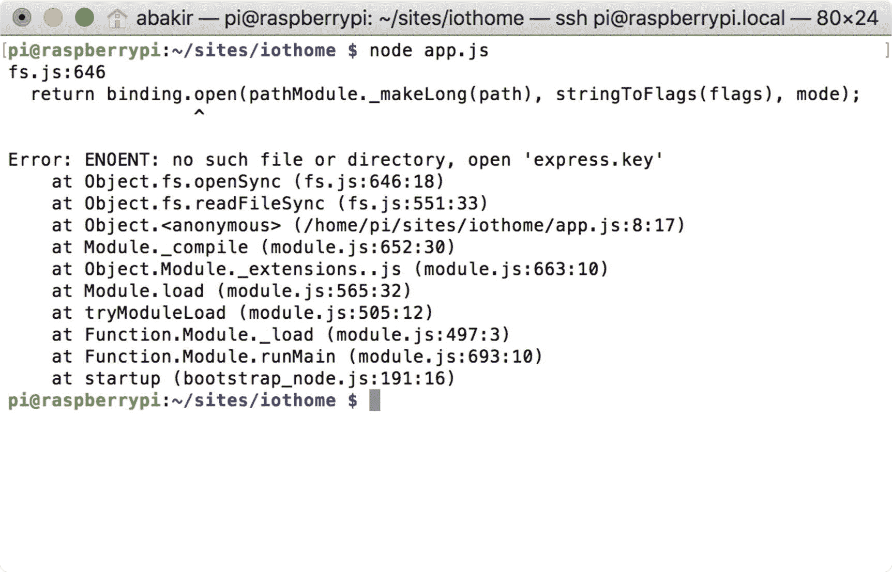

图 8-5：Node HTTPS 配置失败的示例错误消息

接下来，更改 `/temperature` 端点的 URL，使其包含端口号 4443 并将协议改为 `https`。尝试在浏览器中加载该 URL。如果您使用 Google Chrome，您将收到一个关于该页面不安全的的安全警告，类似于我在图 8-6 中收到的警告。

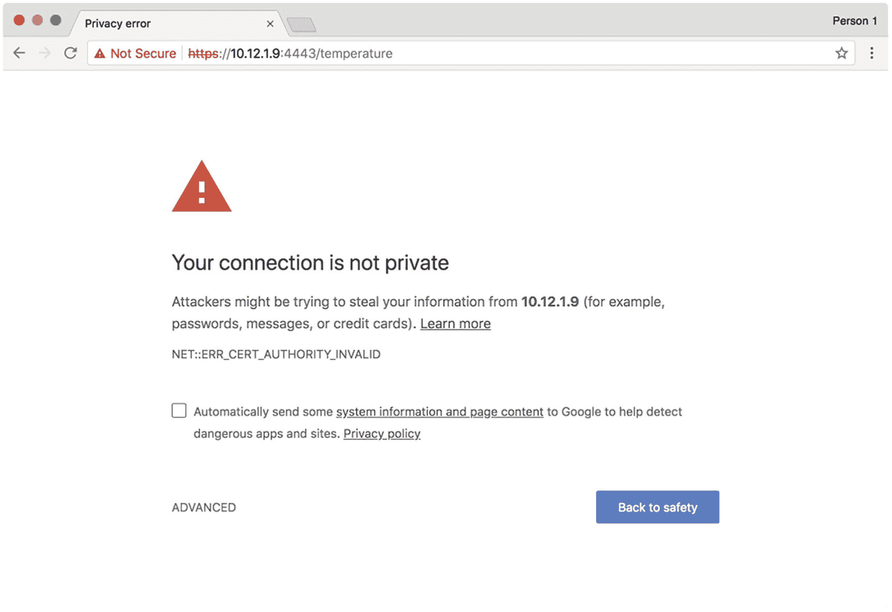

图 8-6：Google Chrome 针对包含不受信任 SSL 证书页面的警告

要解决此错误，请点击页面底部的“高级”链接，然后点击“继续前往…”链接，如图 8-7 所示。

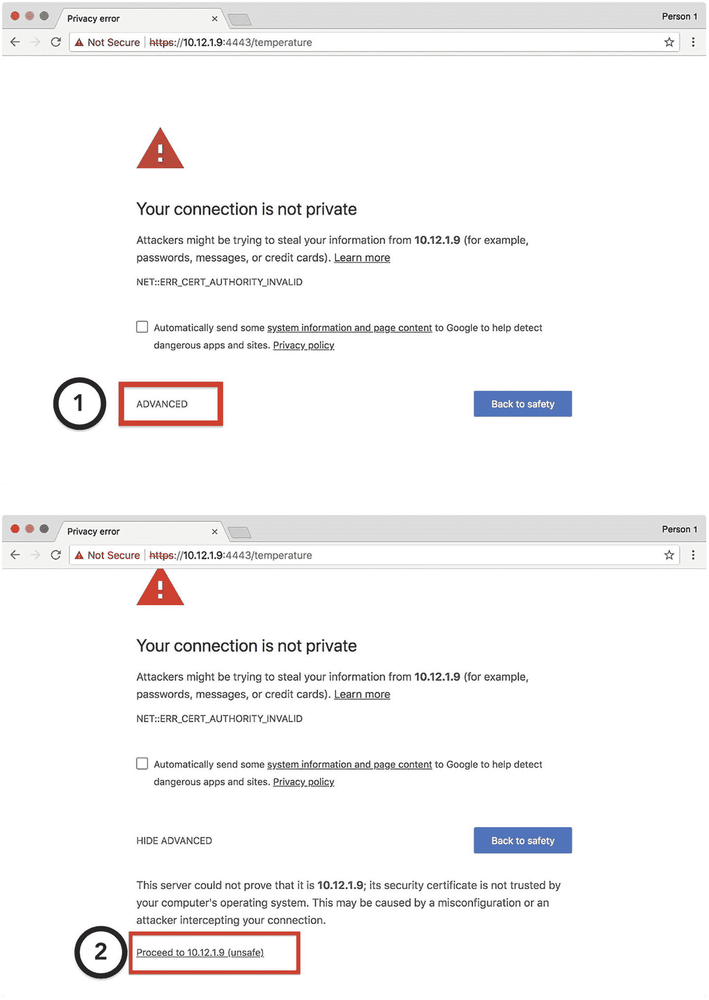

图 8-7：在 Google Chrome 中启用对页面的信任

在确认要加载该页面后，您现在应该能够在浏览器中看到温度 JSON 数据，就像之前通过普通 HTTP 暴露该数据时一样。

此时，您可以安全地将应用程序改为监听 443 端口。只需记住，您需要以超级用户身份运行 Node，并且您需要在 Chrome 中信任 `:443` 端点。对于发往 443 端口的 HTTPS 请求，您无需在 iOS 或 Web 浏览器中追加端口号。

要让 Postman 连接到自签名证书，请点击屏幕右上角的扳手图标，如图 8-8 所示，然后将“SSL certificate verification”设置为 OFF。

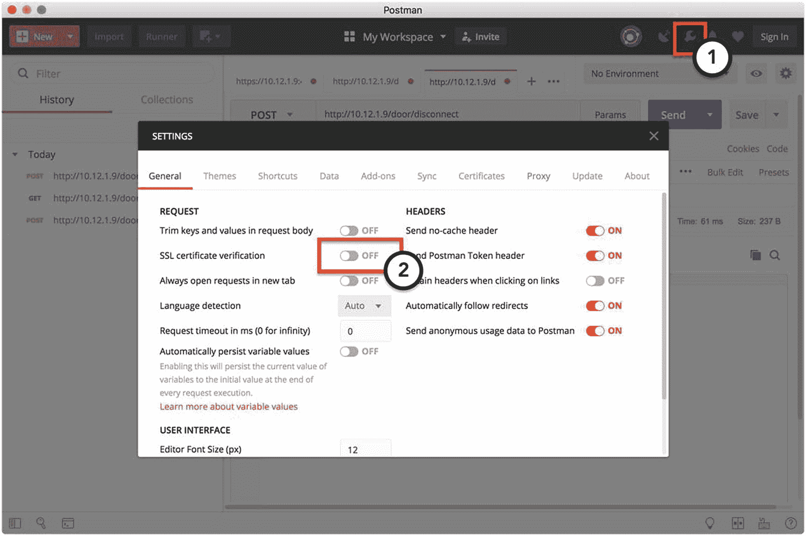

图 8-8：在 Postman 中信任自签名证书


### 配置树莓派开机自启服务器

作为搭建网络服务器的最后一步，你应该让 Node 应用在树莓派启动时自动运行。这样，每次你想通过 HTTPS 访问数据时，就无需手动启动和运行 Node 应用了。如果你在上章的 HomeBridge 项目中执行过此步骤，那么你对这个设置过程应该非常熟悉。你将使用 `systemd` 工具创建一个服务来管理此操作。不过，与 HomeBridge 不同，IOTHome 网络服务器作为服务来设置要简单得多。

首先，你必须创建一个服务定义。使用你喜欢的文本编辑器在主目录下创建一个名为 `iothome.service` 的文件。在此文件中，你需要指定：

-   服务名称
-   作为服务运行的脚本的工作目录
-   脚本的位置
-   脚本的用户权限
-   脚本的失败行为

在代码清单 8-14 中，我提供了该项目实现的服务定义文件。为了模拟开发环境，请注意用户设置为 `root`，并且工作目录设置为 `pi` 用户的 `sites/iothome` 文件夹。

```
[Service]
WorkingDirectory=/home/pi/sites/iothome
ExecStart=node app.js
Restart=always
StandardOutput=syslog
StandardError=syslog
SyslogIdentifier=iothome
User=root
Group=root
[Install]
WantedBy=multi-user.target
代码清单 8-14
IOTHome Node 应用的服务定义
```

接下来，你需要将定义文件复制到 `systemd` 的默认目录，并为该文件启用读取和执行权限。

```
sudo cp ~/iothome.service \ /etc/systemd/system/iothome.service
sudo chmod u+rwx /etc/systemd/system/iothome.service
```

与 HomeBridge 服务一样，你必须使用 `systemctl` 注册该服务。

```
sudo systemctl enable iothome
```

要启动服务，再次调用 `systemctl` 工具，这次使用 `start` 命令。

```
sudo systemctl start iothome
```

你的脚本现已设置为与树莓派一起重启！要确认操作是否成功，请重启你的树莓派，然后尝试从浏览器调用 `/temperature` 端点。要查看错误消息，请使用 `status` 命令调用 `systemctl` 工具。

```
sudo systemctl status iothome
```

从现在开始，如果你需要修改服务定义或脚本本身，请在执行更改前停止服务，然后在完成后重新启动它。

## 从 iOS App 连接到你的服务器

至此，你可以使用树莓派上的网络服务器访问来自 IOTHome 系统的所有数据。你还学习了许多不同的调试连接工具，包括 Google Chrome、命令行和 Postman。然而，这是一本关于 iOS 的书，因此学习如何将这些技能应用于 iOS 应用是理所当然的。

在本节中，你将扩展前几章的 IOTHome 应用，添加一个屏幕，允许用户通过 HTTP（而非蓝牙）访问系统中的传感器。虽然 Apple 平台的 UI 代码大多数情况下是一次性的，但网络代码可以在所有平台之间复用。在第 9 章中，你将复用本章的网络代码，为 IOTHome 系统构建一个基于 Apple TV 的仪表盘。

### 设置用户界面

对于这个项目，用户界面扮演着支持网络代码的角色。因此，我不想过多关注为 Home Manager 屏幕（旨在显示整个系统数据的屏幕）创建新的用户界面。与 Door Manager 不同，它应该显示来自温度系统的信息，并连接到网络服务器（而非蓝牙）来检索数据。为此，你将继承 `DoorViewController` 类（Door Manager 屏幕的基础），添加用于显示温度的新属性，并重写 `connect()` 方法以发起对 HTTPS 网络服务器的调用，而不是蓝牙设备。

对于用户界面，我在图 8-9 中提供了更新后的线框图。我使用了与 Door Manager 屏幕相同的基本布局，只是在门传感器信息上方添加了用于显示温度和湿度数据的新标签。我还更改了“更新”按钮的描述文本。

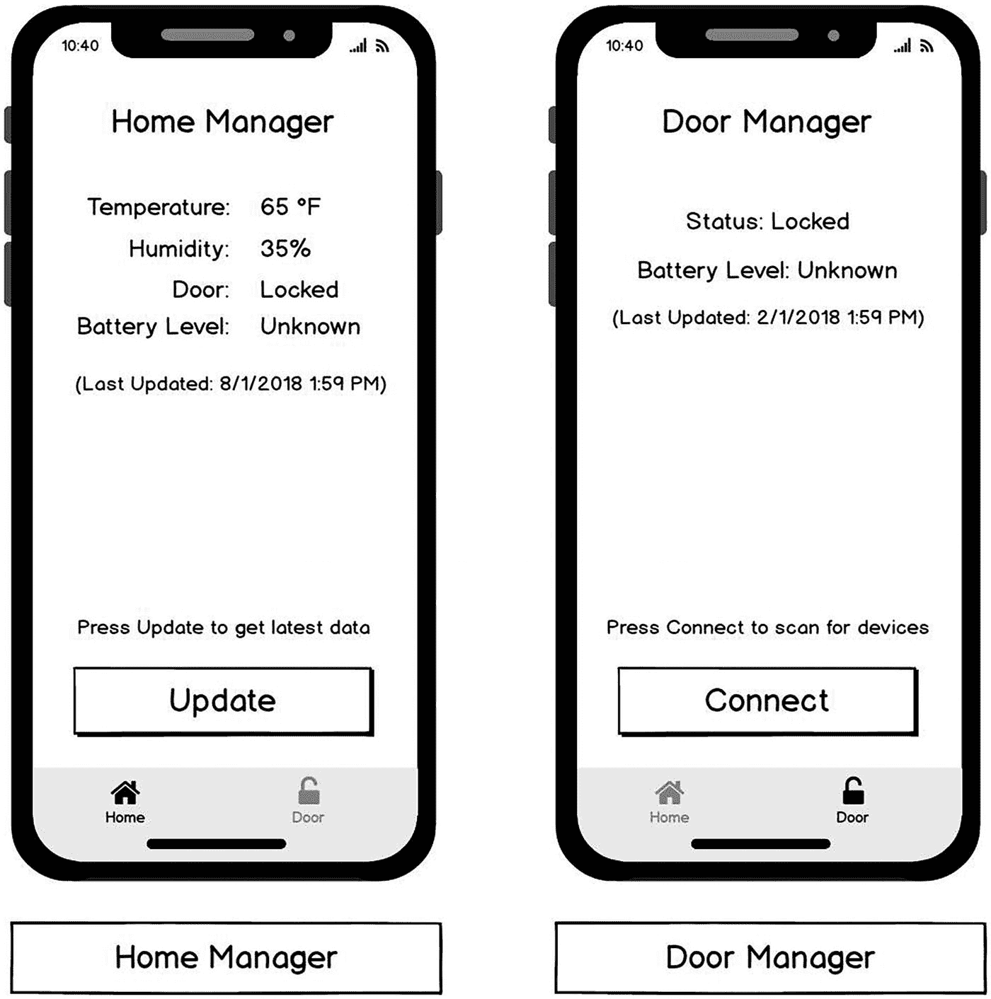

图 8-9 IOTHome 应用的更新线框图

开始实现项目时，请克隆第 6 章的 IOTHome 应用。你可以复制你的项目文件，或者从本书的 GitHub 项目（`https://github.com/Apress/program-internet-of-things-w-swift-for-ios`）获取一份全新的副本。

在表 8-1 中，我提供了用户界面元素的属性名称和约束条件。如果你需要复习如何应用约束，我建议重新阅读第 1 章和第 6 章。

表 8-1 Home 视图控制器用户界面元素样式

| 元素名称 | 文本样式 | 高度 | 上边距 | 下边距 | 左边距 | 右边距 |
| --- | --- | --- | --- | --- | --- | --- |
| 导航栏 | 首选大文本 | — | — | — | — | — |
| “温度”标题标签 | Title 2 | 24 | 40 | — | 30 | 20 |
| “温度”数值标签 | Title 2 | 24 | 40 | — | 20 | ≥30 |
| “湿度”标题标签 | Title 2 | 24 | 8 | — | 30 | 20 |
| “湿度”数值标签 | Title 2 | 24 | 8 | — | 20 | ≥30 |
| “门”标题标签 | Title 2 | 24 | 8 | — | 30 | 20 |
| “门”数值标签 | Title 2 | 24 | 8 | — | 20 | ≥30 |
| “电池电量”标题标签 | Title 2 | 24 | 8 | — | 30 | 20 |
| “电池电量”数值标签 | Title 2 | 24 | 8 | — | 20 | ≥30 |
| “上次更新”标签 | Body | 25 | 8 | — | 20 | 20 |
| “点击连接”标签 | Body | 25 | — | 20 | 20 | 20 |
| “连接”按钮 | Title 1 | 60 | 20 | 30 | 20 | 20 |

你最终的 Interface Builder 故事板文件（`Main.storyboard`）应类似于我在图 8-10 中的示例。

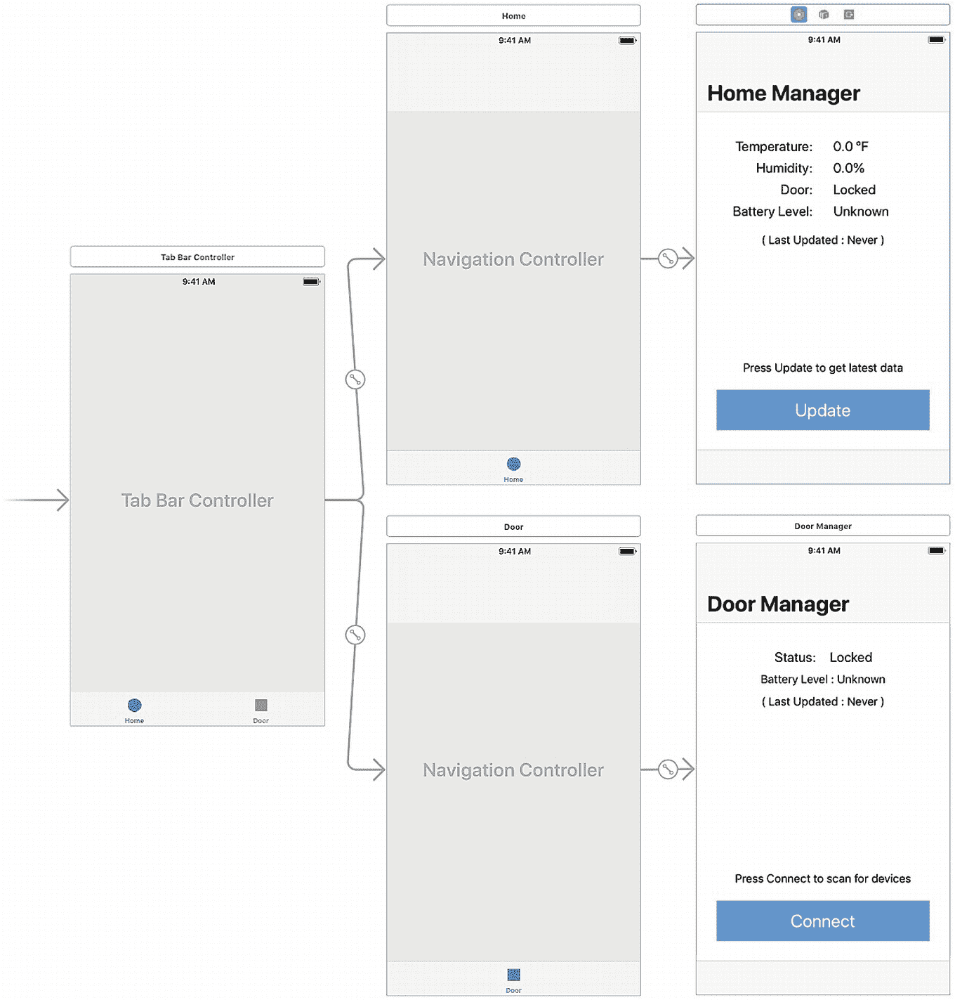

图 8-10 IOTHome 应用的更新故事板

根据第 6 章之前的实现，Home Manager 屏幕的所有者被设置为 `HomeViewController` 类。如代码清单 8-15 所示，更新 `HomeViewController.swift` 文件，以使用 `DoorViewController` 类作为其父类。此外，为新标签添加属性，并使用 `override` 关键字创建一个空的 `connect()` 方法，以表明你将重写父类中的方法。


```swift
import UIKit
class HomeViewController: DoorViewController {
@IBOutlet var temperatureLabel: UILabel?
@IBOutlet var humidityLabel: UILabel?
override func viewDidLoad() {
super.viewDidLoad()
// Do any additional setup after loading the
// view, typically from a nib.
}
@IBAction override func connect() {
//Put network init code here
}
}
```

`代码清单 8-15`
更新后的 `HomeViewController` 类，包含用户界面脚手架

在用户界面设置流程的最后一步，通过 Interface Builder 将所有标签的 Outlet 以及“更新”按钮的处理程序连接到视图控制器。你的类连接检查输出应与我在图 8-11 中的实现类似。如果你需要复习如何建立连接，请查阅第 1 章和第 6 章。

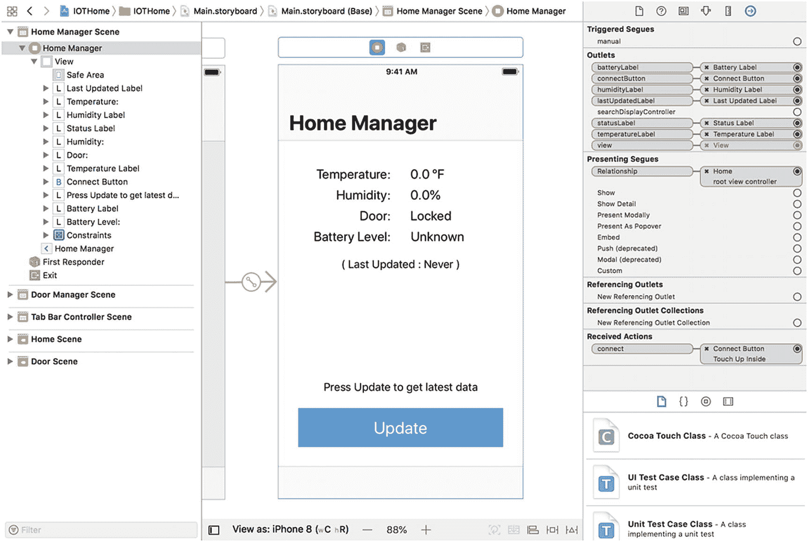

**图 8-11**
Home View Controller 更新后的故事板连接

### 发起并响应 HTTPS 请求

现在 Home View Controller 的用户界面已经准备就绪，你可以开始处理项目的网络代码了。在第 6 章中，你创建了一个 `BluetoothService` 类来简化 Door View Controller 中的蓝牙连接。在本项目中，你将采用类似的模式，创建一个 `NetworkManager` 类来管理应用中的网络连接。与 `BluetoothService` 不同，`NetworkManager` 需要被应用的 `HomeManager` 和 `AppDelegate` 类访问，并且无论哪个调用者访问，其状态都必须保持一致。为简化起见，在本项目中，我将通过单例（一个懒加载的全局对象）来实现这一行为。我在代码清单 8-16 中给出了该类的初始实现。

```swift
import Foundation
class NetworkManager: NSObject {
static let shared = NetworkManager(urlString:
"https://raspberrypi.local")
let baseUrl: URL
init(urlString: String) {
guard let baseUrl = URL(string: urlString) else {
fatalError("无效 URL 字符串")
}
self.baseUrl = baseUrl
}
}
```

`代码清单 8-16`
`NetworkManager` 作为单例的初始实现

单例在 Apple 开发者社区中是一个有争议的话题，因为它本质上是在全局范围内共享。但就本章而言，单例是一个便捷的选择，因为它没有副作用，并且我想重现 Apple 访问硬件 API 的方法（在整个 iOS 中使用单个对象管理一个资源，例如 GPS、摄像头）。如果你对单例的替代方案感兴趣，我建议研究一下依赖注入。依赖注入并非 Apple 提供的一等设计模式，因此在选择适合你应用的库或实现时，应谨慎行事。

在 Swift 中，单例通过向对象添加一个静态属性来实现，该属性返回该类的一个已初始化实例。如果该对象之前已被初始化，则返回现有对象；否则，将初始化一个新对象。这被称为*懒加载*。对于我的初始化器，我只需要使用网络请求的基础 URL 来初始化该类。至于基础 URL，与我的示例一样，使用设备的 Bonjour 名称。截至撰写本文时，Raspbian 默认启用了 Bonjour。Bonjour 允许 Apple 设备通过域名而非 IP 地址来查找网络上的设备。

对于网络实现，先从最简单的端点开始（温度）。要查询温度，只需向 `/temperature` 端点发送一个 `GET` 请求。在 iOS 中，此操作通过 `URLSession` 类完成。与 `NetworkManager` 一样，这个对象也是一个单例。`URLSession` 类将网络操作分为三大类：数据任务、上传任务和下载任务。顾名思义，上传和下载任务适用于长时间运行的文件上传或下载。对于短时间运行的操作（例如 Web 服务器 API 调用），数据任务是最合适的选择。由于来自 Raspberry Pi 的所有 API 响应均返回 JSON 数据，你可以将网络调用封装在一个方法中。在代码清单 8-17 中，我为这些调用创建了基础方法：`request(endpoint:httpMethod:completion:)`。其参数包括端点扩展名和表示方法类型的字符串，并返回一个包含服务器响应（或错误）的 JSON 字典。


```swift
class NetworkManager: NSObject {
    func request(endpoint: String, httpMethod: String, completion: @escaping (_ jsonDict: [String: Any]) -> Void) {
        guard let url = URL(string: endpoint, relativeTo: baseUrl) else {
            return completion(["error": "Invalid URL"])
        }
        var urlRequest = URLRequest(url: url)
        urlRequest.httpMethod = httpMethod
        let session = URLSession.default
        let task = session.dataTask(with: urlRequest) { (data: Data?, url: URLResponse?, error: Error?) in
            if error == nil {
                do {
                    guard let jsonData = data else {
                        return completion(["error": "Invalid input data"])
                    }
                    guard let result = try JSONSerialization.jsonObject(with: jsonData, options: []) as? [String : Any] else {
                        return completion(["error": "Invalid JSON data"])
                    }
                    completion(result)
                } catch let error {
                    return completion(["error": error.localizedDescription])
                }
            } else {
                guard let errorObject = error else { return completion(["error": "Invalid error object"]) }
                return completion(["error": errorObject.localizedDescription])
            }
        }
        task.resume()
    }
}
代码清单 8-17: 用于发起 HTTP 请求的网络管理器方法
```

该方法的基本流程是：使用端点地址和 HTTP 方法字符串创建一个 URL 请求对象，然后为数据任务创建一个完成处理程序，并通过 `resume()` 方法执行该任务。你可能会注意到此方法中包含了大量的错误处理逻辑。尽管 `JSONSerializer` 和 `URLSession` 类为你抽象了大量的逻辑，但它们很容易因配置不正确而失败。添加详细的错误处理将使你之后更容易定位失败的步骤。由于该方法通过完成处理程序返回结果，你可以传递错误对象，而不是来自服务器的结果。

在代码清单 8-18 中，我通过一个新的 `NetworkManager` 方法 `getTemperature(completion:)`，从主页视图控制器的 `connect()` 方法中调用该方法来获取温度。通过使用基于完成处理程序的逻辑，你可以快速将 `result` 对象传递到整个流程中，而无需在每个步骤中重新处理它。

```swift
class NetworkManager: NSObject {
    ...
    func getTemperature(completion: @escaping (_ jsonDict: [String: Any]) -> Void) {
        request(endpoint: "temperature", httpMethod: "GET") { (resultDict: [String: Any]) in
            completion(resultDict)
        }
    }
}

class HomeViewController: DoorViewController {
    ...
    @IBAction override func connect() {
        NetworkManager.shared.getTemperature { [weak self] (resultDict: [String: Any]) in
            if let error = resultDict["error"] as? String {
                self?.displayError(errorString: error)
            } else {
                DispatchQueue.main.async {
                    if let temperature = resultDict["temperature"] as? String {
                        self?.temperatureLabel?.text = "\(temperature) C"
                    }
                    if let humidity = resultDict["humidity"] as? String {
                        self?.humidityLabel?.text = "\(humidity)%"
                    }
                }
            }
        }
    }

    func displayError(errorString: String) {
        let alertView = UIAlertController(title: "Error", message: errorString, preferredStyle: .alert)
        let alertAction = UIAlertAction(title: "OK", style: .default, handler: nil)
        alertView.addAction(alertAction)
        DispatchQueue.main.async { [weak self] in
            self?.present(alertView, animated: true, completion: nil)
        }
    }
}
代码清单 8-18: 使用网络管理器从服务器获取温度
```

#### 警告

当你必须在完成处理程序内访问类的属性时，请始终通过弱引用来执行该操作。直接访问 `self` 会创建所谓的*循环引用*：由于对类的强引用从未被完全释放而导致的内存泄漏。

接下来，运行应用程序并按下“更新”按钮，尝试网络请求。该请求应失败，并出现与我图 8-12 中类似的 SSL 错误。这是因为树莓派使用了自签名证书，就像你在 Postman 和 Google Chrome 中遇到的问题一样。

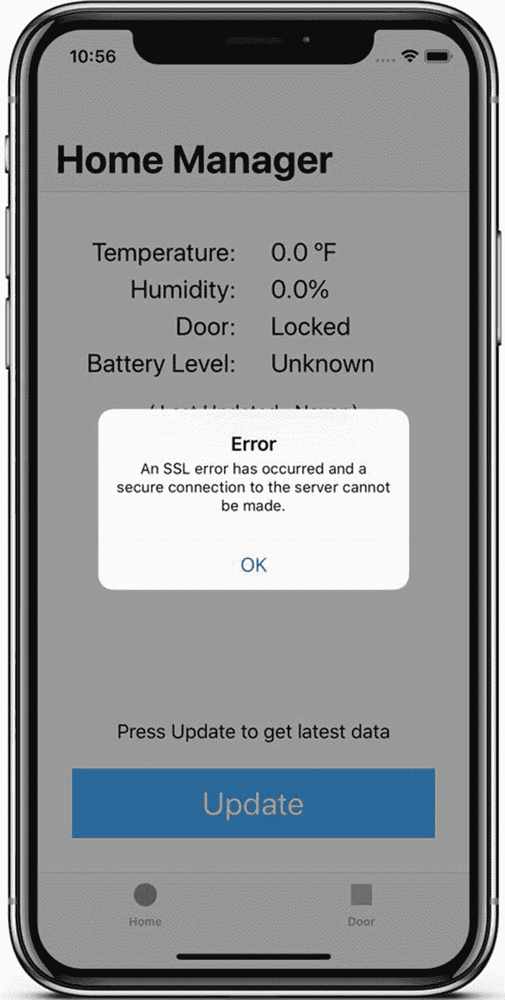

图 8-12: 自签名证书的错误信息

如本章前面所述，Apple 希望强制将经过验证的 SSL 证书作为 iOS 应用中网络操作的默认设置，以帮助确保用户数据的安全。要为树莓派启用自签名证书，你可以在 IOTHome 应用的 `Info.plist` 文件中为服务器添加一个*白名单*条目或例外。在项目资源管理器中找到该文件，然后辅助单击（长按或右键单击）它，选择“打开为 ➤ 源代码文件”。当文件的文本编辑窗口出现时，追加代码清单 8-19 中的代码片段，以仅为树莓派的域启用自签名证书。

```xml
CFBundleDevelopmentLanguage
$(DEVELOPMENT_LANGUAGE)
...
NSAppTransportSecurity

NSExceptionDomains

raspberrypi.local

NSExceptionAllowsInsecureHTTPLoads

NSIncludesSubdomains

代码清单 8-19: 启用自签名 SSL 的 Info.plist 条目
```

为了启用自签名证书的最终更改，你必须重写用于 HTTPS 身份验证挑战的 `URLSessionDelegate` 协议方法。在代码清单 8-20 中，我通过创建一个新的 `URLSession` 对象（该对象在 `request()` 方法中接受一个委托）来实现这一点。在身份验证方法中，我仅将树莓派的域加入白名单。此更改后，当你再次尝试运行应用程序时，网络请求应该可以成功完成。

```swift
class NetworkManager: NSObject, URLSessionDelegate {
    func request(endpoint: String, httpMethod: String, completion: @escaping (_ jsonDict: [String: Any]) -> Void) {
        ...
        var urlRequest = URLRequest(url: url)
        urlRequest.httpMethod = httpMethod
        let session: URLSession = URLSession(configuration: URLSessionConfiguration.default, delegate: self, delegateQueue: OperationQueue.main)
        let task = session.dataTask(with: urlRequest) { (data: Data?, url: URLResponse?, error: Error?) in
            ...
        }
        task.resume()
    }
    ...
    func urlSession(_ session: URLSession, didReceive challenge: URLAuthenticationChallenge, completionHandler: @escaping (URLSession.AuthChallengeDisposition, URLCredential?) -> Void) {
        let method = challenge.protectionSpace.authenticationMethod
        let host = challenge.protectionSpace.host
        NSLog("Received challenge for \(host)")
        switch (method, host) {
        case (NSURLAuthenticationMethodServerTrust, "raspberrypi.local"):
            let trust = challenge.protectionSpace.serverTrust!
            let credential = URLCredential(trust: trust)
            completionHandler(.useCredential, credential)
        default:
            completionHandler(.performDefaultHandling, nil)
        }
    }
}
代码清单 8-20: 通过 URLSessionDelegate 启用自签名 SSL 证书
```

要读取 IOTHome 系统的门状态，你必须先调用 `/door/connect` 端点，然后再调用 `/door/status` 端点。在代码清单 8-21 中，我通过在 `/door/connect` 端点的完成处理程序内嵌套对 `/door/status` 端点的调用来实现此行为。与读取温度类似，此网络调用应在你在应用程序中按下“更新”按钮时发起。


```
class NetworkManager: NSObject, URLSessionDelegate {
...
func getDoorStatus(completion: @escaping (_ jsonDict:
[String: Any]) -> Void) {
connectDoor { [weak self] (result: [String: Any]) in
if (result["error"] as? String) != nil {
return completion(result)
} else {
self?.request(endpoint: "door/status",
httpMethod: "GET") { (resultDict: [String:
Any]) in
completion(resultDict)
}
}
}
}
func connectDoor(completion: @escaping (_ jsonDict:
[String: Any]) -> Void) {
request(endpoint: "door/connect", httpMethod: "POST") {
(resultDict: [String: Any]) in
completion(resultDict)
}
}
}
class HomeViewController: DoorViewController {
...
@IBAction override func connect() {
...
NetworkManager.shared.getDoorStatus{ [weak self]
(resultDict: [String: Any]) in
if let error = resultDict["error"] as? String {
self?.displayError(errorString: error)
} else {
DispatchQueue.main.async {
if let doorStatus =
resultDict["doorStatus"] as? String {
self?.statusLabel?.text =
"\(doorStatus)"
}
if let batteryStatus =
resultDict["batteryStatus"] as? String {
self?.batteryLabel?.text =
"\(batteryStatus)"
}
if let lastUpdate =
resultDict["lastUpdate"] as? String {
self?.lastUpdatedLabel?.text =
"\(lastUpdate)"
}
}
}
}
}
}
代码清单 8-21 通过网络管理器获取门磁传感器状态
```

最后，为了实现应用最终的 API 调用，你应该在应用进入后台或主屏幕被导航离开时，调用 `/door/disconnect` 端点。这将允许其他设备在应用处于非活动状态时连接到门磁传感器。如代码清单 8-22 所示，你可以通过在 `NetworkManager` 中创建一个 `disconnectDoor()` 方法，并从主视图控制器的 `viewWillDisappear()` 方法以及应用委托的 `applicationWillResignActive()` 方法中调用它来实现这一点。

```
class NetworkManager: NSObject, URLSessionDelegate {
...
func disconnectDoor(completion: @escaping (_ jsonDict:
[String: Any]) -> Void) {
request(endpoint: "door/disconnect", httpMethod:
"POST") { (resultDict: [String: Any]) in
completion(resultDict)
}
}
}
class AppDelegate: UIResponder, UIApplicationDelegate {
...
func applicationWillResignActive(_ application:
UIApplication) {
NetworkManager.shared.disconnectDoor { (resultDict:
[String: Any]) in
NSLog("Disconnect result:
\(resultDict.description)")
}
}
}
class HomeViewController: DoorViewController {
...
override func viewWillDisappear(_ animated: Bool) {
super.viewWillAppear(animated)
NetworkManager.shared.disconnectDoor { (resultDict:
[String: Any]) in
NSLog("Disconnect result:
\(resultDict.description)")
}
}
}
代码清单 8-22 自动断开与门磁传感器的连接
```

## 本章小结

在本章中，你通过将前几章的 Raspberry Pi 扩展为网络服务器并通过 HTTPS 端点暴露其数据，成功构建了一个经典的物联网设备。在此过程中，你还学习了 HTTP 请求的工作原理，`Express` 和 `Noble` 如何为你分担实现 HTTP 和蓝牙协议栈的繁重工作，以及如何使用 iOS 应用连接到这些端点。与设置 HomeKit 类似，这些任务中的许多并非特定于 iOS 或 Raspberry Pi，而是对成熟的 Linux 和 Web 应用开发实践的具体实现。

在 Raspberry Pi 等单板计算机取得商业成功之前，许多专有的片上系统解决方案已经提供了相同的核心功能——GPIO 和网络服务器，但价格高昂且学习曲线陡峭。得益于这类技术的简化，物联网得以持续扩展，但正如你将在本书后面学到的，你还应记得添加 HTTPS 或其他安全措施，以帮助创造一个安全的物联网。

