# 9. 使用 tvOS 构建 Apple TV 仪表盘应用

尽管 Apple TV 于 2007 年推出，但其市场普及率在数年内一直很低，并被史蒂夫·乔布斯戏称为“一个业余爱好”。当时，其主要用途是作为在 iTunes 上购买媒体的机顶盒。2012 年，一款价格更低、灵感源于 iOS 的 Apple TV 2 问世并迅速走红。用户不再局限于 `iTunes` 内容，突然可以通过系统更新附带的应用程序观看来自 `Netflix` 和热门电视频道的内容。这使许多人猜测，该设备实际上基于 iOS 的一个分支，并且人们期望苹果有朝一日能向所有开发者提供其软件开发工具包。

2015 年，这些预测成真了，苹果发布了 Apple TV 4，同时公开发布了其操作系统（现称为 `tvOS`）的软件开发工具包以及该设备的 App Store。正如许多人推测的那样，`tvOS` 基于 iOS，开发者可以使用 Swift 以及来自 iOS 的框架（包括 `Cocoa Touch` 和 `Core Location`）的紧密分支为其编写应用。截至撰写本文时，主要的例外是 `MapKit` 和 `WebKit`——这意味着你不能直接将网页或地图嵌入到你的原生 `tvOS` 应用中。

考虑到这一点，在本章中，你将通过运用所学的 iOS 知识，为 IOTHome 硬件构建一个 Apple TV 仪表盘，从而将 `tvOS` 与物联网这两个世界连接起来。为了使用户体验更具吸引力，你将整合来自 IOTHome 网络服务器和 `OpenWeatherMap.org` 天气 API 的数据，从而能够展示用户家室内外的气候信息。

### 注意

虽然你可以使用 Apple TV 模拟器和任何基于 Linux 的设备来开发本章的项目，但代码示例和解释是为 Apple TV 4 和 Raspberry Pi 3 或更新版本优化的。

## 学习目标

在本章中，你将学习如何通过向 IOTHome 项目添加 Apple TV 目标、为该目标创建 `tvOS` 资源以及编写代码使 `tvOS` 应用自行渲染用户界面并发出网络请求，来构建一个 Apple TV 仪表盘应用。在创建 `tvOS` 仪表盘应用的过程中，你将学习 iOS 物联网应用开发的以下关键概念：

*   向现有 iOS 应用添加 `tvOS` 目标
*   为 `tvOS` 项目创建用户界面
*   在 `tvOS` 应用中发起 HTTP 请求
*   从 `tvOS` 应用请求用户位置
*   连接到 `OpenWeatherMap.org` 公共天气 API
*   在 Apple TV 上运行 `tvOS` 应用

苹果在 `tvOS` 上的一大成就是，它在很大程度上为该平台保留了 iOS 的开发工具和实践。你会发现自己有时会忘记自己正为哪个平台编写代码，这与 `watchOS`（许多 API 缺失）或 `macOS`（工作流程或共享框架的重叠很少）形成对比。在研读本章内容时，我将强调这些相似之处以及如何将它们应用于 `tvOS`。另外，尽管你需要为用户界面编写新代码，但你可以几乎不做任何改动地重用第 8 章中的网络代码。

在本章中，我假设你熟悉 IOTHome 传感器（第 5 章至第 7 章）和网络服务器（第 8 章）。如果你对其中任何一项不熟悉，我强烈建议你在继续学习本章之前先回顾一下相关内容。与之前的章节一样，你可以在本书的 GitHub 仓库（[`https://github.com/Apress/program-internet-of-things-w-swift-for-ios`](https://github.com/Apress/program-internet-of-things-w-swift-for-ios)）的 `Chapter` `9` 文件夹下找到本章的完整项目。


## 设置 tvOS 目标

如果你曾为 iOS 下载过任何游戏或天气应用，并且恰好也拥有一台 Apple TV，你可能会注意到其中一些应用会神奇地出现在你的 Apple TV 主屏幕上。你可以通过将 tvOS 应用作为新目标添加到你的 `IOTHome` iOS 应用中，为你的用户重现这种体验，并提高你对 tvOS 体验的采用率。首先，从第 8 章复制一份 `IOTHome` 应用，或者从本书的 GitHub 仓库下载一份新的副本。接下来，在 Xcode 中打开该项目，然后从“文件”菜单中选择“新建” ➤ “目标”，如图 9-1 所示。

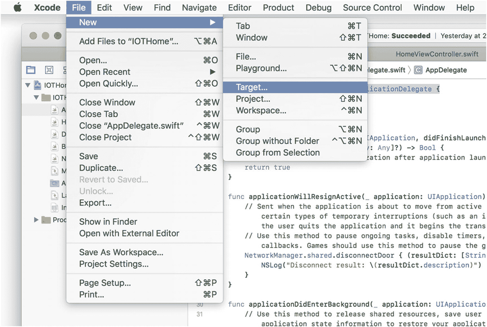

图 9-1：向现有 iOS 项目添加 tvOS 目标

在点击菜单项后出现的模板选择器窗口中，选择 tvOS，然后选择“单视图应用”，如图 9-2 所示。

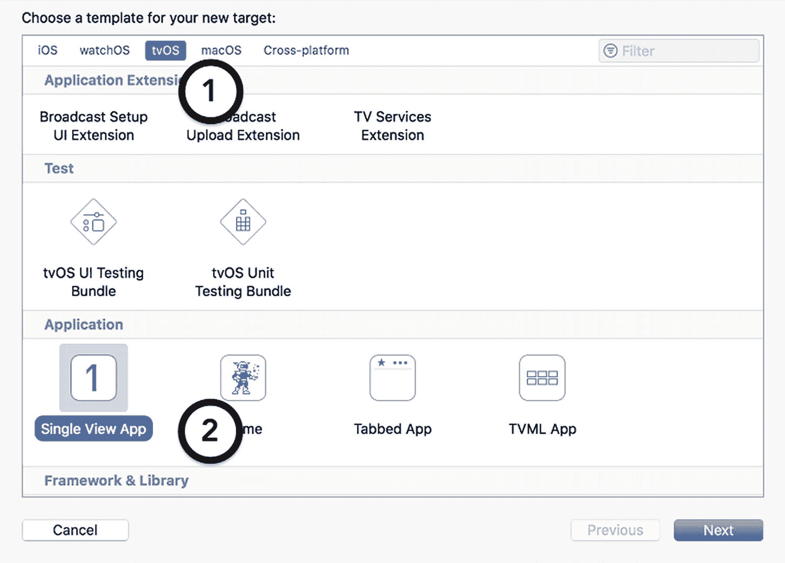

图 9-2：选择单视图应用 tvOS 模板

当被要求命名产品时，将其命名为“`IOTHomeTV`”。你的组织标识符应与之前迭代应用时使用的保持一致（即你的姓名或网站域名的反向域名表示法）。你的项目现在应包含一个用于 `IOTHomeTV` 目标的新方案和新文件夹，如图 9-3 所示。

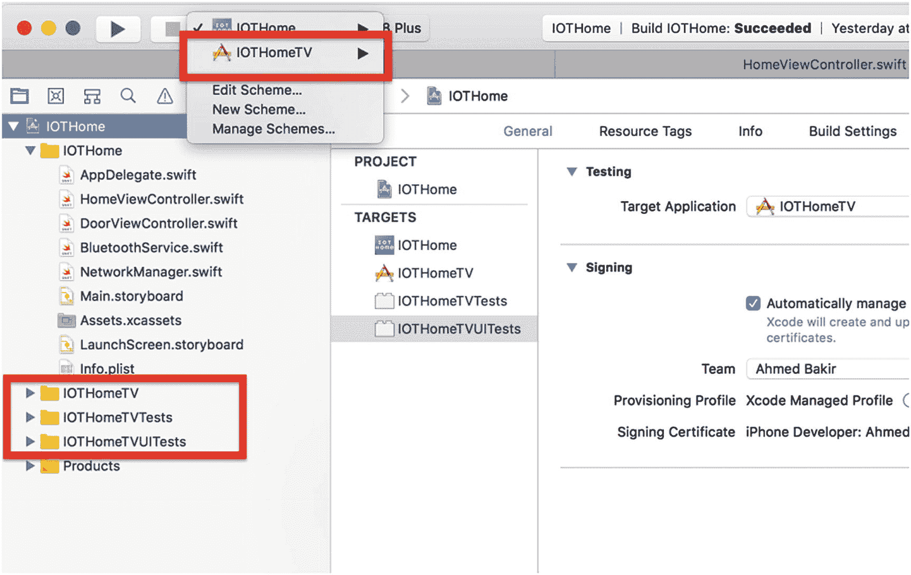

图 9-3：`IOTHome` 项目层级结构，包含新的 tvOS 方案和文件

接下来，你必须从 iOS 项目中复制网络白名单，以便连接到自签名的 HTTPS 端点。打开 `IOTHome` iOS 应用（位于 `IOTHome` 文件夹中）的 `Info.plist` 文件，然后辅助点击（右键点击）名为“App Transport Security Settings”的键。选择“复制”以复制该键值对的内容。接着，打开 `IOTHomeTV` tvOS 应用（位于 `IOTHomeTV` 文件夹中）的 `Info.plist` 文件，然后从辅助点击（右键点击）菜单中选择“粘贴”，以粘贴该键值对。你最终得到的 `Info.plist` 文件应类似于图 9-4 中我的结果。

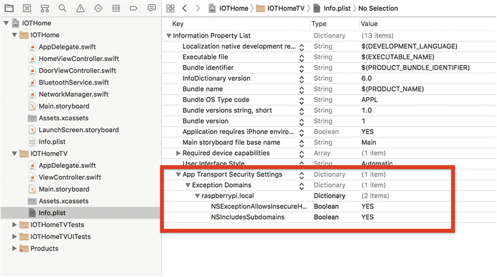

图 9-4：`IOTHomeTV` 目标的 `Info.plist` 文件，包含网络白名单

最后一步项目设置，你必须让 tvOS 目标能使用 iOS 目标中的 `NetworkManager` 类。使用同一个项目来管理两个目标的好处之一是，你可以在两个项目中使用相同的源文件来完成此任务。如图 9-5 所示，要启用此功能，请点击项目导航器中的 `NetworkManager.swift` 文件，然后选中 `IOTHomeTV` 旁边的复选框。

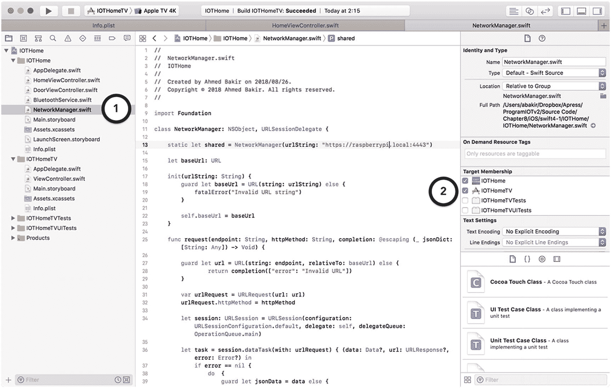

图 9-5：在项目中的多个目标之间共享源代码

要验证源文件是否已成功添加并且与 tvOS 兼容，从 Xcode 顶部“运行”按钮旁边的下拉菜单中选择 `IOTHomeTV` 方案和 Apple TV 4K 目标设备。你应该能够成功编译包含新文件的目标。

## 创建用户界面

现在，tvOS 的新目标已设置完毕并且可以编译，你可以开始为仪表盘应用构建用户界面了。仪表盘通常需要长时间显示，并且应易于阅读。为了实现这些目标，在图 9-6 中，我提供了一个基于磁贴的用户界面线框图，用于显示来自 `IOTHome` 传感器的门状态以及室内温度和湿度数据、三天天气预报以及当前室外温度。天气数据通过查询 OpenWeatherMap.org 并利用用户的当前位置获取。你将导入 `FontAwesome.swift`（ [`github.com/thii/FontAwesome.swift`](https://github.com/thii/FontAwesome.swift) ）开源库中的图标。

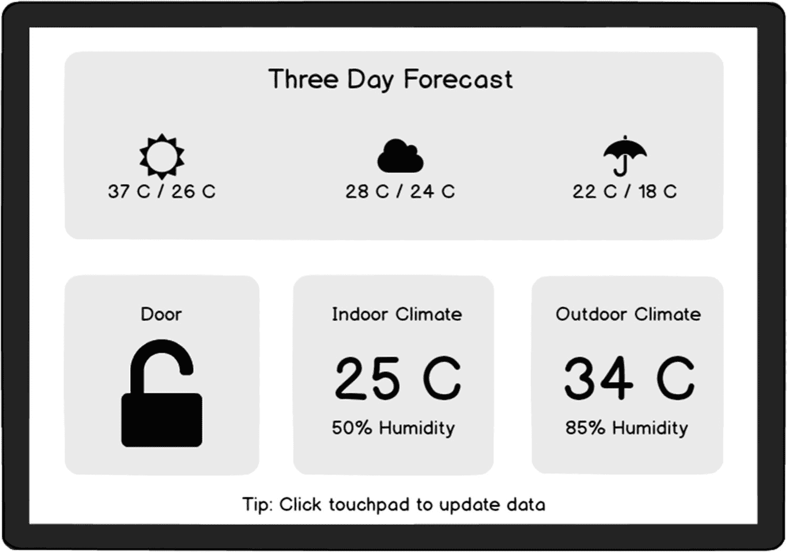

图 9-6：`IOTHomeTV` 仪表盘线框图

tvOS 最便捷的方面之一在于，Apple 允许你重用从 iOS 开发中熟悉的大部分开发工具和实践来帮助你构建应用。对于 `IOTHomeTV` 应用，你可以使用 Interface Builder 以及简单的 `UIView`、`UIImage` 和 `UILabel` 对象快速构建用户界面。首先，打开 `IOTHomeTV` 目标的 `Main.storyboard` 文件。空白的 storyboard 初始显示应类似于图 9-7 中的屏幕截图。

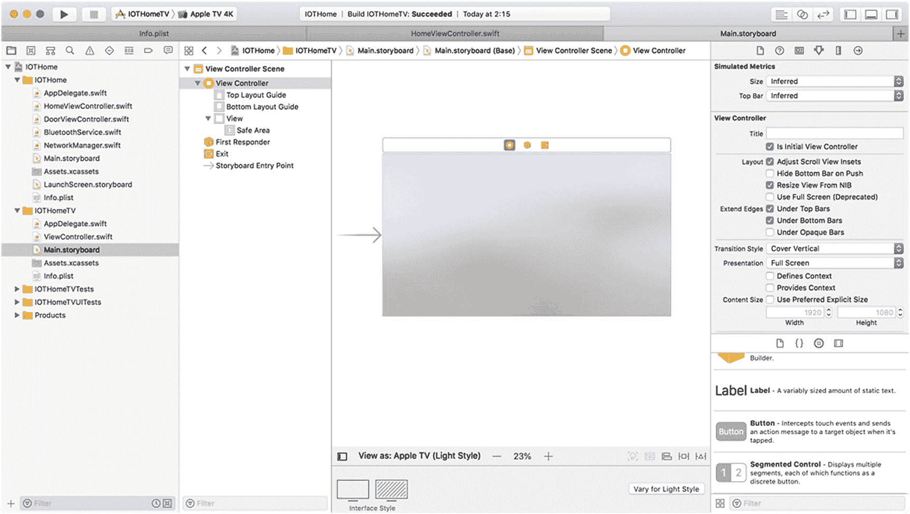

图 9-7：Apple TV 应用的空白故事板

与 iOS 应用相同，你可以通过将对象从 Interface Builder 右下角的“对象库”拖放到故事板上来组合你的用户界面。为了进一步控制元素的位置，你也可以像在 iOS 应用中那样使用自动布局。以表格 9-1 作为指导，布局用户界面。标签和图形应放置在磁贴之上。暂时不必担心视图上的圆角边框，因为稍后你将在本节中以编程方式实现它们。

**表 9-1：** 主视图控制器用户界面元素的样式

| 元素名称 | 文本样式 | 相对于...对齐 | 上边距 | 下边距 | 左边距 | 右边距 |
| --- | --- | --- | --- | --- | --- | --- |
| “三天预报”背景视图 | — | 视图 | 8 | 60 | 8 | 8 |
| “底部行”背景视图 | — | 视图 | 60 | 40 | 60 | 60 |
| “提示”标签 | 标题 3 | 视图 | 40 | 20 | 8 | 8 |
| “标题”标签 | 标题 2 | 父视图（X 中心） | 30 | — | — | — |
| “图标”图像视图 | — | 父视图（X、Y 中心） | — | — | — | — |
| “详情”文本标签 | 标题式 | “图标”图像视图（X 中心） | 20 | — | — | — |

截至撰写本文时，tvOS 仅支持一种宽高比，因此，如果你愿意，可以选择跳过为该项目设置自动布局约束。

设置用户界面的最后一步，你必须将故事板链接到你的源代码。在清单 9-1 中，我扩展了 `IOTHomeTV` 项目的 `ViewController` 类，以包含所有用户界面元素的可供 Interface Builder 访问的属性。


```swift
class ViewController: UIViewController {
    @IBOutlet weak var forecastView: UIView?
    @IBOutlet weak var indoorView: UIView?
    @IBOutlet weak var outdoorView: UIView?
    @IBOutlet weak var lockView: UIView?
    @IBOutlet weak var firstDayLabel: UILabel?
    @IBOutlet weak var secondDayLabel: UILabel?
    @IBOutlet weak var thirdDayLabel: UILabel?
    @IBOutlet weak var indoorTempLabel: UILabel?
    @IBOutlet weak var indoorHumidityLabel: UILabel?
    @IBOutlet weak var outdoorTempLabel: UILabel?
    @IBOutlet weak var outdoorHumidityLabel: UILabel?
    @IBOutlet weak var tipLabel: UILabel?
    @IBOutlet weak var lockImageView: UIImageView?
    @IBOutlet weak var firstDayImageView: UIImageView?
    @IBOutlet weak var secondDayImageView: UIImageView?
    @IBOutlet weak var thirdDayImageView: UIImageView?
    override func viewDidLoad() {
        super.viewDidLoad()
    }
}
```

**列表 9-1** 视图控制器定义，包含用户界面属性

修改源文件后，使用 Xcode 中的连接检查器（Connection Inspector）将属性连接到故事板。与之前示例中相同，你可以参考第 1 章来复习如何使用 Interface Builder。完成连接后，你的故事板应类似于我在图 9-8 中的实现。

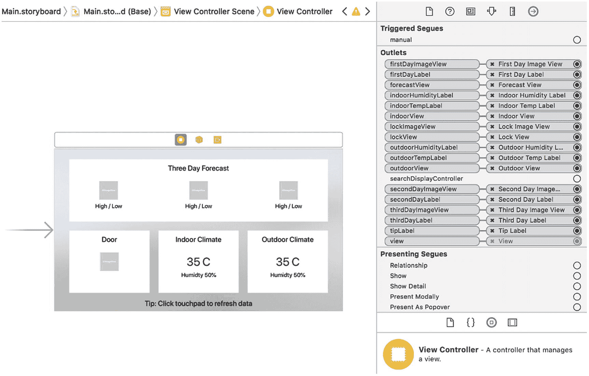

**图 9-8** IOTHomeTV 应用的完成故事板

### 通过编程为元素添加样式以匹配 tvOS 设计语言

布置完用户界面后，你可能已经注意到它有点……平淡。通过为图块背景添加柔和阴影、圆角以及模糊效果，你可以打造出更符合用户在 Apple TV 主屏幕上所熟悉样式的用户界面。这些更改必须通过代码实现，但幸运的是，实现起来并不复杂。

你可以先为视图添加模糊效果。为此，可以使用 `UIVisualEffectView` 类，它允许你将 Apple 预构建的复杂视觉效果应用到任何 `UIView` 上。要应用现代的 iOS 模糊效果，请使用 `UIBlurEffect` 对象。在列表 9-2 中，我通过创建一个名为 `applyEffects()` 的辅助方法，为图块应用了视觉效果。

```swift
class ViewController: UIViewController {
    ...
    override func viewDidLoad() {
        super.viewDidLoad()
        applyEffects(to: [forecastView, indoorView,
            outdoorView, lockView])
    }
    func applyEffects(to views: [UIView?]) {
        for view in views {
            addBlurEffect(to: view)
        }
    }
    func addBlurEffect(to targetView: UIView?) {
        guard let targetView = targetView else { return }
        view.backgroundColor = UIColor.clear
        let blurEffect = UIBlurEffect(style: .regular)
        let blurView = UIVisualEffectView(effect:
            blurEffect)
        blurView.frame = view.bounds
        targetView.addSubview(blurView)
        targetView.sendSubview(toBack: blurView)
    }
}
```

**列表 9-2** 向视图添加模糊效果

虽然你必须将视觉效果添加为子视图，但它不必遮挡内容。通过调用 `sendSubview(toBack:)` 方法，你可以将模糊效果置于图块的后方，而不会影响故事板中先前设置的视图布局。应用效果的逻辑在视图控制器的 `viewDidLoad()` 方法中调用，因为该方法在视图从故事板布局完成后执行，此时视图控制器已准备就绪。

添加圆角半径则是一个更直接的过程。要应用圆角半径，需要为视图的 `CALayer`（表示视图绘制方式的对象）提供一个数值，并指定要裁剪圆角下方的区域。在列表 9-3 中，我将 `applyEffects()` 方法扩展为包含圆角半径效果。

```swift
class ViewController: UIViewController {
    override func viewDidLoad() {
        super.viewDidLoad()
        applyEffects(to: [forecastView, indoorView,
            outdoorView, lockView], cornerRadius: 20)
    }
    func applyEffects(to views: [UIView?],
                      cornerRadius: CGFloat) {
        for view in views {
            addBlurEffect(to: view)
            addRoundedCorners(to: view, cornerRadius:
                cornerRadius)
        }
    }
    func addRoundedCorners(to targetView: UIView?,
                           cornerRadius: CGFloat) {
        guard let targetView = targetView else { return }
        targetView.layer.cornerRadius = cornerRadius
        targetView.layer.masksToBounds = true
    }
}
```

**列表 9-3** 向视图添加圆角

对于阴影，你需要结合这两种效果的概念。阴影本身是通过为 `CALayer` 应用阴影颜色、模糊半径和阴影位置来创建的。这用于模拟现实生活中的柔和或硬质光线。不幸的是，启用圆角所需的遮罩会裁剪掉阴影（如果应用到同一个视图上）。你可以通过创建另一个位置相同的视图，将阴影效果应用到该新视图，并将其放置在内容视图下方来解决此问题。在列表 9-4 中，我扩展了视图控制器以实现这些步骤，并为图块添加了阴影效果。

```swift
class ViewController: UIViewController {
    ...
    func applyEffects(to views: [UIView?],
                      cornerRadius: CGFloat) {
        for view in views {
            addBlurEffect(to: view)
            addRoundedCorners(to: view,
                              cornerRadius: cornerRadius)
            addShadow(to: view, cornerRadius: cornerRadius)
        }
    }
    func addShadow(to targetView: UIView?, cornerRadius:
                   CGFloat) {
        guard let targetView = targetView else { return }
        let shadowView = UIView(frame: targetView.frame)
        shadowView.layer.cornerRadius = cornerRadius
        shadowView.layer.shadowOffset = CGSize.zero
        shadowView.layer.shadowOpacity = 0.2
        shadowView.layer.shadowRadius = 10.0
        shadowView.layer.shadowColor = UIColor.black.cgColor
        let shadowPath = UIBezierPath(roundedRect:
            shadowView.bounds, cornerRadius: cornerRadius)
        shadowView.layer.shadowPath = shadowPath.cgPath
        view.addSubview(shadowView)
        view.bringSubview(toFront: targetView)
    }
}
```

**列表 9-4** 在带圆角的视图下方添加阴影

### 注意

`UIView` 的 `frame` 属性包含其 x 和 y 位置。而 `bounds` 属性将这些位置设置为 (0,0)。当向视图添加子视图时，请尽量使用 `bounds`。当复制或移动视图时，请尽量使用 `frame`。

在应用了这两种视觉效果并在 Apple TV 模拟器中运行应用程序后，你的输出结果应类似于图 9-9 中的截图。

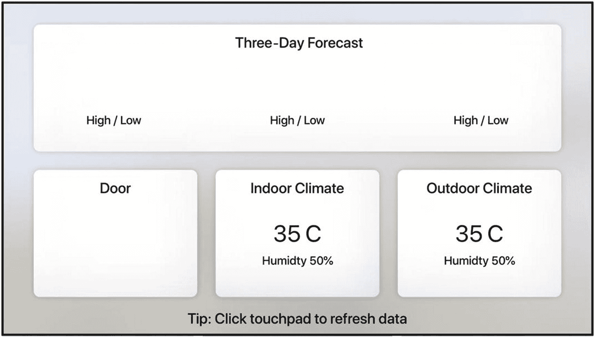

**图 9-9** IOTHomeTV 应用的风格化用户界面


好的，这是根据您的要求和示例格式翻译的中文版本。


### 使用 Font Awesome 实现基于字体的图形

作为用户界面拼图的最后一块，您需要为应用程序添加图形。本部分不直接导入图形文件，而是介绍一种非常流行的基于字体的替代方案——Font Awesome，及其 Swift 实现 FontAwesome.swift。Font Awesome 是一个字体文件，提供了海量的图标集合。在 Web 开发中，它是一种流行的选择，有助于减小页面大小并减少需要聘请图形设计师的工作量。在 iOS 上，它同样能带来这些好处，此外，还能让您免去自行管理和缩放图片的负担。您在本节中要使用的实现方案 FontAwesome.swift，允许您基于该字体创建 `UIImage` 对象，使其使用方法与使用来自“资源目录”或其他来源的图形完全相同。

首先，从其 GitHub 页面下载或克隆 FontAwesome.swift 的仓库：[`https://github.com/thii/FontAwesome.swift`](https://github.com/thii/FontAwesome.swift)。接下来，将存档中 `FontAwesome` 文件夹内的所有文件（`Info.plist` 文件除外）复制到您的项目中。您可以通过“文件”菜单中的“将文件添加到 IOTHome”选项来执行此操作。如图 9-10 所示，当文件选择弹出窗口出现时，选择 `IOTHome` 和 `IOTHomeTV` 作为目标，以便将文件同时包含在 iOS 和 tvOS 应用程序中。确保同时选中“如果需要，复制项目”，以复制这些文件，从而将文件的副本添加到项目中。

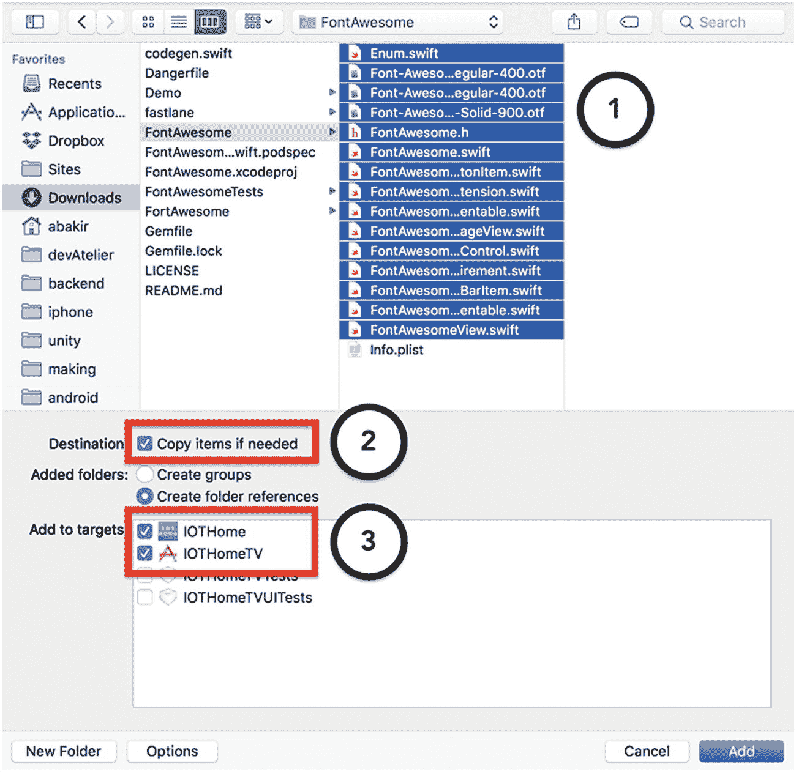

图 9-10

将 FontAwesome.swift 的文件导入 IOTHome 项目

将 FontAwesome.swift 的文件添加到项目后，选中所有文件，然后使用辅助点击（右键点击）弹出上下文菜单。选择“从选择中新建组”，将所有文件放入项目中的一个文件夹内。您的 Xcode 项目导航器现在应类似于图 9-11 中的示例。

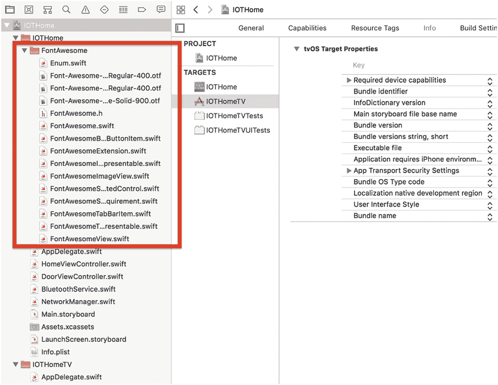

图 9-11

将 FontAwesome.swift 添加到项目后的项目导航器

最后，要使用该库，您必须基于字体中可用的图标创建 `UIImage` 对象。Font Awesome 不仅提供了纯 Unicode 十六进制代码，还为每个图标提供了名称。要了解有哪些图标可用及其名称，我倾向于使用该字体的官方搜索工具，网址为：[`https://fontawesome.com/icons?d=gallery&m=free`](https://fontawesome.com/icons?d=gallery%2526m=free)。开始项目时，使用 `lock` 表示锁图形，使用 `sun` 表示晴朗天气图形。

要创建图形，您可以使用 FontAwesome.swift 对 `UIImage` 类的扩展方法 `UIImage.fontAwesome(name:style:textColor:size:)`。顾名思义，您需要调用 API 并传入图标名称、显示样式、着色颜色和尺寸。在代码清单 9-5 中，我将这些调用添加到了 `ViewController` 类中。

```
class ViewController: UIViewController {
...
override func viewDidLoad() {
super.viewDidLoad()
applyEffects(to: [forecastView, indoorView,
outdoorView, lockView], cornerRadius: 20)
addFontAwesomeImage(to: lockImageView, name: .lock)
addFontAwesomeImage(to: firstDayImageView, name: .sun)
addFontAwesomeImage(to: secondDayImageView, name:
.sun)
addFontAwesomeImage(to: thirdDayImageView, name: .sun)
}
func addFontAwesomeImage(to imageView: UIImageView?,
name:     FontAwesome)  {
guard let imageView = imageView else { return }
imageView.image = UIImage.fontAwesomeIcon(name: name,
style: .solid,
textColor: UIColor.black,
size: imageView.bounds.size)
}
}
代码清单 9-5
向图像视图添加基于 Font Awesome 的图像
```

添加图像视图后，在 Apple TV 模拟器中运行该应用程序，应得到类似于图 9-12 中截图的输出。

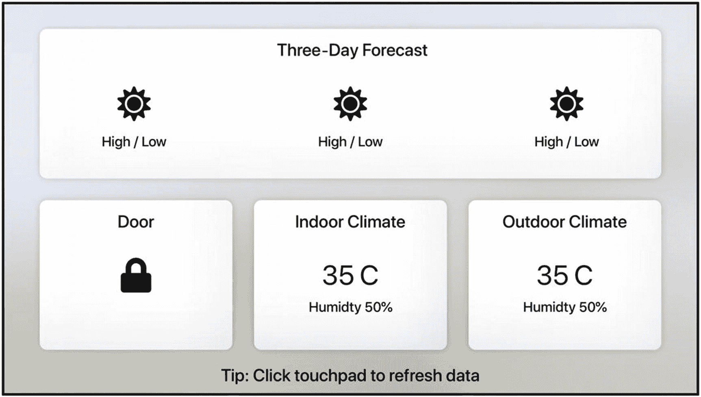

图 9-12

带有 Font Awesome 图像的 IOTHomeTV

## 向 tvOS 应用添加数据源

现在 IOTHomeTV 应用的用户界面已准备就绪，您可以开始集成其数据源，并用来自您在第 5 章至第 7 章构建的 IOTHome 传感器以及 OpenWeatherMap.org 的真实数据来填充它。虽然您可以直接从 Apple TV 连接蓝牙设备，但对于本系统，利用 Web 服务器处理繁重工作更高效、更可靠。除了能够使用一致的接口外，无需添加额外客户端也能让传感器释放资源以接受更多连接。

在本章开始时，您已验证了来自第 8 章的网络客户端代码可以在 tvOS 上无错误编译。要集成该客户端，您只需从 IOTHomeTV 应用中调用它。在代码清单 9-6 中，我开始进行集成，使用 `NetworkManager` 类请求来自 Raspberry Pi 上传感器的室内气候数据。

```
class ViewController: UIViewController {
...
override func viewDidLoad() {
super.viewDidLoad()
applyEffects(to: [forecastView, indoorView,
outdoorView, lockView], cornerRadius: 20)
...
fetchNetworkData()
}
...
func fetchNetworkData() {
NetworkManager.shared.getTemperature { [weak self]
(resultDict: [String: Any]) in
if let error = resultDict["error"] as? String {
self?.tipLabel?.text = "Error: \(error)"
} else {
DispatchQueue.main.async {
if let temperature =
resultDict["temperature"] as? String {
self?.indoorTempLabel?.text =
"\(temperature) C"
}
if let humidity = resultDict["humidity"]
as? String {
self?.indoorHumidityLabel?.text =
"Humidity \(humidity)%"
}
}
}
}
}
}
代码清单 9-6
在 tvOS 应用中从 IOTHome Web 服务器获取温度数据
```

回顾第 8 章，您会记得 Network Manager 负责管理服务器地址、使用 `URLSession` 建立网络连接以及验证 JSON 响应。当网络请求完成时，管理器执行用户指定的完成处理程序，其返回参数是一个 JSON 字典，其中包含一个 `error` 键值对，或者来自目标端点的响应。在完成处理程序内部，我使用温度（temperature）和湿度（humidity）键值对来更新“室内温度”和“室内湿度”标签的文本。网络请求从 `viewDidLoad()` 方法触发，这样应用启动时就能更新数据。

在代码清单 9-7 中，我进一步扩展了 `fetchNetworkData()` 方法，以包含门传感器的状态。在该示例中，我没有更新标签，而是更新了门状态的图像。

```
class ViewController: UIViewController {
...
func fetchNetworkData() {
NetworkManager.shared.getTemperature { [weak
self] (resultDict: [String: Any]) in
...
}
NetworkManager.shared.getDoorStatus{ [weak self]
(resultDict: [String: Any]) in
if let error = resultDict["error"] as? String {
self?.tipLabel?.text = "Error: \(error)"
} else {
DispatchQueue.main.async { [weak self] in
if let doorStatus =
resultDict["doorStatus"] as? String {
if doorStatus == "0" {
self?.addFontAwesomeImage(to:
self?.lockImageView, name:
.lockOpen)
} else {
self?.addFontAwesomeImage(to:
self?.lockImageView, name: .lock)
}
}
}
}
}
}
}
代码清单 9-7
在 tvOS 应用中从 IOTHome Web 服务器获取门传感器数据
```


### 请求用户位置信息

在本章开头，我描述了在 IOTHomeTV 仪表盘中显示三天预报和当前天气状况的设想。用户虽然通常了解室内的环境状况，但获取室外天气数据有助于他们为外出做好更充分的准备。为了请求基于位置的气象预报，你需要获取用户的当前位置，正如第 2 章中使用位置追踪构建运动应用时所做的那样。

与第 2 章的项目类似，在请求用户位置之前，必须先为 tvOS 的位置权限请求对话框设置描述信息。如图 9-13 所示，打开 IOTHomeTV 目标的 `Info.plist` 文件，然后添加 “Privacy – Location When in Use” 键值对。我使用的描述字符串是：“IOTHomeTV 希望使用您的位置信息，以便为您显示所在地区的天气信息。”

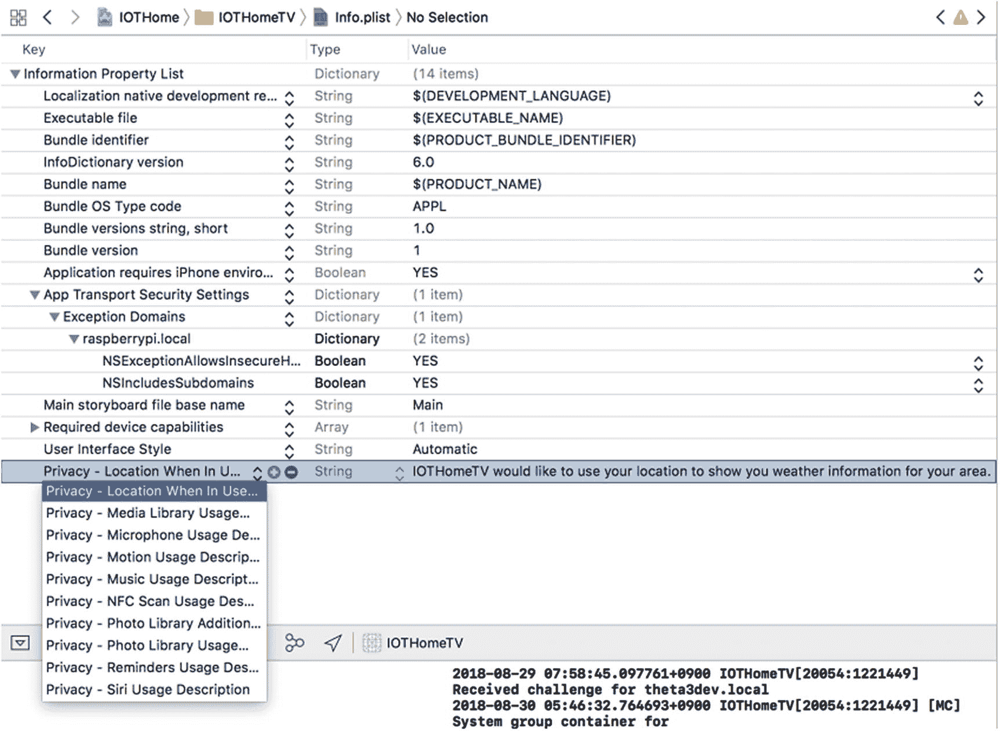

**图 9-13** 为 IOTHomeTV 应用添加用户位置权限描述

接下来，你需要在应用启动后添加权限请求。与 iOS 类似，tvOS 中的用户位置通过 `CLLocationManager` 对象进行管理。如代码清单 9-8 所示，初始化一个对象来管理此请求；实现 `viewWillAppear()` 方法来发出请求；并通过 `locationManager(didChangeAuthorization status:)` 委托方法来处理结果。

```swift
import UIKit
import CoreLocation
class ViewController: UIViewController {
...
let locationManager = CLLocationManager()
...
override func viewDidLoad() {
super.viewDidLoad()
locationManager.delegate = self
...
}
override func viewDidAppear(_ animated: Bool) {
super.viewDidAppear(animated)
if CLLocationManager.authorizationStatus() ==
.authorizedWhenInUse {
locationManager.requestLocation()
} else {
locationManager.requestWhenInUseAuthorization()
}
}
...
}
extension ViewController : CLLocationManagerDelegate {
func locationManager(_ manager: CLLocationManager,
didChangeAuthorization status: CLAuthorizationStatus) {
NSLog("Authorization state: \(status)")
}
func locationManager(_ manager: CLLocationManager,
didFailWithError error: Error) {
let errorString = "Location error:
\(error.localizedDescription)"
tipLabel?.text = errorString
NSLog(errorString)
}
}
```

**代码清单 9-8** 从 IOTHomeTV 应用请求用户位置权限

要验证结果，请在 Apple TV 4K 模拟器中运行应用。您应该会收到一个全屏提示，请求获取用户位置权限，如图 9-14 所示。

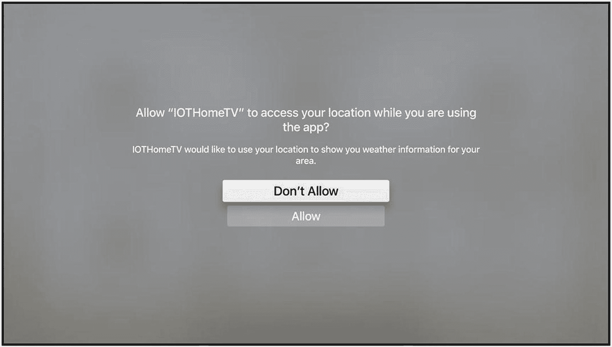

**图 9-14** IOTHomeTV 应用的用户位置权限弹窗

最后，要请求当前用户位置，请修改 `locationManager(didChangeAuthorization status:)` 委托方法，在确认权限已被授予后请求当前位置。如代码清单 9-9 所示，添加另一个委托方法 `locationManager(didUpdateLocations locations:)` 来处理位置更新，然后将结果保存到一个可在后续使用的属性中。

```swift
import UIKit
import CoreLocation
class ViewController: UIViewController {
...
let locationManager = CLLocationManager()
var lastSavedLocation : CLLocation?
...
override func viewDidAppear(_ animated: Bool) {
...
}
}
extension ViewController : CLLocationManagerDelegate {
func locationManager(_ manager:
CLLocationManager, didChangeAuthorization
status: CLAuthorizationStatus) {
NSLog("Authorization state: \(status)")
if status == .authorizedWhenInUse {
locationManager.requestLocation()
}
}
func locationManager(_ manager: CLLocationManager
didUpdateLocations locations: [CLLocation]) {
lastSavedLocation = locations.first
}
}
```

**代码清单 9-9** 从 IOTHomeTV 应用请求当前用户位置


### 连接 OpenWeatherMap API

有了用户界面、网络功能和用户位置信息之后，你几乎可以开始使用 OpenWeatherMap 的公共天气数据库，为 IOTHomeTV 应用添加室外天气信息了。在完成最后的设置步骤时，你需要从 OpenWeatherMap.org 申请一个 API 密钥。许多允许他人通过网络 API 使用其数据的服务，通常都需要 API 密钥来验证请求或根据会员级别强制执行数据访问权限。例如，OpenWeatherMap.org 的免费账户每分钟最多允许 60 次请求，但超出此限制则需要付费会员资格。如图 9-15 所示，如需申请免费账户，请在浏览器中导航至 [`www.openweathermap.org`](http://www.openweathermap.org)，然后点击“注册”链接。

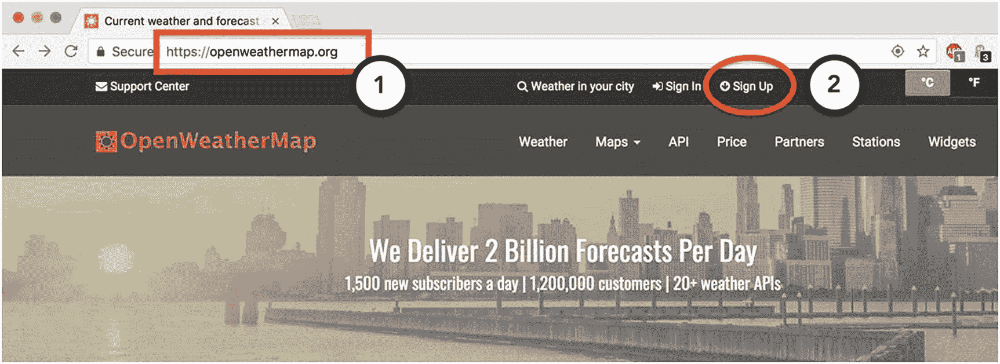

**图 9-15** 在 OpenWeatherMap.org 上创建账户

完成账户创建后，你将被重定向到 API 密钥页面，如图 9-16 所示，其中列出了你所有可用的 OpenWeatherMap API 密钥。请记下“默认”密钥，不要与他人分享，否则你可能面临账户访问权限丧失的风险。

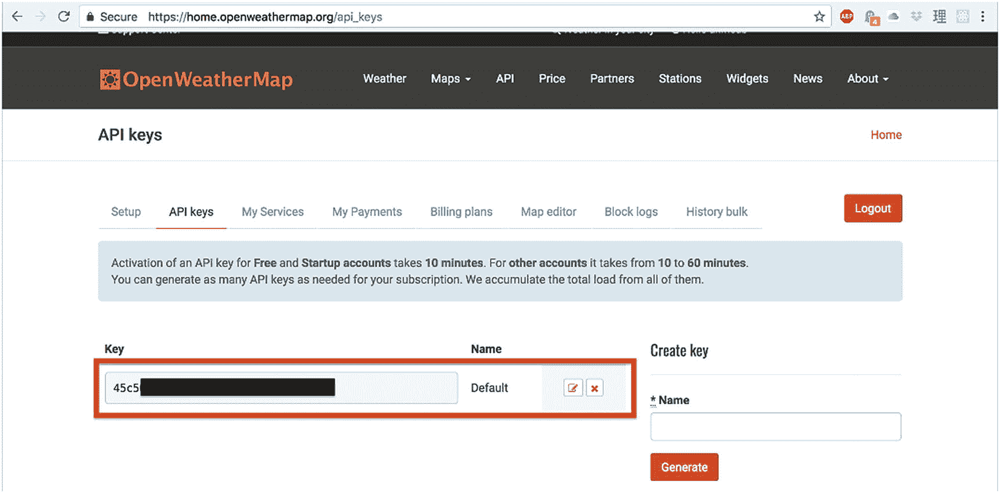

**图 9-16** OpenWeatherMap.org API 密钥页面

现在你已拥有 OpenWeatherMap API 密钥和用户的当前位置，可以开始使用该服务获取天气数据了。为了填充应用中的天气字段，你将使用 OpenWeatherMap 的两个端点：`/weather`（用于当前天气状况）和 `/forecast`（用于三天预报）。查看 `/weather` 端点的文档（[`https://openweathermap.org/current`](https://openweathermap.org/current)），你会注意到可以使用 URL 参数通过地理坐标调用该端点。URL 参数是一种通过将值附加到 URL 末尾来传递给端点的方式。对于坐标 (35.730534, 139.705001)，你将使用以下 URL：

```
https://api.openweathermap.org/data/2.5/weather?lat=35.730534&lon=139.705001&units=metric&appid=YOUR_APP_ID
```

在代码清单 9-10 中，我包含了此 API 调用的 JSON 响应。对于“室外条件”标签，你只需要温度和湿度字段，可以从 `main` 字典中的 `temp` 和 `humidity` 键值对中提取。

```
{
  "coord": {
    "lon": 139.71,
    "lat": 35.73
  },
  "weather": [{
    "id": 803,
    "main": "Clouds",
    "description": "broken clouds",
    "icon": "04n"
  }],
  "base": "stations",
  "main": {
    "temp": 27.64,
    "pressure": 1009,
    "humidity": 74,
    "temp_min": 26,
    "temp_max": 29
  },
  ...
}
```

**代码清单 9-10** OpenWeatherMap 当前状况端点的示例 JSON 响应

到目前为止，`NetworkManager` 类始终使用相对于 IOTHome 网络服务器域名的端点。为了支持 OpenWeatherMap，你将需要扩展网络管理器，使其能够使用多个基础 URL 并将参数附加到 URL 末尾。URL 参数的一个特殊要求是：第一个参数必须以 `?` 开头，后续每个参数必须以 `&` 开头。与其自己编写此逻辑，不如利用 `URLComponents` 类来构建格式正确的 URL。在代码清单 9-11 中，我扩展了网络管理器中的 `request(endpoint:httpMethod:completion:)` 方法，使其接受基础 URL 和 URL 参数字典作为输入参数。此外，我还用新参数修改了其余方法，并添加了一个 `formattedURL(baseUrl:endpoint:parameters:)` 方法来构建格式化的 URL。

```
class NetworkManager: NSObject, URLSessionDelegate {
  let deviceBaseUrl = "https://raspberrypi.local"
  let opmBaseUrl = "https://api.openweathermap.org/data/2.5"
  let opmApiKey = "YOUR_API_KEY"
  static let shared = NetworkManager()

  func formattedUrl(baseUrl: String, endpoint: String,
                    parameters: [String: String]? ) -> URL? {
    guard var urlComponents = URLComponents(string:
      "\(baseUrl)/\(endpoint)") else {
      return nil
    }
    urlComponents.queryItems = parameters?.compactMap({
      pair in
      URLQueryItem(name: pair.key, value: pair.value)
    })
    return urlComponents.url?.absoluteURL
  }

  func request(baseUrl: String, endpoint: String,
               httpMethod: String, parameters: [String: String]? = nil,
               completion: @escaping (_ jsonDict: [String: Any]) -> Void) {
    guard let url = self.formattedUrl(baseUrl: baseUrl,
                                      endpoint: endpoint, parameters: parameters) else {
      return completion(["error": "Invalid URL"])
    }
    var urlRequest = URLRequest(url: url)
    urlRequest.httpMethod = httpMethod
    // ...
  }

  // ...
  func getTemperature(completion: @escaping (_ jsonDict: [String: Any]) -> Void) {
    request(baseUrl: deviceBaseUrl, endpoint: "temperature",
            httpMethod: "GET") {
      (resultDict: [String: Any]) in
      completion(resultDict)
    }
  }

  func getDoorStatus(completion: @escaping (_ jsonDict: [String: Any]) -> Void) {
    connectDoor { [weak self] (result: [String: Any]) in
      if (result["error"] as? String) != nil {
        return completion(result)
      } else {
        guard let deviceBaseUrl = self?.deviceBaseUrl else {
          return completion(["error": "Invalid device URL"])
        }
        self?.request(baseUrl: deviceBaseUrl,
                      endpoint: "door/status",
                      httpMethod: "GET") { (resultDict: [String: Any]) in
          completion(resultDict)
        }
      }
    }
  }

  func connectDoor(completion: @escaping (_ jsonDict: [String: Any]) -> Void) {
    request(baseUrl: deviceBaseUrl, endpoint: "door/connect",
            httpMethod: "POST") {
      (resultDict: [String: Any]) in
      completion(resultDict)
    }
  }

  func disconnectDoor(completion: @escaping (_ jsonDict: [String: Any]) -> Void) {
    request(baseUrl: deviceBaseUrl, endpoint: "door/disconnect",
            httpMethod: "POST") {
      (resultDict: [String: Any]) in
      completion(resultDict)
    }
  }
}
```

**代码清单 9-11** 扩展 `NetworkManager` 类以支持多个基础 URL 和 URL 参数

在此示例中，我没有使用 `for` 循环来构建 `URLQueryItem` 对象数组，而是使用了新的 `compactMap()` 方法。这个 API 借鉴自函数式编程语言（如 Haskell），并且最近作为一种基于迭代集合进行计算的方式越来越流行。

现在网络管理器已准备好处理你的新需求，你可以向网络管理器添加一个 `getOutdoorTemperature()` 方法，以便在应用的主视图控制器中发起请求并处理响应，如代码清单 9-12 所示。


```swift
class NetworkManager: NSObject, URLSessionDelegate {
...
func getOutdoorTemperature(latitude: String, longitude:
String, completion: @escaping (_ jsonDict: [String: Any])
-> Void) {
let parameters = ["appid": opmApiKey,
"lat": latitude,
"lon": longitude,
"units": "metric"]
request(baseUrl: opmBaseUrl, endpoint: "weather",
httpMethod: "GET", parameters: parameters) {
(resultDict: [String: Any]) in
completion(resultDict)
}
}
class ViewController: UIViewController {
...
@IBAction func fetchNetworkData() {
....
fetchOutdoorTemperature()
}
...
func fetchOutdoorTemperature() {
guard let latitude =
lastSavedLocation?.coordinate.latitude,
let longitude =
lastSavedLocation?.coordinate.longitude else {
return
}
NetworkManager.shared.getOutdoorTemperature(latitude:
"\(latitude)", longitude: "\(longitude)") { [weak
self] (resultDict: [String: Any]) in
if let error = resultDict["error"] as? String {
self?.tipLabel?.text = "Error: \(error)"
} else {
guard let mainDict = resultDict["main"] as?
[String: Any] else {
self?.tipLabel?.text = "Error: Invalid
response"
return
}
if let humidity = mainDict["humidity"] {
self?.outdoorHumidityLabel?.text =
"Humidity \(humidity)%"
}
if let temperature = mainDict["temp"] {
self?.outdoorTempLabel?.text =
"\(temperature) C"
}
}
}
}
}
extension ViewController : CLLocationManagerDelegate {
...
func locationManager(_ manager:
CLLocationManager, didUpdateLocations
locations: [CLLocation]) {
lastSavedLocation = locations.first
fetchOutdoorTemperature()
}
}
代码清单 9-12
使用网络管理器请求当前天气状况
```

为了使体验更加流畅，我在确认当前位置时，与其他网络请求一起添加了请求室外天气状况的调用。由于确认用户位置可能需要几秒钟，因此在位置委托中的调用将使你能够在用户首次加载应用时显示有效数据。

OpenWeatherMap 提供了一个免费端点（`/forecast`）和一个付费端点（`/forecast/daily`）用于获取每日预报。付费端点使用起来更方便，但为了扩大本书的受众范围，我将介绍如何使用免费端点。`/forecast` 端点的 API 文档可在 [`https://openweathermap.org/forecast5`](https://openweathermap.org/forecast5) 获取。在代码清单 9-13 中，我扩展了网络管理器，增加了一个调用 `/forecast` 端点的方法。这里没有什么特别之处；它与 `/weather` 端点非常相似。

```swift
class NetworkManager: NSObject, URLSessionDelegate {
...
func getForecast(latitude: String, longitude: String,
completion: @escaping (_ jsonDict: [String: Any]) ->
Void) {
let parameters = ["appid": opmApiKey,
"lat": latitude,
"lon": longitude,
"units": "metric"]
request(baseUrl: opmBaseUrl, endpoint: "forecast",
httpMethod: "GET", parameters: parameters) {
(resultDict: [String: Any]) in
completion(resultDict)
}
}
}
代码清单 9-13
添加从 OpenWeatherMap 请求预报的方法
```

该响应提供五天的每日预报，每三小时为一个数据块。在每个数据块的记录中，你可以找到人类可读的天气状况描述（例如：晴）以及从最低温度到气压的详细统计数据。在代码清单 9-14 中，我提供了其中一个响应的极其简化的示例。

```json
{
"cod": "200",
"message": 0.1654,
"cnt": 38,
"list": [{
"dt": 1535781600,
"main": {
"temp": 287.67,
"temp_min": 287.67,
"temp_max": 288.554,
"pressure": 1019.41,
...
},
"weather": [{
"id": 800,
"main": "Clear",
"description": "clear sky",
"icon": "01n"
}],
...
}],
"city": {
"id": 5391959,
"name": "Tokyo",
...
}
}
代码清单 9-14
OpenWeatherMap 预报端点的示例响应
```

不幸的是，这个 API 比 `/weather` 端点复杂得多。每个三小时数据块的数据都位于字典数组中。可想而知，你必须遍历这些子字典才能提取所需的值（`list`、`main`、`weather`）。一种常见的方法是嵌套使用 `guard-let` 语句。

要获得准确的平均最高温和最低温，你需要对每天的结果进行平均。然而，为了演示 API 的使用，我将对此进行简化，并使用间隔 24 小时的三个样本。在代码清单 9-15 中，我扩展了视图控制器，使其包含对预报的请求。

```swift
class ViewController: UIViewController {
...
func fetchOutdoorTemperature() {
...
NetworkManager.shared.getForecast(latitude:
"\(latitude)", longitude: "\(longitude)") {
[weak self] (resultDict: [String: Any]) in
if let error = resultDict["error"] as? String {
self?.tipLabel?.text = "Error: \(error)"
} else {
guard let resultList = resultDict["list"]
as? [Any] else {
self?.tipLabel?.text = "Error: Invalid
response"
return
}
guard resultList.count > 15 else { return }
//今天
self?.setupForecastView(dictionary:
resultList[0], index: 0)
//明天
self?.setupForecastView(dictionary:
resultList[7], index: 1)
//后天
self?.setupForecastView(dictionary:
resultList[15], index: 2)
}
}
}
}
代码清单 9-15
从视图控制器请求预报
```

我将处理请求并将其映射到视图的逻辑放在了 `setupForecastView(dictionary:index:)` 方法中，该方法见代码清单 9-16。

```swift
class ViewController: UIViewController {
...
func setupForecastView(dictionary: Any, index: Int) {
guard let dayDict = dictionary as? [String: Any],
let mainDict = dayDict["main"] as? [String: Any],
let weatherArray = dayDict["weather"] as? [Any],
let weatherDict = weatherArray.first as? [String:
Any],
let minTemp = mainDict["temp_min"] as? Double,
let maxTemp = mainDict["temp_max"] as? Double,
let conditionCode = weatherDict["id"] as? Int
else { return }
let icon: FontAwesome
switch conditionCode {
case 300...599: icon = .umbrella
case 600...699: icon = .snowflake
case 700...799: icon = .exclamationTriangle
case 800: icon = .sun
default: icon = .cloud
}
switch index {
case 0:
guard let imageView = firstDayImageView else { return }
firstDayLabel?.text = "\(maxTemp) / \(minTemp)"
firstDayImageView?.image =
UIImage.fontAwesomeIcon(name: icon, style:
.solid, textColor: UIColor.black, size:
imageView.bounds.size)
case 1:
guard let imageView = secondDayImageView else {
return }
secondDayLabel?.text = "\(maxTemp) / \(minTemp)"
secondDayImageView?.image =
UIImage.fontAwesomeIcon(name: icon, style: .solid,
textColor: UIColor.black, size: imageView.bounds.size)
default:
guard let imageView = thirdDayImageView else {
return }
thirdDayLabel?.text = "\(maxTemp) / \(minTemp)"
thirdDayImageView?.image =
UIImage.fontAwesomeIcon(name: icon, style:
.solid, textColor: UIColor.black, size:
imageView.bounds.size)
}
}
代码清单 9-16
在视图控制器中处理预报请求
```

这个方法包含大量逻辑，用于从每个数据块的字典中提取嵌套值并将其映射到用户界面。不幸的是，这是许多大数据 API 中常见的设计缺陷。如果可能，请将这次经历作为倡导在后端项目中设计简单的网络 API 响应的机会。


## 处理 Siri Remote 的触控输入

在开发 IOTHomeTV 应用的最后一个步骤中，你应该充分利用 Apple TV 的主要人机交互设备——Siri Remote。每台 Apple TV 都随附了一台遥控器；不过，第四代 Apple TV 引入了 Siri Remote，它配备了一个用于应用类手势的触控板，以及一个用于接收 Siri 语音命令的麦克风。在本节中，我将重点介绍如何接收来自遥控器的按钮和触控板点击输入，以刷新应用中的数据。

首先，你可以实现按钮按下功能。每台 Apple TV 的基本交互界面都依赖于使用方向键在项目间移动，使用播放/暂停键导航到项目的详情页面，以及使用菜单键退出项目。对于 IOTHomeTV，自然的交互方式就是使用播放/暂停键来刷新应用中的数据。

你可以使用 `UITapGestureRecognizer` 类在 tvOS 上实现按钮按下支持。如果你已经在 iOS 上实现过自定义手势识别器（例如，在不使用 `UIButton` 或 `UIPageController` 的情况下使视图可滑动或可点击），那么你应该已经熟悉了 `UITapGestureRecognizer` 类及其父类 `UIGestureRecognizer`。它们在 tvOS 上的实现方式基本相同。手势识别器的工作原理是：你指定一个要观察的手势（例如，点击、触摸、滑动、捏合），指定一个观察这些事件的视图，以及一个在这些事件被识别时调用的选择器（方法签名）。你可以通过实例化一个单一用途的 `UIGestureRecognizer` 子类（例如 `UITapGestureRecognizer` 或 `UISwipeGestureRecognizer`）来指定事件。`UIGestureRecognizer` 是一个抽象类，不能直接实例化。

要实现播放/暂停按钮的处理程序，请实例化一个 `UITapGestureRecognizer` 对象。如清单 9-17 所示，通过创建带有其方法签名的选择器，将 `fetchNetworkData()` 方法指定为点击事件的处理程序。与 iOS 相同，使用 `UIView` 类的 `addGestureRecognizer()` 方法将手势附加到视图控制器的主视图。与 iOS 不同的是，你可以使用 `allowedPressTypes` 属性将按钮按下操作限制为仅播放/暂停按钮。

```
class ViewController: UIViewController {
...
override func viewDidLoad() {
super.viewDidLoad()
...
setupGestureHandlers()
}
func setupGestureHandlers() {
let tapRecognizer = UITapGestureRecognizer(target:
self, action:
#selector(ViewController.fetchNetworkData))
tapRecognizer.allowedPressTypes = [NSNumber(value:
UIPressType.playPause.rawValue)]
self.view.addGestureRecognizer(tapRecognizer)
}
}
清单 9-17
添加播放/暂停按钮手势识别器
```

要测试手势识别器，请运行 Apple TV 模拟器。如图 9-17 所示，在 Hardware 菜单下，选择 Show Apple TV Remote。点击屏幕上的遥控器，并通过显示数据的更新或断点来验证 `fetchNetworkData()` 方法是否被调用。

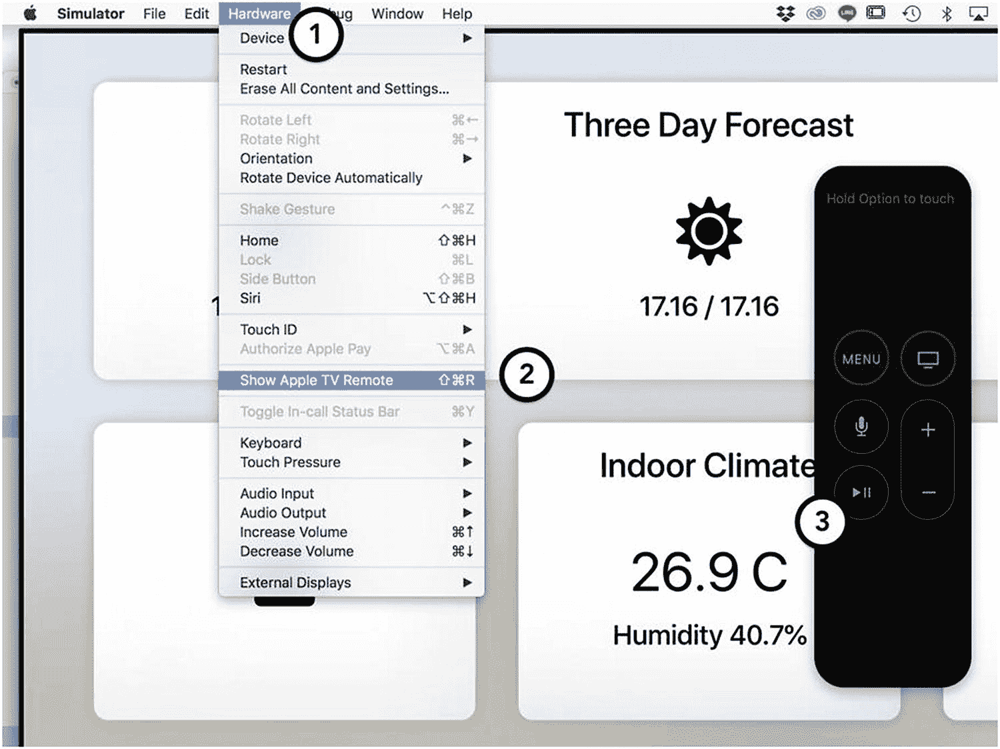

图 9-17

在 Apple TV 模拟器中使用屏幕遥控器

在 tvOS 中实现触控板点击利用了 iOS 中的另一个概念——按下事件 (press events)。然而，它们的实现方式与手势识别器不同。`UIViewController` 的子类对于由任何触摸或按下事件触发的 `UITouch` 和 `UIPress` 事件有默认的处理方法。要添加触控板点击支持，请重写按下完成时的默认委托方法 `pressesEnded(presses:with Event:)`，并仅在选择 (Select) 事件被识别时插入对刷新网络数据的调用，如清单 9-18 所示。

```
class ViewController: UIViewController {
...
override func pressesEnded(_ presses: Set, with
event: UIPressesEvent?) {
for pressEvent in presses {
if pressEvent.type == .select {
fetchNetworkData()
}
}
}
}
清单 9-18
添加触控板点击支持
```

要测试触控板点击事件，请再次打开 Apple TV 模拟器。按住键盘上的 Option 键以在模拟器中启用触控板支持，然后再次点击触控板内部。此时，对 `fetchNetworkData()` 的调用应该会被触发。

## 在 Apple TV 上调试应用

在完全开发了 IOTHomeTV 应用并通过 Apple TV 模拟器验证其工作正常后，完善你的 tvOS 开发之旅只剩下最后一步：在 Apple TV 硬件上运行应用。与 iOS 设备类似，从 Xcode 9 开始，如果你拥有有效的 Apple 开发者帐户，你可以连接到 Apple TV，并通过你的家庭或办公室网络连接，从你的 Mac 对其进行无线调试。

首先，请验证你的 Mac 和 Apple TV 已连接到同一无线网络。接下来，在 Apple TV 上打开“设置”应用。如图 9-18 所示，选择“遥控器与设备”，然后选择“遥控器 App 与设备”。如果你已通过“遥控器”应用将 Apple TV 与 iPhone 或 iPad 配对，它应该会显示在此屏幕上；否则，该屏幕应为空。

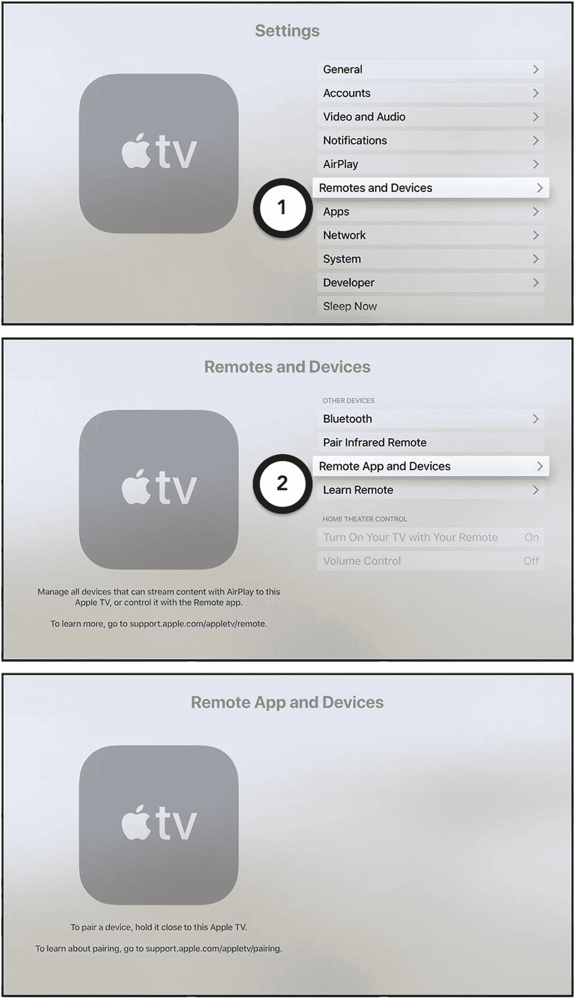

图 9-18

准备将 Apple TV 与 Mac 配对

让“遥控器 App 与设备”屏幕在 Apple TV 上保持打开状态，然后打开 Xcode。在 Xcode 中，单击 Window 菜单，然后选择 Devices and Simulators。在 Devices and Simulators 窗口中，你应该能看到一个 Apple TV 的图标和一个包含你 Apple TV 名称的“配对”按钮。如图 9-19 所示，点击此按钮后，将出现一个身份验证对话框，要求你输入 Apple TV 上显示的身份识别码。输入此代码，然后按“连接”。

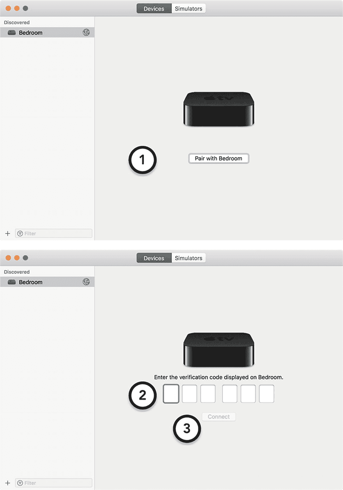

图 9-19

从 Mac 配对一个 Apple TV

配对过程成功完成后，Devices and Simulators 窗口将更新，显示关于你 Apple TV 的统计信息，如图 9-20 所示。

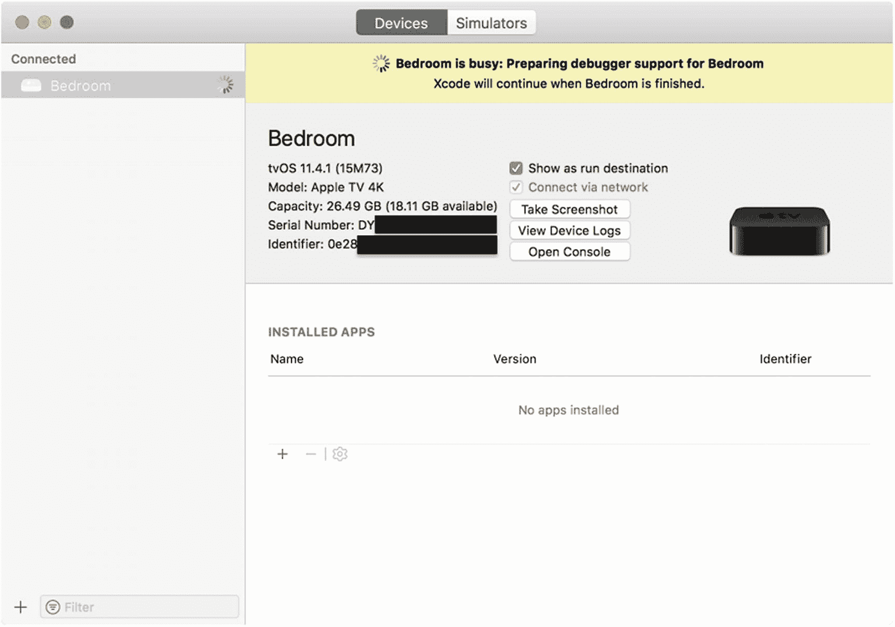

图 9-20

确认与 Apple TV 配对成功

等待几分钟，让 Xcode 下载设备的调试符号后，你将可以从 Xcode 中“运行”按钮旁边的目标选择菜单中，选择你的 Apple TV 作为调试目标，如图 9-21 所示。首次连接设备时，你还会被提示将其添加到你的 Apple Developer Program 账户中。在弹出的窗口中确认此操作，以完成设备设置过程。

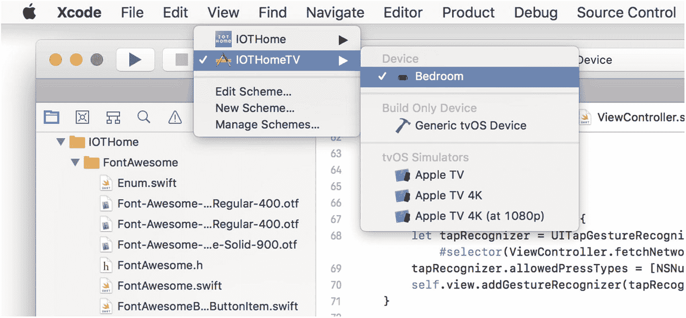

图 9-21

选择 Apple TV 作为调试目标

此时，你可以按下“运行”按钮在设备上运行应用，并且应该能够访问你在 iOS 设备上习惯使用的调试功能，包括断点和堆栈检查。恭喜你构建并运行了你的第一个 Apple TV 应用！


