# 10. 使用 watchOS 构建 Apple Watch 应用

从 1940 年代迪克·特雷西的手表电话，到如今极受欢迎的 *《辐射》* 游戏系列中的哔哔小子，将手表作为腕上信息设备的想法，早在 2015 年苹果发布 Apple Watch 之前就已深入人心。从 20 世纪 80 年代开始，卡西欧和 Radio Shack 等消费电子公司便率先迈出一步，通过为数字手表添加计算器、FM 收音机和通讯录功能，推出了初代智能手表。这一趋势贯穿了 90 年代和 2000 年代，智能手表开始具备越来越多的联网功能，例如蜂窝电话通话和 PC 数据同步。然而，作为一个在新千年初期以修表为第一份兼职工作的人，我可以告诉你，那时我见过的唯一一款智能手表，是我们店里陈列多年却从未售出的那款带摄像头的表。当时市面上能买到的智能手表并不吸引人，原因在于其高昂的售价、华而不实的功能以及平庸的设计。

这一切在 2012 年开始改变，当时 Pebble 推出了他们的 Pebble 智能手表。它并非普通数字手表底部粘上一个计算器，而是一款支持蓝牙、使用 E Ink 屏幕显示时间以及手机通知的计时设备。锦上添花的是，你可以使用 Pebble 的软件开发工具包制作自己的表盘和功能完备的应用。它迅速成为众筹网站 Kickstarter 上融资最多的项目，并促使谷歌、苹果和三星（以及其他众多公司）开始认真对待联网手表。

2015 年，苹果终于发布了 Apple Watch，并配有自己的 watchOS 软件开发工具包和 App Store。许多人预测这将是苹果的下一个巨大市场，并会像 iPhone 在 2007 年彻底改变智能手机市场那样，迅速主导智能手表市场。截至撰写本书时的 2018 年，Apple Watch 确实实现了成为第一智能手表的预言；然而，这是一个漫长而缓慢的消耗过程。尽管在功能上它们大多相似，但 Apple Watch 提供了 Pebble 所没有的更高制造质量、全彩屏幕以及健康传感器。与 Android Wear 相比，Apple Watch 拥有更热情的用户群体，以及提供供需关系以持续改进平台的硬件制造商。

最重要的是，Apple Watch 通过进入主流意识并服务于之前服务不足的市场，才得以成为第一智能手表。尽管该平台并未达到智能手机的普及程度，但它在医疗保健、服务行业和健身社区中已被证明极受欢迎，因为它能在智能手机不适用或不切实际的环境中，以非侵入式的方式提供简短信息片段。我知道，当我在东京拥挤的地铁上时，没有我的 Apple Watch 我会感到无所适从。在这些方面，Apple Watch 是一个真正的物联网成功故事。

在本章中，你将学习如何利用 Apple Watch，构建能够与你的 iOS 应用协同运行的应用。与第 9 章的 tvOS 项目类似，你将把第 1-4 章的 `IOTFit` 健身应用拿来，为其添加一个 watchOS 目标，使用户能够查看过去的锻炼历史并创建新的锻炼。你将移植 iOS 应用中的运动（加速计）和位置追踪功能，以便在 watchOS 应用中生成所有相同的数据。作为额外的好处，你还将利用 iOS 项目中的 `HealthKit` 存储，它会在用户的手表和手机之间自动同步数据。

## 学习目标

在本章中，通过构建 `IOTFit` 健身追踪应用的 watchOS 版本，你将学习物联网应用开发的以下关键概念：

- 向 iOS 项目添加 watchOS 目标
- 在 watchOS 应用上构建基于表格的用户界面
- 为 watchOS 应用添加 Force Touch 支持
- 在 watchOS 上使用 Core Motion、Core Location 和 HealthKit
- 在 watchOS 中填充表格视图

与 tvOS 类似，watchOS 基于 iOS 的开发原则和框架提供了一个精简版的开发环境。从 watchOS 2.0 开始，苹果开始向开发者开放更多此类框架，使 Apple Watch 应用可以在不依赖 iPhone 或互联网连接的情况下运行。虽然这最初是为了提高设备性能，但它是帮助巩固该平台在上述市场中被采纳的关键因素之一。`IOTFit` watchOS 应用能够在未与 iPhone 配对的情况下运行，除非用户需要在首次加载应用时启用权限。正如引言所述，应用中的所有数据都将存储在 `HealthKit` 中，苹果会在用户的手表和其 iPhone 之间自动同步这些数据。

与 tvOS 不同，由于 watchOS 的内存和处理能力有限，许多此类框架被精简为智能手表用例所需的核心功能。对于大多数框架来说，这表现为可用的 API 子集更小。然而，在用户界面开发方面，代价相当显著。你将无法使用完整的 `UIView` 子类和 Auto Layout，而必须学习如何使用堆栈视图以及功能更有限的 `WKInterface*` 类。在本章中，我将同时关注这两点，并特别注意如何让堆栈视图服务于实用的用户界面，以及如何实现基于 `WKInterfaceTable` 的表格视图，其实现概念与 iOS 上的 `UITableView` 类有很大不同。

本章内容主要基于第 1-4 章中的 `IOTFit` 健身应用。如果你对 Xcode 中的用户界面开发仍感生疏，我强烈建议你回顾第 1 章。如果你想复习在 iOS 中实现位置服务和健康 API 的细节，我强烈建议你回顾第 2-4 章。


### 设置项目

与第 9 章中的 tvOS 项目一样，在本章中，你将通过向第 4 章中应用的最后一个迭代版本添加一个新目标，来实现 `IOTFit` 项目的 watchOS 版本。首先，复制你已完成的项目，或者从本书的官方 GitHub 仓库（[`https://github.com/Apress/program-internet-of-things-w-swift-for-ios`](https://github.com/Apress/program-internet-of-things-w-swift-for-ios)）下载一份新副本。

当向 iOS 项目添加 watchOS 目标时，你不仅能够与 iOS 应用共享代码，而且该 watchOS 目标将在 App Store 中标记为 Apple Watch 版本。如图 10-1 所示，当 iOS 应用在 App Store 中提供了 watchOS 版本时，用户会在 App Store 描述页面上看到一个链接，该链接会显示 watchOS 版本的信息，并提供与 iOS 版本一起自动安装的选项。

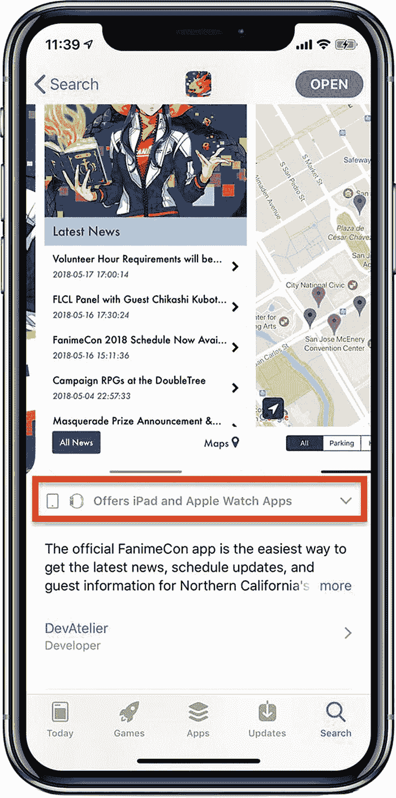

**图 10-1** 提供 watchOS 版本的 iOS 应用的 App Store 描述页面

准备好原始项目的副本后，进入 `File` 菜单，选择 **New ➤ Target**，操作方式与第 9 章中添加 tvOS 目标时完全相同。在弹出的模板选择窗口中，选择 **WatchKit App**，如图 10-2 所示。

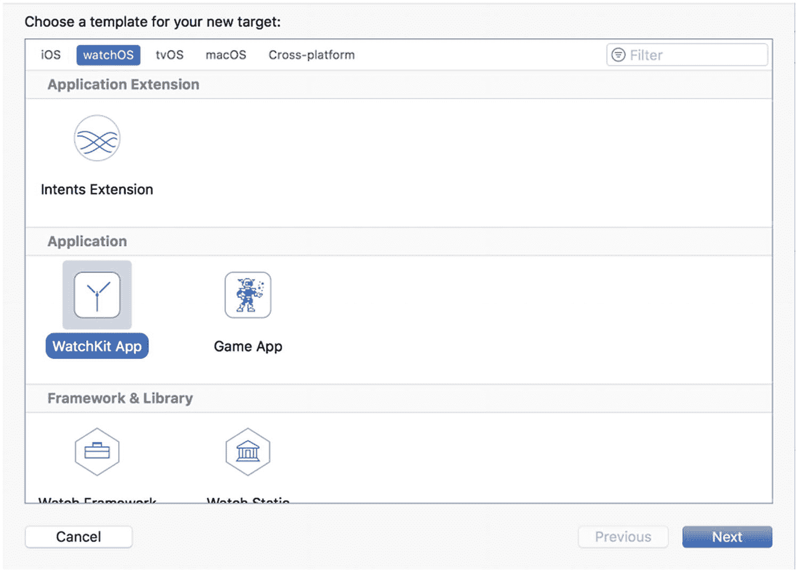

**图 10-2** 选择 WatchKit 应用模板

当被要求配置目标时，将其命名为 `IOTFitWatch`。如图 10-3 所示，确认产品设置为使用开发者账户的凭据进行构建，并且**不勾选**“**Include Notification Scene**”和“**Include Complication**”复选框。就本项目范围而言，你无需启用这两个选项。

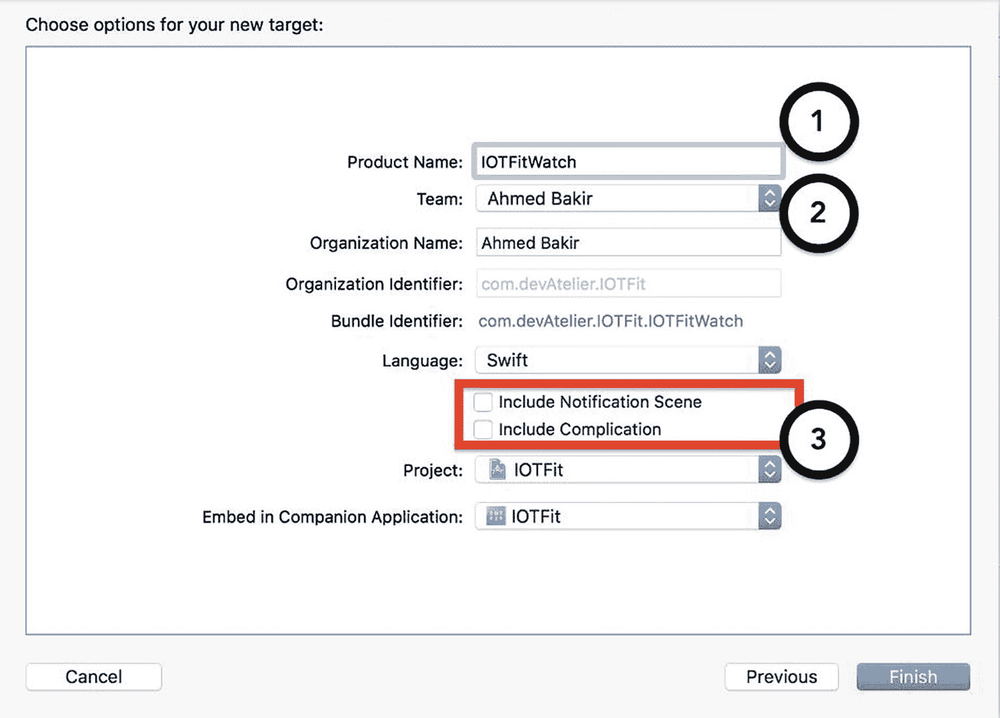

**图 10-3** 配置 watchOS 目标

首次向项目添加 watchOS 目标时，系统会要求你激活其目标，如图 10-4 所示。选择 **Activate** 以关闭弹出窗口，然后继续设置流程。

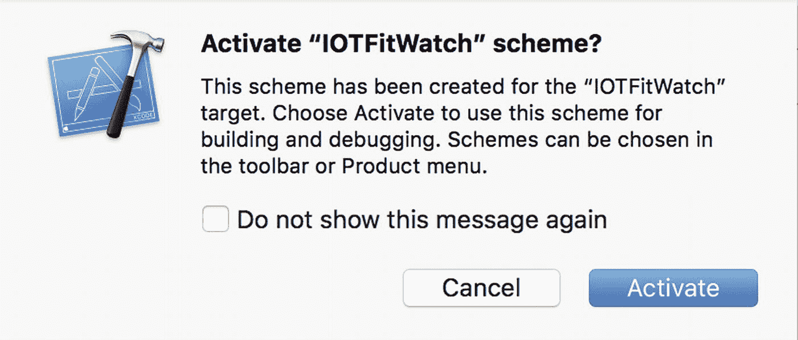

**图 10-4** 激活 watchOS 应用的方案

完成目标的设置后，你的项目中应包含两个新文件夹：`IOTFitWatch` 和 `IOTFitWatch Extension`，如图 10-5 所示。

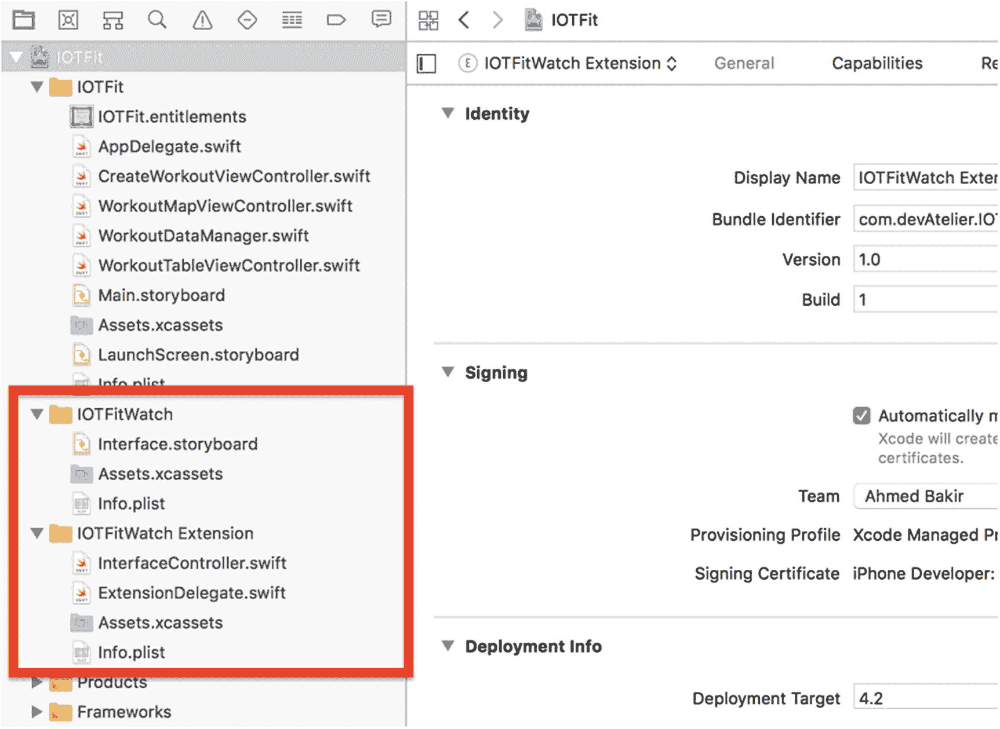

**图 10-5** 包含 watchOS 目标后的 `IOTFit` 项目

自 watchOS 1.0 起，Apple 便将 watchOS 应用分为两部分：一个仅包含静态资源（Storyboard、素材）的应用，以及一个包含代码的扩展。在 watchOS 1.0 中，Apple 并未在手表硬件上公开 watchOS 框架，而是由 iOS 应用利用该扩展来更新 WatchKit 应用组件所指定的视图。如今，这两部分都在手表硬件上运行，但 Apple 仍保留了这种逻辑分离模式。

接下来，你必须为 watchOS 应用需要使用的权限受限功能（用户位置、HealthKit 和 Core Motion）设置描述。最简单的方法是将 iOS 项目 `Info.plist` 文件中的隐私描述键值对复制到 `IOTFitWatch Extension` 文件夹的 `Info.plist` 文件中。你需要复制的键值对已作为代码提供在列表 10-1 中。你可以对 `Info.plist` 文件使用二次点击（右键单击）选项 **Open As ➤ Source Code**，以文本形式将其复制到文件中，也可以在属性列表检查器中查找 `Privacy...` 键值对并手动添加。

```
WKCompanionAppBundleIdentifier
com.devAtelier.IOTFit
...
NSHealthShareUsageDescription
IOTFit 希望使用 HealthKit 权限来导入锻炼数据
NSHealthUpdateUsageDescription
IOTFit 希望使用 HealthKit 权限来将锻炼数据导出到“健康”应用
NSLocationAlwaysAndWhenInUseUsageDescription
IOTFit 希望使用位置权限在锻炼期间绘制你的位置信息
NSLocationAlwaysUsageDescription
IOTFit 希望使用位置权限在锻炼期间绘制你的位置信息
NSLocationUsageDescription
IOTFit 希望使用位置权限在锻炼期间绘制你的位置信息
NSLocationWhenInUseUsageDescription
IOTFit 希望使用位置权限在锻炼期间绘制你的位置信息
NSMotionUsageDescription
IOTFit 希望使用运动权限来帮助你测量锻炼过程中的步数和海拔
```

**列表 10-1** `IOTFitWatch Extension` 的 `Info.plist` 文件中的隐私权限描述键值对

在设置流程的最后一步，你必须为 WatchKit App 启用后台模式，以便追踪用户的位置。如图 10-6 所示，在项目导航器顶部选择 `IOTFit` 项目文件，然后导航到 `IOTFitWatch Extension` 目标，并点击 **Capabilities** 选项卡。在“功能”详情界面中，启用 **Background Modes** 和 **Workout Processing**。

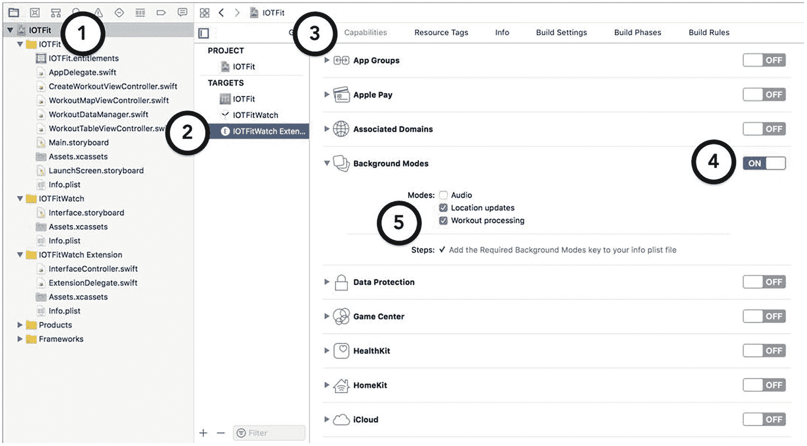

**图 10-6** 为 `IOTFitWatch` 应用启用后台模式


## 构建 watchOS 用户界面

现在 watchOS 目标已经配置完成，你可以开始搭建用户界面了。在这个项目中，我将 IOTFit 应用适配到了 Apple Watch 的尺寸，如图 10-7 所示。由于大多数用户在移动中或无法使用手机时才会与 Apple Watch 交互，因此你的界面设计应便于快速查看应用中最常用的信息，同时也要能轻松地在应用中创建新记录。

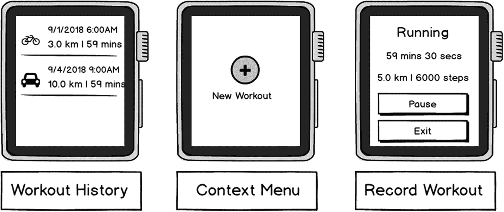

图 10-7

IOTFitWatch 应用的设计线框图

在 IOTFitWatch 应用中，我在主屏幕上展示了用户的锻炼历史记录，并提供了一个上下文菜单，用户可以通过它启动详情屏幕来记录新的锻炼。用户可以在锻炼屏幕上通过用力按压（重按）来调出上下文菜单。锻炼历史和记录锻炼屏幕会显示用户的活动类型，以帮助其识别不同的锻炼。

要开始开发用户界面，请打开 `IOTFitWatch` 文件夹下的 `Interface.storyboard` 文件。如图 10-8 所示，你会看到一个故事板，其中包含了应用中第一个视图控制器（`InterfaceController.swift`）的空白界面。

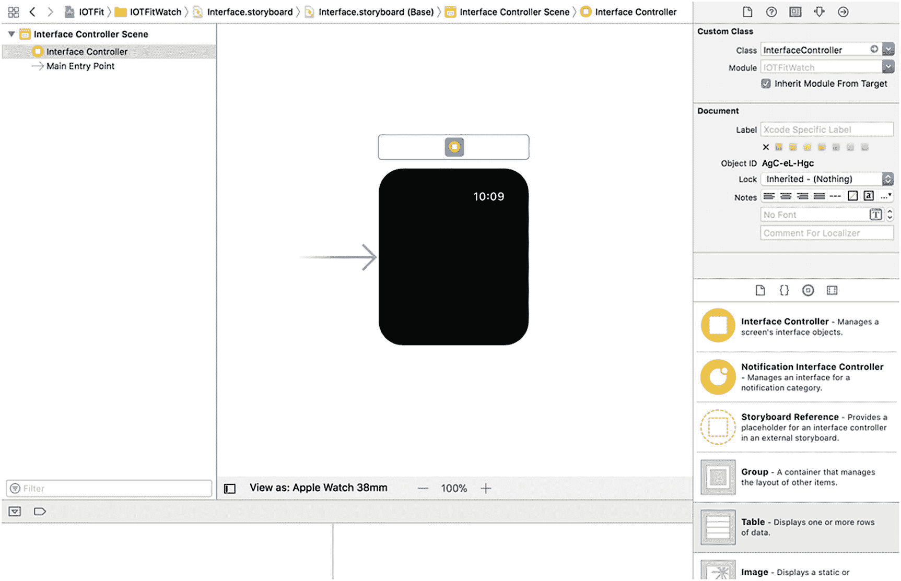

图 10-8

IOTFitWatch 项目的初始故事板（`Interface.storyboard`）

首先，布置锻炼历史记录屏幕。与 iOS 或 tvOS 应用类似，从对象库中将一个表格对象拖拽到视图控制器上，如图 10-9 所示。

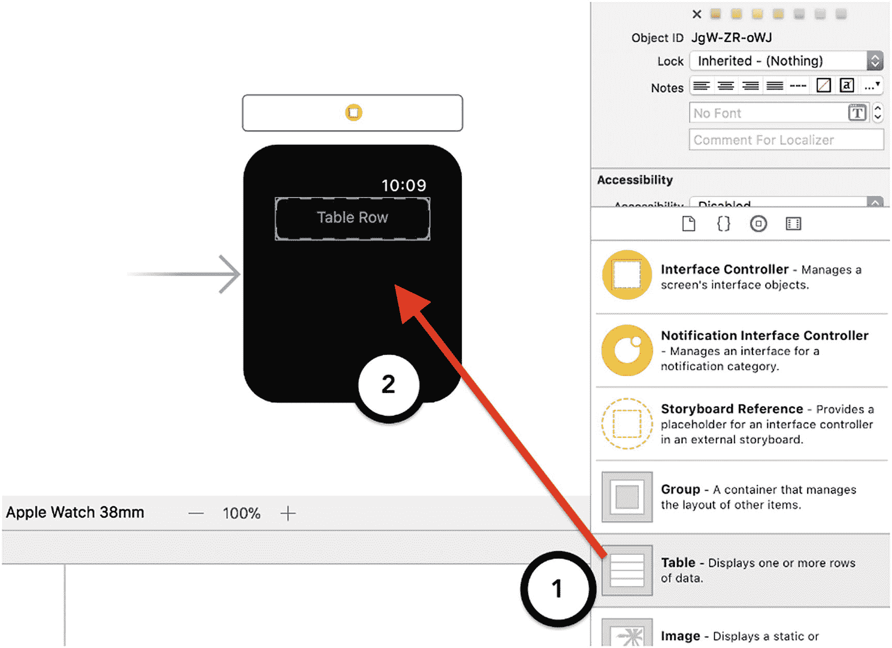

图 10-9

向记录锻炼视图控制器添加表格

如果你已升级到 Xcode 10，你的用户界面可能默认隐藏了对象库。要在 Xcode 10 中打开对象库，请点击 Xcode 右上角的库按钮（带 iPhone Home 按钮图标的那个），它位于 Interface Builder 中切换侧边栏的选项旁边，如图 10-10 所示。

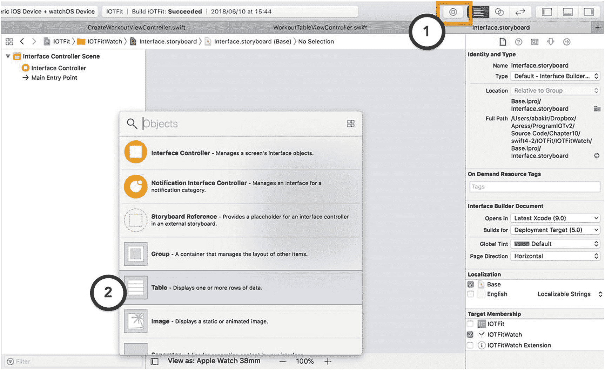

图 10-10

在 Xcode 10 中找到对象库

接下来，你需要配置表格视图单元格（在 watchOS 中称为*表格行*）的高度。如图 10-11 所示，点击表格行，然后在属性检查器（Interface Builder 的右侧详细面板）中，点击高度下拉菜单，选择“固定”。这将使所有行的高度保持一致。在我的实现中，我选择了 50 像素作为高度。

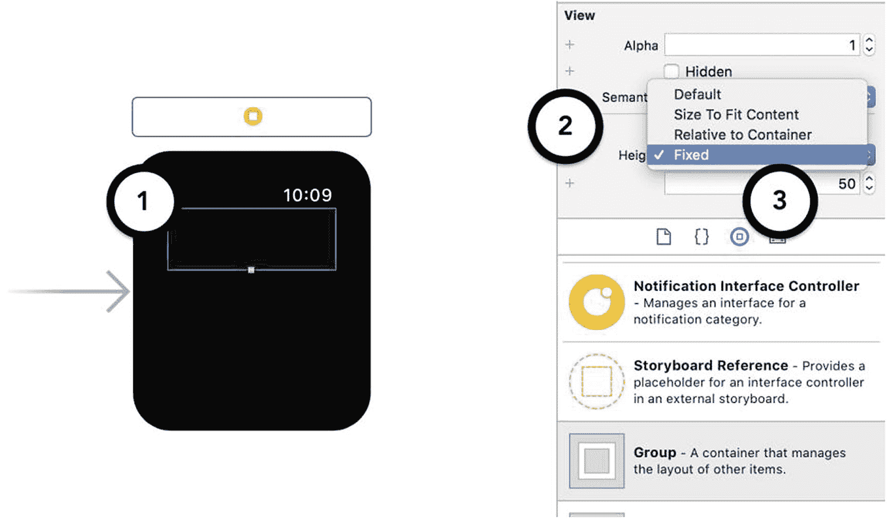

图 10-11

配置表格行的单元格高度

正如本章开头提到的，watchOS 仅继承 iOS 一小部分功能的一个副作用是：你必须使用堆栈视图来布局用户界面。堆栈视图管理一个容器视图，并根据一些配置参数（例如等高度、等间距）在容器中垂直或水平排列每个项目。为了实现图 10-7 中的用户界面（左侧是一张图片，右侧是两个垂直对齐的标签），你需要嵌套堆栈视图。父级堆栈视图将被配置为水平堆叠项目，并包含图像视图以及用于标签的堆栈视图。而用于标签的堆栈视图则会被配置为垂直堆叠项目。


### 实现 Stack Views 并配置 WatchKit 界面

要开始实现 Stack Views，从对象库中拖动一个`Group`到表格行上，如图 10-12 所示。这些组一开始会比 Apple Watch 的宽度更宽。要解决这个问题，点击每个组的右边缘并调整其大小，使图像视图的组小于标签的组。

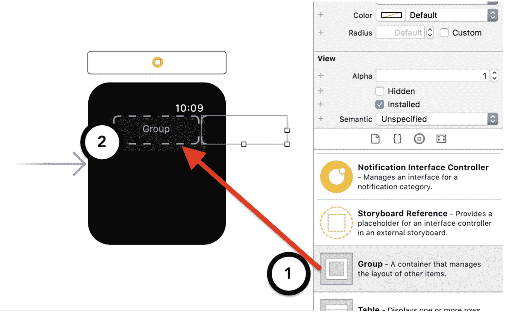

**图 10-12** 向表格行添加额外的组

接下来，从对象库中拖动`Image`和`Label`项到视图控制器上。您的表格行应该看起来像我图 10-13 中的实现。尽管图像视图显示正确，但标签需要调整。

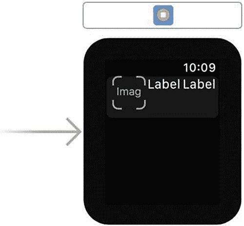

**图 10-13** 使用默认 Stack View 配置的表格行

要修复标签的布局，您必须配置 Stack View 使用垂直布局。如图 10-14 所示，选择该组，然后在"Layout"下拉菜单中选择"Vertical"。

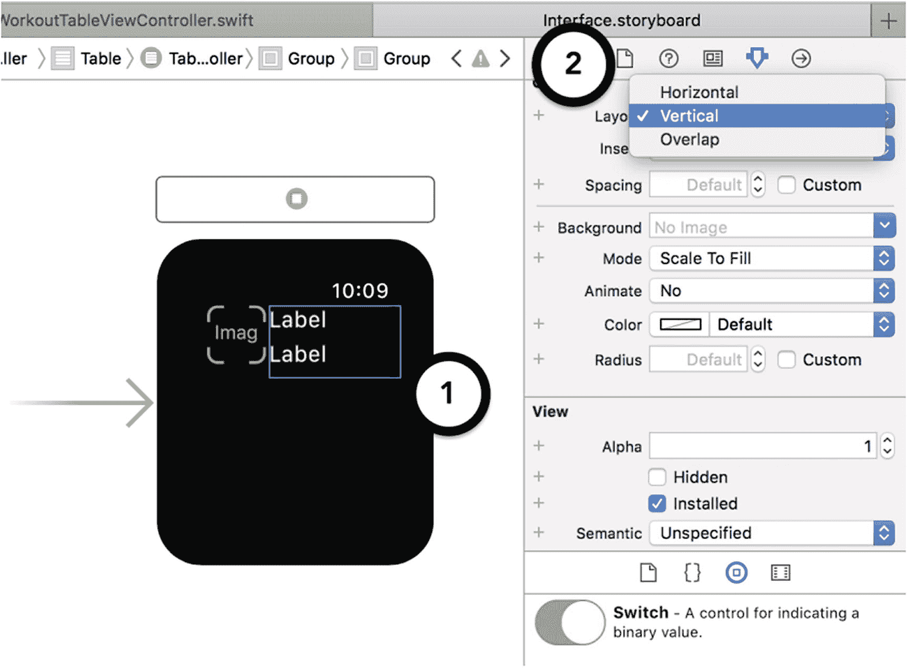

**图 10-14** 为 Stack View 配置垂直布局

要配置视图的字体大小、标签文本或其他选项，请选择该视图并使用 Attributes 检查器中的下拉菜单进行调整，如图 10-15 所示。将顶部标签的字体大小修改为"Subhead"后，您的表格行现在应该与原始设计中指定的样式匹配。

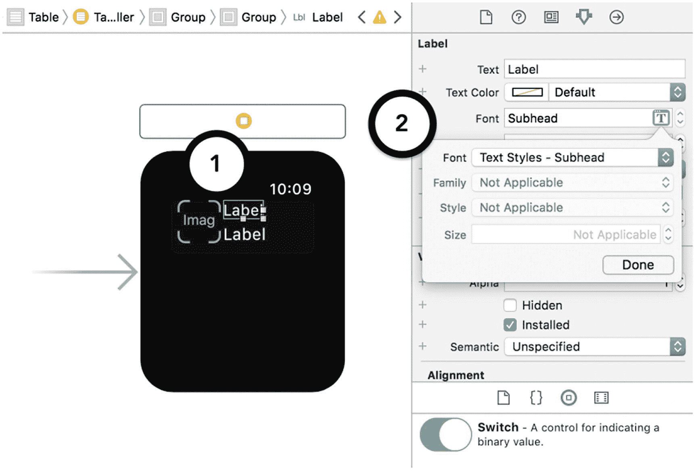

**图 10-15** 为 Stack View 配置文本大小和颜色

完成 Workout History 视图控制器的布局后，您可以布局 Workout Detail 视图控制器。使用对象库，将`Interface Controller`拖到故事板上，将其单个组配置为使用垂直布局，然后将`Label`和`Button`项拖到该组上。在配置视图之前，您的布局应该看起来类似于我图 10-16 中的结果。您可以使用左侧高亮显示的视图层次结构来帮助确定是否将子视图正确分配给了 Stack View 或普通的`UIView`。

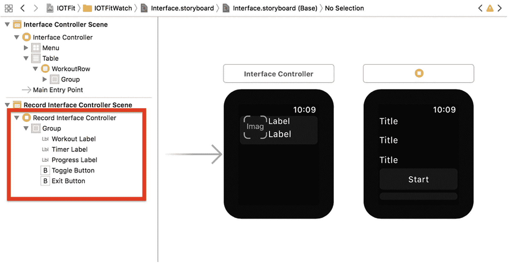

**图 10-16** 具有初始子视图安排的 Record Workout 视图控制器

配置文本大小、对齐方式和颜色后，您的最终故事板应该看起来类似于我图 10-17 中的实现。我将所有视图设置为使用`Body`或`Headline`文本样式并居中对齐。我将按钮的`color`属性设置为红色和蓝色，以使按钮更容易区分。

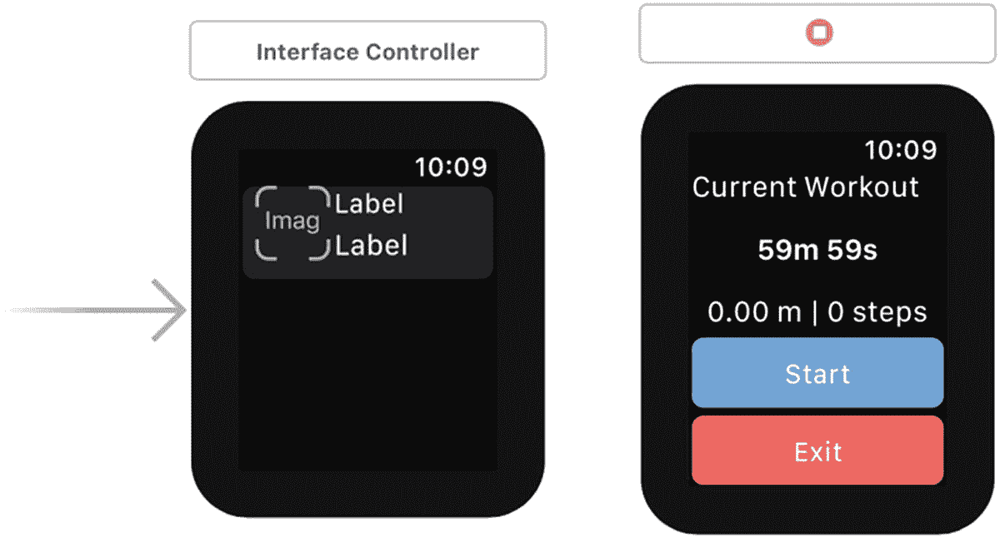

**图 10-17** IOTFitWatch 项目的最终故事板布局

正如您在 iOS 应用中所做的那样，要完成 watchOS 项目的用户界面设置，您必须将故事板连接到您的界面控制器（视图控制器）类。由于它的布局更直接，先从 Record Workout 界面控制器类开始。点击项目导航器中的`IOTFitWatch Extension`文件夹，然后从右键菜单中选择"New File"。如图 10-18 所示，从模板选择器弹出窗口中导航到"watchOS"，然后选择"WatchKit Class"。这相当于为 iOS 项目选择 Cocoa Touch 类模板。

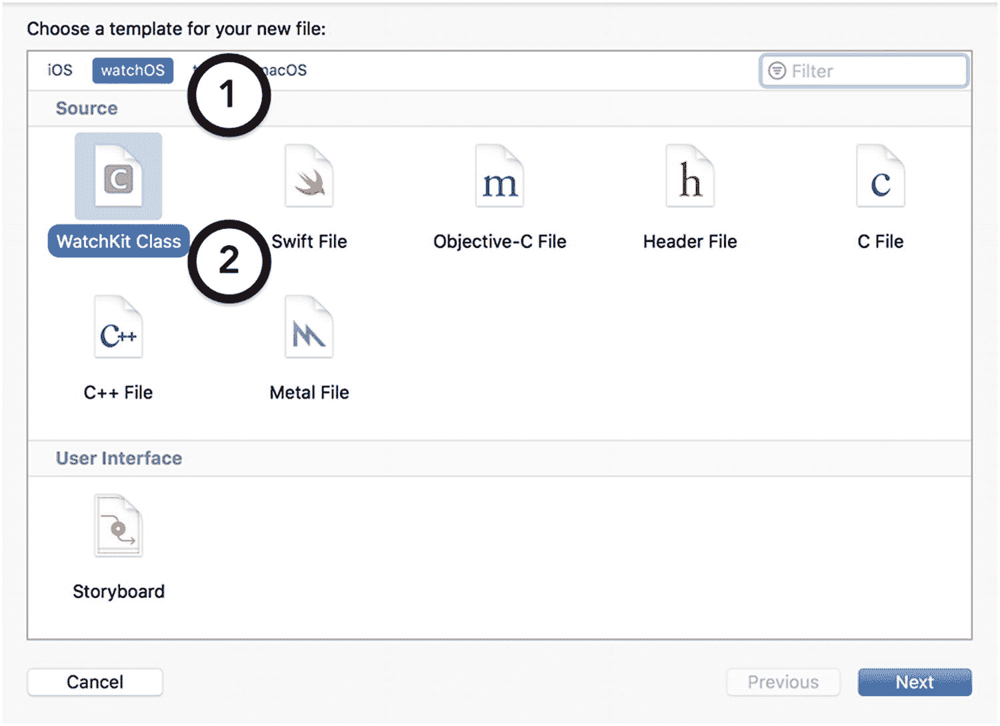

**图 10-18** 从文件模板窗口创建 WatchKit 类

当被要求选择父类时，输入"WKInterfaceController"。输入`RecordInterfaceController`作为类名。使用列表 10-2 中的示例作为类的内容。每个用户界面项都由一个`@IBOutlet`属性表示。与 iOS 应用不同，所有元素都是`WKInterface`类。

```
class RecordInterfaceController: WKInterfaceController {
    @IBOutlet var timerLabel: WKInterfaceLabel?
    @IBOutlet var workoutLabel: WKInterfaceLabel?
    @IBOutlet var progressLabel: WKInterfaceLabel?
    @IBOutlet var toggleButton: WKInterfaceButton?
    @IBOutlet var exitButton: WKInterfaceButton?

    override func willActivate() {
        super.willActivate()
    }

    override func didDeactivate() {
        super.didDeactivate()
    }
}
```

**列表 10-2** Record Interface Controller 类定义（`RecordInterfaceController.swift`）

与 iOS 应用相同的方式，要将故事板连接到`RecordInterfaceController`类，您必须将其设置为父类。如图 10-19 所示，在故事板上选择 Interface Controller，然后导航到 Identity Inspector（带有 ID 卡图标的标签页），并在`Class`文本字段中输入`RecordInterfaceController`。

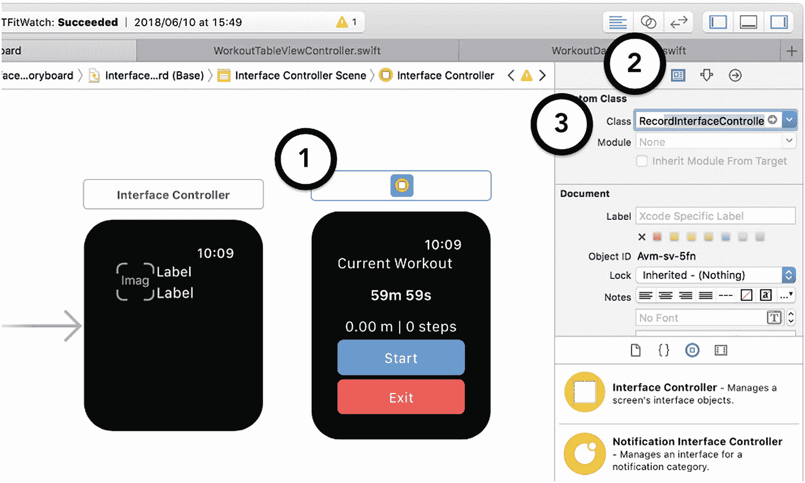

**图 10-19** 设置 watchOS Interface Controller 的所属关系

就像 iOS 故事板一样，从 Attributes 检查器将连接拖放到 Interface Controller 中的元素上，以完成连接过程，如图 10-20 所示。

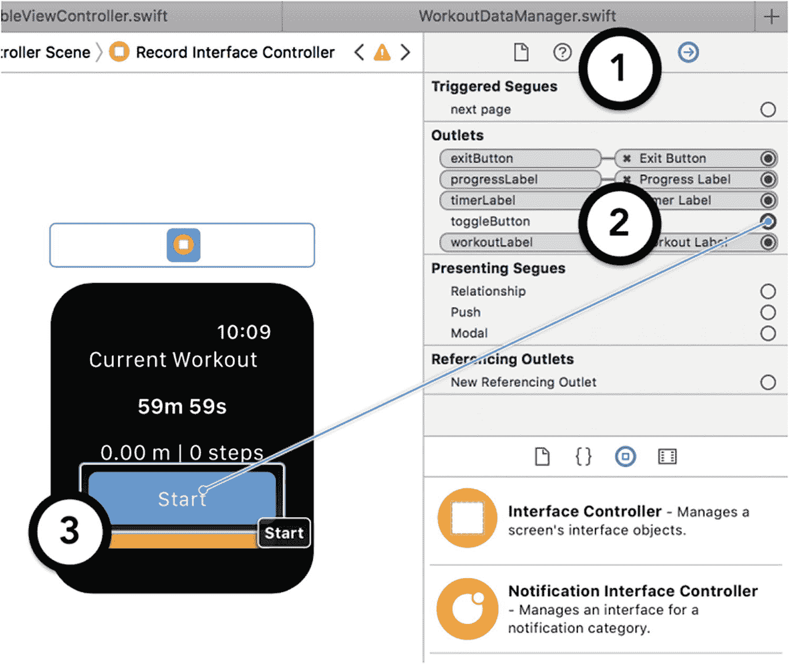

**图 10-20** 将 Outlets 连接到 Interface Controller 元素


### 使用 `WKInterfaceTable` 类设置表格视图

由于表格视图的存在，锻炼历史界面控制器的设置过程更为复杂。首先，修改默认 `InterfaceController` 类的定义，为表格视图添加插座变量，如代码清单 10-3 所示。更新定义后，在 Interface Builder 中连接该插座变量。

```
class InterfaceController: WKInterfaceController {
@IBOutlet var workoutTable: WKInterfaceTable?
...
}
代码清单 10-3
锻炼历史界面控制器类定义（InterfaceController.swift）
```

接下来，必须创建一个类来定义每一行表格，在 watchOS 术语中称之为*行控制器*。与 iOS 上可以使用 `UITableViewCell` 作为父类的表格视图单元格不同，watchOS 并没有为表格行定义父类。因此，你必须使用 `NSObject` 来定义一个同时兼容 Swift 和 Objective-C 的通用对象。除此之外，余下的设置过程就很简单了：你只需将用户界面元素作为新类的属性包含进来即可。在代码清单 10-4 中，我将表格行定义为 `WorkoutRowController` 类。该定义包含了图片视图和标签的属性。在 `IOTFitWatch Extension` 目标中添加一个名为 `WorkoutRowController.swift` 的新文件来存放这个类。

```
import WatchKit
class WorkoutRowController: NSObject {
@IBOutlet var icon: WKInterfaceImage?
@IBOutlet var dateLabel: WKInterfaceLabel?
@IBOutlet var durationLabel: WKInterfaceLabel?
}
代码清单 10-4
锻炼行控制器类定义（WorkoutRowController.swift）
```

接着，返回 Interface Builder 并选择表格行。如图 10-21 所示，首先点击属性检查器（右侧窗格的倒数第二个标签页），为该行设置一个标识符。记下这个标识符，稍后在为表格填充数据时会用到。

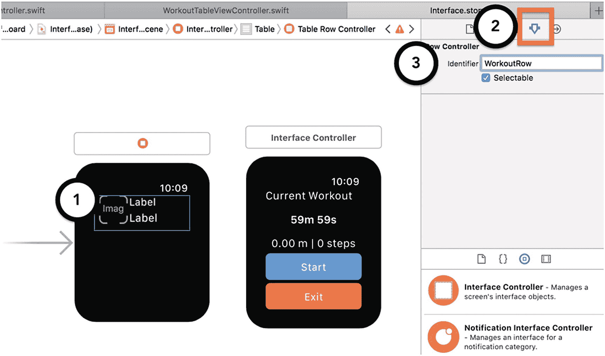

图 10-21

设置行控制器的标识符

设置完标识符后，点击身份检查器（第三个标签页），以同样的方式将类设置为 `WorkoutRowController`，就像你之前将 `WorkoutInterfaceController` 与其定义关联起来一样。如果操作成功，你应该能在连接检查器（最后一个标签页）中看到行控制器的属性，并成功将它们连接到故事板，如图 10-22 所示。

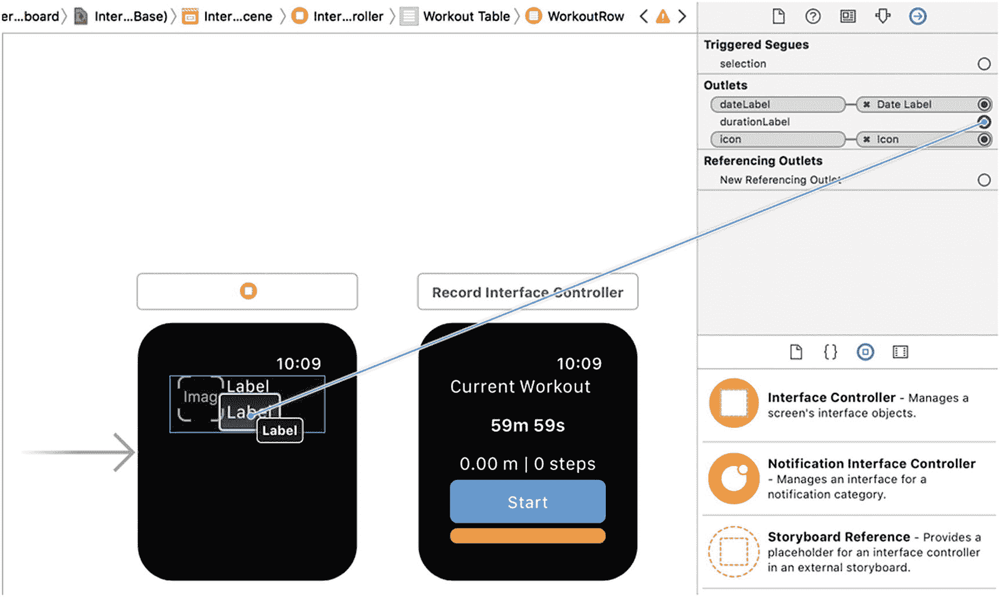

图 10-22

将输出口连接到行控制器

### 添加 Force Touch 支持

作为用户界面拼图的最后一块，你将学习如何使用 Force Touch 来显示一个上下文菜单，以启动向“记录锻炼”界面控制器的跳转。虽然你也可以像在 iOS 应用中那样使用 Segue，但使用 Force Touch 能为 Apple Watch 提供更原生的体验。*Force Touch*（在 iPhone 上则称为 3D Touch）是苹果公司用来描述其触摸板压力敏感度的术语，最早从 iPhone 6S 开始，后来发展到 MacBook Pro 和 Apple Watch。这些设备支持两种触摸事件：*浅按*，即普通的触摸事件，用于选择项目；以及*深按*，即在屏幕上长按用力按压，用于调出上下文菜单。

你可以通过向界面控制器添加上下文菜单，在 watchOS 应用中启用 Force Touch。要向界面控制器添加上下文菜单，从对象库中拖拽一个 `Menu` 对象并放到目标界面控制器上。如图 10-23 所示，在向锻炼历史界面控制器添加上下文菜单后，该菜单会被添加到其视图层级中。

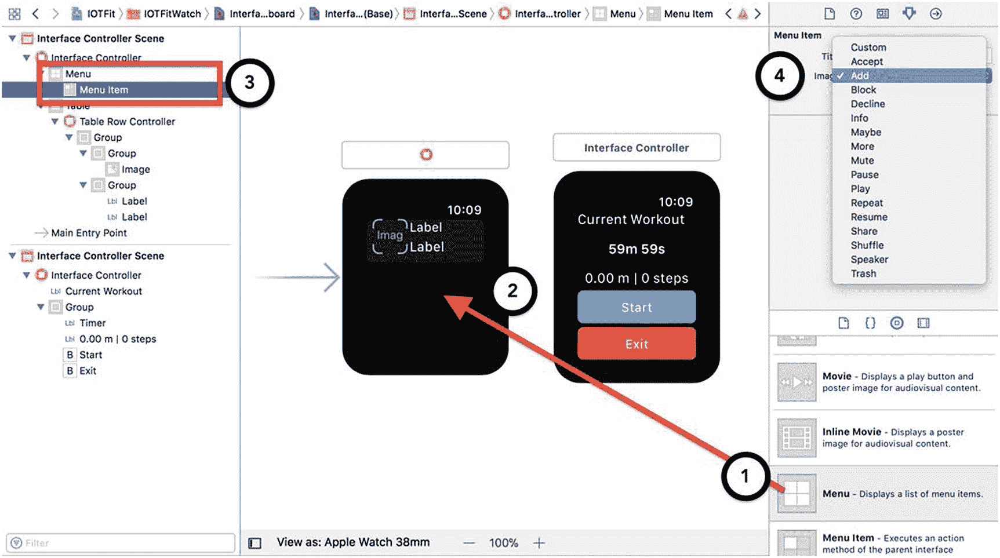

图 10-23

添加并配置上下文菜单

默认情况下，上下文菜单会包含一个菜单项。对于 IOTFitWatch 应用，你只需要一个“添加”按钮，用于呈现“记录锻炼”界面控制器。要自定义该菜单项，从视图层级中选择它，然后使用属性检查器设置标题和图标。在我的实现中，我选择了“添加”图标，并将菜单项命名为“新建锻炼”。

为了启用向“记录锻炼”界面控制器的跳转，或根据菜单选择执行其他任何操作，你必须声明一个带有 `@IBAction` 关键字的方法，以表明该方法应能被 Interface Builder 发现。在代码清单 10-5 中，我添加了一个名为 `presentRecordInterface()` 的方法来处理跳转。

```
class InterfaceController: WKInterfaceController {
@IBOutlet var workoutTable: WKInterfaceTable?
...
@IBAction func presentRecordInterface() {
presentController(withName:
"RecordInterfaceController", context: nil)
}
}
代码清单 10-5
添加用于呈现记录锻炼界面的方法（InterfaceController.swift）
```

watchOS 提供了一个 `presentController(withName:context:)` 方法，用于从一个界面控制器呈现另一个界面控制器，类似于 iOS 上的 `present(animated:completion:)` 方法。要在 watchOS 上使用此方法，你必须为目标界面控制器提供 `Identifier` 字符串和一个上下文对象，该对象可用于在两个界面控制器之间共享数据。在之前的设置步骤中，虽然你为“记录锻炼”界面控制器设置了类，但并未设置标识符。要添加标识符，请选择“记录锻炼”界面控制器，然后导航到属性检查器，如图 10-24 所示。

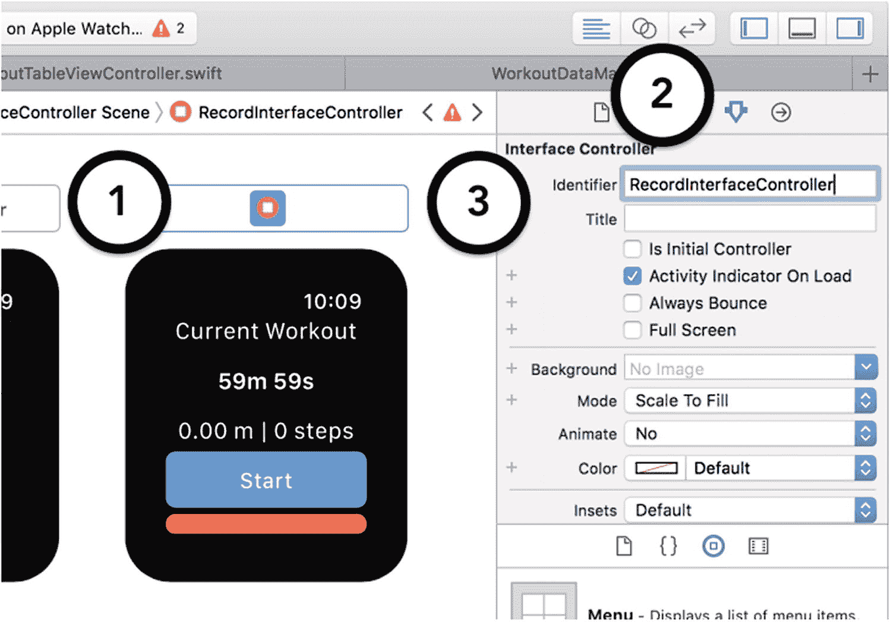

图 10-24

为界面控制器添加标识符字符串

现在，`presentRecordInterface()` 方法的所有前提条件都已满足，你可以将其连接到故事板了。要执行此操作，请在视图层级中选择菜单项，导航到连接检查器，然后从 selector 项拖拽出一条连接线到“记录锻炼”界面控制器。如图 10-25 所示，`presentRecordInterface()` 方法签名应显示为一个可选项。

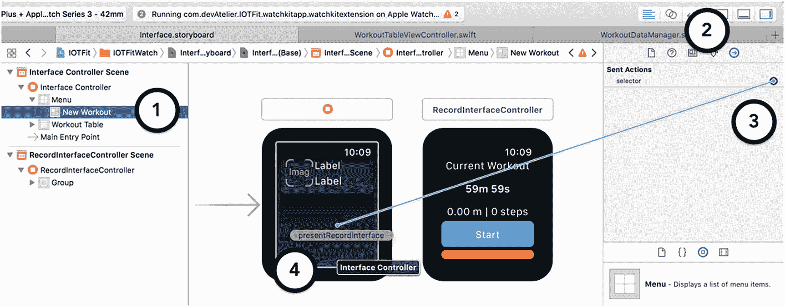

图 10-25


### 将选择器连接到接口控制器中的方法

要测试上下文菜单，请从 Xcode 中运行按钮旁边的菜单中选择一个与 Apple Watch 模拟器配对的 iOS 模拟器（例如，`iPhone 8 Plus + Apple Watch Series 3`）。虽然手表的“锻炼历史”屏幕最初是空的，如图 10-26 所示，但您可以在 Mac 的触控板上执行深按操作，以在模拟器中调出上下文菜单。或者，您可以通过进入“硬件”菜单并选择“触控压力” ➤ “深按”，在模拟器中启用深按操作。

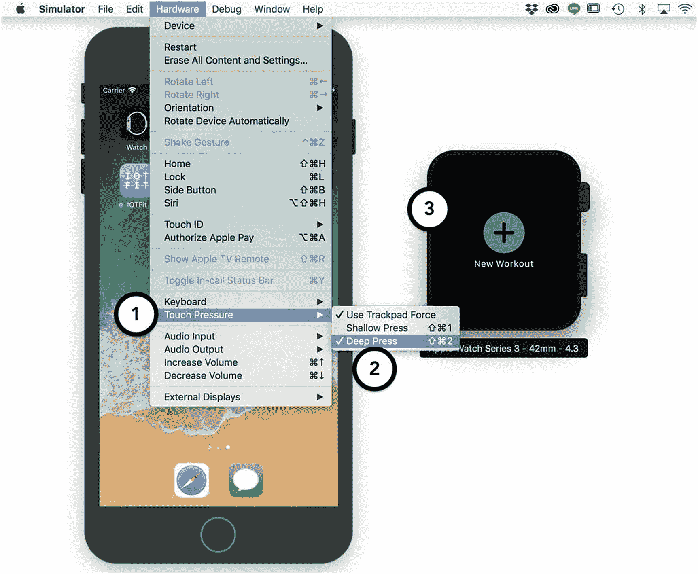

**图 10-26：** 从 Apple Watch 模拟器调试上下文菜单

要关闭“记录锻炼”接口控制器，请创建一个`exit()`函数，如代码清单 10-6 所示，该函数将调用`dismiss()`方法来关闭接口控制器。此方法的行为方式与 iOS 中的`dismissViewController()`方法相同，即从视图层次结构中关闭模态接口控制器。使用 Interface Builder 中的连接检查器，将`exit()`方法设置为“退出”按钮的选择器，方式与连接上下文菜单的选择器相同。

```swift
class RecordInterfaceController: WKInterfaceController {
...
@IBAction func exit() {
dismiss()
}
}
```

**代码清单 10-6：** 关闭“记录锻炼”屏幕（`RecordInterfaceController.swift`）

## 使用 Core Location 和 Core Motion 创建新锻炼

IOTFit 应用最初是一个基于位置的简单锻炼跟踪应用，随着您学习更多基于传感器的框架，它通过采用 Core Motion 和 HealthKit 扩展为一个精确、详细的应用。苹果将这两个框架以及 Core Location 都纳入了可以在 Apple Watch 上独立运行的二进制文件集，补充了它们在健身应用中的广泛应用。

要开始实现 Apple Watch 应用的独立功能，请从“记录锻炼”接口控制器入手。它服务于与 iOS 项目中的“创建锻炼”视图控制器相同的目的，允许用户开始和停止锻炼会话。正如本章开头所述，将 IOTFitWatch 应用添加到 IOTFit iOS 项目的目标之一是在应用之间共享代码。快速浏览`CreateWorkoutViewController`类，您会注意到许多繁重的工作，包括记录位置、将锻炼保存到 HealthKit 以及格式化时间字符串，都是由`WorkoutDataManager`类处理的。由于这些功能中的大部分也适用于 watchOS 应用，因此您应尝试将其添加到 watchOS 目标中。要执行此操作，请在项目导航器中单击`WorkoutDataManager.swift`文件，选择 Xcode 右侧窗格中的“文件检查器”选项卡（带有文档图标的选项卡），然后选中`IOTFitWatch Extension`旁边的复选框，如图 10-27 所示。

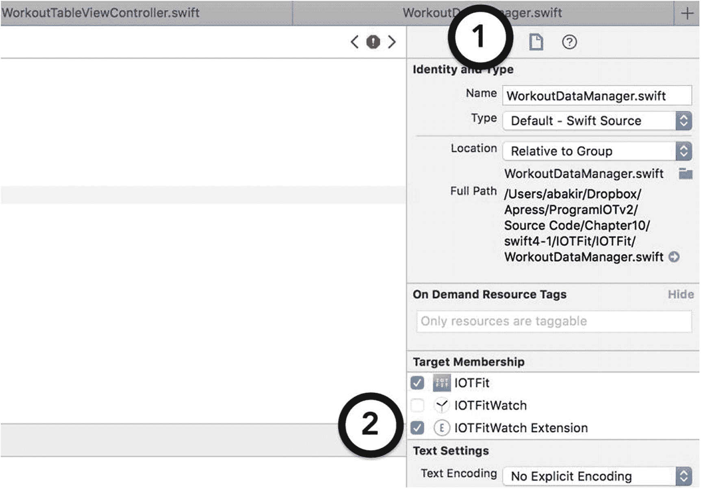

**图 10-27：** 将`WorkoutDataManager`类添加到`IOTFitWatch Extension`目标

在 Xcode 仍设置为编译 iPhone + Apple Watch 模拟器的情况下，尝试编译已将`WorkoutDataManager`类包含在目标中的 watchOS 应用。由于无法解析`WorkoutType`和`WorkoutState`的定义，编译应会失败。在 IOTFit 项目的纯 iOS 实现中，这些类型是在`CreateWorkoutViewController`类内部定义的，该类无法包含在 watchOS 目标中。要修复编译问题，请将这些值移到`WorkoutDataManager`类的顶部，如代码清单 10-7 所示。现在，watchOS 应用应能成功编译。

```swift
import Foundation
import CoreLocation
import HealthKit
enum WorkoutState {
case inactive
case active
case paused
}
struct WorkoutType {
static let automotive = "Driving"
static let running = "Running"
static let bicycling = "Bicycling"
static let stationary = "Stationary"
static let walking = "Walking"
static let unknown = "Unknown"
}
let timerInterval : TimeInterval = 1.0
...
class WorkoutDataManager {
static let sharedManager = WorkoutDataManager()
...
}
```

**代码清单 10-7：** 完善`WorkoutDataManager`类

要继续实现“记录锻炼”接口控制器，请从“创建锻炼”视图控制器移植状态初始化代码。回顾 iOS 版本，您会注意到视图控制器通过一系列最初设置为`0`值的属性来维护其状态。当视图控制器加载时，您使用这些值来初始化用户界面中的标签。在代码清单 10-8 中，我扩展了“记录锻炼”接口控制器类，以包含这些属性和`updateUserInterface()`方法。特别要注意，watchOS 接口控制器是通过`willActivate()`方法（而不是 iOS 上的`viewWillAppear()`）被唤醒的，并且用于设置按钮标题的便捷方法要简短得多。


```swift
class RecordInterfaceController: WKInterfaceController {
...
var currentWorkoutState = WorkoutState.inactive
var currentWorkoutType = WorkoutType.unknown
var workoutStartTime : Date?
var lastSavedTime : Date?
var workoutDuration : TimeInterval = 0.0
var workoutTimer : Timer?
var workoutAltitude : Double = 0.0
var workoutDistance : Double = 0.0
var averagePace : Double = 0.0
var floorsAscended : Double = 0.0
var workoutSteps : Double = 0.0
var lastSavedLocation : CLLocation?
var isMotionAvailable : Bool = false
...
override func willActivate() {
super.willActivate()
updateUserInterface()
}
...
func updateUserInterface() {
switch(currentWorkoutState) {
case .active:
toggleButton?.setTitle("Stop")
case .paused:
toggleButton?.setTitle("Resume")
default:
toggleButton?.setTitle("Start")
}
}
}
```
**列表 10-8** 向 `RecordInterfaceController` 类添加状态

接下来，您需要实现开始或停止锻炼的方法。如列表 10-9 所示，通过移植开始、停止和重置锻炼的方法来实现此功能。这些方法利用`currentWorkoutState`变量来确定界面控制器的当前状态，然后据此请求设备权限、开始测量或停止测量并将界面控制器重置回初始状态。这些方法几乎是从 iOS 版本直接复制过来的。请确保将`toggleWorkout()`方法连接到故事板上的`Start`按钮以启用它。

```swift
import UIKit
import CoreLocation
import CoreMotion
class RecordInterfaceController: WKInterfaceController {
...
var pedometer : CMPedometer?
var motionManager : CMMotionActivityManager?
var altimeter : CMAltimeter?
let locationManager = CLLocationManager()
...
func resetWorkoutData() {
lastSavedTime = Date()
workoutDuration = 0.0
workoutDistance = 0.0
workoutAltitude = 0.0
workoutSteps = 0
floorsAscended = 0
averagePace = 0.0
currentWorkoutType = WorkoutType.unknown
}
func startWorkout() {
currentWorkoutState = .active
UserDefaults.standard.setValue(true, forKey:
"isConfigured")
UserDefaults.standard.synchronize()
workoutTimer = Timer.scheduledTimer(timeInterval:
timerInterval, target: self, selector:
#selector(updateWorkoutData), userInfo: nil,
repeats: true)
locationManager.startUpdatingLocation()
lastSavedTime = Date()
workoutStartTime = Date()
WorkoutDataManager.sharedManager.createNewWorkout()
if (CMMotionManager().isDeviceMotionAvailable &&
CMPedometer.isStepCountingAvailable() &&
CMAltimeter.isRelativeAltitudeAvailable()) {
isMotionAvailable = true
startPedometerUpdates()
startActivityUpdates()
startAltimeterUpdates()
} else {
NSLog("Motion acitivity not available on device.")
isMotionAvailable = false
}
}
func stopWorkoutTimer() {
workoutTimer?.invalidate()
}
@IBAction func toggleWorkout() {
switch currentWorkoutState {
case .inactive:
requestLocationPermission()
case .active:
currentWorkoutState = .inactive
stopWorkoutTimer()
pedometer?.stopUpdates()
motionManager?.stopActivityUpdates()
altimeter?.stopRelativeAltitudeUpdates()
if let workoutStartTime = workoutStartTime {
let workout = Workout(startTime:
workoutStartTime, endTime: Date(), duration:
workoutDuration, locations: [], workoutType:
self.currentWorkoutType, totalSteps: workoutSteps, flightsClimbed: floorsAscended, distance: workoutDistance)
WorkoutDataManager.sharedManager.saveWorkout(workout)
}
default:
NSLog("toggleWorkout() called out of context!")
}
updateUserInterface()
}
}
```
**列表 10-9** 在 `RecordInterfaceController` 类中切换状态

要开始监控用户的位置、运动活动并获取 HealthKit 的访问权限，请移植用于请求权限和开始更新的方法，如列表 10-10 所示。与 iOS 版本相比，最大的区别在于，您必须限制某些硬件管理器对象的配置选项，因为这些选项在 watchOS 上不可用。

```swift
class RecordInterfaceController: WKInterfaceController {
...
func startPedometerUpdates() {
guard let workoutStartTime = workoutStartTime
else { return }
pedometer = CMPedometer()
pedometer?.startUpdates(from: workoutStartTime,
withHandler: { [weak self] (pedometerData : CMPedometerData?, error: Error?) in
NSLog("Received pedometer update!")
if let error = error {
NSLog("Error reading pedometer data")
return
}
guard let pedometerData = pedometerData,
let distance = pedometerData.distance as?
Double,
let averagePace =
pedometerData.averageActivePace as? Double,
let steps = pedometerData.numberOfSteps as?
Int,
let floorsAscended =
pedometerData.floorsAscended as? Int else {
return
}
self?.workoutDistance = distance
self?.floorsAscended = Double(floorsAscended)
self?.workoutSteps = Double(steps)
self?.averagePace = averagePace
})
}
func startActivityUpdates() {
motionManager = CMMotionActivityManager()
motionManager?.startActivityUpdates(to:
OperationQueue.main, withHandler: { [weak self]
(activity : CMMotionActivity?) in
guard let activity = activity else {
return
}
if activity.walking {
self?.currentWorkoutType = WorkoutType.walking
} else if activity.running {
self?.currentWorkoutType = WorkoutType.running
} else if activity.cycling {
self?.currentWorkoutType =
WorkoutType.bicycling
} else if activity.stationary {
self?.currentWorkoutType =
WorkoutType.stationary
} else {
self?.currentWorkoutType = WorkoutType.unknown
}
})
}
func startAltimeterUpdates() {
altimeter = CMAltimeter()
altimeter?.startRelativeAltitudeUpdates(to:
OperationQueue.main, withHandler: { [weak self]
(altitudeData : CMAltitudeData?, error: Error?) in
if let error = error {
NSLog("Error reading altimeter data")
return
}
guard let altitudeData = altitudeData,
let relativeAltitude =
altitudeData.relativeAltitude as? Double else {
return
}
self?.workoutAltitude = relativeAltitude
})
}
func requestLocationPermission() {
if CLLocationManager.locationServicesEnabled() {
locationManager.desiredAccuracy =
kCLLocationAccuracyNearestTenMeters
locationManager.distanceFilter = 10.0
locationManager.allowsBackgroundLocationUpdates =
true
locationManager.delegate = self
switch(CLLocationManager.authorizationStatus()) {
case .notDetermined:
locationManager.requestWhenInUseAuthorization()
case .authorizedWhenInUse :
requestAlwaysPermission()
case .authorizedAlways:
resetWorkoutData()
startWorkout()
default:
NSLog("Unable to request location")
}
} else {
NSLog("Unable to init location")
}
}
func requestAlwaysPermission() {
if let isConfigured =
UserDefaults.standard.value(forKey:
"isConfigured") as? Bool, isConfigured == true {
startWorkout()
} else {
locationManager.requestAlwaysAuthorization()
}
}
}
```
**列表 10-10** 在 `RecordInterfaceController` 类中请求和监控硬件更新

最后，为完成设置过程，您必须扩展记录界面控制器以实现`CLLocationManagerDelegate`协议。如列表 10-11 所示，您可以直接从 iOS 应用移植此内容，但暂停/恢复委托方法除外，因为这些方法在 watchOS 上不可用。
```


```swift
class RecordInterfaceController: WKInterfaceController {
...
}
extension RecordInterfaceController : CLLocationManagerDelegate {
func locationManager(_ manager: CLLocationManager,
didChangeAuthorization status: CLAuthorizationStatus) {
switch status {
case .authorizedWhenInUse:
requestAlwaysPermission()
case .authorizedAlways:
resetWorkoutData()
startWorkout()
case .denied:
NSLog("location permission denied")
default:
NSLog("Unhandled Location Manager Status:
\(status)")
}
}
func locationManager(_ manager: CLLocationManager,
didUpdateLocations locations: [CLLocation]) {
guard let mostRecentLocation = locations.last else {
NSLog("Unable to read most recent location")
return
}
lastSavedLocation = mostRecentLocation
NSLog("Most recent location: \(String(describing:
mostRecentLocation))")
WorkoutDataManager.sharedManager.addLocation(coordinate:
mostRecentLocation.coordinate)
}
}
```

**代码清单 10-11** 为 `RecordInterfaceController` 类添加 `CLLocationManagerDelegate` 协议支持

要测试应用程序，请选择 iPhone + Apple Watch 模拟器或您的 iPhone + Apple Watch，然后尝试运行 `IOTFitWatch` 目标。首次运行 Apple Watch 目标时，系统会提示您打开 iPhone 上的 `IOTFit` 应用，以接受健康、运动和位置权限，如图 10-28 所示。按下 iOS 上 `IOTFit` 应用中的 Start 按钮以请求这些权限。尽管该应用的大部分功能可以在不与手机配对的情况下运行，但在手机上接受权限请求仍然是 watchOS 的一个限制。

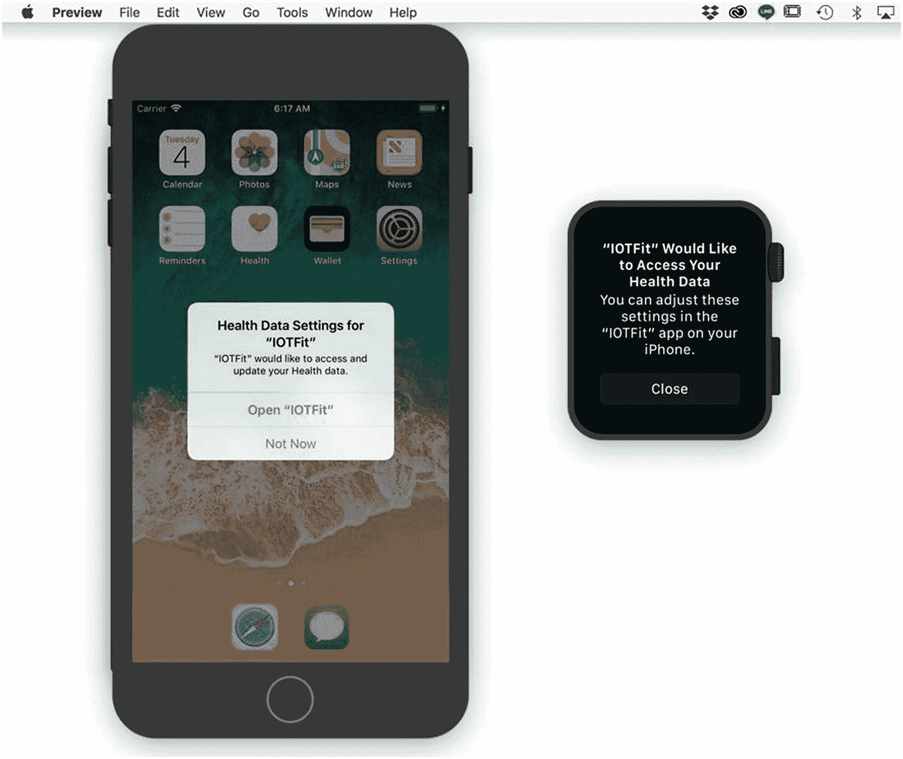

**图 10-28** Apple Watch 应用的权限请求对话框

接受所有权限后，您可以按下 Apple Watch 应用中的 Close 按钮返回锻炼历史界面控制器。现在，当您从上下文菜单中呈现记录锻炼界面控制器时，您将能够通过用户界面开始和停止锻炼。

## 使用 HealthKit 填充锻炼历史表格

要完成 `IOTFitWatch` 应用的核心功能，您必须用用户过去锻炼的数据填充锻炼历史界面控制器。与记录锻炼界面控制器类似，您可以利用 `IOTFit` iOS 应用中的代码来完成此任务。在 iOS 应用中，锻炼历史由 `WorkoutTableViewController` 类管理。查看此类时，您会记得您是通过调用共享 Workout Data Manager 上的 `loadWorkoutsFromHealthKit()` 方法来获取表格视图数据的，该方法会查询 HealthKit 以获取用户保存在其设备上的所有锻炼记录。由于您在上一节中成功设置了 HealthKit 权限并将 Workout Data Manager 导入到 `IOTFitWatch` 目标中，因此您可以在此处利用它们来加载表格视图数据。

首先，移植加载表格的逻辑。在 `IOTFit` iOS 应用中，每当视图控制器呈现时，都会通过 `viewWillAppear(animated:)` 方法刷新锻炼表格视图控制器的数据。在 watchOS 中，与此方法对应的是 `willActivate()` 方法。如代码清单 10-12 所示，扩展 `InterfaceController` 类以在每次激活时获取数据。`WKInterfaceTable` 类没有定义用于初始化其数据的协议，因此包含一个用于刷新表格视图数据的存根方法。

```swift
class InterfaceController: WKInterfaceController {
    @IBOutlet var workoutTable: WKInterfaceTable?
    var workouts : [Workout]?
    let dateFormatter = DateFormatter()

    override func awake(withContext context: Any?) {
        super.awake(withContext: context)
        // 在此处配置界面对象。
        dateFormatter.dateStyle = .medium
    }

    override func willActivate() {
        // 当手表视图控制器即将对用户可见时调用此方法
        super.willActivate()
        WorkoutDataManager.sharedManager.loadWorkoutsFromHealthKit { [weak self] (fetchedWorkouts: [Workout]?) in
            if let fetchedWorkouts = fetchedWorkouts {
                self?.workouts = fetchedWorkouts
                DispatchQueue.main.async {
                    self?.refreshTable()
                }
            }
        }
    }

    func refreshTable() {
        // TODO: 在此处构建表格
    }
}
```

**代码清单 10-12** 在锻炼历史界面控制器变为活动状态时获取数据（`InterfaceController.swift`）

在 watchOS 中设置表格视图需要完成三项主要任务：指定表格中的行数、通过标识符字符串查找单元格以及初始化找到的单元格。在代码清单 10-13 中，我扩展了 `refreshTable()` 方法以包含此逻辑。请特别注意为行控制器使用与 storyboard 中完全相同的标识符字符串。

```swift
class InterfaceController: WKInterfaceController {
    ...
    func refreshTable() {
        guard let workouts = workouts else { return }
        workoutTable?.setNumberOfRows(workouts.count, withRowType: "WorkoutRow")
        for index in 0..<workouts.count {
            guard let row = workoutTable?.rowController(at: index) as? WorkoutRowController else { return }
            let selectedWorkout = workouts[index]
            let dateString = dateFormatter.string(from: selectedWorkout.startTime)
            let durationString = WorkoutDataManager.stringFromTime(timeInterval: selectedWorkout.duration)
            let detailText = String(format: "%.0f m | %@", arguments: [selectedWorkout.distance, durationString])
            row.dateLabel?.setText(dateString)
            row.durationLabel?.setText(detailText)
        }
    }
}
```

**代码清单 10-13** 在锻炼历史表格视图（`InterfaceController.swift`）中获取数据


为应用添加图标时，将`FontAwesome.swift`（[`github.com/thii/FontAwesome.swift`](https://github.com/thii/FontAwesome.swift)）通过拖放其 Swift 和字体（`.otf`）文件导入项目，操作方式与第 9 章的 tvOS 项目相同。将文件复制到项目后，必须更改文件的所有权以便正确暴露给 watchOS。对于字体文件，需确保它们属于所有三个目标（`IOTFit`、`IOTFitWatch`和`IOTFitWatch Extension`）。如前所述，此更改是必需的，因为 watchOS 使用 Watch App 目标来存储静态文件。在 Swift 文件中，从`IOTFitWatch Extension`目标中移除 UIView 子类，包括`FontAwesomeBarButtonItem.swift`、`FontAwesomeTabBarItem.swift`和`FontAwesomeSegmentedControl.swift`。完成这些更改后，`IOTFitWatch`应用应能再次编译。

要为每一行设置图像，可借鉴`IOTHomeTV`应用的逻辑：将锻炼类型映射到 Font Awesome 图标名称，然后使用该名称创建`UIImage`对象。与`IOTHomeTV`应用一样，使用 Font Awesome 官方搜索页面查找符号名称：[www.fontawesome.com/icons?d=gallery&m=free](http://www.fontawesome.com/icons?d=gallery%2526m=free)。在代码清单 10-14 中，我已使用此逻辑更新了`refreshTable()`方法。

```
class InterfaceController: WKInterfaceController {
...
func refreshTable() {
guard let workouts = workouts else { return }
workoutTable?.setNumberOfRows(workouts.count,
withRowType: "WorkoutRow")
for index in 0..<workouts.count {
guard let row =
workoutTable?.rowController(at:
index) as? WorkoutRowController
else { return }
...
row.dateLabel?.setText(dateString)
row.durationLabel?.setText(detailText)
let icon: FontAwesome
switch selectedWorkout.workoutType {
case WorkoutType.walking:
icon = FontAwesome.walking
case WorkoutType.bicycling:
icon = FontAwesome.bicycle
case WorkoutType.automotive:
icon = FontAwesome.car
default:
icon = FontAwesome.dumbbell
}
let faImage = UIImage.fontAwesomeIcon(name: icon,
style: .solid, textColor: UIColor.white, size:
CGSize(width: 50, height: 50))
row.icon?.setImage(faImage)
}
}
代码清单 10-14
获取数据时的锻炼历史表格视图 (InterfaceController.swift)
```

要测试 Workout History Interface Controller 是否已填充来自 HealthKit 的数据，请在 iPhone + Apple Watch 模拟器或 Apple Watch 硬件上运行应用。iOS 和 Apple Watch 应用现在都应显示在测试 Record Workout Interface Controller 时生成的示例锻炼记录，如图 10-29 所示。

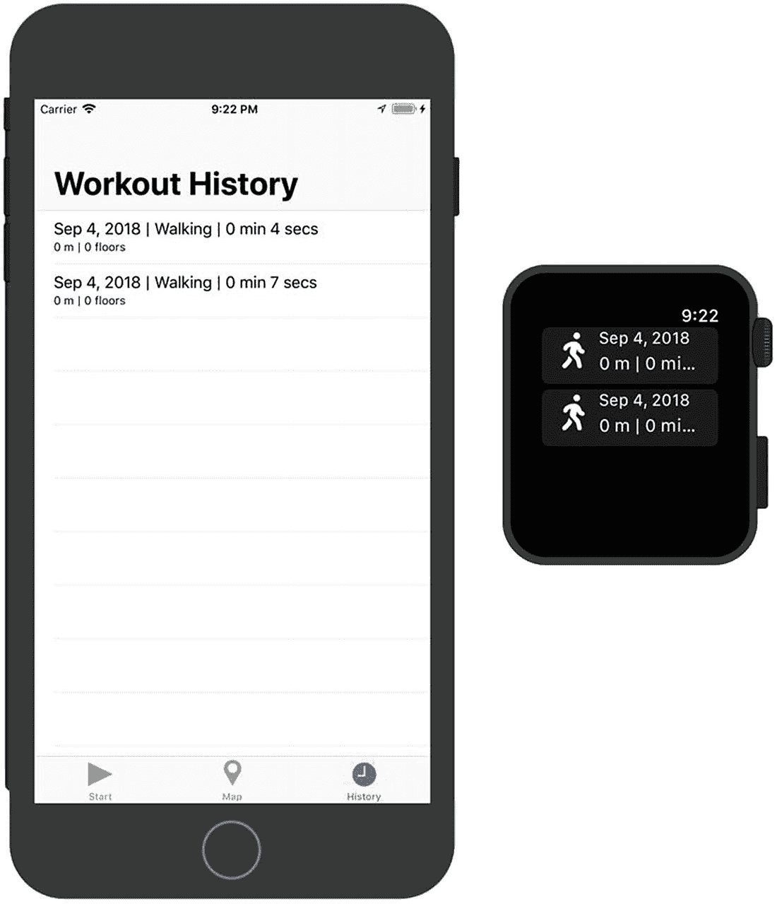

图 10-29

两个应用上的锻炼历史界面，包含填充的数据

## 总结

本章中，您学习了如何利用 watchOS 构建 IOTFit 应用的 Apple Watch 版本，该版本能够与原始 iOS 版本共享代码和锻炼数据。在某些方面，Apple Watch 应用的设置过程比 iOS 版本更复杂，例如仅使用堆栈视图构建用户界面。然而，watchOS 应用的其他部分（如创建表格视图）使用了其 iOS 对应功能的精简版本，实现起来比 iOS 版本更简单。与第 9 章的 Apple TV 项目类似，您能够利用在硬件上原生运行的框架，并制作出与 iOS 版本具有相同锻炼跟踪功能的 Apple Watch 应用。

延续本书的主题，这是一个物联网应用的完美示例，因为用户能够使用“物”（Apple Watch）作为另一种为更大系统提供数据的方式。在本章中，您利用的大系统是 HealthKit，Apple 会自动保护并在用户设备之间同步 HealthKit 数据。

# 11. 使用 Face ID、Touch ID 和钥匙串服务保护您的应用

到目前为止，您已在本章中了解到，物联网技术可用于扩展人们生活中的便利性。与几年前相比，这些设备的能力以及创建设备的门槛都已提高。仅在本章中，您就已经使用了 Arduino、Raspberry Pi 和 iPhone 作为物联网传感器。

然而，常言道，新药总会带来新的副作用。对于物联网来说，其采用过程中最不幸且意想不到的副作用是安全漏洞的增加，这些漏洞源于未正确保护的物联网设备。正如本书中多次提到的，物联网的普及很大程度上得益于价格合理的系统级芯片解决方案的可用性，例如您在之前章节中使用的 ESP32。不幸的是，当广泛使用的系统设计缺陷被利用时，其高采用率可能导致毁灭性的损害。

这正是 Mirai 僵尸网络所发生的情况。该僵尸网络利用了物联网设备上一组已知的常用默认密码，自动安装、复制并运行程序，使用受感染设备对目标系统进行协同攻击，即所谓的分布式拒绝服务攻击。该攻击影响了超过 600,000 台设备，在 2017 年导致多个域名系统服务器（构成互联网流量路由骨干）瘫痪，并被公认为有记录以来最大的 DDoS 攻击^(¹)。截至撰写本书时（2018 年末），该僵尸网络在复杂性上持续增加并找到了新目标。

在第 8 章中，当您学习如何使用 Raspberry Pi 构建 Web 服务器时，您学到的提高设备安全性的方法之一是为 Web 服务器添加 SSL 证书，以便设备和外部客户端（如 iOS 应用）之间传输的所有数据都能通过 HTTPS 保护。尽管这不是完美或完整的解决方案，但这是让您的用户数据更难通过简单的流量嗅探（使用程序监控网络上传输的数据包）被截获的一步。对于完整的解决方案，您应始终尝试研究访问系统管理员账户的所有途径并确保其安全，包括更改密码、使用双因素认证、为 Web 应用程序 API 添加输入验证，以及安装安全补丁和辅助工具以防止已知攻击。

在本章中，您将在 iOS 应用端学习三种技术，可用于防止用户信息从设备泄露或被盗：Face ID、Touch ID 和钥匙串服务。作为 iPhone 用户，您可能已经通过主屏幕熟悉前两项服务。它们允许您使用面部的 3D 表面扫描（iPhone X 及更新版本）或指纹（iPhone 5S 至 iPhone 8 Plus，以及 iPad Air 2 及更新版本）解锁主屏幕。但是，您可能不知道可以在自己的应用中使用钥匙串服务来限制对应用某些部分的访问。这是许多密码存储应用（如 1Password）中流行的功能。类似地，钥匙串服务允许您为应用数据创建加密数据库，该数据库仅在应用处于活动状态并在用户设备前台运行时才能访问。钥匙串服务是 Apple 推荐的用于存储用户密码、API 密钥和 SSL 证书的方法，如果这些信息从应用中泄露，可能会被严重利用。


## 学习目标

在本章中，你将通过学习如何运用**面容 ID**、**触控 ID** 和**钥匙串**服务来保护数据安全。具体做法是沿用前几章中的 IOTFit 应用，利用这些 API 将应用访问权限仅限授予 iOS 设备所有者，或通过存储在钥匙串中的密码进行授权。通过对 IOTFit 应用实施这些改进，你将掌握以下物联网应用开发的关键概念：

-   创建锁屏用户界面
-   判断设备是否支持面容 ID 和触控 ID
-   使用面容 ID 和触控 ID 限制应用访问权限
-   在 iOS 钥匙串中存储和读取值
-   检测应用从后台返回时的状态

存储在 HealthKit 存储区中的锻炼数据由设备上的“健康”应用进行加密和管理；不过，你可以通过禁用 `WorkoutDataManager` 类中用于将数据备份到应用 `Documents` 文件夹下 `.plist` 文件的那部分功能，来进一步增强安全性。尽管应用包中的数据对其他应用不可用，但通过 Mac 或 PC 上的备份应用仍然可以提取这些数据。

与本书之前的项目类似，完整项目的源代码可从本书的 GitHub 页面获取（`https://github.com/Apress/program-internet-of-things-w-swift-for-ios`）。如果你想回顾 IOTFit 应用中健康功能的创建过程，请参阅第 2 至第 4 章。如果你想了解如何为 Web 服务器应用添加 HTTPS，请参阅第 8 章。

## 项目设置

开始之前，请通过复制之前的项目，或从本书的 GitHub 仓库下载副本，来创建第 10 章中 IOTFit 应用的副本。由于面容 ID 比触控 ID 或在 iPhone 上输入密码更容易被无意触发，Apple 要求在你的应用中启用该功能前必须获得用户许可。与 HealthKit（第 4 章）的情况类似，当用户首次在应用中尝试使用面容 ID 时，将会弹出此权限提示。另一个与 HealthKit 的相似之处在于，通过在应用的 `Info.plist` 文件中为其定义一条消息字符串，即可启用该权限提示。

如图 11-1 所示，要为你的应用设置面容 ID 权限提示消息，请在项目导航器中打开 `IOTFit` 目标的 `Info.plist` 文件，点击任意列中的 `(+)` 按钮，并为隐私 – 面容 ID 使用说明键值对添加一个新条目。在我的实现中，我使用了消息：“IOTFit 希望使用面容 ID 来保护您的锻炼数据。”

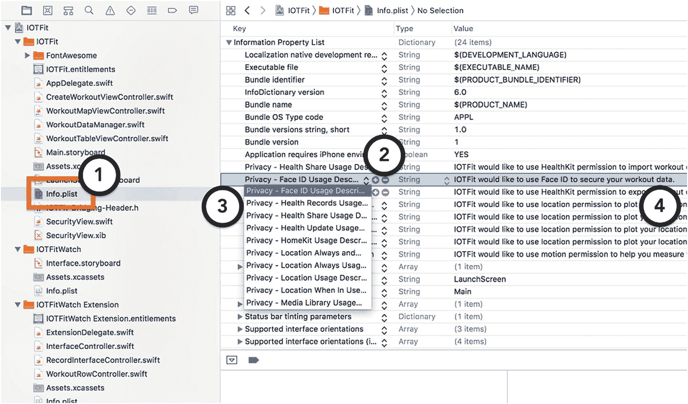

图 11-1 添加面容 ID 权限提示的消息字符串

## 创建锁屏用户界面

当我在思考如何设计一个用于演示面容 ID 的项目时，我脑海中浮现的最佳示例是 1Password 密码管理器应用的锁屏。如图 11-2 所示，在访问该应用的用户界面之前，1Password 会要求你输入密码，或按下面容 ID 按钮以使用面容 ID 解锁应用。验证成功后，锁屏会执行一个模拟门打开的动画，动画完成后便会显示主界面。

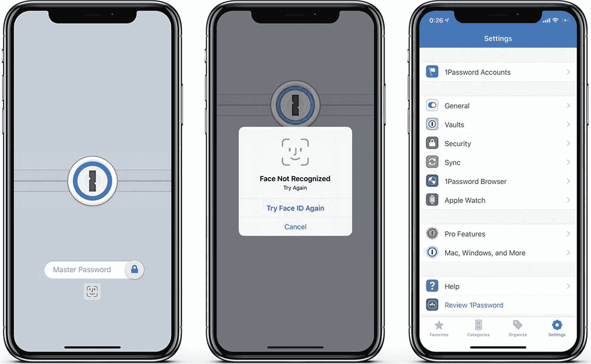

图 11-2 1Password 密码管理器的锁屏

虽然完整的动画有点超出本项目的范围，但我认为显示全屏覆盖层以屏蔽敏感功能的想法普遍适用。在 IOTFit 应用中，最敏感的数据是用户过去的位置和锻炼数据。如图 11-3 所示，我扩展了应用的线框图，在“锻炼历史”和“上次跑步”屏幕上显示了一个简单的锁屏。为简单起见，每当在标签栏中导航到这些屏幕时，以及当应用变为活跃状态时，你将显示锁屏。

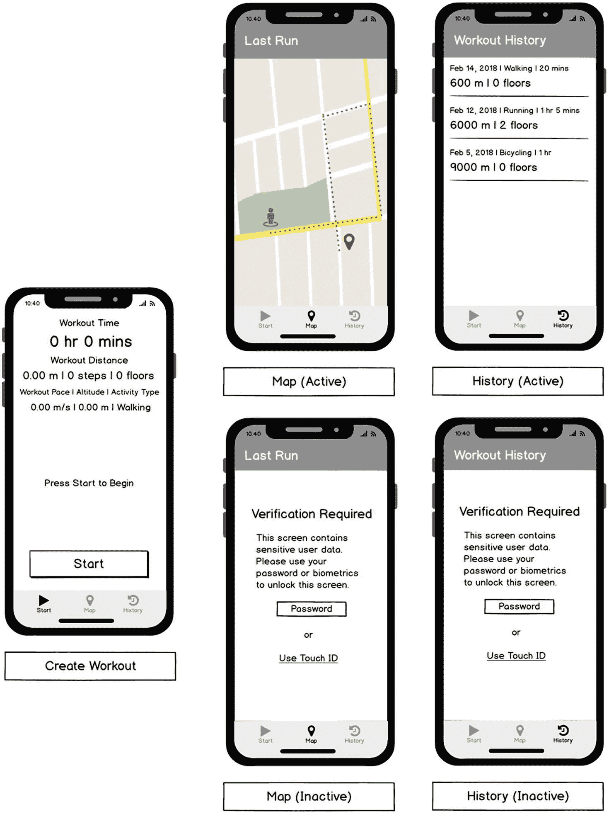

图 11-3 IOTFit 应用的设计线框图，包含锁屏

与 1Password 一样，我加入了一个用于启动面容 ID（或触控 ID）的按钮，以及一个作为备用验证方式的密码文本字段。在应用中，通过检测设备上可用的传感器，你可以更新文本以显示触控 ID 或面容 ID。与 1Password 不同的是，我只在显示数据的屏幕上方应用了锁屏，因为该应用的主要目的是记录锻炼，并且减少操作步骤，降低用户的使用门槛是良好的设计实践。

为防止锁屏阻碍访问标签栏，我建议将锁屏实现为一个 `UIView`，它将显示在“锻炼历史”和“上次跑步”视图控制器的内容之上。验证成功后，你将使用一个简单的动画来关闭该视图并显示数据。要开始此过程，你必须创建一个新的 `UIView` 子类和 NIB (`.xib`) 文件来表示锁屏。

与本书之前的示例类似，通过转到“文件”菜单并选择“新建” ➤ “文件…”来创建 `UIView` 子类。从出现的模板选择器中，选择 iOS ➤ Cocoa Touch 类。如图 11-4 所示，创建一个名为 `SecurityView` 的 `UIView` 子类。

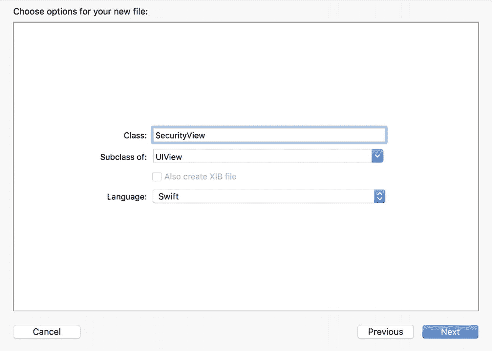

图 11-4 向项目添加 `UIView` 子类

由于 `UIView` 子类无需修改即可在 Objective-C 类中使用，当你首次将其添加到 Swift 项目时，系统会提示你向项目添加一个 Objective-C 桥接头文件，如图 11-5 所示。选择“创建桥接头文件”以创建桥接头文件并继续设置过程。

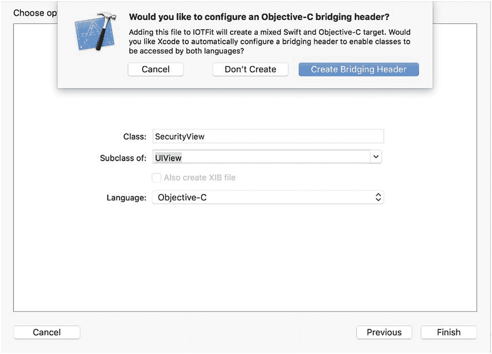

图 11-5 提示向 Swift 项目添加 Objective-C 桥接头文件


接下来，您需要创建一个 NIB（`.xib`）文件来管理 `SecurityView` 类的可视化布局。虽然本书之前的示例都是在单个故事板文件中管理所有用户界面，但当您创建一个将在应用程序中多个位置复用的视图时，行业惯例是在其自己的 NIB 文件中管理该单个视图。NIB 是 Interface Builder 最早的可视化布局工具，旨在管理单个视图或视图控制器，这与故事板不同，故事板旨在管理多个视图控制器之间的常用转场。要创建新的 NIB，请再次打开“文件”菜单，并再次选择“新建” ➤ “文件`...`”。这一次，在 iOS 模板选择器中进一步向下滚动，如图 11-6 所示，然后选择“视图”。当要求命名文件时，请使用名称 `SecurityView.xib`，以匹配 `UIView` 子类。

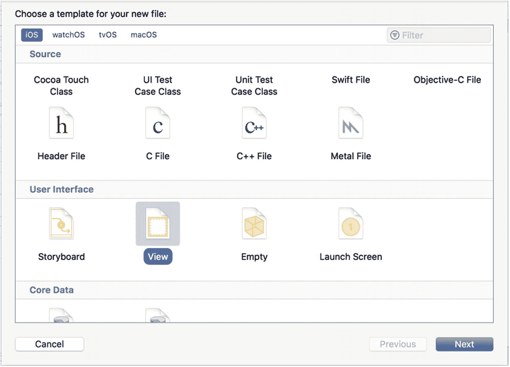

图 11-6
从 Xcode 模板选择器中选择视图 NIB

在项目导航器中点击 NIB 文件后，您应该在 Interface Builder 中看到一个空白视图，类似于创建新故事板文件时的情况。以表 11-1 为指南，布局用户界面，特别注意用于密码输入的 `UITextField` 和用于展示 Face ID 的 `UIButton`。

表 11-1
安全视图用户界面元素样式

| 元素名称 | 文本样式 | 对齐参考 | 上边距 | 下边距 | 左边距 | 右边距 |
| --- | --- | --- | --- | --- | --- | --- |
| “需要验证”标签 | 标题 1 | 视图 | 60 | 40 | 40 | 40 |
| “描述”标签 | 脚注 | “需要验证”标签 | 40 | 40 | 40 | 40 |
| “密码”文本字段 | 正文 | “描述”标签 | 40 | 8 | 80 | 80 |
| “或”标签 | 脚注 | “密码”文本字段 | 8 | 8 | 80 | 80 |
| “使用 Face ID”按钮 | 正文 | “或”标签 | 8 | — | 80 | 80 |

应用这些样式后，您完成的安全视图的 NIB 文件应类似于图 11-7 中的截图。与前面章节相同，您的下一步应该是定义 `SecurityView` 类，包括其属性。

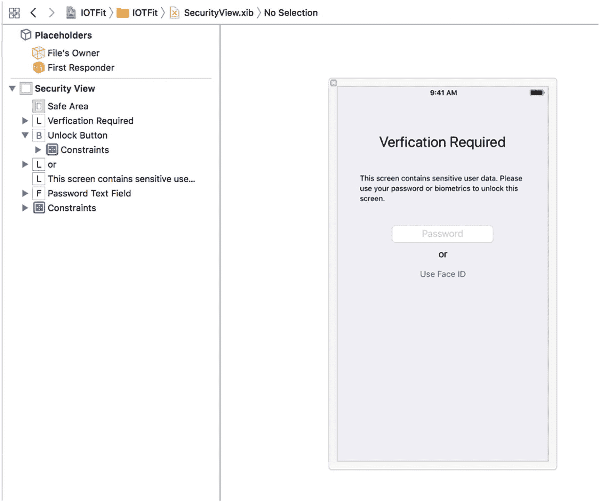

图 11-7
安全视图的最终布局

切换回 `SecurityView.swift` 类，并使用我在代码清单 11-1 中的示例作为您实现的起点。特别注意使用 `@IBOutlet` 关键字声明按钮和文本字段，并使用 `@IBAction` 关键字声明按钮处理程序，以便两者都与 Interface Builder 兼容。

```
import UIKit
class SecurityView: UIView {
@IBOutlet var unlockButton: UIButton?
@IBOutlet var passwordTextField: UITextField?
@IBAction func validatePassword(sender:
UITextField) {
//密码处理代码将放在这里
}
@IBAction func validateBiometrics(sender:
UIButton) {
//生物识别处理代码将放在这里
}
}
代码清单 11-1
SecurityView 类的初始定义
```

为了完善 `SecurityView` 类，您必须将其插座连接到父类。与之前的示例一样，您可以在第 1 章中找到此过程的详细说明。特别不要忘记：

*   在身份检查器（左侧第三个选项卡）中将 `SecurityView` 类设置为父类。
*   将 NIB 文件上的 `unlockButton` 和 `passwordTextField` 连接到类中各自的属性（使用连接检查器）。
*   将 `passwordTextField` 的 `delegate` 属性连接到 `SecurityView` 类（以便处理其事件）。
*   将 `unlockButton` 的 `Touch Up Inside` 事件连接到 `validateBiometrics(sender:)` 方法。

完成所有连接后，安全视图的连接检查器应类似于图 11-8 中的截图。

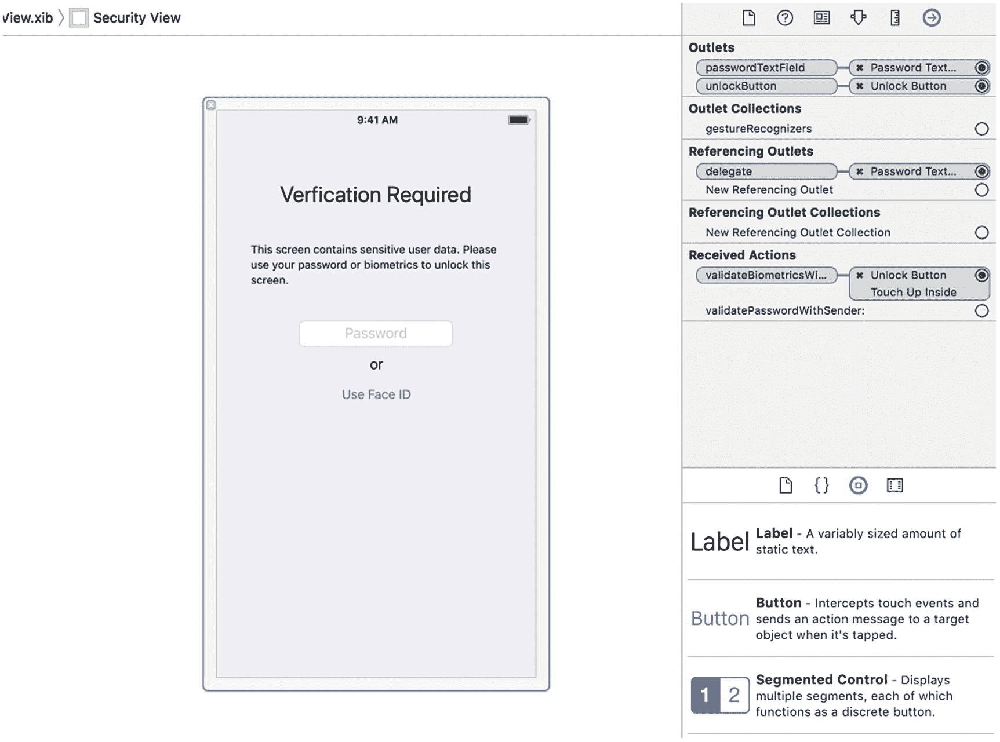

图 11-8
完成后的安全视图连接检查器

对于最后的用户界面设置任务，您必须在 `WorkoutMapViewController` 和 `WorkoutTableViewController` 类变为可见时显示安全视图。首先，您必须从 NIB 文件加载安全视图，并使其可供调用类使用。与作为应用程序初始化过程一部分加载的 Main 故事板不同，要加载 NIB 文件中的视图，您必须尝试通过其 bundle 路径（在 .app 包中的相对路径）加载文件，并验证包含的类是否符合您的预期。在代码清单 11-2 中，我通过 `setupSecurityView()` 方法实现了这一点，在该方法中，我使用 `Bundle` 类加载此视图，然后使用主视图来调用视图控制器，以设置安全视图的大小和目标位置。

```
class WorkoutTableViewController: UITableViewController {
...
var securityView: SecurityView?
override func viewDidLoad() {
super.viewDidLoad()
...
setupSecurityView()
}
...
func setupSecurityView() {
guard let securityNibItems =
Bundle.main.loadNibNamed("SecurityView", owner:
nil, options: nil),
let securityView = securityNibItems.first as?
SecurityView else { return }
securityView.frame = view.frame
securityView.autoresizingMask =  [.flexibleWidth,
.flexibleHeight]
self.securityView = securityView
view.addSubview(securityView)
}
}
代码清单 11-2
向视图控制器添加安全视图 ( WorkoutTableViewController.swift )
```

为简洁起见，本章中我的代码清单将仅针对 `WorkoutTableViewController` 类，但所有相同的逻辑都可以直接复制到 `WorkoutMapViewController` 类中，只有少数例外，我将在本章中指出。

为了让用户看到安全视图，您必须在 `WorkoutTableViewController` 或 `WorkoutMapViewController` 类变为活动状态时，将其置于视图层次结构的顶部。在代码清单 11-3 中，我通过 `showSecurityView()` 方法执行此步骤，该方法从 `viewWillAppear()` 方法调用。

```
class WorkoutTableViewController: UITableViewController {
...
override func viewWillAppear(_ animated: Bool) {
super.viewWillAppear(animated)
...
showSecurityView()
}
...
func showSecurityView() {
if let securityView = self.securityView,
securityView.isHidden == true {
tableView.reloadData()
securityView.alpha = 1.0
securityView.isHidden = false
view.bringSubview(toFront: securityView)
}
}
}
代码清单 11-3
在选项卡变为活动状态时显示安全视图 ( WorkoutTableViewController.swift )
```

顾名思义，*视图层次结构*意味着视图以堆栈的形式呈现，最顶层的视图是用户看到的视图。当您在 Interface Builder 中构建用户界面时，您只需将子视图添加到主视图即可。由于所有子视图都处于相同的呈现级别（z 顺序），因此无需管理视图可见性。对于安全视图，它应呈现在其调用类中的其他所有视图之上，以便在锁定状态下遮挡用户界面。我能够在 `showSecurityView()` 方法中执行此操作。我在主视图上使用了 `bringSubview(toFront:)` 方法。为避免副作用，我还在安全视图上使用了 `isHidden` 属性，以防止视图在已经处于活动状态时被两次呈现。


## 查询传感器可用性

与本书中实现其他基于硬件的 API 一样，在尝试使用 Touch ID 或 Face ID 之前，必须先检查设备上是否可用这两种功能，以及您的应用是否有权限访问它们。要查询此信息并最终访问传感器，您需要使用`LocalAuthentication`框架为应用建立安全上下文。为了维护基于设备的安全模型，Apple 通过一个名为安全隔区（Security Enclave）的独立微处理器在 iPhone 上执行所有加密。`LocalAuthentication`框架允许您通过称为上下文的会话访问安全隔区，在这些会话中，您可以查询安全策略的可用性（例如，通过生物特征传感器进行身份验证）并尝试通过该安全策略请求验证。您的应用在任何时候都无法访问用户的个人信息或加密密钥，从而维护设备的安全。成功或失败通过一个布尔返回值和错误对象返回，错误对象将在失败时设置为非 nil 值，并描述失败原因。

您可以使用`LocalAuthentication`框架中的`LAContext`类为安全视图建立安全上下文，并通过`LAContext`对象上的`canEvaluatePolicy(policy:error:)`方法执行可用性查询。在代码清单 11-4 中，我扩展了`SecurityView`类，通过将上下文和身份验证类型维护为属性（稍后发起身份验证请求时可重用）来包含此功能。

```
import UIKit
import LocalAuthentication
class SecurityView: UIView {
...
let context = LAContext()
override func awakeFromNib() {
super.awakeFromNib()
commonInit()
}
private func commonInit() {
let error: ErrorPointer = nil
if context.canEvaluatePolicy(
.deviceOwnerAuthenticationWithBiometrics, error: error) {
//成功！
} else {
NSLog("设备上生物特征识别不可用")
unlockButton?.isEnabled = false
}
}
}
```

**代码清单 11-4** 使用上下文检测生物特征识别的可用性（`SecurityView.swift`）

与视图控制器上的`viewDidLoad()`方法类似，视图有一个`awakeFromNib()`方法，该方法在视图从 NIB 文件加载后被调用。截至撰写本文时，Apple 的主要安全策略是“生物特征识别与设备密码”或仅“生物特征识别”。由于该应用将使用自己的密码，因此我选择为 IOTFit 应用跳过设备密码选项。

尽管策略查询不返回传感器类型信息，但在确定应用有权访问生物特征识别后，您可以使用`LAContext`对象的`biometryType`属性来确定此信息。在代码清单 11-5 中，我扩展了`commonInit()`方法以检查此信息，并更新“使用 Face ID”按钮的标题以正确反映传感器类型。如果生物特征识别不可用，我将禁用该按钮，以防止用户意外点击。

```
import UIKit
import LocalAuthentication
enum AuthenticationType : String {
case faceID
case touchID
case password
case notAvailable
}
class SecurityView: UIView {
...
var authenticationType: AuthenticationType?
...
private func commonInit() {
let error: ErrorPointer = nil
if context.canEvaluatePolicy(
.deviceOwnerAuthenticationWithBiometrics,
error: error) {
switch (context.biometryType) {
case LABiometryType.faceID:
authenticationType = AuthenticationType.faceID
unlockButton?.setTitle("使用 Face ID", for:
.normal)
case LABiometryType.touchID:
authenticationType = AuthenticationType.touchID
unlockButton?.setTitle("使用 Touch ID", for:
.normal)
default:
authenticationType =
AuthenticationType.notAvailable
unlockButton?.isEnabled = false
}
} else {
NSLog("设备上生物特征识别不可用")
unlockButton?.isEnabled = false
}
}
}
```

**代码清单 11-5** 从上下文访问传感器类型（`SecurityView.swift`）

## 使用 Face ID 或 Touch ID 限制功能访问

既然您已确定设备上生物特征识别的可用性并确定了传感器类型，就可以利用这些信息通过`SecurityView`类上的`context`属性发起身份验证请求。要发起此调用，您将使用`LAContext`对象上的`evaluatePolicy(policy:localizedReason:)`方法。如前所述，遵循 Apple 的安全限制，如果请求失败，它将返回一个指示成功或失败的布尔值和一个非 null 的`Error`对象。在代码清单 11-6 中，我从`validateBiometrics(sender:)`方法中发起了此调用。

```
class SecurityView: UIView {
...
@IBAction func validateBiometrics(sender: UIButton) {
passwordTextField?.resignFirstResponder()
let permissionString = "使用生物特征识别解锁以显示运动数据"
context.evaluatePolicy(
.deviceOwnerAuthenticationWithBiometrics,
localizedReason: permissionString) { [weak self]
(success: Bool, error: Error?) in
guard let authenticationType =
self?.authenticationType else { return }
if success == true {
self?.delegate?.didFinishWithAuthenticationType(
authenticationType)
} else {
self?.delegate?.didFinishWithError(description:
error.debugDescription)
}
}
}
}
```

**代码清单 11-6** 请求生物特征授权（`SecurityView.swift`）

除了为您向安全隔区发起调用之外，`LocalAuthorization`上下文还提供了初始权限弹窗，用于为您的应用启用 Face ID，以及您发起上述授权请求时出现的弹窗。不幸的是，作为开发者，您需要自行处理结果。基于视图的实现的一个限制是视图存在于视图控制器之外，因此默认情况下，您无法在视图外部呈现任何用户界面更新。为解决此问题，您可以建立一个协议，在安全请求成功或失败完成时，将信息传回给展示视图控制器。

在代码清单 11-7 中，我将此协议定义为`SecurityViewDelegate`，以反映实现该协议的类是该协议的委托。其方法包括`didFinishWithAuthenticationType(type:)`（在请求成功完成时调用）和`didFinishWithError(description:)`（在失败时调用）。这与用于 iPhone 图像选择器的`UIImagePickerControllerDelegate`协议的设计类似，并允许将成功和失败作为独立事件处理。

```
import UIKit
import LocalAuthentication
...
protocol SecurityViewDelegate {
func didFinishWithAuthenticationType(_ type: AuthenticationType)
func didFinishWithError(description: String)
}
class SecurityView: UIView {
...
var delegate: SecurityViewDelegate?
...
@IBAction func validateBiometrics(sender:
UIButton) {
...
context.evaluatePolicy(
.deviceOwnerAuthenticationWithBiometrics,
localizedReason: permissionString) {
[weak self] (success: Bool, error:
Error?) in
...
if success == true {
self?.delegate?.didFinishWithAuthenticationType(
authenticationType)
} else {
self?.delegate?.didFinishWithError(description:
error.debugDescription)
}
}
}
}
```

**代码清单 11-7** 定义协议以从安全视图传递消息（`SecurityView.swift`）

消息通过安全视图上的`delegate`属性传回给展示视图控制器。它被定义为可选值，以防止开发人员未选择实现委托时发生崩溃。


## 完成身份验证流程的最后步骤

完成身份验证流程的最后步骤，是将 `WorkoutTableViewController` 和 `WorkoutMapViewController` 类声明为实现 `SecurityViewDelegate` 协议的委托，并实现在成功或失败事件触发时将被调用的方法。在清单 11-8 中，我通过在从 `WorkoutTableViewController` 类呈现安全视图时设置委托属性来实现这一点。对于成功事件，我关闭了安全视图；对于失败事件，我在视图控制器的所有其他视图之上呈现一个包含错误描述的 `UIAlertController`。为了实现更流畅的过渡效果（例如 1Password 的解锁动画），我使用了 `UIView` 类的 `animate()` 方法来将安全视图的 alpha 级别（透明度）动画渐变为零。

```
class WorkoutTableViewController: UITableViewController {
...
func setupSecurityView() {
...
securityView.delegate = self
...
}
}
extension WorkoutTableViewController: SecurityViewDelegate {
func didFinishWithError(description: String) {
let alert = UIAlertController(title: "身份验证错误", message: description, preferredStyle:
.alert)
let alertAction = UIAlertAction(title: "确定", style:
.default, handler: nil)
alert.addAction(alertAction)
present(alert, animated: true)
}
func didFinishWithAuthenticationType(_ type:
AuthenticationType) {
UIView.animate(withDuration: 0.3, animations: { [weak
self] in
DispatchQueue.main.async {
self?.securityView?.alpha = 0.0
self?.securityView?.isHidden = true
self?.securityView?.passwordTextField?.text =
nil
guard let securityView = self?.securityView
else { return }
self?.view.sendSubview(toBack: securityView)
}
})
}
}
清单 11-8
实现 SecurityViewDelegate 协议以从安全视图接收消息 (WorkoutTableViewController.swift)
```

在实现此应用程序时，我注意到 `UITableViewController` 类期望成为层次结构中的主视图，并且有时会显示在其上方呈现的视图下方。为了解决这个问题，我修改了清单 11-9 中所示的 `UITableViewDataSource` 委托方法，以在安全视图未激活时仅显示来自 HealthKit 的数据。每次影响安全视图呈现状态的调用之后，我都会进行此调用。

```
class WorkoutTableViewController: UITableViewController {
...
// MARK: - 表格视图数据源
...
override func tableView(_ tableView: UITableView,
numberOfRowsInSection section: Int) -> Int {
guard let securityView = securityView else { return 0 }
if securityView.isHidden {
return self.workouts?.count ?? 0
} else {
return 0
}
}
...
func showSecurityView() {
if let securityView = self.securityView,
securityView.isHidden == true {
tableView.reloadData()
securityView.alpha = 1.0
securityView.isHidden = false
view.bringSubview(toFront: securityView)
}
}
}
extension WorkoutTableViewCon troller: SecurityViewDelegate {
...
func didFinishWithAuthenticationType(_ type:
AuthenticationType) {
UIView.animate(withDuration: 0.3, animations:
{ [weak self] in
DispatchQueue.main.async {
self?.securityView?.alpha = 0.0
...
self?.view.sendSubview(toBack:
securityView)
self?.tableView.reloadData()
}
})
}
}
清单 11-9
根据安全视图的状态显示或隐藏表格视图数据 (WorkoutTableViewController.swift)
```

如果你现在尝试测试该应用程序，在“锻炼历史记录”或“上次运行”屏幕上首次点击“使用面容 ID”按钮时，系统会弹出接受面容 ID 身份验证的对话框，然后是面容 ID 扫描对话框。验证通过后，安全视图将消失，如图 11-9 所示。

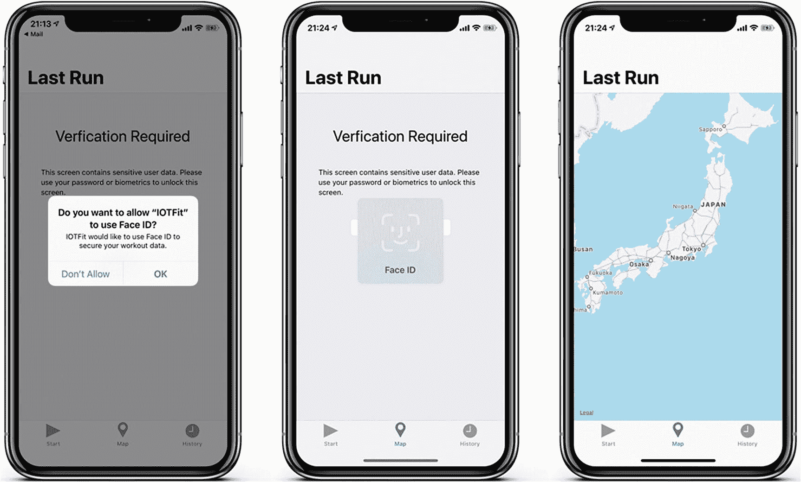

图 11-9

使用面容 ID 解锁“上次运行”屏幕

## 使用钥匙串服务保护数据

既然应用程序可以通过生物识别技术授权用户，你现在必须实现密码字段作为备用方案，以防用户在使用面容 ID 或触控 ID 时遇到问题。正如本章开头所述，你将通过钥匙串服务将密码存储在设备的“安全隔区”中。这些数据仅在应用程序处于活动状态并在前台运行时才被解密并提供。

首先，你必须实现 `UITextFieldDelegate` 协议，以处理来自密码文本字段的事件。尽管该协议定义了几个事件，例如编辑开始或输入文本发生更改时，但你要观察的事件是按下屏幕键盘上的 Return 键时。在清单 11-10 中，我通过在安全视图中实现 `textFieldShouldReturn()` 委托方法来处理此事件。虽然此方法旨在启用或禁用 Return 键，但许多开发者会在该方法完成之前通过调用其他方法对其进行扩充。对于 IOTFit 应用，按下 Return 键时，应尝试验证密码并清除文本字段。

```
extension SecurityView: UITextFieldDelegate {
func textFieldShouldReturn(_ textField: UITextField) ->
Bool {
textField.resignFirstResponder()
validatePassword(sender: textField)
return true
}
}
清单 11-10
按下 Return 键时为文本字段执行操作 (SecurityView.swift)
```

接下来，你必须验证密码。不幸的是，到目前为止，应用程序的实现尚未提示用户设置初始密码，也没有将其存储在任何地方。你可以通过类似从应用的 `UserDefaults` 中访问值的方式来执行此操作，即检查“安全隔区”中是否存在键值对，如果不存在则设置它。使用钥匙串服务时，这是通过尝试基于*搜索查询*来提取值来完成的。

尽管名称如此，但钥匙串服务搜索查询更接近于谓词，而不是简单的键值对查找。要执行搜索查询，你必须指定要查询的值类型（例如，网站密码、通用密码、SSH 密钥）、要检索的匹配数、是否要从查询中访问数据以及数据的标识信息（例如应用名称）。对于 IOTFit 应用程序，你要存储的数据是一个通用密码，由应用名称标识，代替账户名称。在清单 **11-11** 中，我扩展了 `SecurityView` 类，通过 `checkPasswordExistence()` 方法进行此查询。由于呈现视图控制器必须呈现用于请求密码的用户界面，我扩展了 `SecurityViewDelegate` 协议，以包含反映应用密码状态的新方法。

```
protocol SecurityViewDelegate {
func didFinishWithAuthenticationType(_ type:
AuthenticationType)
func didFinishWithError(description: String)
func needsInitialPassword()
}
class SecurityView: UIView {
...
let ACCOUNT_NAME: String = "IOTFit"
...
func checkPasswordExistence() {
guard let accessControl = accessControl else { return }
let query: [String: Any] = [kSecClass as String:
kSecClassGenericPassword,
kSecAttrAccount as String: ACCOUNT_NAME,
kSecMatchLimit as String: kSecMatchLimitOne,
kSecReturnAttributes as String: true,
kSecReturnData as String: true]
let queryStatus = SecItemCopyMatching(query as
CFDictionary, nil)
if queryStatus != errSecSuccess {
delegate?.needsInitialPassword()
} else {
NSLog("密码已被设置")
}
}
}
清单 11-11
查询安全隔区中是否存在密码 (SecurityView.swift)
```


尽管这打破了苹果许多其他 API 的模式，但执行查询的唯一方式是通过尝试对钥匙串（`copy`、`update`、`add` 或 `delete`）执行操作。由于 `SecItemCopyMatching(query:result:)` 方法**不**返回错误对象，你可以通过执行操作后返回的 `OSStatus` 值来验证操作结果。任何非 `errSecSuccess` 的值都表示操作失败。在我调试此应用程序时，我注意到在 Google 中搜索该错误码能有效确定失败原因。苹果在 iOS 和 OS X 中都使用了 `OSStatus` 类型，因此关于其可能值代表含义的信息非常丰富。

### 注意

术语 `Security Enclave` 和 `Keychain` 在 iOS 中可以互换使用，因为钥匙串服务沿用了 macOS 上钥匙串服务的设计。在 macOS 中，安全存储常被通俗地称为 `the Keychain`。

接下来，你必须进行调用以检查密码是否存在，如果不存在则提示用户输入密码。在显示包含密码文本字段的安全视图之前，先检查是否有密码用于验证，这是合理的。在我的实现中，我通过在 `WorkoutMapViewController` 和 `WorkoutTableViewController` 类的 `showSecurityView()` 方法中显示安全视图后，添加一个检查密码状态的调用来实现此逻辑，如代码清单 11-12 所示。

```
class WorkoutTableViewController:
UITableViewController {
...
func showSecurityView() {
if let securityView = self.securityView,
securityView.isHidden == true {
...
}
securityView?.checkPasswordExistence()
}
}
代码清单 11-12
在显示安全视图时检查密码是否已设置 (WorkoutTableViewController.swift)
```

为了处理密码不存在的情况，你必须创建一个用于将字符串值保存到钥匙串的方法。如前所述，所有钥匙串服务操作都必须通过查询来执行。在向钥匙串添加新项目时，查询与查找值几乎完全相同，只是你需要将新值作为二进制数据包含在内。在代码清单 11-13 中，我通过 `SecurityView` 类中的 `savePassword(password:)` 方法添加了此逻辑。请特别注意 `kSecValueData` 键值对和 `SecItemAdd(query:result:)`，它们负责实现 `add value` 操作。

```
protocol SecurityViewDelegate {
...
func needsInitialPassword()
func didSavePassword(success: Bool)
}
class SecurityView: UIView {
...
func savePassword(password: String) {
guard let passwordData = password.data(using:
String.Encoding.utf8) else { return }
let query: [String: Any] = [kSecClass as String:
kSecClassGenericPassword,
kSecAttrAccount as String: ACCOUNT_NAME,
kSecValueData as String: passwordData]
let queryStatus = SecItemAdd(query as CFDictionary,
nil)
if queryStatus == errSecSuccess {
delegate?.didSavePassword(success: true)
} else {
NSLog("Error saving passcode: \(queryStatus)")
delegate?.didSavePassword(success: false)
}
}
}
代码清单 11-13
将值保存到钥匙串 (SecurityView.swift)
```

与检查密码状态类似，我扩展了 `SecurityViewDelegate` 协议，增加了一个用于指示密码是否成功保存的方法。为了完成密码保存过程，需要在 `WorkoutTableViewController` 和 `WorkoutMapViewController` 类中实现 `needsInitialPassword()` 和 `didSavePassword(success:)` 方法，如代码清单 11-14 所示。在我的实现中，我选择展示一个包含文本字段的 `UIAlertController` 来接受新密码，并使用 `NSLog()` 将操作结果记录到控制台。

```
extension WorkoutTableViewController: SecurityViewDelegate {
func needsInitialPassword() {
let alert = UIAlertController(title: "初始安装",
message: "请为您的数据设置密码", preferredStyle: .alert)
alert.addTextField { (textField: UITextField) in
textField.placeholder = "密码"
textField.isSecureTextEntry = true
}
let okAction = UIAlertAction(title: "确定", style:
.default) { [weak self] (action: UIAlertAction) in
guard let textField = alert.textFields?.first,
let password = textField.text else { return }
self?.securityView?.savePassword(password:
password)
}
let cancelAction = UIAlertAction(title: "取消",
style: .cancel, handler: nil)
alert.addAction(okAction)
alert.addAction(cancelAction)
present(alert, animated: true)
}
func didSavePassword(success: Bool) {
NSLog("密码保存状态: \(success)")
}
...
}
代码清单 11-14
提示输入新密码 (WorkoutTableViewController.swift)
```

对于密码验证过程的最后一步，你必须在 `SecurityView` 类中实现 `validatePassword()` 方法，该方法应将保存的密码与安全视图文本字段中输入的文字进行比较。从钥匙串提取值的查询与检测值是否存在时的查询完全相同；然而，在执行 `copy` 操作后，你应该检查其结果以提取密码。在代码清单 11-15 中，我通过向 `SecurityView` 类添加 `getSavedPassword()` 方法实现了这一点。

```
class SecurityView: UIView {
...
private func getSavedPassword() -> String? {
let query: [String: Any] = [kSecClass as String:
kSecClassGenericPassword,
kSecAttrAccount as String: ACCOUNT_NAME,
kSecMatchLimit as String: kSecMatchLimitOne,
kSecReturnAttributes as String: true,
kSecReturnData as String: true]
var keychainItemRef: CFTypeRef?
let queryStatus = SecItemCopyMatching(query as
CFDictionary, &keychainItemRef)
guard queryStatus == errSecSuccess,
let keychainItem = keychainItemRef as? [String:
Any],
let passwordData = keychainItem[kSecValueData as
String] as? Data,
let password = String(data: passwordData, encoding:
String.Encoding.utf8)
else { return nil }
return password
}
@IBAction func validatePassword(sender: UITextField) {
guard let input = sender.text,
let savedPassword = getSavedPassword(),
input == savedPassword else {
delegate?.didFinishWithError(description:
"无效的密码")
return
}
delegate?.didFinishWithAuthenticationType(.password)
}
}
代码清单 11-15
对照钥匙串中保存的值验证密码 (SecurityView.swift)
```

正如你需要将字符串序列化为二进制数据才能将其保存到钥匙串中，为了使用存储的值进行字符串比较，你必须使用 `String(data:encoding:)` 构造方法将它们从二进制数据重新组合成字符串。


### 使用生物识别或应用密码锁定钥匙串项目

作为一项额外的安全功能，你可以通过将钥匙串项目限制在特定的安全上下文中来进一步锁定它们。例如，如果你正在构建一个密码管理器，你可以使用此功能使特定的一组密码只能通过面容 ID 或设备密码访问。这是一种替代构建完整安全覆盖层（如本章所述）的技术。

要为你的钥匙串项目添加这一额外的安全层，只需在每个搜索查询中添加一个安全上下文和访问控制设置。类似于`LocalAuthentication`框架为你呈现初始的面容 ID 权限提示，当你尝试使用启用了访问控制的搜索查询访问值时，它也会呈现系统的生物识别或密码提示。

对于额外的安全设置，你可以使用与`SecurityView`类相同的安全上下文。但是，你需要通过`SecAccessControl`类定义一个单独的访问控制策略。在清单 11-16 中，初始化`SecurityView`类后，我指定了一个安全策略，该策略将仅在设备解锁且用户通过面容 ID 或应用特定密码验证其存在时，才使钥匙串项目可用。

```
class SecurityView: UIView {
...
private func commonInit() {
let error: ErrorPointer = nil
if context.canEvaluatePolicy(
.deviceOwnerAuthenticationWithBiometrics,
error: error) {
..
} else {
NSLog("Biometrics unavailable on device")
...
}
accessControl = SecAccessControlCreateWithFlags(nil,
kSecAttrAccessibleWhenUnlocked, .userPresence,
nil)
}
}
Listing 11-16
Adding an Access Control Policy (SecurityView.swift)
```

要使用访问策略和上下文来保护钥匙串项目，只需修改之前的复制和添加查询，以包含`SecurityView`类的上下文和访问控制策略，如清单 11-17 所示。

```
class SecurityView: UIView {
...
func checkPasswordExistence() {
guard let accessControl = accessControl else { return }
let query: [String: Any] = [kSecClass as
String: kSecClassGenericPassword,
kSecAttrAccount as String: ACCOUNT_NAME,
kSecMatchLimit as String: kSecMatchLimitOne,
kSecReturnAttributes as String: true,
kSecReturnData as String: true,
kSecAttrAccessControl as String: accessControl as Any,
kSecUseAuthenticationContext as String: context]
...
}
func savePassword(password: String) {
guard let accessControl = accessControl,
let passwordData = password.data(using:
String.Encoding.utf8) else { return }
let query: [String: Any] = [kSecClass as
String: kSecClassGenericPassword,
kSecAttrAccount as String: ACCOUNT_NAME,
kSecAttrAccessControl as String: accessControl as
Any,
kSecUseAuthenticationContext as String: context,
kSecValueData as String: passwordData]
...
}
private func getSavedPassword() -> String? {
guard let accessControl = accessControl else {
return nil
}
let query: [String: Any] = [kSecClass as
String: kSecClassGenericPassword,
kSecAttrAccount as String: ACCOUNT_NAME,
kSecMatchLimit as String: kSecMatchLimitOne,
kSecReturnAttributes as String: true,
kSecAttrAccessControl as String:
accessControl as Any,
kSecUseAuthenticationContext as String:
context,
kSecReturnData as String: true]
...
return password
}
}
Listing 11-17
Using the Access Control Policy and Context in Keychain Search Queries (SecurityView.swift)
```

现在，如果你在设备上加载`IOTFit`应用并尝试访问“上次跑步”或“锻炼历史”标签，你将在标签加载之前看到一个应用密码对话框，如图 11-10 所示。输入密码后，你将有一两分钟的时间在各个标签之间自由导航，然后系统会要求你重新验证应用。虽然额外的密码提示对于`IOTFit`应用来说有点过度，但它可能对你的其他项目有所帮助。

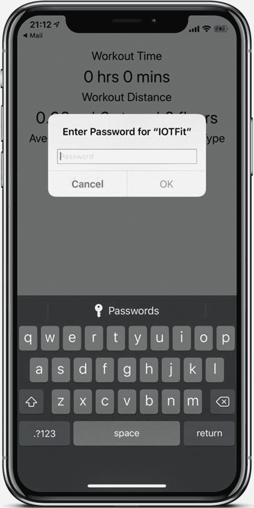

Figure 11-10

受访问控制保护的钥匙串项目的应用密码提示

### 注意事项

为钥匙串项目设置安全策略后，每当你尝试再次访问这些值时，系统总是会提示你输入原始安全设置。要重置这些值，你必须在应用中添加一个`delete`操作或重置你的设备。在撰写本文时，即使应用被删除，钥匙串项目也会被保留。


## 检测应用何时回到前台

作为 IOTFit 应用最后一项安全增强措施，你将在应用从后台返回前台时，在“上次跑步”和“锻炼历史”屏幕上显示安全视图。如果你经常使用密码管理器，你会认出这是它提供的功能之一，用于防止你在首次解锁应用后信息被盗。

如果你曾查看过任一项目中的 `AppDelegate.swift` 文件，你可能会注意到 `applicationDidEnterBackground()` 和 `applicationDidEnterForeground()` 方法，它们负责处理应用进入前台或后台的情况。这些方法旨在让你有机会在应用状态发生变化时启动或停止后台任务，例如网络调用或数据库写入。苹果节省电池电量的方法之一是通过一个调度器，该调度器仅根据应用最常使用的时间来分配后台执行时间。不幸的是，这些时间可能不可预测，而这些方法会给你几秒钟的执行时间来准备或结束应用，然后应用就会被发送到后台，所有任务暂停。

然而，对于 IOTFit 应用，并没有全局运行的任务或对象可以从应用委托中暂停。相反，你必须从各个视图控制器中观察状态变化。为了实现这一点，你可以使用 iOS 的通知中心来观察“锻炼历史”和“上次跑步”视图控制器中的 `UIApplicationWillResignActive` 事件。观察通知时，无论它们是来自系统事件、内部消息还是推送通知，你都需要指定通知名称和一个选择器（方法签名）来处理该通知。在代码清单 11-18 中，我更新了 `WorkoutTableViewController` 类，使其在检测到后台事件时调用 `showSecurityView()` 方法。

```
class WorkoutTableViewController: UITableViewController {
...
override func viewDidLoad() {
super.viewDidLoad()
...
setupSecurityView()
let notificationCenter = NotificationCenter.default
notificationCenter.addObserver(self, selector
#selector(showSecurityView), name:
Notification.Name.UIApplicationWillResignActive,
object: nil)
}
}
代码清单 11-18
使用通知观察器检测应用进入后台 (WorkoutTableViewController.swift)
```

你只应调用通知观察器一次，因为多个观察器会导致选择器被多次调用。在我的示例中，我通过将观察器添加到视图控制器的 `viewDidLoad()` 方法中，确保它只被调用一次。

当你尝试编译应用时，会收到一个编译器错误，提示 `showSecurityView()` 方法不适合作为选择器。要修复此问题，请在函数定义前添加 `@objc` 关键字，如代码清单 11-19 所示。这是因为选择器是从 Objective-C 移植过来的概念，需要将 Swift 方法定义为与 Objective-C 兼容，才能用作选择器。修改后，应用现在应该可以成功编译了。

```
class WorkoutTableViewController: UITableViewController {
...
@objc func showSecurityView() {
...
securityView?.checkPasswordExistence()
}
}
代码清单 11-19
定义与 Objective-C 兼容的方法 (WorkoutTableViewController.swift)
```

如果你现在在设备上运行应用，在解锁“上次跑步”或“锻炼历史”屏幕并将应用置于后台后，当你重新打开应用时，安全视图会重新出现。现在你已经创建了市面上最安全的健身应用之一。恭喜你！

## 总结

在本章中，你学习了如何利用 Face ID、Touch ID 和钥匙串服务来保护 IOTFit 应用中的敏感用户数据。使用 iOS 的 `LocalAuthentication` 框架，你能够检测生物识别是否可用于应用，相应地修改用户界面，并使用设备的生物识别传感器解锁安全视图。作为备选方案，在生物识别不可用或失败的情况下，你学习了如何将应用密码存储在设备的安全隔区中，以及如何使用钥匙串服务对该数据执行添加和查找操作。更进一步，你学习了如何通过使用钥匙串服务的访问控制来避免编写自己的安全视图，并弄清楚了如何在应用进入后台时锁定屏幕。

在设计这个项目时，我从密码管理器中获得了灵感，因为我觉得它们提供的安全用户体验适用于任何需要在设备初始锁屏之外保护用户数据的情况。我希望通过本章的课程，你现在能够构建出可以防止数据被盗的应用——这些盗窃行为可能仅仅因为他人能够访问已解锁的设备，或者将设备连接到计算机并读取其上的用户数据就得以发生。

脚注 1

# 索引

## A

自适应用户界面外观 项目背景色 约束和文本属性 编辑器菜单 嵌入导航控制器 布局地图视图 导航控制器 文本颜色 标题 编辑视图控制器 创建锻炼时间标签 自动布局问题 约束问题 上下文菜单 弹出窗口大小检查器 故事板基础模板 上下文菜单 编辑器预览 重构菜单 故事板约束 自动布局 不同 iPhone 尺寸截图工具 添加锻炼视图控制器 设备特性 界面生成器 设备 iPhone X 和 iPad Pro 布局 苹果无边框设备 Apple TV 仪表盘应用，*参见* tvOS 仪表盘应用 应用程序编程接口 (API) 基于 Arduino 的外设 Adafruit HUZZAH32 微控制器 电池状态 蓝牙芯片 门传感器硬件 IOTHome 项目 零件清单 GPIO 空 Arduino 解决方案 LED 开/关 引脚模式 硬件组装 面包板 特性 电路 HUZZAH32 芯片 LED 物理连接 电源/接地连接 红色 LED 原理图 共享连接 LiPo 和 ADC 引脚 13 目标 流程 编程环境 命令行指令 连接 默认显示 下载 安装 软件 目标硬件 USB 端口 运行和监视 解决方案 故障排除 编译


## B

蓝牙低功耗（`low energy`）配件设备 `config.json` 文件连接流程 `discoverAllServicesAndCharacteristics()` 方法流程连接 `HomeBridge` 实现 `node` 应用 `npm` 包管理器外设模式 `POST` 请求 `hcitool` 工具 `HomeBridge` 蓝牙低功耗（`low energy`）硬件配件广播包 `Arduino` 解决方案后台更新后台通知 `DoorViewController` 类 `IOTHome` 应用通知权限对话框 `scheduledLocalNotification()` `viewWillAppear()` 方法通信配件后台更新 `BluetoothService` 类 `BluetoothServiceDelegate` `CBCentralManager` 对象中央管理器 `connect()` 方法 `DoorViewController` 类元素 `IOTHome` 项目属性和桩方法协议导向编程故事板与界面构建器连接步骤故事板与视图控制器 `.xcodeproj` 文件配套应用数据更新电池更新 `checkBattery()` 方法 `checkSensor()` 方法磁力传感器更新 `notify()` 方法 `setValue()` 方法设计线框图 `ESP32_BLE_Arduino` 库上下文菜单 `ESP32 BLE` 库 `GitHub` 服务器功能 `zip` 归档迭代过程监控特征更新 `BluetoothService` 对象 `DoorViewController` 类处理方法目标外设设备 `BLEServer` 类过滤外发消息 `GATT UUIDs` `LightBlue` 浏览器 `OS X` 命令行 `setup()` 方法 `uuidgen` 工具外设 `cancelPeripheralConnection()` 方法特征 `connect()` 方法查询服务发送更新停止扫描角色扫描 `Bootstraps` `Etcher` 硬件接口 `Linux` 与嵌入式系统 microSD 卡预构建镜像文件 `Raspbian` 镜像 WiFi 网络截图 `zip` 文件

## C

`CLLocationManager.authorizationStatus()` 方法控制输出引脚核心运动活动类型更新 `CMMotionActivityManager` 类 `currentActivity` 属性 `OperationQueue` 对象 `startActivityUpdates()` 方法停止计步器更新 `toggleWorkout()` 方法 `updateWorkoutData()` 方法框架处理高度计更新设计模式运动视图控制器截图运动权限组件描述 `IOTFit` 项目 `CreateWorkoutViewController` 类步数请求目标实时步数更新闭包计步器计步器处理工具 `startPedometerUpdates()` 方法 `stopUpdates()` 方法用户界面用户界面自动布局约束 `UILabel` 属性 `updateWorkoutData()` 方法运动视图控制器 `CreateWorkoutViewController()` 类类定义 `CLLocationManager` 属性内容界面构建器兼容的查询状态服务状态追踪

## D

DHT 温度传感器 `DHT22` 传感器 `json()` 方法温度路径扩展网页浏览器 `didChangeAuthorizationStatus()` 方法分布式拒绝服务（`DDoS`）双列直插式封装（`DIP`）

## E

`Express` 项目 `app.js` 暴露 Web 服务文件夹创建 `Hello World` 验证 IP 地址 `listen()` 方法 `node` 应用工作流程外部配件通信

## F

面容 ID、触控 ID 和钥匙串服务设备与外部客户端面容/指纹前台 `AppDelegate.swift` 文件 `showSecurityView()` 方法 `viewDidLoad()` 方法 `WorkoutTableViewController` 类核心概念锁屏用户界面设计线框图 NIB（`.xib`）文件 Objective-C 桥接头密码管理器应用截图安全视图 `SecurityView` 类 `setupSecurityView()` 方法 `showSecurityView()` 方法 `UIView` 子类视图 NIB `viewWillAppear()` 方法 `WorkoutMapViewController` 类 `WorkoutTableViewController.swift` 消息字符串限制访问 `animate()` 方法生物识别授权运行屏安全视图 `SecurityViewDelegate` 协议表格视图数据 `UIImagePickerControllerDelegate` 协议安全数据（*参见* 钥匙串服务）安全上下文 `commonInit()` 方法上下文与认证类型 `LocalAuthentication` 框架 `SecurityView` 类传感器类型 `viewDidLoad()` 方法 Web 服务器

## G

通用输入输出（`GPIO`）

## H

HealthKit，*参见* 运动历史记录历史标签 `HKQuantitySample` 类核心概念读取运动数据转换逻辑 `execute()` 方法 `HKSample` 对象 `loadWorkoutsFromHealthKit()` 方法表格视图控制器表示数据请求权限功能 `HKHealthStore` 对象信息属性列表 `IOTFit` 应用读写健康数据保存数据与创建 `CreateWorkoutViewController` `HKWorkout` 对象 iOS 健康应用源代码步数与飞行对象运动距离步骤 `WorkoutDataManager` 类写入数据 `HomeBridge` `apt-get` 包管理器蓝牙低功耗配件配置文件实验配置 `git pull` 命令 `gpio readall` 命令 `HAP-NodeJS` 安装 `make` 命令 Node.js 应用选项文件服务定义 `tar` 命令温度传感器终端命令 `wget` 命令 HomeKit 分配细节桥接配置设备家庭应用 `Raspberry Pi` 故障排除配置 HomeKit 配件协议（`HAP`）超文本传输协议（`HTTP`）连接错误信息 `Google Chrome` `https` 和 `fs` 模块节点项目选项自签名证书 `TLS` 和 `SSL` iOS 应用 `connect()` 方法 `disconnectDoor()` 方法 `/door/status` 端点错误信息 `Info.plist` 文件初始实现网络管理器方法单例 `URLSessionDelegate`

## I, J

集成电路（`ICs`）互联网工程任务组（`IETF`）iOS（`iPhone OS`）应用 `HTTPS` 请求 `connect()` 方法 `disconnectDoor()` 方法 `door/status` 错误信息 `Info.plist` 文件初始实现网络管理器方法单例 `URLSessionDelegate` 文件 `viewWillDisappear()` 方法 `tvOS` 仪表板应用用户界面 `DoorViewController` 类元素主页视图控制器 `HomeViewController` 类故事板文件线框图 `IOTFit` 应用自适应用户界面（*参见* 自适应用户界面）Apple 开发者账号-Xcode 登录提示团队选择 `Xcode` 安装默认项目开发功能初始选项（项目名称）iOS API 目标故事板（*参见* 故事板）标签页应用模板线框图 `Xcode` 编辑器窗口 iPhone 测试欢迎界面

## K

钥匙串服务生物识别/应用密码访问控制策略应用密码提示搜索查询安全策略 `checkPasswordExistence()` 方法 `getSavedPassword()` 方法 `NSLog()` 方法密码存在返回键 `savePassword()` 方法搜索查询 `SecurityViewDelegate` 协议 `textFieldShouldReturn()` 方法 `UITextFieldDelegate` 协议 `validatePassword()` 方法 `WorkoutTableViewController` 类

## L

锂聚合物（`LiPo`）电池 `loadWorkoutsFromHealthKit()` 方法基于位置的功能后台模式功能标签页编辑器视图信息标签 iOS 应用键值对位置更新权限提示处理更新应用状态变更后台更新定时器类 `pauseWorkout()` 方法请求与代理处理方法 `startWorkout()` 方法定时器类 `updateUserInterface()` `updateWorkoutData()` 方法运动距离位置权限授权状态授权状态 `CLLocationManager` 属性 `CLLocationManagerDelegate` 协议创建运动视图控制器 `CreateWorkoutViewController` 类 `didChangeAuthorizationStatus()` 方法流程图硬件可用性 `IOTFit` `presentPermissionErrorAlert()` 方法请求流程 `requestLocationPermission()` 方法服务查询状态追踪用户界面用户页面地图（*参见* 地图位置）目标


## M

`Map` 定位 `CLLocation` 类 `Codable` 协议 兼容数据类型 基于文件的数据存储 文件模板 I/O 实现 `loadFromPlist()` 方法 `map()` 方法 序列化数据 属性列表 (`.plist`) 文件 `PropertyListDecoder` 方法 `saveToList()` 方法 `saveWorkout()` 和 `getLastWorkout()` 方法 `WorkoutDataManager` 类 Xcode 创建 生成并显示标注 IOTFit 应用 监控输入引脚

## N

Node 包管理器 (NPM)

## O

OpenWeatherMap API 账户创建 `compactMap()` 方法 `forecast` 方法 `getOutdoorTemperature()` 方法 JSON 响应键 页面 `NetworkManager` 类 处理请求 响应 视图控制器

## P, Q

`pauseWorkout()` 方法 `presentPermissionErrorAlert()` 方法 `presentRecordInterface()` 方法

## R

树莓派 硬件组件 引导电路 HomeBridge HomeKit 桥接 IOTHome 项目 需求 HomeKit 关键概念 目标 服务器配置 服务定义 `systemctl` 工具 `systemd` 工具 单板计算机 Web 服务器 `RecordInterfaceController.swift` `requestLocationPermission()` 方法 `resetWorkoutData()` 方法

## S

`saveWorkoutToHealthKit()` 方法 安全套接层 (SSL) 单板计算机 Siri 遥控器 `addGestureRecognizer()` 方法 `allowedPressTypes()` 方法 `fetchNetworkData()` 方法 处理触控输入 屏幕遥控器 播放/暂停按钮 触控板 `UITapGestureRecognizer` 类 `startPedometerUpdates()` 方法 `startWorkout()` 方法 故事板 连接检查器 `CreateWorkoutViewController` 类 `Main.storyboard` 文件 `pauseWorkout()` 方法 暂停锻炼按钮 属性名 测试 用户界面 事件 界面生成器兼容的 `CreateWorkoutViewController` 类 MapKit 框架与地图视图 属性 属性与方法 片上系统 (SoC) 解决方案

## T

表视图控制器 cocoa touch 类 `UITableViewController` 类 `UITableViewDataSource` 协议 `UITableViewDelegate` 协议 用户界面 上下文菜单 代理 插座 标识符 所有权 截图 故事板 副标题 视图 标签栏项目 `WorkoutTableViewController` 类 `toggleWorkout()` 方法 传输层安全 (TLS) tvOS 仪表盘应用 苹果电视与调试 确认调试 目标设备 设置过程 配对按钮 远程应用与设备 数据源 `fetchNetworkData()` 方法 `NetworkManager` 类 OpenWeatherMap API 请求位置 `viewDidLoad()` 方法 `Info.plist` 文件 关键概念 方案与文件 Siri 遥控器 源代码 目标 模板选择器 窗口 用户界面 空白故事板 创建 设计语言 元素 基于字体的图形 源文件 `ViewController` 类 线框

## U

`UITableViewController` 类 `UITableViewDataSource` 协议方法 `UITableViewDelegate` 协议 通用唯一标识符 (UUID) `updateUserInterface()` 方法 `updateWorkoutData()` 方法 用户界面 空白故事板 创建 设计语言 `applyEffects()` 方法 `applyEffects()` 方法 截图 阴影效果 代码 `UIVisualEffectView` 类 `viewDidLoad()` 方法 元素 基于字体的图形 `FontAwesome.swift` `Info.plist` 文件 项目导航器 截图 `ViewController` 类 源文件 `ViewController` 类 watchOS 上下文菜单 控制器 调试 菜单 默认堆栈视图 配置 设计线框 `dismissViewController()` 方法 元素 文件模板窗口 强制触控 `InterfaceController.swift` 对象库 `presentRecordInterface()` 方法 `RecordInterfaceController.swift` 记录锻炼视图控制器 故事板 排列 子视图排列 表格行 文本大小与颜色 垂直布局 `WKInterfaceTable` 类 `WorkoutRowController.swift` 线框

## V

`viewWillAppear()` 方法

## W, X, Y, Z

watchOS 应用 苹果手表 核心定位与运动 `CLLocationManagerDelegate` 协议 硬件管理器 `RecordInterfaceController` 类 独立功能 测试 `toggleWorkout()` 方法 `updateUserInterface()` 方法 `WorkoutDataManager` 类 IOTFit 项目 App Store 描述页面 后台模式配置 健身应用 `Info.plist` 文件 IOTFitWatch 与 IOTFitWatch 扩展 方案 激活 WatchKit 应用模板 关键概念 内存与处理能力 精简开发 用户界面 默认堆栈视图 配置 设计线框 元素 文件模板窗口 强制触控 图像视图 对象库 `RecordInterfaceController` 类 `RecordInterfaceController.swift` 记录锻炼视图控制器 堆栈视图 故事板 排列 子视图排列 表格行 文本大小与颜色 垂直布局 `WKInterfaceTable` 类 锻炼历史表格 `InterfaceController.swift` IOTHomeTV 应用 `loadWorkoutsFromHealthKit()` 方法 `refreshTable()` 方法 截图 Web 服务器 iOS 应用 HTTPS 请求 用户界面 关键概念 目标 共享数据 (HTTPS) 蓝牙设备 DHT 温度传感器 Express 项目 HTTP 连接 IOTHome 传感器 树莓派 `willActivate()` 方法 *vs* . `viewWillAppear()` 方法 线框 *vs* . 原型 `WorkoutDataManager` 类 锻炼历史表格 `InterfaceController.swift` IOTHomeTV 应用 `loadWorkoutsFromHealthKit()` 方法 `refreshTable()` 方法 截图 `WorkoutMapViewController` 类
