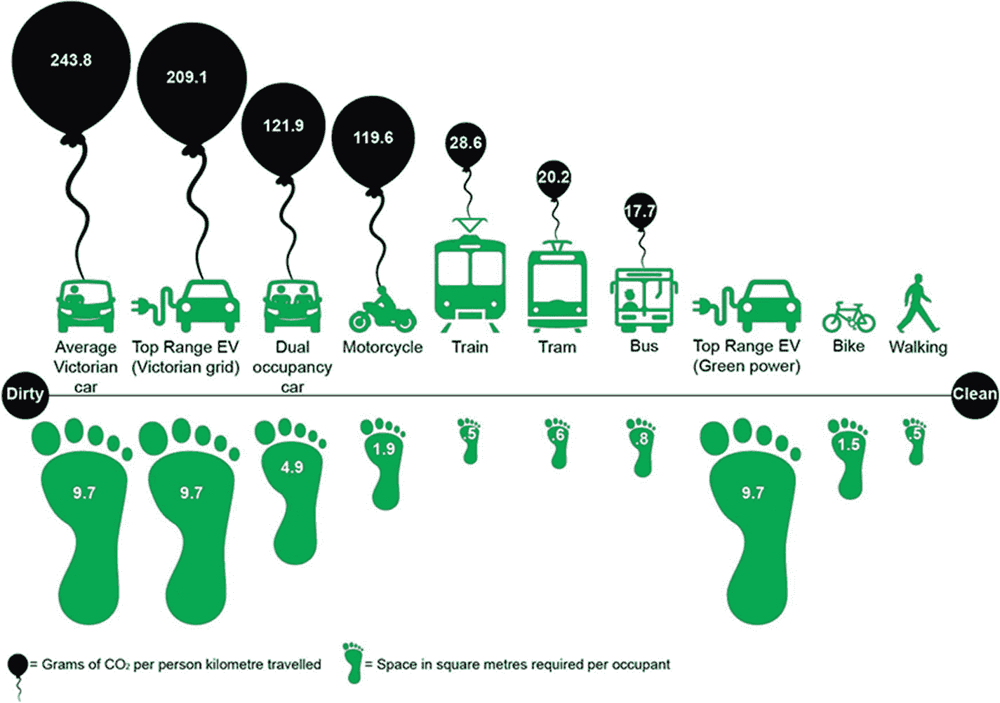
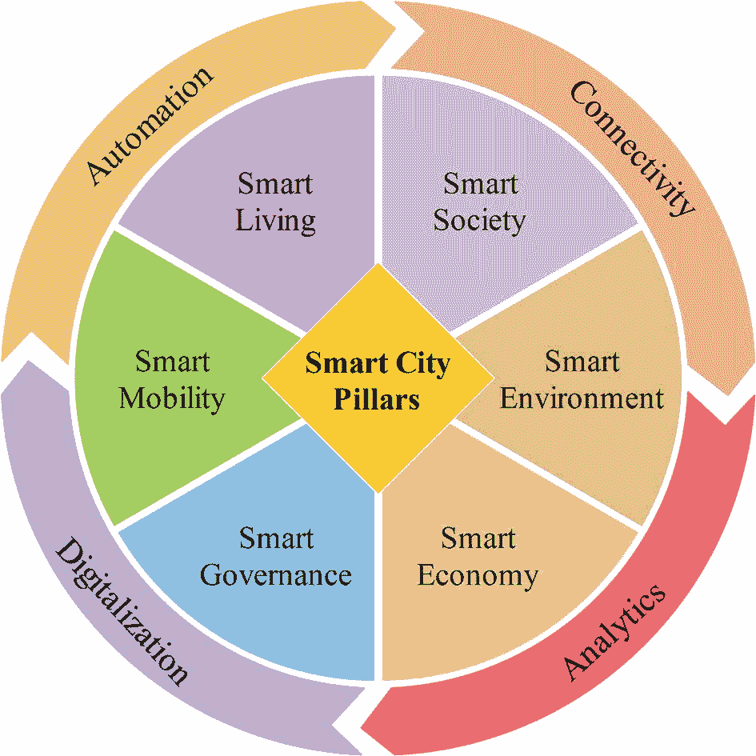

# 1. 迈向以人为本的智慧城市

受社会和经济需求驱动，人口从农村向城市迁移，给当代城市带来了巨大的交通挑战，并在道路安全、拥堵和排放方面产生了一系列负面影响。智慧城市将人和环境作为核心关注点，旨在追求更高的生活质量、合理的自然资源消耗以及可持续的发展和繁荣。本章将重点阐述传统以汽车为中心的城市的弊端，以及转向以人为本的智慧城市的必要性。智慧出行作为未来智慧城市的主要支柱之一，将在本章中进行介绍。

## 1.1 世界城市化问题

根据联合国 2018 年发布的最新《世界城市化展望》报告，到 2050 年，居住在城市的人口将从 36 亿增加到 63 亿（联合国经济和社会事务部，2018 年）。届时，全球人口中将有三分之二居住在城市，而农村人口仅占三分之一，这大致与二十世纪中叶的全球城乡人口分布比例相反。根据 Navigant Research 的一份报告，目前全球道路上约有 12 亿辆汽车。到 2035 年，全球汽车总数可能达到 20 亿辆，这还不包括摩托车。这种传统以汽车为中心的世界带来的负面影响包括安全问题、拥堵问题以及对环境的影响。

道路交通事故在人类痛苦、经济损失以及对野生动物和环境的影响方面代价极其高昂。根据世界卫生组织的数据，全球道路死亡人数仍然高得令人无法接受，每年有 135 万人因此丧生，即每天有 3698 人死亡，这使得道路交通事故成为全年龄段人群的第八大死因，以及儿童和年轻人的第一大死因（世界卫生组织，2018 年）。预计到 2030 年，交通死亡人数将上升至 220 万。在高收入国家，这些交通死亡事故是 5 至 14 岁儿童的头号死因，占所有死因的 19%（Rothman 等人，2020 年）。

全球经济每年因交通拥堵损失的价值达 1 万亿美元的生产力（麦肯锡全球研究院，2013 年）。由交通数据公司 [INRIX](https://inrix.com/scorecard/) 进行的一项研究将波哥大列为全球最拥堵的城市，平均每年有 191 小时的驾驶时间耗费在拥堵中。同一项研究将多伦多列为 2019 年加拿大最拥堵的城市，以及全球第 19 拥堵的城市，平均每年有 135 小时的驾驶时间耗费在拥堵中。根据 INRIX 的数据，加拿大人平均每年有 27 个小时堵在路上。美国通勤者每年平均有大约一周的时间花在交通拥堵上。[交通](https://www.tomtom.com/en_gb/traffic-index/ranking/) [指数](https://www.tomtom.com/en_gb/traffic-index/ranking/)提供了全球约 416 个城市的实时排名和分析数据。

传统交通燃料是污染物的主要排放源，使得交通运输成为全球温室气体排放的主要贡献者之一。例如，根据美国环境保护署的数据，交通运输产生的温室气体排放约占美国温室气体排放总量的 28%，使其成为美国温室气体的最大排放源。当前和预计增长的传统交通燃料需求，尤其是对柴油的需求，将造成巨大的公共健康负担，并将加速全球气候变化（Hoornweg 和 Freire，2013 年）。配备内燃机的传统车辆是温室气体的主要原因之一。图 1-1 展示了每种出行方式的碳足迹和所需空间。除了高碳足迹外，传统出行方式在城市中占用了过多的空间用于铺设道路和停车。许多市中心将 50%-60%的稀缺房地产用于车辆（Plumer，2016 年）。

## 1.2 以人为本的智慧城市

上述挑战不能简单地通过修建更多道路来解决。布拉斯的悖论（Braess 等人，2005 年）表明，在道路网络中增加一条或多条道路并不会改善交通状况，有时甚至会导致交通流量恶化。布拉斯的悖论严格来说并非悖论，而是一种反直觉的结果，类似于囚徒困境，由于自私自利而牺牲了集体利益。由变革性城市出行倡议进行的一项有趣研究得出结论：一个经过改造的多模式交通走廊总共可以容纳 74,000 人（2,000 人在汽车中，16,000 名行人，44,000 人在轻轨中，以及 14,000 名骑行者），而传统的以汽车为中心的走廊只能容纳 24,000 人（8,000 人在汽车中，16,000 名行人）。

图 1-1

每位乘客的碳足迹和所需空间。来源：经合理交通研究所惠允

注

需要用一条 20 车道宽的高速公路才能承载目前多伦多地铁所服务的乘客数量。

这引发了开发和部署可持续出行系统的需求，这种系统能够改变当前以汽车为中心的传统城市，将其转变为以人为本的智慧城市。可持续发展是指既满足当代人的需求，又不损害后代人满足其自身需求的能力（布伦特兰等人，1987 年）。近年来，“智慧城市”的概念受到了学术界、政府实验室和工业界的研究人员、开发者以及政策制定者越来越多的关注。

重要提示

根据 Grand View Research 等市场预测机构和分析师的数据，全球智慧城市市场规模预计到 2027 年将达到 4639 亿美元，2020 年至 2027 年的复合年增长率为 24.7%。

多年来，人们对智慧城市有多种定义。在智慧城市的语境下，“智慧”包括监控、控制和优化，以提升效率、获得底线收益并改善环境。当一个城市的社会资本和现代信息通信基础设施能够推动可持续经济发展和高品质生活时，这个城市就可以被定义为“智慧”城市（Caragliu 等人，2011 年）。换句话说，智慧城市利用数字技术或信息通信技术来提高城市服务的质量和性能，降低成本和资源消耗，并与市民进行更有效、更积极的互动。麻省理工学院将智慧城市定义为“在系统集成的每个层面都具有数字神经系统、智能响应能力和优化能力的系统的系统”。

根据世界银行的一份报告，智慧城市采用技术和信息平台来更好地管理资源配置、改进管理、监控发展动态、开发新的商业模式，并帮助市民就资源的使用做出明智的决策（Hoornweg 和 Freire，2013 年）。

## 城市作为异质实体

城市是高度异质的实体，整合了多种多样、共性多于差异的组成部分。数字化、自动化、连接性和数据分析是实现这些组成部分无缝集成的关键因素。根据普华永道（`PwC`）对约 64 个城市进行的调查（Galal 等人，2011 年），在资金之后，智慧城市战略实施的第二大障碍是优先级排序。

城市必须首先解决其最基本的保障需求：安全、健康以及清洁水源和卫生设施等基础设施。这些基础设施也应进行优化，以便市民能最好地利用。如果这些基本需求已经得到满足，随着城市从基本的工业生产向信息社会转变，关注点便会转向安全保障需求、道路和交通基础设施以及教育机会。在较发达的城市，关注点将放在环境需求、社会融合、文化与休闲，以及作为知识型社会推动力的信息通信技术上。再高一级便是智慧城市，这类城市被定义为能够在其所有资本领域实现绩效最大化的世界领导者。在此之上是自我实现层面，此时城市探索新的模式，为生活质量设定新标准，并愿意分享经验以帮助其他城市进步（Galal 等人，2011 年）。

## 智慧城市的支柱

智慧出行、智慧生活、智慧社会、智慧环境、智慧经济和智慧治理是智慧城市的六大支柱，如图 1-2 所示。数字化、自动化、连接性和分析技术是这六大支柱中实现监测、控制和优化的四个主要推动力。

**智慧出行** 关注信息和通信基础设施的可用性、安全性以及出行系统的可持续性。交通系统的本地和国际可达性也是智慧出行的重要方面。下一节将提供更多关于智慧出行的细节。

*图 1-2 — 智慧城市支柱*

**智慧生活** 涵盖了生活质量的各个方面，例如文化、健康、安全、住房、旅游等。敏捷的公民社会、公民的资质或教育水平、社会包容性、关于融入和积极参与公共生活的社交互动质量，以及对外部世界的开放程度，是衡量智慧社会的指标。

**智慧环境** 由宜人的自然条件（例如气候和绿地）、污染、资源管理以及环境保护的努力所描述。

**智慧经济** 包括与经济竞争力相关的各种因素，如创新、创业精神、商标、劳动生产率和劳动力市场的灵活性，以及融入（国际）国家市场（Giffinger 等人，2007 年）。

**智慧治理** 涵盖了政治参与、面向公民的服务以及行政管理职能等各个方面。

## 全球智慧城市倡议

全球有多个智慧城市项目和倡议。根据 2020 年发布的最新智慧城市指数报告（IMD 和 SUTD，2020 年），全球十大智慧城市依次为新加坡、赫尔辛基、苏黎世、奥克兰、奥斯陆、哥本哈根、日内瓦、台北市、阿姆斯特丹和纽约，如表 1-1 所示。该指数基于经济和技术数据，以及市民对其所在城市“智慧”程度的感知，对 109 个城市进行了排名。

*表 1-1 — 根据智慧城市指数的全球十大智慧城市（IMD 和 SUTD，2020 年）*

| 城市 | 国家 | 2020 年排名 | 2019 年排名 | 变化 |
| --- | --- | --- | --- | --- |
| 新加坡 | 新加坡 | 1 | 1 | 0 |
| 赫尔辛基 | 芬兰 | 2 | 8 | +6 |
| 苏黎世 | 瑞士 | 3 | 2 | -1 |
| 奥克兰 | 新西兰 | 4 | 6 | +2 |
| 奥斯陆 | 挪威 | 5 | 3 | -2 |
| 哥本哈根 | 丹麦 | 6 | 5 | +1 |
| 日内瓦 | 瑞士 | 7 | 4 | +3 |
| 台北 | 台湾 | 8 | 7 | +1 |
| 阿姆斯特丹 | 荷兰 | 9 | 11 | +2 |
| 纽约 | 美国 | 10 | 38 | +28 |

### 线城：一座愿景中的智慧城市

`The Line` 于 2021 年 1 月揭晓，计划作为 `Neom` 的一部分进行建设，这是一座完全可持续的智慧城市，`Neom` 是位于沙特阿拉伯西北部塔布克省的一个规划的跨境城市。`Neom` 于 2017 年宣布，是沙特阿拉伯“2030 愿景”计划的一部分，旨在实现经济多元化，减少对石油的依赖。`The Line` 是一座长达 100 英里的线性城市，没有汽车或街道，居民所需的一切都可在五分钟步行范围内到达。这座特大城市的愿景是为 100 万人口打造零能耗的步行社区。`The Line` 的灵感来源于保罗·索莱里的“线性城市”概念（Soleri 等人，2012 年），即以步行为基础的社区围绕线性的地方和区域交通系统进行布局。

## 1.3 智慧出行：实现可持续发展的关键推动力

近年来，智慧出行系统和服务因其在应对当前以汽车为中心的世界中传统汽车技术所带来的负面影响（如安全问题、拥堵问题和环境问题）方面具有的预见性优势，而受到主要汽车制造商、供应商、学术界和政府机构的日益关注。通用汽车正在引领一个零事故、零排放、零拥堵的未来（通用汽车，2018）。这一愿景的主要目标概括如下：

- **零事故，挽救生命：** 先进的驾驶员辅助系统（`ADAS`）和自动驾驶汽车将减少伤亡，并为那些因年龄、残疾或其他原因目前无法驾驶的人提供出行便利。
- **零排放，为后代留下更健康的地球：** 传统内燃机（`ICE`）汽车每年向大气中排放近 20 亿吨二氧化碳。电动汽车（`EVs`）将消除这些排放，助力改善环境。2021 年初，通用汽车宣布计划到 2040 年在其全球产品和运营中实现碳中和。作为该计划的一部分，该公司将在 2025 年前在全球推出 30 款新电动汽车。
- **零拥堵，将宝贵时间还给客户：** 在美国，通勤者每年平均花费约一周时间堵在路上。这一周时间本可以陪伴亲人、做自己想做的事、去自己想去的地方。共享出行将更好地利用时间和空间，从而减少拥堵。

与联合国会员国通过的 17 项可持续发展目标（`SDGs`）相一致，智慧出行可以在实现其中许多目标方面发挥重要作用。“人人享有可持续出行”（`SuM4All`¹）倡议是一个旨在实现可持续出行并帮助落实`SDGs`的全球合作伙伴关系。为了转型交通运输部门，`SuM4All`开发了一个全球追踪框架（`GTF`），作为对`SDGs`中指标和目标的补充。这一全球框架在《全球出行报告》（`SuM4All`，2017）中得到了重点介绍，该报告首次对全球所有交通方式进行了评估。`GTF`为交通政策和投资决策提供了关键信息与工具，并为衡量可持续出行的进展提供了基线。根据`SuM4All`发布的《全球出行报告》，`SDGs` 3 和 11 是与出行直接相关的两个主要目标。`SDG`3 关注“良好健康与福祉”，其中的目标 3.6 涉及减少全球交通事故死亡和受伤人数。该`SDG`目标 3.6 为道路安全设定了一个量化目标：到 2020 年，将全球道路交通伤亡人数减半。`SDG`11 涉及“可持续城市和社区”，其中的目标 11.2 强调为所有人提供安全、可负担、便捷和可持续的交通系统。该报告阐述了可持续交通系统对于保障粮食安全（`SDG`2：零饥饿）、医疗保健（`SDG`3：良好健康与福祉）、入学机会（`SDG`4：优质教育）以及妇女就业（`SDG`5：性别平等）的重要性。

目前已有若干指数被提出，用于帮助城市领导者评估和提升出行系统质量。例如，HERE Technologies 城市出行指数²是一个综合指数，它评估了全球城市如何应对出行方面的挑战，涵盖四大主题：可持续性、连通性、可负担性和创新性。可持续性体现了将低碳出行作为改善健康和生活质量的一种方式。连通性衡量了信息和通信基础设施（如智能交通系统）的可用性，以更好地管理交通并提升公共交通效率。可负担的出行改变了城市的运行模式，促进人员流动，激发经济潜力，并提升社会福祉。创新性则反映了城市如何通过创新解决方案来应对不断变化的出行需求。德勤城市出行指数（`DCMI`）³是另一个用于衡量出行系统健康状况以及城市为迎接未来所做准备的指数。该指数评估了三大主题：绩效与韧性（拥堵、可靠性、安全性、一体化出行及出行方式多样性）、愿景与领导力（愿景与战略、投资、创新、监管环境、环境可持续倡议）以及服务与包容性（公共交通密度、可负担性、空气质量、客户满意度及可达性）。类似地，城市出行创新指数（`UMii`）⁴基于对三个主要方面的评估，提供了关于城市出行与创新的洞察：准备度（战略、能力与稳健性）、部署（法规、投资与参与度）和宜居性（连通性、福祉与环境）。Arthur D. Little 的城市出行指数 3.0 是另一个使用 27 个指标评估不同城市出行成熟度、创新性和绩效的指数（Van Audenhove 等人，2018）。

## 1.4 总结

智慧出行是定义智慧城市并维持其可持续性的主要支柱之一，它是应对持续增长的世界城市化及其对公共健康、拥堵和加速的全球气候变化的预期影响的一种方式。出行现在被看作是一种带有实体交通产品的信息服务，而非带有附加服务的交通产品（Ho and Bright，2018）。这体现在我们如今使用的各种智慧出行服务中，例如共享出行服务、出行即服务（`MaaS`）、按需出行以及最后一英里配送服务等等。然而，智慧出行系统及其可持续性的广泛部署和社会接受度，不仅取决于技术领域的进步，还取决于治理政策、法规和法律的可用性，以及城市为适应这些新兴且不断演变的出行系统和服务的需求而进行的适当规划/再规划。下一章将提供关于智慧出行的更多细节。

脚注 ¹ ² ³ ⁴

