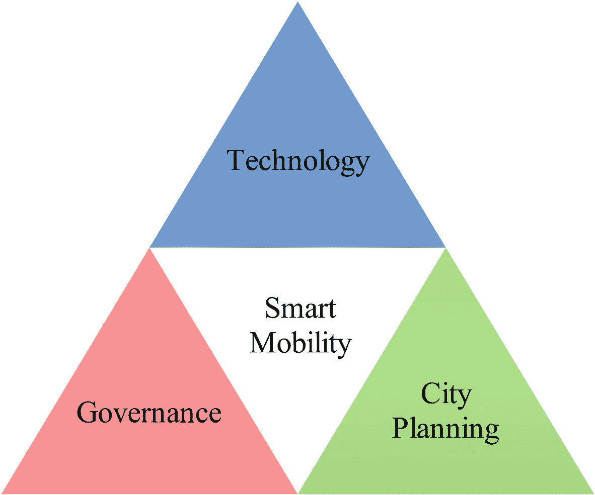

# 2. 智能出行三要素

出行是指乘客移动和货物运输的能力与潜力。根据联合国大会通过的《世界人权宣言》（Flowers, 1998），出行是一项核心人权，也是个人、企业和社会进行社会、经济和文化交流的基本需求和基础。“全民可持续出行”倡议^(⁵)于 2017 年正式成立，旨在通过聚焦以下四个目标来实现可持续出行：

- **安全：** 大幅减少死亡、受伤和交通事故。
- **绿色：** 最大限度减少出行的环境足迹（温室气体排放、噪音和空气污染）。
- **通达：** 将所有人，包括女性和社区，与经济和社会机会连接起来。
- **高效：** 优化出行的可预测性、可靠性和成本效益。

智能出行是对可持续出行的推广，它确保不同出行方式间的无缝衔接，使人员或货物能够以安全、清洁、最高效（快速、便捷、舒适、高效且廉价）的方式从一个地方到达另一个地方。智能出行建立在五个原则之上，即：安全、灵活、高效、集成和清洁技术。

**重要**  
根据 Reportlinker 的数据，全球智能出行市场规模预计到 2026 年将达到 910 亿美元，在预测期内以 18.4%的年复合增长率增长。释放智能出行的价值潜力巨大，预计到 2040 年，该市场将产生 2700 亿美元的收入和 1250-1500 亿美元的利润（Smart Mobility Team, 2018）。

未来的出行是以人为本、软件定义、互联互通和电动化的。通过以人为本的出行，城市的生活质量将得到提升。软件算法在实现高级辅助驾驶和自动驾驶车辆、共享出行服务、出行即服务、按需出行以及无缝集成出行方面发挥着关键作用。自动化出行将减少伤亡，改善目前因年龄或残疾而无法驾驶的人们的出行条件，并创造新的商业模式，如乘客经济。共享出行依赖于共享经济模式，该模式用“使用权”取代“所有权”。互联出行创造了新的数据丰富环境，并成为许多应用和服务的推动力，这些应用和服务将使我们的道路更安全、减少拥堵、更加环保。电气化是实现零排放和可持续出行的关键。然而，像自动驾驶这样的智能出行技术的广泛部署和公众接受度，不仅取决于技术的成熟度，还取决于是否有完善的管理框架和适当的城市规划来适应这些不断发展的技术。这意味着智能出行依赖于三个互补因素的组合，即技术、管理和城市规划，如图 2-1 所示。

这三个组成部分并非相互独立，而是相互影响的。以下各节将对这三个组成部分进行阐述。

## 2.1 智能出行管理

为智能出行服务创建一个全面有效的管理框架充满挑战，并且是一个动态目标，因为这个框架应接纳现有和新兴技术，鼓励创新，同时确保识别并谨慎管理社会和环境风险。

有一个关于大象和房间里一群盲人的古老寓言。这些人中没有一个以前见过大象。每个人在房间里触摸了大象的不同部位后，被要求根据刚刚的体验描述大象。摸到腿的盲人宣称：“它像一棵树或一根柱子”；摸到尾巴的盲人自信地说：“它像一根绳子”；摸到象鼻的说：“它像一条蛇或一根软管”；摸到耳朵的盲人毫不犹豫地说：“它像一条柔软的毯子”；摸到肚子的盲人胸有成竹地说：“它是一堵墙。”因此，每个盲人都从自己特定的角度去感知大象，并得出不同的结论。同样，智能出行管理法规的制定也应考虑到多个利益相关者的不同观点和关切。这些利益相关者包括政策制定者、城市当局、环保活动人士、保险公司、设备/出行平台制造商、智能出行服务提供商、驾驶员、行人、自行车骑行者、公共交通使用者、拼车用户、微出行用户以及其他智能出行服务使用者。这些利益相关者中，没有人完全了解需要如何监管智能出行服务，以及如何平衡不同的需求和诉求。

**图 2-1** 智能出行三要素

围绕若干智能出行技术的法律和监管环境仍不明确且发展不完善，尤其是在安全验证和确认、混合交通管理（非自动驾驶与自动驾驶车辆混行）、数据隐私和责任归属方面。以安全为最高优先事项，已有多种安全标准和安全性能评估程序可供使用，并且不断发展。例如，为应对 E/E 安全相关系统功能异常行为可能造成的危险，引入了`ISO 26262`功能安全标准。系统故障可能是确定性的，可归因于具体原因，也可能在随机硬件失效的情况下是不可预测和概率性的。故障模式与影响分析（FMEA）是一种结构化方法，通常由汽车制造商用于发现车辆设计或过程中可能存在的潜在故障。

