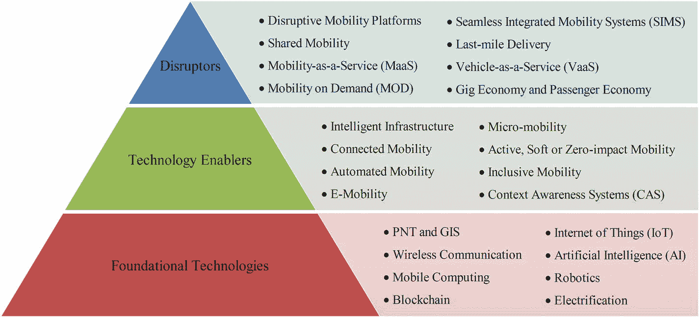

# 排版后文本

欧洲新车安全评鉴协会（`Euro NCAP`）^(⁶)常用于评估汽车安全性能。预期功能安全（`SOTIF` 或 `ISO/PAS 21448`）（ISO, 2019）旨在应对辅助驾驶和自动驾驶车辆软件开发者面临的新型安全挑战。`SOTIF` 解决了传感器、算法和执行器在性能上的局限性，并为设计、验证与确认措施提供指导。多项功能可能应用 `SOTIF`，例如纵向控制、横向辅助、变道、脱手驾驶、自动泊车和自动召唤。恶劣天气条件也对自动驾驶车辆构成多重挑战：积雪和雨水会遮挡并干扰传感器，掩盖道路标线，并改变车辆行驶表现。`SOTIF` 的最终目标是限制自动驾驶系统（`ADS`）可能出现的未知不安全状态数量。

此外，欧盟航空安全局（`EASA`）（Cluzeau 等，2020）制定了神经网络设计保证概念（`CoDANN`），作为验证与确认安全关键型应用数据驱动模型的方法。有关 SAE 3–4 级自动驾驶（有条件/高度自动化）验证与确认方法的更多信息，读者可参阅由奥迪、百度、宝马、英特尔、戴姆勒和大众等 11 家汽车及自动驾驶行业主要利益相关方联合发布的《自动驾驶安全优先（`SaFAD`）》白皮书（Wood 等，2019）。世界经济论坛（`WEF`）发起的“安全驾驶倡议（`SafeDI`）”旨在弥合行业在自动驾驶汽车安全方面的专业知识与监管机构制定保障自动驾驶部署政策的意愿之间的差距（世界经济论坛（`WEF`），2020）。Autonomous 与 `WEF` 联合发布的《自动驾驶治理生态系统报告》（世界经济论坛（`WEF`），2021）重点介绍了可供行业决策者参考的各类自动驾驶相关联盟、协会、标准制定组织与合作伙伴关系。Autonomous^(⁷) 全球社区定期发布针对汽车及自动驾驶出行行业决策者的各类倡议与联盟最新信息。

智能出行技术（如自动驾驶系统（`ADSs`））的责任问题仍不确定且未完全明确。应讨论不同形式的责任，例如车主责任、制造商/供应商责任、保险公司责任以及智能交通系统（`ITS`）责任。若自动驾驶车辆未投保，车主需对任何事故负责。若产品出现缺陷，生产者、自有品牌商及缺陷产品进口商将承担民事责任。保险公司则根据保险条款与条件直接承担赔偿责任。如果事故是由基础设施故障导致，`ITS` 所有者与管理者也可能需要承担责任。

总体而言，自动驾驶汽车的法律环境仍在不断发展。近年来，多个国家已启动针对自动驾驶系统的监管与立法行动，例如美国的《H.R.3388——自动驾驶法案》、英国的《自动驾驶车辆试验行为准则》、德国的《自动驾驶车辆法案》、法国的自动驾驶汽车立法框架，以及欧盟的《自主产品安全评估标准（`UL-4600`）》。例如，《自动驾驶法案》禁止各州禁止自动驾驶车辆上路，允许企业首批 10 万辆汽车豁免现有安全标准，并要求制造商制定抵御数字车辆网络攻击的计划。德国近期批准了全球首个将自动驾驶车辆纳入常规交通的法律框架。该法案将修改交通法规，允许到 2022 年实现无人驾驶车辆在公共道路行驶，为企业大规模部署自动驾驶出租车和配送服务铺平道路。根据 `NHTSA`（美国国家公路交通安全管理局等机构，2017）的观点，公众对 `ADSs` 发展的信任与信心可能推动或阻碍其在公共道路上的测试与部署。这一结论同样适用于其他颠覆性智能出行系统与服务，例如空中出租车和自主货船。例如，快速发展的人员与货物运输城市空中交通（`UAM`）平台需要建立监管环境，以解决安全、隐私、噪音污染、视觉干扰、野生动物影响等不同方面的问题，并需符合各类民航标准与推荐规范，如 `ICAO SARPs`、`FAA FARs`、`JAA`、`EASA` 等。美国联邦航空管理局（`FAA`）现已距离备受期待的“无人机系统交通管理（`UTM`）”生态更近一步。`UTM` 将明确低空非受控无人机运行管理的服务、角色与责任、信息架构、数据交换协议、软件功能、基础设施及性能要求。`UTM` 是与 `FAA` 的空中交通管理（`ATM`）系统相互独立但互为补充的框架。改变海事法律法规仍是适应自主船舶用于人员出行和货物交付的挑战。尽管国家水域的法规调整较快，但修改国际法规以支持自主船舶进入国际水域尚需时日，需解决安全、安保及责任等多个方面。支持（有时也阻碍）智能出行解决方案（共享、自动化、电动、集成）发展与实施的管理与监管流程在（Finger 和 Audouin, 2018）一文中有重点阐述。


## 2.2 城市规划

正如 20 世纪初第一批汽车的到来从根本上改变了我们的社会一样，智能出行系统也将引发城市规划领域的渐进式变革与颠覆性革命。这些变化包括但不限于以下方面：

- 重新规划交通走廊和城市街道，以容纳更多行人、自行车骑行者、共享交通工具使用者，并减少私家车数量
- 设置步行路线和自行车道，倡导主动、温和且包容的出行方式
- 建设自行车高速公路（亦称自行车快速路或超级高速路），提供交叉口停靠点少、通行顺畅的直达路线
- 在城市中为自动驾驶汽车设立紧急安全点，以备需要远程或现场人工干预时使用
- 在高速公路沿线设置港湾式停车区，用于应对自动驾驶车辆故障或突发道路事件
- 升级城市基础设施，实时提供交通状况、交通事故/事件、可能影响交通的社会/体育活动、施工区域以及道路工程临时变更（如道路封闭和车道变更）等信息。安全关键信息可通过基础设施传感器收集并传输至网联车辆
- 安装互联出行基础设施，例如`ITS`（智能交通系统）、智能交叉口和智能路面
- 设置高度醒目且清晰可辨的标志标线，如人行横道（例如斑马线、信号灯控制式行人过街）、学校区域、铁路道口、让行标志、道路边缘、弯道、限速和停车标志等，以适应辅助驾驶与自动驾驶车辆。在此背景下，欧盟成员国正研究统一安全关键道路标志，以辅助辅助驾驶和自动驾驶车辆识别
- 用数字化互联交通标志替代传统道路标牌，以解决可能影响自动驾驶系统运行的道路基础设施老化等问题
- 创建新型无信号控制人行横道，避免"行人过街博弈"现象
- 升级速度管理工程措施，包括水平偏移（如环岛、错位车道、蜿蜒式道路）、垂直偏移（如减速带、抬高式人行横道和缓冲带）以及缩减街道宽度（如路边停车、道路瘦身和路口路缘延伸）
- 安装智能包裹储物柜，用于最后一公里配送
- 为按需出行系统设置自行车停放架/停车架及上下客点
- 设立微型出行站点
- 增设电动汽车充电站、无线/无绳充电板及支持边行驶边充电的充电道路
- 规划空中出租车起降点
- 实现智能停车，持续监测停车位状态，并自动化处理多项运营流程，如可用车位检测和数字支付。这些智能停车系统需针对`自动代客泊车`（AVP）和自动驾驶电动汽车停车等新兴技术进行升级，具体包括优化布局、充电桩/无线充电板、通信基础设施以及上下客与取车区域
- 最后，随着新兴的重型卡车列队行驶技术发展，车队管理应考虑桥梁运营限制条件，桥梁设计标准也需相应修订

## 2.3 智能出行技术

在其著作《未来概况：对可能之极限的探究》（Clarke，2013 年）中，英国科幻作家、发明家阿瑟·克拉克提出了著名的"克拉克三定律"，其中第三定律最为人知且被广泛引用："任何足够先进的技术都与魔法无异。"网联汽车技术就是这样的魔法，它创造了数据丰富的全新环境，并催生了众多应用和服务，使我们的道路更安全、更畅通、更环保。共享出行技术是另一种魔法，它用使用权取代了所有权。出行即服务（MaaS）、按需出行（MOD）和无缝集成出行系统（SIMS）则是实现人员与货物运输新自由主义化的魔法，让无缝出行成为可能。自动驾驶技术是神奇的魔法，它将大幅减少伤亡事故，改善因年龄或残疾而无法驾驶者获取出行服务的机会，并开启乘客经济的大门。3D 出行是将我们从仅支持 2 自由度（横向和纵向运动）的二维街道限制中解放出来，迈向 3 自由度（横向、纵向和垂直运动）——更准确地说是 6 自由度（横向、纵向、垂直、侧倾、俯仰和偏航）——的魔法，这考虑到了飞行平台的旋转运动。零排放超级高铁技术堪称魔法，它能让你仅用 35 分钟就从洛杉矶抵达旧金山，而高速铁路系统则需要 2.5 小时。电气化则是将在不久的将来实现净零排放和可持续出行的魔法。

智能出行的技术层面可从基础技术、技术使能因素和颠覆性技术三个方面进行阐释，如图 2-2 所示。该图所列内容并未囊括当今不断动态变化的所有基础技术、使能技术和颠覆性技术。然而，所提及的技术是现有及未来可能出现的智能出行系统与服务的核心构建模块。此外，其他硬件相关技术，如嵌入式系统、传感器、执行器、车身设计、显示屏，以及`E/E 架构`（电子电气架构）、测试、验证、确认和网络安全等技术也同样重要，但不在本书的讨论范围之内。

```

```

**图 2-2**  
智能出行：基础技术、技术使能因素与颠覆性技术


