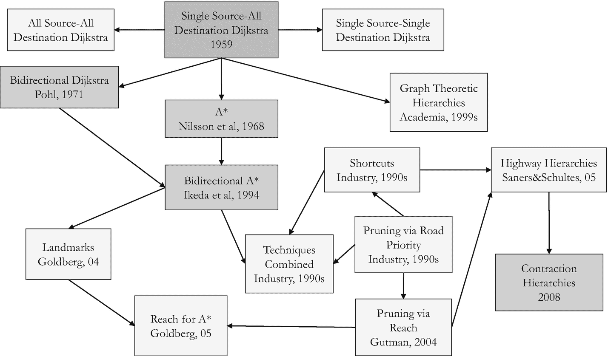
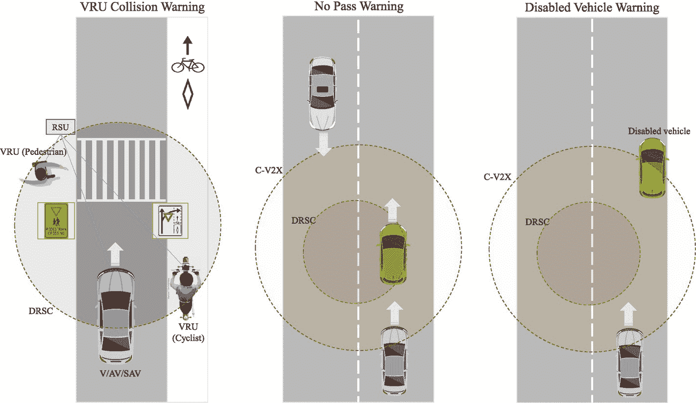

# 3.1 PNT 与 GIS

定位、导航与授时由美国运输部（DOT）定义为三种不同基本能力的组合（Wallischeck 等，2016）：

* **定位**是指能够精确、准确地确定自身在二维（或在需要时三维）空间中的位置和朝向，且该位置参照标准大地测量系统（如 1984 年世界大地测量系统，即 WGS84）。
* **导航**是指能够确定当前和期望位置（相对或绝对），并对航向、朝向和速度进行修正，从而抵达地球上从地下到地表、从地表到空间的任何期望位置。
* **授时**是指能够在世界任何地方，并在用户定义的时间参数范围内，从标准时间（协调世界时，即 UTC）获取并维持准确且精确的时间。授时还包括时间传递。

一般来说，根据车辆的工作环境，车辆定位可分为室内定位和室外定位两类。室内定位是精确估计在建筑物环境内移动的车辆位置和朝向的过程（Mautz，2012）。此过程中要解决的复杂程度主要取决于环境的特性。室内环境可分为结构化或非结构化、完全可观测或部分可观测、甚至是静态或动态。在非结构化的部分可观测动态环境中进行室内定位被认为是一个具有挑战性的过程。该过程首先使用不同类型的传感器（如基于无线电波的传感器、磁传感器、声学传感器或相机）来观测环境。然后，通过利用各种定位方法对收集到的数据进行进一步过滤和后处理，以精确确定车辆在其环境附近的位置。这些定位方法的示例包括：小区标识（`CoO`）/临近检测/基于连接的定位、质心确定、测距/三边测量/多边测量、极坐标法/距离-方位定位、指纹识别/场景分析/模式匹配以及航位推算。这些不同的定位方法在精度和覆盖范围上各有差异。根据目标应用所需的精度水平，可以选择相应的合适定位技术。不同室内定位技术的相对精度和覆盖范围在（Mautz，2012）中有描述。

与室内定位相比，室外环境由于其大规模、本质上的非结构化、部分可观测以及动态的特性，使得室外定位是一个比室内定位更具挑战性的过程。这主要是由于缺乏控制环境的能力以及室外动态环境的有限可预测性。

室外定位技术可分为三大类：相对定位、全局定位和混合定位技术。在相对定位技术中，主要目标是利用各种车载传感器（例如编码器、陀螺仪、加速度计等）提供的信息，精确评估位置和朝向。在这些技术中，位置和朝向是相对于车辆开始运行时的初始已知位姿进行测量的。这些技术通常存在一些不确定性，因为测量过程中产生的误差会随时间不断累积。这会导致误差椭圆扩大，可能使测量读数随时间偏离实际位姿。相对定位技术的例子包括航位推算（Brossard 等，2020）、惯性导航（Woodman，2007）和视觉里程计（Maimone 等，2007）。与相对定位技术不同，全局定位技术是相对于全局参考系来确定车辆的位置和朝向。全局定位技术的例子包括地基射频系统、有源 RFID 技术、实时定位技术、全球定位系统（`GPS`）、亚米级 `GPS` 技术（例如星基增强系统、精密单点定位（`PPP`）和实时动态差分（`RTK`））、实时定位系统（例如超宽带或 UWB RTLS）以及混合技术（例如 `GPS` 和 UWB）。最流行的技术是 `GPS`（Samama，2008），它基于卫星信号来确定地球上车辆的绝对位置（经度、纬度和海拔）。`GPS` 为用户提供天基 PNT 服务。不可否认，过去几十年的技术进步以及 PNT/`GPS` 技术的广泛应用，已经在移动出行领域催生了重大创新。这些创新提高了所有交通方式的安全性、效率和可靠性，并将帮助实现交通领域的另一次变革性转变——迈向更高的自动化水平（Bisnath，2019）。这些技术对于依赖高精度、高可靠性定位、导航和授时信息的智能移动系统至关重要。`GPS` 能够提供地球表面及上方的位置信息，其精度范围从 3–10 米到厘米级不等，具体取决于所使用的 `GPS` 跟踪器的精度。除了 `GPS` 之外，其他全球导航卫星系统（`GNSS`）还包括欧盟的伽利略系统、俄罗斯的全球导航卫星系统（`GLONASS`）和中国的北斗卫星导航系统（`BDS`）。伽利略系统与 `GPS` 类似，但提供了新的服务以及更高的定位和授时精度与可靠性。它是唯一专为民用应用设计并由民用机构管理的系统。混合定位技术，例如精密单点定位（`PPP`）`GPS` 和实时动态差分（`RTK`）`GPS`，通常用于提高 `GPS` 的精度。`PPP` 被认为是一种利用 `GNSS` 星座提供厘米级误差定位的最优方法。`PPP` 处理来自单用户接收机的测量值，使用详细的物理模型和修正，以及预先计算好的精确 `GNSS` 轨道和时钟产品。`PPP` 与 `RTK` 等其他精密定位方法的不同之处在于，车辆附近无需参考站。另一个优点是，由于 `GNSS` 轨道和时钟产品本质上是全球性的，因此 `PPP` 的解决方案也是全球性的。例如，Trimble `RTX` 是一种先进的 `PPP` 技术，可提供实时厘米级定位。`RTK` 卫星导航是一种基于使用 `GPS`、`GLONASS` 和/或伽利略信号载波相位测量的技术，其中单个参考站提供实时修正，可实现高达厘米级的精度。`RTK` 修正信号通常由基站通过超高频无线电接收器/发射器传输，或者如果该区域有 `CORS` 网络，则通过 `NTRIP` 服务器（经由 `GSM` 网络）传输。 (Nord 等，2021) 描述了用于自动驾驶的网络 RTK 定位（`NPAD`）项目。`RTK` 技术的主要缺点是由于基站和移动接收器之间路径上的障碍物导致低功率系统传输距离短。另一个缺点是信号干扰，它会减少传输距离并导致信号质量差。

### 基于 WiFi 的定位与地理信息系统

#### 基于 WiFi 的定位

基于 WiFi 的定位可以弥补传统 GPS 在大都市地区的不足。在这种情况下，可以通过三边测量和指纹识别技术来探索 WiFi 定位，因为仅依赖三边测量并非合适的选择——该方法需要在二维平面上至少有三个视距内的参考点才能定位车辆，而在城市峡谷等区域，这些条件往往无法满足。通过三边测量和指纹识别估算出的 WiFi 定位结果，可以与 GPS/智能手机定位模型协同使用。其他新兴定位技术包括 5G/3GPP（例如 R16 NR 定位）、蜂窝车联网（V2X）（例如 R16 NR V2V/V2I）以及视觉定位系统（VPS）。VPS 或基于视觉的地图匹配是一种潜在的定位方式。在 VPS 中，车辆位置通过识别自然地标并将其与已知区域地图进行匹配来估算。

#### 地理信息系统（GIS）

`地理信息系统（GIS）`是一种用于输入、存储、操作和输出地理信息的信息系统。GIS 在现有和新兴的出行系统中扮演着至关重要的角色。如今，多种基于互联网的地图技术为地球大部分陆地表面提供免费的卫星图像、航拍照片和地形数据，从而提高了地图技术的可用性。例如`Google Earth`、`Google Maps`、`OpenStreetMap`、`ArcGIS`、`QGIS`、`2GIS`、`Bing Maps`、`HERE WeGo`和`MAPS.ME`。其他地图服务如`AccuTerra`则专注于提供来自`美国地质调查局（USGS）`地形图系列、国家公园、国家森林和`土地管理局`数据的休闲娱乐地图。

#### 高精地图（HD Maps）

高精地图（HD Maps）可采用不同方法构建，为自动驾驶汽车等智能出行平台提供厘米级的超高精度信息。此类信息示例包括车道边界、交叉口、人行横道、停车位、停车标志、交通信号灯等。当我们创建城市的高精地图时，实际上是在创建城市道路网络的数字基础设施（Vardhan，2017）。根据 Lyft 公司（Chellapilla，2018）的说法，高精地图分为五个层次，即：基础地图（标准精度地图）、包含世界三维信息的几何地图、在几何地图层上添加语义对象构建的语义地图、包含动态元素衍生信息及人类驾驶行为的地图先验知识层，以及读写实时知识层。不同类型传感器（如 GPS、摄像头、雷达和激光雷达传感器）会被使用并融合，以创建这些高精地图。

#### 将 5G 与 PNT、GIS、高精地图和交通数据相结合

将 5G 与 PNT（定位、导航、授时）、GIS、高精地图技术以及交通密度数据相结合，将赋能多种需要高速数据传输、低网络延迟、精准定位、导航、授时和地图服务以及实时交通数据的智能出行应用。应用示例包括高效路径规划与重规划、移动资产追踪、位置感知服务、出行即服务、按需出行以及无缝集成出行服务等。例如，像`Google Maps`这样的导航应用包含以下组成部分：

- **地图编码算法：** 包括空间索引算法和计算几何算法，用于组织地图数据并高效检索。常用有向图和收缩层级结构来表示地图。道路分类层级或道路等级体系是一种根据使用情况、位置、路面类型、通行能力等多种因素将道路分组的方案。

- **地图绘制算法：** 用于绘制地图（例如，投影经纬度坐标；填充多边形；为街道、城市、企业和公园等地点命名）。

- **查询理解算法：** 理解用户查询。这些查询可以是打字输入或语音输入。通过图像搜索位置也是一种可能。查询理解算法运用了自然语言处理、语音识别和机器视觉技术。

- **GPS 信号处理算法：** 用于提高精度并处理低成本 GPS 存在的各种不完善问题，如不确定性和模糊性。

- **地理编码算法：** 使用地理坐标系将地址转换为地图上的点（或多边形）。地理坐标系是一种能够用一组数字、字母或符号来指定地球上每个位置的坐标系（Crossley，1999）。将坐标赋予地球表面位置的常见地图投影包括经纬度坐标、`通用横轴墨卡托投影（UTM）`、`军用网格参考系统（MGRS）`、`美国国家网格（USNG）`、`全球区域参考系统（GARS）`和`世界地理参考系统（GEOREF）`。`What3words (W3W)` 是一种人类可读的地理编码系统，用于以三米的分辨率进行位置通信。类似地，基于谷歌`开放位置编码（OLC）`地理编码系统创建的`Plus codes`也提供基于经纬度、以数字和字母显示的地理标签。这些地理标签（如`W3W`和`Plus codes`）可用于标记没有正式地址的位置，因为全球一半的城市人口生活在未命名的街道上。

- **路径规划算法：** 用于找到当前位置与目的地之间的最优路线（在大型时变道路网络中的最短或最快路径）。像`Waze`、`Apple Maps`和`Google Maps`这样的移动应用通常被用作提供最优或次优路线的导航应用。然而，需要这些应用的更高级版本，以包含诸如住宅街道通行能力和可能影响安全或导致拥堵的动态事件等额外信息（Macfarlane，2019）。路径规划通常被视为一个图搜索问题。图是一种表示道路网络的数学方法。图的节点代表交叉口，边代表道路。一条路径是连接起点节点和终点节点的一系列边。如图 3-1 所示，Dijkstra（迪杰斯特拉）、A-star（A 星）和收缩层级算法常用于解决路径规划问题。

**图 3-1：** 路径规划算法示例

这些图搜索算法及其他算法均可用于解决此`GitHub`仓库中的路径规划问题，该仓库是我在加拿大多伦多大学`爱德华·S·罗杰斯高级电气与计算机工程系（ECE）`授课时开发的。

> **重要提示：** 每位驾驶员每天少行驶一英里，每年可节省高达 5000 万美元（UPS 流程管理总监 Jack Levis）。

- **基于交通方式的路线：** 根据可用的交通方式（驾驶、摩托车、骑行、公交、步行、网约车服务）计算不同的路线。

- **反向地理编码算法：** 用于执行反向地理编码，使用点-多边形算法将点转换为地址。

- **导航引导：** 在路线执行过程中，通过图形、声音提醒、文本转语音合成或语音助手提供引导。

- **偏航检测与重规划：** 用于检测驾驶员何时偏离路线并需要新路线。

- **兴趣点：** 当前位置附近的商场、餐厅、停车位等会被高亮显示。

##### 处理差异

例如，在光照条件方面，可以使用谷歌地图的街道照明图层来帮助旅行者通过照明良好的街道导航，或避开黑暗的街道。另一个例子是，当穿越美加或美墨边境时，可以将计量单位从英里切换为公里（或反之），或者调整道路使用规则。

## 3.2 无线通信

在过去十年中，对无线技术的需求呈爆发式增长，蜂窝通信和个人通信已成为电信服务中增长最快的领域（Chen, 1998）。无线通信以高可靠性促进实时数据的传输与交换，并确保移动平台与其环境之间的无缝集成。研究人员已在密集、动态及恶劣天气环境中实现无线车载通信方面做出了大量努力（Siegel 等人，2018；Bey 和 Tewolde，2019）。延迟、功耗要求、可扩展性和成本是影响无线通信的关键因素，尤其是在电动汽车（EV）场景下。

用于智能出行系统的无线通信技术主要包括专用短程通信（DSRC）和蜂窝车联网（C-V2X）通信。此外，更多正在进行的研究探讨了将这两种技术相结合是否会为出行系统带来更繁荣的未来：

**图 3-2** 易受伤害道路使用者（VRU）碰撞警告、禁止超车警告和故障车辆警告

- **DSRC**（Shukla 等人，2020）：基于 `IEEE 802.11p` 标准，支持移动车辆之间（V2V）、车辆与基础设施或移动设备之间（V2X）连续、低延迟且安全的数据交换。

- **C-V2X**（Abou-Zeid 等人，2019）：在物理层采用单载波频分多址（`SCFDMA`），与 DSRC 相比可实现更高的数据速率和更广的覆盖范围。尽管一些人认为 DSRC 相较于基于 LTE 或 5G 的 C-V2X 已属过时技术，但当今的 LTE 无线通信因高延迟无法充分支持碰撞预警等车辆安全应用。5G 的 promising 能力将解决这一局限，但广泛部署 5G 基础设施可能需要一段时间。

- **混合架构**：结合 DSRC 与蜂窝技术形成混合解决方案被认为前景广阔，因为它充分利用了两种使能技术的优势。例如，当车辆间传输数据出现中断且 V2V 多跳通信失败时，蜂窝技术可作为备份方案来中继传输信息。同样，当车辆与路边单元（RSU）的互联网连接丢失时，车辆可重新连接至蜂窝技术的互联网接入网络。图 3-2 展示了一些将受益于 DSRC 与蜂窝技术集成的安全应用。

2020 年 11 月 18 日，美国联邦通信委员会（FCC）将长期预留给交通领域的 5.9 GHz“安全频谱”重新分配给了 WiFi 和 C-V2X。该裁决实际上终结了基于 WiFi 的 DSRC 的未来，并锁定了正在发展的替代技术 C-V2X。

通信卫星，例如地球同步赤道轨道/地球静止轨道（GEO/GSO）、中地球轨道（MEO）和低地球轨道（LEO）（Yang, 2019），可以提供可用于智能出行系统的低成本全球连接。SpaceX、OneWeb 甚至 Facebook 等多家公司正投资于卫星星座，旨在为全球提供可负担的消费者互联网服务。亚马逊也在研究用于物流的卫星通信。特斯拉、丰田和吉利等不同汽车制造商已规划拥有自己的卫星网络，并将其集成到车辆中。一种混合方法也是可行的选择，即地面蜂窝通信与卫星通信（GEO 或 LEO）相结合，以处理信号盲区覆盖和可靠性等问题。这种混合通信系统的潜在应用包括内容流媒体、游戏、车队管理、空中下载（OTA）更新、紧急通知、精确定位，以及自动驾驶车辆的关键任务应用（例如远程协助或远程操控——如将故障自动驾驶车辆引导至安全区域，或在自动驾驶车辆陷入困境的特定情况下允许其违反交通规则）。

