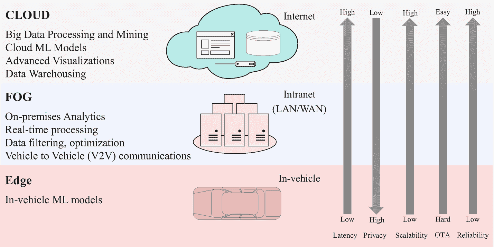

# 3.3 移动计算

移动计算是一套信息技术、产品、服务以及运营策略和流程，使授权的最终用户和移动资产能够从任何地方访问数据、信息和进行计算。根据数据源、存储和计算单元的邻近程度，移动计算可分为移动云计算（`MCC`）、移动雾计算（`MFC`）和移动边缘计算（`MEC`）（见图 3-3）。

移动云计算（`MCC`）定义为：

> *一种丰富的移动计算技术，它利用各种云（私有或公有）的统一弹性资源和网络技术，以实现无限制的功能、存储和移动性，通过网络通道随时随地服务于多种移动设备，无论其异构环境和平台如何，均基于按需付费原则。*
> 
> ——Sanaei 等人，2013 年

`MCC` 作为云计算和移动计算的结合，正被研究人员和从业者视为一种令人兴奋的新方法，用于扩展移动设备和移动平台的能力，这有可能对商业环境和人们的日常生活产生深远影响（Leung 等人，2013 年）。

移动雾计算（`MFC`）（An 等人，2018 年）和移动边缘计算（`MEC`）（Li 等人，2016 年）是两种新兴范式，用于解决云计算中与延迟、带宽、隐私和安全相关的一些问题。`MFC` 和 `MEC` 都将计算和存储推向更接近数据生成的位置，使移动用户/移动平台能够将部分或全部计算密集型且时间受限的任务卸载到附近或本地服务器进行计算。这实现了超低延迟、更好的带宽利用率、更快的洞察和行动以及更高的可扩展性，因为它减少了需要发送到集中式数据中心或云端的数据量，并在雾或边缘节点执行计算。在智能移动领域，隐私和安全是 `MFC` 和 `MEC` 的额外优势，其中 `MFC` 可用于管理特定地理围栏区域内的自动驾驶车队，而 `MEC` 可用于在每个车辆中运行基于 AI 的模块，用于感知、规划、控制、学习和自适应。图 3-3 展示了一个基于机器学习的服务部署示例。

**图 3-3** 移动计算部署架构

> **注** 无处不在的移动计算技术的出现催化了交通运输行业的变革。

移动计算是多项颠覆性移动服务的基础技术，例如基于应用程序的运输网络公司（`TNCs`）、一切皆服务（`XaaS`）、出行即服务（`MaaS`）、车辆即服务（`VaaS`）、点击取货的最后一英里配送服务以及移动云感知。例如，基于移动计算可以开发多种移动云感知应用，如下所示（Han 等人，2015 年）：

* **个体感知应用**：如针对主动出行的自我锻炼管理和日常活动记录
* **群体感知应用**：如路况监测、协作地图绘制和自主垃圾收集
* **社区感知应用**：如交通监测和污染监测
* **机会感知应用**：无需用户交互，感知活动可以长期持续，但结果依赖于稳定、无太多干扰的感知环境
* **参与式感知应用**：需要说服用户参与感知，激励措施包括金钱、共同利益和责任

