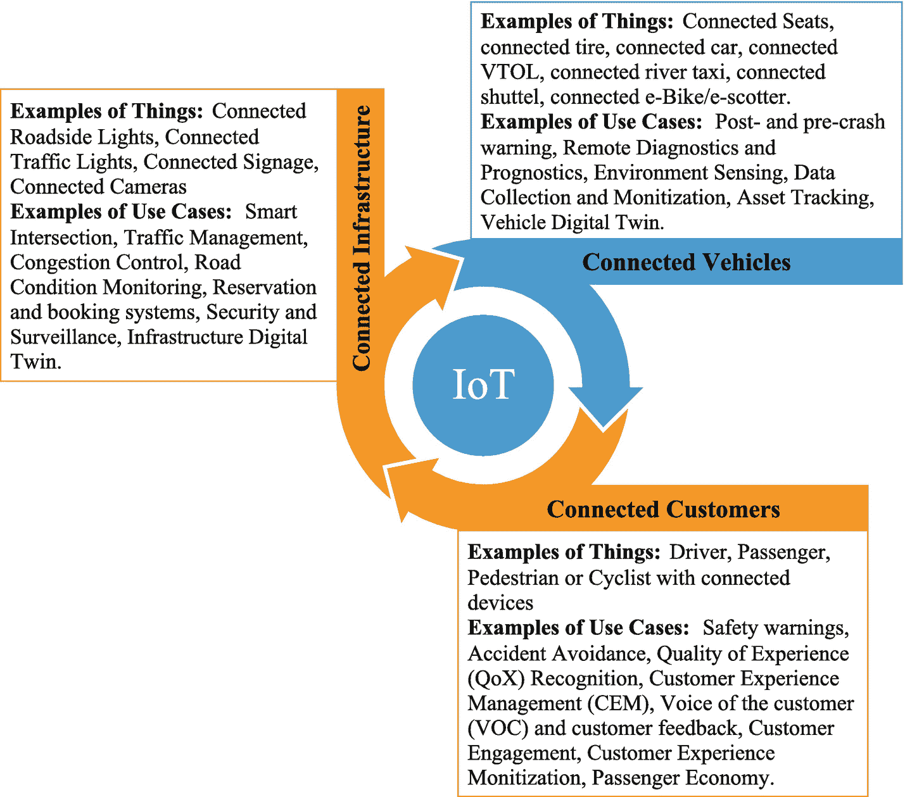
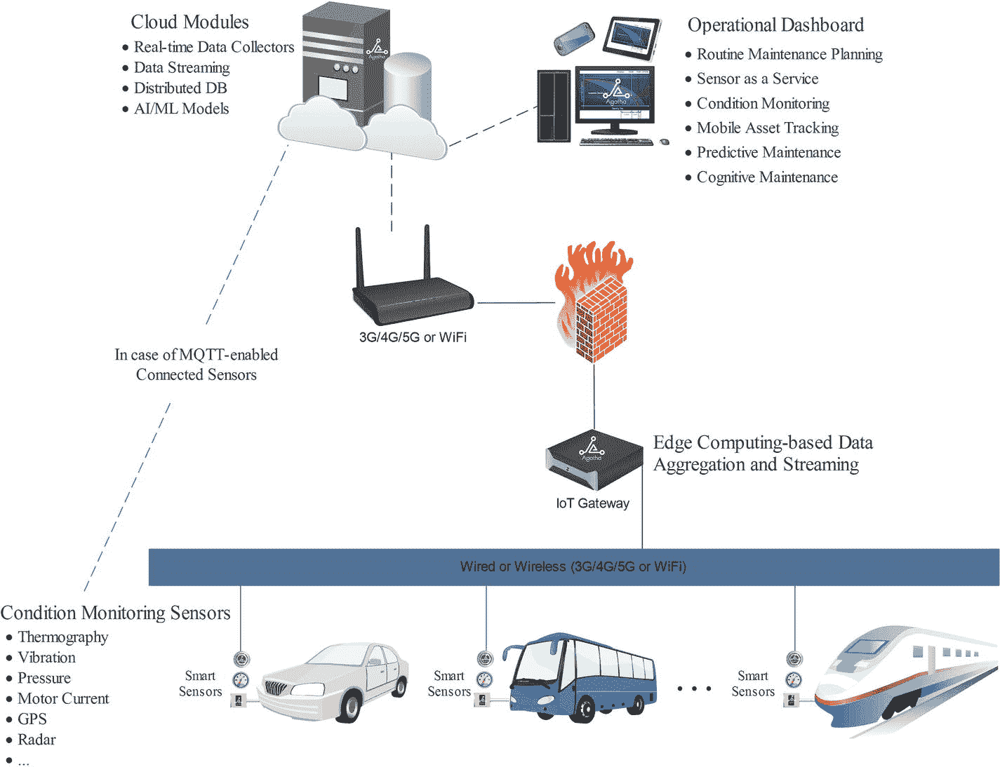
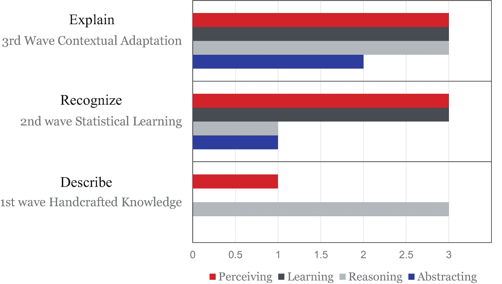
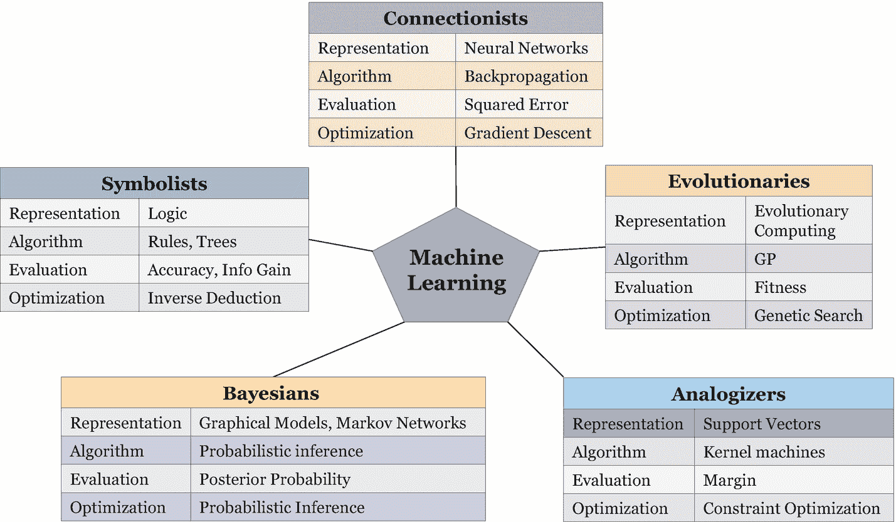
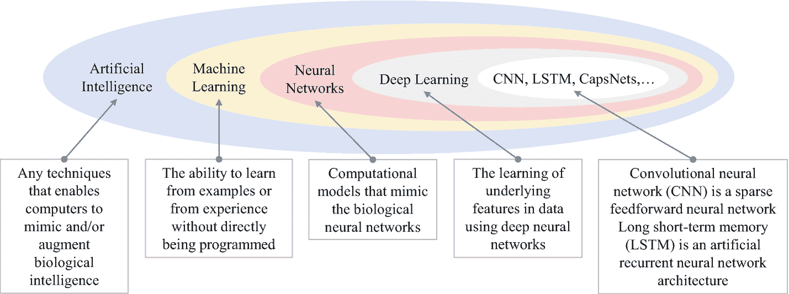

# 3.4 区块链

分布式计算的概念自 1990 年以来就已存在。区块链于 2009 年被发明，作为加密货币比特币的公共交易账本（Staff，2016 年）。中本聪创建了比特币，并引入了区块链的概念，以创建一个由匿名共识维护的去中心化账本，作为第一个区块链数据库。加密货币在与现金相关的应用中的部署始于 2011 年，随后在 2012 年引入了货币转账和数字支付系统。智能合约于 2014 年开始发展，许可型区块链网络解决方案于 2015 年出现。从 2016 年开始，区块链开始渗透到不同行业。

基于点对点（`P2P`）拓扑结构，区块链是一种分布式账本技术（`DLT`），它提供了一个可信且透明的环境，允许数据全局存储在数千台服务器上，并便于访问这些数据（Mearian，2019 年）。区块链是一种分布式记录数据库，或者是所有已在参与方之间执行和共享的交易或数字事件的公共账本（Crosby 等人，2016 年）。账本本质上是一个交易数据库。该技术是一种用于发现、估值和转移资产所有量子的新型组织范式。该资产可以是有形资产（实物财产、房屋、汽车）或无形资产（投票权、创意、声誉、意图、健康数据、信息等）（Swan，2015 年）。在智能移动领域，有形资产可以是移动平台，如汽车、自行车、踏板车、公共交通工具、自动旅客捷运系统或超回路列车。数字资产可以是共享车辆或智能储物柜的访问码，也可以是智能移动平台或任何其他物理对象（如备件或充电站）的数字孪生。这些资产可以注册一个唯一标识符，并在区块链上进行跟踪、控制和交换。数据透明性、安全性、资产管理和智能合约被认为是区块链技术的关键和区别于其他技术的特征（Heutger 等人，2018 年）：

* **数据透明性**：区块链技术包含确保存储的记录准确、防篡改且来自可验证来源的机制。
* **安全性**：单个交易和消息都经过加密签名。这确保了必要的安全性和有效的风险管理，以应对当今黑客攻击、数据篡改和数据泄露的高风险。
* **资产管理**：管理数字资产的所有权，并促进资产转移。
* **智能合约**：智能合约是基于区块链的系统的一个组件，可以自动执行利益相关者商定的规则和流程步骤。一旦启动，智能合约就完全自主运行；当合约条件满足时，预先指定并商定的操作会自动发生。这些智能合约可以加速流程，实现数字资产的快速安全支付、自动化租赁、融资、维护和其他程序。例如，在最后一英里配送场景中，一旦收到付款，产品配送会自动触发；或者一旦收到货物，付款会自动触发。

表 3-1 显示了不同类型的区块链技术，并给出了一些在智能移动领域的应用示例。区块链可以根据治理模型分类为：公有非许可型（例如，比特币、以太坊和 IOTA）、公有许可型（例如，Sovrin 和 IPDB）、私有非许可型（例如，Hyperledger Sawtooth 的非许可模式）以及私有许可型（例如，Hyperledger Fabric、Hyperledger Sawtooth、Hyperledger Iroha、R3 Corda 和 CULedger）。

### 智能出行中的区块链

区块链是推动社会数字化的另一组成部分。这项技术有潜力重塑交通和物流系统，提供诸如身份验证、访问控制、安全快速支付（去中心化机制，无需中央机构）、无缝信息共享（例如，通过提供出行服务的相关信息来赋能用户）、追踪（即监控过程）和溯源（即发现起源）等服务。想象一下，一个人登上一辆由区块链和物联网技术赋能的巴士出行平台。当这个人登上巴士时，加密空间层会记录上车站点和下车站点，并自动从乘客的空间钱包中扣除车费，将其记入公共交通公司的空间钱包（Dasgupta, 2017）。

区块链将提高智能出行平台及系统数字孪生的成本效益。数字孪生可以存储在基于区块链的系统中，用于监控、诊断和预测，以保证平台健康、高效、可持续地运行，优化运营和维护，发现设计及车队管理中的不平等。这种数字孪生是基于云的高保真虚拟表示，或者是出行平台的数字副本，其中包含平台在整个生命周期内属性和状态的最新、精确副本。这个生命周期涵盖了从设计到制造、运营、反馈和更新，直至物理平台报废的全过程。例如，由区块链技术驱动的数字孪生可以作为每辆车维护数据的单一可信来源，以消除非法的里程表篡改。

### 警告

里程表欺诈（也称为调表、改表、篡改里程表或回拨）是指手动或数字方式断开、重置或更改车辆里程表，意图改变所显示的英里数。

美国国家公路交通安全管理局 (NHTSA) 估计，每年售出的车辆中有超过 45 万辆带有虚假的里程表读数。这种犯罪每年给美国购车者造成超过 10 亿美元的损失，并带来安全风险。在加拿大，每年报告超过 89,000 辆车的里程表被篡改。一份覆盖加拿大全境的 `CarProof` 或 `Carfax` 报告可能包含也可能不包含里程表读数。在英国，每 14 辆汽车中就有 1 辆存在“里程差异”。在德国，估计每三辆车中就有一辆曾遭受非法的里程表篡改。每辆车因此欺诈而增加的估值据估计高达 3,700 美元，仅此一项在德国就意味着每年近 75 亿美元的欺诈额。为了解决这个问题，可以使用一个带有车载连接器的基于区块链的系统，定期记录每辆车的行驶距离，从而形成一个持续、防篡改的里程表读数记录（Heutger 等，2018）。

### 表 3-1：区块链类型及其在智能出行中的应用实例

| 特性 | 公有链 | 联盟链或联合链 | 私有链 |
| --- | --- | --- | --- |
| 访问权限 | 任何人 | 单一组织 | 多个选定组织 |
| 许可 | 无需许可 | 需要许可 | 需要许可 |
| 参与者是否已知？ | 匿名/假名 | 已知身份 | 已知身份 |
| 安全性 | 共识机制：工作量证明/权益证明 | • 预先批准的参与者 • 投票/多方共识 | • 预先批准的参与者 • 投票/多方共识 |
| 交易速度 | 慢 | 快 | 快 |
| 在智能出行中的应用实例 | 移动群智感知 | • 由城市交通委员会运营的区块链赋能公共交通 • 某组织的车队管理系统 | • 驾驶/测试数据共享 • 汽车原始设备制造商 (OEM) 之间的车辆数字孪生（`博世`和`德国莱茵 TÜV`） • 供应链管理 • 基于使用量的保险 • 汽车/拼车交易 • P2P 车辆共享服务 • 快速、弹性、透明的最后一公里配送服务（Ferrag and Maglaras, 2019） |

区块链技术同样能够成为点对点 (P2P) 出行平台共享系统的催化剂。在这些系统中，出行平台可以是一辆汽车（例如 `Drive Drive Car`¹⁰）、一辆自行车（例如 `Spinlister`¹¹）、踏板车、个人智能城市无障碍车辆 (PICAV)、垂直起降飞行器 (VTOL)、`SeaBubble` 或任何其他个人交通工具。区块链技术能够通过智能合约和智能密钥实现诸如身份识别、支付和资产转移等流程的自动化，提供透明度，确保可追溯性，并保证安全性，因为交易一旦写入便是加密且不可篡改的。

非同质化代币 (NFT) 是一种热门的区块链技术，目前正吸引着原始设备制造商 (OEM) 和出行服务提供商的关注。根据 `NonFungible.com` 的一份新报告，NFT 市场价值在 2020 年增长了两倍，达到超过 2.5 亿美元。NFT 是具有独特区块链数字签名的加密资产，可作为商业交易的媒介，将艺术、音乐、体育和其他流行娱乐领域的数字资产商品化。在智能出行领域，NFT 可用于通过指定车辆的共同所有权并显示各方的持有比例来促进数字所有权。西海岸定制公司 (West Coast Customs) 推出了 `"CarCoin"` NFT，将通过一个名为 `"The CarCoin Fast Lane"` 的层级会员计划提供。未来的计划包括对来自经典剧集 `"Inside West Coast Customs"` 的真实车辆进行拍卖。出行服务提供商也可以利用 NFT，用数字资产和忠诚度积分来奖励司机和乘客。

这种基于区块链的去中心化安全方法被认为在解决网联和自动驾驶汽车的安全与隐私问题方面前景广阔。例如，论文 (Rathee 等人，2019) 的作者强调，在基于实时环境控制系统的机密性和安全性方面，区块链技术是最佳技术之一。Dorri 等人 (Dorri 等人，2017) 设计了一种去中心化的 `轻量级可扩展区块链 (LSB)` 架构，可以在车辆、OEM 和服务提供商之间提供安全的覆盖网络，并通过使用可变化的公钥来保护用户隐私。作者阐述了不同的应用，包括保险和汽车共享服务，以验证他们提出的架构。然而，其他研究人员提出了区块链易受量子攻击的问题，因为量子计算机将能够破解至关重要的密码方案。

移动出行开放区块链倡议 ([MOBI](https://dlt.mobi/)) 由通用汽车、宝马、雷诺、福特、IBM、Hyperledger、IOTA 和 ConsenSys (以太坊) 共同成立，其宗旨是专注于推广标准，并加速区块链、分布式账本及相关技术在智能出行系统中的采用。

## 3.5 物联网 (IoT)

`物联网 (IoT)`（Atzori 等人，2010）是一项能够将任何设备连接到互联网和/或实现设备间互联，以共享数据和/或进行操作控制的技术。一个更宽泛的概念是`万物互联 (IoE)`。思科公司认为，`IoE` 指的是*“将人员、流程、数据和事物结合在一起，使网络连接比以往任何时候都更智能、更有价值，从而将数据转化为行动，为企业、个人和国家创造新的能力、更丰富的体验以及前所未有的经济机遇”*（Evans，2012）。`IoT/IoE` 的价值不在于让单个设备或系统变得智能，而在于实现跨系统的无缝流程。

一般而言，在智能出行背景下，一个“事物”可以是：配备联网设备的驾驶员、乘客、通勤者、公交运营者、行人或骑行者；一个联网的出行平台、联网座椅、联网胎压传感器、联网交通信号灯、联网交通传感器、联网基础设施、联网预订系统；或任何其他可以被分配`互联网协议 (IP)`地址并能够通过网络传输数据的自然或人造物体。

> **注意**  
> 根据`联合市场研究机构`的数据，全球交通运输领域`IoT`市场预计到 2023 年将达到 3287.6 亿美元，2017 年至 2023 年的预估复合年增长率 (`CAGR`) 为 13.7%。

`IoT`是联网基础设施、联网车辆以及联网客户/联网旅客的关键基础技术。`IoT`在智能出行中的应用包括状态监测、预测性维护或远程诊断与故障预测、车辆追踪、地理围栏、交通管理和拥堵控制系统、车队管理、预订系统以及安全监控，如图 3-4 所示。

例如，出行平台必须持续运行以保证服务的连续性。推进系统、传动系统或转向系统等关键部件在实现这一目标中起着至关重要的作用。了解这些关键设备的健康状况有时会被忽视，许多设备一直运行到发生故障为止。以纯电动汽车中的无刷`直流`电机或感应电机为例，电机故障可能导致整辆汽车功能失效，从而引发致命事故。幸运的是，像电机这样的机电设备在发生故障前并非毫无征兆。在故障发生前几个月，就能检测到微小的振动。故障发生前几周，开始出现明显的噪音。故障发生前几天，设备温度升高，而故障发生前几分钟，设备开始冒烟。通过电机状态监测，可以提前数月识别最微小的振动。在这种情况下，例如更换轴承，就可以防止故障的发生。

主要有三种类型的维护操作：

**图 3-4** 物联网在智能出行中的应用示例

- **改进性维护：** 旨在通过改造、加装、重新设计或更改出行平台上的指令，来减少或消除维护需求。
- **纠正性维护：** 主要是事件驱动的，可类比为在发生故障、紧急情况、需要补救、维修或重建时进行干预的“人手”。
- **预防性维护：** 旨在防止导致纠正或修理的意外停机和设备过早损坏。这种类型的维护可分为被动式或设备驱动式、时间驱动式和预测式维护。被动式或设备驱动式维护在需要时进行。时间驱动式维护中，预防任务按周期计划、或按固定间隔、或遵循硬性时间限制、或使用特定时间进行调度。预测性维护依赖于设备的状态监测。利用`IoT`连接传感器收集有关设备健康状况的数据。然后对收集到的数据进行分析，以深入了解可能的故障及其原因，并推荐有助于避免未来故障的预防措施。

当前预测性维护系统效率低下的主要原因是缺乏事实数据和实时数据分析模块。这阻碍了系统预测初期问题并量化实际维修或维护需求的能力。根据`ABB`公司发布的一项研究，使用联网传感器和数据分析的智能监测可以将低压电机的停机时间减少高达 70%，将其使用寿命延长高达 30%，并降低高达 10%的能耗。

**图 3-5** 基于认知物联网的状态监测、资产追踪和预测性维护系统 (Khamis, 2020)

图 3-5 展示了一种由我 (Khamis, 2020) 发明的基于认知`IoT`的预测性维护系统。该系统有助于分散式维护规划、分布式固定或移动资产的远程监控、故障预测，以及推荐主动措施以减轻这些风险，从而保持服务的连续性。该系统包含空间分布、可互操作、可访问的智能传感器，能够有选择性地收集和共享有关机器状况的数据。然后对选择性收集的数据进行分析，以获取实时洞察和性能数据，确定并动态更新故障可能性，并及时做出决策或提出建议。

## 3.6 人工智能 (AI)

`AI`成功交付了许多触及每个人日常生活的商业产品和服务。`AI`旨在模仿/逆向工程并增强生物智能，以构建能够自主运行并与之交互的智能系统/流程，这些交互发生在结构化/非结构化、静态/动态、完全/部分可观测的环境中。这通常涉及借鉴人类智能的特征，如情境感知、决策、问题解决、从环境中学习以及适应环境变化 (Khamis, 2019a)。`AI`包含许多子领域，例如感知（如物体识别、图像理解、语音识别、语音合成、自然语言理解）、知识表示、认知推理、机器学习、数据分析（如描述性、预测性、诊断性和规范性分析）、问题解决（如约束满足、使用搜索和优化进行问题解决）、分布式`AI`以及行动（如虚拟助手和机器人）。

### 3.6.1 人工智能的演进

`AI` 并非一种全新的技术，而是一项持续演进的技术，其根源可追溯到古典哲学家们试图将人类思维建模为符号系统的努力，这最终催生了作为思维过程的“联结主义”。我们应当区分两种 `AI` 方法：自上而下的方法（白箱或生成式方法）和自下而上的方法（黑箱、判别式或数据驱动方法）。传统的 `AI` 技术遵循自上而下的演绎推理方法，它们首先利用已有的知识和少量示例，构建关于世界的抽象且宽泛的假设。这些技术会根据这些假设成立时数据应有的样子进行预测，然后在收到更多观察结果后，根据预测结果来修正假设（Gopnik, 2017）。相比之下，现代 `AI` 技术或计算智能技术的特点是自下而上的归纳推理（处理数值数据以推断符号），并试图从原始数据（成千上万个示例）中提取模式。这些现代 `AI` 技术通过赋予产品和服务从存档数据、流数据或实时数据中发现和识别复杂模式与趋势（如类别、聚类或异常）的能力，并预测未来数值，以及在不同抽象层级从示例和观察中学习，从而驱动了各类产品和服务。

理解当前 `AI` 算法的局限性有助于判断哪些问题可以由 `AI` 解决，以及如何改进现有算法或创建新算法，以应对更广泛的实际不良结构问题（`ISPs`）。由于 `AI` 算法被用于赋予人工系统或过程以智能行为，我们应当理解智能行为的具体含义。行为是外部观察者所看到的人工系统或过程在做什么。广义上讲，`AI` 算法可分为个体（`i`-level）算法和群体（`g`-level）算法。无论是个体级算法还是群体级算法，都可用来实现单个系统/过程（以下称为“智能体”）或一组智能体的低级行为和高级行为。

单个智能体的低级行为可能包括：基于上下文的数据收集、物体检测、避障、语音识别，以及利用可用执行器操纵物体或对环境施加影响。群体级低级行为的例子包括：协作式上下文感知数据收集、信息交换和协同操作。例如，上下文感知数据收集指的是单个或多个智能体（在协作数据收集情况下）基于特定上下文，有选择性地、有认知地进行数据收集的过程。上下文是可用于表征情境的任何信息。下一章将提供更多关于上下文感知系统的细节。

单个智能体的高级行为包括：解释收集到的数据、理解当前情境、预测未来后果以及从经验中学习。在群体层面，高级行为可能包括但不限于：共享情境意识、达成共识、协作决策、群体形成、通信中继以及多智能体学习。例如，在协作学习中，必须最大化所有智能体折扣未来回报的总和（社会福祉），或者必须选择一个更易于收敛的均衡或共识点，例如纳什均衡点（Vidal, 2006）。与用于低级/高级行为的个体级算法相比，用于高级行为的群体级算法在设计上更具挑战性。这主要是因为我们对生物系统中高级行为的工作机制尚未完全理解。例如，人类及所有生命体都有从环境中获取信息、解读信息并做出适当决策的能力。这种能力需要执行不同的低级和高级功能。人类大脑的低级功能，例如看、听、闻、尝和触摸，已被充分理解并定位于大脑皮层。然而，更高级的认知过程，如信息融合、情境意识、推理、决策和学习，尚未被完全理解。总的来说，我们才刚刚开始了解这些高级认知功能在大脑中发生的位置，更不用说它们是如何实现了（Anderson, 2005）。理解大脑的工作方式可以说是我们这个时代最伟大的科学挑战之一（Alivisatos et al., 2012）。

在人类中，认知是通过大量神经元中神经激活的模式来实现的。类似地，多智能体系统必须能够执行不同的低级和高级行为。让我们以人类为例，将图片合成和学习分别作为个体低级行为和高级行为的例子。构建环境的完整图片可以通过单一感官实现，也可以通过融合从多种感官收集的数据来实现。人类大脑就像一个强大的融合节点。每当感官受到适当信号的刺激时，它就会融合不同的信息。我们的大脑持续且完美地融合了由眼睛、耳朵、鼻子、舌头和皮肤这些传感器提供的视觉、听觉、嗅觉、味觉和触觉信息。这些信息以神经元持续变化的电化学活动来表示。

对于像学习这样的高级功能，我们尚未完全理解大脑如何能通过极少甚至单个示例进行学习，如何能基于先前的经验进行泛化，以及如何能提取新概念并展现出创造性推理的不同迹象。例如，在未知环境中，我们常常会四处走动以探索并构建该环境的地图。即使关灯或闭上眼睛，我们也能在以后利用这张地图来导航。我们把这个地图存储在哪里，又如何学会使用它呢？需要开发结合自上而下演绎推理和自下而上归纳推理的新型混合机器学习算法，以模仿人类学习这一高级功能。

此前在个体层面（*i*-level）讨论的画面编译与学习行为，在群体层面（*g*-level）进行模仿要困难得多。我们尚未完全理解如何针对期望的群体层面（*g*-level）行为来设计个体层面（*i*-level）行为，因为集体行为并非个体行为的简单加总，而是在社会层面涌现出其他特性（*Pasteels and Deneubourg, 1987*）。理解人脑如何实时完美地执行低层次和高层次的认知功能，有助于为人工系统/过程设计高效且自适应的算法。

当前 AI 算法在创建人工代理个体和群体层面的低层次及高层次行为方面存在若干局限性，这使得当前这波 AI 成为一种弱/窄 AI，仅能在非常狭窄且定义明确的领域内运作。强/通用/深度 AI 以及超级智能尚未到来。配备了超级智能的机器将能够像超人一样执行认知行为。表 3-2 突出了窄 AI、通用人工智能与超级智能之间的主要区别。

当前媒体对 AI 的夸大宣传和噪音在社会中造成了对强 AI 的刻板印象，而我们现在实际拥有的只是一种弱 AI。这导致了期望与现实之间的差距扩大，使人们对 AI 工具的失败感到不满和缺乏宽容。实际上，即使是世界顶尖的 AI 专家也对超级智能何时到来存在分歧。一些人认为在 2045 年之前可以实现，而另一些人则猜测需要数百年甚至更久。为了降低这种风险，应强调当前算法的局限性，并开发新算法以开启下一波强/通用 AI 浪潮。

**表 3-2** AI 浪潮

| 浪潮 | 领域 | 适应性 | 脑力 |
| --- | --- | --- | --- |
| 人工窄智能 (ANI) | 特定领域（图像识别、语音识别、文本挖掘等） | 无 | 看似相似但水平不及（低于小鼠的脑力） |
| 通用人工智能 (AGI) | 个体层面（*i*-level）的跨领域能力 | 有 | 超越人类的脑力 |
| 人工超级智能 (ASI) | 个体层面（*i*-level）和群体层面（*g*-level）的跨领域能力 | 有 | 超越所有人类大脑总和 |

美国国防高级研究计划局（DARPA）对 AI 浪潮有着非常有趣的愿景（图 3-6）。在他们看来，第一波 AI 专注于基于手工知识或规则的系统，这些系统能够执行定义狭窄的推理任务，但执行感知任务的能力非常有限，且不具备学习、新概念生成或抽象能力。

第二波是当前基于统计机器学习的系统浪潮，能够识别复杂模式并从大量多维数据中学习。尽管这些系统拥有较高的感知和学习能力，但仍然存在抽象、推理、因果分析、可解释性以及在非平稳环境中适应变化条件的能力不足等局限。第三波 AI 的引入正是为了解决这一局限，专注于情境适应、可解释性和常识推理，使机器能够适应变化的情况。在像移动出行这样受到高度监管的行业，推理、因果、可解释性和处理漂移的能力至关重要，尤其是在移动出行车辆的安全关键功能方面。根据 DARPA 的说法，被称为“情境 AI”的第三波 AI 将处理当前 AI 浪潮的局限性。情境 AI 是一种嵌入并理解人类情境的技术，能够与人类交互（*Brdiczka, 2019*）。聚焦于情境 AI，DARPA 于 2018 年 9 月宣布了一项名为“AI Next”计划的多年度投资，投入超过 20 亿美元用于新的和现有的项目。^(¹²)

**图 3-6** DARPA 对 AI 浪潮的愿景

### 3.6.2 统计机器学习

学习是形成外部世界的内部模型（*Dehaene, 2020*）。机器学习（ML）是 AI 的一个子领域，它赋予人工系统/过程从经验和观察中学习的能力，而无需进行显式编程，如图 3-7 所示。

Mitchell（*Mitchell, 1997*）对 ML 的定义如下：*“一个计算机程序如果能够通过经验 E 改进其在某类任务 T 上的性能（通过性能度量 P 衡量），则称其从经验 E 中学习。”* 更全面地，Dehaene 引入了构成当今机器学习算法核心的七个关键学习定义。这些定义包括：学习是调整心智模型的参数，学习是探索组合爆炸，学习是最小化错误，学习是探索可能性空间，学习是优化奖励函数，学习是约束搜索空间，以及学习是投射先验假设（*Dehaene, 2020*）。在其著作《终极算法》（*Domingos, 2015*）中，Pedro Domingos 教授将机器学习的学派归纳为五个主要学派，如图 3-8 所示。

**图 3-8** 根据《终极算法》（*Domingos, 2015*）的机器学习方法

**图 3-7** AI、ML 与深度学习

*   贝叶斯学派：以概率推理作为核心算法
*   符号主义学派：以规则和树作为该范式内的核心算法
*   连接主义学派：使用带有反向传播的神经网络作为核心算法
*   进化主义学派：依赖进化计算范式
*   类比学派：使用诸如带不同核函数的支持向量机等数学技术

如今，连接主义学习方法因其在多个具有挑战性领域的感知与学习能力，吸引了大部分关注。这些统计机器学习算法遵循一种自底向上的归纳推理范式，从海量数据中发现模式。它们基于实验发现：在超大数据集上训练的简单模型，优于用较少数据训练的复杂模型（Halevy 等人，2009）。统计机器学习是一个归纳推理过程（即，从一组示例中推断出通用规则），它找到的规则通常对相关数据集中的大部分样本都正确（Goodfellow 等人，2016）。统计机器学习是当前最著名的人工智能形式，因为它在汽车、精准农业/智能农业、认知医疗、教育科技、金融科技和消费电子等不同领域拥有强大且日益多元化的商业收入流。机器学习之所以腾飞，主要得益于数据的可用性、处理能力（例如，AI 加速器）、开源工具以及来自公共和私营部门的研发资金。我们每天都会产生真正令人难以置信的数据量。例如，2020 年有 500 亿个联网设备；基于驾驶自动化水平，辅助和自动驾驶车辆每天产生 4–20 TB 的数据；每天有 3.5 亿张照片上传到 Facebook；Twitter 每天生成 12 TB 的数据；每分钟有 300 小时的 YouTube 视频被上传；沃尔玛每小时收集 2.5 TB 的客户数据。我们也看到来自公共和私营部门的巨大投资，催生了新的高效 ML 技术和开源工具。例如，中国到 2030 年投资 70 亿美元，欧盟在 2018 年至 2020 年间投资了 240 亿欧元，法国到 2022 年在 AI 研究上投资 18 亿欧元，软银向 AI 公司投资了 1080 亿美元。根据 CSET 对 Crunchbase 和 Refinitiv 数据的分析，2019 年美国 AI 公司吸引了约 252 亿美元的投资。

机器学习算法传统上分为监督学习、无监督学习和强化学习算法。首先，监督学习使用归纳推理来逼近数据与标签/类别之间的映射函数。这种映射是使用已标记的训练数据学习的。分类（预测离散或类别值）和回归（预测连续值）是监督学习中的常见任务。其次，无监督学习通过聚类和数据关联等技术处理未标记数据。例如，在聚类中，给定 `n` 个对象（每个对象可以是 `d` 个特征的向量），任务是根据某种相似性度量将它们分组为 `c` 个组（簇），使得单个组中的所有对象彼此之间存在“自然”关系，而不在同一个组中的对象则有所不同。第三类 ML 算法是强化学习，它是一种弱监督学习技术，通过反馈循环或试错法从交互中学习。强化学习学习做什么（即，如何将情境映射到行动）以最大化数值奖励函数。DeepMind 使用深度强化学习开发了一个模型，能够比人类熟练玩家更好更快地学习玩 Atari 视频游戏，无需任何人类指导（Mnih 等人，2015），最近又在仅仅 40 天内探索并解开了围棋在 3000 年中积累的奥秘。虽然 DeepMind 的 AlphaGo 模仿了人类策略，并使用三个卷积策略网络以监督方式应用了蒙特卡洛树搜索，但得益于强化学习，AlphaGo Zero 不模仿人类，也没有看过一局棋，便发展出了人类未知的策略。在辅助或自动驾驶车辆或无人驾驶汽车的背景下，监督学习可用于行人检测、交通灯识别、车道检测、声纹识别、驾驶员分心识别等。无监督学习可用于群智感知以及预测性和预见性维护，而强化学习则用于学习驾驶员偏好以及如何在未知的动态环境中导航。

如图 3-7 所示，深度学习是机器学习的一个子领域，关注使用深度神经网络学习数据中的底层特征，使人工系统能够从更简单的概念构建出复杂的概念。深度学习的例子包括但不限于：堆叠降噪自编码器、深度信念网络、前馈神经网络、卷积神经网络、长短期记忆网络、生成对抗网络和胶囊网络。应用统计机器学习或数据驱动方法有三个主要要求，即：自变量或特征与因变量之间存在某种模式；这种模式无法使用可获得的、数学上易于处理的模型通过数学或分析方式精确表达；最后但同样重要的是，有全面的数据集可用。即使满足了这三个要求，开发和部署可靠且通用的机器学习模型仍存在若干问题。这些挑战包括：

*   **问题表征**：构建成功的数据驱动模型的第一步是理解当前问题，对其进行表征，并从领域专家那里获取所有必需的知识，以帮助收集相关数据并理解目标需求。需要理解问题的重要性、商业价值及其挑战性方面。不同的相关自变量和因变量需要由领域专家清晰识别。自变量包括信号、控制因素和噪声因素，而因变量代表模型响应（Khamis, 2019b）。信号是满足模型功能所需的刺激。还应识别边缘/极端情况以及对抗性情况。

*   **数据收集**：没有能给出所需数据量的魔法公式。然而，重要的是收集考虑了不同控制因素、噪声因素、边缘情况和对抗性情况的全面且无偏的数据。

*   **数据预处理**：应对数据进行预处理，以处理不同的不完善方面，并提取具有高区分能力的特征。

*   **建模**：根据机器学习中的“没有免费午餐定理”，不存在普遍优越的机器学习算法。统计机器学习算法在不同的基本假设下工作，例如数据是可分离的、数据具有特定分布、数据是平衡的、数据之间不存在空间和/或时间依赖性等等。

*   **优化**：大多数模型参数（例如神经网络中的权重）可以直接从数据中估计。然而，模型超参数（例如随机森林中的估计器数量或深度学习架构）不易调整，通常由实践者指定或通过启发式方法确定。

*   **评估**：应使用不同的定量和/或定性评估指标来证明训练模型的有效性，并评估及减轻其偏差和方差。有时需要考虑最佳权衡，以匹配与计算资源、内存占用或功耗相关的特定约束。

*   **验证与确认**：在像交通运输这样受到严格监管的行业中，模型验证与确认是一项严肃的法律要求，尤其是在安全关键特性中尤为重要。应验证和确认性能和鲁棒性，以衡量学习算法处理底层训练数据集变化的能力，并理解训练模型在有无扰动输入下的行为。

*   **随时间学习与自适应**：在真实的智能出行应用中，数据会随时间不断演变，并从一种设置变为另一种设置。这违反了训练数据和测试数据具有相同分布的假设。导致产生非平稳数据的实际设置通常包括：(1) 样本选择偏差，即用于模型构建的数据选择过程中存在系统性缺陷；(2) 试图规避现有已学习模型的对抗性行为；(3) 时间演化数据，其特征是概念随时间变化；(4) 跨数据集任务，其中训练和测试样本来自不同领域。赋予模型随时间学习和更新的能力，以处理非平稳环境中训练与推理之间的数据不匹配，对于部署在车辆中的数据驱动模型来说仍然是一项艰巨任务。即使我们成功开发出能够随时间学习并具备领域自适应能力的机器学习模型，软件生命周期与硬件生命周期之间的不匹配仍将是一个挑战。人工智能的计算能力每 3.5 个月翻一番，而硬件更新则更慢（根据摩尔定律为 18 个月）、成本更高，有时甚至不可能，尤其是在出行车辆或远程信息处理系统的情况下。

*   **模型可预测性与可解释性**：模型不可预测性以及缺乏解释模型结果的能力是黑箱模型、判别式模型或数据驱动模型的常见问题。有些机器学习模型就像人一样，不可预测且有时难以解释。使用基于人类行为的数据作为自变量训练的模型，与使用严格遵循物理定律的自变量训练的模型相比，更可能不可预测。例如，人类意图识别模型比预测材料应力-应变曲线的模型更难以预测。模型不可预测性在安全相关应用中是一个严重问题。这些应用更倾向于确定性模型。非线性和非单调模型是最难解释的（Patrick Hall and Phan, 2017）。单调性意味着自变量与机器学习响应之间的关系仅朝一个方向变化，这使得模型相比非单调模型具有更高的可解释性。

在上述挑战中，这里将更详细地讨论数据收集。如前所述，没有能给出所需数据量的魔法公式。数据量取决于许多因素，例如问题的复杂性和学习算法的复杂性，并直接影响算法的可学习性和性能。应纳入不同的相关信号、控制因素和噪声因素。可以根据数据分析的类型收集批量数据、近实时数据或实时数据。强烈建议将对抗性数据作为噪声因素纳入，以提高模型的鲁棒性。由于没有人拥有无限的资源和无限的时间来收集完全全面的数据，因此应收集最具代表性的相关数据。例如，图 3-9 展示了基于视觉的分心驾驶员检测模型的参数图或 P-图。在此图中，信号主要是由车内预标定相机拍摄的驾驶员图像。控制因素是在数据收集过程中可以更改、但模型部署后必须保持恒定的设计参数。控制因素可能包括相机摇摄、变焦、对焦、采样率、色彩模式等。噪声因素会影响设计，在数据收集过程中可以控制，但在模型部署后则无法控制。

